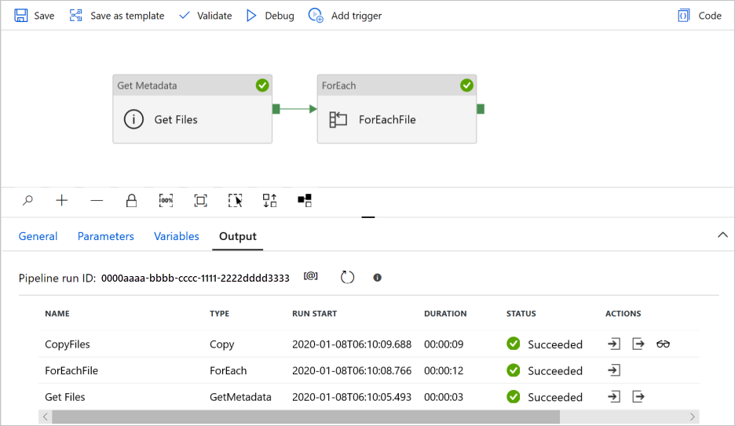

# Bulk copy from files to database

[!INCLUDE[appliesto-adf-xxx-md](includes/appliesto-adf-xxx-md.md)]

This article describes a solution template that you can use to copy data in bulk from Azure Data Lake Storage Gen2 to Azure Synapse Analytics / Azure SQL Database.

## About this solution template

This template retrieves files from Azure Data Lake Storage Gen2 source. Then it iterates over each file in the source and copies the file to the destination data store. 

Currently this template only supports copying data in **DelimitedText** format. Files in other data formats can also be retrieved from source data store, but can not be copied to the destination data store.  

The template contains three activities:
- **Get Metadata** activity retrieves files from Azure Data Lake Storage Gen2, and passes them to subsequent *ForEach* activity.
- **ForEach** activity gets files from the *Get Metadata* activity and iterates each file to the *Copy* activity.
- **Copy** activity resides in *ForEach* activity to copy each file from the source data store to the destination data store.

The template defines the following two parameters:
- *SourceContainer* is the root container path where the data is copied from in your Azure Data Lake Storage Gen2. 
- *SourceDirectory* is the directory path under the root container where the data is copied from in your Azure Data Lake Storage Gen2.

## How to use this solution template

1. Go to the **Bulk Copy from Files to Database** template. Create a **New** connection to the source Gen2 store. Be aware that "GetMetadataDataset" and "SourceDataset" are references to the same connection of your source file store.

    

2. Create a **New** connection to the sink data store that you're copying data to.

    
    
3. Select **Use this template**.

    
    
4. You would see a pipeline created as shown in the following example:

    

    > [!NOTE]
    > If you chose **Azure Synapse Analytics (formerly SQL DW)** as the data destination in **step 2** mentioned above, you must enter a connection to Azure Blob storage for staging, as required by SQL Data Warehouse Polybase. As the following screenshot shows, the template will automatically generate a *Storage Path* for your Blob storage. Check if the container has been created after the pipeline run.
        
    

5. Select **Debug**, enter the **Parameters**, and then select **Finish**.

    

6. When the pipeline run completes successfully, you would see results similar to the following example:

    

       
## Next steps

- [Introduction to Azure Data Factory](introduction.md)