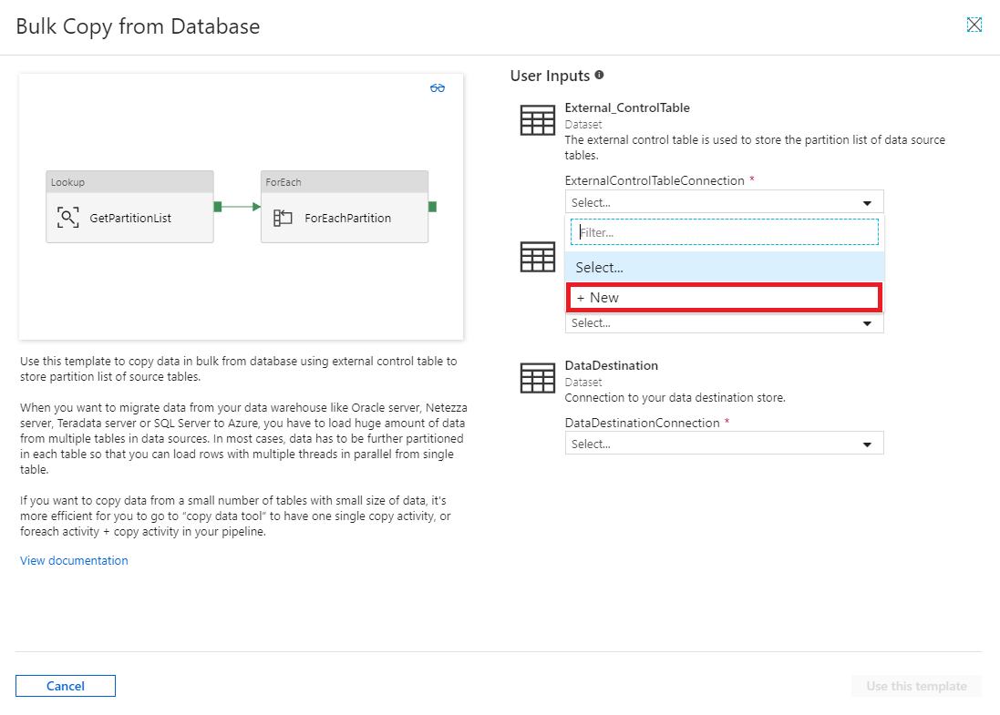
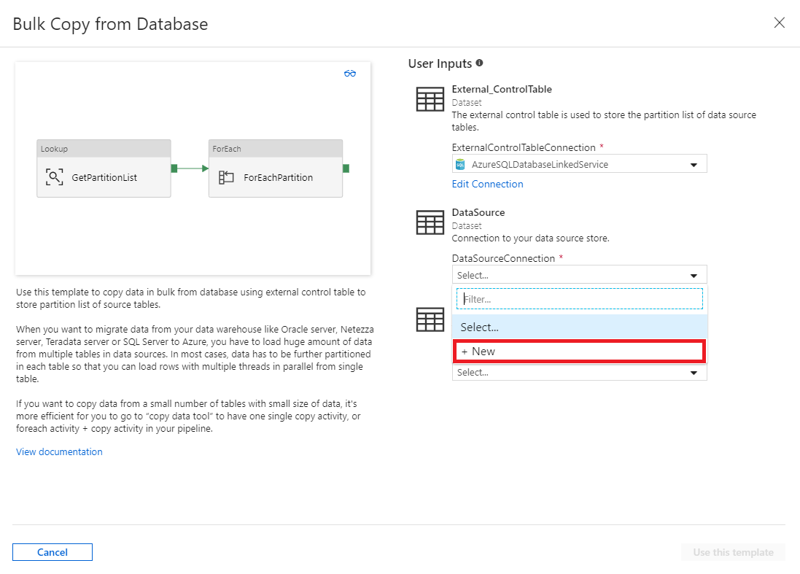
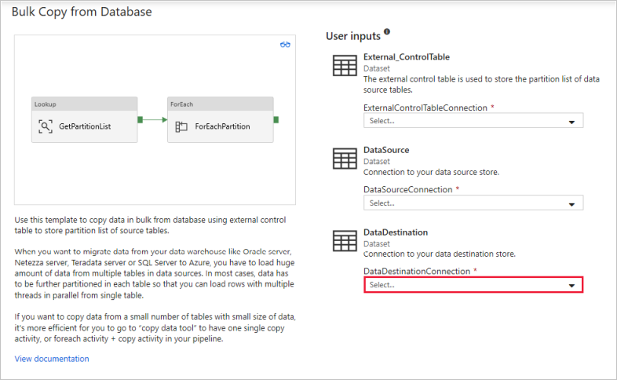
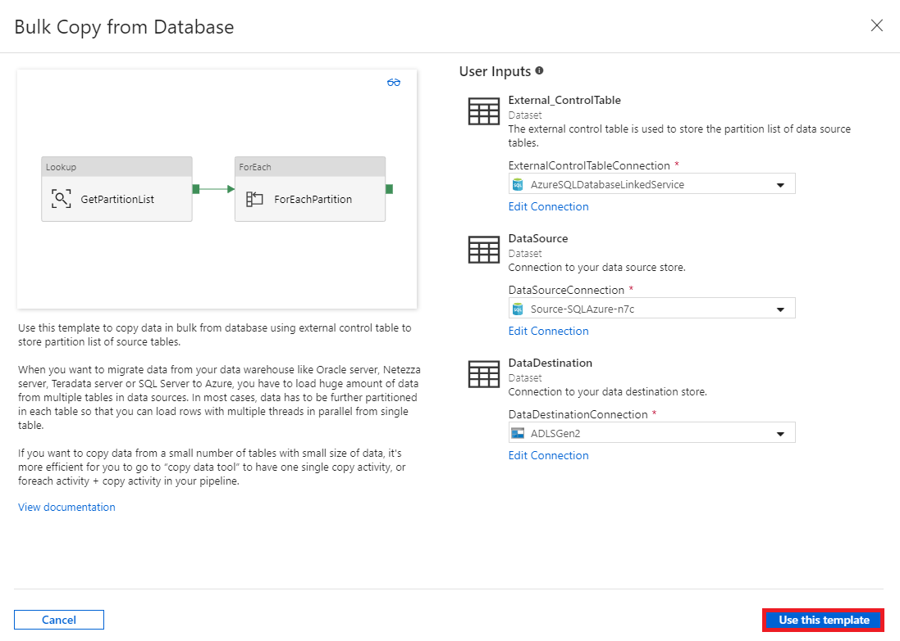
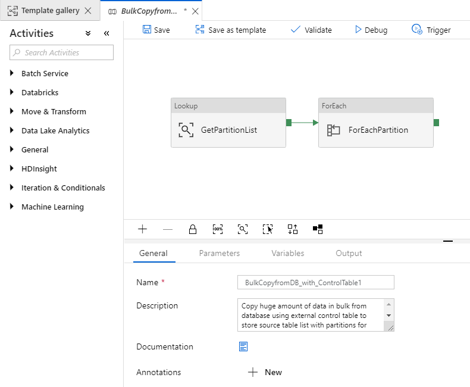
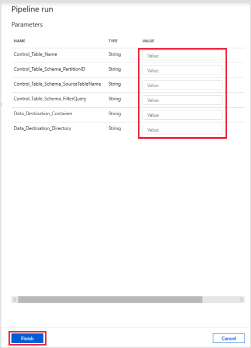
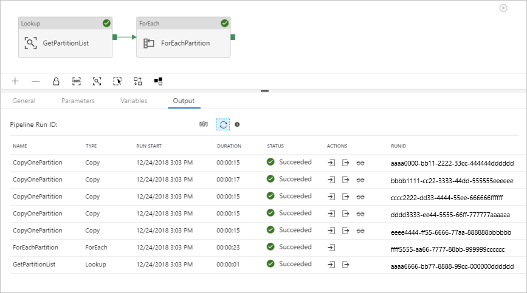
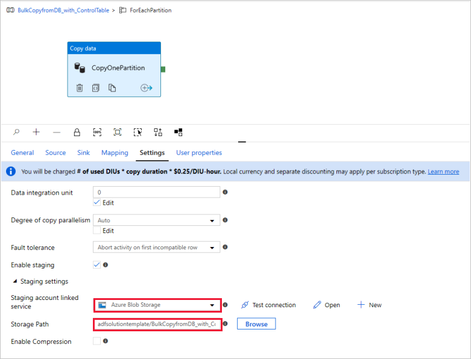

# Bulk copy from database with control table

When you want to copy data from your data warehouse like Oracle server, Netezza server, Teradata server, or SQL Server to Azure, you have to load huge amount of data from multiple tables in data sources. In most cases, data has to be further partitioned in each table so that you can load rows with multiple threads in parallel from single table. The present template is designed for that case. 

If you want to copy data from a small number of tables with small size of data, it's more efficient for you to go to “copy data tool” to have one single copy activity, or foreach activity + copy activity in your pipeline. This template is more than you need for this simple use case.

## About this solution template

This template retrieves the list of partitions of source database from an external control table that needs to be copied over to the destination store, and then iterates over each partition in the source database and performs the data copy operation.

The template contains three activities:
-   A **Lookup** activity to retrieve the list of partitions of source database from an external control table.
-   A **ForEach** activity to get the partition list from lookup activity and then iterate each of them to copy activity.
-   A **Copy** activity to copy each partition from source database store to destination store.

The template defines five parameters:
-   The parameter *Control_Table_Name* is the table name for your external control table. The control table is used to store the partition list for source database.
-   The parameter *Control_Table_Schema_PartitionID* is the column name in your external control table to store each Partition ID. Make sure the Partition ID is unique for each partition in source database.
-   The parameter *Control_Table_Schema_SourceTableName* is the column name in your external control table to store each table name from the source database.
-   The parameter *Control_Table_Schema_FilterQuery* is the column name in your external control table to store the filter query to get the data from each partition in source database. For example, if you partitioned the data by each year, the query stored in each row can be similar as ‘select * from datasource where LastModifytime >= ''2015-01-01 00:00:00'' and LastModifytime <= ''2015-12-31 23:59:59.999'''
-   The parameter *Data_Destination_Folder_Path* is the folder path where the data is copied into your destination store.  This parameter is only visible when the destination you choose is a file-based storage store.  If you choose SQL Data Warehouse as the destination store, there is no parameter required to be inputted here. But the table names and the schema in SQL data warehouse must be the same as the ones in source database.

## How to use this solution template

1. Create a control table in a SQL server or SQL Azure to store the partition list of source database for bulk copy.  From the example below, you can see there are five partitions in your source database, where three partitions are for one table:*datasource_table* and two partitions are for another table:*project_table*. The column *LastModifytime* is used to partition the data in table *datasource_table* from source database. The query used to read the first partition is 'select * from datasource_table where LastModifytime >= ''2015-01-01 00:00:00'' and LastModifytime <= ''2015-12-31 23:59:59.999'''.  You can also see the similar query to read data from other partitions. 

	 ```sql
			Create table ControlTableForTemplate
			(
			PartitionID int,
			SourceTableName  varchar(255),
			FilterQuery varchar(255)
			);

			INSERT INTO ControlTableForTemplate
			(PartitionID, SourceTableName, FilterQuery)
			VALUES
			(1, 'datasource_table','select * from datasource_table where LastModifytime >= ''2015-01-01 00:00:00'' and LastModifytime <= ''2015-12-31 23:59:59.999'''),
			(2, 'datasource_table','select * from datasource_table where LastModifytime >= ''2016-01-01 00:00:00'' and LastModifytime <= ''2016-12-31 23:59:59.999'''),
			(3, 'datasource_table','select * from datasource_table where LastModifytime >= ''2017-01-01 00:00:00'' and LastModifytime <= ''2017-12-31 23:59:59.999'''),
			(4, 'project_table','select * from project_table where ID >= 0 and ID < 1000'),
			(5, 'project_table','select * from project_table where ID >= 1000 and ID < 2000');
    ```

2. Go to template **Bulk Copy from Database**, and create a **new connection** to your external control table.  This connection is connecting to the database where you had created the control table in step #1.

    

3. Create a **new connection** to your source database where the data copy from.

     
	
4. Create a **new connection** to your destination data store where the data copy to.

    

5. Click **Use this template**.

    
	
6. You see the pipeline available in the panel, as shown in the following example:

    

7. Click **Debug**, input the parameters and then click **Finish**

    

8. You see the result available in the panel, as shown in the following example:

    

9. (Optional) If you select SQL Data Warehouse as data destination, you also need to input the connection of an Azure blob storage as a staging, which is required by SQL Data Warehouse Polybase.  Make sure the container in blob storage has already created.  
	
	
	   
## Next steps

- [Introduction to Azure Data Factory](introduction.md)