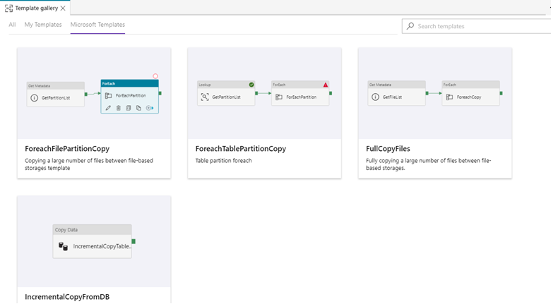
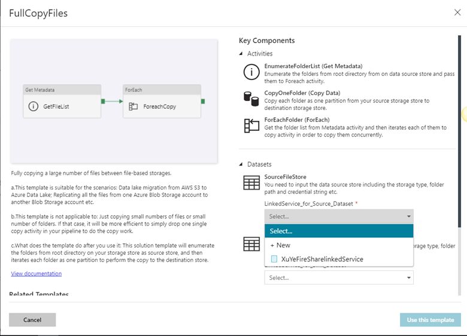
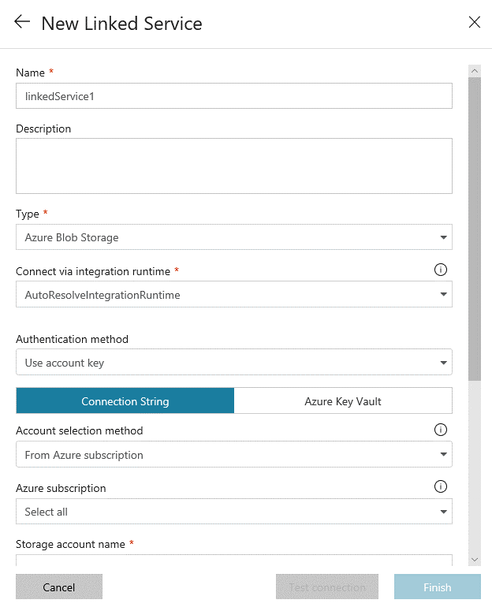
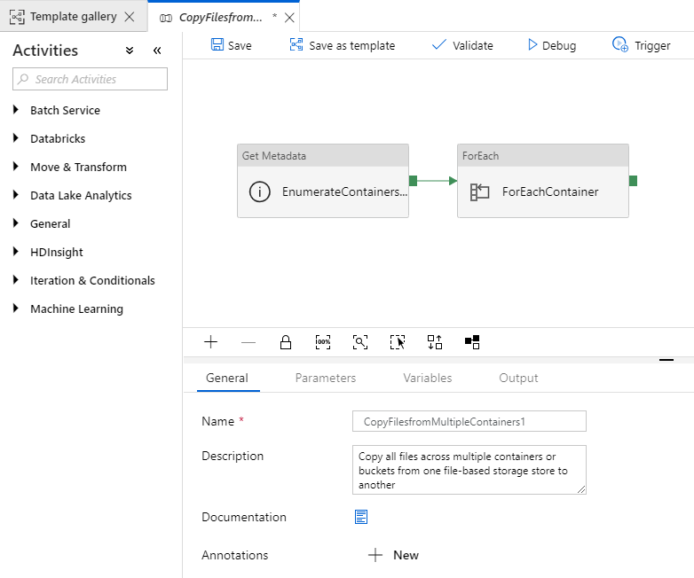
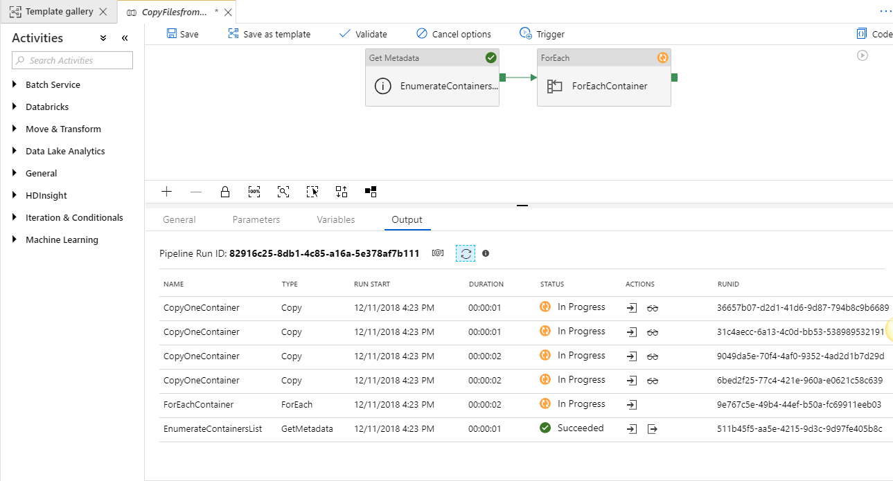

# Copy files from multiple containers with Azure Data Factory

[!INCLUDE[appliesto-adf-xxx-md](includes/appliesto-adf-xxx-md.md)]

This article describes a solution template that you can use to copy files from multiple containers between file stores. For example, you can use it to migrate your data lake from AWS S3 to Azure Data Lake Store. Or, you could use the template to replicate everything from one Azure Blob storage account to another.

> [!NOTE]
> If you want to copy files from a single container, it's more efficient to use the [Copy Data Tool](copy-data-tool.md) to create a pipeline with a single copy activity. The template in this article is more than you need for that simple scenario.

## About this solution template

This template enumerates the containers from your source storage store. It then copies those containers to the destination store.

The template contains three activities:
- **GetMetadata** scans your source storage store and gets the container list.
- **ForEach** gets the container list from the **GetMetadata** activity and then iterates over the list and passes each container to the Copy activity.
- **Copy** copies each container from the source storage store to the destination store.

The template defines the following parameters:
- *SourceFileFolder* is the folder path of your data source store, where you can get a list of the containers. The path is the root directory, which contains multiple container folders. The default value of this parameter is `sourcefolder`.
- *SourceFileDirectory* is the subfolder path under the root directory of your data source store. The default value of this parameter is `subfolder`.
- *DestinationFileFolder* is the folder path where the files will be copied to in your destination store. The default value of this parameter is `destinationfolder`.
- *DestinationFileDirectory* is the subfolder path where the files will be copied to in your destination store. The default value of this parameter is `subfolder`.

## How to use this solution template

1. Go to the **Copy multiple files containers between File Stores** template. Create a **New** connection to your source storage store. The source storage store is where you want to copy files from multiple containers from.

    

2. Create a **New** connection to your destination storage store.

    

3. Select **Use this template**.

    
	
4. You'll see the pipeline, as in the following example:

    

5. Select **Debug**, enter the **Parameters**, and then select **Finish**.

    

6. Review the result.

    

## Next steps

- [Bulk copy from a database by using a control table with Azure Data Factory](solution-template-bulk-copy-with-control-table.md)

- [Copy files from multiple containers with Azure Data Factory](solution-template-copy-files-multiple-containers.md)
