# Copy new and changed files by LastModifiedDate with Azure Data Factory

[!INCLUDE[appliesto-adf-xxx-md](includes/appliesto-adf-xxx-md.md)]

This article describes a solution template that you can use to copy new and changed files only by LastModifiedDate from a file-based store to a destination store. 

## About this solution template

This template first selects the new and changed files only by their attributes **LastModifiedDate**, and then copies those selected files from the data source store to the data destination store.

The template contains one activity:
- **Copy** to copy new and changed files only by LastModifiedDate from a file store to a destination store.

The template defines six parameters:
-  *FolderPath_Source* is the folder path where you can read the files from the source store. You need to replace the default value with your own folder path.
-  *Directory_Source* is the subfolder path where you can read the files from the source store. You need to replace the default value with your own subfolder path.
-  *FolderPath_Destination* is the folder path where you want to copy files to the destination store. You need to replace the default value with your own folder path.
-  *Directory_Destination* is the subfolder path where you want to copy files to the destination store. You need to replace the default value with your own subfolder path.
-  *LastModified_From* is used to select the files whose LastModifiedDate attribute is after or equal to this datetime value.  In order to select the new files only, which has not been copied last time, this datetime value can be the time when the pipeline was triggered last time. You can replace the default value '2019-02-01T00:00:00Z' to your expected LastModifiedDate in UTC timezone. 
-  *LastModified_To* is used to select the files whose LastModifiedDate attribute is before this datetime value. In order to select the new files only, which has not been copied last time, this datetime value can be the present time.  You can replace the default value '2019-02-01T00:00:00Z' to your expected LastModifiedDate in UTC timezone. 

## How to use this solution template

1. Go to template **Copy new files only by LastModifiedDate**. Create a **New** connection to your source storage store. The source storage store is where you want to copy files from.

    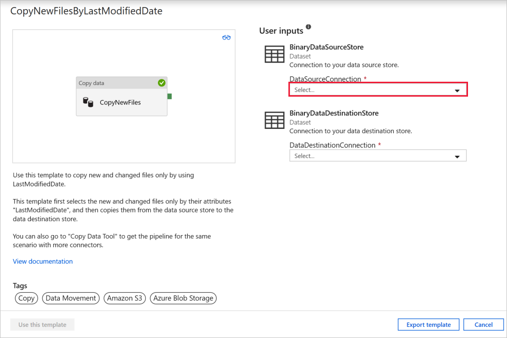
	
2. Create a **New** connection to your destination store. The destination store is where you want to copy files to. 

    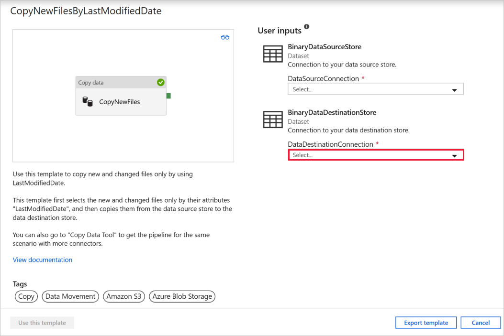

3. Select **Use this template**.

    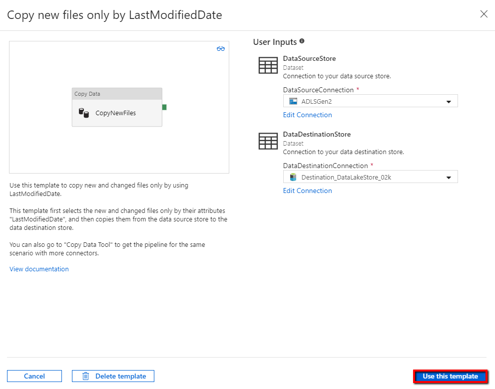
	
4. You will see the pipeline available in the panel, as shown in the following example:

    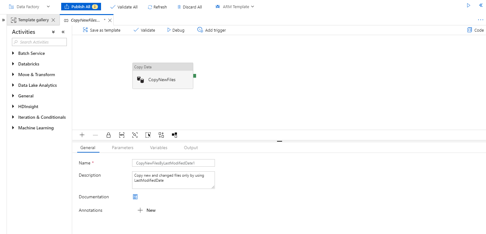

5. Select **Debug**, write the value for the **Parameters** and select **Finish**.  In the picture below, we set the parameters as following.
   - **FolderPath_Source** = sourcefolder
   - **Directory_Source** = subfolder
   - **FolderPath_Destination** = destinationfolder
   - **Directory_Destination** = subfolder
   - **LastModified_From** =  2019-02-01T00:00:00Z
   - **LastModified_To** = 2019-03-01T00:00:00Z
	
    The example is indicating that the files, which have been last modified within the timespan (**2019-02-01T00:00:00Z** to **2019-03-01T00:00:00Z**) will be copied from the source path **sourcefolder/subfolder** to the destination path **destinationfolder/subfolder**.  You can replace these with your own parameters.

    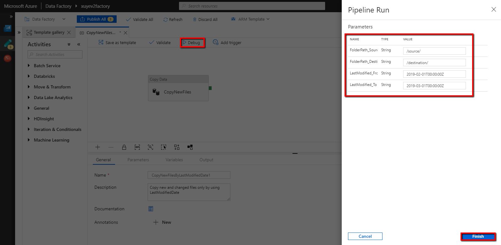

6. Review the result. You will see only the files last modified within the configured timespan has been copied to the destination store.

    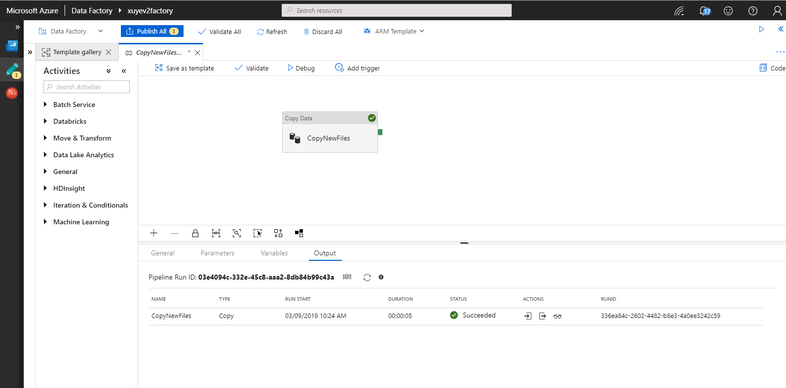
	
7. Now you can add a tumbling windows trigger to automate this pipeline, so that the pipeline can always copy new and changed files only by LastModifiedDate periodically.  Select **Add trigger**, and select **New/Edit**.

    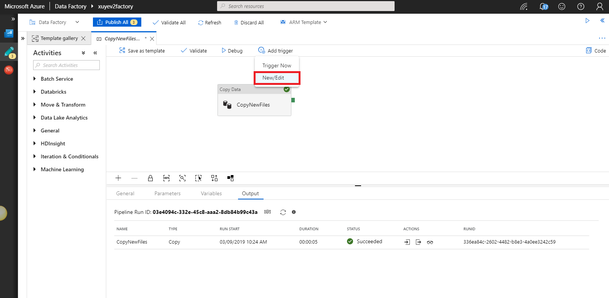
	
8. In the **Add Triggers** window, select **+ New**.

9. Select **Tumbling Window** for the trigger type, set **Every 15 minute(s)** as the recurrence (you can change to any interval time). Select **Yes** for Activated box, and then select **OK**.

    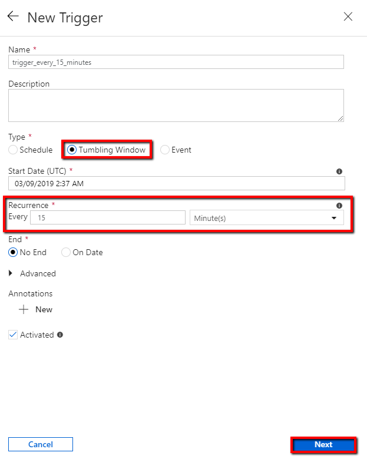	
	
10. Set the value for the **Trigger Run Parameters** as following, and select **Finish**.
    - **FolderPath_Source** = **sourcefolder**.  You can replace with your folder in source data store.
    - **Directory_Source** = **subfolder**.  You can replace with your subfolder in source data store.
    - **FolderPath_Destination** = **destinationfolder**.  You can replace with your folder in destination data store.
    - **Directory_Destination** = **subfolder**.  You can replace with your subfolder in destination data store.
    - **LastModified_From** =  **\@trigger().outputs.windowStartTime**.  It is a system variable from the trigger determining the time when the pipeline was triggered last time.
    - **LastModified_To** = **\@trigger().outputs.windowEndTime**.  It is a system variable from the trigger determining the time when the pipeline is triggered this time.
	
    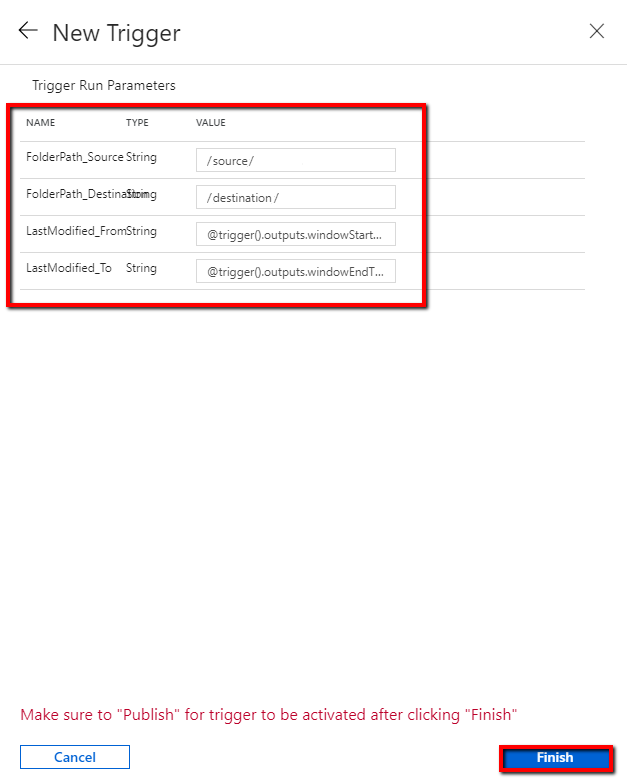
	
11. Select **Publish All**.
	
    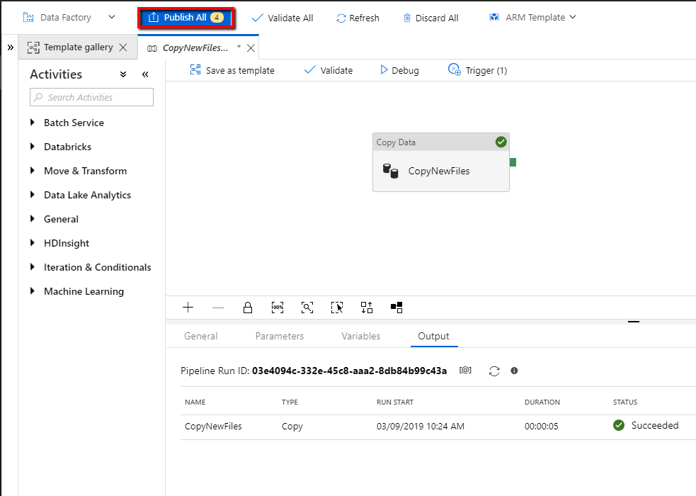

12. Create new files in your source folder of data source store.  You are now waiting for the pipeline to be triggered automatically and only the new files will be copied to the destination store.

13. Select **Monitor** tab in the left navigation panel, and wait for about 15 minutes if the recurrence of trigger has been set to every 15 minutes. 

14. Review the result. You will see your pipeline will be triggered automatically every 15 minutes, and only the new or changed files from source store will be copied to the destination store in each pipeline run.

    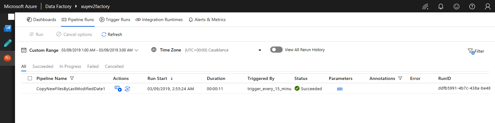
	
## Next steps

- [Introduction to Azure Data Factory](introduction.md)
