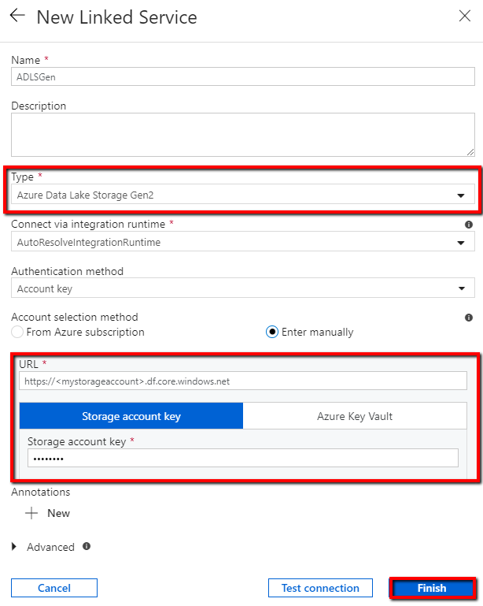
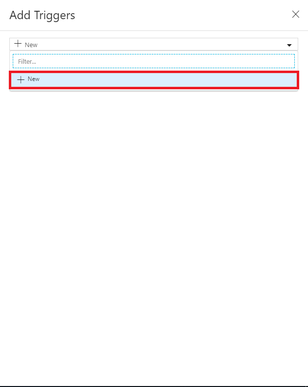
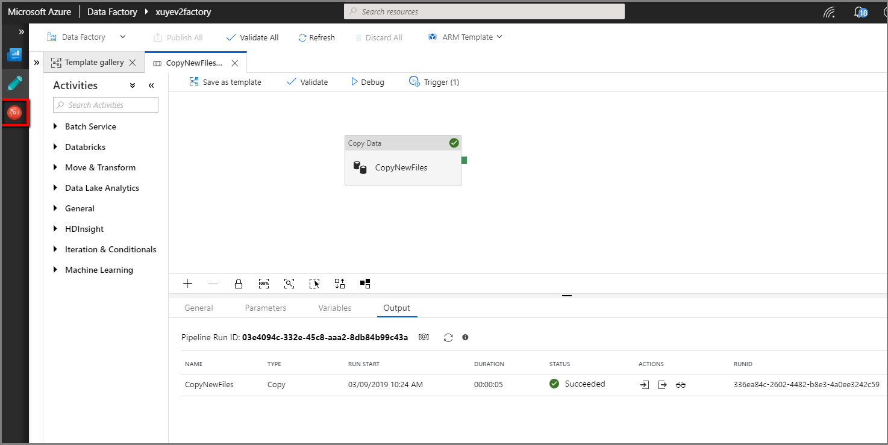

# Copy new and changed files by LastModifiedDate with Azure Data Factory

This article describes a solution template that you can use to copy new and changed files only by LastModifiedDate from a file store to a destination store. 

## About this solution template

This template first selects the new and changed files only by their attributes **LastModifiedDate**, and then copies them from the data source store to the data destination store.

The template contains one activity:
- **Copy** to copy new and changed files only by LastModifiedDate from a file store to a destination store.

The template defines four parameters:
-  *FolderPath_Source* is the path of your data source store, where you can copy new and changed files from. You need to replace the default value '/<myfolder>/<sub_folder>/' to your own folder path.
-  *FolderPath_Destination* is the path of your data destination store, where you can copy new and changed files to. You need to replace the default value '/<myfolder>/<sub_folder>/' to your own folder path.
-  *LastModified_From* is the datetime attribute to select the files whose LastModifiedDate is after or equal with this time. You need to replace the default value '2019-02-01T00:00:00Z' to your expected LastModifiedDate in UTC timezone.
-  *LastModified_To* is the datetime attribute to select the files whose LastModifiedDate is before this time. You need to replace the default value '2019-02-01T00:00:00Z' to your expected LastModifiedDate in UTC timezone.

## How to use this solution template

1. Go to template **Copy new files only by LastModifiedDate**. Create a **New** connection to your source storage store. The source storage store is where you want to copy files from.

    
	
2. First select the storage **Type**. After that input the storage **account name** and the **account key**. Finally, select **Finish**.

    
	
3. Create a **New** connection to your destination store. The destination store is where you want to copy files to. You also need input the connection information of data destination store similar as you did in step 2.

    

4. Select **Use this template**.

    
	
5. You will see the pipeline available in the panel, as shown in the following example:

    

6. Select **Debug**, input **Parameters** and select **Finish**.  In the picture below, we set the parameters as following:
	-  **FolderPath_Source** = **/source/**
    -  **FolderPath_Destination** = **/destination/**
	-  **LastModified_From** =  **2019-02-01T00:00:00Z**
    -  **LastModified_To** = **2019-03-01T00:00:00Z**
	It is saying the files which has been last modified in the time range from *2019-02-01T00:00:00Z* to *2019-03-01T00:00:00Z* will be copied from a folder */source/* to a folder */destination/*.  You can replace these with your own parameters.
	
    

7. Review the result.

    
	
8. Now you can add a tumbling windows trigger to trigger this pipeline, so that the pipeline can always copy new and changed files by LastModifiedDate periodically.  Select **Add trigger**, and select **New/Edit**.

    
	
9. Select **+ New**.

    

10. Select **Tumbling Window** for the trigger type, input ** Every 15 minute(s) ** as the recurrence, and select **Next**.

    	
	
11. Input the parameters as following, and select **Finish**.
	-  **FolderPath_Source** = **/source/**.  You can replace with your folder in source data store.
    -  **FolderPath_Destination** = **/destination/**.  You can replace with your folder in destination data store.
	-  **LastModified_From** =  **@trigger().outputs.windowStartTime**.
    -  **LastModified_To** = **@trigger().outputs.windowEndTime**.
	
    
	
12. Select **Publish All**.
	
    

13. Creat new files in your source folder of data source store.  

14. Select **Monitoring** tab in the left nevigation pannel, and wait for about 15 minutes if the recurrence of trigger has been set to every 15 minutes. 

    

15. Review the result. You will see the pipeline will be trigger automatically every 15 minutes, and only the new files from source store will be copied to the destination store in each pipeline run.

    
	
## Next steps

- [Introduction to Azure Data Factory](introduction.md)