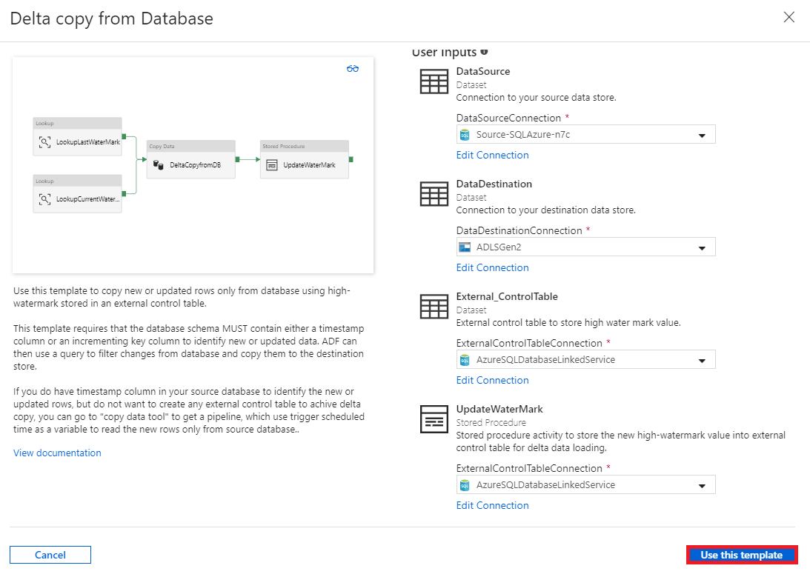

# Delta copy from database with control table

When you want to incrementally load changes (new or updated rows) only from a table in a database to Azure with an external control table storing the high-watermark value.  The present template is designed for that case. 

This template requires the schema of source database MUST containing timestamp column or incrementing key to identify the new or updated rows.

If you do have timestamp column in your source database to identify the new or updated rows, but do not want to create an external control table to enable delta copy, you can use the Copy Data tool to get a pipeline, which uses a trigger-scheduled time as a variable to read the new rows only from source database.

## About this solution template

This template always retrieves the old watermark value first, and then compares it with the current watermark value. After that, it only copies the changes from the source database based on the comparison between 2 watermark values.  When complete, it stores the new high-watermark value to an external control table for delta data loading next time.

The template contains four activities:
-   A **Lookup** activity to retrieve the old high-watermark value stored in an external control table.
-   A **Lookup** activity to retrieve the current high-watermark value from source database.
-   A **Copy** activity to copy the changes only from the source database to the destination store. The query used to identify the changes from source database in the copy activity is similar as 'SELECT * FROM Data_Source_Table WHERE TIMESTAMP_Column > “last high-watermark” and TIMESTAMP_Column <= “current high-watermark”'.
-   A **SqlServerStoredProcedure** activity to write the current high-watermark value to an external control table for delta copy next time.

The template defines five parameters:
-   The parameter *Data_Source_Table_Name* is the table name from source database where you want to load data from.
-   The parameter *Data_Source_WaterMarkColumn* is the column name in the source table which can be used to identify the new or updated rows. Normally, the type of this column can be datetime or INT etc.
-   The parameter *Data_Destination_Folder_Path* or *Data_Destination_Table_Name* is the place where the data is copied into your destination store.
-   The parameter *Control_Table_Table_Name* is the name of external control table to store the high-watermark value.
-   The parameter *Control_Table_Column_Name* is the column name in the external control table to store the high-watermark value.

## How to use this solution template

1. Explore the source table you want to load, and define the high-watermark column which can be used to slice the new or updated rows. Normally, the type of this column can be datetime or INT etc., and its data keeping increasing when new rows being added.  From the sample source table (table name: data_source_table) below, we can use column *LastModifytime* as the high-watermark column.

	```sql
			PersonID	Name	LastModifytime
			1	aaaa	2017-09-01 00:56:00.000
			2	bbbb	2017-09-02 05:23:00.000
			3	cccc	2017-09-03 02:36:00.000
			4	dddd	2017-09-04 03:21:00.000
			5	eeee	2017-09-05 08:06:00.000
			6	fffffff	2017-09-06 02:23:00.000
			7	gggg	2017-09-07 09:01:00.000
			8	hhhh	2017-09-08 09:01:00.000
			9	iiiiiiiii	2017-09-09 09:01:00.000
	```
	
2. Create a control table in a SQL server or SQL Azure to store the high-watermark value for delta data loading. From the example below, you can see the name of control table is *watermarktable*. Within it, the column name to store the high-watermark value is *WatermarkValue* and its type is *datetime*.

	```sql
			create table watermarktable
			(
			WatermarkValue datetime,
			);
			INSERT INTO watermarktable
			VALUES ('1/1/2010 12:00:00 AM')
	```
	
3. Create a stored procedure in the same SQL server or SQL Azure used to create control table. The stored procedure is used to write the new high-watermark value into the external control table for delta data loading next time.

	```sql
			CREATE PROCEDURE update_watermark @LastModifiedtime datetime
			AS

			BEGIN

				UPDATE watermarktable
				SET [WatermarkValue] = @LastModifiedtime 

			END
	```
	
4. Go to template **Delta copy from Database**, and create a **new connection** to your source database where the data copy from.

    

5. Create a **new connection** to your destination data store where the data copy to.

    

6. Create a **new connection** to your external control table and stored procedure.  It is connecting to the database where you had created the control table and stored procedure in step #2 and #3.

    

7. Click **Use this template**.

     
	
8. You see the pipeline available in the panel, as shown in the following example:

     

9. Click Stored Procedure activity, select **Stored procedure name**, click **import parameter** and click **Add dynamic content**.  

     	

10. Write the content **@{activity('LookupCurrentWaterMark').output.firstRow.NewWatermarkValue}** and click **Finish**.  

     		 
	 
11. Click **Debug**, input the parameters and click **Finish**.

    

12. You see the result available in the panel, as shown in the following example:

    

13. You can create new rows in your source table.  The sample sql to create new rows can be as following:

	```sql
			INSERT INTO data_source_table
			VALUES (10, 'newdata','9/10/2017 2:23:00 AM')

			INSERT INTO data_source_table
			VALUES (11, 'newdata','9/11/2017 9:01:00 AM')
	```
13. Run the pipeline again by clicking **Debug**, input the parameters and click **Finish**.

    

14. You see only new rows were copied into the destination.

15. (Optional) If you select SQL Data Warehouse as data destination, you also need to input the connection of an Azure blob storage as a staging, which is required by SQL Data Warehouse Polybase.  Please make sure the container in blob storage has already created.  
    
	
	
## Next steps

- [Introduction to Azure Data Factory](introduction.md)