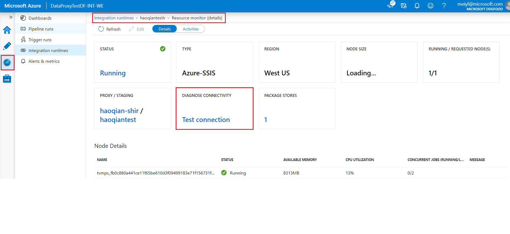
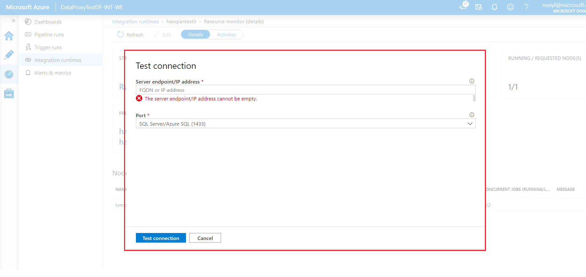

# Troubleshoot diagnose connectivity in the SSIS integration runtime

[!INCLUDE[appliesto-adf-xxx-md](includes/appliesto-adf-xxx-md.md)]

If you encounter connectivity problems while executing SSIS packages in the SSIS integration runtime, especially if your SSIS integration runtime has joined the Azure virtual network. You can try to self-diagnose problems by using this diagnose connectivity feature under the monitoring SSIS integration runtime page of the Azure Data Factory portal. 

 
 
 
This article includes the most common errors that you might find when you're testing connection in the SSIS integration runtime. It describes the potential causes and actions to solve the errors. 

## Common errors, potential causes, and recommendation solutions

### Error code: InvalidInput.
* **Error message**: Please verify your input is correct.
* **Potential causes:** Your input is incorrect.
* **Recommendation:** Please check your input.

### Error code: FirewallOrNetworkIssue.
* **Error message**: Please verify that this port is open on your firewall/server/NSG and the network is stable.
* **Potential causes:** 
  * Your server does not not open this port.
  * Your network security group is denied outbound traffic on this port
  * Your NVA/Azure firewall/On-prem firewall does not open this port.
* **Recommendation:** 
  * Open this port on the server.
  * Update the network security group to allow outbound traffic on this port.
  * Open this port on the NVA/Azure firewall/On-prem firewall.

### Error code: MisconfiguredDnsSettings.
* **Error message**: If you’re using your own DNS server in the VNet joined by your Azure-SSIS IR, please verify that it can resolve your host name.
* **Potential causes:** 
  *  The problem of custom DNS
  *  You are not using a fully qualified domain name (FQDN) for your private host name
* **Recommendation:** 
  *  Fix your custom DNS problem to make sure it can resolve the host name.
  *  Use the fully qualified domain name (FQDN) , e.g. use <your_private_server>.contoso.com instead of <your_private_server>, as Azure-SSIS IR won't automatically append your own DNS suffix.

### Error code: ServerNotAllowRemoteConenction.
* **Error message**: Please verify that your server allows remote TCP connections through this port.
* **Potential causes:** 
  *  Your server firewall does not allow remote TCP connections.
  *  Your server is not online.
* **Recommendation:** 
  *  Allow remote TCP connections on the server firewall.
  *  Start the server.
   
### Error code: MisconfiguredNsgSettings.
* **Error message**: Please verify that the NSG of your VNet allows outbound traffic through this port. If you’re using Azure ExpressRoute and or a UDR, please verify that this port is open on your firewall/server.
* **Potential causes:** 
  *  Your network security group is denied outbound traffic on this port.
  *  Your NVA/Azure firewall/On-prem firewall does not open this port.
* **Recommendation:** 
  *  Update the network security group to allow outbound traffic on this port.
  *  Open this port on the NVA/Azure firewall/On-prem firewall.

### Error code: GenericIssues.
* **Error message**: Test connection failed due to generic issues.
* **Potential causes:** The test connection encountered a general temporary problem.
* **Recommendation:** Please retry the test connection later. If retrying does not help, please contact the Azure Data Factory support team.

### Error code: PSPingExecutionTimeout.
* **Error message**: Test connection timeout, please try again later.
* **Potential causes:** Test connectivity timed out.
* **Recommendation:** Please retry the test connection later. If retrying does not help, please contact the Azure Data Factory support team.

### Error code: NetworkInstable.
* **Error message**: Test connection irregularly succeeded due to network instability.
* **Potential causes:** Transient network issue.
* **Recommendation:** Please check whether the server or firewall network is stable.

## Next steps

- Deploy your packages. For more info, see [Deploy an SSIS project to Azure with SSMS](https://docs.microsoft.com/sql/integration-services/ssis-quickstart-deploy-ssms).
- Run your packages. For more info, see [Run SSIS packages in Azure with SSMS](https://docs.microsoft.com/sql/integration-services/ssis-quickstart-run-ssms).
- Schedule your packages. For more info, see [Schedule SSIS packages in Azure](https://docs.microsoft.com/sql/integration-services/lift-shift/ssis-azure-schedule-packages-ssms?view=sql-server-ver15).

