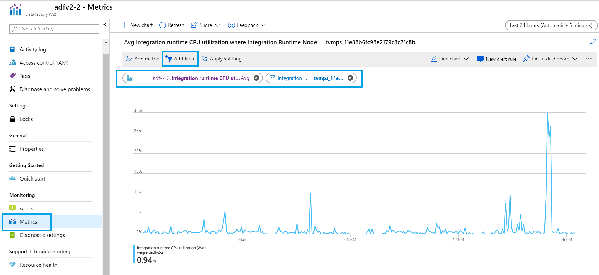

# Troubleshooting package execution in SSIS integration runtime

This article includes the most common errors that you might hit when executing SSIS packages in SSIS Integration Runtime, the potential causes, and actions to solve the errors.

## Where can I find logs for troubleshoot

* The ADF Portal can be used to check the output of the SSIS Package Execution Activity including the execution result, error messages, and operation ID. Details can be found at [Monitor the pipeline](how-to-invoke-ssis-package-ssis-activity.md#monitor-the-pipeline)

* The SSIS Catalog (SSISDB) can be used to check the detail logs for the execution. Detail can be found at [Monitor Running Packages and Other Operations](https://docs.microsoft.com/sql/integration-services/performance/monitor-running-packages-and-other-operations?view=sql-server-2017)

## Common errors, causes, and solution

### Error message: `"Connection Timeout Expired."` or `"The service has encountered an error processing your request. Please try again."`

* Potential cause & recommended action:
  * The Data Source/Destination is overloaded. Check the load on your Data Source/Destination and see whether it has enough capacity. For example, if Azure SQL is used, it's suggested to consider scale up if the Database is likely to time out.
  * The network between SSIS Integration Runtime and the Data Source/Destination is unstable, especially when the connection is cross-region or between on-premise and azure. It's suggested to apply retry pattern in SSIS Package by following steps:
    * Make sure your SSIS Packages can rerun on failure without side effect (For example. data loss, data dup...)
    * Configure the **Retry** and **Retry interval** of Execute SSIS Package Activity in the General Tab
 
    * For ADO.NET and OLEDB Source/Destination component, ConnectRetryCount and ConnectRetryInterval can be set in the Connection Manager in SSIS package or SSIS Activity

### Error message: `"ADO NET Source has failed to acquire the connection '...' with the following error message: "A network-related or instance-specific error occurred while establishing a connection to SQL Server. The server was not found or was not accessible."`

* Potential cause & recommended action:
  * This issue usually means the Data Source/Destination is inaccessible from SSIS Integration Runtime, which can be caused by different reasons:
    * Make sure you're passing the Data Source/Destination Name/IP correctly
    * Make sure the firewall is set properly
    * Make sure your vNet is configured properly if your Data Source/Destination are in on-premise.
      * You can verify whether the issue is from vNet configuration by provisioning an Azure VM in the same vNet. And then check whether the Data Source/Destination can be accessed from the Azure VM
      * You can find more details about using vNet with SSIS Integration Runtime at [Join an Azure-SSIS integration runtime to a virtual network](join-azure-ssis-integration-runtime-virtual-network.md)

### Error message: "`ADO NET Source has failed to acquire the connection '...' with the following error message: "Could not create a managed connection manager.`"

* Potential cause & recommended action:
  * The ADO.NET provider used in the package isn't installed in SSIS Integration Runtime. You can install the provider by using the Custom Setup. More details about Custom Setup can be found in [Customize setup for the Azure-SSIS integration runtime](how-to-configure-azure-ssis-ir-custom-setup.md)

### Error message: "`The connection '...' is not found`"

* Potential cause & recommended action:
  * This error may be because a known issue in old version SSMS. If the package contains a custom component (For example, SSIS Azure Feature Pack or 3rd party components) which isn't installed on the machine where SSMS is used to do the deployment, the component will be removed by SSMS and cause the error. Upgrade [SSMS](https://docs.microsoft.com/sql/ssms/download-sql-server-management-studio-ssms) to the latest version that has the issue fixed.

### Error message：“SSIS Executor exit code: -1073741819.”

* Potential cause & recommended action:
  * Package execution may fail with this exit code when multiple Excel source components are executing concurrently to retrieve data. You can workaround this limitation by change your Excel components to execute in sequence, or separate them into different packages.

### Error message: "There is not enough space on the disk"

* Potential cause & recommended action:
  * This error means the local disk is used up in SSIS Integration Runtime node. Check whether your package or Custom Setup would consume many disk spaces.
    * If the disk is consumed by your package, it will be freed up after the package execution finishes.
    * If the disk is consumed by your Custom Setup, you'll need to stop SSIS Integration Runtime, modify your Script, and start the SSIS Integration Runtime again. The whole Azure Blob Container you specified for Custom Setup will be copied over to SSIS IR node, so verify whether there is any unnecessary content under that container.

### Error message: "Failed to retrieve resource from master. Microsoft.SqlServer.IntegrationServices.Scale.ScaleoutContract.Common.MasterResponseFailedException: Code:300004. Description:Load file "***" failed."

* Potential cause & recommended action:
  * If the SSIS Activity is executing package from file system (package file or project file), this error will occur if the project, package or configuration file is not accessible with the package access credential you provided in the SSIS Activity
    * If you are using Azure File:
      * The file path should start with \\\\\<storage account name\>.file.core.windows.net\\\<file share path\>
      * The domain should be "Azure"
      * The username should be \<storage account name\>
      * The password should be \<storage access key\>
    * If your are using on-premise file, please check if VNet, package access credential and permission are configured properly so that your Azure-SSIS integration runtime can access your on-premise file share

### Error message: "The file name '...' specified in the connection was not valid"

* Potential cause & recommended action:
  * An invalid file name is specified
  * Make sure you are using FQDN (Fully Qualified Domain Name) instead of short time in your connection manager

### Error message: "Cannot open file '...'"

* Potential cause & recommended action:
  * This error occurs when package execution can't find file in local disk in SSIS Integration Runtime.
    * It's not suggested to use absolute path in package executing in SSIS Integration Runtime. Use current execution working directory (.) or temp folder (%TEMP%) instead.
    * If it's needed to persist some files on SSIS Integration Runtime nodes, it's suggested to prepare the files through [Customize Setup](how-to-configure-azure-ssis-ir-custom-setup.md). All the files in the execution working directory will be cleaned up after the execution is finished.
    * Another option is to use Azure File instead of storing the file in SSIS Integration Runtime node. More detail can be found at [https://docs.microsoft.com/sql/integration-services/lift-shift/ssis-azure-files-file-shares?view=sql-server-2017#use-azure-file-shares](https://docs.microsoft.com/sql/integration-services/lift-shift/ssis-azure-files-file-shares?view=sql-server-2017#use-azure-file-shares).

### Error message: "The database 'SSISDB' has reached its size quota"

* Potential cause & recommended action:
  * The SSISDB created in the Azure SQL or Managed Instance when creating SSIS Integration Runtime has reached its quota.
    * Consider increasing the DTU of your Database to resolve this issue. Details can be found at [https://docs.microsoft.com/azure/sql-database/sql-database-resource-limits-logical-server](https://docs.microsoft.com/azure/sql-database/sql-database-resource-limits-logical-server)
    * Check whether your Package would generate many logs. If so, elastic job can be configured to clean up these logs. Refer to [Clean up SSISDB logs with Azure Elastic Database Jobs](how-to-clean-up-ssisdb-logs-with-elastic-jobs.md) for detail.

### Error message: "The request limit for the database is ... and has been reached."

* Potential cause & recommended action:
  * If many packages are executing in parallel in SSIS Integration Runtime, this error may occur because the request limitation of SSISDB is hit. Consider increasing the DTC of your SSISDB to resolve this issue. Details can be found at [https://docs.microsoft.com/azure/sql-database/sql-database-resource-limits-logical-server](https://docs.microsoft.com/azure/sql-database/sql-database-resource-limits-logical-server)

### Error message: "SSIS Operation failed with unexpected operation status: ..."

* Potential cause & recommended action:
  * The error is mostly caused by a transient error, so try to rerun the package execution. It's suggested to apply retry pattern in SSIS Package by following steps:
    * Make sure your SSIS Packages can rerun on failure without side effect(For example, data loss, data dup...)
    * Configure the **Retry** and **Retry interval** of Execute SSIS Package Activity in the General Tab
 
    * For ADO.NET and OLEDB Source/Destination component, ConnectRetryCount and ConnectRetryInterval can be set in the Connection Manager in SSIS package or SSIS Activity

### Error message: "There is no active worker."

* Potential cause & recommended action:
  * This error usually means the SSIS Integration Runtime is in an unhealthy status. Check Azure portal for the status and detail errors: [https://docs.microsoft.com/azure/data-factory/monitor-integration-runtime#azure-ssis-integration-runtime](https://docs.microsoft.com/azure/data-factory/monitor-integration-runtime#azure-ssis-integration-runtime)

### Error message: "Your integration runtime cannot be upgraded and will eventually stop working, since we cannot access the Azure Blob container you provided for custom setup."

* This error occurs when SSIS Integration Runtime can't access the storage configured for Custom Setup. Check whether the SAS Uri you provided is valid and hasn't expired.

### Error message: "Microsoft OLE DB Provider for Analysis Services. 'Hresult: 0x80004005 Description:' COM error: COM error: mscorlib; Exception has been thrown by the target of an invocation"

* Potential cause & recommended action:
  * One potential cause is that username/password with MFA enabled is configured for Azure Analysis Services authentication, which is not supported in SSIS integration runtime yet. Try to use Service Principal for Azure Analysis Service authentication:
    1. Prepare service principal for AAS [https://docs.microsoft.com/azure/analysis-services/analysis-services-service-principal](https://docs.microsoft.com/azure/analysis-services/analysis-services-service-principal)
    2. In connection manager, configure “Use a specific user name and password”: set "AppID" as user name and "clientSecret" as password

### Error message: "ADONET Source has failed to acquire the connection {GUID} with the following error message: Login failed for user 'NT AUTHORITY\ANONYMOUS LOGON'" when using managed identity

* Potential cause & recommended action:
  * Make sure you don't configure the authentication method of connection manager as "Active Directory Password Authentication" when the parameter "ConnectUsingManagedIdentity" is True. You can configure it as "SQL Authentication" instead which would be ignored if "ConnectUsingManagedIdentity" is set

### Package takes unexpected long time to execute

* Potential cause & recommended action:
  * Too many package executions have been scheduled on the SSIS Integration Runtime. In this case, all these executions will be waiting in a queue for their turn to execute.
    * Max Parallel Execution Count per IR = Node Count * Max Parallel Execution per Node
    * Refer to [Create Azure-SSIS Integration Runtime in Azure Data Factory](create-azure-ssis-integration-runtime.md) for how to set the Node Count and Max Parallel Execution per Node.
  * SSIS Integration Runtime is stopped or in an unhealthy status. Check [Azure-SSIS integration runtime](monitor-integration-runtime.md#azure-ssis-integration-runtime) for how to check the SSIS Integration Runtime status and errors.
  * It's suggested to set the timeout if you're sure the package execution should be finished in a certain time:
 

### Poor performance in package execution

* Potential cause & recommended action:

  * Check if the SSIS Integration Runtime is in the same region as the Data Source and Destination.

  * Enable "Performance" Logging Level

      You can set the Logging Level of package execution to "Performance" to collect more detail duration information for each component in the execution. Details can be found at: [https://docs.microsoft.com/sql/integration-services/performance/integration-services-ssis-logging](https://docs.microsoft.com/sql/integration-services/performance/integration-services-ssis-logging)

  * Check IR node performance in IR monitor page in Azure portal.
    * How to monitor SSIS Integration Runtime: [Azure-SSIS integration runtime](monitor-integration-runtime.md#azure-ssis-integration-runtime)
    * The history CPU/Memory usage of SSIS Integration Runtime is available at the Metrics of the Data Factory in Azure portal

