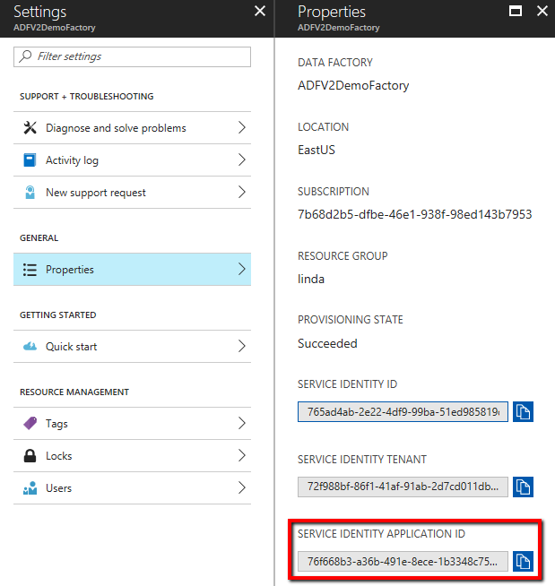

# Store credential in Azure Key Vault

You can store credentials for data stores in an [Azure Key Vault](../key-vault/key-vault-whatis.md). Azure Data Factory retrieves the credentials when executing an activity that uses the data store. Currently, only [Dynamics connector](connector-dynamics-crm-office-365.md) support this feature.

> [!NOTE]
> This article applies to version 2 of Data Factory, which is currently in preview. If you are using version 1 of the Data Factory service, which is in general availability (GA), see [documenttion for Data Factory version1](v1/data-factory-introduction.md).

## Steps

When creating a data factory, a service identity can be created along with factory creation. The service identity is a managed application registered to Azure Activity Directory, and represents this specific data factory.

- When creating data factory through **Azure portal or PowerShell**, service identity will always be created automatically since public preview.
- When creating data factory through **SDK**, service identity will be created only if you specify "Identity = new FactoryIdentity()" in the factory object for creation. See example from [.NET quickstart - create data factory](quickstart-create-data-factory-dot-net.md#create-a-data-factory).
- When creating data factory through **REST API**, service identity will be created only if you specify "identity" section in request body. See example from [REST quickstart - create data factory](quickstart-create-data-factory-rest-api.md#create-a-data-factory).

To reference a credential stored in Azure Key Vault, you need to:

1. Copy the "SERVICE IDENTITY APPLICATION ID" generated along with your data factory. Refer to [retrieve service identity](#retrieve-service-identity).
2. Grant the service identity access to your Azure Key Vault. In your key vault -> Access control -> Add -> search this service identity application ID to add Reader permission. It allows this designated factory to access secret in key vault.
3. Create a linked service pointing to your Azure Key Vault. Refer to [Azure Key Vault linked service](#azure-key-vault-linked-service).
4. Create data store linked service, inside which reference the corresponding secret stored in key vault. Refer to [reference credential stored in key vault](#reference-credential-stored-in-key-vault).

## Retrieve service identity

You can retrieve the service identity from Azure portal or programmatically. The following sections show some samples.

>[!TIP]
> If you don't see the service identity, [generate service identity](#generate-service-identity) by updating your factory.

### Using Azure portal

You can find the service identity information from Azure portal -> your data factory -> Settings -> Properties:

- SERVICE IDENTITY ID
- SERVICE IDENTITY TENANT
- **SERVICE IDENTITY APPLICATION ID** > copy this value to grant access in Key Vault



### Using PowerShell

The service identity principal ID and tenant ID will be returned when you get a specific data factory as follows:

```powershell
PS C:\WINDOWS\system32> (Get-AzureRmDataFactoryV2 -ResourceGroupName <resourceGroupName> -Name <dataFactoryName>).Identity

PrincipalId                          TenantId
-----------                          --------
765ad4ab-XXXX-XXXX-XXXX-51ed985819dc 72f988bf-XXXX-XXXX-XXXX-2d7cd011db47
```

Copy the principal ID, then run below Azure Active Directory command with principal ID as parameter to get the **ApplicationId**, which you use to grant access in Key Vault:

```powershell
PS C:\WINDOWS\system32> Get-AzureRmADServicePrincipal -ObjectId 765ad4ab-XXXX-XXXX-XXXX-51ed985819dc

ServicePrincipalNames : {76f668b3-XXXX-XXXX-XXXX-1b3348c75e02, https://identity.azure.net/P86P8g6nt1QxfPJx22om8MOooMf/Ag0Qf/nnREppHkU=}
ApplicationId         : 76f668b3-XXXX-XXXX-XXXX-1b3348c75e02
DisplayName           : ADFV2DemoFactory
Id                    : 765ad4ab-XXXX-XXXX-XXXX-51ed985819dc
Type                  : ServicePrincipal
```

## Azure Key Vault linked service

The following properties are supported for Azure Key Vault linked service:

| Property | Description | Required |
|:--- |:--- |:--- |
| type | The type property must be set to: **AzureKeyVault**. | Yes |
| baseUrl | Specify the Azure Key Vault URL. | Yes |

**Example:**

```json
{
    "name": "AzureKeyVaultLinkedService",
    "properties": {
        "type": "AzureKeyVault",
        "typeProperties": {
        "baseUrl": "https://<azureKeyVaultName>.vault.azure.net"
        }
    }
}
```

## Reference credential stored in key vault

The following properties are supported when you configure a field in linked service referencing a key vault secret:

| Property | Description | Required |
|:--- |:--- |:--- |
| type | The type property of the field must be set to: **AzureKeyVaultSecret**. | Yes |
| secretName | The name of secret in azure key vault. | Yes |
| secretVersion | The version of secret in azure key vault.<br/>If not specified, it always uses the latest version of the secret.<br/>If specified, then it sticks to the given version.| No |
| store | Refers to an Azure Key Vault linked service that you use to store the credential. | Yes |

**Example: (see the "password" section)**

```json
{
    "name": "DynamicsLinkedService",
    "properties": {
        "type": "Dynamics",
        "typeProperties": {
            "deploymentType": "<>",
            "organizationName": "<>",
            "authenticationType": "<>",
            "username": "<>",
            "password": {
                "type": "AzureKeyVaultSecret",
                "secretName": "mySecret",
                "store":{
                    "linkedServiceName": "<Azure Key Vault linked service>",
                    "type": "LinkedServiceReference"
                }
            }
        }
    }
}
```

## Generate service identity

If you find your data factory doesn't have a service identity associated following [retrieve service identity](#retrieve-service-identity) instruction, you can generate one by updating the data factory with identity initiator programmatically.

> [!NOTE]
> - **Service identity cannot be changed**. Updating a data factory which already have a service identity won't have any impact, the service identity will be kept unchanged.
> - **Service identity cannot be deleted**. If you update a data factory which already have a service identity, without specifying "identity" parameter in the factory object or without specifying "identity" section in REST request body, you will get an error.

The following sections show some samples on generating service identity for your factory if it does not exist.

### Using PowerShell

Call **Set-AzureRmDataFactoryV2** command again, then you see "Identity" fields being newly generated:

```powershell
PS C:\WINDOWS\system32> Set-AzureRmDataFactoryV2 -ResourceGroupName <resourceGroupName> -Name <dataFactoryName> -Location <region>

DataFactoryName   : ADFV2DemoFactory
DataFactoryId     : /subscriptions/<subsID>/resourceGroups/<resourceGroupName>/providers/Microsoft.DataFactory/factories/ADFV2DemoFactory
ResourceGroupName : <resourceGroupName>
Location          : East US
Tags              : {}
Identity          : Microsoft.Azure.Management.DataFactory.Models.FactoryIdentity
ProvisioningState : Succeeded
```

### Using REST API

Call below API with "identity" section in the request body:

```
PATCH https://management.azure.com/subscriptions/<subsID>/resourceGroups/<resourceGroupName>/providers/Microsoft.DataFactory/factories/<data factory name>?api-version=2017-09-01-preview
```

**Request body**: add "identity": { "type": "SystemAssigned" }.

```json
{
    "name": "<dataFactoryName>",
    "location": "<region>",
    "properties": {},
    "identity": {
        "type": "SystemAssigned"
    }
}
```

**Response**: service identity is created automatically, and "identity" section is populated accordingly.

```json
{
    "name": "ADFV2DemoFactory",
    "tags": {},
    "properties": {
        "provisioningState": "Succeeded",
        "loggingStorageAccountKey": "**********",
        "createTime": "2017-09-26T04:10:01.1135678Z",
        "version": "2017-09-01-preview"
    },
    "identity": {
        "type": "SystemAssigned",
        "principalId": "765ad4ab-XXXX-XXXX-XXXX-51ed985819dc",
        "tenantId": "72f988bf-XXXX-XXXX-XXXX-2d7cd011db47"
    },
    "id": "/subscriptions/<subscriptionId>/resourceGroups/<resourceGroupName>/providers/Microsoft.DataFactory/factories/ADFV2DemoFactory",
    "type": "Microsoft.DataFactory/factories",
    "location": "EastUS"
}
```

### Using SDK

Call the data factory create_or_update function with Identity=new FactoryIdentity(). Sample code using .NET:

```csharp
Factory dataFactory = new Factory
{
    Location = <region>,
    Identity = new FactoryIdentity()
};
client.Factories.CreateOrUpdate(resourceGroup, dataFactoryName, dataFactory);
```

## Next steps
For a list of data stores supported as sources and sinks by the copy activity in Azure Data Factory, see [supported data stores](copy-activity-overview.md##supported-data-stores-and-formats).