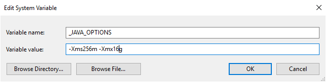

# Supported file formats and compression codecs in Azure Data Factory (legacy)

[!INCLUDE[appliesto-adf-asa-md](includes/appliesto-adf-asa-md.md)]

*This article applies to the following connectors: [Amazon S3](connector-amazon-simple-storage-service.md), [Azure Blob](connector-azure-blob-storage.md), [Azure Data Lake Storage Gen1](connector-azure-data-lake-store.md), [Azure Data Lake Storage Gen2](connector-azure-data-lake-storage.md), [Azure File Storage](connector-azure-file-storage.md), [File System](connector-file-system.md), [FTP](connector-ftp.md), [Google Cloud Storage](connector-google-cloud-storage.md), [HDFS](connector-hdfs.md), [HTTP](connector-http.md), and [SFTP](connector-sftp.md).*

>[!IMPORTANT]
>Data Factory introduced new format-based dataset model, see corresponding format article with details: <br>- [Avro format](format-avro.md)<br>- [Binary format](format-binary.md)<br>- [Delimited text format](format-delimited-text.md)<br>- [JSON format](format-json.md)<br>- [ORC format](format-orc.md)<br>- [Parquet format](format-parquet.md)<br>The rest configurations mentioned in this article are still supported as-is for backward compabitility. You are suggested to use the new model going forward. 

## <a name="text-format"></a> Text format (legacy)

>[!NOTE]
>Learn the new model from [Delimited text format](format-delimited-text.md) article. The following configurations on file-based data store dataset is still supported as-is for backward compabitility. You are suggested to use the new model going forward.

If you want to read from a text file or write to a text file, set the `type` property in the `format` section of the dataset to **TextFormat**. You can also specify the following **optional** properties in the `format` section. See [TextFormat example](#textformat-example) section on how to configure.

| Property | Description | Allowed values | Required |
| --- | --- | --- | --- |
| columnDelimiter |The character used to separate columns in a file. You can consider to use a rare unprintable character that may not  exist in your data. For example, specify "\u0001", which represents Start of Heading (SOH). |Only one character is allowed. The **default** value is **comma (',')**. <br/><br/>To use a Unicode character, refer to [Unicode Characters](https://en.wikipedia.org/wiki/List_of_Unicode_characters) to get the corresponding code for it. |No |
| rowDelimiter |The character used to separate rows in a file. |Only one character is allowed. The **default** value is any of the following values on read: **["\r\n", "\r", "\n"]** and **"\r\n"** on write. |No |
| escapeChar |The special character used to escape a column delimiter in the content of input file. <br/><br/>You cannot specify both escapeChar and quoteChar for a table. |Only one character is allowed. No default value. <br/><br/>Example: if you have comma (',') as the column delimiter but you want to have the comma character in the text (example: "Hello, world"), you can define '$' as the escape character and use string "Hello$, world" in the source. |No |
| quoteChar |The character used to quote a string value. The column and row delimiters inside the quote characters would be treated as part of the string value. This property is applicable to both input and output datasets.<br/><br/>You cannot specify both escapeChar and quoteChar for a table. |Only one character is allowed. No default value. <br/><br/>For example, if you have comma (',') as the column delimiter but you want to have comma character in the text (example: <Hello, world>), you can define " (double quote) as the quote character and use the string "Hello, world" in the source. |No |
| nullValue |One or more characters used to represent a null value. |One or more characters. The **default** values are **"\N" and "NULL"** on read and **"\N"** on write. |No |
| encodingName |Specify the encoding name. |A valid encoding name. see [Encoding.EncodingName Property](https://msdn.microsoft.com/library/system.text.encoding.aspx). Example: windows-1250 or shift_jis. The **default** value is **UTF-8**. |No |
| firstRowAsHeader |Specifies whether to consider the first row as a header. For an input dataset, Data Factory reads first row as a header. For an output dataset, Data Factory writes first row as a header. <br/><br/>See [Scenarios for using `firstRowAsHeader` and `skipLineCount`](#scenarios-for-using-firstrowasheader-and-skiplinecount) for sample scenarios. |True<br/><b>False (default)</b> |No |
| skipLineCount |Indicates the number of **non-empty** rows to skip when reading data from input files. If both skipLineCount and firstRowAsHeader are specified, the lines are skipped first and then the header information is read from the input file. <br/><br/>See [Scenarios for using `firstRowAsHeader` and `skipLineCount`](#scenarios-for-using-firstrowasheader-and-skiplinecount) for sample scenarios. |Integer |No |
| treatEmptyAsNull |Specifies whether to treat null or empty string as a null value when reading data from an input file. |**True (default)**<br/>False |No |

### TextFormat example

In the following JSON definition for a dataset, some of the optional properties are specified.

```json
"typeProperties":
{
    "folderPath": "mycontainer/myfolder",
    "fileName": "myblobname",
    "format":
    {
        "type": "TextFormat",
        "columnDelimiter": ",",
        "rowDelimiter": ";",
        "quoteChar": "\"",
        "NullValue": "NaN",
        "firstRowAsHeader": true,
        "skipLineCount": 0,
        "treatEmptyAsNull": true
    }
},
```

To use an `escapeChar` instead of `quoteChar`, replace the line with `quoteChar` with the following escapeChar:

```json
"escapeChar": "$",
```

### Scenarios for using firstRowAsHeader and skipLineCount

* You are copying from a non-file source to a text file and would like to add a header line containing the schema metadata (for example: SQL schema). Specify `firstRowAsHeader` as true in the output dataset for this scenario.
* You are copying from a text file containing a header line to a non-file sink and would like to drop that line. Specify `firstRowAsHeader` as true in the input dataset.
* You are copying from a text file and want to skip a few lines at the beginning that contain no data or header information. Specify `skipLineCount` to indicate the number of lines to be skipped. If the rest of the file contains a header line, you can also specify `firstRowAsHeader`. If both `skipLineCount` and `firstRowAsHeader` are specified, the lines are skipped first and then the header information is read from the input file

## <a name="json-format"></a> JSON format (legacy)

>[!NOTE]
>Learn the new model from [JSON format](format-json.md) article. The following configurations on file-based data store dataset is still supported as-is for backward compabitility. You are suggested to use the new model going forward.

To **import/export a JSON file as-is into/from Azure Cosmos DB**, see Import/export JSON documents section in [Move data to/from Azure Cosmos DB](connector-azure-cosmos-db.md) article.

If you want to parse the JSON files or write the data in JSON format, set the `type` property in the `format` section to **JsonFormat**. You can also specify the following **optional** properties in the `format` section. See [JsonFormat example](#jsonformat-example) section on how to configure.

| Property | Description | Required |
| --- | --- | --- |
| filePattern |Indicate the pattern of data stored in each JSON file. Allowed values are: **setOfObjects** and **arrayOfObjects**. The **default** value is **setOfObjects**. See [JSON file patterns](#json-file-patterns) section for details about these patterns. |No |
| jsonNodeReference | If you want to iterate and extract data from the objects inside an array field with the same pattern, specify the JSON path of that array. This property is supported only when copying data **from** JSON files. | No |
| jsonPathDefinition | Specify the JSON path expression for each column mapping with a customized column name (start with lowercase). This property is supported only when copying data **from** JSON files, and you can extract data from object or array. <br/><br/> For fields under root object, start with root $; for fields inside the array chosen by `jsonNodeReference` property, start from the array element. See [JsonFormat example](#jsonformat-example) section on how to configure. | No |
| encodingName |Specify the encoding name. For the list of valid encoding names, see: [Encoding.EncodingName](https://msdn.microsoft.com/library/system.text.encoding.aspx) Property. For example: windows-1250 or shift_jis. The **default** value is: **UTF-8**. |No |
| nestingSeparator |Character that is used to separate nesting levels. The default value is '.' (dot). |No |

>[!NOTE]
>For the case of cross-apply data in array into multiple rows (case 1 -> sample 2 in [JsonFormat examples](#jsonformat-example)), you can only choose to expand single array using property `jsonNodeReference`.

### JSON file patterns

Copy activity can parse the following patterns of JSON files:

- **Type I: setOfObjects**

    Each file contains single object, or line-delimited/concatenated multiple objects. When this option is chosen in an output dataset, copy activity produces a single JSON file with each object per line (line-delimited).

    * **single object JSON example**

        ```json
        {
            "time": "2015-04-29T07:12:20.9100000Z",
            "callingimsi": "466920403025604",
            "callingnum1": "678948008",
            "callingnum2": "567834760",
            "switch1": "China",
            "switch2": "Germany"
        }
        ```

    * **line-delimited JSON example**

        ```json
        {"time":"2015-04-29T07:12:20.9100000Z","callingimsi":"466920403025604","callingnum1":"678948008","callingnum2":"567834760","switch1":"China","switch2":"Germany"}
        {"time":"2015-04-29T07:13:21.0220000Z","callingimsi":"466922202613463","callingnum1":"123436380","callingnum2":"789037573","switch1":"US","switch2":"UK"}
        {"time":"2015-04-29T07:13:21.4370000Z","callingimsi":"466923101048691","callingnum1":"678901578","callingnum2":"345626404","switch1":"Germany","switch2":"UK"}
        ```

    * **concatenated JSON example**

        ```json
        {
            "time": "2015-04-29T07:12:20.9100000Z",
            "callingimsi": "466920403025604",
            "callingnum1": "678948008",
            "callingnum2": "567834760",
            "switch1": "China",
            "switch2": "Germany"
        }
        {
            "time": "2015-04-29T07:13:21.0220000Z",
            "callingimsi": "466922202613463",
            "callingnum1": "123436380",
            "callingnum2": "789037573",
            "switch1": "US",
            "switch2": "UK"
        }
        {
            "time": "2015-04-29T07:13:21.4370000Z",
            "callingimsi": "466923101048691",
            "callingnum1": "678901578",
            "callingnum2": "345626404",
            "switch1": "Germany",
            "switch2": "UK"
        }
        ```

- **Type II: arrayOfObjects**

    Each file contains an array of objects.

    ```json
    [
        {
            "time": "2015-04-29T07:12:20.9100000Z",
            "callingimsi": "466920403025604",
            "callingnum1": "678948008",
            "callingnum2": "567834760",
            "switch1": "China",
            "switch2": "Germany"
        },
        {
            "time": "2015-04-29T07:13:21.0220000Z",
            "callingimsi": "466922202613463",
            "callingnum1": "123436380",
            "callingnum2": "789037573",
            "switch1": "US",
            "switch2": "UK"
        },
        {
            "time": "2015-04-29T07:13:21.4370000Z",
            "callingimsi": "466923101048691",
            "callingnum1": "678901578",
            "callingnum2": "345626404",
            "switch1": "Germany",
            "switch2": "UK"
        }
    ]
    ```

### JsonFormat example

**Case 1: Copying data from JSON files**

**Sample 1: extract data from object and array**

In this sample, you expect one root JSON object maps to single record in tabular result. If you have a JSON file with the following content:

```json
{
    "id": "ed0e4960-d9c5-11e6-85dc-d7996816aad3",
    "context": {
        "device": {
            "type": "PC"
        },
        "custom": {
            "dimensions": [
                {
                    "TargetResourceType": "Microsoft.Compute/virtualMachines"
                },
                {
                    "ResourceManagementProcessRunId": "827f8aaa-ab72-437c-ba48-d8917a7336a3"
                },
                {
                    "OccurrenceTime": "1/13/2017 11:24:37 AM"
                }
            ]
        }
    }
}
```

and you want to copy it into an Azure SQL table in the following format, by extracting data from both objects and array:

| ID | deviceType | targetResourceType | resourceManagementProcessRunId | occurrenceTime |
| --- | --- | --- | --- | --- |
| ed0e4960-d9c5-11e6-85dc-d7996816aad3 | PC | Microsoft.Compute/virtualMachines | 827f8aaa-ab72-437c-ba48-d8917a7336a3 | 1/13/2017 11:24:37 AM |

The input dataset with **JsonFormat** type is defined as follows: (partial definition with only the relevant parts). More specifically:

- `structure` section defines the customized column names and the corresponding data type while converting to tabular data. This section is **optional** unless you need to do column mapping. For more information, see [Map source dataset columns to destination dataset columns](copy-activity-schema-and-type-mapping.md).
- `jsonPathDefinition` specifies the JSON path for each column indicating where to extract the data from. To copy data from array, you can use `array[x].property` to extract value of the given property from the `xth` object, or you can use `array[*].property` to find the value from any object containing such property.

```json
"properties": {
    "structure": [
        {
            "name": "id",
            "type": "String"
        },
        {
            "name": "deviceType",
            "type": "String"
        },
        {
            "name": "targetResourceType",
            "type": "String"
        },
        {
            "name": "resourceManagementProcessRunId",
            "type": "String"
        },
        {
            "name": "occurrenceTime",
            "type": "DateTime"
        }
    ],
    "typeProperties": {
        "folderPath": "mycontainer/myfolder",
        "format": {
            "type": "JsonFormat",
            "filePattern": "setOfObjects",
            "jsonPathDefinition": {"id": "$.id", "deviceType": "$.context.device.type", "targetResourceType": "$.context.custom.dimensions[0].TargetResourceType", "resourceManagementProcessRunId": "$.context.custom.dimensions[1].ResourceManagementProcessRunId", "occurrenceTime": " $.context.custom.dimensions[2].OccurrenceTime"}
        }
    }
}
```

**Sample 2: cross apply multiple objects with the same pattern from array**

In this sample, you expect to transform one root JSON object into multiple records in tabular result. If you have a JSON file with the following content:

```json
{
    "ordernumber": "01",
    "orderdate": "20170122",
    "orderlines": [
        {
            "prod": "p1",
            "price": 23
        },
        {
            "prod": "p2",
            "price": 13
        },
        {
            "prod": "p3",
            "price": 231
        }
    ],
    "city": [ { "sanmateo": "No 1" } ]
}
```

and you want to copy it into an Azure SQL table in the following format, by flattening the data inside the array and cross join with the common root info:

| `ordernumber` | `orderdate` | `order_pd` | `order_price` | `city` |
| --- | --- | --- | --- | --- |
| 01 | 20170122 | P1 | 23 | `[{"sanmateo":"No 1"}]` |
| 01 | 20170122 | P2 | 13 | `[{"sanmateo":"No 1"}]` |
| 01 | 20170122 | P3 | 231 | `[{"sanmateo":"No 1"}]` |


The input dataset with **JsonFormat** type is defined as follows: (partial definition with only the relevant parts). More specifically:

- `structure` section defines the customized column names and the corresponding data type while converting to tabular data. This section is **optional** unless you need to do column mapping. For more information, see [Map source dataset columns to destination dataset columns](copy-activity-schema-and-type-mapping.md).
- `jsonNodeReference` indicates to iterate and extract data from the objects with the same pattern under **array** `orderlines`.
- `jsonPathDefinition` specifies the JSON path for each column indicating where to extract the data from. In this example, `ordernumber`, `orderdate`, and `city` are under root object with JSON path starting with `$.`, while `order_pd` and `order_price` are defined with path derived from the array element without `$.`.

```json
"properties": {
    "structure": [
        {
            "name": "ordernumber",
            "type": "String"
        },
        {
            "name": "orderdate",
            "type": "String"
        },
        {
            "name": "order_pd",
            "type": "String"
        },
        {
            "name": "order_price",
            "type": "Int64"
        },
        {
            "name": "city",
            "type": "String"
        }
    ],
    "typeProperties": {
        "folderPath": "mycontainer/myfolder",
        "format": {
            "type": "JsonFormat",
            "filePattern": "setOfObjects",
            "jsonNodeReference": "$.orderlines",
            "jsonPathDefinition": {"ordernumber": "$.ordernumber", "orderdate": "$.orderdate", "order_pd": "prod", "order_price": "price", "city": " $.city"}
        }
    }
}
```

**Note the following points:**

* If the `structure` and `jsonPathDefinition` are not defined in the Data Factory dataset, the Copy Activity detects the schema from the first object and flatten the whole object.
* If the JSON input has an array, by default the Copy Activity converts the entire array value into a string. You can choose to extract data from it using `jsonNodeReference` and/or `jsonPathDefinition`, or skip it by not specifying it in `jsonPathDefinition`.
* If there are duplicate names at the same level, the Copy Activity picks the last one.
* Property names are case-sensitive. Two properties with same name but different casings are treated as two separate properties.

**Case 2: Writing data to JSON file**

If you have the following table in SQL Database:

| ID | order_date | order_price | order_by |
| --- | --- | --- | --- |
| 1 | 20170119 | 2000 | David |
| 2 | 20170120 | 3500 | Patrick |
| 3 | 20170121 | 4000 | Jason |

and for each record, you expect to write to a JSON object in the following format:

```json
{
    "id": "1",
    "order": {
        "date": "20170119",
        "price": 2000,
        "customer": "David"
    }
}
```

The output dataset with **JsonFormat** type is defined as follows: (partial definition with only the relevant parts). More specifically, `structure` section defines the customized property names in destination file, `nestingSeparator` (default is ".") are used to identify the nest layer from the name. This section is **optional** unless you want to change the property name comparing with source column name, or nest some of the properties.

```json
"properties": {
    "structure": [
        {
            "name": "id",
            "type": "String"
        },
        {
            "name": "order.date",
            "type": "String"
        },
        {
            "name": "order.price",
            "type": "Int64"
        },
        {
            "name": "order.customer",
            "type": "String"
        }
    ],
    "typeProperties": {
        "folderPath": "mycontainer/myfolder",
        "format": {
            "type": "JsonFormat"
        }
    }
}
```

## <a name="parquet-format"></a> Parquet format (legacy)

>[!NOTE]
>Learn the new model from [Parquet format](format-parquet.md) article. The following configurations on file-based data store dataset is still supported as-is for backward compabitility. You are suggested to use the new model going forward.

If you want to parse the Parquet files or write the data in Parquet format, set the `format` `type` property to **ParquetFormat**. You do not need to specify any properties in the Format section within the typeProperties section. Example:

```json
"format":
{
    "type": "ParquetFormat"
}
```

Note the following points:

* Complex data types are not supported (MAP, LIST).
* White space in column name is not supported.
* Parquet file has the following compression-related options: NONE, SNAPPY, GZIP, and LZO. Data Factory supports reading data from Parquet file in any of these compressed formats except LZO - it uses the compression codec in the metadata to read the data. However, when writing to a Parquet file, Data Factory chooses SNAPPY, which is the default for Parquet format. Currently, there is no option to override this behavior.

> [!IMPORTANT]
> For copy empowered by Self-hosted Integration Runtime e.g. between on-premises and cloud data stores, if you are not copying Parquet files **as-is**, you need to install the **64-bit JRE 8 (Java Runtime Environment) or OpenJDK** on your IR machine. See the following paragraph with more details.

For copy running on Self-hosted IR with Parquet file serialization/deserialization, ADF locates the Java runtime by firstly checking the registry *`(SOFTWARE\JavaSoft\Java Runtime Environment\{Current Version}\JavaHome)`* for JRE, if not found, secondly checking system variable *`JAVA_HOME`* for OpenJDK.

- **To use JRE**: The 64-bit IR requires 64-bit JRE. You can find it from [here](https://go.microsoft.com/fwlink/?LinkId=808605).
- **To use OpenJDK**: it's supported since IR version 3.13. Package the jvm.dll with all other required assemblies of OpenJDK into Self-hosted IR machine, and set system environment variable JAVA_HOME accordingly.

>[!TIP]
>If you copy data to/from Parquet format using Self-hosted Integration Runtime and hit error saying "An error occurred when invoking java, message: **java.lang.OutOfMemoryError:Java heap space**", you can add an environment variable `_JAVA_OPTIONS` in the machine that hosts the Self-hosted IR to adjust the min/max heap size for JVM to empower such copy, then rerun the pipeline.



Example: set variable `_JAVA_OPTIONS` with value `-Xms256m -Xmx16g`. The flag `Xms` specifies the initial memory allocation pool for a Java Virtual Machine (JVM), while `Xmx` specifies the maximum memory allocation pool. This means that JVM will be started with `Xms` amount of memory and will be able to use a maximum of `Xmx` amount of memory. By default, ADF use min 64MB and max 1G.

### Data type mapping for Parquet files

| Data factory interim data type | Parquet Primitive Type | Parquet Original Type (Deserialize) | Parquet Original Type (Serialize) |
|:--- |:--- |:--- |:--- |
| Boolean | Boolean | N/A | N/A |
| SByte | Int32 | Int8 | Int8 |
| Byte | Int32 | UInt8 | Int16 |
| Int16 | Int32 | Int16 | Int16 |
| UInt16 | Int32 | UInt16 | Int32 |
| Int32 | Int32 | Int32 | Int32 |
| UInt32 | Int64 | UInt32 | Int64 |
| Int64 | Int64 | Int64 | Int64 |
| UInt64 | Int64/Binary | UInt64 | Decimal |
| Single | Float | N/A | N/A |
| Double | Double | N/A | N/A |
| Decimal | Binary | Decimal | Decimal |
| String | Binary | Utf8 | Utf8 |
| DateTime | Int96 | N/A | N/A |
| TimeSpan | Int96 | N/A | N/A |
| DateTimeOffset | Int96 | N/A | N/A |
| ByteArray | Binary | N/A | N/A |
| Guid | Binary | Utf8 | Utf8 |
| Char | Binary | Utf8 | Utf8 |
| CharArray | Not supported | N/A | N/A |

## <a name="orc-format"></a> ORC format (legacy)

>[!NOTE]
>Learn the new model from [ORC format](format-orc.md) article. The following configurations on file-based data store dataset is still supported as-is for backward compabitility. You are suggested to use the new model going forward.

If you want to parse the ORC files or write the data in ORC format, set the `format` `type` property to **OrcFormat**. You do not need to specify any properties in the Format section within the typeProperties section. Example:

```json
"format":
{
    "type": "OrcFormat"
}
```

Note the following points:

* Complex data types are not supported (STRUCT, MAP, LIST, UNION).
* White space in column name is not supported.
* ORC file has three [compression-related options](https://hortonworks.com/blog/orcfile-in-hdp-2-better-compression-better-performance/): NONE, ZLIB, SNAPPY. Data Factory supports reading data from ORC file in any of these compressed formats. It uses the compression codec is in the metadata to read the data. However, when writing to an ORC file, Data Factory chooses ZLIB, which is the default for ORC. Currently, there is no option to override this behavior.

> [!IMPORTANT]
> For copy empowered by Self-hosted Integration Runtime e.g. between on-premises and cloud data stores, if you are not copying ORC files **as-is**, you need to install the **64-bit JRE 8 (Java Runtime Environment) or OpenJDK** on your IR machine. See the following paragraph with more details.

For copy running on Self-hosted IR with ORC file serialization/deserialization, ADF locates the Java runtime by firstly checking the registry *`(SOFTWARE\JavaSoft\Java Runtime Environment\{Current Version}\JavaHome)`* for JRE, if not found, secondly checking system variable *`JAVA_HOME`* for OpenJDK.

- **To use JRE**: The 64-bit IR requires 64-bit JRE. You can find it from [here](https://go.microsoft.com/fwlink/?LinkId=808605).
- **To use OpenJDK**: it's supported since IR version 3.13. Package the jvm.dll with all other required assemblies of OpenJDK into Self-hosted IR machine, and set system environment variable JAVA_HOME accordingly.

### Data type mapping for ORC files

| Data factory interim data type | ORC types |
|:--- |:--- |
| Boolean | Boolean |
| SByte | Byte |
| Byte | Short |
| Int16 | Short |
| UInt16 | Int |
| Int32 | Int |
| UInt32 | Long |
| Int64 | Long |
| UInt64 | String |
| Single | Float |
| Double | Double |
| Decimal | Decimal |
| String | String |
| DateTime | Timestamp |
| DateTimeOffset | Timestamp |
| TimeSpan | Timestamp |
| ByteArray | Binary |
| Guid | String |
| Char | Char(1) |

## <a name="avro-format"></a> AVRO format (legacy)

>[!NOTE]
>Learn the new model from [Avro format](format-avro.md) article. The following configurations on file-based data store dataset is still supported as-is for backward compabitility. You are suggested to use the new model going forward.

If you want to parse the Avro files or write the data in Avro format, set the `format` `type` property to **AvroFormat**. You do not need to specify any properties in the Format section within the typeProperties section. Example:

```json
"format":
{
    "type": "AvroFormat",
}
```

To use Avro format in a Hive table, you can refer to [Apache Hive's tutorial](https://cwiki.apache.org/confluence/display/Hive/AvroSerDe).

Note the following points:

* [Complex data types](https://avro.apache.org/docs/current/spec.html#schema_complex) are not supported (records, enums, arrays, maps, unions, and fixed).

## <a name="compression-support"></a> Compression support (legacy)

Azure Data Factory supports compress/decompress data during copy. When you specify `compression` property in an input dataset, the copy activity read the compressed data from the source and decompress it; and when you specify the property in an output dataset, the copy activity compress then write data to the sink. Here are a few sample scenarios:

* Read GZIP compressed data from an Azure blob, decompress it, and write result data to an Azure SQL database. You define the input Azure Blob dataset with the `compression` `type` property as GZIP.
* Read data from a plain-text file from on-premises File System, compress it using GZip format, and write the compressed data to an Azure blob. You define an output Azure Blob dataset with the `compression` `type` property as GZip.
* Read .zip file from FTP server, decompress it to get the files inside, and land those files in Azure Data Lake Store. You define an input FTP dataset with the `compression` `type` property as ZipDeflate.
* Read a GZIP-compressed data from an Azure blob, decompress it, compress it using BZIP2, and write result data to an Azure blob. You define the input Azure Blob dataset with `compression` `type` set to GZIP and the output dataset with `compression` `type` set to BZIP2.

To specify compression for a dataset, use the **compression** property in the dataset JSON as in the following example:

```json
{
    "name": "AzureBlobDataSet",
    "properties": {
        "type": "AzureBlob",
        "linkedServiceName": {
            "referenceName": "StorageLinkedService",
            "type": "LinkedServiceReference"
        },
        "typeProperties": {
            "fileName": "pagecounts.csv.gz",
            "folderPath": "compression/file/",
            "format": {
                "type": "TextFormat"
            },
            "compression": {
                "type": "GZip",
                "level": "Optimal"
            }
        }
    }
}
```

The **compression** section has two properties:

* **Type:** the compression codec, which can be **GZIP**, **Deflate**, **BZIP2**, or **ZipDeflate**. Note when using copy activity to decompress ZipDeflate file(s) and write to file-based sink data store, files will be extracted to the folder: `<path specified in dataset>/<folder named as source zip file>/`.
* **Level:** the compression ratio, which can be **Optimal** or **Fastest**.

  * **Fastest:** The compression operation should complete as quickly as possible, even if the resulting file is not optimally compressed.
  * **Optimal**: The compression operation should be optimally compressed, even if the operation takes a longer time to complete.

    For more information, see [Compression Level](https://msdn.microsoft.com/library/system.io.compression.compressionlevel.aspx) topic.

> [!NOTE]
> Compression settings are not supported for data in the **AvroFormat**, **OrcFormat**, or **ParquetFormat**. When reading files in these formats, Data Factory detects and uses the compression codec in the metadata. When writing to files in these formats, Data Factory chooses the default compression codec for that format. For example, ZLIB for OrcFormat and SNAPPY for ParquetFormat.

## Unsupported file types and compression formats

You can use the extensibility features of Azure Data Factory to transform files that aren't supported.
Two options include Azure Functions and custom tasks by using Azure Batch.

You can see a sample that uses an Azure function to [extract the contents of a tar file](https://github.com/Azure/Azure-DataFactory/tree/master/SamplesV2/UntarAzureFilesWithAzureFunction). For more information, see [Azure Functions activity](https://docs.microsoft.com/azure/data-factory/control-flow-azure-function-activity).

You can also build this functionality using a custom dotnet activity. Further information is available [here](https://docs.microsoft.com/azure/data-factory/transform-data-using-dotnet-custom-activity)

## Next steps

Learn the latest supported file formats and compressions from [Supported file formats and compressions](supported-file-formats-and-compression-codecs.md).
