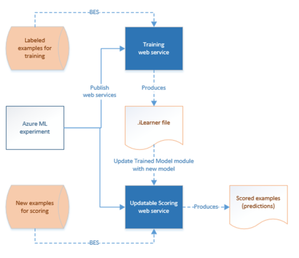

# Create predictive pipelines using Azure Machine Learning and Azure Data Factory
> [!div class="op_single_selector" title1="Select the version of Data Factory service you are using:"]
> * [Version 1](v1/data-factory-azure-ml-batch-execution-activity.md)
> * [Current version](transform-data-using-machine-learning.md)

[Azure Machine Learning](https://azure.microsoft.com/documentation/services/machine-learning/) enables you to build, test, and deploy predictive analytics solutions. From a high-level point of view, it is done in three steps:

1. **Create a training experiment**. You do this step by using the Azure Machine Learning studio. Azure Machine Learning studio is a collaborative visual development environment that you use to train and test a predictive analytics model using training data.
2. **Convert it to a predictive experiment**. Once your model has been trained with existing data and you are ready to use it to score new data, you prepare and streamline your experiment for scoring.
3. **Deploy it as a web service**. You can publish your scoring experiment as an Azure web service. You can send data to your model via this web service end point and receive result predictions from the model.

### Data Factory and Machine Learning together
Azure Data Factory enables you to easily create pipelines that use a published [Azure Machine Learning](https://azure.microsoft.com/documentation/services/machine-learning) web service for predictive analytics. Using the **Batch Execution Activity** in an Azure Data Factory pipeline, you can invoke an Azure Machine Learning studio web service to make predictions on the data in batch.

Over time, the predictive models in the Azure Machine Learning studio scoring experiments need to be retrained using new input datasets. You can retrain a model from a Data Factory pipeline by doing the following steps:

1. Publish the training experiment (not predictive experiment) as a web service. You do this step in the Azure Machine Learning studio as you did to expose predictive experiment as a web service in the previous scenario.
2. Use the Azure Machine Learning studio Batch Execution Activity to invoke the web service for the training experiment. Basically, you can use the Azure Machine Learning studio Batch Execution activity to invoke both training web service and scoring web service.

After you are done with retraining, update the scoring web service (predictive experiment exposed as a web service) with the newly trained model by using the **Azure Machine Learning studio Update Resource Activity**. See [Updating models using Update Resource Activity](update-machine-learning-models.md) article for details.

## Azure Machine Learning linked service

You create an **Azure Machine Learning** linked service to link an Azure Machine Learning Web Service to an Azure data factory. The Linked Service is used by Azure Machine Learning Batch Execution Activity and [Update Resource Activity](update-machine-learning-models.md).

```JSON
{
    "type" : "linkedServices",
    "name": "AzureMLLinkedService",
    "properties": {
        "type": "AzureML",
        "typeProperties": {
            "mlEndpoint": "URL to Azure ML Predictive Web Service",
            "apiKey": {
                "type": "SecureString",
                "value": "api key"
            }
        },
        "connectVia": {
            "referenceName": "<name of Integration Runtime>",
            "type": "IntegrationRuntimeReference"
        }
    }
}
```

See [Compute linked services](compute-linked-services.md) article for descriptions about properties in the JSON definition.

Azure Machine Learning support both Classic Web Services and New Web Services for your predictive experiment. You can choose the right one to use from Data Factory. To get the information required to create the Azure Machine Learning Linked Service, go to https://services.azureml.net, where all your (new) Web Services and Classic Web Services are listed. Click the Web Service you would like to access, and click **Consume** page. Copy **Primary Key** for **apiKey** property, and **Batch Requests** for **mlEndpoint** property.



## Azure Machine Learning Batch Execution activity

The following JSON snippet defines an Azure Machine Learning Batch Execution activity. The activity definition has a reference to the Azure Machine Learning linked service you created earlier.

```JSON
{
    "name": "AzureMLExecutionActivityTemplate",
    "description": "description",
    "type": "AzureMLBatchExecution",
    "linkedServiceName": {
        "referenceName": "AzureMLLinkedService",
        "type": "LinkedServiceReference"
    },
    "typeProperties": {
        "webServiceInputs": {
            "<web service input name 1>": {
                "LinkedServiceName":{
                    "referenceName": "AzureStorageLinkedService1",
                    "type": "LinkedServiceReference"
                },
                "FilePath":"path1"
            },
            "<web service input name 2>": {
                "LinkedServiceName":{
                    "referenceName": "AzureStorageLinkedService1",
                    "type": "LinkedServiceReference"
                },
                "FilePath":"path2"
            }
        },
        "webServiceOutputs": {
            "<web service output name 1>": {
                "LinkedServiceName":{
                    "referenceName": "AzureStorageLinkedService2",
                    "type": "LinkedServiceReference"
                },
                "FilePath":"path3"
            },
            "<web service output name 2>": {
                "LinkedServiceName":{
                    "referenceName": "AzureStorageLinkedService2",
                    "type": "LinkedServiceReference"
                },
                "FilePath":"path4"
            }
        },
        "globalParameters": {
            "<Parameter 1 Name>": "<parameter value>",
            "<parameter 2 name>": "<parameter 2 value>"
        }
    }
}
```

| Property          | Description                              | Required |
| :---------------- | :--------------------------------------- | :------- |
| name              | Name of the activity in the pipeline     | Yes      |
| description       | Text describing what the activity does.  | No       |
| type              | For Data Lake Analytics U-SQL activity, the activity type is **AzureMLBatchExecution**. | Yes      |
| linkedServiceName | Linked Services to the Azure Machine Learning Linked Service. To learn about this linked service, see [Compute linked services](compute-linked-services.md) article. | Yes      |
| webServiceInputs  | Key, Value pairs, mapping the names of Azure Machine Learning Web Service Inputs. Key must match the input parameters defined in the published Azure Machine Learning Web Service. Value is an Azure Storage Linked Services and FilePath properties pair specifying the input Blob locations. | No       |
| webServiceOutputs | Key, Value pairs, mapping the names of Azure Machine Learning Web Service Outputs. Key must match the output parameters defined in the published Azure Machine Learning Web Service. Value is an Azure Storage Linked Services and FilePath properties pair specifying the output Blob locations. | No       |
| globalParameters  | Key, Value pairs to be passed to the Azure Machine Learning studio Batch Execution Service endpoint. Keys must match the names of web service parameters defined in the published Azure Machine Learning studio web service. Values are passed in the GlobalParameters property of the Azure Machine Learning studio batch execution request | No       |

### Scenario 1: Experiments using Web service inputs/outputs that refer to data in Azure Blob Storage

In this scenario, the Azure Machine Learning Web service makes predictions using data from a file in an Azure blob storage and stores the prediction results in the blob storage. The following JSON defines a Data Factory pipeline with an AzureMLBatchExecution activity. The input and output data in Azure Blog Storage is referenced using a LinkedName and FilePath pair. In the sample Linked Service of inputs and outputs are different, you can use different Linked Services for each of your inputs/outputs for Data Factory to be able to pick up the right files and send to Azure Machine Learning studio Web Service.

> [!IMPORTANT]
> In your Azure Machine Learning studio experiment, web service input and output ports, and global parameters have default names ("input1", "input2") that you can customize. The names you use for webServiceInputs, webServiceOutputs, and globalParameters settings must exactly match the names in the experiments. You can view the sample request payload on the Batch Execution Help page for your Azure Machine Learning studio endpoint to verify the expected mapping.
>
>

```JSON
{
    "name": "AzureMLExecutionActivityTemplate",
    "description": "description",
    "type": "AzureMLBatchExecution",
    "linkedServiceName": {
        "referenceName": "AzureMLLinkedService",
        "type": "LinkedServiceReference"
    },
    "typeProperties": {
        "webServiceInputs": {
            "input1": {
                "LinkedServiceName":{
                    "referenceName": "AzureStorageLinkedService1",
                    "type": "LinkedServiceReference"
                },
                "FilePath":"amltest/input/in1.csv"
            },
            "input2": {
                "LinkedServiceName":{
                    "referenceName": "AzureStorageLinkedService1",
                    "type": "LinkedServiceReference"
                },
                "FilePath":"amltest/input/in2.csv"
            }
        },
        "webServiceOutputs": {
            "outputName1": {
                "LinkedServiceName":{
                    "referenceName": "AzureStorageLinkedService2",
                    "type": "LinkedServiceReference"
                },
                "FilePath":"amltest2/output/out1.csv"
            },
            "outputName2": {
                "LinkedServiceName":{
                    "referenceName": "AzureStorageLinkedService2",
                    "type": "LinkedServiceReference"
                },
                "FilePath":"amltest2/output/out2.csv"
            }
        }
    }
}
```
### Scenario 2: Experiments using Reader/Writer Modules to refer to data in various storages
Another common scenario when creating Azure Machine Learning studio experiments is to use Import Data and Output Data modules. The Import Data module is used to load data into an experiment and the Output Data module is to save data from your experiments. For details about Import Data and Output Data modules, see [Import Data](https://msdn.microsoft.com/library/azure/dn905997.aspx) and [Output Data](https://msdn.microsoft.com/library/azure/dn905984.aspx) topics on MSDN Library.

When using the Import Data and Output Data modules, it is good practice to use a Web service parameter for each property of these modules. These web parameters enable you to configure the values during runtime. For example, you could create an experiment with an Import Data module that uses an Azure SQL Database: XXX.database.windows.net. After the web service has been deployed, you want to enable the consumers of the web service to specify another Azure SQL Server called `YYY.database.windows.net`. You can use a Web service parameter to allow this value to be configured.

> [!NOTE]
> Web service input and output are different from Web service parameters. In the first scenario, you have seen how an input and output can be specified for an Azure Machine Learning studio Web service. In this scenario, you pass parameters for a Web service that correspond to properties of Import Data/Output Data modules.
>
>

Let's look at a scenario for using Web service parameters. You have a deployed Azure Machine Learning web service that uses a reader module to read data from one of the data sources supported by Azure Machine Learning (for example: Azure SQL Database). After the batch execution is performed, the results are written using a Writer module (Azure SQL Database).  No web service inputs and outputs are defined in the experiments. In this case, we recommend that you configure relevant web service parameters for the reader and writer modules. This configuration allows the reader/writer modules to be configured when using the AzureMLBatchExecution activity. You specify Web service parameters in the **globalParameters** section in the activity JSON as follows.

```JSON
"typeProperties": {
    "globalParameters": {
        "Database server name": "<myserver>.database.windows.net",
        "Database name": "<database>",
        "Server user account name": "<user name>",
        "Server user account password": "<password>"
    }
}
```

> [!NOTE]
> The Web service parameters are case-sensitive, so ensure that the names you specify in the activity JSON match the ones exposed by the Web service.
>

After you are done with retraining, update the scoring web service (predictive experiment exposed as a web service) with the newly trained model by using the **Azure Machine Learning studio Update Resource Activity**. See [Updating models using Update Resource Activity](update-machine-learning-models.md) article for details.

## Next steps
See the following articles that explain how to transform data in other ways:

* [U-SQL activity](transform-data-using-data-lake-analytics.md)
* [Hive activity](transform-data-using-hadoop-hive.md)
* [Pig activity](transform-data-using-hadoop-pig.md)
* [MapReduce activity](transform-data-using-hadoop-map-reduce.md)
* [Hadoop Streaming activity](transform-data-using-hadoop-streaming.md)
* [Spark activity](transform-data-using-spark.md)
* [.NET custom activity](transform-data-using-dotnet-custom-activity.md)
* [Stored procedure activity](transform-data-using-stored-procedure.md)
