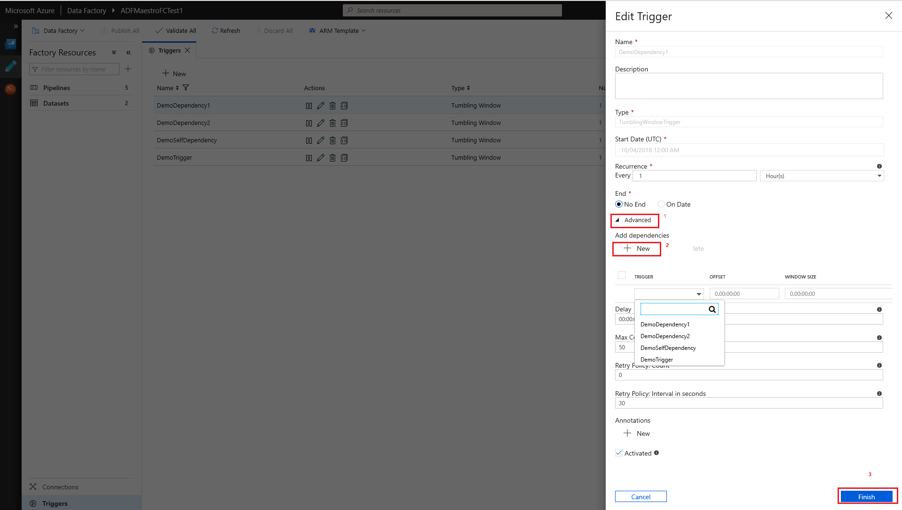
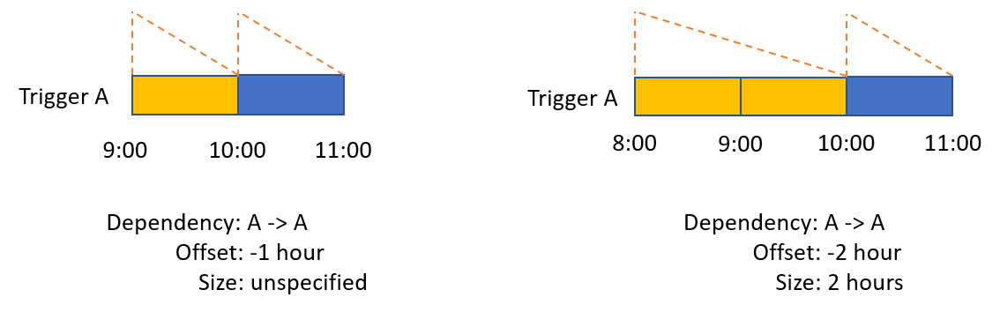
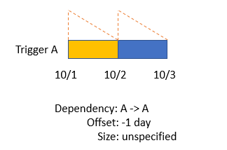
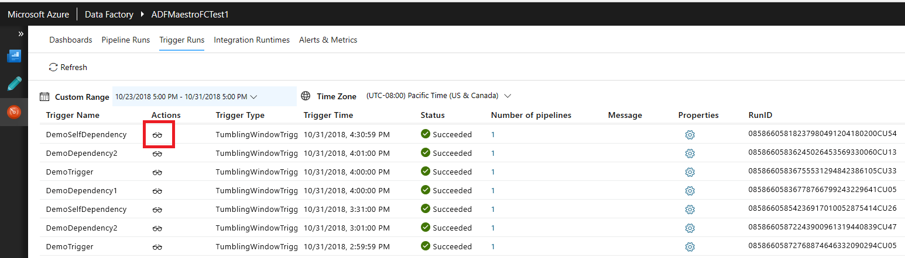
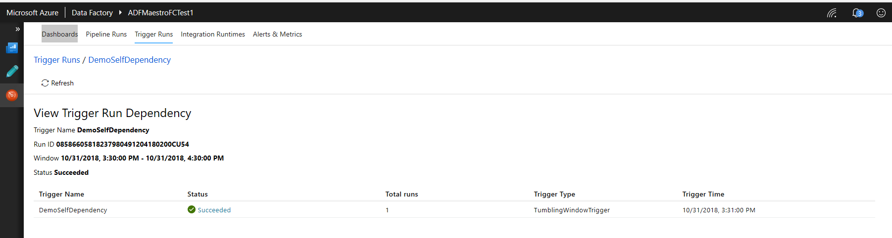
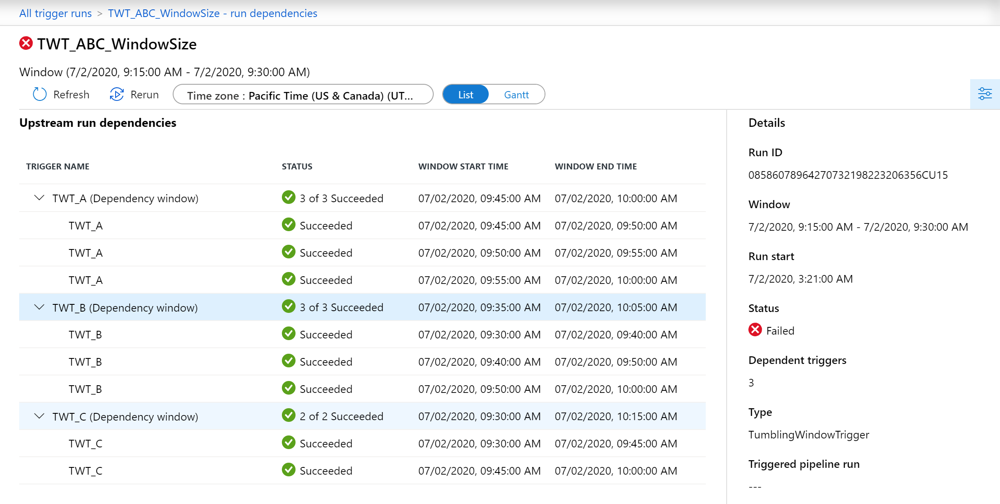

# Create a tumbling window trigger dependency
[!INCLUDE[appliesto-adf-asa-md](includes/appliesto-adf-asa-md.md)]

This article provides steps to create a dependency on a tumbling window trigger. For general information about Tumbling Window triggers, see [How to create tumbling window trigger](how-to-create-tumbling-window-trigger.md).

In order to build a dependency chain and make sure that a trigger is executed only after the successful execution of another trigger in the data factory, use this advanced feature to create a tumbling window dependency.

For a demonstration on how to create dependent pipelines in your Azure Data Factory using tumbling window trigger, watch the following video:

> [!VIDEO https://channel9.msdn.com/Shows/Azure-Friday/Create-dependent-pipelines-in-your-Azure-Data-Factory/player]

## Create a dependency in the Data Factory UI

To create dependency on a trigger, select **Trigger > Advanced > New**, and then choose the trigger to depend on with the appropriate offset and size. Select **Finish** and publish the data factory changes for the dependencies to take effect.



## Tumbling window dependency properties

A tumbling window trigger with a dependency has the following properties:

```json
{
    "name": "MyTriggerName",
    "properties": {
        "type": "TumblingWindowTrigger",
        "runtimeState": <<Started/Stopped/Disabled - readonly>>,
        "typeProperties": {
            "frequency": <<Minute/Hour>>,
            "interval": <<int>>,
            "startTime": <<datetime>>,
            "endTime": <<datetime – optional>>,
            "delay": <<timespan – optional>>,
            "maxConcurrency": <<int>> (required, max allowed: 50),
            "retryPolicy": {
                "count": <<int - optional, default: 0>>,
                "intervalInSeconds": <<int>>,
            },
			"dependsOn": [
				{
					"type": "TumblingWindowTriggerDependencyReference",
					"size": <<timespan – optional>>,
					"offset": <<timespan – optional>>,
					"referenceTrigger": {
						"referenceName": "MyTumblingWindowDependency1",
						"type": "TriggerReference"
					}
				},
				{
					"type": "SelfDependencyTumblingWindowTriggerReference",
					"size": <<timespan – optional>>,
					"offset": <<timespan>>
				}
			]
        }
    }
}
```

The following table provides the list of attributes needed to define a Tumbling Window dependency.

| **Property Name** | **Description**  | **Type** | **Required** |
|---|---|---|---|
| type  | All the existing tumbling window triggers are displayed in this drop down. Choose the trigger to take dependency on.  | TumblingWindowTriggerDependencyReference or SelfDependencyTumblingWindowTriggerReference | Yes |
| offset | Offset of the dependency trigger. Provide a value in time span format and both negative and positive offsets are allowed. This property is mandatory if the trigger is depending on itself and in all other cases it is optional. Self-dependency should always be a negative offset. If no value specified, the window is the same as the trigger itself. | Timespan<br/>(hh:mm:ss) | Self-Dependency: Yes<br/>Other: No |
| size | Size of the dependency tumbling window. Provide a positive timespan value. This property is optional. | Timespan<br/>(hh:mm:ss) | No  |

> [!NOTE]
> A tumbling window trigger can depend on a maximum of five other triggers.

## Tumbling window self-dependency properties

In scenarios where the trigger shouldn't proceed to the next window until the preceding window is successfully completed, build a self-dependency. A self-dependency trigger that's dependent on the success of earlier runs of itself within the preceding hour will have the properties indicated in the following code.

> [!NOTE]
> If your triggered pipeline relies on the output of pipelines in previously triggered windows, we recommend using only tumbling window trigger self-dependency. To limit parallel trigger runs, set the maximimum trigger concurrency.

```json
{
	"name": "DemoSelfDependency",
	"properties": {
		"runtimeState": "Started",
		"pipeline": {
			"pipelineReference": {
				"referenceName": "Demo",
				"type": "PipelineReference"
			}
		},
		"type": "TumblingWindowTrigger",
		"typeProperties": {
			"frequency": "Hour",
			"interval": 1,
			"startTime": "2018-10-04T00:00:00Z",
			"delay": "00:01:00",
			"maxConcurrency": 50,
			"retryPolicy": {
				"intervalInSeconds": 30
			},
			"dependsOn": [
				{
					"type": "SelfDependencyTumblingWindowTriggerReference",
					"size": "01:00:00",
					"offset": "-01:00:00"
				}
			]
		}
	}
}
```
## Usage scenarios and examples

Below are illustrations of scenarios and usage of tumbling window dependency properties.

### Dependency offset


### Dependency size


### Self-dependency



### Dependency on another tumbling window trigger

A daily telemetry processing job depending on another daily job aggregating the last seven days output and generates seven day rolling window streams:


### Dependency on itself

A daily job with no gaps in the output streams of the job:



## Monitor dependencies

You can monitor the dependency chain and the corresponding windows from the trigger run monitoring page. Navigate to  **Monitoring > Trigger Runs**. Under the actions column, you can rerun the trigger or view its dependencies.



If you click on 'View Trigger Dependencies', you can see the status of the dependencies. If one of the dependency triggers fails, you must successfully rerun it in order for the dependent trigger to run. A tumbling window trigger will wait on dependencies for seven days before timing out.



For a more visual to view the trigger dependency schedule, select the Gantt view.



## Next steps

* Review [How to create a tumbling window trigger](how-to-create-tumbling-window-trigger.md)
