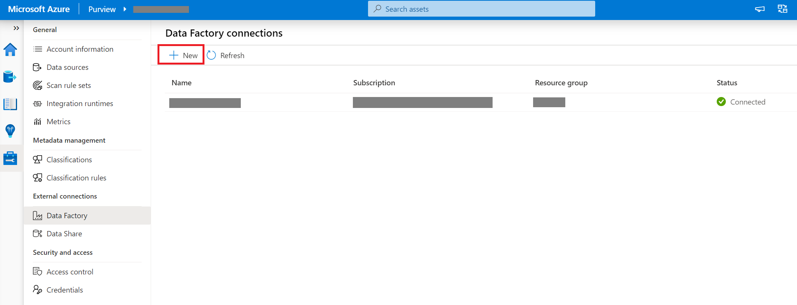
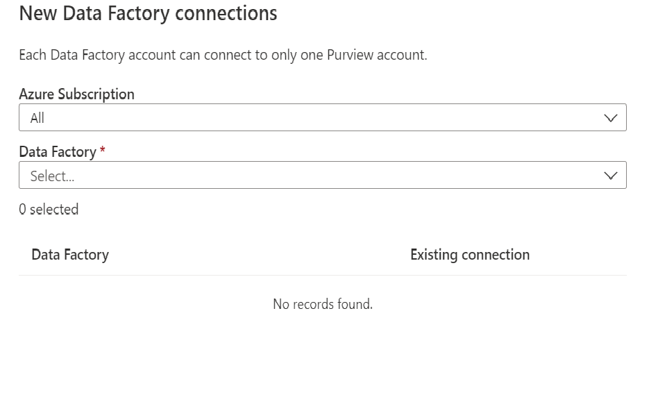
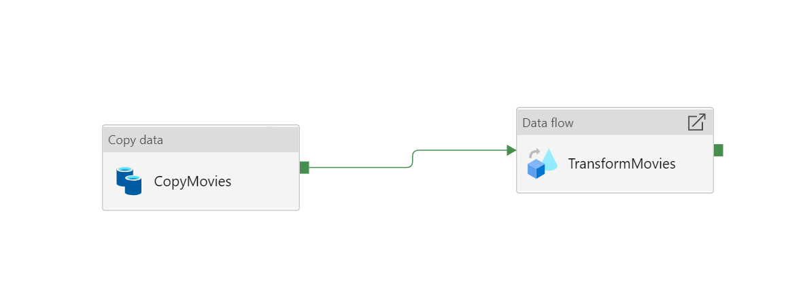
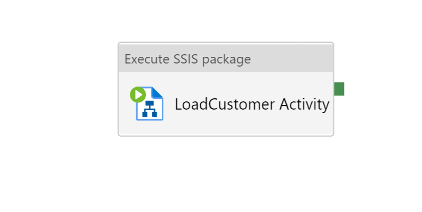
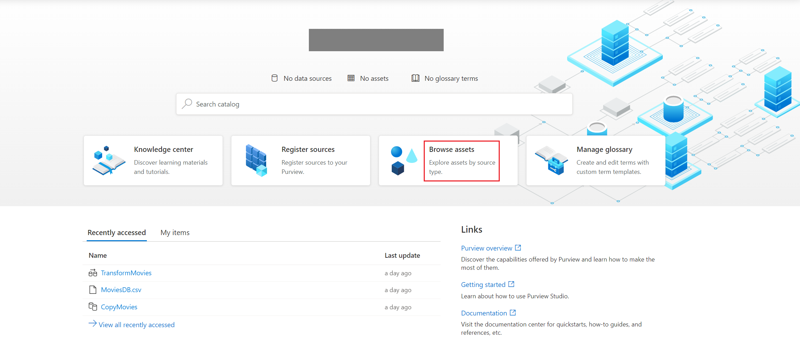
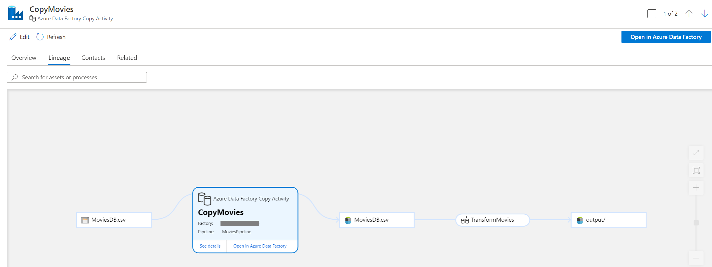
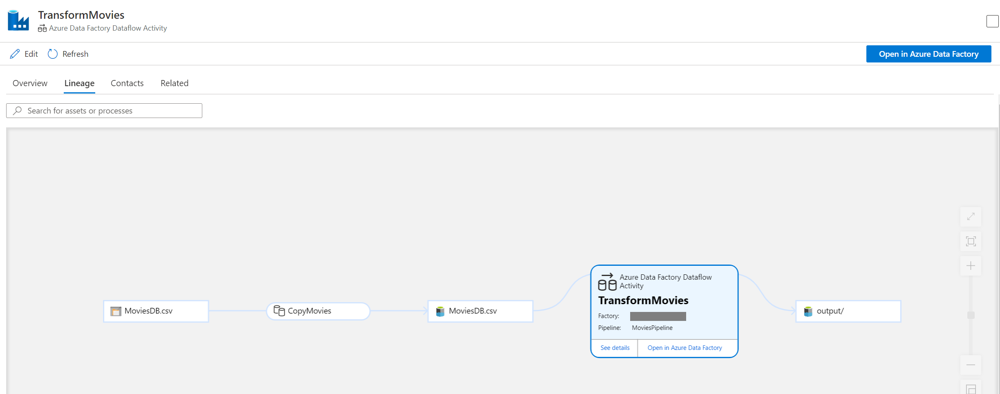

# Push Data Factory lineage data to Azure Purview (Preview)

[!INCLUDE[appliesto-adf-xxx-md](includes/appliesto-adf-xxx-md.md)]

In this tutorial, you'll use the Data Factory user interface (UI) to create a pipeline that run activities and report lineage data to Azure Purview account. Then you can view all the lineage information in your Azure Purview account.

## Prerequisites
* **Azure subscription**. If you don't have an Azure subscription, create a [free Azure account](https://azure.microsoft.com/free/) before you begin.
* **Azure Data Factory**. If you don't have an Azure Data Factory, see [Create an Azure Data Factory](./quickstart-create-data-factory-portal.md).
* **Azure Purview account**. The Purview account captures all lineage data generated by data factory. If you don't have an Azure Purview account, see [Create an Azure Purview](../purview/create-catalog-portal.md).

## Run Data Factory activities and push lineage data to Azure Purview
### Step 1:  Connect Data Factory to your Purview account
Log in to your Purview account in Purview portal, go to **Management Center**. Choose **Data Factory** in **External connections** and click **New** button to create a connection to a new Data Factory. 

In the popup page, you can choose the Data Factory you want to connect to this Purview account. 

You can check the status after creating the connection. **Connected** means the connection between Data Factory and this Purview is successfully connected. 
> [!NOTE]
> You need to be assigned any of below roles in the Purview account and Data Factory **Contributor** role to create the connection between Data Factory and Azure Purview.
> - Owner
> - User Access Administrator

### Step 2: Run Copy and Dataflow activities in Data Factory
You can create pipelines, Copy activities and Dataflow activities in Data Factory. You don't need any additional configuration for lineage data capture. The lineage data will automatically be captured during the activities execution.

If you don't know how to create Copy and Dataflow activities, see 
[Copy data from Azure Blob storage to a database in Azure SQL Database by using Azure Data Factory](./tutorial-copy-data-portal.md) and
[Transform data using mapping data flows](./tutorial-data-flow.md).

### Step 3: Run Execute SSIS Package activities in Data Factory
You can create pipelines, Execute SSIS Package activities in Data Factory. You don't need any additional configuration for lineage data capture. The lineage data will automatically be captured during the activities execution.

If you don't know how to create Execute SSIS Package activities, see 
[Run SSIS Packages in Azure](./tutorial-deploy-ssis-packages-azure.md).

### Step 4: View lineage information in your Purview account
Go back to your Purview Account. In the home page, select **Browse assets**. Choose the asset you want, and click Lineage tab. You will see all the lineage information.

You can see lineage data for Copy activity.

You also can see lineage data for Dataflow activity.

> [!NOTE] 
> For the lineage of Dataflow activity, we only support source and sink. The lineage for Dataflow transformation is not supported yet.

You also can see lineage data for Execute SSIS Package activity.

> [!NOTE] 
> For the lineage of Execute SSIS Package activity, we only support source and destination. The lineage for transformation is not supported yet.

## Next steps
[Catalog lineage user guide](../purview/catalog-lineage-user-guide.md)

[Connect Data Factory to Azure Purview](connect-data-factory-to-azure-purview.md)