# Copy multiple tables in bulk by using Azure Data Factory
This tutorial demonstrates **copying a number of tables from Azure SQL Database to Azure SQL Data Warehouse**. You can apply the same pattern in other copy scenarios as well. For example, copying tables from SQL Server/Oracle to Azure SQL Database/Data Warehouse/Azure Blob, copying different paths from Blob to Azure SQL Database tables.

> [!NOTE]
> - If you are new to Azure Data Factory, see [Introduction to Azure Data Factory](introduction.md).

At a high level, this tutorial involves following steps:

> [!div class="checklist"]
> * Create a data factory.
> * Create Azure SQL Database, Azure SQL Data Warehouse, and Azure Storage linked services.
> * Create Azure SQL Database and Azure SQL Data Warehouse datasets.
> * Create a  pipeline to look up the tables to be copied and another pipeline to perform the actual copy operation. 
> * Start a pipeline run.
> * Monitor the pipeline and activity runs.

This tutorial uses Azure portal. To learn about using other tools/SDKs to create a data factory, see [Quickstarts](quickstart-create-data-factory-dot-net.md). 

## End-to-end workflow
In this scenario, you have a number of tables in Azure SQL Database that you want to copy to SQL Data Warehouse. Here is the logical sequence of steps in the workflow that happens in pipelines:


* The first pipeline looks up the list of tables that needs to be copied over to the sink data stores.  Alternatively you can maintain a metadata table that lists all the tables to be copied to the sink data store. Then, the pipeline triggers another pipeline, which iterates over each table in the database and performs the data copy operation.
* The second pipeline performs the actual copy. It takes the list of tables as a parameter. For each table in the list, copy the specific table in Azure SQL Database to the corresponding table in SQL Data Warehouse using [staged copy via Blob storage and PolyBase](connector-azure-sql-data-warehouse.md#use-polybase-to-load-data-into-azure-sql-data-warehouse) for best performance. In this example, the first pipeline passes the list of tables as a value for the parameter. 

If you don't have an Azure subscription, create a [free](https://azure.microsoft.com/free/) account before you begin.

## Prerequisites
* **Azure Storage account**. The Azure Storage account is used as staging blob storage in the bulk copy operation. 
* **Azure SQL Database**. This database contains the source data. 
* **Azure SQL Data Warehouse**. This data warehouse holds the data copied over from the SQL Database. 

### Prepare SQL Database and SQL Data Warehouse

**Prepare the source Azure SQL Database**:

Create an Azure SQL Database with Adventure Works LT sample data following [Create an Azure SQL database](../sql-database/sql-database-get-started-portal.md) article. This tutorial copies all the tables from this sample database to a SQL data warehouse.

**Prepare the sink Azure SQL Data Warehouse**:

1. If you don't have an Azure SQL Data Warehouse, see the [Create a SQL Data Warehouse](../sql-data-warehouse/sql-data-warehouse-get-started-tutorial.md) article for steps to create one.

1. Create corresponding table schemas in SQL Data Warehouse. You can use [Migration Utility](https://www.microsoft.com/download/details.aspx?id=49100) to **migrate schema** from Azure SQL Database to Azure SQL Data Warehouse. You use Azure Data Factory to migrate/copy data in a later step.

## Azure services to access SQL server

For both SQL Database and SQL Data Warehouse, allow Azure services to access SQL server. Ensure that **Allow access to Azure services** setting is turned **ON** for your Azure SQL server. This setting allows the Data Factory service to read data from your Azure SQL Database and write data to your Azure SQL Data Warehouse. To verify and turn on this setting, do the following steps:

1. Click **More services** hub on the left and click **SQL servers**.
1. Select your server, and click **Firewall** under **SETTINGS**.
1. In the **Firewall settings** page, click **ON** for **Allow access to Azure services**.

## Create a data factory
1. Launch **Microsoft Edge** or **Google Chrome** web browser. Currently, Data Factory UI is supported only in Microsoft Edge and Google Chrome web browsers.
1. Click **New** on the left menu, click **Data + Analytics**, and click **Data Factory**. 
   
   
1. In the **New data factory** page, enter **ADFTutorialBulkCopyDF** for the **name**. 
      
     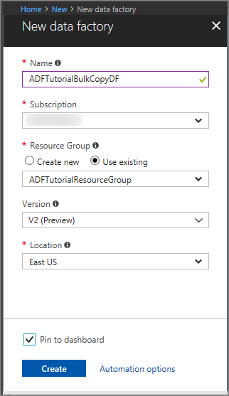
 
   The name of the Azure data factory must be **globally unique**. If you see the following error for the name field, change the name of the data factory (for example, yournameADFTutorialBulkCopyDF). See [Data Factory - Naming Rules](naming-rules.md) article for naming rules for Data Factory artifacts.
  
       `Data factory name “ADFTutorialBulkCopyDF” is not available`
1. Select your Azure **subscription** in which you want to create the data factory. 
1. For the **Resource Group**, do one of the following steps:
     
      - Select **Use existing**, and select an existing resource group from the drop-down list. 
      - Select **Create new**, and enter the name of a resource group.   
         
      To learn about resource groups, see [Using resource groups to manage your Azure resources](../azure-resource-manager/resource-group-overview.md).  
1. Select **V2** for the **version**.
1. Select the **location** for the data factory. For a list of Azure regions in which Data Factory is currently available, select the regions that interest you on the following page, and then expand **Analytics** to locate **Data Factory**: [Products available by region](https://azure.microsoft.com/global-infrastructure/services/). The data stores (Azure Storage, Azure SQL Database, etc.) and computes (HDInsight, etc.) used by data factory can be in other regions.
1. Select **Pin to dashboard**.     
1. Click **Create**.
1. On the dashboard, you see the following tile with status: **Deploying data factory**. 

    
1. After the creation is complete, you see the **Data Factory** page as shown in the image.
   
    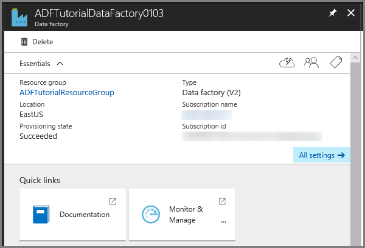
1. Click **Author & Monitor** tile to launch the Data Factory UI application in a separate tab.
1. In the **get started** page, switch to the **Edit** tab in the left panel as shown in the following image:  

    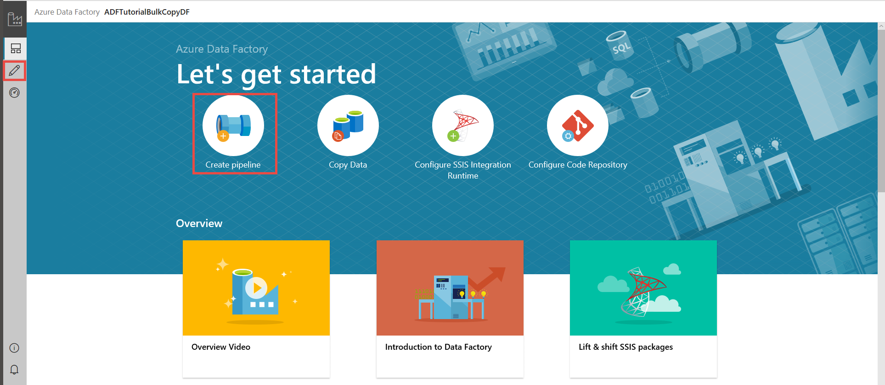

## Create linked services
You create linked services to link your data stores and computes to a data factory. A linked service has the connection information that the Data Factory service uses to connect to the data store at runtime. 

In this tutorial, you link your Azure SQL Database, Azure SQL Data Warehouse, and Azure Blob Storage data stores to your data factory. The Azure SQL Database is the source data store. The Azure SQL Data Warehouse is the sink/destination data store. The Azure Blob Storage is to stage the data before the data is loaded into SQL Data Warehouse by using PolyBase. 

### Create the source Azure SQL Database linked service
In this step, you create a linked service to link your Azure SQL database to the data factory. 

1. Click **Connections** at the bottom of the window, and click **+ New** on the toolbar. 

    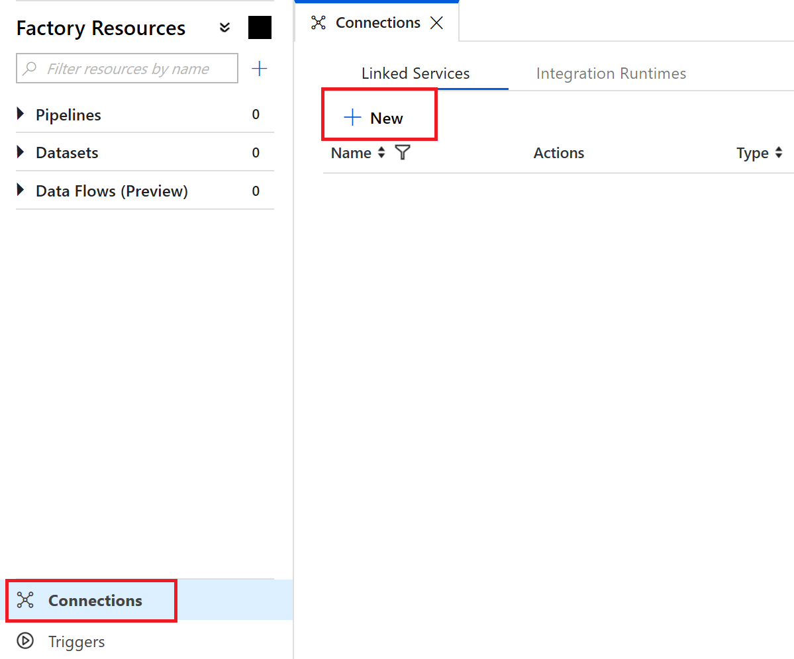
1. In the **New Linked Service** window, select **Azure SQL Database**, and click **Continue**. 

    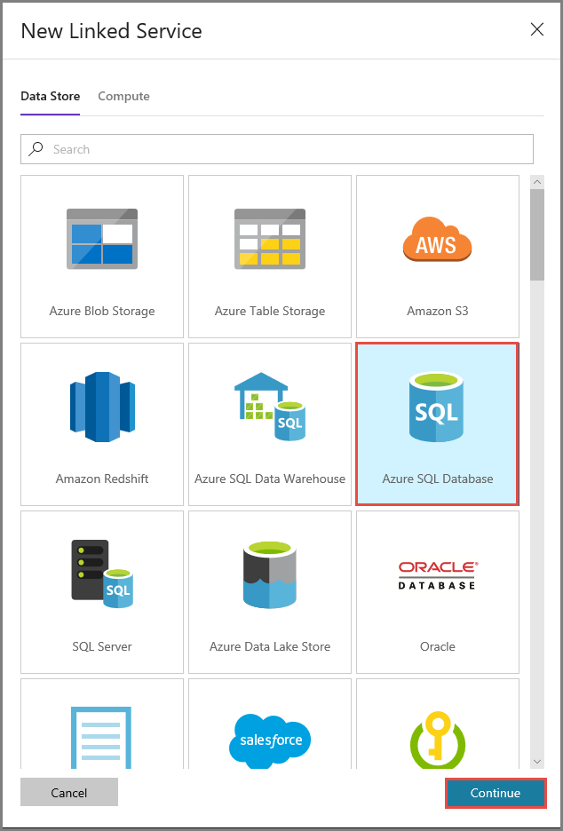
1. In the **New Linked Service** window, do the following steps: 

    1. Enter **AzureSqlDatabaseLinkedService** for **Name**. 
    1. Select your Azure SQL server for **Server name**
    1. Select your Azure SQL database for **Database name**. 
    1. Enter **name of the user** to connect to Azure SQL database. 
    1. Enter **password** for the user. 
    1. To test the connection to Azure SQL database using the specified information, click **Test connection**.
    1. Click **Save**.

        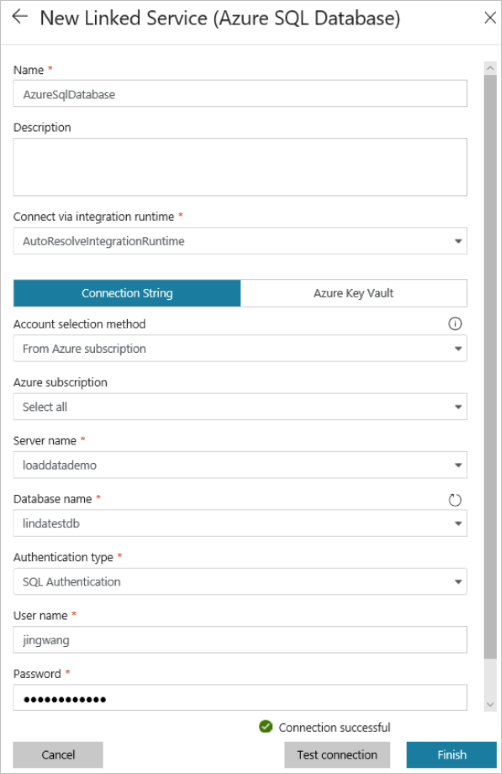

### Create the sink Azure SQL Data Warehouse linked service

1. In the **Connections** tab, click **+ New** on the toolbar again. 
1. In the **New Linked Service** window, select **Azure SQL Data Warehouse**, and click **Continue**. 
1. In the **New Linked Service** window, do the following steps: 

    1. Enter **AzureSqlDWLinkedService** for **Name**. 
    1. Select your Azure SQL server for **Server name**
    1. Select your Azure SQL database for **Database name**. 
    1. Enter **name of the user** to connect to Azure SQL database. 
    1. Enter **password** for the user. 
    1. To test the connection to Azure SQL database using the specified information, click **Test connection**.
    1. Click **Save**.

### Create the staging Azure Storage linked service
In this tutorial, you use Azure Blob storage as an interim staging area to enable PolyBase for a better copy performance.

1. In the **Connections** tab, click **+ New** on the toolbar again. 
1. In the **New Linked Service** window, select **Azure Blob Storage**, and click **Continue**. 
1. In the **New Linked Service** window, do the following steps: 

    1. Enter **AzureStorageLinkedService** for **Name**. 
    1. Select your **Azure Storage account** for **Storage account name**.
    1. Click **Save**.


## Create datasets
In this tutorial, you create source and sink datasets, which specify the location where the data is stored. 

The input dataset **AzureSqlDatabaseDataset** refers to the **AzureSqlDatabaseLinkedService**. The linked service specifies the connection string to connect to the database. The dataset specifies the name of the database and the table that contains the source data. 

The output dataset **AzureSqlDWDataset** refers to the **AzureSqlDWLinkedService**. The linked service specifies the connection string to connect to the data warehouse. The dataset specifies the database and the table to which the data is copied. 

In this tutorial, the source and destination SQL tables are not hard-coded in the dataset definitions. Instead, the ForEach activity passes the name of the table at runtime to the Copy activity. 

### Create a dataset for source SQL Database

1. Click **+ (plus)** in the left pane, and click **Dataset**. 

    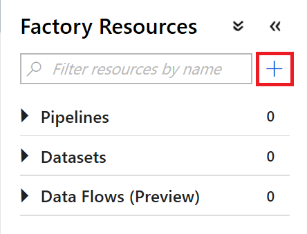
1. In the **New Dataset** window, select **Azure SQL Database**, and click **Finish**. You should see a new tab titled **AzureSqlTable1**. 
    
    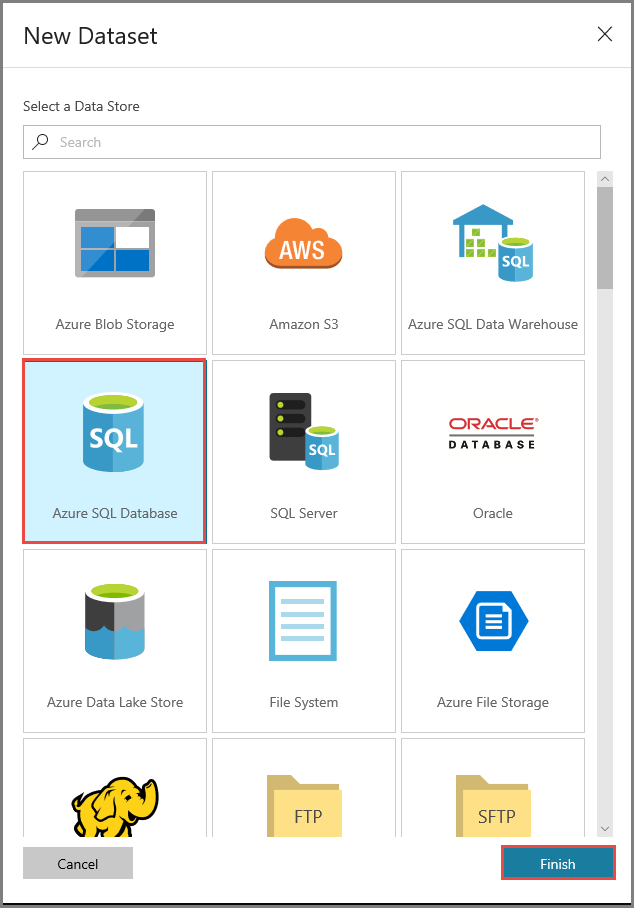
1. In the properties window at the bottom, enter **AzureSqlDatabaseDataset** for **Name**.

1. Switch to the **Connection** tab, and do the following steps: 

    1. Select **AzureSqlDatabaseLinkedService** for **Linked service**.
    1. Select any table for **Table**. This table is a dummy table. You specify a query on the source dataset when creating a pipeline. The query is used to extract data from the Azure SQL database. Alternatively, you can click **Edit** check box, and enter **dummyName** as the table name. 

    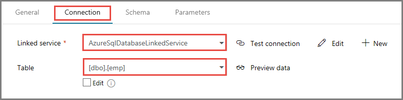
 

### Create a dataset for sink SQL Data Warehouse

1. Click **+ (plus)** in the left pane, and click **Dataset**. 
1. In the **New Dataset** window, select **Azure SQL Data Warehouse**, and click **Finish**. You should see a new tab titled **AzureSqlDWTable1**. 
1. In the properties window at the bottom, enter **AzureSqlDWDataset** for **Name**.
1. Switch to the **Parameters** tab, click **+ New**, and enter **DWTableName** for the parameter name. If you copy/paste this name from the page, ensure that there is no **trailing space character** at the end of **DWTableName**. 

    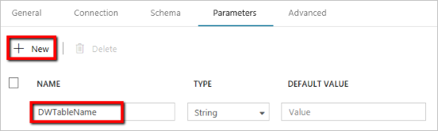

1. Switch to the **Connection** tab, 

    a. Select **AzureSqlDatabaseLinkedService** for **Linked service**.

    b. For **Table**, check the **Edit** option, click into the table name input box, then click the **Add dynamic content** link below. 
    
    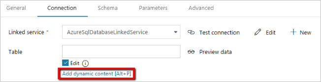

    c. In the **Add Dynamic Content** page, click the **DWTAbleName** under **Parameters** which will automatically populate the top expression text box `@dataset().DWTableName`, then click **Finish**. The **tableName** property of the dataset is set to the value that's passed as an argument for the **DWTableName** parameter. The ForEach activity iterates through a list of tables, and passes one by one to the Copy activity. 

    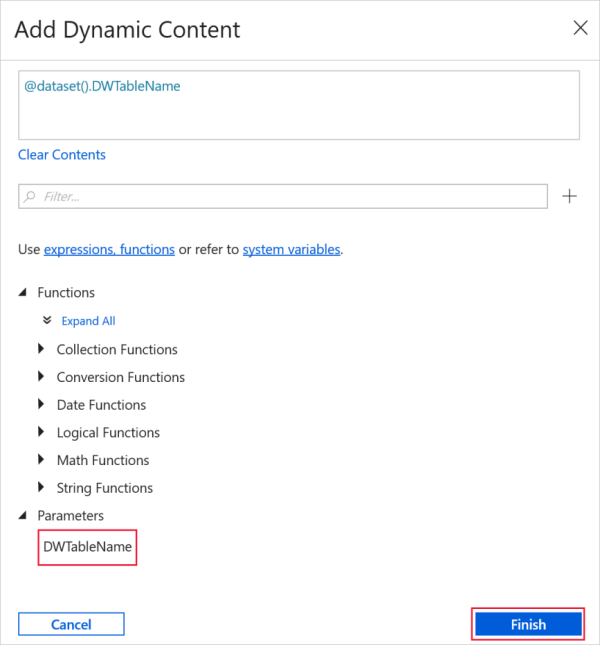

## Create pipelines
In this tutorial, you create two pipelines: **IterateAndCopySQLTables** and **GetTableListAndTriggerCopyData**. 

The **GetTableListAndTriggerCopyData** pipeline performs two steps:

* Looks up the Azure SQL Database system table to get the list of tables to be copied.
* Triggers the pipeline **IterateAndCopySQLTables** to do the actual data copy.

The  **GetTableListAndTriggerCopyData** takes a list of tables as a parameter. For each table in the list, it copies data from the table in Azure SQL Database to Azure SQL Data Warehouse using staged copy and PolyBase.

### Create the pipeline IterateAndCopySQLTables

1. In the left pane, click **+ (plus)**, and click **Pipeline**.

    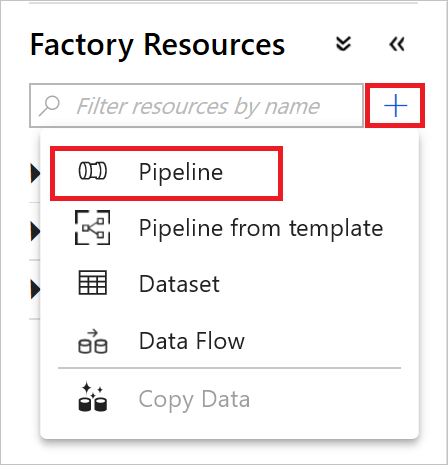
1. In the **General** tab, specify **IterateAndCopySQLTables** for name. 

1. Switch to the **Parameters** tab, and do the following actions: 

    1. Click **+ New**. 
    1. Enter **tableList** for the parameter **name**.
    1. Select **Array** for **Type**.

        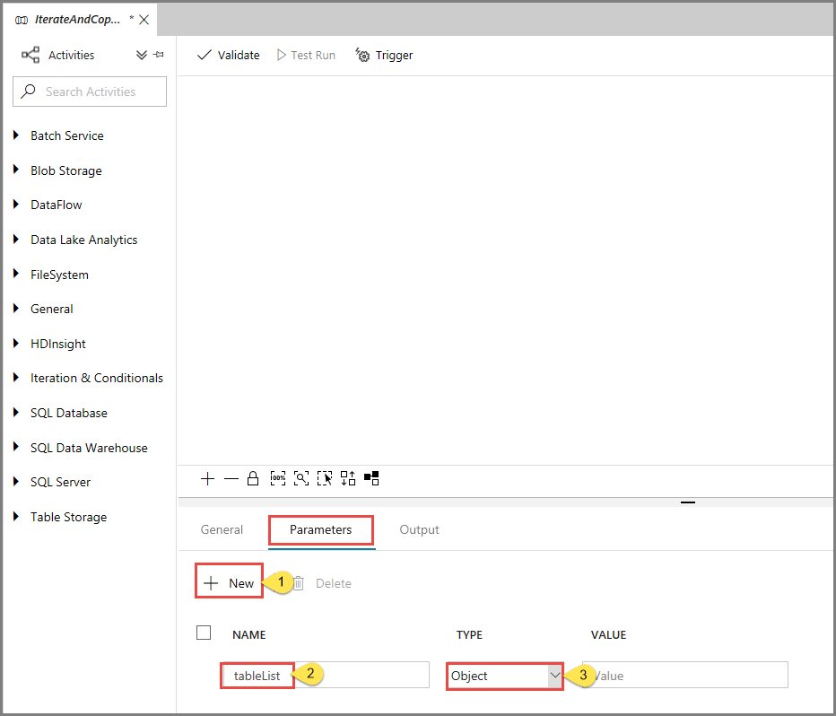
1. In the **Activities** toolbox, expand **Iteration & Conditions**, and drag-drop the **ForEach** activity to the pipeline design surface. You can also search for activities in the **Activities** toolbox. 

    a. In the **General** tab at the bottom, enter **IterateSQLTables** for **Name**. 

    b. Switch to the **Settings** tab, click the inputbox for **Items**, then click the **Add dynamic content** link below. 

    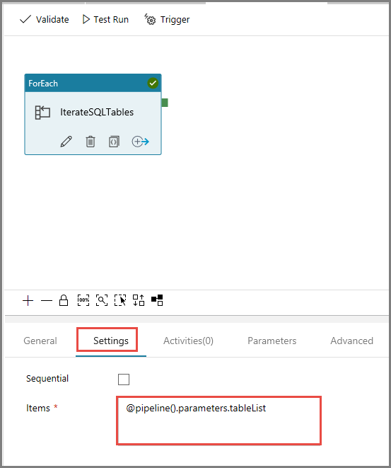

    c. In the **Add Dynamic Content** page, collapse the System Vairables and Functions section, click the **tableList** under **Parameters** which will automatically populate the top expression text box as `@pipeline().parameter.tableList`, then click **Finish**. 

    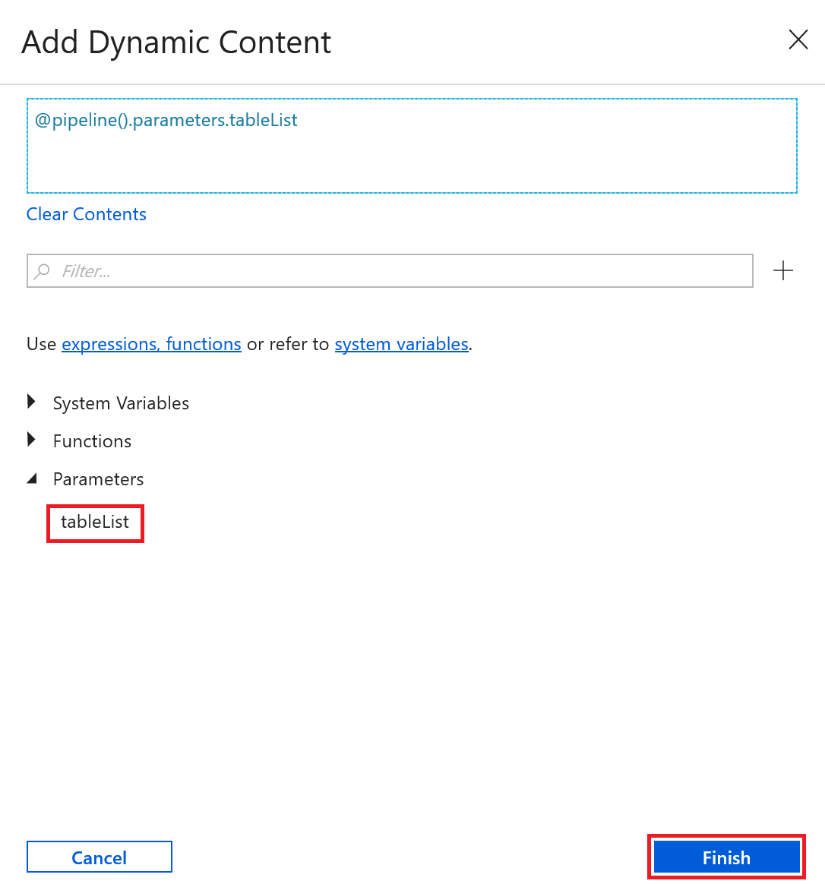
    
    d. Switch to **Activities** tab, click **Add activity** to add a child activity to the **ForEach** activity.

1. In the **Activities** toolbox, expand **DataFlow**, and drag-drop **Copy** activity into the pipeline designer surface. Notice the breadcrumb menu at the top. The IterateAndCopySQLTable is the pipeline name and IterateSQLTables is the ForEach activity name. The designer is in the activity scope. To switch back to the pipeline editor from the ForEach editor, click the link in the breadcrumb menu. 

    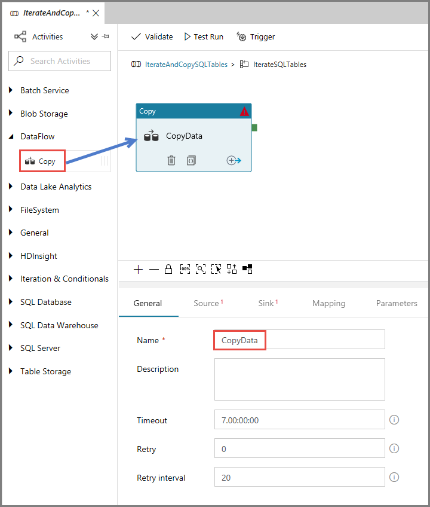
1. Switch to the **Source** tab, and do the following steps:

    1. Select **AzureSqlDatabaseDataset** for **Source Dataset**. 
    1. Select **Query** option for **User Query**. 
    1. Click the **Query** input box -> select the **Add dynamic content** below -> enter the following expression for **Query** -> select **Finish**.

        ```sql
        SELECT * FROM [@{item().TABLE_SCHEMA}].[@{item().TABLE_NAME}]
        ``` 

        
1. Switch to the **Sink** tab, and do the following steps: 

    1. Select **AzureSqlDWDataset** for **Sink Dataset**.
    1. Click input box for the VALUE of DWTableName parameter -> select the **Add dynamic content** below, enter `[@{item().TABLE_SCHEMA}].[@{item().TABLE_NAME}]` expression as script, -> select **Finish**.
    1. Expand **Polybase Settings**, and select **Allow polybase**. 
    1. Clear the **Use Type default** option. 
    1. Click the **Pre-copy Script** input box -> select the **Add dynamic content** below -> enter the following expression as script -> select **Finish**. 

        ```sql
        TRUNCATE TABLE [@{item().TABLE_SCHEMA}].[@{item().TABLE_NAME}]
        ```

        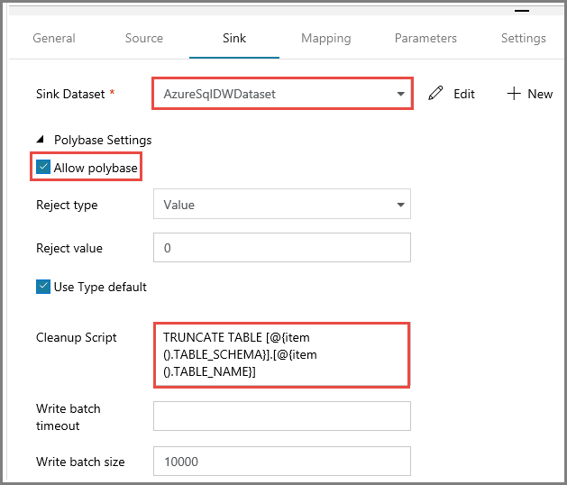

1. Switch to the **Settings** tab, and do the following steps: 

    1. Select **True** for **Enable Staging**.
    1. Select **AzureStorageLinkedService** for **Store Account Linked Service**.

        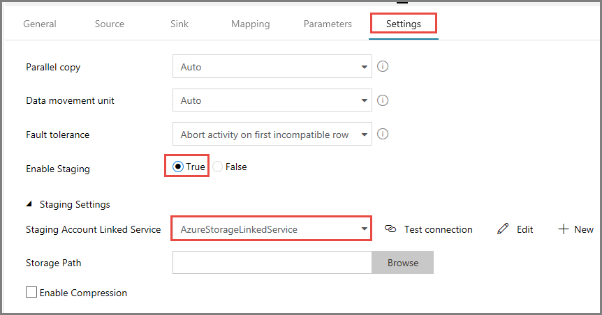

1. To validate the pipeline settings, click **Validate** on the top pipeline tool bar. Confirm that there is no validation error. To close the **Pipeline Validation Report**, click **>>**.

### Create the pipeline GetTableListAndTriggerCopyData

This pipeline performs two steps:

* Looks up the Azure SQL Database system table to get the list of tables to be copied.
* Triggers the pipeline "IterateAndCopySQLTables" to do the actual data copy.

1. In the left pane, click **+ (plus)**, and click **Pipeline**.

    
1. In the Properties window, change the name of the pipeline to **GetTableListAndTriggerCopyData**. 

1. In the **Activities** toolbox, expand **General**, and drag-and-drop **Lookup** activity to the pipeline designer surface, and do the following steps:

    1. Enter **LookupTableList** for **Name**. 
    1. Enter **Retrieve the table list from Azure SQL database** for **Description**.

        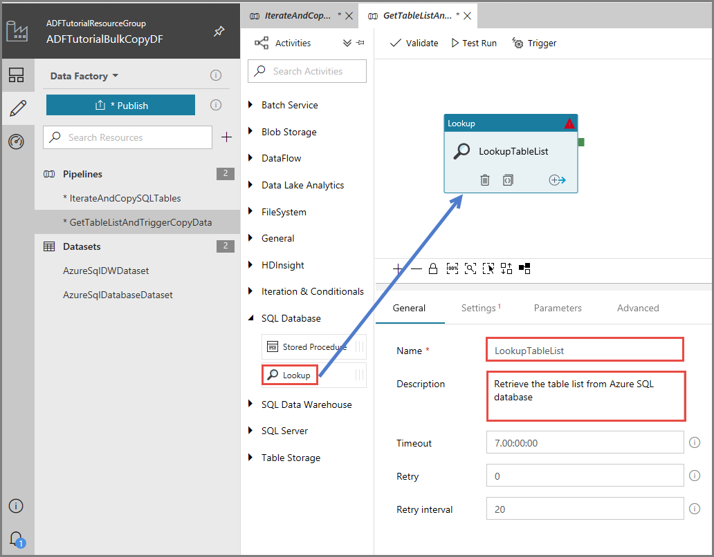
1. Switch to the **Settings** page, and do the following steps:

    1. Select **AzureSqlDatabaseDataset** for **Source Dataset**. 
    1. Select **Query** for **Use Query**. 
    1. Enter the following SQL query for **Query**.

        ```sql
        SELECT TABLE_SCHEMA, TABLE_NAME FROM information_schema.TABLES WHERE TABLE_TYPE = 'BASE TABLE' and TABLE_SCHEMA = 'SalesLT' and TABLE_NAME <> 'ProductModel'
        ```
    1. Clear the checkbox for the **First row only** field.

        
1. Drag-and-drop **Execute Pipeline** activity from the Activities toolbox to the pipeline designer surface, and set the name to **TriggerCopy**.

    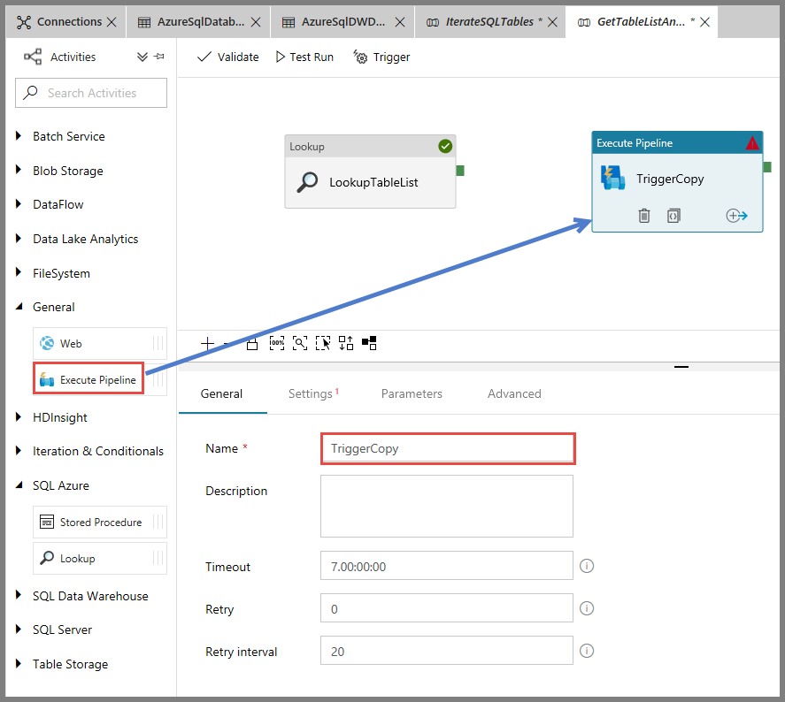    
1. Switch to the **Settings** page, and do the following steps: 

    1. Select **IterateAndCopySQLTables** for **Invoked pipeline**. 
    1. Expand the **Advanced** section. 
    1. Click **+ New** in the **Parameters** section. 
    1. Enter **tableList** for parameter **name**.
    1. Click VALUE input box -> select the **Add dynamic content** below -> enter `@activity('LookupTableList').output.value` as table name value -> select **Finish**. You are setting the result list from the Lookup activity as an input to the second pipeline. The result list contains the list of tables whose data needs to be copied to the destination. 

        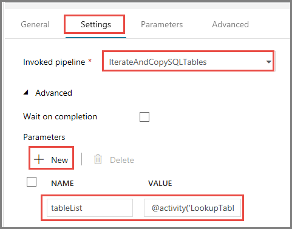
1. **Connect** the **Lookup** activity to the **Execute Pipeline** activity by dragging the **green box** attached to the Lookup activity to the left of Execute Pipeline activity.

    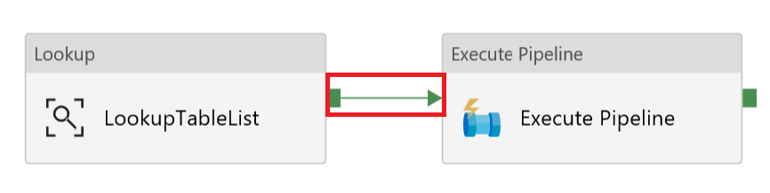
1. To validate the pipeline, click **Validate** on the toolbar. Confirm that there are no validation errors. To close the **Pipeline Validation Report**, click **>>**.

1. To publish entities (datasets, pipelines, etc.) to the Data Factory service, click **Publish All** on top of the window. Wait until the publishing succeeds. 

## Trigger a pipeline run

Go to pipeline **GetTableListAndTriggerCopyData**, click **Trigger**, and click **Trigger Now**. 


## Monitor the pipeline run

1. Switch to the **Monitor** tab. Click **Refresh** until you see runs for both the pipelines in your solution. Continue refreshing the list until you see the **Succeeded** status. 

    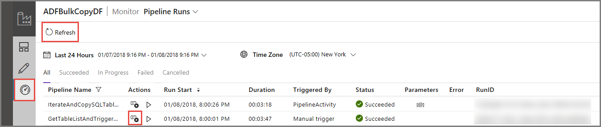
1. To view activity runs associated with the GetTableListAndTriggerCopyData pipeline, click the first link in the Actions link for that pipeline. You should see two activity runs for this pipeline run. 

    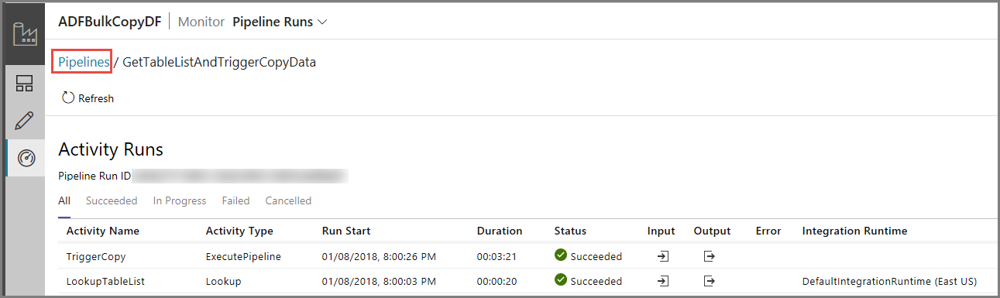    
1. To view the output of the **Lookup** activity, click link in the **Output** column for that activity. You can maximize and restore the **Output** window. After reviewing, click **X** to close the **Output** window.

    ```json
    {
        "count": 9,
        "value": [
            {
                "TABLE_SCHEMA": "SalesLT",
                "TABLE_NAME": "Customer"
            },
            {
                "TABLE_SCHEMA": "SalesLT",
                "TABLE_NAME": "ProductDescription"
            },
            {
                "TABLE_SCHEMA": "SalesLT",
                "TABLE_NAME": "Product"
            },
            {
                "TABLE_SCHEMA": "SalesLT",
                "TABLE_NAME": "ProductModelProductDescription"
            },
            {
                "TABLE_SCHEMA": "SalesLT",
                "TABLE_NAME": "ProductCategory"
            },
            {
                "TABLE_SCHEMA": "SalesLT",
                "TABLE_NAME": "Address"
            },
            {
                "TABLE_SCHEMA": "SalesLT",
                "TABLE_NAME": "CustomerAddress"
            },
            {
                "TABLE_SCHEMA": "SalesLT",
                "TABLE_NAME": "SalesOrderDetail"
            },
            {
                "TABLE_SCHEMA": "SalesLT",
                "TABLE_NAME": "SalesOrderHeader"
            }
        ],
        "effectiveIntegrationRuntime": "DefaultIntegrationRuntime (East US)",
        "effectiveIntegrationRuntimes": [
            {
                "name": "DefaultIntegrationRuntime",
                "type": "Managed",
                "location": "East US",
                "billedDuration": 0,
                "nodes": null
            }
        ]
    }
    ```    
1. To switch back to the **Pipeline Runs** view, click **Pipelines** link at the top. Click **View Activity Runs** link (first link in the **Actions** column) for the **IterateAndCopySQLTables** pipeline. You should see output as shown in the following image: Notice that there is one **Copy** activity run for each table in the **Lookup** activity output. 

    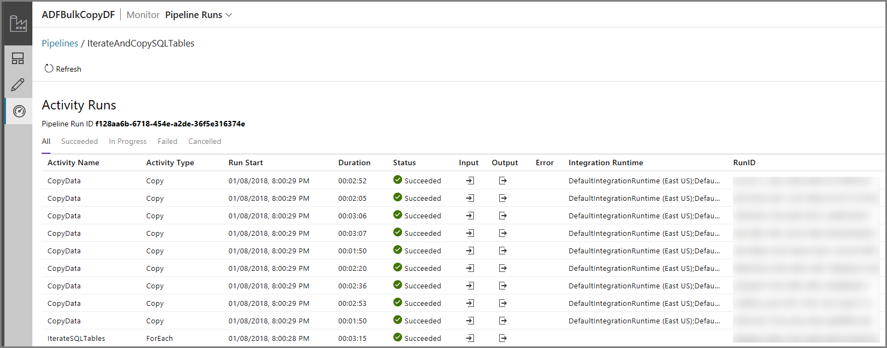
1. Confirm that the data was copied to the target SQL Data Warehouse you used in this tutorial. 

## Next steps
You performed the following steps in this tutorial: 

> [!div class="checklist"]
> * Create a data factory.
> * Create Azure SQL Database, Azure SQL Data Warehouse, and Azure Storage linked services.
> * Create Azure SQL Database and Azure SQL Data Warehouse datasets.
> * Create a  pipeline to look up the tables to be copied and another pipeline to perform the actual copy operation. 
> * Start a pipeline run.
> * Monitor the pipeline and activity runs.

Advance to the following tutorial to learn about copy data incrementally from a source to a destination:
> [!div class="nextstepaction"]
>[Copy data incrementally](tutorial-incremental-copy-portal.md)
