# Copy multiple tables in bulk by using Azure Data Factory
This tutorial demonstrates **copying a number of tables from Azure SQL Database to Azure SQL Data Warehouse**. You can apply the same pattern in other copy scenarios as well. For example, copying tables from SQL Server/Oracle to Azure SQL Database/Data Warehouse/Azure Blob, copying different paths from Blob to Azure SQL Database tables.

> [!NOTE]
> This article applies to version 2 of Data Factory, which is currently in preview. If you are using version 1 of the Data Factory service, which is generally available (GA), see [documentation for Data Factory version 1](v1/data-factory-copy-data-from-azure-blob-storage-to-sql-database.md).

At a high level, this tutorial involves following steps:

> [!div class="checklist"]
> * Create a data factory.
> * Create Azure SQL Database, Azure SQL Data Warehouse, and Azure Storage linked services.
> * Create Azure SQL Database and Azure SQL Data Warehouse datasets.
> * Create a  pipeline to look up the tables to be copied and another pipeline to perform the actual copy operation. 
> * Start a pipeline run.
> * Monitor the pipeline and activity runs.

This tutorial uses Azure portal. To learn about using other tools/SDKs to create a data factory, see [Quickstarts](quickstart-create-data-factory-dot-net.md). 

## End-to-end workflow
In this scenario, you have a number of tables in Azure SQL Database that you want to copy to SQL Data Warehouse. Here is the logical sequence of steps in the workflow that happens in pipelines:


* The first pipeline looks up the list of tables that needs to be copied over to the sink data stores.  Alternatively you can maintain a metadata table that lists all the tables to be copied to the sink data store. Then, the pipeline triggers another pipeline, which iterates over each table in the database and performs the data copy operation.
* The second pipeline performs the actual copy. It takes the list of tables as a parameter. For each table in the list, copy the specific table in Azure SQL Database to the corresponding table in SQL Data Warehouse using [staged copy via Blob storage and PolyBase](connector-azure-sql-data-warehouse.md#use-polybase-to-load-data-into-azure-sql-data-warehouse) for best performance. In this example, the first pipeline passes the list of tables as a value for the parameter. 

If you don't have an Azure subscription, create a [free](https://azure.microsoft.com/free/) account before you begin.

## Prerequisites
* **Azure Storage account**. The Azure Storage account is used as staging blob storage in the bulk copy operation. 
* **Azure SQL Database**. This database contains the source data. 
* **Azure SQL Data Warehouse**. This data warehouse holds the data copied over from the SQL Database. 

### Prepare SQL Database and SQL Data Warehouse

**Prepare the source Azure SQL Database**:

Create an Azure SQL Database with Adventure Works LT sample data following [Create an Azure SQL database](../sql-database/sql-database-get-started-portal.md) article. This tutorial copies all the tables from this sample database to a SQL data warehouse.

**Prepare the sink Azure SQL Data Warehouse**:

1. If you don't have an Azure SQL Data Warehouse, see the [Create a SQL Data Warehouse](../sql-data-warehouse/sql-data-warehouse-get-started-tutorial.md) article for steps to create one.

2. Create corresponding table schemas in SQL Data Warehouse. You can use [Migration Utility](https://www.microsoft.com/download/details.aspx?id=49100) to **migrate schema** from Azure SQL Database to Azure SQL Data Warehouse. You use Azure Data Factory to migrate/copy data in a later step.

## Azure services to access SQL server

For both SQL Database and SQL Data Warehouse, allow Azure services to access SQL server. Ensure that **Allow access to Azure services** setting is turned **ON** for your Azure SQL server. This setting allows the Data Factory service to read data from your Azure SQL Database and write data to your Azure SQL Data Warehouse. To verify and turn on this setting, do the following steps:

1. Click **More services** hub on the left and click **SQL servers**.
2. Select your server, and click **Firewall** under **SETTINGS**.
3. In the **Firewall settings** page, click **ON** for **Allow access to Azure services**.

## Create a data factory
1. Click **New** on the left menu, click **Data + Analytics**, and click **Data Factory**. 
   
   
2. In the **New data factory** page, enter **ADFTutorialBulkCopyDF** for the **name**. 
      
     
 
   The name of the Azure data factory must be **globally unique**. If you receive the following error, change the name of the data factory (for example, yournameADFTutorialBulkCopyDF) and try creating again. See [Data Factory - Naming Rules](naming-rules.md) article for naming rules for Data Factory artifacts.
  
       `Data factory name “ADFTutorialBulkCopyDF” is not available`
3. Select your Azure **subscription** in which you want to create the data factory. 
4. For the **Resource Group**, do one of the following steps:
     
      - Select **Use existing**, and select an existing resource group from the drop-down list. 
      - Select **Create new**, and enter the name of a resource group.   
         
      Some of the steps in this quickstart assume that you use the name: **ADFTutorialResourceGroup** for the resource group. To learn about resource groups, see [Using resource groups to manage your Azure resources](../azure-resource-manager/resource-group-overview.md).  
4. Select **V2 (Preview)** for the **version**.
5. Select the **location** for the data factory. Currently, Data Factory V2 allows you to create data factories only in the East US, East US2, and West Europe regions. The data stores (Azure Storage, Azure SQL Database, etc.) and computes (HDInsight, etc.) used by data factory can be in other regions.
6. Select **Pin to dashboard**.     
7. Click **Create**.
8. On the dashboard, you see the following tile with status: **Deploying data factory**. 

    
9. After the creation is complete, you see the **Data Factory** page as shown in the image.
   
    
10. Click **Author & Monitor** tile to launch the Data Factory UI application in a separate tab.
11. Click **Edit** tab (or) click **Create pipeline** tile. 

    

## Create linked services
In this tutorial, you create three linked services for source, sink, and staging blob respectively, which includes connections to your data stores:

### Create the source Azure SQL Database linked service

1. Click **Connections** at the bottom of the window, and click **+ New** on the toolbar. 

    
2. In the **New Linked Service** window, select **Azure SQL Database**, and click **Continue**. 

    
3. In the **New Linked Service** window, do the following steps: 

    1. Enter **AzureSqlDatabaseLinkedService** for **Name**. 
    2. Select your Azure SQL server for **Server name**
    3. Select your Azure SQL database for **Database name**. 
    4. Enter **name of the user** to connect to Azure SQL database. 
    5. Enter **password** for the user. 
    6. To test the connection to Azure SQL database using the specified information, click **Test connection**.
    7. Click **Save**.

    

### Create the sink Azure SQL Data Warehouse linked service

1. Click **Connections** at the bottom of the window, and click **+ New** on the toolbar. 
2. In the **New Linked Service** window, select **Azure SQL Data Warehouse**, and click **Continue**. 
3. In the **New Linked Service** window, do the following steps: 

    1. Enter **AzureSqlDWLinkedService** for **Name**. 
    2. Select your Azure SQL server for **Server name**
    3. Select your Azure SQL database for **Database name**. 
    4. Enter **name of the user** to connect to Azure SQL database. 
    5. Enter **password** for the user. 
    6. To test the connection to Azure SQL database using the specified information, click **Test connection**.
    7. Click **Save**.

### Create the staging Azure Storage linked service
In this tutorial, you use Azure Blob storage as an interim staging area to enable PolyBase for a better copy performance.

1. Click **Connections** at the bottom of the window, and click **+ New** on the toolbar. 
2. In the **New Linked Service** window, select **Azure Blob Storage**, and click **Continue**. 
3. In the **New Linked Service** window, do the following steps: 

    1. Enter **AzureStorageLinkedService** for **Name**. 
    2. Select your **Azure Storage account** for **Storage account name**.
    3. Select your Azure SQL database for **Database name**. 
    4. Click **Save**.


## Create datasets
In this tutorial, you create source and sink datasets, which specify the location where the data is stored:

### Create a dataset for source SQL Database

1. Click **+ (plus)** in the left pane, and click **Dataset**. 

    
2. In the **New Dataset** window, select **Azure SQL Database**, and click **Finish**. You should see a new tab titled **AzureSqlTable1**. 
    
    
3. In the properties window at the bottom, enter **AzureSqlDatabaseDataset** for **Name**.

    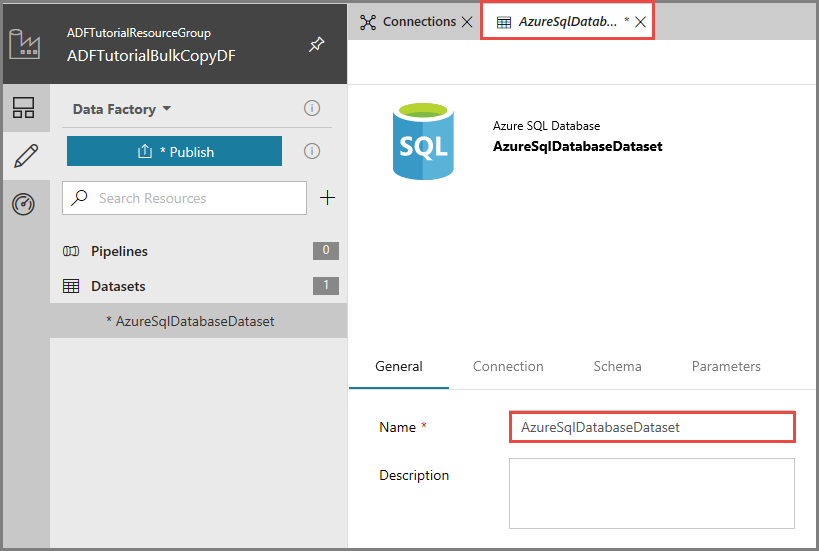
4. Switch to the **Connection** tab, and do the following steps: 

    1. Select **AzureSqlDatabaseLinkedService** for **Linked service**.
    2. Select any table for **Table**. This table is a dummy table. You specify a query on the source dataset when creating a pipeline. The query is used to extract data from the Azure SQL database.

    
 

### Create a dataset for sink SQL Data Warehouse

1. Click **+ (plus)** in the left pane, and click **Dataset**. 
2. In the **New Dataset** window, select **Azure SQL Data Warehouse**, and click **Finish**. You should see a new tab titled **AzureSqlDWTable1**. 
3. In the properties window at the bottom, enter **AzureSqlDWDataset** for **Name**.
4. Switch to the **Connection** tab, and select **AzureSqlDatabaseLinkedService** for **Linked service**.
5. Switch to the **Parameters** tab, and click **+ New**

    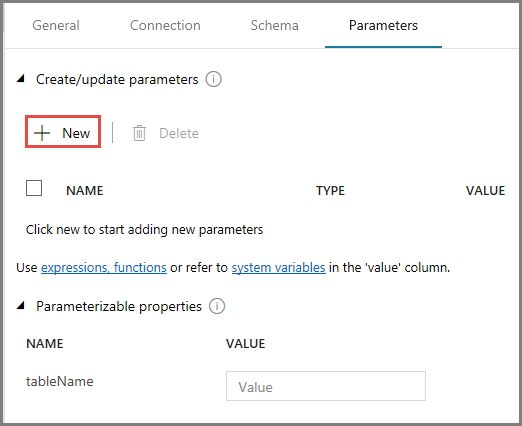
6. Enter **DWTableName** for the parameter name. 
7. In the **Parameterized properties** section, enter `@{dataset().DWTableName}` for **tableName** property. The **tableName** property of the dataset is set to the value that's passed as an argument for the **DWTableName** parameter.
   
    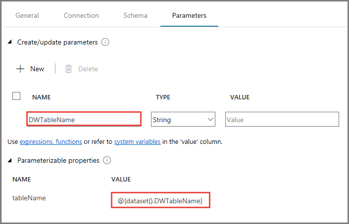

## Create pipelines
In this tutorial, you create two pipelines: **IterateAndCopySQLTables** and **GetTableListAndTriggerCopyData**. 

The **GetTableListAndTriggerCopyData** pipeline performs two steps:

* Looks up the Azure SQL Database system table to get the list of tables to be copied.
* Triggers the pipeline "IterateAndCopySQLTables" to do the actual data copy.

The  **GetTableListAndTriggerCopyData** takes a list of tables as a parameter. For each table in the list, it copies data from the table in Azure SQL Database to Azure SQL Data Warehouse using staged copy and PolyBase.

### Create the pipeline "IterateAndCopySQLTables"

1. In the left pane, click **+ (plus)**, and click **Pipeline**.

    
2. In the Properties window, change the name of the pipeline to **IterateAndCopySQLTables**. 

    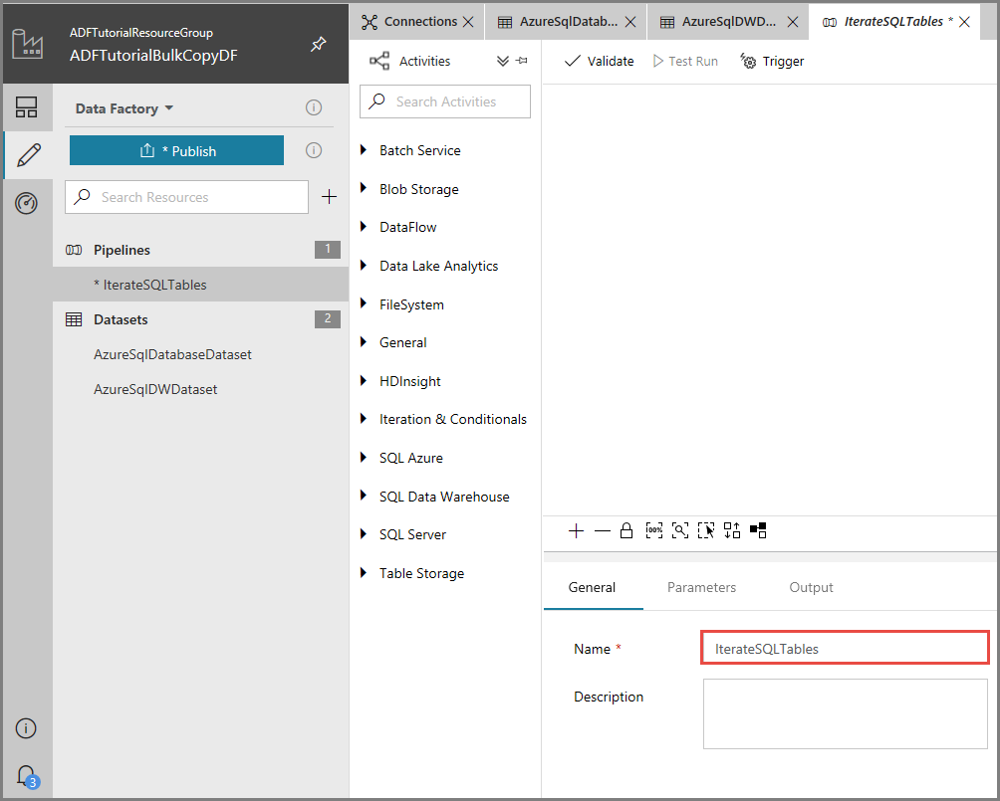
3. Switch to the **Parameters** tab, and do the following actions: 

    1. Click **+ New**. 
    2. Enter **tableList** for the parameter **name**.
    3. Select **Object** for **Type**.

        
4. Drag-drop **ForEach** activity from the **Activities** toolbox to the pipeline design surface. In the Properties window at the bottom, enter **IterateSQLTables** for **Name**. 

    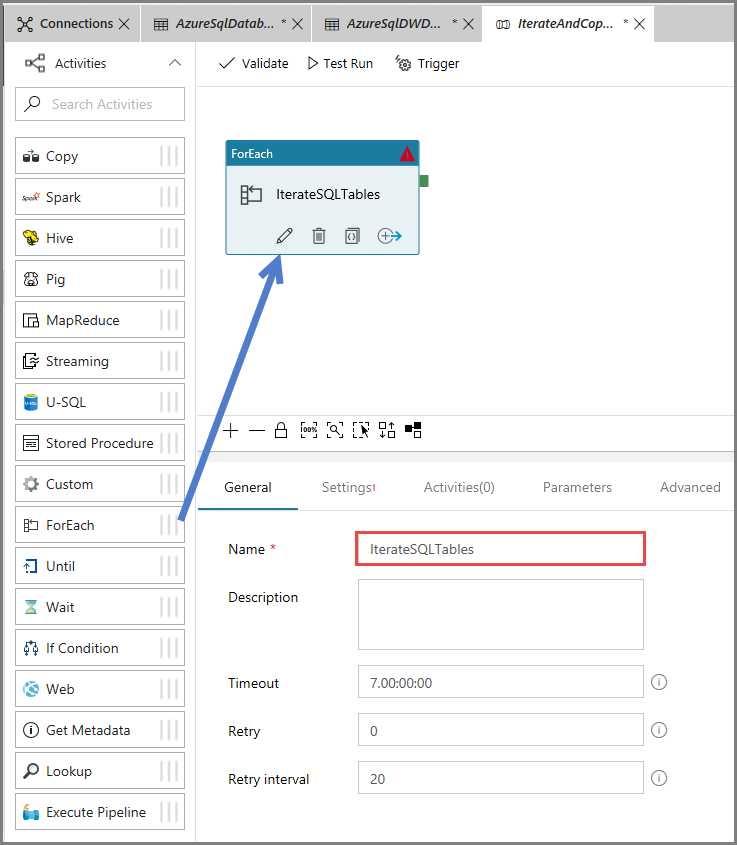
5. Switch to the **Settings** tab, and enter `@pipeline().parameters.tableList` for **Items**.

    
6. To add a child activity to the **ForEach** activity, click the **Edit (pencil icon)** as shown in the following image: 

    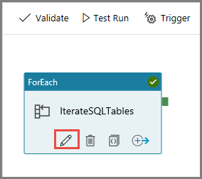
7. Drag-drop **Copy** activity into the pipeline designer surface, and change the name in the Properties window to **CopyData**. Notice the breadcrumb menu at the top. The IterateAndCopySQLTable is the pipeline name and IterateSQLTables is the ForEach activity name. The designer is in the activity scope. 

    
8. Switch to the **Source** tab, and do the following steps:

    1. Select **AzureSqlDatabaseDataset** for **Source Dataset**. 
    2. Select **Query** option for **User Query**. 
    3. Enter the following SQL query for **Query**.

        ```sql
        SELECT * FROM [@{item().TABLE_SCHEMA}].[@{item().TABLE_NAME}]
        ``` 

        
9. Switch to the **Sink** tab, and do the following steps: 

    1. Select **AzureSqlDWDataset** for **Sink Dataset**.
    2. Expand **Polybase Settings**, and select **Allow polybase**. 
    3. Enter the following SQL script for **Cleanup Script**. 

    ```sql
    TRUNCATE TABLE [@{item().TABLE_SCHEMA}].[@{item().TABLE_NAME}]
    ```

    
10. Switch to the **Parameters** tab, scroll down, if needed, to see the **Sink Dataset** section with **DWTableName** parameter. Set value of this parameter to `[@{item().TABLE_SCHEMA}].[@{item().TABLE_NAME}]`.

    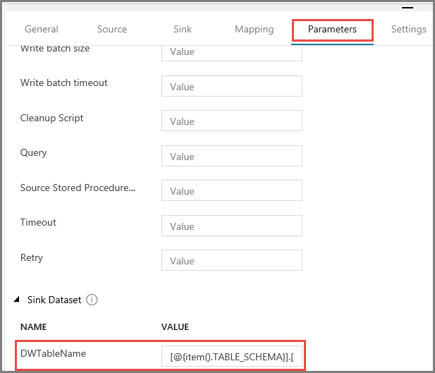
11. Switch to the **Settings** tab, and do the following steps: 

    1. Select **True** for **Enable Staging**.
    2. Select **AzureStorageLinkedService** for **Store Account Linked Service**.

        
12. To validate the pipeline settings, click **Validate**. Confirm that there is no validation error. To close the **Pipeline Validation Report**, click **>>**.

    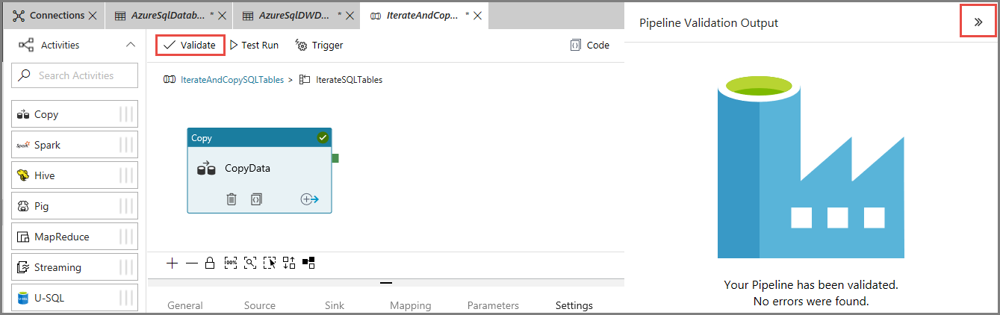

### Create the pipeline "GetTableListAndTriggerCopyData"

This pipeline performs two steps:

* Looks up the Azure SQL Database system table to get the list of tables to be copied.
* Triggers the pipeline "IterateAndCopySQLTables" to do the actual data copy.

1. In the left pane, click **+ (plus)**, and click **Pipeline**.

    
2. In the Properties window, change the name of the pipeline to **GetTableListAndTriggerCopyData**. 

    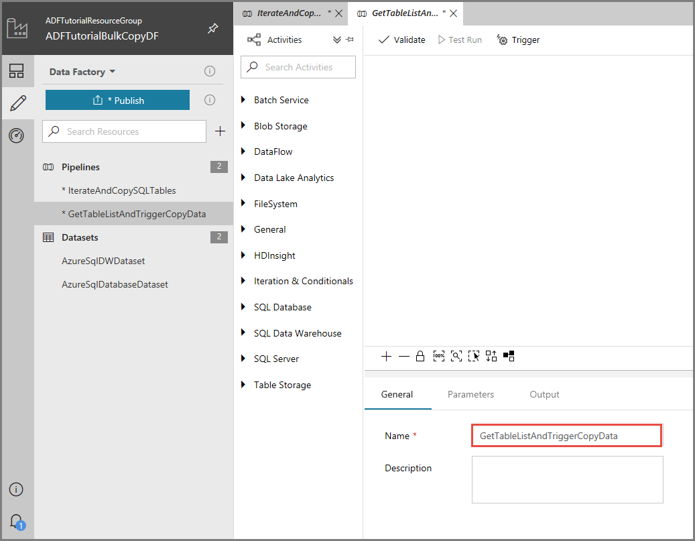
3. Drag-and-drop **Lookup** activity to the pipeline designer surface, and do the following steps:

    1. Enter **LookupTableList** for **Name**. 
    2. Enter **Retrieve the table list from Azure SQL database** for **Description**.

        
4. Switch to the **Settings** page, and do the following steps:

    1. Select **AzureSqlDatabaseDataset** for **Source Dataset**. 
    2. Select **Query** for **Use Query**. 
    3. Enter the following SQL query for **Query**.

        ```sql
        SELECT TABLE_SCHEMA, TABLE_NAME FROM information_schema.TABLES WHERE TABLE_TYPE = 'BASE TABLE' and TABLE_SCHEMA = 'SalesLT' and TABLE_NAME <> 'ProductModel'
        ```

        
5. Drag-and-drop **Execute Pipeline** activity from the Activities toolbox to the pipeline designer surface, and set the name to **TriggerCopy**.

        
6. Switch to the **Settings** page, and do the following steps: 

    1. Select **IterateAndCopySQLTables** for **Invoked pipeline**. 
    2. Expand the **Advanced** section. 
    3. Click **+ New** in the **Parameters** section. 
    4. Enter **tableList** for parameter **name**.
    5. Enter `@activity('LookupTableList').output.value` for parameter **value**.

        
7. **Connect** the **Lookup** activity to the **Execute Pipeline** activity by dragging the **green box** attached to the Lookup activity to the left of Execute Pipeline activity.

    
8. To validate the pipeline, click **Validate** on the toolbar. Confirm that there are no validation errors. To close the **Pipeline Validation Report**, click **>>**.

    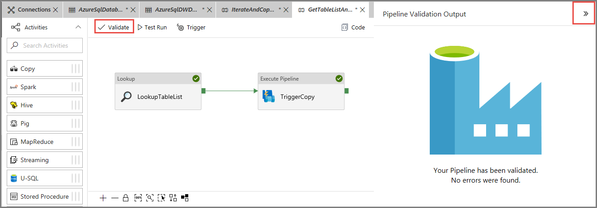
9. To publish entities (datasets, pipelines, etc.) to the Data Factory service, click **Publish**. 

    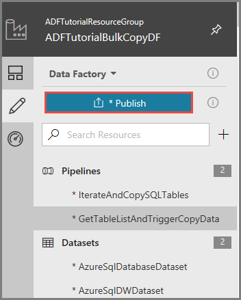

## Trigger a pipeline run

1. Confirm that **GetTableListAndTriggerCopyData** tab is active. 
2. Click **Trigger**, and click **Trigger Now**. 

    

## Monitor the pipeline run

1. Switch to the Monitor tab. 

## Next steps
You performed the following steps in this tutorial: 

> [!div class="checklist"]
> * Create a data factory.
> * Create Azure SQL Database, Azure SQL Data Warehouse, and Azure Storage linked services.
> * Create Azure SQL Database and Azure SQL Data Warehouse datasets.
> * Create a  pipeline to look up the tables to be copied and another pipeline to perform the actual copy operation. 
> * Start a pipeline run.
> * Monitor the pipeline and activity runs.

Advance to the following tutorial to learn about copy data incrementally from a source to a destination:
> [!div class="nextstepaction"]
>[Copy data incrementally](tutorial-incremental-copy-powershell.md)