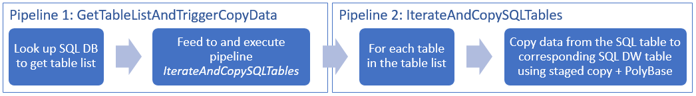

# Copy multiple tables in bulk by using Azure Data Factory using PowerShell

[!INCLUDE[appliesto-adf-xxx-md](includes/appliesto-adf-xxx-md.md)]

This tutorial demonstrates **copying a number of tables from Azure SQL Database to Azure SQL Data Warehouse**. You can apply the same pattern in other copy scenarios as well. For example, copying tables from SQL Server/Oracle to Azure SQL Database/Data Warehouse/Azure Blob, copying different paths from Blob to Azure SQL Database tables.

At a high level, this tutorial involves following steps:

> [!div class="checklist"]
> * Create a data factory.
> * Create Azure SQL Database, Azure SQL Data Warehouse, and Azure Storage linked services.
> * Create Azure SQL Database and Azure SQL Data Warehouse datasets.
> * Create a  pipeline to look up the tables to be copied and another pipeline to perform the actual copy operation. 
> * Start a pipeline run.
> * Monitor the pipeline and activity runs.

This tutorial uses Azure PowerShell. To learn about using other tools/SDKs to create a data factory, see [Quickstarts](quickstart-create-data-factory-dot-net.md). 

## End-to-end workflow
In this scenario, we have a number of tables in Azure SQL Database that we want to copy to SQL Data Warehouse. Here is the logical sequence of steps in the workflow that happens in pipelines:



* The first pipeline looks up the list of tables that needs to be copied over to the sink data stores.  Alternatively you can maintain a metadata table that lists all the tables to be copied to the sink data store. Then, the pipeline triggers another pipeline, which iterates over each table in the database and performs the data copy operation.
* The second pipeline performs the actual copy. It takes the list of tables as a parameter. For each table in the list, copy the specific table in Azure SQL Database to the corresponding table in SQL Data Warehouse using [staged copy via Blob storage and PolyBase](connector-azure-sql-data-warehouse.md#use-polybase-to-load-data-into-azure-sql-data-warehouse) for best performance. In this example, the first pipeline passes the list of tables as a value for the parameter. 

If you don't have an Azure subscription, create a [free](https://azure.microsoft.com/free/) account before you begin.

## Prerequisites

[!INCLUDE [updated-for-az](../../includes/updated-for-az.md)]

* **Azure PowerShell**. Follow the instructions in [How to install and configure Azure PowerShell](/powershell/azure/install-Az-ps).
* **Azure Storage account**. The Azure Storage account is used as staging blob storage in the bulk copy operation. 
* **Azure SQL Database**. This database contains the source data. 
* **Azure SQL Data Warehouse**. This data warehouse holds the data copied over from the SQL Database. 

### Prepare SQL Database and SQL Data Warehouse

**Prepare the source Azure SQL Database**:

Create an Azure SQL Database with Adventure Works LT sample data following [Create an Azure SQL database](../azure-sql/database/single-database-create-quickstart.md) article. This tutorial copies all the tables from this sample database to a SQL data warehouse.

**Prepare the sink Azure SQL Data Warehouse**:

1. If you don't have an Azure SQL Data Warehouse, see the [Create a SQL Data Warehouse](../sql-data-warehouse/sql-data-warehouse-get-started-tutorial.md) article for steps to create one.

2. Create corresponding table schemas in SQL Data Warehouse. You use Azure Data Factory to migrate/copy data in a later step.

## Azure services to access SQL server

For both SQL Database and SQL Data Warehouse, allow Azure services to access SQL server. Ensure that **Allow access to Azure services** setting is turned **ON** for your server. This setting allows the Data Factory service to read data from your Azure SQL Database and write data to your Azure SQL Data Warehouse. To verify and turn on this setting, do the following steps:

1. Click **All services** on the left and click **SQL servers**.
2. Select your server, and click **Firewall** under **SETTINGS**.
3. In the **Firewall settings** page, click **ON** for **Allow access to Azure services**.

## Create a data factory

1. Launch **PowerShell**. Keep Azure PowerShell open until the end of this tutorial. If you close and reopen, you need to run the commands again.

    Run the following command, and enter the user name and password that you use to sign in to the Azure portal:
        
    ```powershell
    Connect-AzAccount
    ```
    Run the following command to view all the subscriptions for this account:

    ```powershell
    Get-AzSubscription
    ```
    Run the following command to select the subscription that you want to work with. Replace **SubscriptionId** with the ID of your Azure subscription:

    ```powershell
    Select-AzSubscription -SubscriptionId "<SubscriptionId>"
    ```
2. Run the **Set-AzDataFactoryV2** cmdlet to create a data factory. Replace place-holders with your own values before executing the command. 

    ```powershell
	$resourceGroupName = "<your resource group to create the factory>"
	$dataFactoryName = "<specify the name of data factory to create. It must be globally unique.>"
	Set-AzDataFactoryV2 -ResourceGroupName $resourceGroupName -Location "East US" -Name $dataFactoryName
    ```

    Note the following points:

    * The name of the Azure data factory must be globally unique. If you receive the following error, change the name and try again.

        ```
        The specified Data Factory name 'ADFv2QuickStartDataFactory' is already in use. Data Factory names must be globally unique.
        ```

    * To create Data Factory instances, you must be a Contributor or Administrator of the Azure subscription.
    * For a list of Azure regions in which Data Factory is currently available, select the regions that interest you on the following page, and then expand **Analytics** to locate **Data Factory**: [Products available by region](https://azure.microsoft.com/global-infrastructure/services/). The data stores (Azure Storage, Azure SQL Database, etc.) and computes (HDInsight, etc.) used by data factory can be in other regions.

## Create linked services

In this tutorial, you create three linked services for source, sink, and staging blob respectively, which includes connections to your data stores:

### Create the source Azure SQL Database linked service

1. Create a JSON file named **AzureSqlDatabaseLinkedService.json** in **C:\ADFv2TutorialBulkCopy** folder with the following content: (Create the folder ADFv2TutorialBulkCopy if it does not already exist.)

	> [!IMPORTANT]
	> Replace &lt;servername&gt;, &lt;databasename&gt;, &lt;username&gt;@&lt;servername&gt; and &lt;password&gt; with values of your Azure SQL Database before saving the file.

    ```json
    {
        "name": "AzureSqlDatabaseLinkedService",
        "properties": {
            "type": "AzureSqlDatabase",
            "typeProperties": {
                "connectionString": "Server=tcp:<servername>.database.windows.net,1433;Database=<databasename>;User ID=<username>@<servername>;Password=<password>;Trusted_Connection=False;Encrypt=True;Connection Timeout=30"
            }
        }
    }
    ```

2. In **Azure PowerShell**, switch to the **ADFv2TutorialBulkCopy** folder.

3. Run the **Set-AzDataFactoryV2LinkedService** cmdlet to create the linked service: **AzureSqlDatabaseLinkedService**. 

    ```powershell
    Set-AzDataFactoryV2LinkedService -DataFactoryName $dataFactoryName -ResourceGroupName $resourceGroupName -Name "AzureSqlDatabaseLinkedService" -File ".\AzureSqlDatabaseLinkedService.json"
    ```

    Here is the sample output:

    ```json
    LinkedServiceName : AzureSqlDatabaseLinkedService
    ResourceGroupName : <resourceGroupName>
    DataFactoryName   : <dataFactoryName>
    Properties        : Microsoft.Azure.Management.DataFactory.Models.AzureSqlDatabaseLinkedService
    ```

### Create the sink Azure SQL Data Warehouse linked service

1. Create a JSON file named **AzureSqlDWLinkedService.json** in the **C:\ADFv2TutorialBulkCopy** folder, with the following content:

	> [!IMPORTANT]
	> Replace &lt;servername&gt;, &lt;databasename&gt;, &lt;username&gt;@&lt;servername&gt; and &lt;password&gt; with values of your Azure SQL Database before saving the file.

    ```json
    {
        "name": "AzureSqlDWLinkedService",
        "properties": {
            "type": "AzureSqlDW",
            "typeProperties": {
                "connectionString": "Server=tcp:<servername>.database.windows.net,1433;Database=<databasename>;User ID=<username>@<servername>;Password=<password>;Trusted_Connection=False;Encrypt=True;Connection Timeout=30"
            }
        }
    }
    ```

2. To create the linked service: **AzureSqlDWLinkedService**, run the **Set-AzDataFactoryV2LinkedService** cmdlet.

    ```powershell
    Set-AzDataFactoryV2LinkedService -DataFactoryName $dataFactoryName -ResourceGroupName $resourceGroupName -Name "AzureSqlDWLinkedService" -File ".\AzureSqlDWLinkedService.json"
    ```

    Here is the sample output:

    ```json
    LinkedServiceName : AzureSqlDWLinkedService
    ResourceGroupName : <resourceGroupName>
    DataFactoryName   : <dataFactoryName>
    Properties        : Microsoft.Azure.Management.DataFactory.Models.AzureSqlDWLinkedService
    ```

### Create the staging Azure Storage linked service

In this tutorial, you use Azure Blob storage as an interim staging area to enable PolyBase for a better copy performance.

1. Create a JSON file named **AzureStorageLinkedService.json** in the **C:\ADFv2TutorialBulkCopy** folder, with the following content:

	> [!IMPORTANT]
	> Replace &lt;accountName&gt; and &lt;accountKey&gt; with name and key of your Azure storage account before saving the file.

    ```json
    {
        "name": "AzureStorageLinkedService",
        "properties": {
            "type": "AzureStorage",
            "typeProperties": {
                "connectionString": "DefaultEndpointsProtocol=https;AccountName=<accountName>;AccountKey=<accountKey>"
            }
        }
    }
    ```

2. To create the linked service: **AzureStorageLinkedService**, run the **Set-AzDataFactoryV2LinkedService** cmdlet.

    ```powershell
    Set-AzDataFactoryV2LinkedService -DataFactoryName $dataFactoryName -ResourceGroupName $resourceGroupName -Name "AzureStorageLinkedService" -File ".\AzureStorageLinkedService.json"
    ```

    Here is the sample output:

    ```json
    LinkedServiceName : AzureStorageLinkedService
    ResourceGroupName : <resourceGroupName>
    DataFactoryName   : <dataFactoryName>
    Properties        : Microsoft.Azure.Management.DataFactory.Models.AzureStorageLinkedService
    ```

## Create datasets

In this tutorial, you create source and sink datasets, which specify the location where the data is stored:

### Create a dataset for source SQL Database

1. Create a JSON file named **AzureSqlDatabaseDataset.json** in the **C:\ADFv2TutorialBulkCopy** folder, with the following content. The "tableName" is a dummy one as later you use the SQL query in copy activity to retrieve data.

    ```json
    {
        "name": "AzureSqlDatabaseDataset",
        "properties": {
            "type": "AzureSqlTable",
            "linkedServiceName": {
                "referenceName": "AzureSqlDatabaseLinkedService",
                "type": "LinkedServiceReference"
            },
            "typeProperties": {
                "tableName": "dummy"
            }
        }
    }
    ```

2. To create the dataset: **AzureSqlDatabaseDataset**, run the **Set-AzDataFactoryV2Dataset** cmdlet.

    ```powershell
    Set-AzDataFactoryV2Dataset -DataFactoryName $dataFactoryName -ResourceGroupName $resourceGroupName -Name "AzureSqlDatabaseDataset" -File ".\AzureSqlDatabaseDataset.json"
    ```

    Here is the sample output:

    ```json
    DatasetName       : AzureSqlDatabaseDataset
    ResourceGroupName : <resourceGroupname>
    DataFactoryName   : <dataFactoryName>
    Structure         :
    Properties        : Microsoft.Azure.Management.DataFactory.Models.AzureSqlTableDataset
    ```

### Create a dataset for sink SQL Data Warehouse

1. Create a JSON file named **AzureSqlDWDataset.json** in the **C:\ADFv2TutorialBulkCopy** folder, with the following content: The "tableName" is set as a parameter, later the copy activity that references this dataset passes the actual value into the dataset.

    ```json
    {
        "name": "AzureSqlDWDataset",
        "properties": {
            "type": "AzureSqlDWTable",
            "linkedServiceName": {
                "referenceName": "AzureSqlDWLinkedService",
                "type": "LinkedServiceReference"
            },
            "typeProperties": {
                "tableName": {
                    "value": "@{dataset().DWTableName}",
                    "type": "Expression"
                }
            },
            "parameters":{
                "DWTableName":{
                    "type":"String"
                }
            }
        }
    }
    ```

2. To create the dataset: **AzureSqlDWDataset**, run the **Set-AzDataFactoryV2Dataset** cmdlet.

    ```powershell
    Set-AzDataFactoryV2Dataset -DataFactoryName $dataFactoryName -ResourceGroupName $resourceGroupName -Name "AzureSqlDWDataset" -File ".\AzureSqlDWDataset.json"
    ```

    Here is the sample output:

    ```json
    DatasetName       : AzureSqlDWDataset
    ResourceGroupName : <resourceGroupname>
    DataFactoryName   : <dataFactoryName>
    Structure         :
    Properties        : Microsoft.Azure.Management.DataFactory.Models.AzureSqlDwTableDataset
    ```

## Create pipelines

In this tutorial, you create two pipelines:

### Create the pipeline "IterateAndCopySQLTables"

This pipeline takes a list of tables as a parameter. For each table in the list, it copies data from the table in Azure SQL Database to Azure SQL Data Warehouse using staged copy and PolyBase.

1. Create a JSON file named **IterateAndCopySQLTables.json** in the **C:\ADFv2TutorialBulkCopy** folder, with the following content:

    ```json
    {
        "name": "IterateAndCopySQLTables",
        "properties": {
            "activities": [
                {
                    "name": "IterateSQLTables",
                    "type": "ForEach",
                    "typeProperties": {
                        "isSequential": "false",
                        "items": {
                            "value": "@pipeline().parameters.tableList",
                            "type": "Expression"
                        },
                        "activities": [
                            {
                                "name": "CopyData",
                                "description": "Copy data from SQL database to SQL DW",
                                "type": "Copy",
                                "inputs": [
                                    {
                                        "referenceName": "AzureSqlDatabaseDataset",
                                        "type": "DatasetReference"
                                    }
                                ],
                                "outputs": [
                                    {
                                        "referenceName": "AzureSqlDWDataset",
                                        "type": "DatasetReference",
                                        "parameters": {
                                            "DWTableName": "[@{item().TABLE_SCHEMA}].[@{item().TABLE_NAME}]"
                                        }
                                    }
                                ],
                                "typeProperties": {
                                    "source": {
                                        "type": "SqlSource",
                                        "sqlReaderQuery": "SELECT * FROM [@{item().TABLE_SCHEMA}].[@{item().TABLE_NAME}]"
                                    },
                                    "sink": {
                                        "type": "SqlDWSink",
                                        "preCopyScript": "TRUNCATE TABLE [@{item().TABLE_SCHEMA}].[@{item().TABLE_NAME}]",
                                        "allowPolyBase": true
                                    },
                                    "enableStaging": true,
                                    "stagingSettings": {
                                        "linkedServiceName": {
                                            "referenceName": "AzureStorageLinkedService",
                                            "type": "LinkedServiceReference"
                                        }
                                    }
                                }
                            }
                        ]
                    }
                }
            ],
            "parameters": {
                "tableList": {
                    "type": "Object"
                }
            }
        }
    }
    ```

2. To create the pipeline: **IterateAndCopySQLTables**, Run the **Set-AzDataFactoryV2Pipeline** cmdlet.

    ```powershell
    Set-AzDataFactoryV2Pipeline -DataFactoryName $dataFactoryName -ResourceGroupName $resourceGroupName -Name "IterateAndCopySQLTables" -File ".\IterateAndCopySQLTables.json"
    ```

    Here is the sample output:

    ```json
    PipelineName      : IterateAndCopySQLTables
    ResourceGroupName : <resourceGroupName>
    DataFactoryName   : <dataFactoryName>
    Activities        : {IterateSQLTables}
    Parameters        : {[tableList, Microsoft.Azure.Management.DataFactory.Models.ParameterSpecification]}
    ```

### Create the pipeline "GetTableListAndTriggerCopyData"

This pipeline performs two steps:

* Looks up the Azure SQL Database system table to get the list of tables to be copied.
* Triggers the pipeline "IterateAndCopySQLTables" to do the actual data copy.

1. Create a JSON file named **GetTableListAndTriggerCopyData.json** in the **C:\ADFv2TutorialBulkCopy** folder, with the following content:

    ```json
    {
        "name":"GetTableListAndTriggerCopyData",
        "properties":{
            "activities":[
                { 
                    "name": "LookupTableList",
                    "description": "Retrieve the table list from Azure SQL dataabse",
                    "type": "Lookup",
                    "typeProperties": {
                        "source": {
                            "type": "SqlSource",
                            "sqlReaderQuery": "SELECT TABLE_SCHEMA, TABLE_NAME FROM information_schema.TABLES WHERE TABLE_TYPE = 'BASE TABLE' and TABLE_SCHEMA = 'SalesLT' and TABLE_NAME <> 'ProductModel'"
                        },
                        "dataset": {
                            "referenceName": "AzureSqlDatabaseDataset",
                            "type": "DatasetReference"
                        },
                        "firstRowOnly": false
                    }
                },
                {
                    "name": "TriggerCopy",
                    "type": "ExecutePipeline",
                    "typeProperties": {
                        "parameters": {
                            "tableList": {
                                "value": "@activity('LookupTableList').output.value",
                                "type": "Expression"
                            }
                        },
                        "pipeline": {
                            "referenceName": "IterateAndCopySQLTables",
                            "type": "PipelineReference"
                        },
                        "waitOnCompletion": true
                    },
                    "dependsOn": [
                        {
                            "activity": "LookupTableList",
                            "dependencyConditions": [
                                "Succeeded"
                            ]
                        }
                    ]
                }
            ]
        }
    }
    ```

2. To create the pipeline: **GetTableListAndTriggerCopyData**, Run the **Set-AzDataFactoryV2Pipeline** cmdlet.

    ```powershell
    Set-AzDataFactoryV2Pipeline -DataFactoryName $dataFactoryName -ResourceGroupName $resourceGroupName -Name "GetTableListAndTriggerCopyData" -File ".\GetTableListAndTriggerCopyData.json"
    ```

    Here is the sample output:

    ```json
    PipelineName      : GetTableListAndTriggerCopyData
    ResourceGroupName : <resourceGroupName>
    DataFactoryName   : <dataFactoryName>
    Activities        : {LookupTableList, TriggerCopy}
    Parameters        :
    ```

## Start and monitor pipeline run

1. Start a pipeline run for the main "GetTableListAndTriggerCopyData" pipeline and capture the pipeline run ID for future monitoring. Underneath, it triggers the run for pipeline "IterateAndCopySQLTables" as specified in ExecutePipeline activity.

    ```powershell
    $runId = Invoke-AzDataFactoryV2Pipeline -DataFactoryName $dataFactoryName -ResourceGroupName $resourceGroupName -PipelineName 'GetTableListAndTriggerCopyData'
    ```

2. 	Run the following script to continuously check the run status of pipeline **GetTableListAndTriggerCopyData**, and print out the final pipeline run and activity run result.

    ```powershell
	while ($True) {
        $run = Get-AzDataFactoryV2PipelineRun -ResourceGroupName $resourceGroupName -DataFactoryName $DataFactoryName -PipelineRunId $runId

        if ($run) {
            if ($run.Status -ne 'InProgress') {
                Write-Host "Pipeline run finished. The status is: " $run.Status -foregroundcolor "Yellow"
                Write-Host "Pipeline run details:" -foregroundcolor "Yellow"
                $run
                break
            }
            Write-Host  "Pipeline is running...status: InProgress" -foregroundcolor "Yellow"
        }

        Start-Sleep -Seconds 15
    }

	$result = Get-AzDataFactoryV2ActivityRun -DataFactoryName $dataFactoryName -ResourceGroupName $resourceGroupName -PipelineRunId $runId -RunStartedAfter (Get-Date).AddMinutes(-30) -RunStartedBefore (Get-Date).AddMinutes(30)
    Write-Host "Activity run details:" -foregroundcolor "Yellow"
    $result
    ```

    Here is the output of the sample run:

    ```json
	Pipeline run details:
    ResourceGroupName : <resourceGroupName>
    DataFactoryName   : <dataFactoryName>
    RunId             : 0000000000-00000-0000-0000-000000000000
    PipelineName      : GetTableListAndTriggerCopyData
    LastUpdated       : 9/18/2017 4:08:15 PM
    Parameters        : {}
    RunStart          : 9/18/2017 4:06:44 PM
    RunEnd            : 9/18/2017 4:08:15 PM
    DurationInMs      : 90637
    Status            : Succeeded
    Message           : 

    Activity run details:
    ResourceGroupName : <resourceGroupName>
    DataFactoryName   : <dataFactoryName>
    ActivityName      : LookupTableList
    PipelineRunId     : 0000000000-00000-0000-0000-000000000000
    PipelineName      : GetTableListAndTriggerCopyData
    Input             : {source, dataset, firstRowOnly}
    Output            : {count, value, effectiveIntegrationRuntime}
    LinkedServiceName : 
    ActivityRunStart  : 9/18/2017 4:06:46 PM
    ActivityRunEnd    : 9/18/2017 4:07:09 PM
    DurationInMs      : 22995
    Status            : Succeeded
    Error             : {errorCode, message, failureType, target}

    ResourceGroupName : <resourceGroupName>
    DataFactoryName   : <dataFactoryName>
    ActivityName      : TriggerCopy
    PipelineRunId     : 0000000000-00000-0000-0000-000000000000
    PipelineName      : GetTableListAndTriggerCopyData
    Input             : {pipeline, parameters, waitOnCompletion}
    Output            : {pipelineRunId}
    LinkedServiceName : 
    ActivityRunStart  : 9/18/2017 4:07:11 PM
    ActivityRunEnd    : 9/18/2017 4:08:14 PM
    DurationInMs      : 62581
    Status            : Succeeded
    Error             : {errorCode, message, failureType, target}
    ```

3. You can get the run ID of pipeline "**IterateAndCopySQLTables**", and check the detailed activity run result as the following.

    ```powershell
    Write-Host "Pipeline 'IterateAndCopySQLTables' run result:" -foregroundcolor "Yellow"
    ($result | Where-Object {$_.ActivityName -eq "TriggerCopy"}).Output.ToString()
    ```

    Here is the output of the sample run:

    ```json
    {
        "pipelineRunId": "7514d165-14bf-41fb-b5fb-789bea6c9e58"
    }
    ```

    ```powershell
    $result2 = Get-AzDataFactoryV2ActivityRun -DataFactoryName $dataFactoryName -ResourceGroupName $resourceGroupName -PipelineRunId <copy above run ID> -RunStartedAfter (Get-Date).AddMinutes(-30) -RunStartedBefore (Get-Date).AddMinutes(30)
    $result2
    ```

3. Connect to your sink Azure SQL Data Warehouse and confirm that data has been copied from Azure SQL Database properly.

## Next steps
You performed the following steps in this tutorial: 

> [!div class="checklist"]
> * Create a data factory.
> * Create Azure SQL Database, Azure SQL Data Warehouse, and Azure Storage linked services.
> * Create Azure SQL Database and Azure SQL Data Warehouse datasets.
> * Create a  pipeline to look up the tables to be copied and another pipeline to perform the actual copy operation. 
> * Start a pipeline run.
> * Monitor the pipeline and activity runs.

Advance to the following tutorial to learn about copy data incrementally from a source to a destination:
> [!div class="nextstepaction"]
>[Copy data incrementally](tutorial-incremental-copy-powershell.md)
