# Branching and chaining activities in a Data Factory pipeline

In this tutorial, you create a Data Factory pipeline that showcases some of the control flow features. This pipeline does a simple copy from a container in Azure Blob Storage to another container in the same storage account. If the copy activity succeeds, the pipeline sends details of the successful copy operation (such as the amount of data written) in a success email. If the copy activity fails, the pipeline sends details of copy failure (such as the error message) in a failure email. Throughout the tutorial, you see how to pass parameters.

A high-level overview of the scenario:
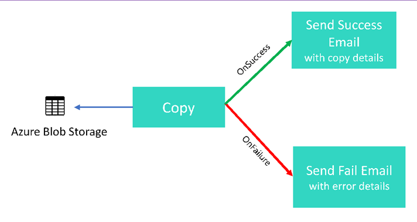

You perform the following steps in this tutorial:

> [!div class="checklist"]
> * Create a data factory.
> * Create an Azure Storage linked service.
> * Create an Azure Blob dataset
> * Create a pipeline that contains a Copy activity and a Web activity
> * Send outputs of activities to subsequent activities
> * Utilize parameter passing and system variables
> * Start a pipeline run
> * Monitor the pipeline and activity runs

This tutorial uses Azure portal. You can use other mechanisms to interact with Azure Data Factory, refer to "Quickstarts" in the table of contents.

## Prerequisites

* **Azure subscription**. If you don't have an Azure subscription, create a [free](https://azure.microsoft.com/free/) account before you begin.
* **Azure Storage account**. You use the blob storage as **source** data store. If you don't have an Azure storage account, see the [Create a storage account](../storage/common/storage-account-create.md) article for steps to create one.
* **Azure SQL Database**. You use the database as **sink** data store. If you don't have an Azure SQL Database, see the [Create an Azure SQL database](../sql-database/sql-database-get-started-portal.md) article for steps to create one.

### Create blob table

1. Launch Notepad. Copy the following text and save it as **input.txt** file on your disk.

    ```
    John,Doe
    Jane,Doe
    ```
2. Use tools such as [Azure Storage Explorer](https://storageexplorer.com/) do the following steps:
    1. Create the **adfv2branch** container.
    2. Create **input** folder in the **adfv2branch** container.
    3. Upload **input.txt** file to the container.

## Create email workflow endpoints
To trigger sending an email from the pipeline, you use [Logic Apps](../logic-apps/logic-apps-overview.md) to define the workflow. For details on creating a Logic App workflow, see [How to create a logic app](../logic-apps/quickstart-create-first-logic-app-workflow.md).

### Success email workflow
Create a Logic App workflow named `CopySuccessEmail`. Define the workflow trigger as `When an HTTP request is received`, and add an action of `Office 365 Outlook – Send an email`.

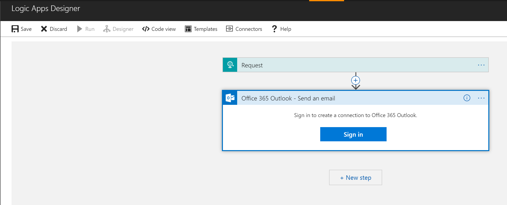

For your request trigger, fill in the `Request Body JSON Schema` with the following JSON:

```json
{
    "properties": {
        "dataFactoryName": {
            "type": "string"
        },
        "message": {
            "type": "string"
        },
        "pipelineName": {
            "type": "string"
        },
        "receiver": {
            "type": "string"
        }
    },
    "type": "object"
}
```

The Request in the Logic App Designer should look like the following image:


For the **Send Email** action, customize how you wish to format the email, utilizing the properties passed in the request Body JSON schema. Here is an example:

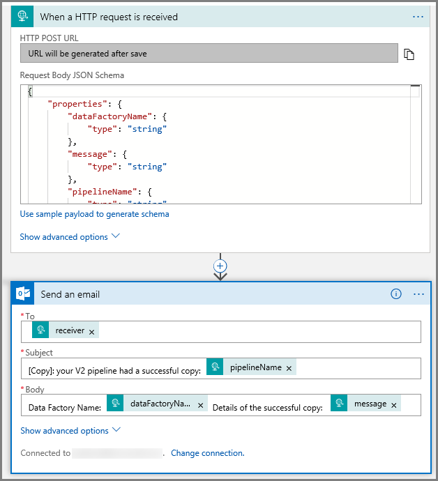

Save the workflow. Make a note of your HTTP Post request URL for your success email workflow:

```
//Success Request Url
https://prodxxx.eastus.logic.azure.com:443/workflows/000000/triggers/manual/paths/invoke?api-version=2016-10-01&sp=%2Ftriggers%2Fmanual%2Frun&sv=1.0&sig=000000
```

### Fail email workflow
Follow the same steps to create another Logic Apps workflow of **CopyFailEmail**. In the request trigger, the `Request Body JSON schema` is the same. Change the format of your email like the `Subject` to tailor toward a failure email. Here is an example:

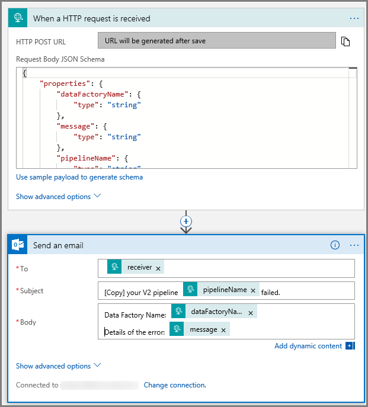

Save the workflow. Make a note of your HTTP Post request URL for your failure email workflow:

```
//Fail Request Url
https://prodxxx.eastus.logic.azure.com:443/workflows/000000/triggers/manual/paths/invoke?api-version=2016-10-01&sp=%2Ftriggers%2Fmanual%2Frun&sv=1.0&sig=000000
```

You should now have two workflow URLs:

```
//Success Request Url
https://prodxxx.eastus.logic.azure.com:443/workflows/000000/triggers/manual/paths/invoke?api-version=2016-10-01&sp=%2Ftriggers%2Fmanual%2Frun&sv=1.0&sig=000000

//Fail Request Url
https://prodxxx.eastus.logic.azure.com:443/workflows/000000/triggers/manual/paths/invoke?api-version=2016-10-01&sp=%2Ftriggers%2Fmanual%2Frun&sv=1.0&sig=000000
```

## Create a data factory

1. Launch **Microsoft Edge** or **Google Chrome** web browser. Currently, Data Factory UI is supported only in Microsoft Edge and Google Chrome web browsers.
1. On the left menu, select **Create a resource** > **Data + Analytics** > **Data Factory**:

   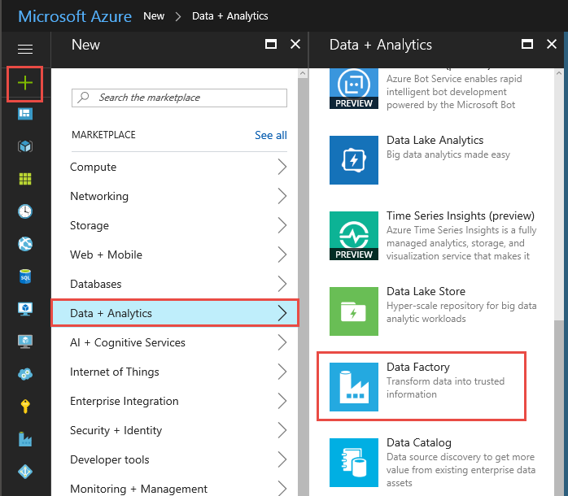

2. In the **New data factory** page, enter **ADFTutorialDataFactory** for the **name**.

     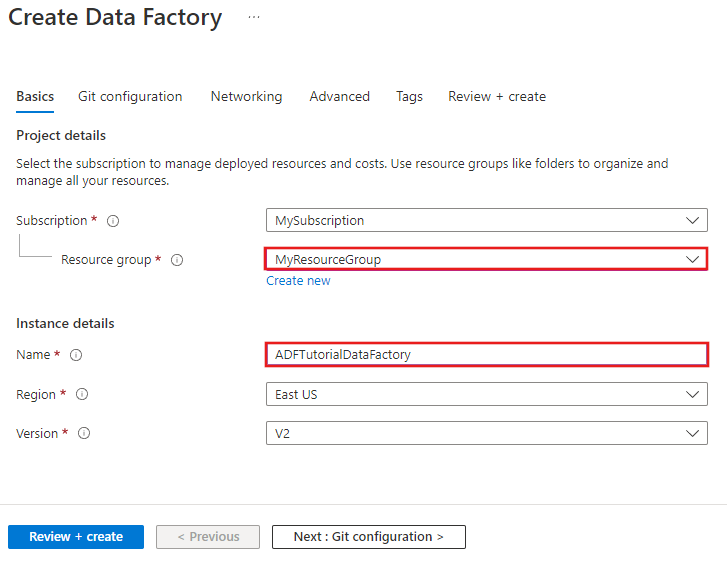

   The name of the Azure data factory must be **globally unique**. If you receive the following error, change the name of the data factory (for example, yournameADFTutorialDataFactory) and try creating again. See [Data Factory - Naming Rules](naming-rules.md) article for naming rules for Data Factory artifacts.

       `Data factory name “ADFTutorialDataFactory” is not available`
3. Select your Azure **subscription** in which you want to create the data factory.
4. For the **Resource Group**, do one of the following steps:

      - Select **Use existing**, and select an existing resource group from the drop-down list.
      - Select **Create new**, and enter the name of a resource group.   
         
        To learn about resource groups, see [Using resource groups to manage your Azure resources](../azure-resource-manager/management/overview.md).  
4. Select **V2** for the **version**.
5. Select the **location** for the data factory. Only locations that are supported are displayed in the drop-down list. The data stores (Azure Storage, Azure SQL Database, etc.) and computes (HDInsight, etc.) used by data factory can be in other regions.
6. Select **Pin to dashboard**.     
7. Click **Create**.      
8. On the dashboard, you see the following tile with status: **Deploying data factory**.

	
9. After the creation is complete, you see the **Data Factory** page as shown in the image.

   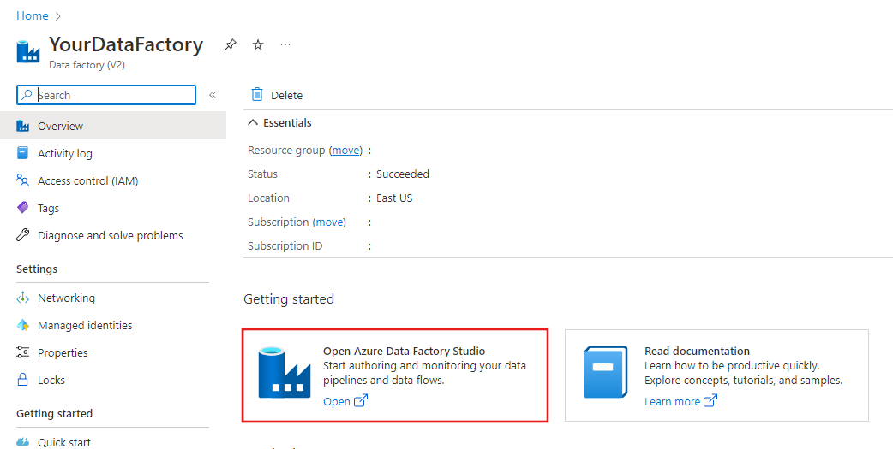
10. Click **Author & Monitor** tile to launch the Azure Data Factory user interface (UI) in a separate tab.


## Create a pipeline
In this step, you create a pipeline with one Copy activity and two Web activities. You use the following features to create the pipeline:

- Parameters for the pipeline that are access by datasets.
- Web activity to invoke logic apps workflows to send success/failure emails.
- Connecting one activity with another activity (on success and failure)
- Using output from an activity as an input to the subsequent activity

1. In the **get started** page of Data Factory UI, click the **Create pipeline** tile.  

   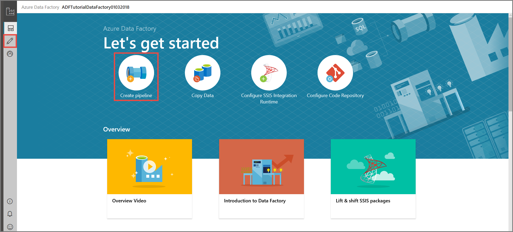
3. In the properties window for the pipeline, switch to the **Parameters** tab, and use the **New** button to add the following three parameters of type String: sourceBlobContainer, sinkBlobContainer, and receiver.

    - **sourceBlobContainer** - parameter in the pipeline consumed by the source blob dataset.
    - **sinkBlobContainer** – parameter in the pipeline consumed by the sink blob dataset
    - **receiver** – this parameter is used by the two Web activities in the pipeline that send success or failure emails to the receiver whose email address is specified by this parameter.

   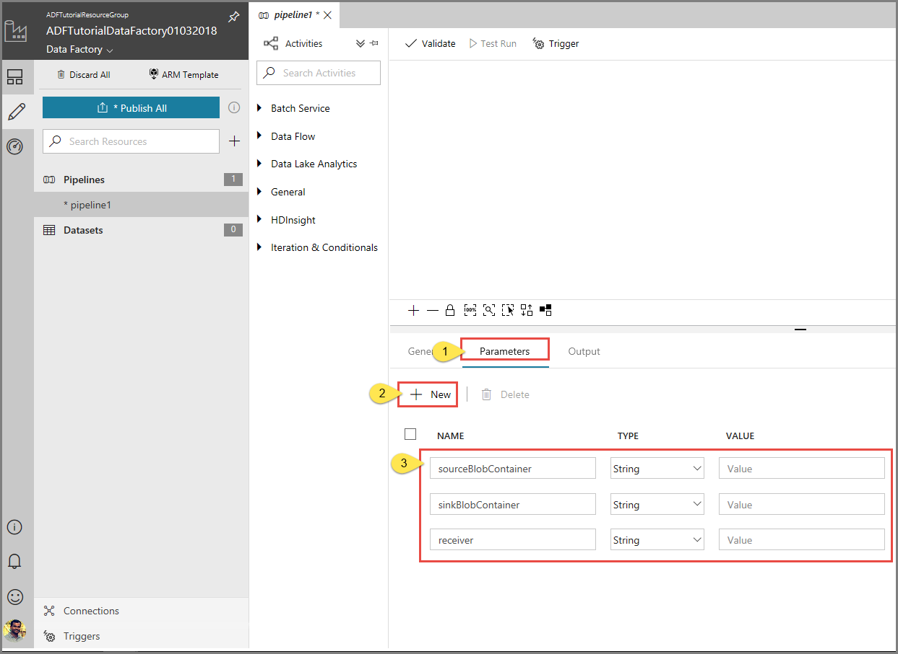
4. In the **Activities** toolbox, expand **Data Flow**, and drag-drop **Copy** activity to the pipeline designer surface.

   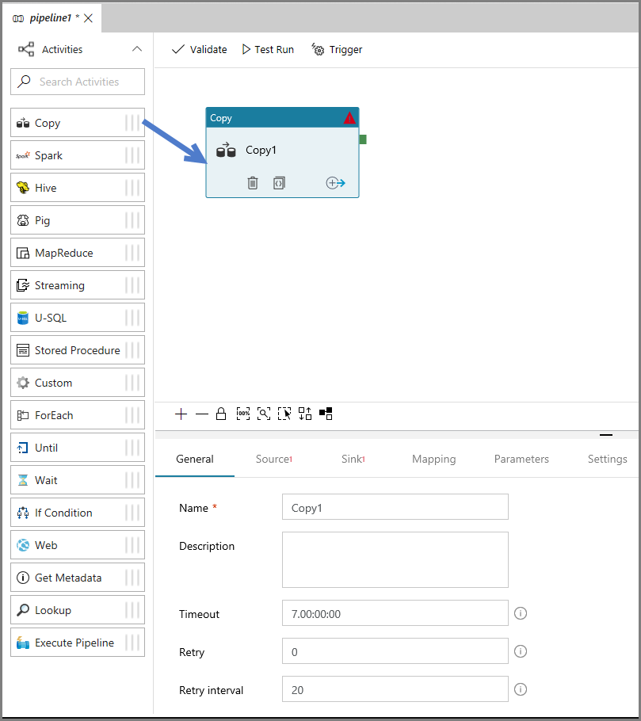
5. In the **Properties** window for the **Copy** activity at the bottom, switch to the **Source** tab, and click **+ New**. You create a source dataset for the copy activity in this step.

   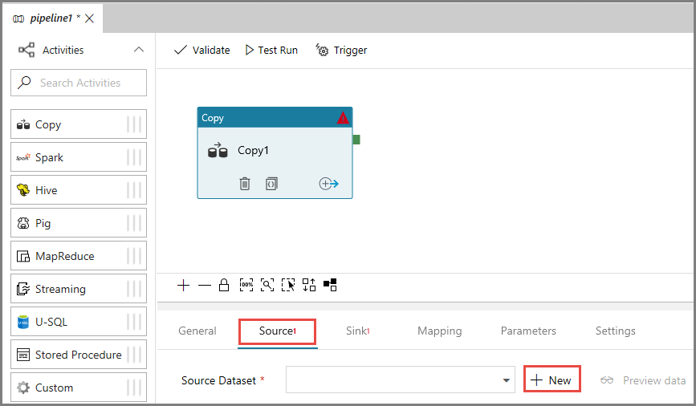
6. In the **New Dataset** window, select **Azure Blob Storage**, and click **Finish**.

   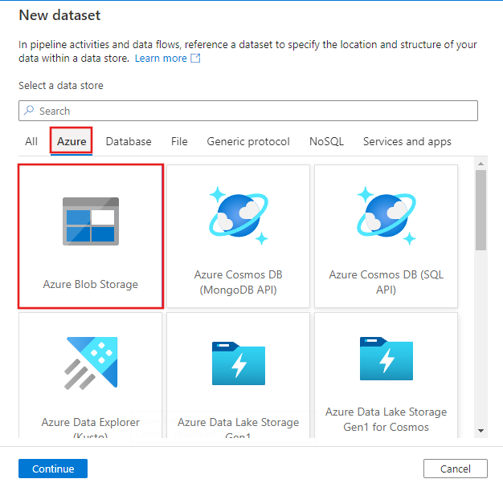
7. You see a new **tab** titled **AzureBlob1**. Change the name of the dataset to **SourceBlobDataset**.

   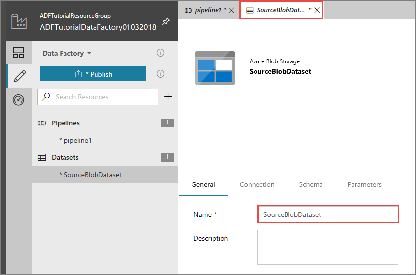
8. Switch to the **Connection** tab in the **Properties** window, and click New for the **Linked service**. You create a linked service to link your Azure Storage account to the data factory in this step.

   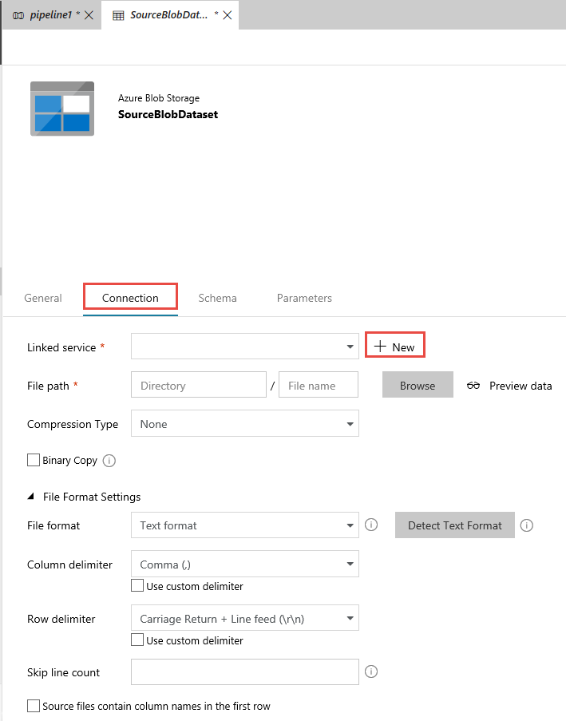
9. In the **New Linked Service** window, do the following steps:

    1. Enter **AzureStorageLinkedService** for **Name**.
    2. Select your Azure storage account for the **Storage account name**.
    3. Click **Save**.

   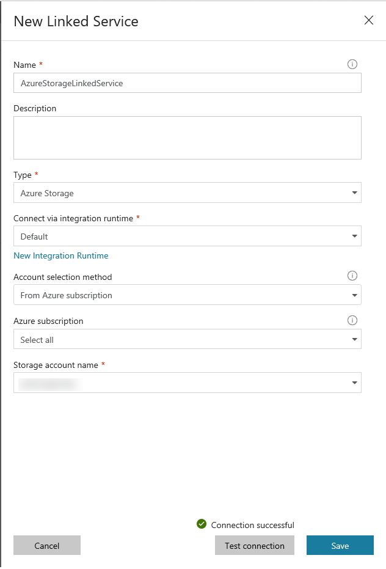
12. Enter `@pipeline().parameters.sourceBlobContainer` for the folder and `emp.txt` for the file name. You use the sourceBlobContainer pipeline parameter to set the folder path for the dataset.

   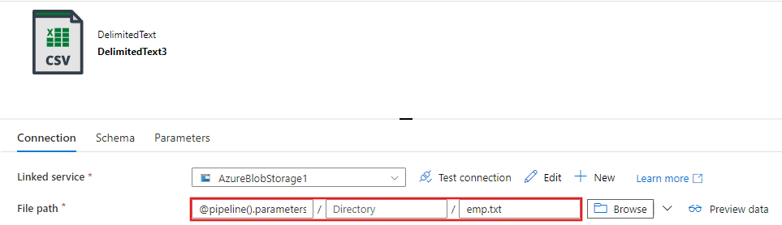
13. Switch to the **pipeline** tab (or) click the pipeline in the treeview. Confirm that **SourceBlobDataset** is selected for **Source Dataset**.

    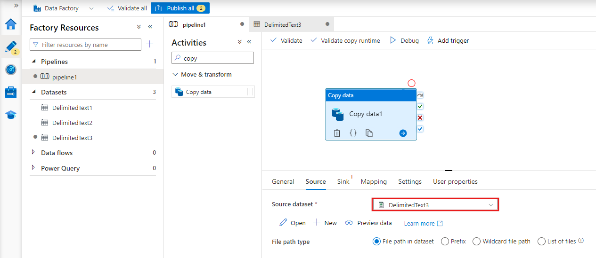
13. In the properties window, switch to the **Sink** tab, and click **+ New** for **Sink Dataset**. You create a sink dataset for the copy activity in this step similar to the way you created the source dataset.

    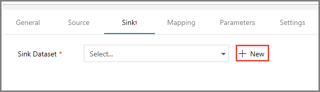
14. In the **New Dataset** window, select **Azure Blob Storage**, and click **Finish**.
15. In the **General** settings page for the dataset, enter **SinkBlobDataset** for **Name**.
16. Switch to the **Connection** tab, and do the following steps:

    1. Select **AzureStorageLinkedService** for **LinkedService**.
    2. Enter `@pipeline().parameters.sinkBlobContainer` for the folder.
    1. Enter `@CONCAT(pipeline().RunId, '.txt')` for the file name. The expression uses the ID of the current pipeline run for the file name. For the supported list of system variables and expressions, see [System variables](control-flow-system-variables.md) and [Expression language](control-flow-expression-language-functions.md).

        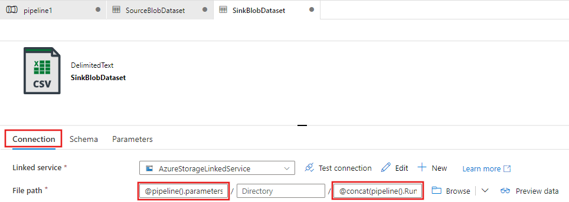
17. Switch to the **pipeline** tab at the top. Expand **General** in the **Activities** toolbox, and drag-drop a **Web** activity to the pipeline designer surface. Set the name of the activity to **SendSuccessEmailActivity**. The Web Activity allows a call to any REST endpoint. For more information about the activity, see [Web Activity](control-flow-web-activity.md). This pipeline uses a Web Activity to call the Logic Apps email workflow.

    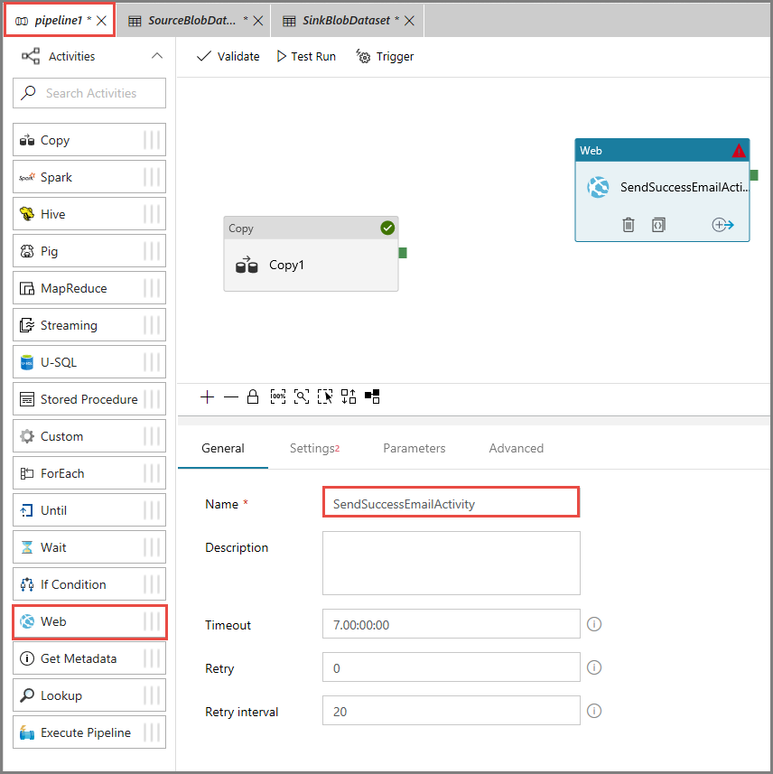
18. Switch to the **Settings** tab from the **General** tab, and do the following steps:
    1. For **URL**, specify URL for the logic apps workflow that sends the success email.  
    2. Select **POST** for **Method**.
    3. Click **+ Add header** link in the **Headers** section.
    4. Add a header **Content-Type** and set it to **application/json**.
    5. Specify the following JSON for **Body**.

        ```json
        {
            "message": "@{activity('Copy1').output.dataWritten}",
            "dataFactoryName": "@{pipeline().DataFactory}",
            "pipelineName": "@{pipeline().Pipeline}",
            "receiver": "@pipeline().parameters.receiver"
        }
        ```
        The message body contains the following properties:

       - Message – Passing value of `@{activity('Copy1').output.dataWritten`. Accesses a property of the previous copy activity and passes the value of dataWritten. For the failure case, pass the error output instead of `@{activity('CopyBlobtoBlob').error.message`.
       - Data Factory Name – Passing value of `@{pipeline().DataFactory}` This is a system variable, allowing you to access the corresponding data factory name. For a list of system variables, see [System Variables](control-flow-system-variables.md) article.
       - Pipeline Name – Passing value of `@{pipeline().Pipeline}`. This is also a system variable, allowing you to access the corresponding pipeline name.
       - Receiver – Passing value of "\@pipeline().parameters.receiver"). Accessing the pipeline parameters.

                  
19. Connect the **Copy** activity to the **Web** activity by dragging the green button next to the Copy activity and dropping on the Web activity.

    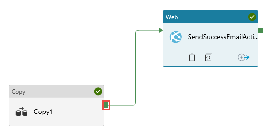
20. Drag-drop another **Web** activity from the Activities toolbox to the pipeline designer surface, and set the **name** to **SendFailureEmailActivity**.

    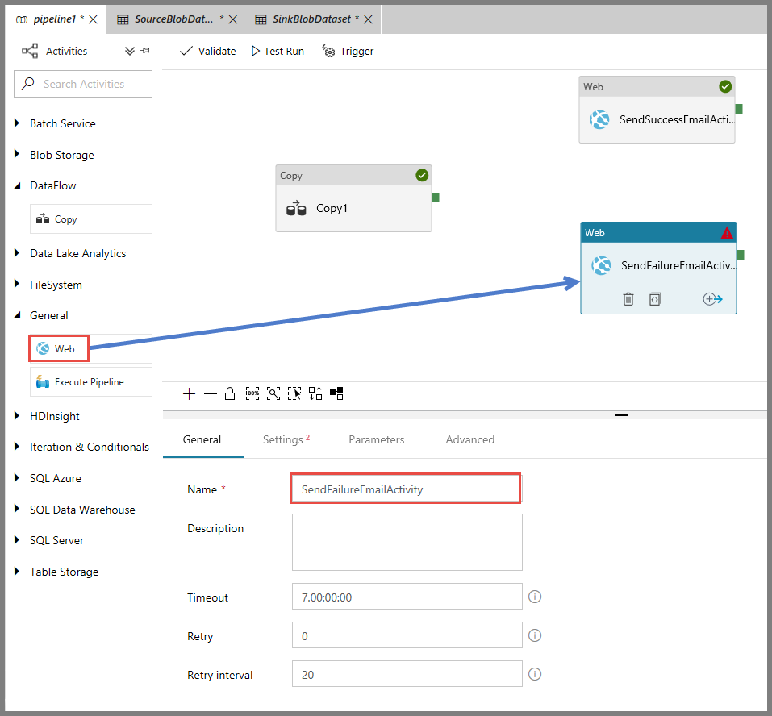
21. Switch to the **Settings** tab, and do the following steps:

    1. For **URL**, specify URL for the logic apps workflow that sends the failure email.  
    2. Select **POST** for **Method**.
    3. Click **+ Add header** link in the **Headers** section.
    4. Add a header **Content-Type** and set it to **application/json**.
    5. Specify the following JSON for **Body**.

        ```json
        {
            "message": "@{activity('Copy1').error.message}",
            "dataFactoryName": "@{pipeline().DataFactory}",
            "pipelineName": "@{pipeline().Pipeline}",
            "receiver": "@pipeline().parameters.receiver"
        }
        ```

        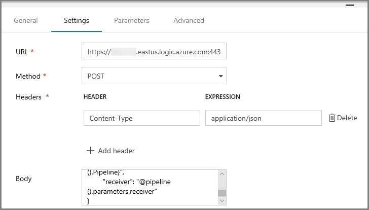         
22. Select **Copy** activity in the pipeline designer, and click **+->** button, and select **Error**.  

    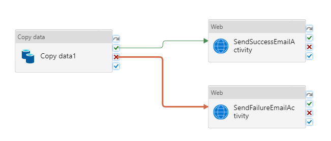
23. Drag the **red** button next to the Copy activity to the second Web activity **SendFailureEmailActivity**. You can move the activities around so that the pipeline looks like in the following image:

    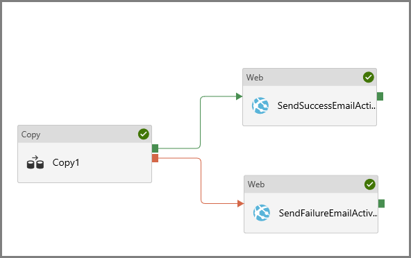
24. To validate the pipeline, click **Validate** button on the toolbar. Close the **Pipeline Validation Output** window by clicking the **>>** button.

    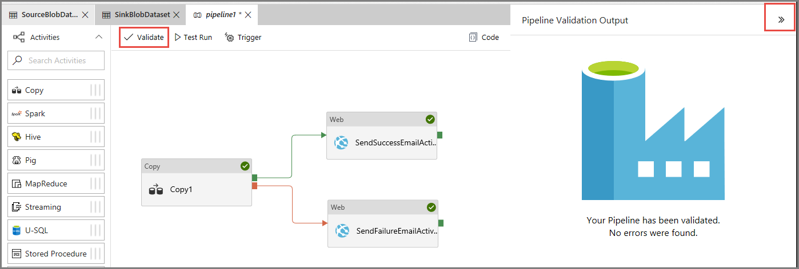
24. To publish the entities (datasets, pipelines, etc.) to Data Factory service, select **Publish All**. Wait until you see the **Successfully published** message.

    

## Trigger a pipeline run that succeeds
1. To **trigger** a pipeline run, click **Trigger** on the toolbar, and click **Trigger Now**.

    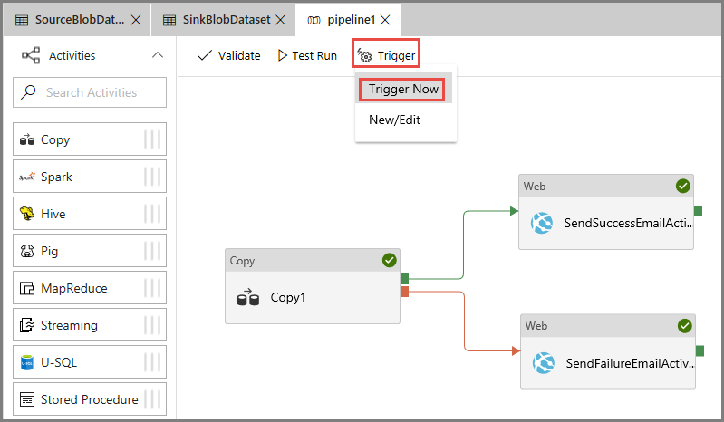
2. In the **Pipeline Run** window, do the following steps:

    1. Enter **adftutorial/adfv2branch/input** for the **sourceBlobContainer** parameter.
    2. Enter **adftutorial/adfv2branch/output** for the **sinkBlobContainer** parameter.
    3. Enter an **email address** of the **receiver**.
    4. Click **Finish**

        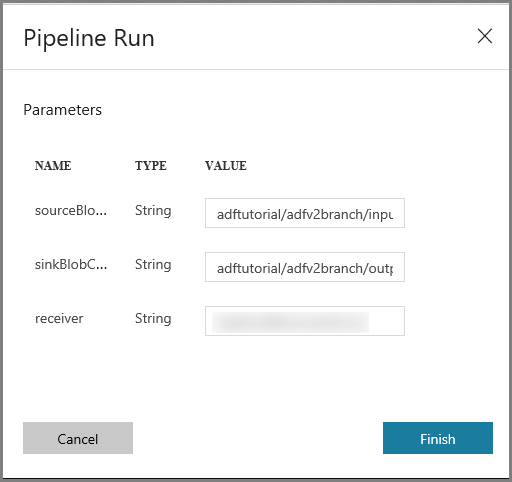

## Monitor the successful pipeline run

1. To monitor the pipeline run, switch to the **Monitor** tab on the left. You see the pipeline run that was triggered manually by you. Use the **Refresh** button to refresh the list.

    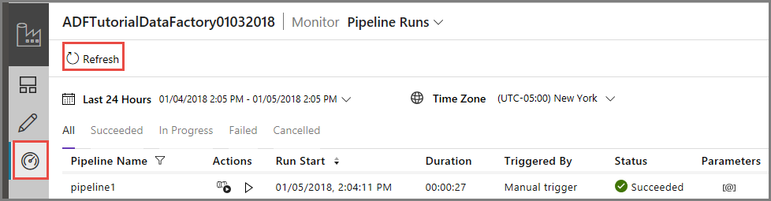
2. To **view activity runs** associated with this pipeline run, click the first link in the **Actions** column. You can switch back to the previous view by clicking **Pipelines** at the top. Use the **Refresh** button to refresh the list.

    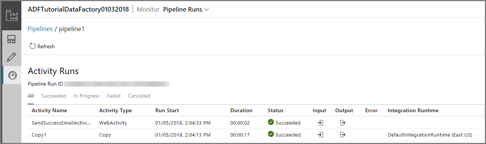

## Trigger a pipeline run that fails
1. Switch to the **Edit** tab on the left.
2. To **trigger** a pipeline run, click **Trigger** on the toolbar, and click **Trigger Now**.
3. In the **Pipeline Run** window, do the following steps:

    1. Enter **adftutorial/dummy/input** for the **sourceBlobContainer** parameter. Ensure that the dummy folder does not exist in the adftutorial container.
    2. Enter **adftutorial/dummy/output** for the **sinkBlobContainer** parameter.
    3. Enter an **email address** of the **receiver**.
    4. Click **Finish**.

## Monitor the failed pipeline run

1. To monitor the pipeline run, switch to the **Monitor** tab on the left. You see the pipeline run that was triggered manually by you. Use the **Refresh** button to refresh the list.

    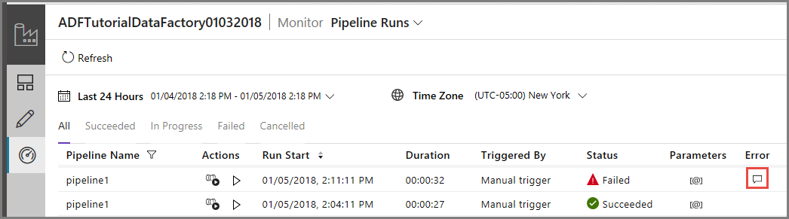
2. Click **Error** link for the pipeline run to see details about the error.

    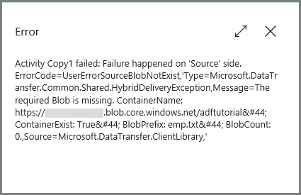
2. To **view activity runs** associated with this pipeline run, click the first link in the **Actions** column. Use the **Refresh** button to refresh the list. Notice that the Copy activity in the pipeline failed. The Web activity succeeded to send the failure email to the specified receiver.

    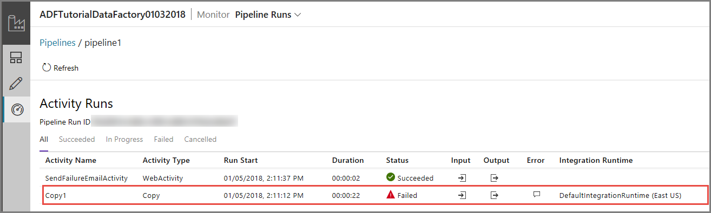
4. Click **Error** link in the **Actions** column to see details about the error.

    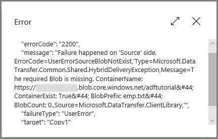

## Next steps
You performed the following steps in this tutorial:

> [!div class="checklist"]
> * Create a data factory.
> * Create an Azure Storage linked service.
> * Create an Azure Blob dataset
> * Create a pipeline that contains a copy activity and a web activity
> * Send outputs of activities to subsequent activities
> * Utilize parameter passing and system variables
> * Start a pipeline run
> * Monitor the pipeline and activity runs

You can now proceed to the Concepts section for more information about Azure Data Factory.
> [!div class="nextstepaction"]
>[Pipelines and activities](concepts-pipelines-activities.md)
