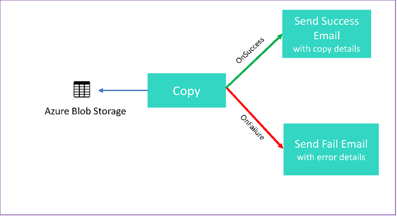
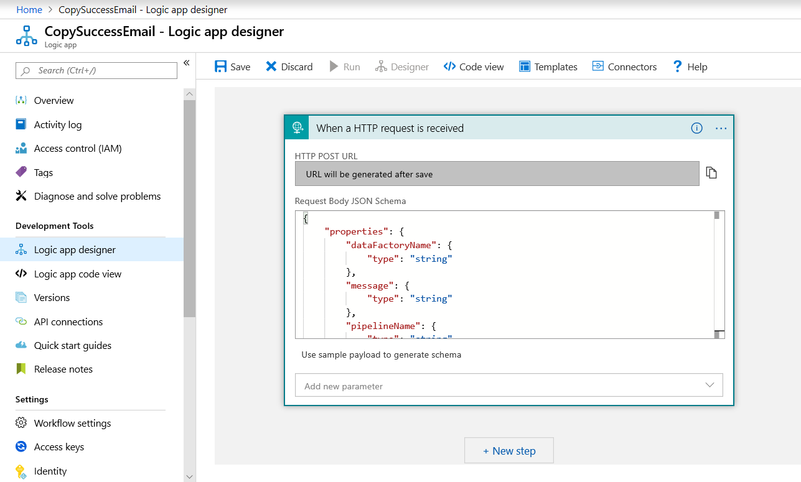
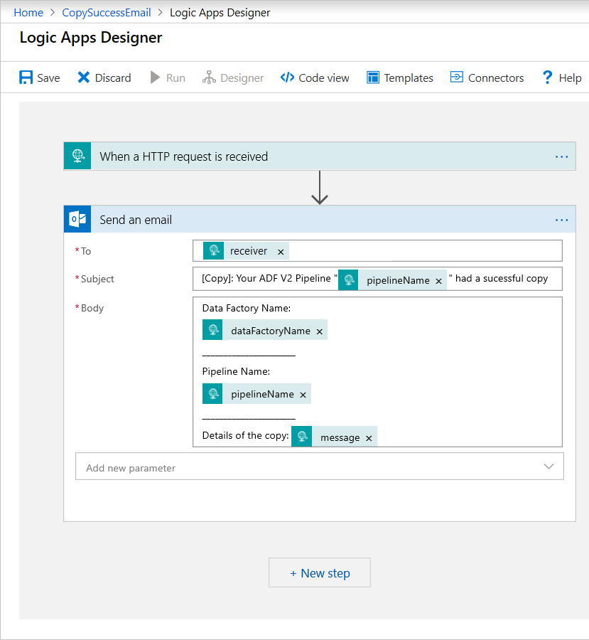
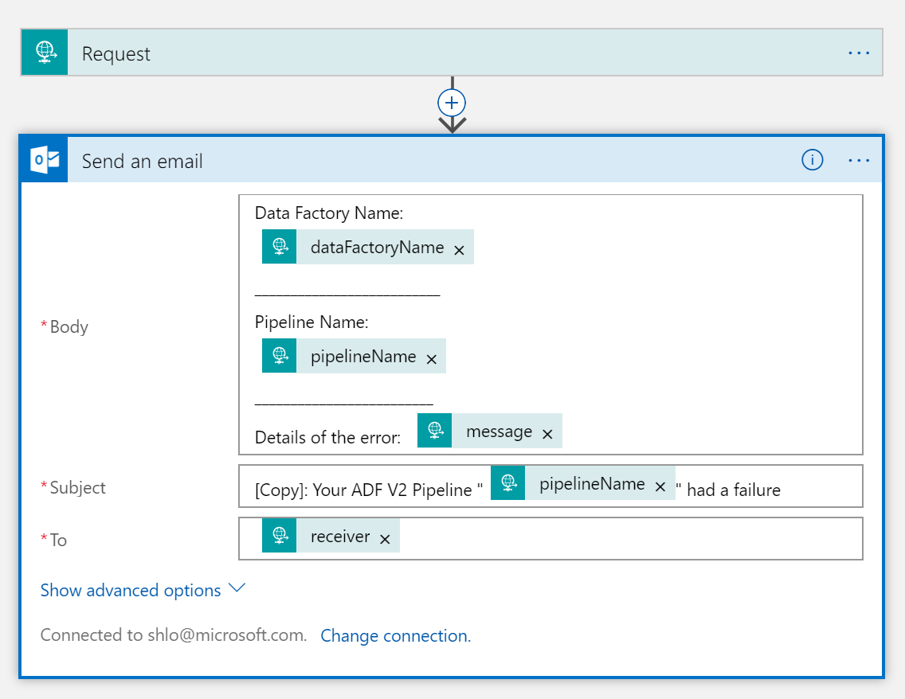

# Branching and chaining activities in a Data Factory pipeline

[!INCLUDE[appliesto-adf-xxx-md](includes/appliesto-adf-xxx-md.md)]

In this tutorial, you create a Data Factory pipeline that showcases some control flow features. This pipeline copies from a container in Azure Blob Storage to another container in the same storage account. If the copy activity succeeds, the pipeline sends details of the successful copy operation in an email. That information could include the amount of data written. If the copy activity fails, it sends details of the copy failure, such as the error message, in an email. Throughout the tutorial, you see how to pass parameters.

This graphic provides an overview of the scenario:



This tutorial shows you how to do the following tasks:

> [!div class="checklist"]
> * Create a data factory
> * Create an Azure Storage linked service
> * Create an Azure Blob dataset
> * Create a pipeline that contains a copy activity and a web activity
> * Send outputs of activities to subsequent activities
> * Use parameter passing and system variables
> * Start a pipeline run
> * Monitor the pipeline and activity runs

This tutorial uses .NET SDK. You can use other mechanisms to interact with Azure Data Factory. For Data Factory quickstarts, see [5-Minute Quickstarts](/azure/data-factory/quickstart-create-data-factory-portal).

If you don't have an Azure subscription, create a [free account](https://azure.microsoft.com/free/) before you begin.

## Prerequisites

* Azure Storage account. You use blob storage as a source data store. If you don't have an Azure storage account, see [Create a storage account](../storage/common/storage-account-create.md).
* Azure Storage Explorer. To install this tool, see [Azure Storage Explorer](https://storageexplorer.com/).
* Azure SQL Database. You use the database as a sink data store. If you don't have an Azure SQL Database, see [Create an Azure SQL database](../azure-sql/database/single-database-create-quickstart.md).
* Visual Studio. This article uses Visual Studio 2019.
* Azure .NET SDK. Download and install the [Azure .NET SDK](https://azure.microsoft.com/downloads/).

For a list of Azure regions in which Data Factory is currently available, see [Products available by region](https://azure.microsoft.com/global-infrastructure/services/). The data stores and computes can be in other regions. The stores include Azure Storage and Azure SQL Database. The computes include HDInsight, which Data Factory uses.

Create an application as described in [Create an Azure Active Directory application](../active-directory/develop/howto-create-service-principal-portal.md#create-an-azure-active-directory-application). Assign the application to the **Contributor** role by following instructions in the same article. You'll need several values for later parts of this tutorial, such as **Application (client) ID** and **Directory (tenant) ID**.

### Create a blob table

1. Open a text editor. Copy the following text and save it locally as *input.txt*.

   ```
   Ethel|Berg
   Tamika|Walsh
   ```

1. Open Azure Storage Explorer. Expand your storage account. Right-click **Blob Containers** and select **Create Blob Container**.
1. Name the new container *adfv2branch* and select **Upload** to add your *input.txt* file to the container.

## Create Visual Studio project<a name="create-visual-studio-project"></a>

Create a C# .NET console application:

1. Start Visual Studio and select **Create a new project**.
1. In **Create a new project**, choose **Console App (.NET Framework)** for C# and select **Next**.
1. Name the project *ADFv2BranchTutorial*.
1. Select **.NET version 4.5.2** or above and then select **Create**.

### Install NuGet packages

1. Select **Tools** > **NuGet Package Manager** > **Package Manager Console**.
1. In the **Package Manager Console**, run the following commands to install packages. Refer to [Microsoft.Azure.Management.DataFactory nuget package](https://www.nuget.org/packages/Microsoft.Azure.Management.DataFactory/) for details.

   ```powershell
   Install-Package Microsoft.Azure.Management.DataFactory
   Install-Package Microsoft.Azure.Management.ResourceManager -IncludePrerelease
   Install-Package Microsoft.IdentityModel.Clients.ActiveDirectory
   ```

### Create a data factory client

1. Open *Program.cs* and add the following statements:

   ```csharp
   using System;
   using System.Collections.Generic;
   using System.Linq;
   using Microsoft.Rest;
   using Microsoft.Azure.Management.ResourceManager;
   using Microsoft.Azure.Management.DataFactory;
   using Microsoft.Azure.Management.DataFactory.Models;
   using Microsoft.IdentityModel.Clients.ActiveDirectory;
   ```

1. Add these static variables to the `Program` class. Replace place-holders with your own values.

   ```csharp
   // Set variables
   static string tenantID = "<tenant ID>";
   static string applicationId = "<application ID>";
   static string authenticationKey = "<Authentication key for your application>";
   static string subscriptionId = "<Azure subscription ID>";
   static string resourceGroup = "<Azure resource group name>";

   static string region = "East US";
   static string dataFactoryName = "<Data factory name>";

   // Specify the source Azure Blob information
   static string storageAccount = "<Azure Storage account name>";
   static string storageKey = "<Azure Storage account key>";
   // confirm that you have the input.txt file placed in th input folder of the adfv2branch container.
   static string inputBlobPath = "adfv2branch/input";
   static string inputBlobName = "input.txt";
   static string outputBlobPath = "adfv2branch/output";
   static string emailReceiver = "<specify email address of the receiver>";

   static string storageLinkedServiceName = "AzureStorageLinkedService";
   static string blobSourceDatasetName = "SourceStorageDataset";
   static string blobSinkDatasetName = "SinkStorageDataset";
   static string pipelineName = "Adfv2TutorialBranchCopy";

   static string copyBlobActivity = "CopyBlobtoBlob";
   static string sendFailEmailActivity = "SendFailEmailActivity";
   static string sendSuccessEmailActivity = "SendSuccessEmailActivity";
   ```

1. Add the following code to the `Main` method. This code creates an instance of `DataFactoryManagementClient` class. You then use this object to create data factory, linked service, datasets, and pipeline. You can also use this object to monitor the pipeline run details.

   ```csharp
   // Authenticate and create a data factory management client
   var context = new AuthenticationContext("https://login.windows.net/" + tenantID);
   ClientCredential cc = new ClientCredential(applicationId, authenticationKey);
   AuthenticationResult result = context.AcquireTokenAsync("https://management.azure.com/", cc).Result;
   ServiceClientCredentials cred = new TokenCredentials(result.AccessToken);
   var client = new DataFactoryManagementClient(cred) { SubscriptionId = subscriptionId };
   ```

### Create a data factory

1. Add a `CreateOrUpdateDataFactory` method to your *Program.cs* file:

   ```csharp
   static Factory CreateOrUpdateDataFactory(DataFactoryManagementClient client)
   {
       Console.WriteLine("Creating data factory " + dataFactoryName + "...");
       Factory resource = new Factory
       {
           Location = region
       };
       Console.WriteLine(SafeJsonConvert.SerializeObject(resource, client.SerializationSettings));

       Factory response;
       {
           response = client.Factories.CreateOrUpdate(resourceGroup, dataFactoryName, resource);
       }

       while (client.Factories.Get(resourceGroup, dataFactoryName).ProvisioningState == "PendingCreation")
       {
           System.Threading.Thread.Sleep(1000);
       }
       return response;
   }
   ```

1. Add the following line to the `Main` method that creates a data factory:

   ```csharp
   Factory df = CreateOrUpdateDataFactory(client);
   ```

## Create an Azure Storage linked service

1. Add a `StorageLinkedServiceDefinition` method to your *Program.cs* file:

   ```csharp
   static LinkedServiceResource StorageLinkedServiceDefinition(DataFactoryManagementClient client)
   {
      Console.WriteLine("Creating linked service " + storageLinkedServiceName + "...");
      AzureStorageLinkedService storageLinkedService = new AzureStorageLinkedService
      {
          ConnectionString = new SecureString("DefaultEndpointsProtocol=https;AccountName=" + storageAccount + ";AccountKey=" + storageKey)
      };
      Console.WriteLine(SafeJsonConvert.SerializeObject(storageLinkedService, client.SerializationSettings));
      LinkedServiceResource linkedService = new LinkedServiceResource(storageLinkedService, name:storageLinkedServiceName);
      return linkedService;
   }
   ```

1. Add the following line to the `Main` method that creates an Azure Storage linked service:

   ```csharp
   client.LinkedServices.CreateOrUpdate(resourceGroup, dataFactoryName, storageLinkedServiceName, StorageLinkedServiceDefinition(client));
   ```

For more information about supported properties and details, see [Linked service properties](connector-azure-blob-storage.md#linked-service-properties).

## Create datasets

In this section, you create two datasets, one for the source and one for the sink.

### Create a dataset for a source Azure Blob

Add a method that creates an *Azure blob dataset*. For more information about supported properties and details, see [Azure Blob dataset properties](connector-azure-blob-storage.md#dataset-properties).

Add a `SourceBlobDatasetDefinition` method to your *Program.cs* file:

```csharp
static DatasetResource SourceBlobDatasetDefinition(DataFactoryManagementClient client)
{
    Console.WriteLine("Creating dataset " + blobSourceDatasetName + "...");
    AzureBlobDataset blobDataset = new AzureBlobDataset
    {
        FolderPath = new Expression { Value = "@pipeline().parameters.sourceBlobContainer" },
        FileName = inputBlobName,
        LinkedServiceName = new LinkedServiceReference
        {
            ReferenceName = storageLinkedServiceName
        }
    };
    Console.WriteLine(SafeJsonConvert.SerializeObject(blobDataset, client.SerializationSettings));
    DatasetResource dataset = new DatasetResource(blobDataset, name:blobSourceDatasetName);
    return dataset;
}
```

You define a dataset that represents the source data in Azure Blob. This Blob dataset refers to the Azure Storage linked service supported in the previous step. The Blob dataset describes the location of the blob to copy from: *FolderPath* and *FileName*.

Notice the use of parameters for the *FolderPath*. `sourceBlobContainer` is the name of the parameter and the expression is replaced with the values passed in the pipeline run. The syntax to define parameters is `@pipeline().parameters.<parameterName>`

### Create a dataset for a sink Azure Blob

1. Add a `SourceBlobDatasetDefinition` method to your *Program.cs* file:

   ```csharp
   static DatasetResource SinkBlobDatasetDefinition(DataFactoryManagementClient client)
   {
       Console.WriteLine("Creating dataset " + blobSinkDatasetName + "...");
       AzureBlobDataset blobDataset = new AzureBlobDataset
       {
           FolderPath = new Expression { Value = "@pipeline().parameters.sinkBlobContainer" },
           LinkedServiceName = new LinkedServiceReference
           {
               ReferenceName = storageLinkedServiceName
           }
       };
       Console.WriteLine(SafeJsonConvert.SerializeObject(blobDataset, client.SerializationSettings));
       DatasetResource dataset = new DatasetResource(blobDataset, name: blobSinkDatasetName);
       return dataset;
   }
   ```

1. Add the following code to the `Main` method that creates both Azure Blob source and sink datasets.

   ```csharp
   client.Datasets.CreateOrUpdate(resourceGroup, dataFactoryName, blobSourceDatasetName, SourceBlobDatasetDefinition(client));

   client.Datasets.CreateOrUpdate(resourceGroup, dataFactoryName, blobSinkDatasetName, SinkBlobDatasetDefinition(client));
   ```

## Create a C# class: EmailRequest

In your C# project, create a class named `EmailRequest`. This class defines what properties the pipeline sends in the body request when sending an email. In this tutorial, the pipeline sends four properties from the pipeline to the email:

* Message. Body of the email. For a successful copy, this property contains the amount of data written. For a failed copy, this property contains details of the error.
* Data factory name. Name of the data factory.
* Pipeline name. Name of the pipeline.
* Receiver. Parameter that passes through. This property specifies the receiver of the email.

```csharp
    class EmailRequest
    {
        [Newtonsoft.Json.JsonProperty(PropertyName = "message")]
        public string message;

        [Newtonsoft.Json.JsonProperty(PropertyName = "dataFactoryName")]
        public string dataFactoryName;

        [Newtonsoft.Json.JsonProperty(PropertyName = "pipelineName")]
        public string pipelineName;

        [Newtonsoft.Json.JsonProperty(PropertyName = "receiver")]
        public string receiver;

        public EmailRequest(string input, string df, string pipeline, string receiverName)
        {
            message = input;
            dataFactoryName = df;
            pipelineName = pipeline;
            receiver = receiverName;
        }
    }
```

## Create email workflow endpoints

To trigger sending an email, you use [Logic Apps](../logic-apps/logic-apps-overview.md) to define the workflow. For details on creating a Logic Apps workflow, see [How to create a Logic App](../logic-apps/quickstart-create-first-logic-app-workflow.md).

### Success email workflow

In the [Azure portal](https://portal.azure.com), create a Logic Apps workflow named *CopySuccessEmail*. Define the workflow trigger as `When an HTTP request is received`. For your request trigger, fill in the `Request Body JSON Schema` with the following JSON:

```json
{
    "properties": {
        "dataFactoryName": {
            "type": "string"
        },
        "message": {
            "type": "string"
        },
        "pipelineName": {
            "type": "string"
        },
        "receiver": {
            "type": "string"
        }
    },
    "type": "object"
}
```

Your workflow looks something like the following example:



This JSON content aligns with the `EmailRequest` class you created in the previous section.

Add an action of `Office 365 Outlook – Send an email`. For the **Send an email** action, customize how you wish to format the email, using the properties passed in the request **Body** JSON schema. Here's an example:



After you save the workflow, copy and save the **HTTP POST URL** value from the trigger.

## Fail email workflow

Clone **CopySuccessEmail** as another Logic Apps workflow named *CopyFailEmail*. In the request trigger, the `Request Body JSON schema` is the same. Change the format of your email like the `Subject` to tailor toward a failure email. Here is an example:



After you save the workflow, copy and save the **HTTP POST URL** value from the trigger.

You should now have two workflow URLs, like the following examples:

```csharp
//Success Request Url
https://prodxxx.eastus.logic.azure.com:443/workflows/000000/triggers/manual/paths/invoke?api-version=2016-10-01&sp=%2Ftriggers%2Fmanual%2Frun&sv=1.0&sig=000000

//Fail Request Url
https://prodxxx.eastus.logic.azure.com:443/workflows/000000/triggers/manual/paths/invoke?api-version=2016-10-01&sp=%2Ftriggers%2Fmanual%2Frun&sv=1.0&sig=000000
```

## Create a pipeline

Go back to your project in Visual Studio. We'll now add the code that creates a pipeline with a copy activity and `DependsOn` property. In this tutorial, the pipeline contains one activity, a copy activity, which takes in the Blob dataset as a source and another Blob dataset as a sink. If the copy activity succeeds or fails, it calls different email tasks.

In this pipeline, you use the following features:

* Parameters
* Web activity
* Activity dependency
* Using output from an activity as an input to another activity

1. Add this method to your project. The following sections provide in more detail.

    ```csharp
    static PipelineResource PipelineDefinition(DataFactoryManagementClient client)
            {
                Console.WriteLine("Creating pipeline " + pipelineName + "...");
                PipelineResource resource = new PipelineResource
                {
                    Parameters = new Dictionary<string, ParameterSpecification>
                    {
                        { "sourceBlobContainer", new ParameterSpecification { Type = ParameterType.String } },
                        { "sinkBlobContainer", new ParameterSpecification { Type = ParameterType.String } },
                        { "receiver", new ParameterSpecification { Type = ParameterType.String } }

                    },
                    Activities = new List<Activity>
                    {
                        new CopyActivity
                        {
                            Name = copyBlobActivity,
                            Inputs = new List<DatasetReference>
                            {
                                new DatasetReference
                                {
                                    ReferenceName = blobSourceDatasetName
                                }
                            },
                            Outputs = new List<DatasetReference>
                            {
                                new DatasetReference
                                {
                                    ReferenceName = blobSinkDatasetName
                                }
                            },
                            Source = new BlobSource { },
                            Sink = new BlobSink { }
                        },
                        new WebActivity
                        {
                            Name = sendSuccessEmailActivity,
                            Method = WebActivityMethod.POST,
                            Url = "https://prodxxx.eastus.logic.azure.com:443/workflows/00000000000000000000000000000000000/triggers/manual/paths/invoke?api-version=2016-10-01&sp=%2Ftriggers%2Fmanual%2Frun&sv=1.0&sig=0000000000000000000000000000000000000000000000",
                            Body = new EmailRequest("@{activity('CopyBlobtoBlob').output.dataWritten}", "@{pipeline().DataFactory}", "@{pipeline().Pipeline}", "@pipeline().parameters.receiver"),
                            DependsOn = new List<ActivityDependency>
                            {
                                new ActivityDependency
                                {
                                    Activity = copyBlobActivity,
                                    DependencyConditions = new List<String> { "Succeeded" }
                                }
                            }
                        },
                        new WebActivity
                        {
                            Name = sendFailEmailActivity,
                            Method =WebActivityMethod.POST,
                            Url = "https://prodxxx.eastus.logic.azure.com:443/workflows/000000000000000000000000000000000/triggers/manual/paths/invoke?api-version=2016-10-01&sp=%2Ftriggers%2Fmanual%2Frun&sv=1.0&sig=0000000000000000000000000000000000000000000",
                            Body = new EmailRequest("@{activity('CopyBlobtoBlob').error.message}", "@{pipeline().DataFactory}", "@{pipeline().Pipeline}", "@pipeline().parameters.receiver"),
                            DependsOn = new List<ActivityDependency>
                            {
                                new ActivityDependency
                                {
                                    Activity = copyBlobActivity,
                                    DependencyConditions = new List<String> { "Failed" }
                                }
                            }
                        }
                    }
                };
                Console.WriteLine(SafeJsonConvert.SerializeObject(resource, client.SerializationSettings));
                return resource;
            }
    ```

1. Add the following line to the `Main` method that creates the pipeline:

   ```csharp
   client.Pipelines.CreateOrUpdate(resourceGroup, dataFactoryName, pipelineName, PipelineDefinition(client));
   ```

### Parameters

The first section of our pipeline code defines parameters.

* `sourceBlobContainer`. The source blob dataset consumes this parameter in the pipeline.
* `sinkBlobContainer`. The sink blob dataset consumes this parameter in the pipeline.
* `receiver`. The two Web activities in the pipeline that send success or failure emails to the receiver use this parameter.

```csharp
Parameters = new Dictionary<string, ParameterSpecification>
    {
        { "sourceBlobContainer", new ParameterSpecification { Type = ParameterType.String } },
        { "sinkBlobContainer", new ParameterSpecification { Type = ParameterType.String } },
        { "receiver", new ParameterSpecification { Type = ParameterType.String } }
    },
```

### Web activity

The Web activity allows a call to any REST endpoint. For more information about the activity, see [Web activity in Azure Data Factory](control-flow-web-activity.md). This pipeline uses a web activity to call the Logic Apps email workflow. You create two web activities: one that calls to the `CopySuccessEmail` workflow and one that calls the `CopyFailWorkFlow`.

```csharp
        new WebActivity
        {
            Name = sendCopyEmailActivity,
            Method = WebActivityMethod.POST,
            Url = "https://prodxxx.eastus.logic.azure.com:443/workflows/12345",
            Body = new EmailRequest("@{activity('CopyBlobtoBlob').output.dataWritten}", "@{pipeline().DataFactory}", "@{pipeline().Pipeline}", "@pipeline().parameters.receiver"),
            DependsOn = new List<ActivityDependency>
            {
                new ActivityDependency
                {
                    Activity = copyBlobActivity,
                    DependencyConditions = new List<String> { "Succeeded" }
                }
            }
        }
```

In the `Url` property, paste the **HTTP POST URL** endpoints from your Logic Apps workflows. In the `Body` property, pass an instance of the `EmailRequest` class. The email request contains the following properties:

* Message. Passes value of `@{activity('CopyBlobtoBlob').output.dataWritten`. Accesses a property of the previous copy activity and passes the value of `dataWritten`. For the failure case, pass the error output instead of `@{activity('CopyBlobtoBlob').error.message`.
* Data Factory Name. Passes value of `@{pipeline().DataFactory}` This system variable allows you to access the corresponding data factory name. For a list of system variables, see [System Variables](control-flow-system-variables.md).
* Pipeline Name. Passes value of `@{pipeline().Pipeline}`. This system variable allows you to access the corresponding pipeline name.
* Receiver. Passes value of `"@pipeline().parameters.receiver"`. Accesses the pipeline parameters.

This code creates a new Activity Dependency that depends on the previous copy activity.

## Create a pipeline run

Add the following code to the `Main` method that triggers a pipeline run.

```csharp
// Create a pipeline run
Console.WriteLine("Creating pipeline run...");
Dictionary<string, object> arguments = new Dictionary<string, object>
{
    { "sourceBlobContainer", inputBlobPath },
    { "sinkBlobContainer", outputBlobPath },
    { "receiver", emailReceiver }
};

CreateRunResponse runResponse = client.Pipelines.CreateRunWithHttpMessagesAsync(resourceGroup, dataFactoryName, pipelineName, arguments).Result.Body;
Console.WriteLine("Pipeline run ID: " + runResponse.RunId);
```

## Main class

Your final `Main` method should look like this.

```csharp
// Authenticate and create a data factory management client
var context = new AuthenticationContext("https://login.windows.net/" + tenantID);
ClientCredential cc = new ClientCredential(applicationId, authenticationKey);
AuthenticationResult result = context.AcquireTokenAsync("https://management.azure.com/", cc).Result;
ServiceClientCredentials cred = new TokenCredentials(result.AccessToken);
var client = new DataFactoryManagementClient(cred) { SubscriptionId = subscriptionId };

Factory df = CreateOrUpdateDataFactory(client);

client.LinkedServices.CreateOrUpdate(resourceGroup, dataFactoryName, storageLinkedServiceName, StorageLinkedServiceDefinition(client));
client.Datasets.CreateOrUpdate(resourceGroup, dataFactoryName, blobSourceDatasetName, SourceBlobDatasetDefinition(client));
client.Datasets.CreateOrUpdate(resourceGroup, dataFactoryName, blobSinkDatasetName, SinkBlobDatasetDefinition(client));

client.Pipelines.CreateOrUpdate(resourceGroup, dataFactoryName, pipelineName, PipelineDefinition(client));

Console.WriteLine("Creating pipeline run...");
Dictionary<string, object> arguments = new Dictionary<string, object>
{
    { "sourceBlobContainer", inputBlobPath },
    { "sinkBlobContainer", outputBlobPath },
    { "receiver", emailReceiver }
};

CreateRunResponse runResponse = client.Pipelines.CreateRunWithHttpMessagesAsync(resourceGroup, dataFactoryName, pipelineName, arguments).Result.Body;
Console.WriteLine("Pipeline run ID: " + runResponse.RunId);
```

Build and run your program to trigger a pipeline run!

## Monitor a pipeline run

1. Add the following code to the `Main` method:

    ```csharp
    // Monitor the pipeline run
    Console.WriteLine("Checking pipeline run status...");
    PipelineRun pipelineRun;
    while (true)
    {
        pipelineRun = client.PipelineRuns.Get(resourceGroup, dataFactoryName, runResponse.RunId);
        Console.WriteLine("Status: " + pipelineRun.Status);
        if (pipelineRun.Status == "InProgress")
            System.Threading.Thread.Sleep(15000);
        else
            break;
    }
    ```

    This code continuously checks the status of the run until it finishes copying the data.

1. Add the following code to the `Main` method that retrieves copy activity run details, for example, size of the data read/written:

    ```csharp
    // Check the copy activity run details
    Console.WriteLine("Checking copy activity run details...");

    List<ActivityRun> activityRuns = client.ActivityRuns.ListByPipelineRun(
    resourceGroup, dataFactoryName, runResponse.RunId, DateTime.UtcNow.AddMinutes(-10), DateTime.UtcNow.AddMinutes(10)).ToList();

    if (pipelineRun.Status == "Succeeded")
    {
        Console.WriteLine(activityRuns.First().Output);
        //SaveToJson(SafeJsonConvert.SerializeObject(activityRuns.First().Output, client.SerializationSettings), "ActivityRunResult.json", folderForJsons);
    }
    else
        Console.WriteLine(activityRuns.First().Error);

    Console.WriteLine("\nPress any key to exit...");
    Console.ReadKey();
    ```

## Run the code

Build and start the application, then verify the pipeline execution.

The application displays the progress of creating data factory, linked service, datasets, pipeline, and pipeline run. It then checks the pipeline run status. Wait until you see the copy activity run details with data read/written size. Then, use tools such as Azure Storage Explorer to check the blob was copied to *outputBlobPath* from *inputBlobPath* as you specified in variables.

Your output should resemble the following sample:

```json
Creating data factory DFTutorialTest...
{
  "location": "East US"
}
Creating linked service AzureStorageLinkedService...
{
  "type": "AzureStorage",
  "typeProperties": {
    "connectionString": "DefaultEndpointsProtocol=https;AccountName=***;AccountKey=***"
  }
}
Creating dataset SourceStorageDataset...
{
  "type": "AzureBlob",
  "typeProperties": {
    "folderPath": {
      "type": "Expression",
      "value": "@pipeline().parameters.sourceBlobContainer"
    },
    "fileName": "input.txt"
  },
  "linkedServiceName": {
    "type": "LinkedServiceReference",
    "referenceName": "AzureStorageLinkedService"
  }
}
Creating dataset SinkStorageDataset...
{
  "type": "AzureBlob",
  "typeProperties": {
    "folderPath": {
      "type": "Expression",
      "value": "@pipeline().parameters.sinkBlobContainer"
    }
  },
  "linkedServiceName": {
    "type": "LinkedServiceReference",
    "referenceName": "AzureStorageLinkedService"
  }
}
Creating pipeline Adfv2TutorialBranchCopy...
{
  "properties": {
    "activities": [
      {
        "type": "Copy",
        "typeProperties": {
          "source": {
            "type": "BlobSource"
          },
          "sink": {
            "type": "BlobSink"
          }
        },
        "inputs": [
          {
            "type": "DatasetReference",
            "referenceName": "SourceStorageDataset"
          }
        ],
        "outputs": [
          {
            "type": "DatasetReference",
            "referenceName": "SinkStorageDataset"
          }
        ],
        "name": "CopyBlobtoBlob"
      },
      {
        "type": "WebActivity",
        "typeProperties": {
          "method": "POST",
          "url": "https://xxxx.eastus.logic.azure.com:443/workflows/... ",
          "body": {
            "message": "@{activity('CopyBlobtoBlob').output.dataWritten}",
            "dataFactoryName": "@{pipeline().DataFactory}",
            "pipelineName": "@{pipeline().Pipeline}",
            "receiver": "@pipeline().parameters.receiver"
          }
        },
        "name": "SendSuccessEmailActivity",
        "dependsOn": [
          {
            "activity": "CopyBlobtoBlob",
            "dependencyConditions": [
              "Succeeded"
            ]
          }
        ]
      },
      {
        "type": "WebActivity",
        "typeProperties": {
          "method": "POST",
          "url": "https://xxx.eastus.logic.azure.com:443/workflows/... ",
          "body": {
            "message": "@{activity('CopyBlobtoBlob').error.message}",
            "dataFactoryName": "@{pipeline().DataFactory}",
            "pipelineName": "@{pipeline().Pipeline}",
            "receiver": "@pipeline().parameters.receiver"
          }
        },
        "name": "SendFailEmailActivity",
        "dependsOn": [
          {
            "activity": "CopyBlobtoBlob",
            "dependencyConditions": [
              "Failed"
            ]
          }
        ]
      }
    ],
    "parameters": {
      "sourceBlobContainer": {
        "type": "String"
      },
      "sinkBlobContainer": {
        "type": "String"
      },
      "receiver": {
        "type": "String"
      }
    }
  }
}
Creating pipeline run...
Pipeline run ID: 00000000-0000-0000-0000-0000000000000
Checking pipeline run status...
Status: InProgress
Status: InProgress
Status: Succeeded
Checking copy activity run details...
{
  "dataRead": 20,
  "dataWritten": 20,
  "copyDuration": 4,
  "throughput": 0.01,
  "errors": [],
  "effectiveIntegrationRuntime": "DefaultIntegrationRuntime (East US)"
}
{}

Press any key to exit...
```

## Next steps

You did the following tasks in this tutorial:

> [!div class="checklist"]
> * Create a data factory
> * Create an Azure Storage linked service
> * Create an Azure Blob dataset
> * Create a pipeline that contains a copy activity and a web activity
> * Send outputs of activities to subsequent activities
> * Use parameter passing and system variables
> * Start a pipeline run
> * Monitor the pipeline and activity runs

You can now continue to the Concepts section for more information about Azure Data Factory.
> [!div class="nextstepaction"]
>[Pipelines and activities](concepts-pipelines-activities.md)
