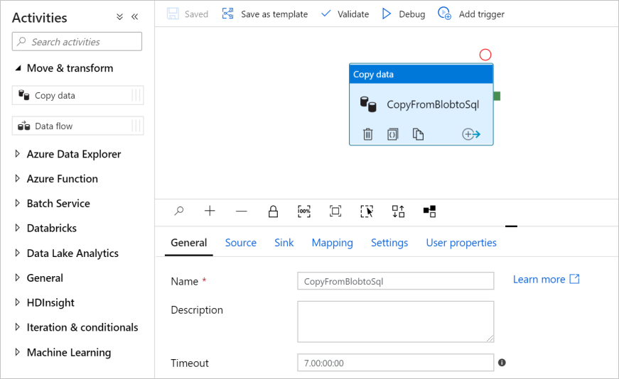
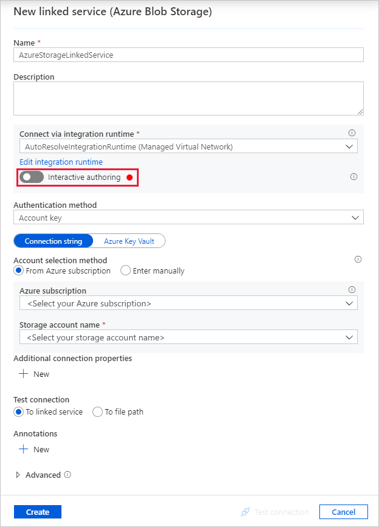
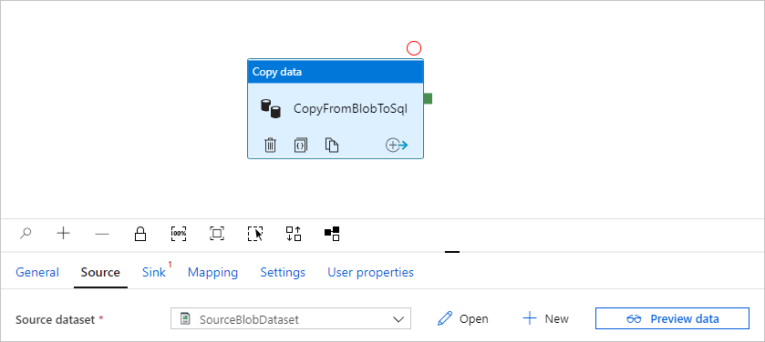
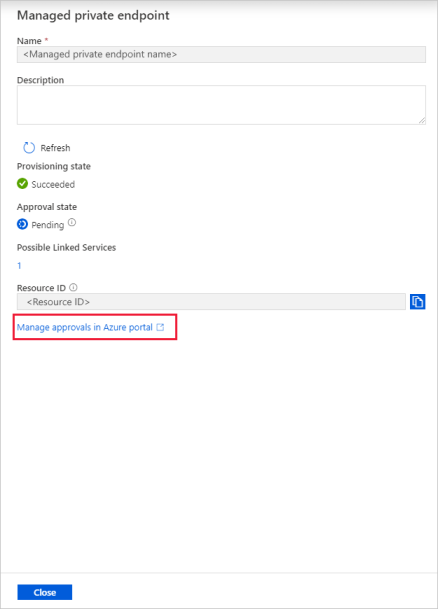
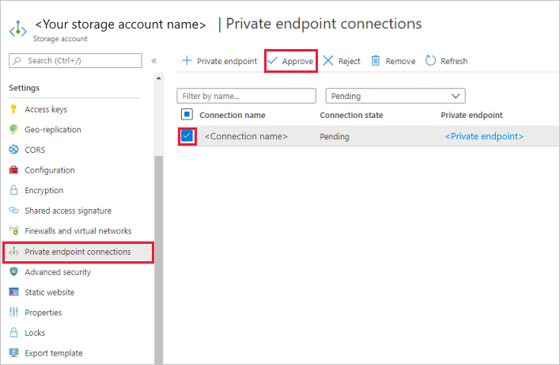
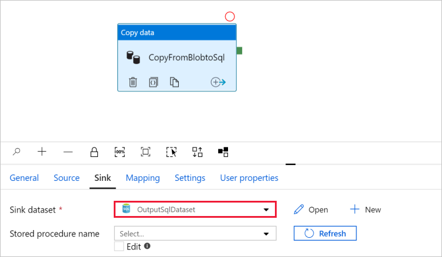

# Copy data securely from Azure Blob storage to a SQL database by using private endpoints

[!INCLUDE[appliesto-adf-asa-md](includes/appliesto-adf-asa-md.md)]

In this tutorial, you create a data factory by using the Azure Data Factory user interface (UI). *The pipeline in this data factory copies data securely from Azure Blob storage to an Azure SQL database (both allowing access to only selected networks) by using private endpoints in [Azure Data Factory Managed Virtual Network](managed-virtual-network-private-endpoint.md).* The configuration pattern in this tutorial applies to copying from a file-based data store to a relational data store. For a list of data stores supported as sources and sinks, see the [Supported data stores and formats](./copy-activity-overview.md) table.

> [!NOTE]
> If you're new to Data Factory, see [Introduction to Azure Data Factory](./introduction.md).

In this tutorial, you do the following steps:

* Create a data factory.
* Create a pipeline with a copy activity.


## Prerequisites
* **Azure subscription**. If you don't have an Azure subscription, create a [free Azure account](https://azure.microsoft.com/free/) before you begin.
* **Azure storage account**. You use Blob storage as a *source* data store. If you don't have a storage account, see [Create an Azure storage account](../storage/common/storage-account-create.md?tabs=azure-portal) for steps to create one. *Ensure the storage account allows access only from selected networks.* 
* **Azure SQL Database**. You use the database as a *sink* data store. If you don't have an Azure SQL database, see [Create a SQL database](../azure-sql/database/single-database-create-quickstart.md) for steps to create one. *Ensure the SQL Database account allows access only from selected networks.* 

### Create a blob and a SQL table

Now, prepare your blob storage and SQL database for the tutorial by performing the following steps.

#### Create a source blob

1. Open Notepad. Copy the following text, and save it as an **emp.txt** file on your disk:

    ```
    FirstName,LastName
    John,Doe
    Jane,Doe
    ```

1. Create a container named **adftutorial** in your blob storage. Create a folder named **input** in this container. Then, upload the **emp.txt** file to the **input** folder. Use the Azure portal or tools such as [Azure Storage Explorer](https://storageexplorer.com/) to do these tasks.

#### Create a sink SQL table

Use the following SQL script to create the **dbo.emp** table in your SQL database:

```sql
CREATE TABLE dbo.emp
(
    ID int IDENTITY(1,1) NOT NULL,
    FirstName varchar(50),
    LastName varchar(50)
)
GO

CREATE CLUSTERED INDEX IX_emp_ID ON dbo.emp (ID);
```

## Create a data factory
In this step, you create a data factory and start the Data Factory UI to create a pipeline in the data factory.

1. Open Microsoft Edge or Google Chrome. Currently, only Microsoft Edge and Google Chrome web browsers support the Data Factory UI.

1. On the left menu, select **Create a resource** > **Analytics** > **Data Factory**.

1. On the **New data factory** page, under **Name**, enter **ADFTutorialDataFactory**.

   The name of the Azure data factory must be *globally unique*. If you receive an error message about the name value, enter a different name for the data factory (for example, yournameADFTutorialDataFactory). For naming rules for Data Factory artifacts, see [Data Factory naming rules](./naming-rules.md).

1. Select the Azure **subscription** in which you want to create the data factory.

1. For **Resource Group**, take one of the following steps:

    - Select **Use existing**, and select an existing resource group from the drop-down list.
    - Select **Create new**, and enter the name of a resource group. 
     
    To learn about resource groups, see [Use resource groups to manage your Azure resources](../azure-resource-manager/management/overview.md). 

1. Under **Version**, select **V2**.

1. Under **Location**, select a location for the data factory. Only locations that are supported appear in the drop-down list. The data stores (for example, Azure Storage and SQL Database) and computes (for example, Azure HDInsight) used by the data factory can be in other regions.

1. Select **Create**.

1. After the creation is finished, you see the notice in the Notifications center. Select **Go to resource** to go to the **Data Factory** page.

1. Select **Author & Monitor** to launch the Data Factory UI in a separate tab.

## Create an Azure integration runtime in Data Factory Managed Virtual Network
In this step, you create an Azure integration runtime and enable Data Factory Managed Virtual Network.

1. In the Data Factory portal, go to **Manage** and select **New** to create a new Azure integration runtime.

   
1. On the **Integration runtime setup** page, choose what integration runtime to create based on required capabilities. In this tutorial, select **Azure, Self-Hosted** and then click **Continue**. 
1. Select **Azure** and then click **Continue** to create an Azure Integration runtime.

   
1. Under **Virtual network configuration (Preview)**, select **Enable**.

   
1. Select **Create**.

## Create a pipeline
In this step, you create a pipeline with a copy activity in the data factory. The copy activity copies data from Blob storage to SQL Database. In the [Quickstart tutorial](./quickstart-create-data-factory-portal.md), you created a pipeline by following these steps:

1. Create the linked service.
1. Create input and output datasets.
1. Create a pipeline.

In this tutorial, you start by creating a pipeline. Then you create linked services and datasets when you need them to configure the pipeline.

1. On the **Let's get started** page, select **Create pipeline**.

   
1. In the properties pane for the pipeline, enter **CopyPipeline** for the pipeline name.

1. In the **Activities** tool box, expand the **Move and Transform** category, and drag the **Copy data** activity from the tool box to the pipeline designer surface. Enter **CopyFromBlobToSql** for the name.

    

### Configure a source

>[!TIP]
>In this tutorial, you use **Account key** as the authentication type for your source data store. You can also choose other supported authentication methods, such as **SAS URI**,**Service Principal**, and **Managed Identity** if needed. For more information, see the corresponding sections in [Copy and transform data in Azure Blob storage by using Azure Data Factory](./connector-azure-blob-storage.md#linked-service-properties).
>
>To store secrets for data stores securely, we also recommend that you use Azure Key Vault. For more information and illustrations, see [Store credentials in Azure Key Vault](./store-credentials-in-key-vault.md).

#### Create a source dataset and linked service

1. Go to the **Source** tab. Select **+ New** to create a source dataset.

1. In the **New Dataset** dialog box, select **Azure Blob Storage**, and then select **Continue**. The source data is in Blob storage, so you select **Azure Blob Storage** for the source dataset.

1. In the **Select Format** dialog box, select the format type of your data, and then select **Continue**.

1. In the **Set Properties** dialog box, enter **SourceBlobDataset** for **Name**. Select the check box for **First row as header**. Under the **Linked service** text box, select **+ New**.

1. In the **New linked service (Azure Blob Storage)** dialog box, enter **AzureStorageLinkedService** as **Name**, and select your storage account from the **Storage account name** list. 

1. Make sure you enable **Interactive authoring**. It might take around one minute to be enabled.

    

1. Select **Test connection**. It should fail when the storage account allows access only from **Selected networks** and requires Data Factory to create a private endpoint to it that should be approved prior to using it. In the error message, you should see a link to create a private endpoint that you can follow to create a managed private endpoint. An alternative is to go directly to the **Manage** tab and follow instructions in the [next section](#create-a-managed-private-endpoint) to create a managed private endpoint.

   > [!NOTE]
   > The **Manage** tab might not be available for all data factory instances. If you don't see it, you can access private endpoints by selecting **Author** > **Connections** > **Private Endpoint**.
1. Keep the dialog box open, and then go to your storage account.

1. Follow instructions in [this section](#approval-of-a-private-link-in-a-storage-account) to approve the private link.

1. Go back to the dialog box. Select **Test connection** again, and select **Create** to deploy the linked service.

1. After the linked service is created, it goes back to the **Set properties** page. Next to **File path**, select **Browse**.

1. Go to the **adftutorial/input** folder, select the **emp.txt** file, and then select **OK**.

1. Select **OK**. It automatically goes to the pipeline page. On the **Source** tab, confirm that **SourceBlobDataset** is selected. To preview data on this page, select **Preview data**.

    

#### Create a managed private endpoint

If you didn't select the hyperlink when you tested the connection, follow the path. Now you need to create a managed private endpoint that you'll connect to the linked service you created.

1. Go to the **Manage** tab.

   > [!NOTE]
   > The **Manage** tab might not be available for all Data Factory instances. If you don't see it, you can access private endpoints by selecting **Author** > **Connections** > **Private Endpoint**.

1. Go to the **Managed private endpoints** section.

1. Select **+ New** under **Managed private endpoints**.

     

1. Select the **Azure Blob Storage** tile from the list, and select **Continue**.

1. Enter the name of the storage account you created.

1. Select **Create**.

1. After a few seconds, you should see that the private link created needs an approval.

1. Select the private endpoint that you created. You can see a hyperlink that will lead you to approve the private endpoint at the storage account level.

     

#### Approval of a private link in a storage account
1. In the storage account, go to **Private endpoint connections** under the **Settings** section.

1. Select the check box for the private endpoint you created, and select **Approve**.

    

1. Add a description, and select **yes**.
1. Go back to the **Managed private endpoints** section of the **Manage** tab in Data Factory.
1. After about one or two minutes, you should see the approval of your private endpoint appear in the Data Factory UI.


### Configure a sink
>[!TIP]
>In this tutorial, you use **SQL authentication** as the authentication type for your sink data store. You can also choose other supported authentication methods, such as **Service Principal** and **Managed Identity** if needed. For more information, see corresponding sections in [Copy and transform data in Azure SQL Database by using Azure Data Factory](./connector-azure-sql-database.md#linked-service-properties).
>
>To store secrets for data stores securely, we also recommend that you use Azure Key Vault. For more information and illustrations, see [Store credentials in Azure Key Vault](./store-credentials-in-key-vault.md).

#### Create a sink dataset and linked service
1. Go to the **Sink** tab, and select **+ New** to create a sink dataset.

1. In the **New Dataset** dialog box, enter **SQL** in the search box to filter the connectors. Select **Azure SQL Database**, and then select **Continue**. In this tutorial, you copy data to a SQL database.

1. In the **Set Properties** dialog box, enter **OutputSqlDataset** for **Name**. From the **Linked service** drop-down list, select **+ New**. A dataset must be associated with a linked service. The linked service has the connection string that Data Factory uses to connect to the SQL database at runtime. The dataset specifies the container, folder, and the file (optional) to which the data is copied.

1. In the **New linked service (Azure SQL Database)** dialog box, take the following steps:

    1. Under **Name**, enter **AzureSqlDatabaseLinkedService**.
    1. Under **Server name**, select your SQL Server instance.
    1. Make sure you enable **Interactive authoring**.
    1. Under **Database name**, select your SQL database.
    1. Under **User name**, enter the name of the user.
    1. Under **Password**, enter the password for the user.
    1. Select **Test connection**. It should fail because the SQL server allows access only from **Selected networks** and requires Data Factory to create a private endpoint to it, which should be approved prior to using it. In the error message, you should see a link to create a private endpoint that you can follow to create a managed private endpoint. An alternative is to go directly to the **Manage** tab and follow instructions in the next section to create a managed private endpoint.
    1. Keep the dialog box open, and then go to your selected SQL server.
    1. Follow instructions in [this section](#approval-of-a-private-link-in-sql-server) to approve the private link.
    1. Go back to the dialog box. Select **Test connection** again, and select **Create** to deploy the linked service.

1. It automatically goes to the **Set Properties** dialog box. In **Table**, select **[dbo].[emp]**. Then select **OK**.

1. Go to the tab with the pipeline, and in **Sink dataset**, confirm that **OutputSqlDataset** is selected.

    

You can optionally map the schema of the source to the corresponding schema of the destination by following [Schema mapping in copy activity](./copy-activity-schema-and-type-mapping.md).

#### Create a managed private endpoint

If you didn't select the hyperlink when you tested the connection, follow the path. Now you need to create a managed private endpoint that you'll connect to the linked service you created.

1. Go to the **Manage** tab.
1. Go to the **Managed private endpoints** section.
1. Select **+ New** under **Managed private endpoints**.

     

1. Select the **Azure SQL Database** tile from the list, and select **Continue**.
1. Enter the name of the SQL server you selected.
1. Select **Create**.
1. After a few seconds, you should see that the private link created needs an approval.
1. Select the private endpoint that you created. You can see a hyperlink that will lead you to approve the private endpoint at the SQL server level.


#### Approval of a private link in SQL Server
1. In the SQL server, go to **Private endpoint connections** under the **Settings** section.
1. Select the check box for the private endpoint you created, and select **Approve**.
1. Add a description, and select **yes**.
1. Go back to the **Managed private endpoints** section of the **Manage** tab in Data Factory.
1. It should take one or two minutes for the approval to appear for your private endpoint.

#### Debug and publish the pipeline

You can debug a pipeline before you publish artifacts (linked services, datasets, and pipeline) to Data Factory or your own Azure Repos Git repository.

1. To debug the pipeline, select **Debug** on the toolbar. You see the status of the pipeline run in the **Output** tab at the bottom of the window.
1. After the pipeline can run successfully, in the top toolbar, select **Publish all**. This action publishes entities (datasets and pipelines) you created to Data Factory.
1. Wait until you see the **Successfully published** message. To see notification messages, select **Show Notifications** in the upper-right corner (bell button).


#### Summary
The pipeline in this sample copies data from Blob storage to SQL Database by using private endpoints in Data Factory Managed Virtual Network. You learned how to:

* Create a data factory.
* Create a pipeline with a copy activity.