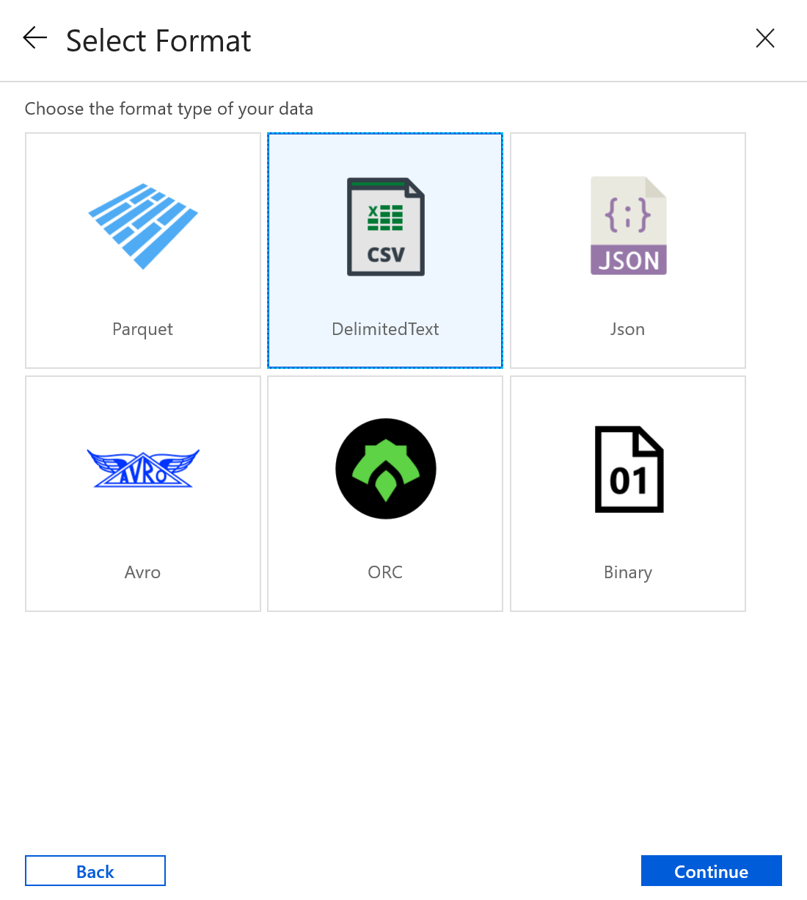

# Copy data from Azure Blob storage to a SQL database by using Azure Data Factory
In this tutorial, you create a data factory by using the Azure Data Factory user interface (UI). The pipeline in this data factory copies data from Azure Blob storage to a SQL database. The configuration pattern in this tutorial applies to copying from a file-based data store to a relational data store. For a list of data stores supported as sources and sinks, see the [supported data stores](copy-activity-overview.md#supported-data-stores-and-formats) table.

> [!NOTE]
> - If you're new to Data Factory, see [Introduction to Azure Data Factory](introduction.md).

In this tutorial, you perform the following steps:

> [!div class="checklist"]
> * Create a data factory.
> * Create a pipeline with a copy activity.
> * Test run the pipeline.
> * Trigger the pipeline manually.
> * Trigger the pipeline on a schedule.
> * Monitor the pipeline and activity runs.

## Prerequisites
* **Azure subscription**. If you don't have an Azure subscription, create a [free Azure account](https://azure.microsoft.com/free/) before you begin.
* **Azure storage account**. You use Blob storage as a *source* data store. If you don't have a storage account, see [Create an Azure storage account](../storage/common/storage-account-create.md) for steps to create one.
* **Azure SQL Database**. You use the database as a *sink* data store. If you don't have a SQL database, see [Create a SQL database](../sql-database/sql-database-get-started-portal.md) for steps to create one.

### Create a blob and a SQL table

Now, prepare your Blob storage and SQL database for the tutorial by performing the following steps.

#### Create a source blob

1. Launch Notepad. Copy the following text, and save it as an **emp.txt** file on your disk:

	```
    John,Doe
    Jane,Doe
	```

1. Create a container named **adftutorial** in your Blob storage. Create a folder named **input** in this container. Then, upload the **emp.txt** file to the **input** folder. Use the Azure portal or tools such as [Azure Storage Explorer](https://storageexplorer.com/) to do these tasks.

#### Create a sink SQL table

1. Use the following SQL script to create the **dbo.emp** table in your SQL database:

    ```sql
    CREATE TABLE dbo.emp
    (
        ID int IDENTITY(1,1) NOT NULL,
        FirstName varchar(50),
        LastName varchar(50)
    )
    GO

    CREATE CLUSTERED INDEX IX_emp_ID ON dbo.emp (ID);
    ```

1. Allow Azure services to access SQL Server. Ensure that **Allow access to Azure services** is turned **ON** for your SQL Server so that Data Factory can write data to your SQL Server. To verify and turn on this setting, go to Azure SQL server > Overview > Set server firewall> set the **Allow access to Azure services** option to **ON**.

## Create a data factory
In this step, you create a data factory and start the Data Factory UI to create a pipeline in the data factory.

1. Open **Microsoft Edge** or **Google Chrome**. Currently, Data Factory UI is supported only in Microsoft Edge and Google Chrome web browsers.
2. On the left menu, select **Create a resource** > **Analytics** > **Data Factory**:

   

3. On the **New data factory** page, under **Name**, enter **ADFTutorialDataFactory**.

   The name of the Azure data factory must be *globally unique*. If you receive an error message about the name value, enter a different name for the data factory. (for example, yournameADFTutorialDataFactory). For naming rules for Data Factory artifacts, see [Data Factory naming rules](naming-rules.md).

     
4. Select the Azure **subscription** in which you want to create the data factory.
5. For **Resource Group**, take one of the following steps:

    a. Select **Use existing**, and select an existing resource group from the drop-down list.

    b. Select **Create new**, and enter the name of a resource group. 
         
    To learn about resource groups, see [Use resource groups to manage your Azure resources](../azure-resource-manager/management/overview.md). 
6. Under **Version**, select **V2**.
7. Under **Location**, select a location for the data factory. Only locations that are supported are displayed in the drop-down list. The data stores (for example, Azure Storage and SQL Database) and computes (for example, Azure HDInsight) used by the data factory can be in other regions.
8. Select **Create**.
9. After the creation is finished, you see the notice in Notifications center. Select **Go to resource** to navigate to the Data factory page.
10. Select **Author & Monitor** to launch the Data Factory UI in a separate tab.


## Create a pipeline
In this step, you create a pipeline with a copy activity in the data factory. The copy activity copies data from Blob storage to SQL Database. In the [Quickstart tutorial](quickstart-create-data-factory-portal.md), you created a pipeline by following these steps:

1. Create the linked service.
1. Create input and output datasets.
1. Create a pipeline.

In this tutorial, you start with creating the pipeline. Then you create linked services and datasets when you need them to configure the pipeline.

1. On the **Let's get started** page, select **Create pipeline**.

   
1. In the **General** tab for the pipeline, enter **CopyPipeline** for **Name** of the pipeline.

1. In the **Activities** tool box, expand the **Move and Transform** category, and drag and drop the **Copy Data** activity from the tool box to the pipeline designer surface. Specify **CopyFromBlobToSql** for **Name**.

    

### Configure source

1. Go to the **Source** tab. Select **+ New** to create a source dataset.

1. In the **New Dataset** dialog box, select **Azure Blob Storage**, and then select **Continue**. The source data is in Blob storage, so you select **Azure Blob Storage** for the source dataset.

1. In the **Select Format** dialog box, choose the format type of your data, and then select **Continue**.

    

1. In the **Set Properties** dialog box, enter **SourceBlobDataset** for Name. Next to the **Linked service** text box, select **+ New**.

1. In the **New Linked Service (Azure Blob Storage)** dialog box, enter **AzureStorageLinkedService** as name, select your storage account from the **Storage account name** list. Test connection, then select **Finish** to deploy the linked service.

1. After the linked service is created, it's navigated back to the **Set properties** page. Next to **File path**, select **Browse**.

1. Navigate to the **adftutorial/input** folder, select the **emp.txt** file, and then select **Finish**.

1. It automatically navigates to the pipeline page. In **Source** tab, confirm that **SourceBlobDataset** is selected. To preview data on this page, select **Preview data**.

    

### Configure sink

1. Go to the **Sink** tab, and select **+ New** to create a sink dataset.

1. In the **New Dataset** dialog box, input "SQL" in the search box to filter the connectors, select **Azure SQL Database**, and then select **Continue**. In this tutorial, you copy data to a SQL database.

1. In the **Set Properties** dialog box, enter **OutputSqlDataset** for Name. Next to the **Linked service** text box, select **+ New**. A dataset must be associated with a linked service. The linked service has the connection string that Data Factory uses to connect to the SQL database at runtime. The dataset specifies the container, folder, and the file (optional) to which the data is copied.

1. In the **New Linked Service (Azure SQL Database)** dialog box, take the following steps:

    a. Under **Name**, enter **AzureSqlDatabaseLinkedService**.

    b. Under **Server name**, select your SQL Server instance.

    c. Under **Database name**, select your SQL database.

    d. Under **User name**, enter the name of the user.

    e. Under **Password**, enter the password for the user.

    f. Select **Test connection** to test the connection.

    g. Select **Finish** to deploy the linked service.

    

1. It automatically navigates to the **Set Properties** dialog box. In **Table**, select **[dbo].[emp]**. Then select **Finish**.

1. Go to the tab with the pipeline, and in **Sink Dataset**, confirm that **OutputSqlDataset** is selected.

           

You can optionally map the schema of the source to corresponding schema of destination by following [Schema mapping in copy activity
](copy-activity-schema-and-type-mapping.md)

## Validate the pipeline
To validate the pipeline, select **Validate** from the tool bar.

You can see the JSON code associated with the pipeline by clicking **Code** on the upper right.

## Debug and publish the pipeline
You can debug a pipeline before you publish artifacts (linked services, datasets, and pipeline) to Data Factory or your own Azure Repos Git repository.

1. To debug the pipeline, select **Debug** on the toolbar. You see the status of the pipeline run in the **Output** tab at the bottom of the window.

1. Once the pipeline can run successfully, in the top toolbar, select **Publish All**. This action publishes entities (datasets, and pipelines) you created to Data Factory.

1. Wait until you see the **Successfully published** message. To see notification messages, click the **Show Notifications**  on the top-right (bell button).

## Trigger the pipeline manually
In this step, you manually trigger the pipeline you published in the previous step.

1. Select **Add Trigger** on the toolbar, and then select **Trigger Now**. On the **Pipeline Run** page, select **Finish**.  

1. Go to the **Monitor** tab on the left. You see a pipeline run that is triggered by a manual trigger. You can use links in the **Actions** column to view activity details and to rerun the pipeline.

    

1. To see activity runs associated with the pipeline run, select the **View Activity Runs** link in the **Actions** column. In this example, there's only one activity, so you see only one entry in the list. For details about the copy operation, select the **Details** link (eyeglasses icon) in the **Actions** column. Select **Pipeline Runs** at the top to go back to the Pipeline Runs view. To refresh the view, select **Refresh**.

    

1. Verify that two more rows are added to the **emp** table in the SQL database.

## Trigger the pipeline on a schedule
In this schedule, you create a schedule trigger for the pipeline. The trigger runs the pipeline on the specified schedule, such as hourly or daily. Here you set the trigger to run every minute until the specified end datetime.

1. Go to the **Author** tab on the left above the monitor tab.

1. Go to your pipeline, click **Add Trigger** on the tool bar, and select **New/Edit**.

1. In the **Add Triggers** dialog box, select **+ New** for **Choose trigger** area.

1. In the **New Trigger** window, take the following steps:

    a. Under **Name**, enter **RunEveryMinute**.

    b. Under **End**, select **On Date**.

    c. Under **End On**, select the drop-down list.

    d. Select the **current day** option. By default, the end day is set to the next day.

    e. Update the **End Time** part to be a few minutes past the current datetime. The trigger is activated only after you publish the changes. If you set it to only a couple of minutes apart, and you don't publish it by then, you don't see a trigger run.

    f. Select **Apply**.

    g. For **Activated** option, select **Yes**.

    h. Select **Next**.

    

    > [!IMPORTANT]
    > A cost is associated with each pipeline run, so set the end date appropriately.
1. On the **Trigger Run Parameters** page, review the warning, and then select **Finish**. The pipeline in this example doesn't take any parameters.

1. Click **Publish All** to publish the change.

1. Go to the **Monitor** tab on the left to see the triggered pipeline runs.

       

1. To switch from the **Pipeline Runs** view to the **Trigger Runs** view, select **Trigger Runs** on the top of the window.

1. You see the trigger runs in a list.

1. Verify that two rows per minute (for each pipeline run) are inserted into the **emp** table until the specified end time.

## Next steps
The pipeline in this sample copies data from one location to another location in Blob storage. You learned how to:

> [!div class="checklist"]
> * Create a data factory.
> * Create a pipeline with a copy activity.
> * Test run the pipeline.
> * Trigger the pipeline manually.
> * Trigger the pipeline on a schedule.
> * Monitor the pipeline and activity runs.


Advance to the following tutorial to learn how to copy data from on-premises to the cloud:

> [!div class="nextstepaction"]
>[Copy data from on-premises to the cloud](tutorial-hybrid-copy-portal.md)
