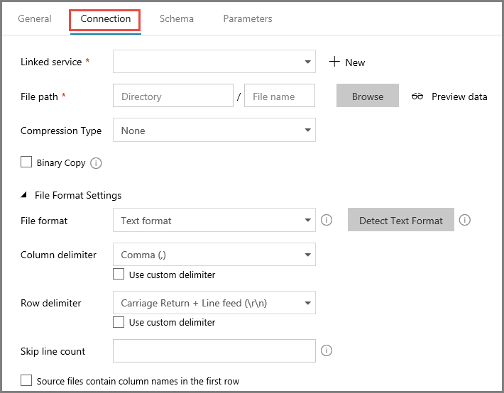
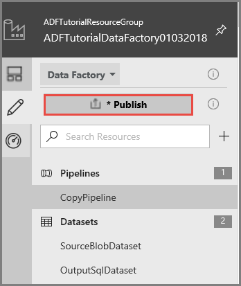

# Copy data from Azure Blob to Azure SQL Database using Azure Data Factory
In this tutorial, you create a data factory by using the Azure Data Factory user interface (UI). The pipeline in this data factory copies data from Azure Blob Storage to Azure SQL Database. The configuration pattern in this tutorial applies to copying from a file-based data store to a relational data store. For a list of data stores supported as sources and sinks, see [supported data stores](copy-activity-overview.md#supported-data-stores-and-formats) table.

> [!NOTE]
> - If you are new to Azure Data Factory, see [Introduction to Azure Data Factory](introduction.md).
>
> - This article applies to version 2 of Data Factory, which is currently in preview. If you are using version 1 of the Data Factory service, which is generally available (GA), see [get started with Data Factory version 1](v1/data-factory-copy-data-from-azure-blob-storage-to-sql-database.md).

You perform the following steps in this tutorial:

> [!div class="checklist"]
> * Create a data factory.
> * Create a pipeline with a Copy activity.
> * Test run the pipeline
> * Trigger the pipeline manually
> * Trigger the pipeline on a schedule
> * Monitor the pipeline and activity runs.

## Prerequisites
* **Azure Subscription**. If you don't have an Azure subscription, create a [free](https://azure.microsoft.com/free/) account before you begin.
* **Azure Storage account**. You use the blob storage as **source** data store. If you don't have an Azure storage account, see the [Create a storage account](../storage/common/storage-create-storage-account.md#create-a-storage-account) article for steps to create one.
* **Azure SQL Database**. You use the database as **sink** data store. If you don't have an Azure SQL Database, see the [Create an Azure SQL database](../sql-database/sql-database-get-started-portal.md) article for steps to create one.

### Create a blob and a SQL table

Now, prepare your Azure Blob and Azure SQL Database for the tutorial by performing the following steps:

#### Create a source blob

1. Launch Notepad. Copy the following text and save it as **emp.txt** file on your disk.

	```
    John,Doe
    Jane,Doe
	```

2. Create a container named **adftutorial** in your Azure blob storage. Create a folder named **input** in this container. Then, upload the **emp.txt** file to the **input** folder. Use the Azure portal or tools such as [Azure Storage Explorer](http://storageexplorer.com/) to do these tasks.

#### Create a sink SQL table

1. Use the following SQL script to create the **dbo.emp** table in your Azure SQL Database.

    ```sql
    CREATE TABLE dbo.emp
    (
        ID int IDENTITY(1,1) NOT NULL,
        FirstName varchar(50),
        LastName varchar(50)
    )
    GO

    CREATE CLUSTERED INDEX IX_emp_ID ON dbo.emp (ID);
    ```

2. Allow Azure services to access SQL server. Ensure that **Allow access to Azure services** setting is turned **ON** for your Azure SQL server so that the Data Factory service can write data to your Azure SQL server. To verify and turn on this setting, do the following steps:

    1. Click **More services** hub on the left and click **SQL servers**.
    2. Select your server, and click **Firewall** under **SETTINGS**.
    3. In the **Firewall settings** page, click **ON** for **Allow access to Azure services**.

## Create a data factory
In this step, you create a data factory, and launch the Azure Data Factory UI to create a pipeline in the data factory. 

1. Click **New** on the left menu, click **Data + Analytics**, and click **Data Factory**. 
   
   
2. In the **New data factory** page, enter **ADFTutorialDataFactory** for the **name**. 
      
     
 
   The name of the Azure data factory must be **globally unique**. If you see the following error for the name field, change the name of the data factory (for example, yournameADFTutorialDataFactory). See [Data Factory - Naming Rules](naming-rules.md) article for naming rules for Data Factory artifacts.
  
     
3. Select your Azure **subscription** in which you want to create the data factory. 
4. For the **Resource Group**, do one of the following steps:
     
      - Select **Use existing**, and select an existing resource group from the drop-down list. 
      - Select **Create new**, and enter the name of a resource group.   
         
        To learn about resource groups, see [Using resource groups to manage your Azure resources](../azure-resource-manager/resource-group-overview.md).  
4. Select **V2 (Preview)** for the **version**.
5. Select the **location** for the data factory. Only locations that are supported are displayed in the drop-down list. The data stores (Azure Storage, Azure SQL Database, etc.) and computes (HDInsight, etc.) used by data factory can be in other regions.
6. Select **Pin to dashboard**.     
7. Click **Create**.      
8. On the dashboard, you see the following tile with status: **Deploying data factory**. 

	
9. After the creation is complete, you see the **Data Factory** page as shown in the image.
   
   
10. Click **Author & Monitor** tile to launch the Azure Data Factory user interface (UI) in a separate tab.

## Create a pipeline
In this step, you create a pipeline with a Copy activity in the data factory. The Copy activity copies data from Azure Blob Storage to Azure SQL Database. In the [Quickstart tutorial](quickstart-create-data-factory-portal.md), you created a pipeline by following these steps:

1. Create the linked service. 
2. Create input and output datasets.
3. Then, create a pipeline.

In this tutorial, you start with creating the pipeline, and create linked services and datasets when you need them to configure the pipeline. 

1. In the get started page, click **Create Pipeline** tile. 

   
3. In the **Properties** window for the pipeline, set the **name** of the pipeline to **CopyPipeline**.

    
4. In the **Activities** toolbox, expand the **DataFlow** category, and drag-drop the **Copy** activity from the tool box to the pipeline designer surface. 

    
5. In the **General** tab of the **Properties** window, specify **CopyFromBlobToSql** as the name of the activity.

    
6. Switch to the **Source** tab. Click **+ New** to create a source dataset. 

    
7. In the **New Dataset** window, select **Azure Blob Storage**, and click **Finish**. The source data is in an Azure blob storage, so you select Azure Blob Storage for the source dataset. 

    
8. You see a new **tab** opened in the application with the title **AzureBlob1**.

            
9. In the **General** tab in the **Properties** window at the bottom, specify **SourceBlobDataset** for the **name**.

    
10. Switch to the **Connection** tab in the properties window.   

    
11. Click **+ New** next to the **Linked service** text box. A linked service links a data store or a compute to the data factory. In this case, you create an Azure Storage linked service to link your Azure Storage account to the data store. The linked service has the connection information that the Data Factory services uses to connect to the blob storage at runtime. The dataset specifies the container, folder, and the file (optional) that contains the source data. 

    
12. In the **New Linked Service** window, do the following steps: 

    1. specify **AzureStorageLinkedService** for the **Name** field. 
    2. Select your Azure storage account for the **Storage account name** field.
    3. Click **Test connection** to test the connection to the Azure Storage account.  
    4. Click **Save** to save the linked service.

        
13. Click **Browse** for the **File path** field.  

    
14. Navigate to the **adftutorial/input** folder, select **emp.txt** file, and click **Finish**. Alternatively, you can double-click emp.txt. 

    
15. Confirm that the **File format** is set to **Text format** and **column delimiter** is set to **Comma (`,`)**. If the source file uses different row and column delimiters, you can click **Detect Text Format** for the **File format** field. The Copy Data tool detects the file format and delimiters automatically for you. You can still override these values. You can preview data on this page by clicking **Preview data**.

    
17. Switch to the **Schema** tab in the properties window, and click **Import Schema**. Notice that the application detected two columns in the source file. You are importing the schema here so that you can map columns from the source data store to the sink data store. If you don't need to map columns, you may skip this step. For this tutorial, import the schema.

      
19. Now, switch to the **tab with the pipeline** or click the pipeline in the **treeview** on the left.  

    
20. Confirm that the **SourceBlobDataset** is selected for the Source Dataset field in the properties window. You can preview data on this page by clicking **Preview data**. 
    
    
21. Switch to the **Sink** tab, and click **New** to create a sink dataset. 

    
22. In the **New Dataset** window, select **Azure SQL Database**, and click **Finish**. You are copying data to an Azure SQL database in this tutorial. 

    
23. In the **General** tab of the properties window, set the name to **OutputSqlDataset**. 
    
    
24. Switch to the **Connection** tab, and click **New** for the **Linked service**. A dataset must be associated with a linked service. The linked service has the connection string that the Data Factory service uses to connect to the Azure SQL database at runtime. The dataset specifies the container, folder, and the file (optional) to which the data is copied. 
    
           
25. In the **New Linked Service** window, do the following steps: 

    1. Enter **AzureSqlDatabaseLinkedService** for the **Name** field. 
    2. Select your Azure SQL server for the **Server name** field.
    4. Select your Azure SQL database for the **Database name** field. 
    5. Enter name of the user for the **User name** field. 
    6. Enter password for the user for the **Password** field. 
    7. Click **Test connection** to test the connection.
    8. Click **Save** to save the linked service. 
    
        

26. Select **[dbo].[emp]** for **Table**. 

    
27. Switch to **Schema** tab, and click Import Schema. 

    
28. Select **ID** column, and click **Delete**. The ID column is an identity column in the SQL database, so copy activity does not need to insert data into this column.

    
30. Switch to the tab with the **pipeline**, and confirm that **OutputSqlDataset** is selected for **Sink Dataset**.

            
31. Switch to the **Mapping** tab in the properties window at the bottom, and click **Import Schemas**. Notice that the first and second columns in the source file are mapped to the **FirstName** and **LastName** fields in the SQL database.

    
33. Validate the pipeline by clicking the **Validate** button. Click the **right-arrow** to close the validation window.

       
34. Click **Code** button in the right corner. You see the JSON code associated with the pipeline. 

    
35. You see the JSON code similar to the following snippet:  

    ```json
    {
        "name": "CopyPipeline",
        "properties": {
            "activities": [
                {
                    "name": "CopyFromBlobToSql",
                    "type": "Copy",
                    "dependsOn": [],
                    "policy": {
                        "timeout": "7.00:00:00",
                        "retry": 0,
                        "retryIntervalInSeconds": 20
                    },
                    "typeProperties": {
                        "source": {
                            "type": "BlobSource",
                            "recursive": true
                        },
                        "sink": {
                            "type": "SqlSink",
                            "writeBatchSize": 10000
                        },
                        "enableStaging": false,
                        "parallelCopies": 0,
                        "cloudDataMovementUnits": 0,
                        "translator": {
                            "type": "TabularTranslator",
                            "columnMappings": "Prop_0: FirstName, Prop_1: LastName"
                        }
                    },
                    "inputs": [
                        {
                            "referenceName": "SourceBlobDataset",
                            "type": "DatasetReference",
                            "parameters": {}
                        }
                    ],
                    "outputs": [
                        {
                            "referenceName": "OutputSqlDataset",
                            "type": "DatasetReference",
                            "parameters": {}
                        }
                    ]
                }
            ]
        }
    }
    ```

## Test run the pipeline
You can test run a pipeline before publishing artifacts (linked services, datasets, and pipeline) to Data Factory (or) your own VSTS GIT repository. 

1. To test run the pipeline, click **Test Run** on the toolbar. You see the status of the pipeline run in the **Output** tab of the window at the bottom. 

    
2. Verify that the data from the source file is inserted into the destination SQL database. 

    
3. Click **Publish** in the left pane. This action publishes entities (linked services, datasets, and pipelines) you created to Azure Data Factory.

    
4. Wait until you see the **Successfully published** message. To see notification messages, click **Show Notifications** tab on the left sidebar. Close the notifications window by clicking **X**.

    

## Configure code repository
You can publish the code associated with your data factory artifacts to a Visual Studio Team System (VSTS) code repository. In this step, you create the code repository. 

If you don't want to work with the VSTS code repository, you can skip this step, and continue publishing to Data Factory as you did in the previous step. 

1. Click **Data Factory** in the left corner (or) the down arrow next to it, and click **Configure Code Repository**. 

    
2. In the **Repository Settings** page, do the following steps: 
    1. Select **Visual Studio Team Services Git** for the **Repository Type** field.
    2. Select your VSTS account for the **Visual Studio Team Services Account** field.
    3. Select a project in your VSTS account for the **Project Name** field.
    4. Enter **Tutorial2** for the **name of the Git repository** to be associated with your data factory. 
    5. Confirm that **Import existing Data Factory resources to repository** option is selected. 
    6. Click **Save** to save the settings. 

        
3. Confirm that **VSTS GIT** is selected for the repository.

    
4. In a separate tab in the web browser, navigate to the **Tutorial2** repository, you see two branches: **master** and **adf_publish**.

    
5. Verify that the **JSON files** for the Data Factory entities are in the **master** branch.

    
6. Verify that the **JSON files** are not in the **adf_publish** branch yet. 

    
7. Add **description** for the **pipeline**, and click **Save** button on the toolbar. 

    
8. Now, you should see a **branch** with your user name in the **Tutorial2** repository. The change you made is in your own branch, not in the master branch. You can only publish entities from the master branch.

    
9. Move the move over the **Sync** button (don't click yet), select **Commit Changes** option, and click **Sync** button to sync your changes with the **master** branch. 

    
9. In the Sync your changes window, do the following actions: 

    1. Confirm that **CopyPipeline** is shown in the updated pipelines list.
    2. Confirm that **Publish changes after sync** is selected. If you uncheck this option, you only sync your changes in your branch with the master branch, but don't publish them to the Data Factory service. You can publish them later by using the **Publish** button. If you check this option, the changes are synced to the master first and then they are published to the Data Factory service.
    3. Click **Sync**. 

    
10. Now, you can see files in the **adf_publish** branch of the **Tutorial2** repository. You can also find the Azure Resource Manager template for your Data Factory solution in this branch.  

    


## Trigger the pipeline manually
In this step, you manually trigger the pipeline you published in the previous step. 

1. Click **Trigger** on the toolbar, and click **Trigger Now**. 

    
2. Switch to the **Monitor** tab on the left. You see a pipeline run that is triggered by a manual trigger. You can use links in the Actions column to view activity details and to rerun the pipeline.

    
3. To see activity runs associated with the pipeline run, click **View Activity Runs** link in the **Actions** column. In this example, there is only one activity, so you see only one entry in the list. You can click **Pipelines** at the top to switch back to the **Pipeline Runs** view.

    
4. Verify that two more rows are added to the **emp** table in the Azure SQL database. 

## Trigger the pipeline on a schedule
In this schedule, you create a scheduler trigger for the pipeline. The trigger runs the pipeline on the specified schedule (hourly, daily, etc.). In this example, you set the trigger to run every minute until the specified end datetime. 

1. Switch to the **Edit** tab on the left. 

    
2. Click **Trigger**, and select **New/Edit**. If the pipeline is not in the active, switch to it. 

    
3. In the **Add Triggers** window, click **Choose trigger...**, and click **+ New**. 

    
4. In the **New Trigger** window, do the following steps: 

    1. Set the **name** to **RunEveryMinute**.
    2. Select **On Date** for **End**. 
    3. Click the drop-down list for **End On**.
    4. Select the **current day**. By default, the end day is set to the next day. 
    5. Update the **minutes** part to be a few minutes past the current datetime. The trigger is activated only after you publish the changes. Therefore, if you set it to only a couple of minutes apart and you don't publish it by then, you do not see a trigger run.  
    6. Click **Apply**. 

        
    7. Check the **Activated** option. You can deactivate it and activate it later by using this check box.
    8. Click **Next**.

        

    > [!IMPORTANT]
    > There is a cost associated with each pipeline run. Therefore, set the end date appropriately. 
6. In the **Trigger Run Parameters** page, review the warning, and click **Finish**. The pipeline in this example does not take any parameters. 

    
7. Click **Publish** to publish the changes to the repository. The trigger is not actually activated until the publishing succeeds. 

     
8. Switch to the **Monitor** tab on the left to see the triggered pipeline runs. 

        
9. To switch from the pipeline runs view to the trigger runs view, click Pipeline Runs and select Trigger Runs.
    
    
10. You see the trigger runs in a list. 

    
11. Verify that two rows per minute (for each pipeline run) are inserted into the **emp** table until the specified end time. 

## Next steps
The pipeline in this sample copies data from one location to another location in an Azure blob storage. You learned how to: 

> [!div class="checklist"]
> * Create a data factory.
> * Create a pipeline with a Copy activity.
> * Test run the pipeline
> * Trigger the pipeline manually
> * Trigger the pipeline on a schedule
> * Monitor the pipeline and activity runs.


Advance to the following tutorial to learn about copying data from on-premises to cloud: 

> [!div class="nextstepaction"]
>[Copy data from on-premises to cloud](tutorial-hybrid-copy-data-tool.md)
