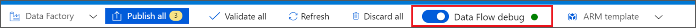
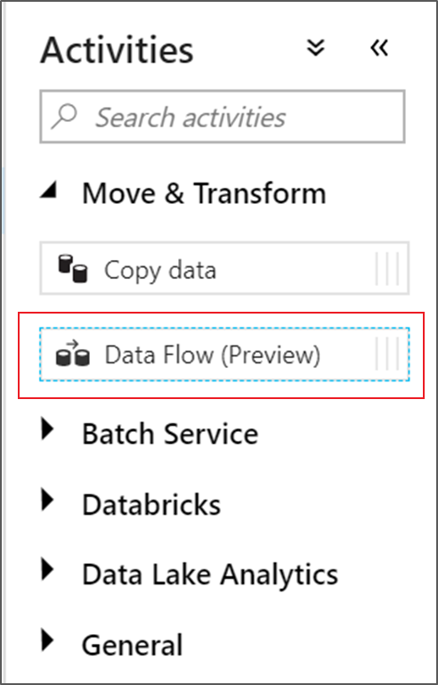
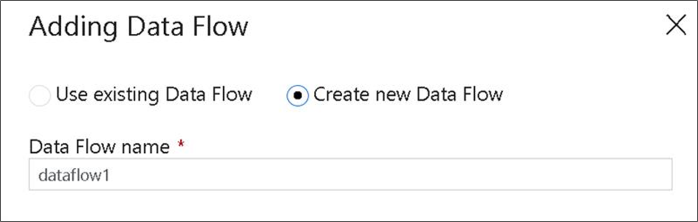
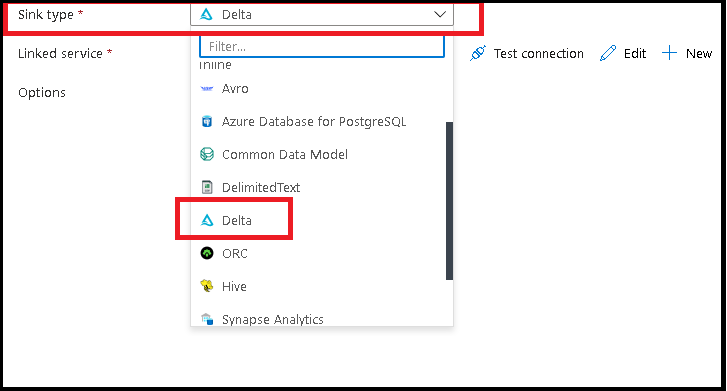
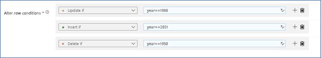
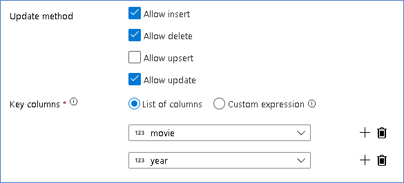

# Transform data in delta lake using mapping data flows

[!INCLUDE[appliesto-adf-xxx-md](includes/appliesto-adf-xxx-md.md)]

If you're new to Azure Data Factory, see [Introduction to Azure Data Factory](introduction.md).

In this tutorial, you'll use the data flow canvas to create data flows that allow you to analyze and transform data in Azure Data Lake Storage (ADLS) Gen2 and store it in Delta Lake.

## Prerequisites
* **Azure subscription**. If you don't have an Azure subscription, create a [free Azure account](https://azure.microsoft.com/free/) before you begin.
* **Azure storage account**. You use ADLS storage as a *source* and *sink* data stores. If you don't have a storage account, see [Create an Azure storage account](../storage/common/storage-account-create.md) for steps to create one.

The file that we are transforming in this tutorial is MoviesDB.csv, which can be found [here](https://github.com/kromerm/adfdataflowdocs/blob/master/sampledata/moviesDB2.csv). To retrieve the file from GitHub, copy the contents to a text editor of your choice to save locally as a .csv file. To upload the file to your storage account, see [Upload blobs with the Azure portal](../storage/blobs/storage-quickstart-blobs-portal.md). The examples will be referencing a container named 'sample-data'.

## Create a data factory

In this step, you create a data factory and open the Data Factory UX to create a pipeline in the data factory.

1. Open **Microsoft Edge** or **Google Chrome**. Currently, Data Factory UI is supported only in the Microsoft Edge and Google Chrome web browsers.
2. On the left menu, select **Create a resource** > **Integration** > **Data Factory**:

   

3. On the **New data factory** page, under **Name**, enter **ADFTutorialDataFactory**.

   The name of the Azure data factory must be *globally unique*. If you receive an error message about the name value, enter a different name for the data factory. (for example, yournameADFTutorialDataFactory). For naming rules for Data Factory artifacts, see [Data Factory naming rules](naming-rules.md).

     
4. Select the Azure **subscription** in which you want to create the data factory.
5. For **Resource Group**, take one of the following steps:

    a. Select **Use existing**, and select an existing resource group from the drop-down list.

    b. Select **Create new**, and enter the name of a resource group. 
         
    To learn about resource groups, see [Use resource groups to manage your Azure resources](../azure-resource-manager/management/overview.md). 
6. Under **Version**, select **V2**.
7. Under **Location**, select a location for the data factory. Only locations that are supported are displayed in the drop-down list. Data stores (for example, Azure Storage and SQL Database) and computes (for example, Azure HDInsight) used by the data factory can be in other regions.
8. Select **Create**.
9. After the creation is finished, you see the notice in Notifications center. Select **Go to resource** to navigate to the Data factory page.
10. Select **Author & Monitor** to launch the Data Factory UI in a separate tab.

## Create a pipeline with a Data Flow activity

In this step, you'll create a pipeline that contains a Data Flow activity.

1. On the **Let's get started** page, select **Create pipeline**.

   

1. In the **General** tab for the pipeline, enter **DeltaLake** for **Name** of the pipeline.
1. In the factory top bar, slide the **Data Flow debug** slider on. Debug mode allows for interactive testing of transformation logic against a live Spark cluster. Data Flow clusters take 5-7 minutes to warm up and users are recommended to turn on debug first if they plan to do Data Flow development. For more information, see [Debug Mode](concepts-data-flow-debug-mode.md).

    
1. In the **Activities** pane, expand the **Move and Transform** accordion. Drag and drop the **Data Flow** activity from the pane to the pipeline canvas.

    
1. In the **Adding Data Flow** pop-up, select **Create new Data Flow** and then name your data flow **DeltaLake**. Click Finish when done.

    

## Build transformation logic in the data flow canvas

Objectives:

1. Take the MoviesCSV dataset source from above, form a new Delta Lake from it
1. Build the logic to updated ratings for 1988 movies to 1
1. Delete all movies from 1950
1. Insert new movies for 2021 by duplicating the movies from 1960
1. Create an ADLS Gen2 Linked Service and a Delimited Text dataset 
1. Name the dataset as “MoviesCSV” 
1. Point to the CSV file above and set it to be comma delimited, include header on first row 
1. Create a new data flow and point to the MoviesCSV dataset from step 2 above in the source transformation 
1. Turn on your debug session 
1. Go to the Source Project tab and Detect Data Types 
1. Once you have your projection set, you can continue to the 2 scenarios below 
1. Using that same Linked Service from above, create a new delimited text dataset 
1. Do not set a filename, just point a folder in your storage account, or type in a new folder name for ADF to create on the fly 
1. Do not import any schemas 
1. Call the dataset “folderout” 
1. Create a source for the MoviesCSV, set the data types, and sink it directly into an Inline dataset type of Delta 
1. Delta is an inline dataset type. You will need to point to your ADLS Gen2 storage account.

1. You’ll need to execute just that simple loading data flow from a debug pipeline first to form the Delta Lake 
1. Next, you can create another data flow that will update/insert into the lake 
1. Use the MoviesCSV again as a source and detect data types
1. Only allow movie rows that match the 3 years you are going to work with which will be 1950, 1988, and 1960. Use a Filter transformation directly after your source for this
1. Update ratings for each 1988 movie to 1 in a Derived Column 
1. In that same Derived Column, create movies for 2021 by taking an existing year and change the year to 2021. Let’s pick 1960.  
1. Your logic should look something like this in your Derived Column:

1. Update / insert / delete policies are created in the Alter Row transform. Add an Alter Row after your Derived Column.
1. Your Alter Row policies should look like this:

1. Now that you’ve set the proper policy for each Alter Row type, check that the proper update rules have been set on the Sink: 

1. Here we are using the Delta Lake sink to your ADLS Gen2 data lake and allowing inserts, updates, deletes. 
1. Note that the Key Columns is a composite key made up of the Movie PK and Year. This is because we created fake 2021 movies by duplicating the 1960 rows. This avoids collisions when looking up the existing rows by providing uniqueness.
 
[Here is a sample solution for the Delta pipeline with a data flow for update/delete rows in the lake:](https://github.com/kromerm/adfdataflowdocs/blob/master/sampledata/DeltaPipeline.zip)

## Next steps

Learn more about the [data flow expression language](data-flow-expression-functions.md).
