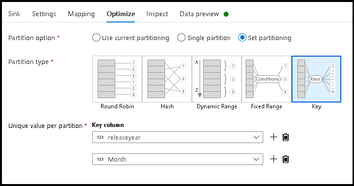
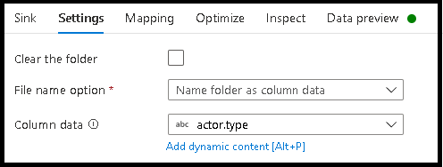

# Dynamically set column names in data flows

[!INCLUDE[appliesto-adf-asa-md](includes/appliesto-adf-asa-md.md)]

Many times, when processing data for ETL jobs, you will need to change the column names before writing the results. Sometimes this is needed to align column names to a well-known target schema. Other times, you may need to set column names at runtime based on evolving schemas. In this tutorial, you'll learn how to use data flows to set column names for your destination files and database tables dynamically using configuration files and parameters.

If you're new to Azure Data Factory, see [Introduction to Azure Data Factory](introduction.md).

## Prerequisites
* **Azure subscription**. If you don't have an Azure subscription, create a [free Azure account](https://azure.microsoft.com/free/) before you begin.
* **Azure storage account**. You use ADLS storage as a *source* and *sink* data stores. If you don't have a storage account, see [Create an Azure storage account](../storage/common/storage-account-create.md) for steps to create one.

The steps in this tutorial will assume that you have 

## Create a data factory

In this step, you create a data factory and open the Data Factory UX to create a pipeline in the data factory.

1. Open **Microsoft Edge** or **Google Chrome**. Currently, Data Factory UI is supported only in the Microsoft Edge and Google Chrome web browsers.
1. On the left menu, select **Create a resource** > **Integration** > **Data Factory**
1. On the **New data factory** page, under **Name**, enter **ADFTutorialDataFactory**
1. Select the Azure **subscription** in which you want to create the data factory.
1. For **Resource Group**, take one of the following steps:

    a. Select **Use existing**, and select an existing resource group from the drop-down list.
    
    b. Select **Create new**, and enter the name of a resource group.To learn about resource groups, see [Use resource groups to manage your Azure resources](../azure-resource-manager/management/overview.md).
    
1. Under **Version**, select **V2**.
1. Under **Location**, select a location for the data factory. Only locations that are supported are displayed in the drop-down list. Data stores (for example, Azure Storage and SQL Database) and computes (for example, Azure HDInsight) used by the data factory can be in other regions.
1. Select **Create**.
1. After the creation is finished, you see the notice in Notifications center. Select **Go to resource** to navigate to the Data factory page.
1. Select **Author & Monitor** to launch the Data Factory UI in a separate tab.

## Create a pipeline with a data flow activity

In this step, you'll create a pipeline that contains a data flow activity.

1. On the **Let's get started** page, select **Create pipeline**.

   

1. In the **General** tab for the pipeline, enter **DeltaLake** for **Name** of the pipeline.
1. In the factory top bar, slide the **Data Flow debug** slider on. Debug mode allows for interactive testing of transformation logic against a live Spark cluster. Data Flow clusters take 5-7 minutes to warm up and users are recommended to turn on debug first if they plan to do Data Flow development. For more information, see [Debug Mode](concepts-data-flow-debug-mode.md).

    
1. In the **Activities** pane, expand the **Move and Transform** accordion. Drag and drop the **Data Flow** activity from the pane to the pipeline canvas.

    
1. In the **Adding Data Flow** pop-up, select **Create new Data Flow** and then name your data flow **DynaCols**. Click Finish when done.

    

## Build dynamic column mapping in data flows

For this tutorial, we're going to use a sample movies rating file and renaming a few of the fields in the source to a new set of target columns that can change over time. The datasets you'll create below should point to this movies CSV file in your Blob Storage or ADLS Gen2 storage account. [Download the movies file here](https://github.com/kromerm/adfdataflowdocs/blob/master/sampledata/moviesDB.csv) and store the file in your Azure storage account.


### Tutorial objectives

1. Choose any of your source datasets in a new data flow
1. Use data flows to effectively partition your sink dataset
1. Land your partitioned data in ADLS Gen2 lake folders

### Start from a blank data flow canvas

First, let's set up the data flow environment for each of the mechanisms described below for landing data in ADLS Gen2

1. Click on the source transformation.
1. Click the new button next to dataset in the bottom panel.
1. Choose a dataset or create a new one. For this demo, we'll use a Parquet dataset called User Data.
1. Add a Derived Column transformation. We'll use this as a way to set your desired folder names dynamically.
1. Add a sink transformation.
   
### Hierarchical folder output

It is very common to use unique values in your data to create folder hierarchies to partition your data in the lake. This is a very optimal way to organize and process data in the lake and in Spark (the compute engine behind data flows). However, there will be a small performance cost to organize your output in this way. Expect to see a small decrease in overall pipeline performance using this mechanism in the sink.

1. Go back to the data flow designer and edit the data flow create above. Click on the sink transformation.
1. Click Optimize > Set partitioning > Key
1. Pick the column(s) you wish to use to set your hierarchical folder structure.
1. Note the example below uses year and month as the columns for folder naming. The results will be folders of the form ```releaseyear=1990/month=8```.
1. When accessing the data partitions in a data flow source, you will point to just the top-level folder above ```releaseyear``` and use a wildcard pattern for each subsequent folder, ex: ```**/**/*.parquet```
1. To manipulate the data values, or even if need to generate synthetic values for folder names, use the Derived Column transformation to create the values you wish to use in your folder names.


   
### Name folder as data values

A slightly better performing sink technique for lake data using ADLS Gen2 that does not offer the same benefit as key/value partitioning, is ```Name folder as column data```. Whereas the key partitioning style of hierarchical structure will allow you to process data slices easier, this technique is a flattened folder structure that can write data quicker.

1. Go back to the data flow designer and edit the data flow create above. Click on the sink transformation.
1. Click Optimize > Set partitioning > Use current partitioning.
1. Click Settings > Name folder as column data.
1. Pick the column that you wish to use for generating folder names.
1. To manipulate the data values, or even if need to generate synthetic values for folder names, use the Derived Column transformation to create the values you wish to use in your folder names.



### Name file as data values

The techniques listed in the above tutorials are good use cases for creating folder categories in your data lake. The default file naming scheme being employed by those techniques is to use the Spark executor job ID. Sometimes you may wish to set the name of the output file in a data flow text sink. This technique is only suggested for use with small files. The process of merging partition files into a single output file is a long-running process.

1. Go back to the data flow designer and edit the data flow create above. Click on the sink transformation.
1. Click Optimize > Set partitioning > Single partition. It is this single partition requirement that creates a bottleneck in the execution process as files are merged. This option is only recommended for small files.
1. Click Settings > Name file as column data.
1. Pick the column that you wish to use for generating file names.
1. To manipulate the data values, or even if need to generate synthetic values for file names, use the Derived Column transformation to create the values you wish to use in your file names.

## Next steps

Learn more about [data flow sinks](data-flow-sink.md).
