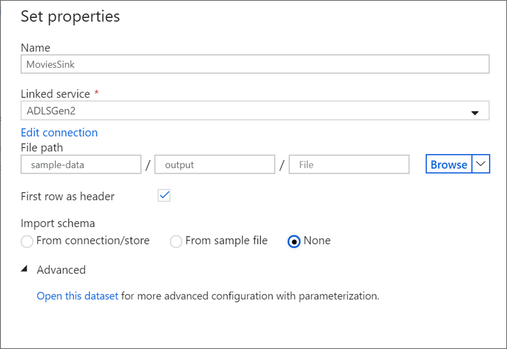
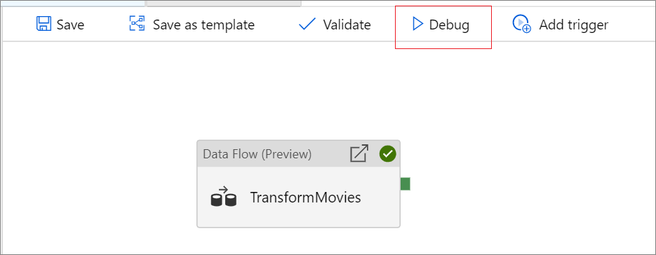
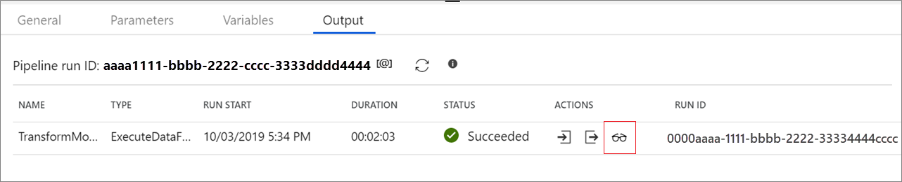
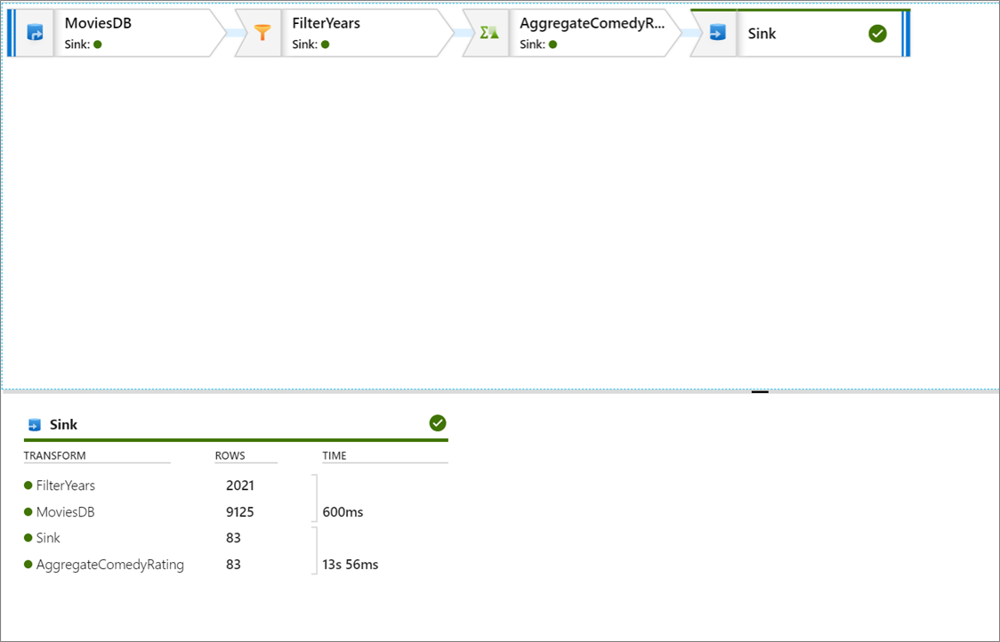
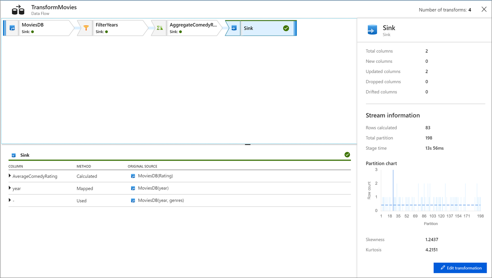

# Data flow development lifecycle

If you're new to Azure Data Factory, see [Introduction to Azure Data Factory](introduction.md).

In this tutorial, you'll learn the lifecycle of designing data flows in ADF that includes unit testing, data preview, end-to-end testing in a pipeline, and preparing for publishing to the live factory.

In this tutorial, we'll start with an existing factory and a data flow from the ADF tutorial on mapping data flows. You will then do the following steps:

> [!div class="checklist"]
> * Test the transformation logic.
> * Test the data flow in a pipeline.
> * Prepare pipeline for publishing.

    
1. Name your sink dataset **MoviesSink**. For linked service, choose the ADLS gen2 linked service you created in step 6. Enter an output folder to write your data to. In this tutorial, we're writing to folder 'output' in container 'sample-data'. The folder doesn't need to exist beforehand and can be dynamically created. Set **First row as header** as true and select **None** for **Import schema**. Click Finish.

    

Now you've finished building your data flow. You're ready to run it in your pipeline.

## Running and monitoring the Data Flow

You can debug a pipeline before you publish it. In this step, you're going to trigger a debug run of the data flow pipeline. While data preview doesn't write data, a debug run will write data to your sink destination.

1. Go to the pipeline canvas. Click **Debug** to trigger a debug run.

    
1. Pipeline debug of Data Flow activities uses the active debug cluster but still take at least a minute to initialize. You can track the progress via the **Output** tab. Once the run is successful, click on the eyeglasses icon to open the monitoring pane.

    
1. In the monitoring pane, you can see the number of rows and time spent in each transformation step.

    
1. Click on a transformation to get detailed information about the columns and partitioning of the data.

    

If you followed this tutorial correctly, you should have written 83 rows and 2 columns into your sink folder. You can verify the data is correct by checking your blob storage.

## Next steps

The pipeline in this tutorial runs a data flow that aggregates the average rating of comedies from 1910 to 2000 and writes the data to ADLS. You learned how to:

> [!div class="checklist"]
> * Create a data factory.
> * Create a pipeline with a Data Flow activity.
> * Build a mapping data flow with four transformations.
> * Test run the pipeline.
> * Monitor a Data Flow activity

Learn more about the [data flow expression language](data-flow-expression-functions.md).
