# Transform data securely by using mapping data flow

[!INCLUDE[appliesto-adf-xxx-md](includes/appliesto-adf-xxx-md.md)]

If you're new to Azure Data Factory, see [Introduction to Azure Data Factory](./introduction.md).

In this tutorial, you'll use the Data Factory user interface (UI) to create a pipeline that copies and transforms data *from an Azure Data Lake Storage Gen2 source to a Data Lake Storage Gen2 sink (both allowing access to only selected networks)* by using mapping data flow in [Data Factory Managed Virtual Network](managed-virtual-network-private-endpoint.md). You can expand on the configuration pattern in this tutorial when you transform data by using mapping data flow.

In this tutorial, you do the following steps:

> [!div class="checklist"]
>
> * Create a data factory.
> * Create a pipeline with a data flow activity.
> * Build a mapping data flow with four transformations.
> * Test run the pipeline.
> * Monitor a data flow activity.

## Prerequisites

* **Azure subscription**. If you don't have an Azure subscription, create a [free Azure account](https://azure.microsoft.com/free/) before you begin.
* **Azure storage account**. You use Data Lake Storage as *source* and *sink* data stores. If you don't have a storage account, see [Create an Azure storage account](../storage/common/storage-account-create.md?tabs=azure-portal) for steps to create one. *Ensure the storage account allows access only from selected networks.* 

The file that we'll transform in this tutorial is moviesDB.csv, which can be found at this [GitHub content site](https://raw.githubusercontent.com/djpmsft/adf-ready-demo/master/moviesDB.csv). To retrieve the file from GitHub, copy the contents to a text editor of your choice to save it locally as a .csv file. To upload the file to your storage account, see [Upload blobs with the Azure portal](../storage/blobs/storage-quickstart-blobs-portal.md). The examples will reference a container named **sample-data**.

## Create a data factory

In this step, you create a data factory and open the Data Factory UI to create a pipeline in the data factory.

1. Open Microsoft Edge or Google Chrome. Currently, only Microsoft Edge and Google Chrome web browsers support the Data Factory UI.
1. On the left menu, select **Create a resource** > **Analytics** > **Data Factory**.
1. On the **New data factory** page, under **Name**, enter **ADFTutorialDataFactory**.

   The name of the data factory must be *globally unique*. If you receive an error message about the name value, enter a different name for the data factory (for example, yournameADFTutorialDataFactory). For naming rules for Data Factory artifacts, see [Data Factory naming rules](naming-rules.md).

1. Select the Azure **subscription** in which you want to create the data factory.
1. For **Resource Group**, take one of the following steps:

    * Select **Use existing**, and select an existing resource group from the drop-down list.
    * Select **Create new**, and enter the name of a resource group. 
         
    To learn about resource groups, see [Use resource groups to manage your Azure resources](../azure-resource-manager/management/overview.md). 
1. Under **Version**, select **V2**.
1. Under **Location**, select a location for the data factory. Only locations that are supported appear in the drop-down list. Data stores (for example, Azure Storage and Azure SQL Database) and computes (for example, Azure HDInsight) used by the data factory can be in other regions.

1. Select **Create**.
1. After the creation is finished, you see the notice in the Notifications center. Select **Go to resource** to go to the **Data Factory** page.
1. Select **Author & Monitor** to launch the Data Factory UI in a separate tab.

## Create an Azure IR in Data Factory Managed Virtual Network

In this step, you create an Azure IR and enable Data Factory Managed Virtual Network.

1. In the Data Factory portal, go to **Manage**, and select **New** to create a new Azure IR.

   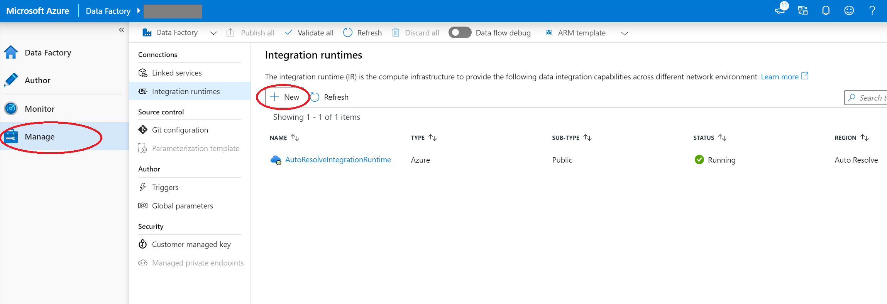
1. On the **Integration runtime setup** page, choose what integration runtime to create based on required capabilities. In this tutorial, select **Azure, Self-Hosted** and then click **Continue**. 
1. Select **Azure** and then click **Continue** to create an Azure Integration runtime.

   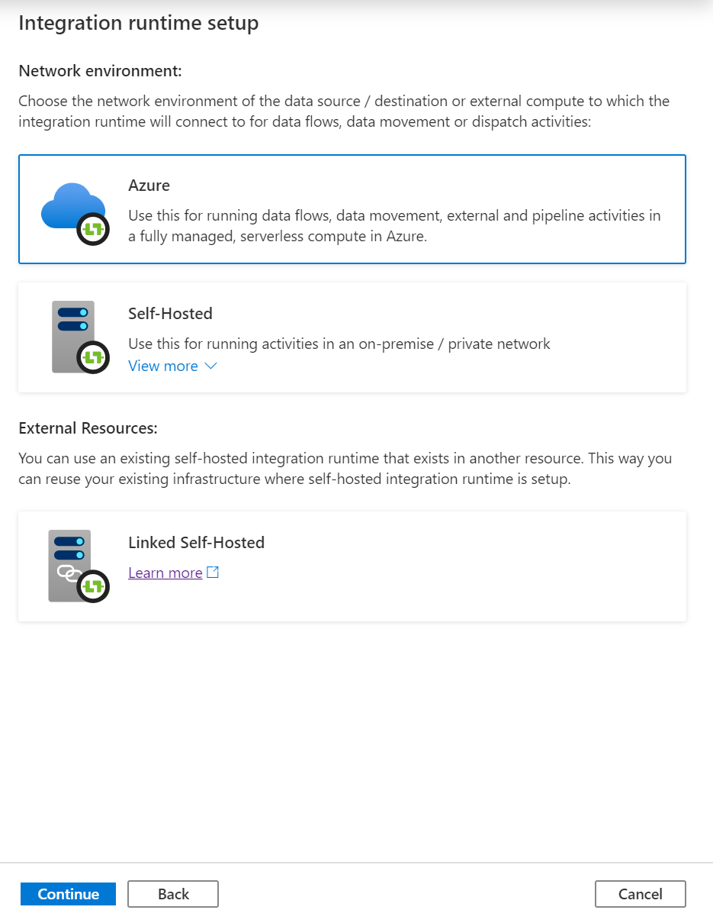

1. Under **Virtual network configuration (Preview)**, select **Enable**.

   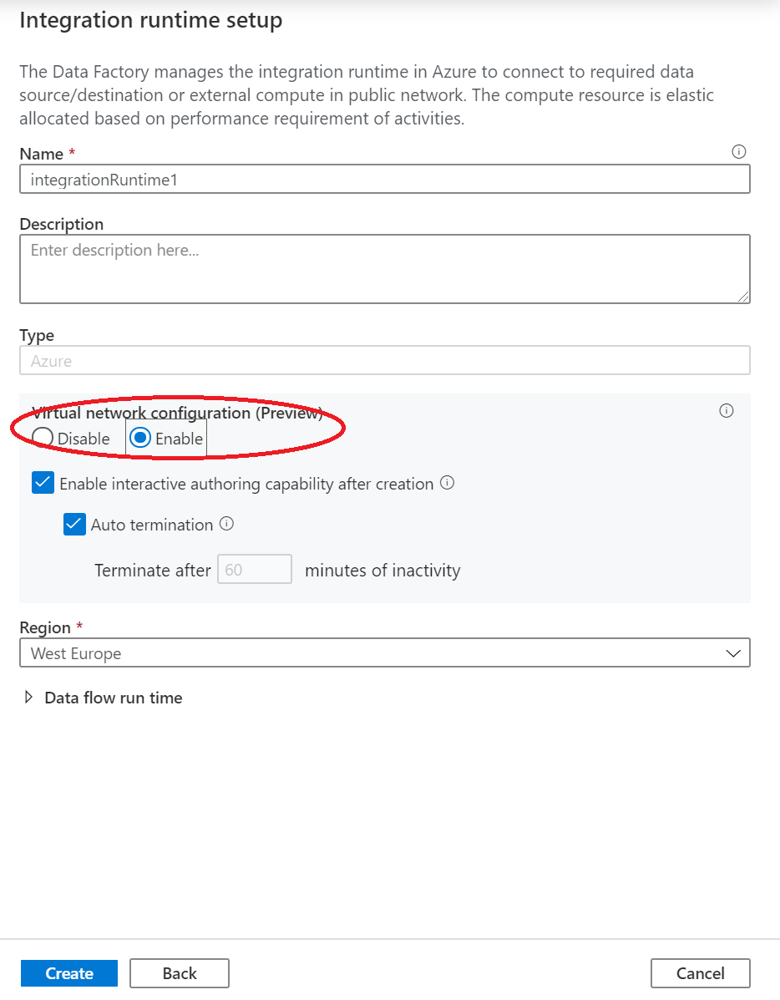

1. Select **Create**.

## Create a pipeline with a data flow activity

In this step, you'll create a pipeline that contains a data flow activity.

1. On the **Let's get started** page, select **Create pipeline**.

   

1. In the properties pane for the pipeline, enter **TransformMovies** for the pipeline name.
1. In the **Activities** pane, expand **Move and Transform**. Drag the **Data Flow** activity from the pane to the pipeline canvas.

1. In the **Adding data flow** pop-up, select **Create new data flow** and then select **Mapping Data Flow**. Select **OK** when you're finished.

    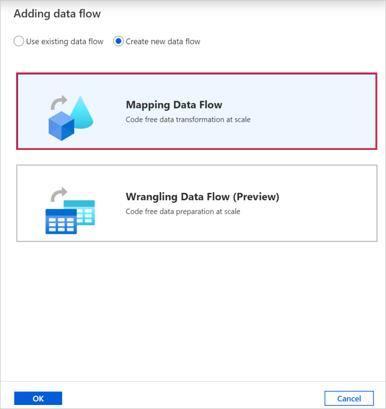

1. Name your data flow **TransformMovies** in the properties pane.
1. In the top bar of the pipeline canvas, slide the **Data Flow debug** slider on. Debug mode allows for interactive testing of transformation logic against a live Spark cluster. Data Flow clusters take 5-7 minutes to warm up and users are recommended to turn on debug first if they plan to do Data Flow development. For more information, see [Debug Mode](concepts-data-flow-debug-mode.md).

    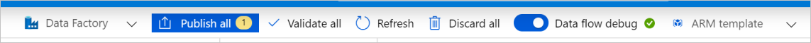

## Build transformation logic in the data flow canvas

After you create your data flow, you'll be automatically sent to the data flow canvas. In this step, you'll build a data flow that takes the moviesDB.csv file in Data Lake Storage and aggregates the average rating of comedies from 1910 to 2000. You'll then write this file back to Data Lake Storage.

### Add the source transformation

In this step, you set up Data Lake Storage Gen2 as a source.

1. In the data flow canvas, add a source by selecting the **Add Source** box.

1. Name your source **MoviesDB**. Select **New** to create a new source dataset.

1. Select **Azure Data Lake Storage Gen2**, and then select **Continue**.

1. Select **DelimitedText**, and then select **Continue**.

1. Name your dataset **MoviesDB**. In the linked service drop-down, select **New**.

1. In the linked service creation screen, name your Data Lake Storage Gen2 linked service **ADLSGen2** and specify your authentication method. Then enter your connection credentials. In this tutorial, we're using **Account key** to connect to our storage account. 

1. Make sure you enable **Interactive authoring**. It might take a minute to be enabled.

    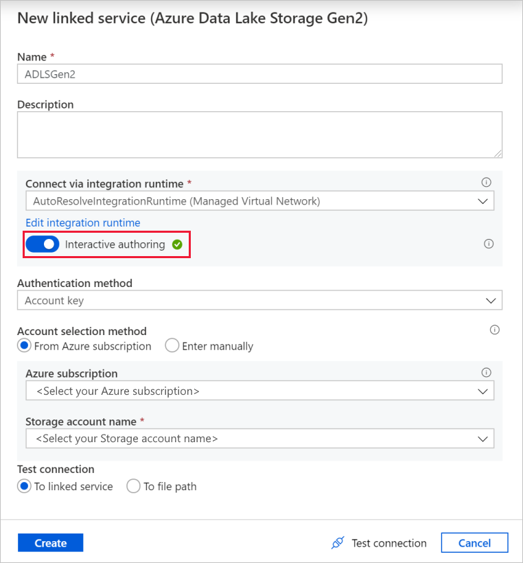

1. Select **Test connection**. It should fail because the storage account doesn't enable access into it without the creation and approval of a private endpoint. In the error message, you should see a link to create a private endpoint that you can follow to create a managed private endpoint. An alternative is to go directly to the **Manage** tab and follow instructions in [this section](#create-a-managed-private-endpoint) to create a managed private endpoint.

1. Keep the dialog box open, and then go to your storage account.

1. Follow instructions in [this section](#approval-of-a-private-link-in-a-storage-account) to approve the private link.

1. Go back to the dialog box. Select **Test connection** again, and select **Create** to deploy the linked service.

1. On the dataset creation screen, enter where your file is located under the **File path** field. In this tutorial, the file moviesDB.csv is located in the container **sample-data**. Because the file has headers, select the **First row as header** check box. Select **From connection/store** to import the header schema directly from the file in storage. Select **OK** when you're finished.

    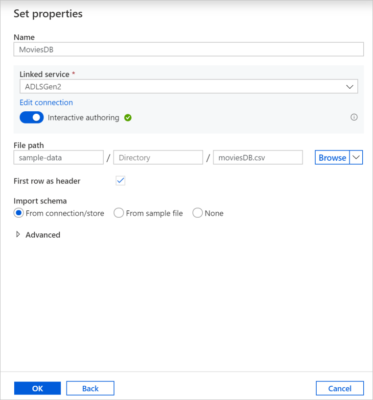

1. If your debug cluster has started, go to the **Data Preview** tab of the source transformation and select **Refresh** to get a snapshot of the data. You can use the data preview to verify your transformation is configured correctly.

    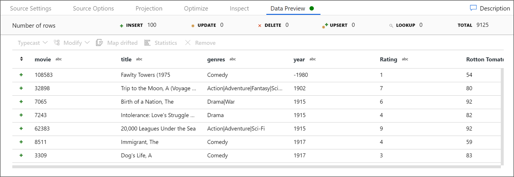

#### Create a managed private endpoint

If you didn't use the hyperlink when you tested the preceding connection, follow the path. Now you need to create a managed private endpoint that you'll connect to the linked service you created.

1. Go to the **Manage** tab.

   > [!NOTE]
   > The **Manage** tab might not be available for all Data Factory instances. If you don't see it, you can access private endpoints by selecting **Author** > **Connections** > **Private Endpoint**.

1. Go to the **Managed private endpoints** section.
1. Select **+ New** under **Managed private endpoints**.

     

1. Select the **Azure Data Lake Storage Gen2** tile from the list, and select **Continue**.
1. Enter the name of the storage account you created.
1. Select **Create**.
1. After a few seconds, you should see that the private link created needs an approval.
1. Select the private endpoint that you created. You can see a hyperlink that will lead you to approve the private endpoint at the storage account level.

     

#### Approval of a private link in a storage account

1. In the storage account, go to **Private endpoint connections** under the **Settings** section.

1. Select the check box by the private endpoint you created, and select **Approve**.

    

1. Add a description, and select **yes**.
1. Go back to the **Managed private endpoints** section of the **Manage** tab in Data Factory.
1. After about a minute, you should see the approval appear for your private endpoint.

### Add the filter transformation

1. Next to your source node on the data flow canvas, select the plus icon to add a new transformation. The first transformation you'll add is a **Filter**.

    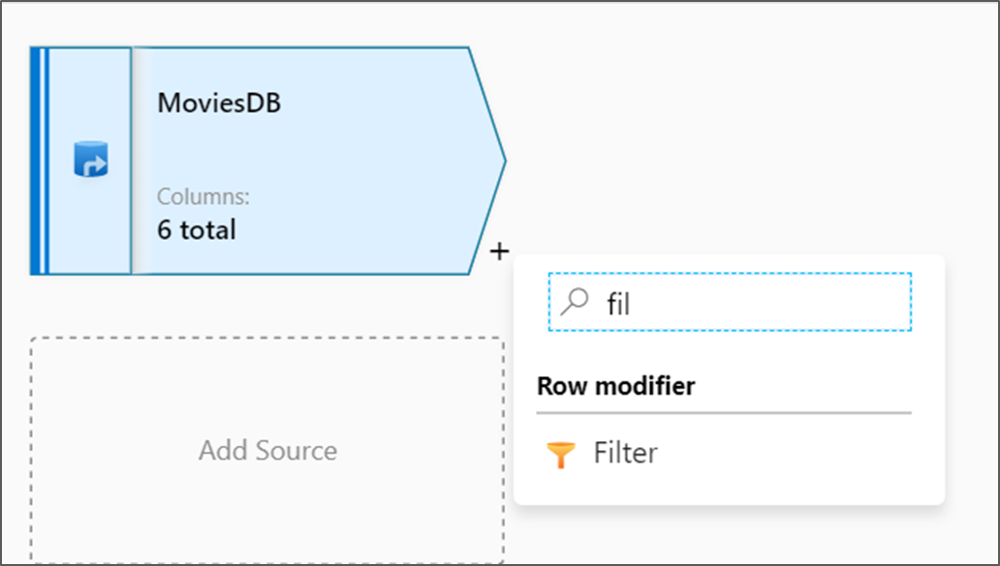
1. Name your filter transformation **FilterYears**. Select the expression box next to **Filter on** to open the expression builder. Here you'll specify your filtering condition.

    
1. The data flow expression builder lets you interactively build expressions to use in various transformations. Expressions can include built-in functions, columns from the input schema, and user-defined parameters. For more information on how to build expressions, see [Data flow expression builder](./concepts-data-flow-expression-builder.md).

    * In this tutorial, you want to filter movies in the comedy genre that came out between the years 1910 and 2000. Because the year is currently a string, you need to convert it to an integer by using the ```toInteger()``` function. Use the greater than or equal to (>=) and less than or equal to (<=) operators to compare against the literal year values 1910 and 2000. Union these expressions together with the and (&&) operator. The expression comes out as:

        ```toInteger(year) >= 1910 && toInteger(year) <= 2000```

    * To find which movies are comedies, you can use the ```rlike()``` function to find the pattern 'Comedy' in the column genres. Union the rlike expression with the year comparison to get:

        ```toInteger(year) >= 1910 && toInteger(year) <= 2000 && rlike(genres, 'Comedy')```

    * If you have a debug cluster active, you can verify your logic by selecting **Refresh** to see the expression output compared to the inputs used. There's more than one right answer on how you can accomplish this logic by using the data flow expression language.

        

    * Select **Save and finish** after you're finished with your expression.

1. Fetch a **Data Preview** to verify the filter is working correctly.

    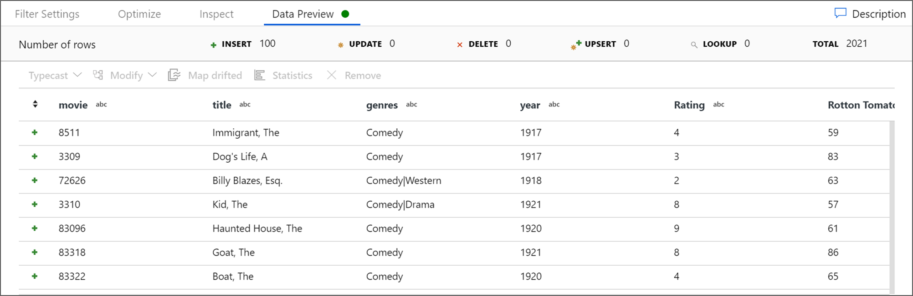

### Add the aggregate transformation

1. The next transformation you'll add is an **Aggregate** transformation under **Schema modifier**.

    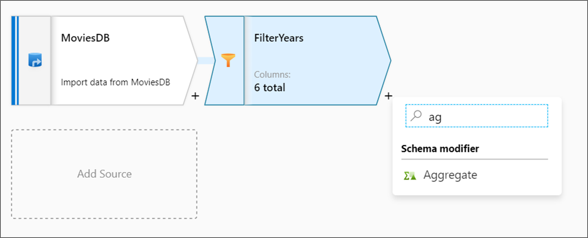
1. Name your aggregate transformation **AggregateComedyRating**. On the **Group by** tab, select **year** from the drop-down box to group the aggregations by the year the movie came out.

    
1. Go to the **Aggregates** tab. In the left text box, name the aggregate column **AverageComedyRating**. Select the right expression box to enter the aggregate expression via the expression builder.

    
1. To get the average of column **Rating**, use the ```avg()``` aggregate function. Because **Rating** is a string and ```avg()``` takes in a numerical input, we must convert the value to a number via the ```toInteger()``` function. This expression looks like:

    ```avg(toInteger(Rating))```

1. Select **Save and finish** after you're finished.

    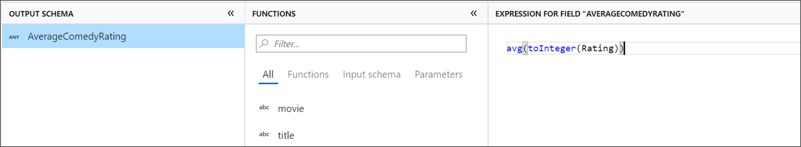
1. Go to the **Data Preview** tab to view the transformation output. Notice only two columns are there, **year** and **AverageComedyRating**.

### Add the sink transformation

1. Next, you want to add a **Sink** transformation under **Destination**.

    
1. Name your sink **Sink**. Select **New** to create your sink dataset.

    
1. On the **New dataset** page, select **Azure Data Lake Storage Gen2** and then select **Continue**.

1. On the **Select format** page, select **DelimitedText** and then select **Continue**.

1. Name your sink dataset **MoviesSink**. For linked service, choose the same **ADLSGen2** linked service you created for source transformation. Enter an output folder to write your data to. In this tutorial, we're writing to the folder **output** in the container **sample-data**. The folder doesn't need to exist beforehand and can be dynamically created. Select the **First row as header** check box, and select **None** for **Import schema**. Select **OK**.

    

Now you've finished building your data flow. You're ready to run it in your pipeline.

## Run and monitor the data flow

You can debug a pipeline before you publish it. In this step, you trigger a debug run of the data flow pipeline. While the data preview doesn't write data, a debug run will write data to your sink destination.

1. Go to the pipeline canvas. Select **Debug** to trigger a debug run.

1. Pipeline debugging of data flow activities uses the active debug cluster but still takes at least a minute to initialize. You can track the progress via the **Output** tab. After the run is successful, select the eyeglasses icon for run details.

1. On the details page, you can see the number of rows and the time spent on each transformation step.

    
1. Select a transformation to get detailed information about the columns and partitioning of the data.

If you followed this tutorial correctly, you should have written 83 rows and 2 columns into your sink folder. You can verify the data is correct by checking your blob storage.

## Summary

In this tutorial, you used the Data Factory UI to create a pipeline that copies and transforms data from a Data Lake Storage Gen2 source to a Data Lake Storage Gen2 sink (both allowing access to only selected networks) by using mapping data flow in [Data Factory Managed Virtual Network](managed-virtual-network-private-endpoint.md).