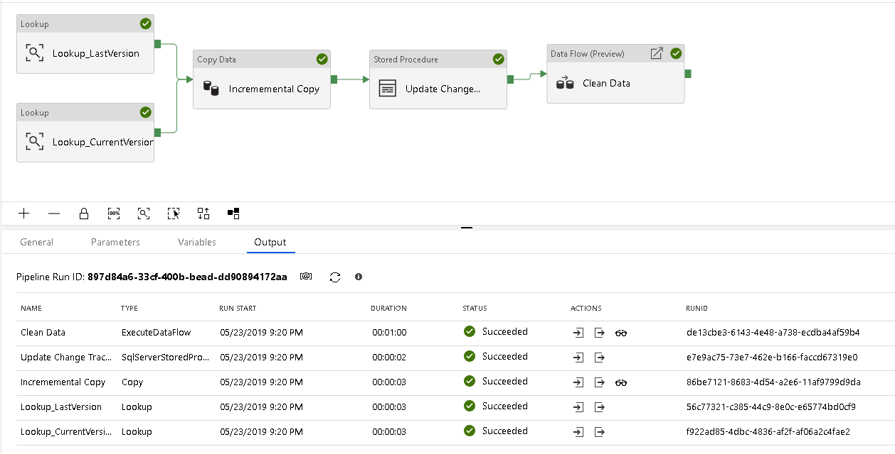
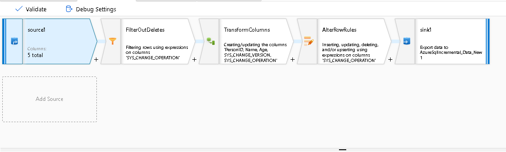

# Transform data from on-prem SQL Server and sink it in Azure SQL Database

Azure Data Factory is a cloud-based data integration and ETL service that allows you to create data-driven workflows in the cloud for orchestrating and automating data movement and data transformation. Using Azure Data Factory, you can create and schedule data-driven workflows (called pipelines) that can ingest data from disparate data stores, process/transform the data at scale with a code-free interface.

In this tutorial, you create a Data Factory pipeline that copies data from SQL Server on-prem to Azure Blob for transformation using Mapping Data Flows. You'll then land the transformed data in Azure SQL Database.

You perform the following steps in this tutorial:

> [!div class="checklist"]
> * Create a data factory with the incremental data loading pattern.
> * Create Azure Storage and Azure SQL Database linked services.
> * Create Azure Blob and Azure SQL Database datasets.
> * Add a data flow activity to the incremental pipeline.
> * Start a pipeline run.

This tutorial assumes that you've already gone through the getting stared quickstarts and have performed the actions in the [Incremental data loading with SQL change tracking](https://docs.microsoft.com/en-us/azure/data-factory/tutorial-incremental-copy-change-tracking-feature-portal) tutorial.

If you don't have an Azure subscription, create a [free](https://azure.microsoft.com/free/) account before you begin.

## Prerequisites

* **Azure Storage account**. You use the blob storage as **sink** data store in the copy activity as part of the incremental data load to stage the SQL Server data from an on-prem source. If you don't have an Azure storage account, see the [Create a storage account](../storage/common/storage-create-storage-account.md#create-a-storage-account) article for steps to create one.
* **Azure SQL Database**. You use the database as **sink** data store. If you don't have an Azure SQL Database, see the [Create an Azure SQL database](../sql-database/sql-database-get-started-portal.md) article for steps to create one.

## Build the incremental pipeline with SQL Server source

* Follow the [Incremental data loading with SQL change tracking](tutorial-incremental-copy-change-tracking-feature-portal.md) tutorial.
* Change the source linked service from Azure SQL Database to SQL Server.
* Change the linked service for the stored procedure activity to call the stored procedure on your local SQL Server. This stored procedure updates the version control table in SQL.
* Use the [self-hosted integration runtime](create-self-hosted-integration-runtime.md) to connect to the on-premises SQL Server.
* Keep the rest of the pipeline the same. You'll stage the changed data from your SQL Server in Azure Blob Store and then use that staged data with Data Flows for visual data transformation.

## Build the data flow to transform the data

* Click the new (+) Data Flow.
* Start by clicking on "Add Source" in the design surface.
* Name the data flow "Clean Data".
* In the source settings, choose the dataset that you used for the Blob Store in the incremental pipeline above.
* Choose "Delete source files" for the "After completion" option.
* 

## Next steps
The pipeline in this sample copies data from SQL Server to an Azure blob storage and transforms data in ADF Mapping Data Flows code-free. You learned how to: 

> [!div class="checklist"]
> * Create a data factory.
> * Create Azure Storage and Azure SQL Database linked services.
> * Create Azure Blob and Azure SQL Database datasets.
> * Design a Mapping Data Flow.
> * Create a pipeline contains a Data Flow activity.
> * Start a pipeline run.

Advance to the following tutorial to learn about copying data from on-premises to cloud: 

> [!div class="nextstepaction"]
>[Copy data from on-premises to cloud](tutorial-hybrid-copy-powershell.md)
