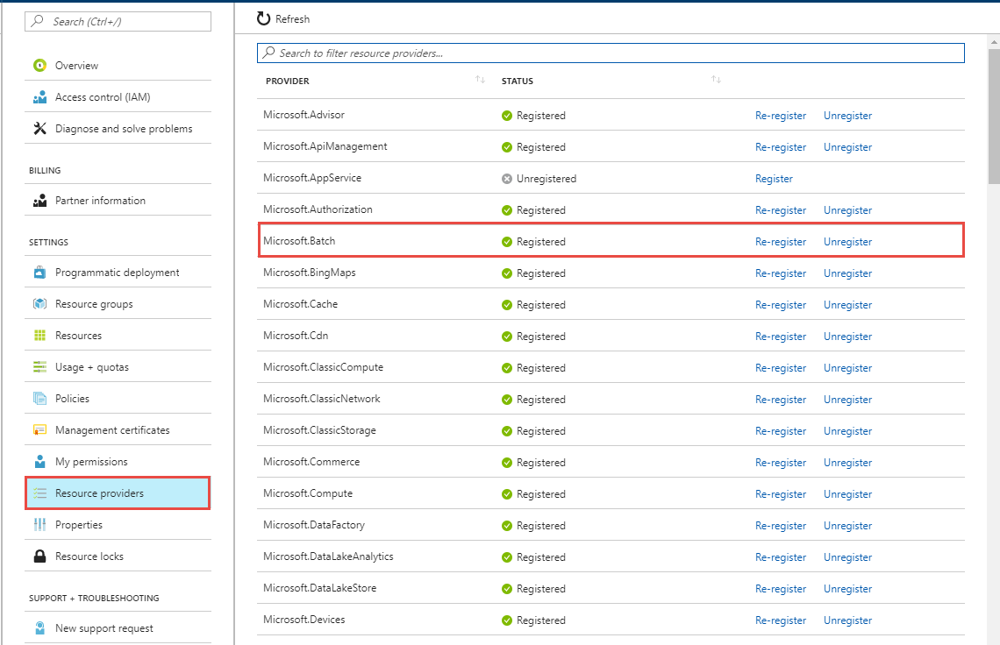
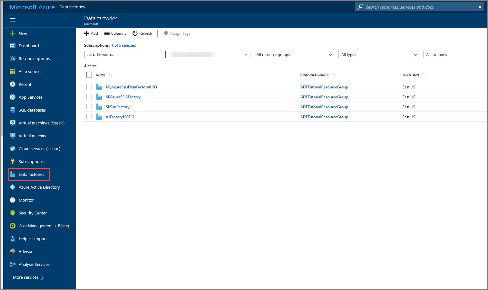
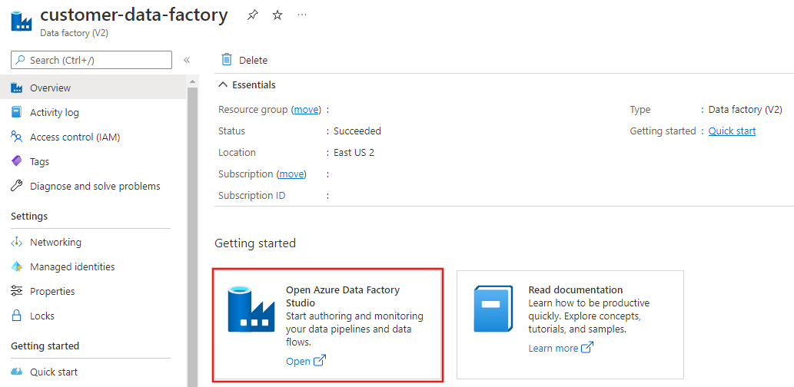
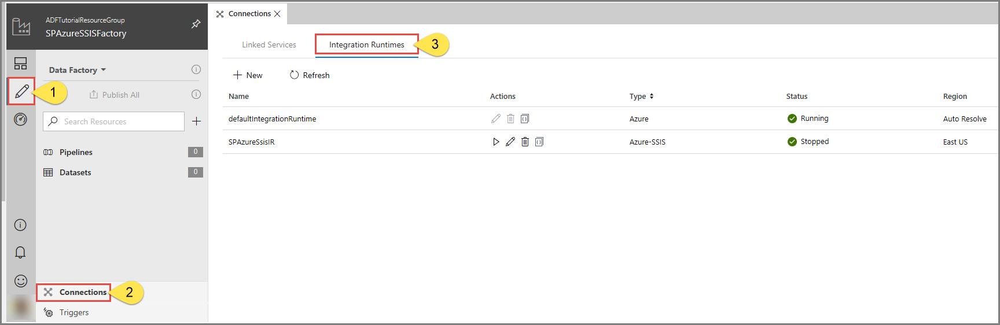
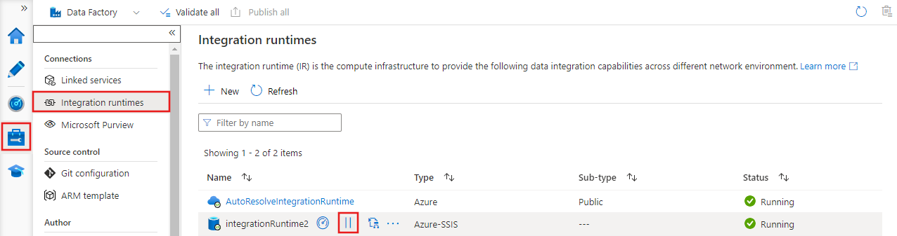
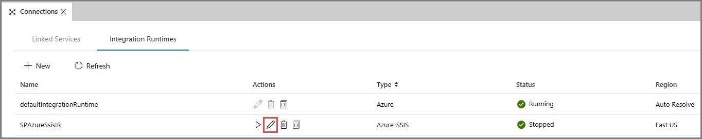

# Configure an Azure-SQL Server Integration Services (SSIS) integration runtime (IR) to join a virtual network

[!INCLUDE[appliesto-adf-asa-md](includes/appliesto-adf-asa-md.md)]

This tutorial provides basic steps for using the Azure portal to configure an Azure-SQL Server Integration Services (SSIS) integration runtime (IR) to join a virtual network.

The steps include:

- Configure a virtual network.
- Join the Azure-SSIS IR to a virtual network from Azure Data Factory portal.

## Prerequisites

- **Azure-SSIS integration runtime**. If you do not have an Azure-SSIS integration runtime, [provision an Azure-SSIS integration runtime in Azure Data Factory](tutorial-deploy-ssis-packages-azure.md) before begin.

- **User permission**. The user who creates the Azure-SSIS IR must have the [role assignment](https://docs.microsoft.com/azure/role-based-access-control/role-assignments-list-portal#list-role-assignments-for-a-user-at-a-scope) at least on Azure Data Factory resource with one of the options below:

    - Use the built-in Network Contributor role. This role comes with the _Microsoft.Network/\*_ permission, which has a much larger scope than necessary.
    - Create a custom role that includes only the necessary _Microsoft.Network/virtualNetworks/\*/join/action_ permission. If you also want to bring your own public IP addresses for Azure-SSIS IR while joining it to an Azure Resource Manager virtual network, please also include _Microsoft.Network/publicIPAddresses/*/join/action_ permission in the role.

- **Virtual network**.

    - If you do not have a virtual network, [create a virtual network using the Azure portal](https://docs.microsoft.com/azure/virtual-network/quick-create-portal).

    - Make sure that the virtual network's resource group can create and delete certain Azure network resources.
    
        The Azure-SSIS IR needs to create certain network resources under the same resource group as the virtual network. These resources include:
        - An Azure load balancer, with the name *\<Guid>-azurebatch-cloudserviceloadbalancer*
        - A network security group, with the name *\<Guid>-azurebatch-cloudservicenetworksecuritygroup
        - An Azure public IP address, with the name -azurebatch-cloudservicepublicip
    
        Those resources will be created when your Azure-SSIS IR starts. They'll be deleted when your Azure-SSIS IR stops. To avoid blocking your Azure-SSIS IR from stopping, don't reuse these network resources in your other resources.

    - Make sure that you have no [resource lock](https://docs.microsoft.com/azure/azure-resource-manager/management/lock-resources) on the resource group/subscription to which the virtual network belongs. If you configure a read-only/delete lock, starting and stopping your Azure-SSIS IR will fail, or it will stop responding.

    - Make sure that you don't have an Azure Policy assignment that prevents the following resources from being created under the resource group/subscription to which the virtual network belongs:
        - Microsoft.Network/LoadBalancers
        - Microsoft.Network/NetworkSecurityGroups

- Below **network configuration** scenarios are not covered in this tutorial:
    - If you bring your own public IP addresses for the Azure-SSIS IR.
    - If you use your own Domain Name System (DNS) server.
    - If you use a network security group (NSG) on the subnet.
    - If you use Azure ExpressRoute or a user-defined route (UDR).
    - If you use customized Azure-SSIS IR.
    
    For more info, check [virtual network configuration](join-azure-ssis-integration-runtime-virtual-network.md#virtual-network-configuration).

## Configure a virtual network

Use the Azure portal to configure a virtual network before you try to join an Azure-SSIS IR to it.

1. Start Microsoft Edge or Google Chrome. Currently, only these web browsers support the Data Factory UI.

1. Sign in to the [Azure portal](https://portal.azure.com).

1. Select **More services**. Filter for and select **Virtual networks**.

1. Filter for and select your virtual network in the list.

1. On the **Virtual network** page, select **Properties**.

1. Select the copy button for **RESOURCE ID** to copy the resource ID for the virtual network to the clipboard. Save the ID from the clipboard in OneNote or a file.

1. On the left menu, select **Subnets**.

    - Ensure that the subnet you select has enough available address space for the Azure-SSIS IR to use. Leave available IP addresses for at least two times the IR node number. Azure reserves some IP addresses within each subnet. These addresses can't be used. The first and last IP addresses of the subnets are reserved for protocol conformance, and three more addresses are used for Azure services. For more information, see [Are there any restrictions on using IP addresses within these subnets?](../virtual-network/virtual-networks-faq.md#are-there-any-restrictions-on-using-ip-addresses-within-these-subnets)
    - Don't select the GatewaySubnet to deploy an Azure-SSIS IR. It's dedicated for virtual network gateways.
    - Don't use a subnet that is exclusively occupied by other Azure services (for example, SQL Database SQL Managed Instance, App Service, and so on).

1. Verify that the Azure Batch provider is registered in the Azure subscription that has the virtual network. Or register the Azure Batch provider. If you already have an Azure Batch account in your subscription, your subscription is registered for Azure Batch. (If you create the Azure-SSIS IR in the Data Factory portal, the Azure Batch provider is automatically registered for you.)

   1. In the Azure portal, on the left menu, select **Subscriptions**.

   1. Select your subscription.

   1. On the left, select **Resource providers**, and confirm that **Microsoft.Batch** is a registered provider.

   

   If you don't see **Microsoft.Batch** in the list, to register it, [create an empty Azure Batch account](../batch/batch-account-create-portal.md) in your subscription. You can delete it later.

## Join the Azure-SSIS IR to a virtual network

After you've configured your Azure Resource Manager virtual network or classic virtual network, you can join the Azure-SSIS IR to the virtual network:

1. Start Microsoft Edge or Google Chrome. Currently, only these web browsers support the Data Factory UI.

1. In the [Azure portal](https://portal.azure.com), on the left menu, select **Data factories**. If you don't see **Data factories** on the menu, select **More services**, and then in the **INTELLIGENCE + ANALYTICS** section, select **Data factories**.

   

1. Select your data factory with the Azure-SSIS IR in the list. You see the home page for your data factory. Select the **Author & Monitor** tile. You see the Data Factory UI on a separate tab.

   

1. In the Data Factory UI, switch to the **Edit** tab, select **Connections**, and switch to the **Integration Runtimes** tab.

   

1. If your Azure-SSIS IR is running, in the **Integration Runtimes** list, in the **Actions** column, select the **Stop** button for your Azure-SSIS IR. You can't edit your Azure-SSIS IR until you stop it.

   

1. In the **Integration Runtimes** list, in the **Actions** column, select the **Edit** button for your Azure-SSIS IR.

   

1. On the integration runtime setup panel, advance through the **General Settings** and **SQL Settings** sections by selecting the **Next** button.

1. On the **Advanced Settings** section:
   1. Select the **Select a VNet for your Azure-SSIS Integration Runtime to join, allow ADF to create certain network resources, and optionally bring your own static public IP addresses** check box.

   1. For **Subscription**, select the Azure subscription that has your virtual network.

   1. For **Location**, the same location of your integration runtime is selected.

   1. For **Type**, select the type of your virtual network: classic or Azure Resource Manager. We recommend that you select an Azure Resource Manager virtual network, because classic virtual networks will be deprecated soon.

   1. For **VNet Name**, select the name of your virtual network. It should be the same one used for SQL Database with virtual network service endpoints or SQL Managed Instance with private endpoint to host SSISDB. Or it should be the same one connected to your on-premises network. Otherwise, it can be any virtual network to bring your own static public IP addresses for Azure-SSIS IR.

   1. For **Subnet Name**, select the name of subnet for your virtual network. It should be the same one used for SQL Datbase with virtual network service endpoints to host SSISDB. Or it should be a different subnet from the one used for your SQL Managed Instance with private endpoint to host SSISDB. Otherwise, it can be any subnet to bring your own static public IP addresses for Azure-SSIS IR.

   1. Select **VNet Validation**. If the validation is successful, select **Continue**.

   

1. On the **Summary** section, review all settings for your Azure-SSIS IR. Then select **Update**.

1. Start your Azure-SSIS IR by selecting the **Start** button in the **Actions** column for your Azure-SSIS IR. It takes about 20 to 30 minutes to start the Azure-SSIS IR that joins a virtual network.

## Next Steps

Learn more about [joining Azure-SSIS IR to a virtual network](join-azure-ssis-integration-runtime-virtual-network.md).
