# Copy data from an on-premises SQL Server database to Azure Blob storage by using Copy Data tool
> [!div class="op_single_selector" title1="Select the version of Data Factory service you are using:"]
> * [Version 1 - GA](v1/data-factory-copy-data-from-azure-blob-storage-to-sql-database.md)
> * [Version 2 - Preview](tutorial-hybrid-copy-data-tool.md)

In this tutorial, you use the Azure portal to create a data factory. Then, you use the Copy Data tool to create a pipeline that copies data from an on-premises SQL Server database to an Azure blob storage.

> [!NOTE]
> > If you are new to Azure Data Factory, see [Introduction to Azure Data Factory](introduction.md).
>
> This article applies to version 2 of Data Factory, which is currently in preview. If you are using version 1 of the Data Factory service, which is generally available (GA), see [Data Factory version 1 - tutorial](v1/data-factory-copy-data-from-azure-blob-storage-to-sql-database.md).

You perform the following steps in this tutorial:

> [!div class="checklist"]
> * Create a data factory.
> * Use Copy Data tool to create a pipeline
> * Monitor the pipeline and activity runs.

## Prerequisites
### Azure subscription
Before you begin, if you don't already have an Azure subscription, [create a free account](https://azure.microsoft.com/free/).

### Azure roles
To create data factory instances, the user account you use to log in to Azure must be assigned a *contributor* or *owner* role or must be an *administrator* of the Azure subscription. 

To view the permissions you have in the subscription, go to the Azure portal, select your username at the top-right corner, and then select **Permissions**. If you have access to multiple subscriptions, select the appropriate subscription. For sample instructions on adding a user to a role, see the [Add roles](../billing/billing-add-change-azure-subscription-administrator.md) article.

### SQL Server 2014, 2016, and 2017
In this tutorial, you use an on-premises SQL Server database as a *source* data store. The pipeline in the data factory you create in this tutorial copies data from this on-premises SQL Server database (source) to Azure Blob storage (sink). You then create a table named **emp** in your SQL Server database, and insert a couple of sample entries into the table. 

1. Start SQL Server Management Studio. If it is not already installed on your machine, go to [Download SQL Server Management Studio](https://docs.microsoft.com/sql/ssms/download-sql-server-management-studio-ssms). 

2. Connect to your SQL Server instance by using your credentials. 

3. Create a sample database. In the tree view, right-click **Databases**, and then select **New Database**. 
 
4. In the **New Database** window, enter a name for the database, and then select **OK**. 

5. To create the **emp** table and insert some sample data into it, run the following query script against the database: In the tree view, right-click the database that you created, and then select **New Query**.

    ```sql
    CREATE TABLE dbo.emp
    (
        ID int IDENTITY(1,1) NOT NULL,
        FirstName varchar(50),
        LastName varchar(50)
    )
    GO
    
    INSERT INTO emp (FirstName, LastName) VALUES ('John', 'Doe')
    INSERT INTO emp (FirstName, LastName) VALUES ('Jane', 'Doe')
    GO
    ```

### Azure Storage account
In this tutorial, you use a general-purpose Azure storage account (specifically, Azure Blob storage) as a destination/sink data store. If you don't have a general-purpose Azure storage account, see [Create a storage account](../storage/common/storage-create-storage-account.md#create-a-storage-account) for instructions to create one. The pipeline in the data factory you that create in this tutorial copies data from the on-premises SQL Server database (source) to this Azure Blob storage (sink). 

#### Get storage account name and account key
You use the name and key of your Azure storage account in this tutorial. Get the name and key of your storage account by doing the following: 

1. Sign in to the [Azure portal](https://portal.azure.com) with your Azure username and password. 

2. In the left pane, select **More services**, filter by using the **Storage** keyword, and then select **Storage accounts**.

    

3. In the list of storage accounts, filter for your storage account (if needed), and then select your storage account. 

4. In the **Storage account** window, select **Access keys**.

    

5. In the **Storage account name** and **key1** boxes, copy the values, and then paste them into Notepad or another editor for later use in the tutorial. 

#### Create the adftutorial container 
In this section, you create a blob container named **adftutorial** in your Azure Blob storage. 

1. In the **Storage account** window, switch to **Overview**, and then select **Blobs**. 

    

2. In the **Blob service** window, select **Container**. 

    

3. In the **New container** window, in the **Name** box, enter **adftutorial**, and then select **OK**. 

    

4. In the list of containers, select **adftutorial**.  

    

5. Keep the **container** window for **adftutorial** open. You use it verify the output at the end of the tutorial. Data Factory automatically creates the output folder in this container, so you don't need to create one.

    


## Create a data factory

1. Click **New** on the left menu, click **Data + Analytics**, and click **Data Factory**. 
   
   
2. In the **New data factory** page, enter **ADFTutorialDataFactory** for the **name**. 
      
     
 
   The name of the Azure data factory must be **globally unique**. If you see the following error for the name field, change the name of the data factory (for example, yournameADFTutorialDataFactory). See [Data Factory - Naming Rules](naming-rules.md) article for naming rules for Data Factory artifacts.
  
     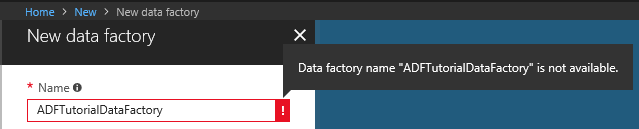
3. Select your Azure **subscription** in which you want to create the data factory. 
4. For the **Resource Group**, do one of the following steps:
     
      - Select **Use existing**, and select an existing resource group from the drop-down list. 
      - Select **Create new**, and enter the name of a resource group.   
         
      To learn about resource groups, see [Using resource groups to manage your Azure resources](../azure-resource-manager/resource-group-overview.md).  
4. Select **V2 (Preview)** for the **version**.
5. Select the **location** for the data factory. Only supported locations are displayed in the drop-down list. The data stores (Azure Storage, Azure SQL Database, etc.) and computes (HDInsight, etc.) used by data factory can be in other locations/regions.
6. Select **Pin to dashboard**.     
7. Click **Create**.
8. On the dashboard, you see the following tile with status: **Deploying data factory**. 

	
9. After the creation is complete, you see the **Data Factory** page as shown in the image.
   
   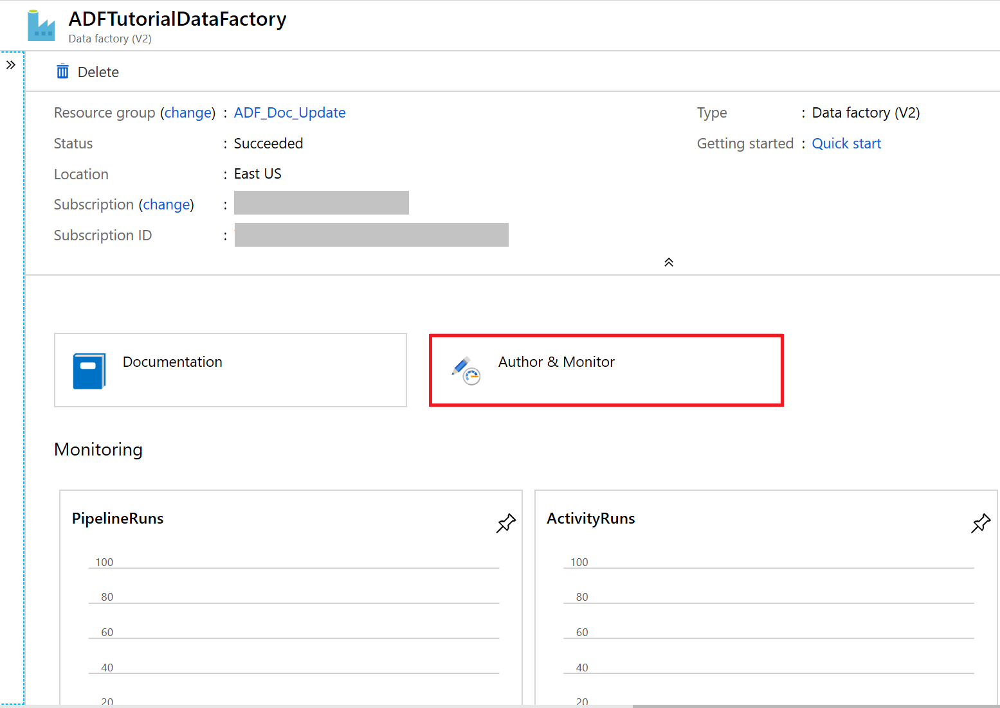
10. Click **Author & Monitor** tile to launch the Data Integration Application in a separate tab. 

## Use Copy Data tool to create a pipeline

1. In the get started page, click **Copy Data** tile to launch the Copy Data tool. 

   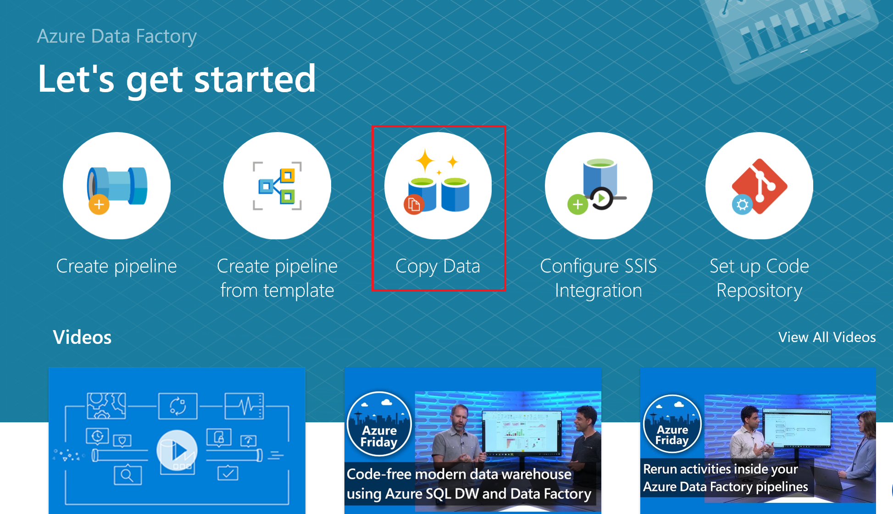
2. In the **Properties** page of the Copy Data tool, specify **CopyFromOnPremSqlToAzureBlobPipeline** for the **Task name**, and click **Next**. The Copy Data tool creates a pipeline with the name you specify for this field. 
    
   
3. In the **Source data store** page, select **SQL Server**, and click **Next**. You may need to scroll down to see **SQL Server** in the list. 

   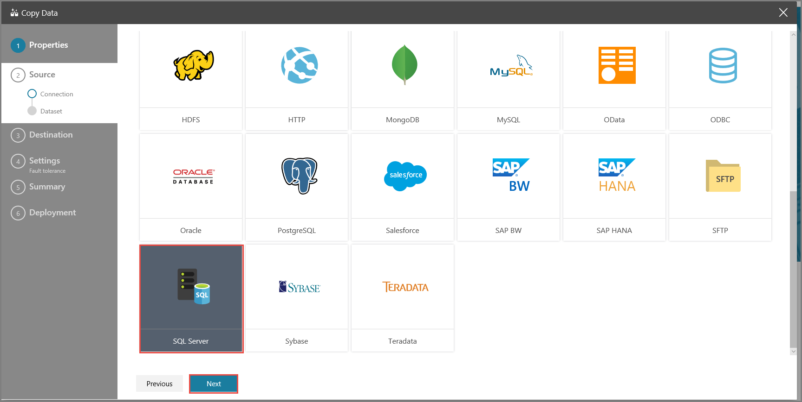
4. Enter **SqlServerLinkedService** for **Connection name**, and click **Create Integration Runtime** link. You must create a self-hosted integration runtime, download it to your machine, and register it with the Data Factory service. The self-hosted integration runtime copies data between your on-premises environment and Azure cloud.

   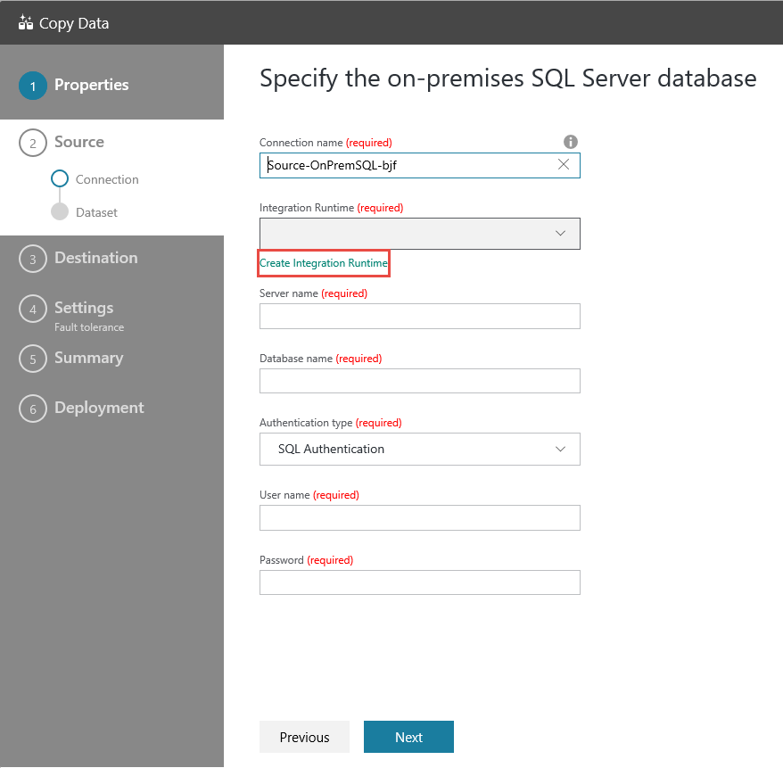
5. In the **Create Integration Runtime** dialog, enter **TutorialIntegration Runtime** for the **Name** field, and click **Create**. 

   
6. Click **Launch express setup on this computer**. This action installs the integration runtime on your machine and registers it with the Data Factory service. Alternatively, you can use the manual setup option to download the installation file, run it, and use the key to register the integration runtime. 

    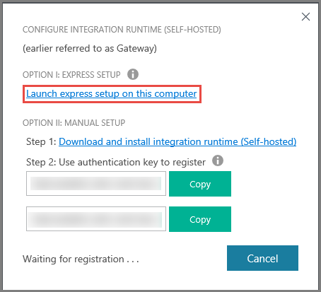
7. Run the downloaded application. You see the **status** of the express setup in the window. 

    
8. Confirm that the **TutorialIntegrationRuntime** is selected for the **Integration Runtime** field.

    
9. In the **Specify the on-premises SQL Server database**, do the following steps: 

    1. Enter **OnPremSqlLinkedService** for **Connection name**.
    2. Enter the name of your on-premises SQL Server for **Server name**.
    3. Enter the name of your on-premises database for **Database name**. 
    4. Select appropriate authentication for **Authentication type**.
    5. Enter the name of user with access to on-premises SQL Server for **User name**.
    6. Enter the **password** of the user. 
10. In the **Select tables from which to copy the data or use a custom query** page, select **[dbo].[emp]** table in the list, and click **Next**. 

    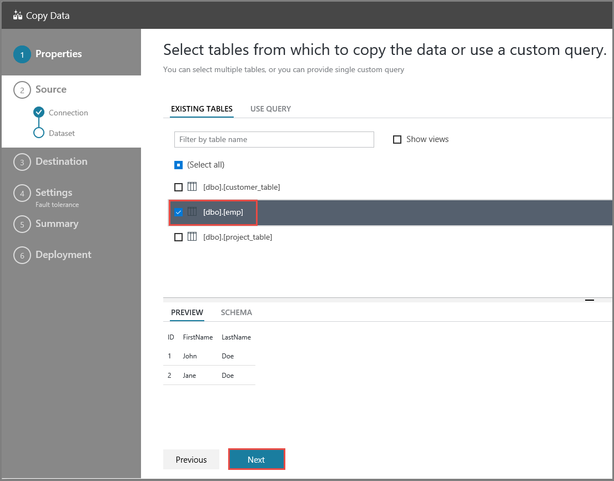
11. In the **Destination data store** page, select **Azure Blob Storage**, and click **Next**.

    
12. In the **Specify the Azure Blob storage account** page, do the following steps: 

    1. Enter **AzureStorageLinkedService** for **Connection name**.
    2. Select your Azure storage account from the drop-down list for **Storage account name**. 
    3. Click **Next**.

        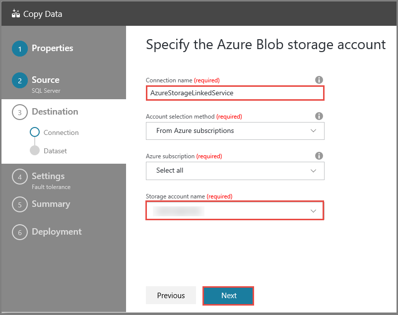
13. In the **Choose the output file or folder** page, do the following steps: 
    
    1. Enter **adftutorial/fromonprem** for **Folder path**. You created the **adftutorial** container as part of the prerequisites. If the output folder does not exist, the Data Factory service automatically creates it. You can also use the **Browse** button to navigate the blob storage and its containers/folders. Notice that the name of the output file is set to **dbo.emp** by default.
        
        
14. In the **File format settings** page, click **Next**. 

    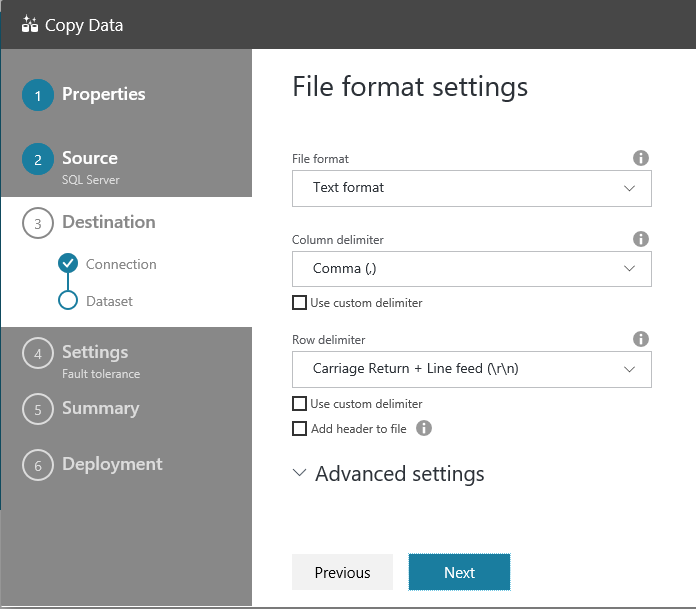
15. In the **Settings** page, click **Next**. 

    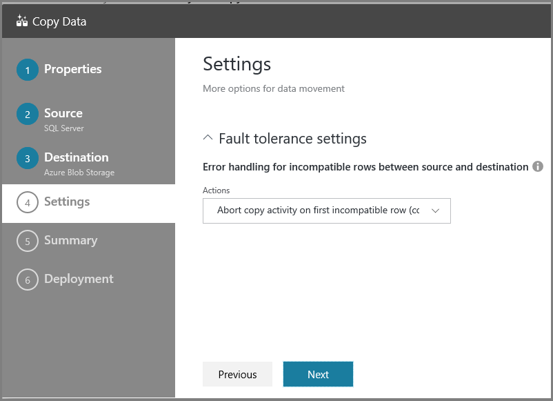
16. In the **Summary** page, review values for all the settings, and click **Next**. 

    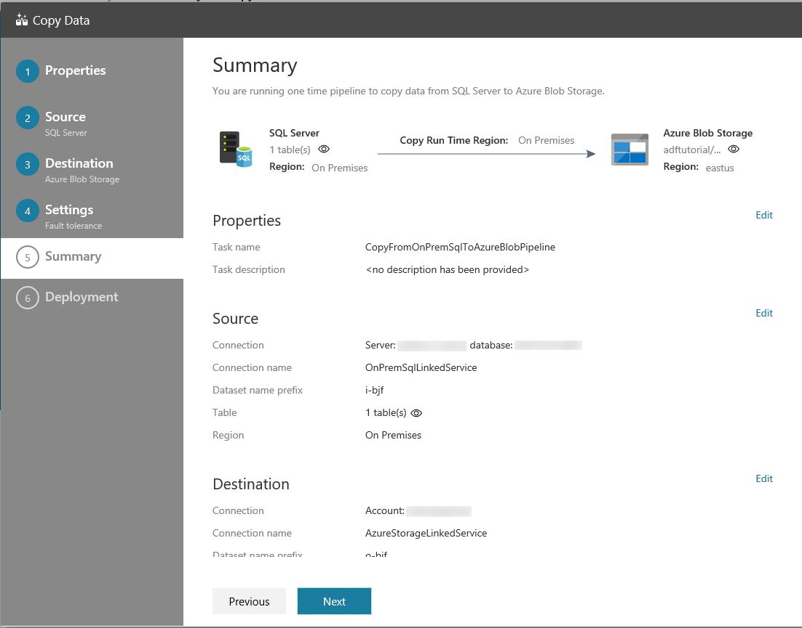
17. In the **Deployment** page, click **Monitor** to monitor the pipeline or task you created.

    
18. In the **Monitor** tab, you can view the status of the pipeline you created. The links in the **Action** column allow you to view activity runs associated with the pipeline run and to rerun the pipeline. 

    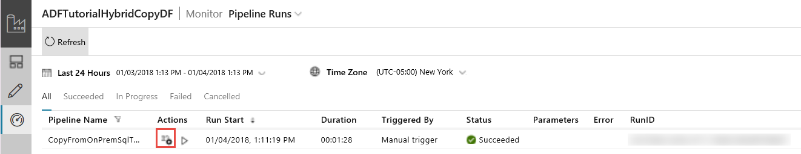
19. Click the **View Activity Runs** link in the **Actions** column to see activity runs associated with the pipeline run. You can switch back to pipeline runs view by clicking **Pipelines** at the top.

    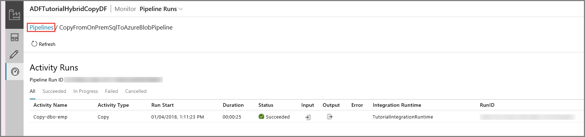
20. Confirm that you see the output file in the **fromonprem** folder of the **adftutorial** container.   
 
    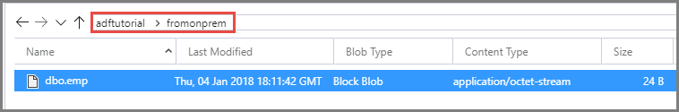
21. Click the **Edit** tab on the left to switch to the editor mode. You can update the linked services, datasets, and pipelines created by the tool using the editor. Click **Code** to view the JSON code associated with the entity opened in the editor. For details on editing these entities in the Data Factory UI, see [the Azure portal version of this tutorial](tutorial-copy-data-portal.md).

    


## Next steps
The pipeline in this sample copies data from an on-premises SQL Server database to an Azure blob storage. You learned how to: 

> [!div class="checklist"]
> * Create a data factory.
> * Use Copy Data tool to create a pipeline
> * Monitor the pipeline and activity runs.

For a list of data stores that are supported by Data Factory, see [supported data stores](copy-activity-overview.md#supported-data-stores-and-formats).

To learn about copying data in bulk from a source to a destination, advance to the following tutorial:

> [!div class="nextstepaction"]
>[Copy data in bulk](tutorial-bulk-copy.md)