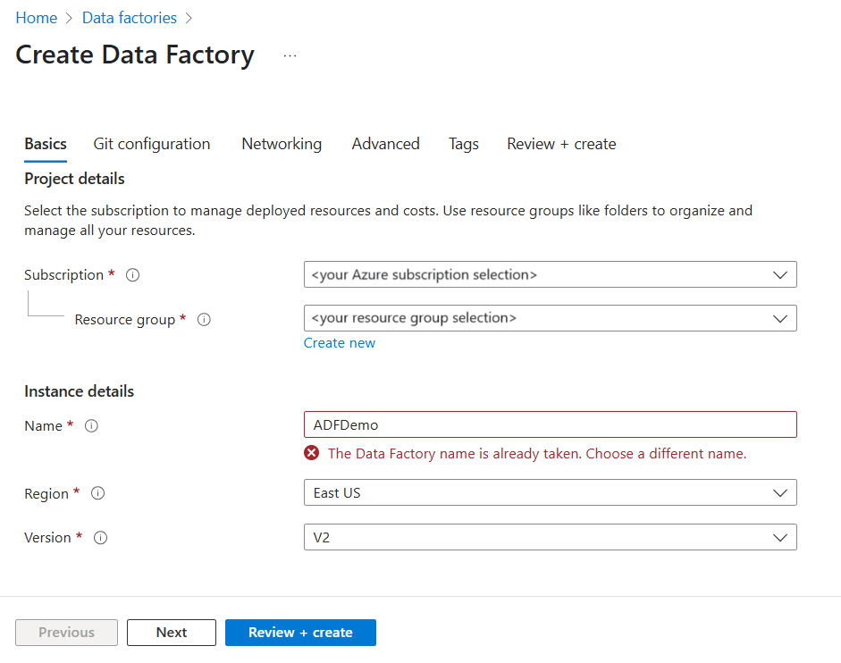

# Copy data from an on-premises SQL Server database to Azure Blob storage by using the Copy Data tool
> [!div class="op_single_selector" title1="Select the version of Data Factory service you are using:"]
> * [Version 1](v1/data-factory-copy-data-from-azure-blob-storage-to-sql-database.md)
> * [Current version](tutorial-hybrid-copy-data-tool.md)

In this tutorial, you use the Azure portal to create a data factory. Then, you use the Copy Data tool to create a pipeline that copies data from an on-premises SQL Server database to Azure Blob storage.

> [!NOTE]
> - If you're new to Azure Data Factory, see [Introduction to Data Factory](introduction.md).

In this tutorial, you perform the following steps:

> [!div class="checklist"]
> * Create a data factory.
> * Use the Copy Data tool to create a pipeline.
> * Monitor the pipeline and activity runs.

## Prerequisites
### Azure subscription
Before you begin, if you don't already have an Azure subscription, [create a free account](https://azure.microsoft.com/free/).

### Azure roles
To create data factory instances, the user account you use to log in to Azure must be assigned a *Contributor* or *Owner* role or must be an *administrator* of the Azure subscription.

To view the permissions you have in the subscription, go to the Azure portal. Select your user name in the upper-right corner, and then select **Permissions**. If you have access to multiple subscriptions, select the appropriate subscription. For sample instructions on how to add a user to a role, see [Manage access using RBAC and the Azure portal](../role-based-access-control/role-assignments-portal.md).

### SQL Server 2014, 2016, and 2017
In this tutorial, you use an on-premises SQL Server database as a *source* data store. The pipeline in the data factory you create in this tutorial copies data from this on-premises SQL Server database (source) to Blob storage (sink). You then create a table named **emp** in your SQL Server database and insert a couple of sample entries into the table.

1. Start SQL Server Management Studio. If it's not already installed on your machine, go to [Download SQL Server Management Studio](https://docs.microsoft.com/sql/ssms/download-sql-server-management-studio-ssms).

1. Connect to your SQL Server instance by using your credentials.

1. Create a sample database. In the tree view, right-click **Databases**, and then select **New Database**.

1. In the **New Database** window, enter a name for the database, and then select **OK**.

1. To create the **emp** table and insert some sample data into it, run the following query script against the database. In the tree view, right-click the database that you created, and then select **New Query**.

    ```sql
    CREATE TABLE dbo.emp
    (
        ID int IDENTITY(1,1) NOT NULL,
        FirstName varchar(50),
        LastName varchar(50)
    )
    GO

    INSERT INTO emp (FirstName, LastName) VALUES ('John', 'Doe')
    INSERT INTO emp (FirstName, LastName) VALUES ('Jane', 'Doe')
    GO
    ```

### Azure storage account
In this tutorial, you use a general-purpose Azure storage account (specifically, Blob storage) as a destination/sink data store. If you don't have a general-purpose storage account, see [Create a storage account](../storage/common/storage-account-create.md) for instructions to create one. The pipeline in the data factory you that create in this tutorial copies data from the on-premises SQL Server database (source) to this Blob storage (sink). 

#### Get the storage account name and account key
You use the name and key of your storage account in this tutorial. To get the name and key of your storage account, take the following steps:

1. Sign in to the [Azure portal](https://portal.azure.com) with your Azure user name and password.

1. In the left pane, select **All services**. Filter by using the **Storage** keyword, and then select **Storage accounts**.

    

1. In the list of storage accounts, filter for your storage account, if needed. Then select your storage account.

1. In the **Storage account** window, select **Access keys**.


1. In the **Storage account name** and **key1** boxes, copy the values, and then paste them into Notepad or another editor for later use in the tutorial.

#### Create the adftutorial container
In this section, you create a blob container named **adftutorial** in your Blob storage.

1. In the **Storage account** window, switch to **Overview**, and then select **Blobs**.

1. In the **Blobs** window, select **+ Container**.

1. In the **New container** window, under **Name**, enter **adftutorial**, and then select **OK**.

1. In the list of containers, select **adftutorial**.


1. Keep the **Container** window for **adftutorial** open. You use it to verify the output at the end of the tutorial. Data Factory automatically creates the output folder in this container, so you don't need to create one.


## Create a data factory

1. On the menu on the left, select **+ Create a resource** > **Analytics** > **Data Factory**.

   

1. On the **New data factory** page, under **Name**, enter **ADFTutorialDataFactory**.

   The name of the data factory must be *globally unique*. If you see the following error message for the name field, change the name of the data factory (for example, yournameADFTutorialDataFactory). For naming rules for Data Factory artifacts, see [Data Factory naming rules](naming-rules.md).

   
1. Select the Azure **subscription** in which you want to create the data factory.
1. For **Resource Group**, take one of the following steps:

   - Select **Use existing**, and select an existing resource group from the drop-down list.

   - Select **Create new**, and enter the name of a resource group. 
        
     To learn about resource groups, see [Use resource groups to manage your Azure resources](../azure-resource-manager/management/overview.md).
1. Under **Version**, select **V2**.
1. Under **Location**, select the location for the data factory. Only locations that are supported are displayed in the drop-down list. The data stores (for example, Azure Storage and SQL Database) and computes (for example, Azure HDInsight) used by Data Factory can be in other locations/regions.
1. Select **Create**.

1. After the creation is finished, you see the **Data Factory** page as shown in the image.

     
1. Select **Author & Monitor** to launch the Data Factory user interface in a separate tab.

## Use the Copy Data tool to create a pipeline

1. On the **Let's get started** page, select **Copy Data** to launch the Copy Data tool.

   

1. On the **Properties** page of the Copy Data tool, under **Task name**, enter **CopyFromOnPremSqlToAzureBlobPipeline**. Then select **Next**. The Copy Data tool creates a pipeline with the name you specify for this field.
  

1. On the **Source data store** page, click on **Create new connection**.


1. Under **New Linked Service**, search for **SQL Server**, and then select **Continue**.

1. In the **New Linked Service (SQL Server)** dialog box, under **Name**, enter **SqlServerLinkedService**. Select **+New** under **Connect via integration runtime**. You must create a self-hosted integration runtime, download it to your machine, and register it with Data Factory. The self-hosted integration runtime copies data between your on-premises environment and the cloud.


1. In the **Integration Runtime Setup** dialog box, Select **Self-Hosted**. Then select **Next**.

   

1. In the **Integration Runtime Setup** dialog box, under **Name**, enter **TutorialIntegrationRuntime**. Then select **Next**.


1. In the **Integration Runtime Setup** dialog box, select **Click here to launch the express setup for this computer**. This action installs the integration runtime on your machine and registers it with Data Factory. Alternatively, you can use the manual setup option to download the installation file, run it, and use the key to register the integration runtime.

1. Run the downloaded application. You see the status of the express setup in the window.

    

1. In the **New Linked Service (SQL Server)** dialog box, confirm that **TutorialIntegrationRuntime** is selected for the Integration Runtime field. Then, take the following steps:

    a. Under **Name**, enter **SqlServerLinkedService**.

    b. Under **Server name**, enter the name of your on-premises SQL Server instance.

    c. Under **Database name**, enter the name of your on-premises database.

    d. Under **Authentication type**, select appropriate authentication.

    e. Under **User name**, enter the name of user with access to on-premises SQL Server.

    f. Enter the **password** for the user.

    g. Test connection and select **Finish**.

      

1. On the **Source data store** page, select **Next**.

1. On the **Select tables from which to copy the data or use a custom query** page, select the **[dbo].[emp]** table in the list, and select **Next**. You can select any other table based on your database.

1. On the **Destination data store** page, select **Create new connection**


1. In **New Linked Service**, Search and Select **Azure Blob**, and then select **Continue**.

   

1. On the **New Linked Service (Azure Blob Storage)** dialog, take the following steps:

   a. Under **Name**, enter **AzureStorageLinkedService**.

   b. Under **Connect via integration runtime**, select **TutorialIntegrationRuntime**

   c. Under **Storage account name**, select your storage account from the drop-down list.

   d. Select **Finish**.

1. In **Destination data store** dialog, make sure that **Azure Blob Storage** is selected. Then select **Next**.

1. In the **Choose the output file or folder** dialog, under **Folder path**, enter **adftutorial/fromonprem**. You created the **adftutorial** container as part of the prerequisites. If the output folder doesn't exist (in this case **fromonprem**), Data Factory automatically creates it. You can also use the **Browse** button to browse the blob storage and its containers/folders. If you do not specify any value under **File name**, by default the name from the source would be used (in this case **dbo.emp**).

   

1. On the **File format settings** dialog, select **Next**.

1. On the **Settings** dialog, select **Next**.

1. On the **Summary** dialog, review values for all the settings, and select **Next**.

1. On the **Deployment** page, select **Monitor** to monitor the pipeline or task you created.

   

1. On the **Monitor** tab, you can view the status of the pipeline you created. You can use the links in the **Action** column to view activity runs associated with the pipeline run and to rerun the pipeline.

1. Select the **View Activity Runs** link in the **Actions** column to see activity runs associated with the pipeline run. To see details about the copy operation, select the **Details** link (eyeglasses icon) in the **Actions** column. To switch back to the **Pipeline Runs** view, select **Pipeline Runs** at the top.

1. Confirm that you see the output file in the **fromonprem** folder of the **adftutorial** container.


1. Select the **Edit** tab on the left to switch to the editor mode. You can update the linked services, datasets, and pipelines created by the tool by using the editor. Select **Code** to view the JSON code associated with the entity opened in the editor. For details on how to edit these entities in the Data Factory UI, see [the Azure portal version of this tutorial](tutorial-copy-data-portal.md).

   


## Next steps
The pipeline in this sample copies data from an on-premises SQL Server database to Blob storage. You learned how to:

> [!div class="checklist"]
> * Create a data factory.
> * Use the Copy Data tool to create a pipeline.
> * Monitor the pipeline and activity runs.

For a list of data stores that are supported by Data Factory, see [Supported data stores](copy-activity-overview.md#supported-data-stores-and-formats).

To learn about how to copy data in bulk from a source to a destination, advance to the following tutorial:

> [!div class="nextstepaction"]
>[Copy data in bulk](tutorial-bulk-copy-portal.md)
