# Copy data from an on-premises SQL Server database to Azure Blob storage
In this tutorial, you use the Azure Data Factory user interface (UI) to create a data factory pipeline that copies data from an on-premises SQL Server database to Azure Blob storage. You create and use a self-hosted integration runtime, which moves data between on-premises and cloud data stores.

> [!NOTE]
> This article doesn't provide a detailed introduction to Data Factory. For more information, see [Introduction to Data Factory](introduction.md). 

In this tutorial, you perform the following steps:

> [!div class="checklist"]
> * Create a data factory.
> * Create a self-hosted integration runtime.
> * Create SQL Server and Azure Storage linked services. 
> * Create SQL Server and Azure Blob datasets.
> * Create a pipeline with a copy activity to move the data.
> * Start a pipeline run.
> * Monitor the pipeline run.

## Prerequisites
### Azure subscription
Before you begin, if you don't already have an Azure subscription, [create a free account](https://azure.microsoft.com/free/).

### Azure roles
To create data factory instances, the user account you use to sign in to Azure must be assigned a *Contributor* or *Owner* role or must be an *administrator* of the Azure subscription. 

To view the permissions you have in the subscription, go to the Azure portal. In the upper-right corner, select your user name, and then select **Permissions**. If you have access to multiple subscriptions, select the appropriate subscription. For sample instructions on how to add a user to a role, see [Manage access using RBAC and the Azure portal](../role-based-access-control/role-assignments-portal.md).

### SQL Server 2014, 2016, and 2017
In this tutorial, you use an on-premises SQL Server database as a *source* data store. The pipeline in the data factory you create in this tutorial copies data from this on-premises SQL Server database (source) to Blob storage (sink). You then create a table named **emp** in your SQL Server database and insert a couple of sample entries into the table. 

1. Start SQL Server Management Studio. If it's not already installed on your machine, go to [Download SQL Server Management Studio](https://docs.microsoft.com/sql/ssms/download-sql-server-management-studio-ssms). 

1. Connect to your SQL Server instance by using your credentials. 

1. Create a sample database. In the tree view, right-click **Databases**, and then select **New Database**. 
1. In the **New Database** window, enter a name for the database, and then select **OK**. 

1. To create the **emp** table and insert some sample data into it, run the following query script against the database:

   ```
    CREATE TABLE dbo.emp
    (
        ID int IDENTITY(1,1) NOT NULL,
        FirstName varchar(50),
        LastName varchar(50)
    )
    GO
    
    INSERT INTO emp (FirstName, LastName) VALUES ('John', 'Doe')
    INSERT INTO emp (FirstName, LastName) VALUES ('Jane', 'Doe')
    GO
   ```

1. In the tree view, right-click the database that you created, and then select **New Query**.

### Azure storage account
In this tutorial, you use a general-purpose Azure storage account (specifically, Blob storage) as a destination/sink data store. If you don't have a general-purpose Azure storage account, see [Create a storage account](../storage/common/storage-quickstart-create-account.md). The pipeline in the data factory that you create in this tutorial copies data from the on-premises SQL Server database (source) to Blob storage (sink). 

#### Get the storage account name and account key
You use the name and key of your storage account in this tutorial. To get the name and key of your storage account, take the following steps: 

1. Sign in to the [Azure portal](https://portal.azure.com) with your Azure user name and password. 

1. In the left pane, select **More services**. Filter by using the **Storage** keyword, and then select **Storage accounts**.

    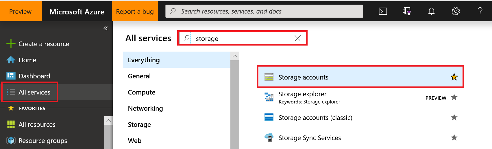

1. In the list of storage accounts, filter for your storage account, if needed. Then select your storage account. 

1. In the **Storage account** window, select **Access keys**.

    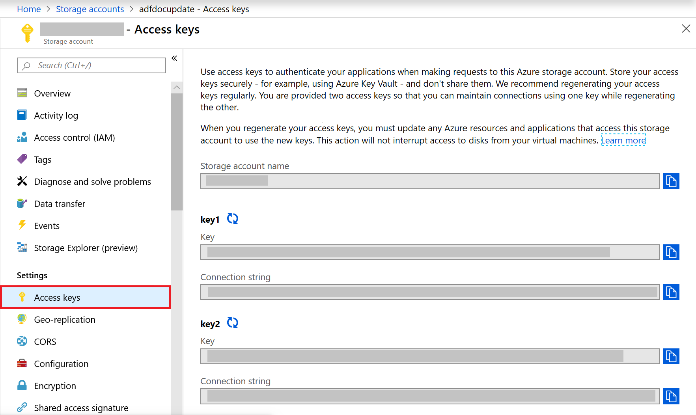

1. In the **Storage account name** and **key1** boxes, copy the values, and then paste them into Notepad or another editor for later use in the tutorial. 

#### Create the adftutorial container 
In this section, you create a blob container named **adftutorial** in your Blob storage. 

1. In the **Storage account** window, go to **Overview**, and then select **Blobs**. 

    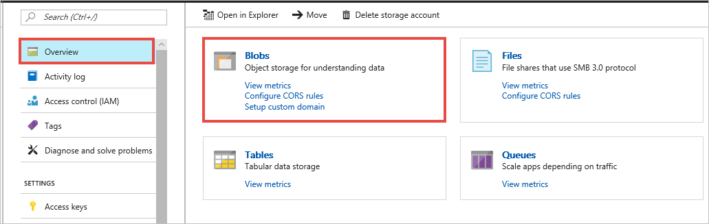

1. In the **Blob service** window, select **Container**. 

    

1. In the **New container** window, under **Name**, enter **adftutorial**. Then select **OK**. 

    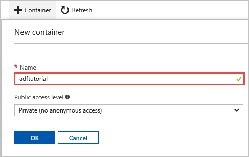

1. In the list of containers, select **adftutorial**.

    

1. Keep the **container** window for **adftutorial** open. You use it verify the output at the end of the tutorial. Data Factory automatically creates the output folder in this container, so you don't need to create one.

    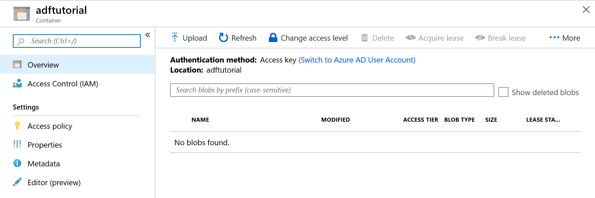


## Create a data factory
In this step, you create a data factory and start the Data Factory UI to create a pipeline in the data factory. 

1. Open the **Microsoft Edge** or **Google Chrome** web browser. Currently, Data Factory UI is supported only in Microsoft Edge and Google Chrome web browsers.
1. On the left menu, select **New** > **Data + Analytics** > **Data Factory**.
   
   
1. On the **New data factory** page, under **Name**, enter **ADFTutorialDataFactory**. 
   
     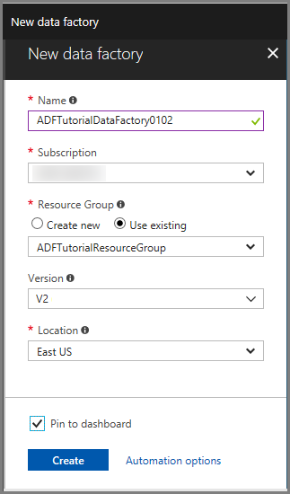

The name of the data factory must be *globally unique*. If you see the following error message for the name field, change the name of the data factory (for example, yournameADFTutorialDataFactory). For naming rules for Data Factory artifacts, see [Data Factory naming rules](naming-rules.md).

   
1. Select the Azure **subscription** in which you want to create the data factory.
1. For **Resource Group**, take one of the following steps:
   
      - Select **Use existing**, and select an existing resource group from the drop-down list.

      - Select **Create new**, and enter the name of a resource group.
        
    To learn about resource groups, see [Use resource groups to manage your Azure resources](../azure-resource-manager/resource-group-overview.md).
1. Under **Version**, select **V2**.
1. Under **Location**, select the location for the data factory. Only locations that are supported are displayed in the drop-down list. The data stores (for example, Storage and SQL Database) and computes (for example, Azure HDInsight) used by Data Factory can be in other regions.
1. Select **Pin to dashboard**. 
1. Select **Create**.
1. On the dashboard, you see the following tile with the status **Deploying Data Factory**:

	
1. After the creation is finished, you see the **Data Factory** page as shown in the image:
   
    
1. Select the **Author & Monitor** tile to launch the Data Factory UI in a separate tab. 


## Create a pipeline

1. On the **Let's get started** page, select **Create pipeline**. A pipeline is automatically created for you. You see the pipeline in the tree view, and its editor opens. 

   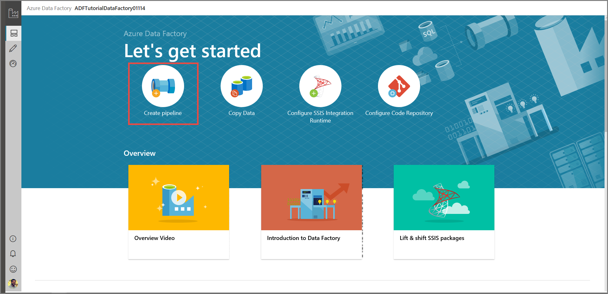

1. On the **General** tab at the bottom of the **Properties** window, in **Name**, enter **SQLServerToBlobPipeline**.

   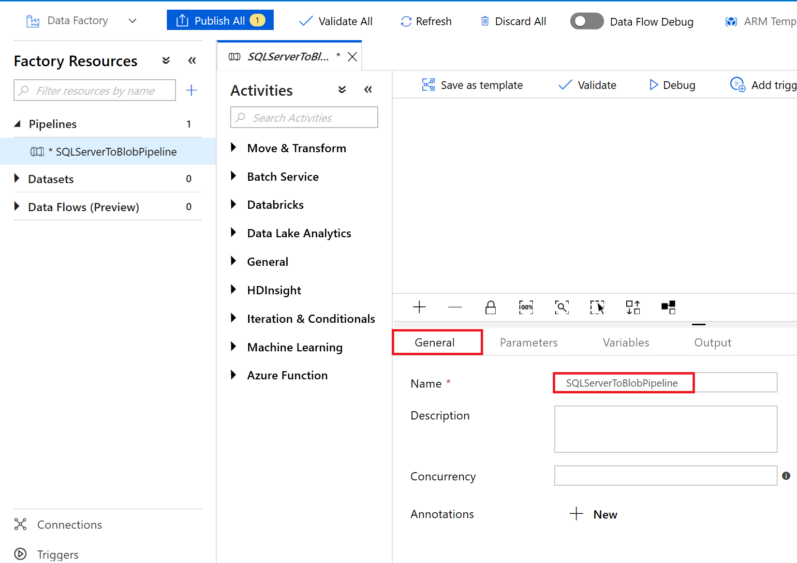

1. In the **Activities** tool box, expand **DataFlow**. Drag and drop the **Copy** activity to the pipeline design surface. Set the name of the activity to **CopySqlServerToAzureBlobActivity**.

   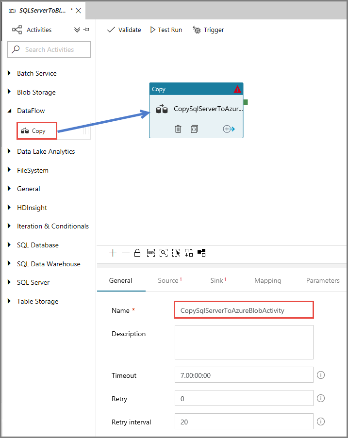

1. In the **Properties** window, go to the **Source** tab, and select **+ New**.

   

1. In the **New Dataset** window, search for **SQL Server**. Select **SQL Server**, and then select **Finish**. You see a new tab titled **SqlServerTable1**. You also see the **SqlServerTable1** dataset in the tree view on the left. 

   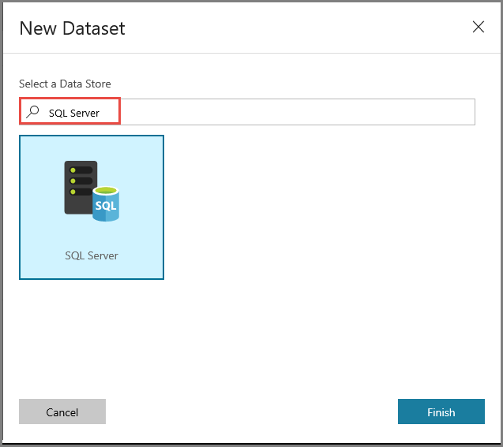

1. On the **General** tab at the bottom of the **Properties** window, in **Name**, enter **SqlServerDataset**.

   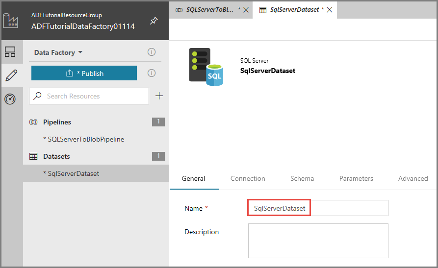

1. Go to the **Connection** tab, and select **+ New**. You create a connection to the source data store (SQL Server database) in this step. 

   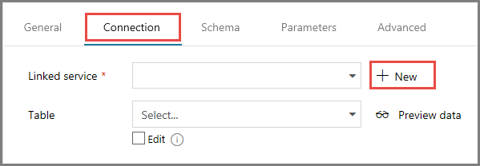

1. In the **New Linked Service** window, add **Name** as **SqlServerLinkedService**. Select **New** under **Connect via integration runtime**. In this section, you create a self-hosted integration runtime and associate it with an on-premises machine with the SQL Server database. The self-hosted integration runtime is the component that copies data from the SQL Server database on your machine to Blob storage. 

   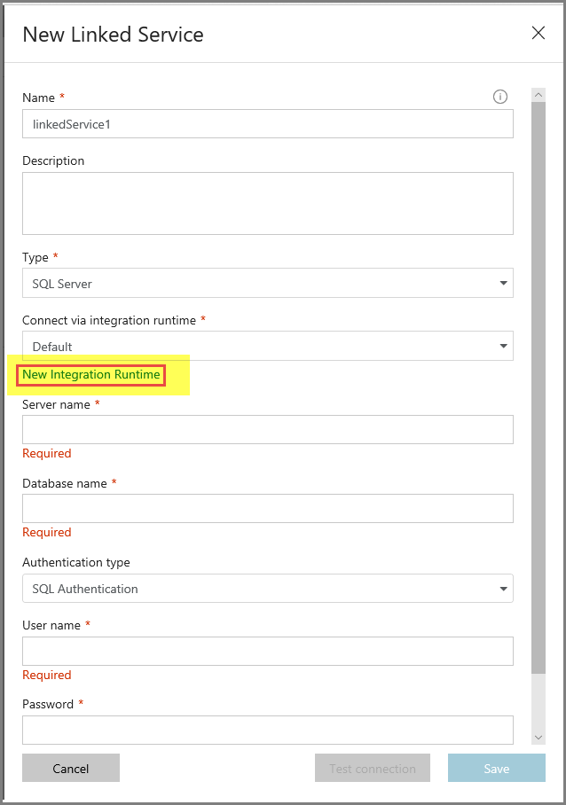

1. In the **Integration Runtime Setup** window, select **Private Network**, and then select **Next**. 

   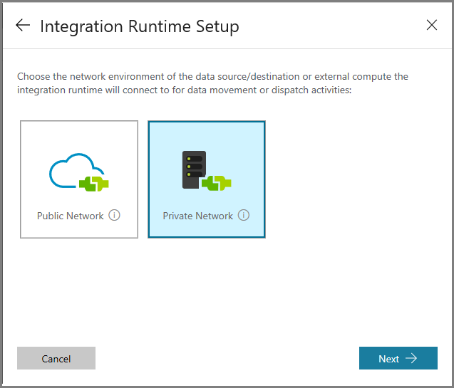

1. Enter a name for the integration runtime, and select **Next**.

    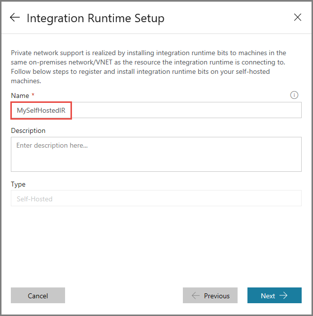

1. Under **Option 1: Express setup**, select **Click here to launch the express setup for this computer**. 

    

1. In the **Integration Runtime (Self-hosted) Express Setup** window, select **Close**. 

    

1. In the **New Linked Service** window, ensure the **Integration Runtime** created above is selected under **Connect via integration runtime**. 

    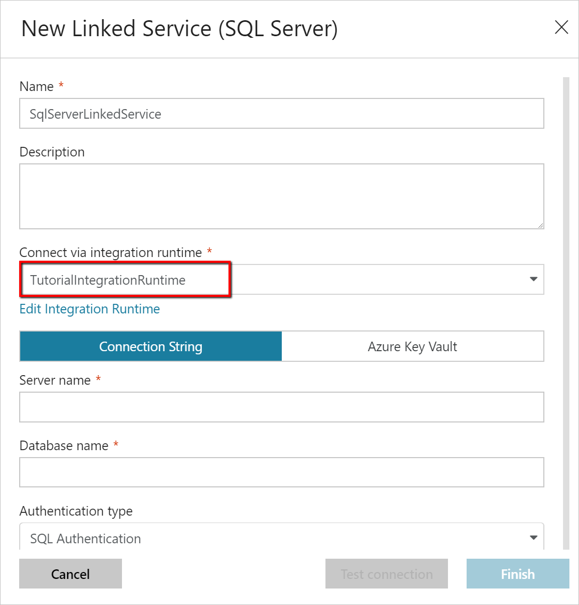

1. In the **New Linked Service** window, take the following steps:

    a. Under **Name**, enter **SqlServerLinkedService**.

    b. Under **Connect via integration runtime**, confirm that the self-hosted integration runtime you created earlier shows up.

    c. Under **Server name**, enter the name of your SQL Server instance. 

    d. Under **Database name**, enter the name of the database with the **emp** table.

    e. Under **Authentication type**, select the appropriate authentication type that Data Factory should use to connect to your SQL Server database.

    f. Under **User name** and **Password**, enter the user name and password. If you need to use a backslash (\\) in your user account or server name, precede it with the escape character (\\). For example, use *mydomain\\\\myuser*.

    g. Select **Test connection**. Do this step to confirm that Data Factory can connect to your SQL Server database by using the self-hosted integration runtime you created.

    h. To save the linked service, select **Finish**.

       

1. You should be back in the window with the source dataset opened. On the **Connection** tab of the **Properties** window, take the following steps: 

    a. In **Linked service**, confirm that you see **SqlServerLinkedService**.

    b. In **Table**, select **[dbo].[emp]**.

    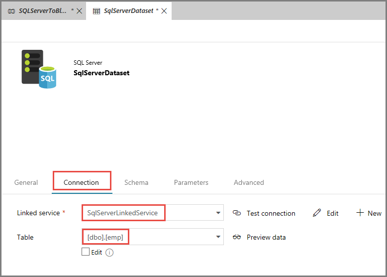

1. Go to the tab with **SQLServerToBlobPipeline**, or select **SQLServerToBlobPipeline** in the tree view. 

    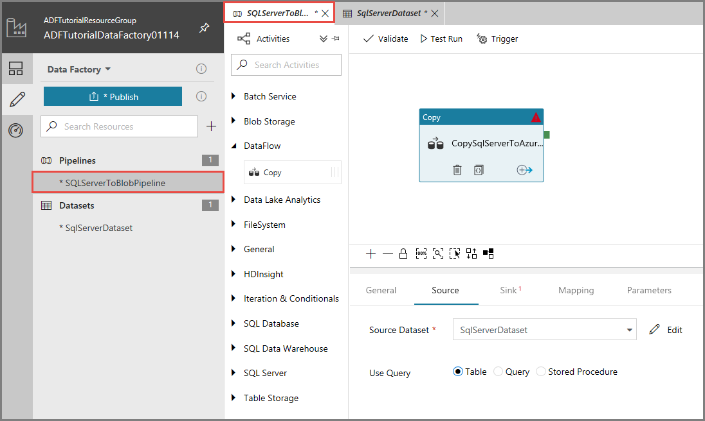

1. Go to the **Sink** tab at the bottom of the **Properties** window, and select **+ New**. 

    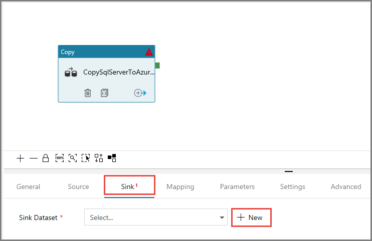

1. In the **New Dataset** window, select **Azure Blob Storage**. Then select **Finish**. You see a new tab opened for the dataset. You also see the dataset in the tree view. 

    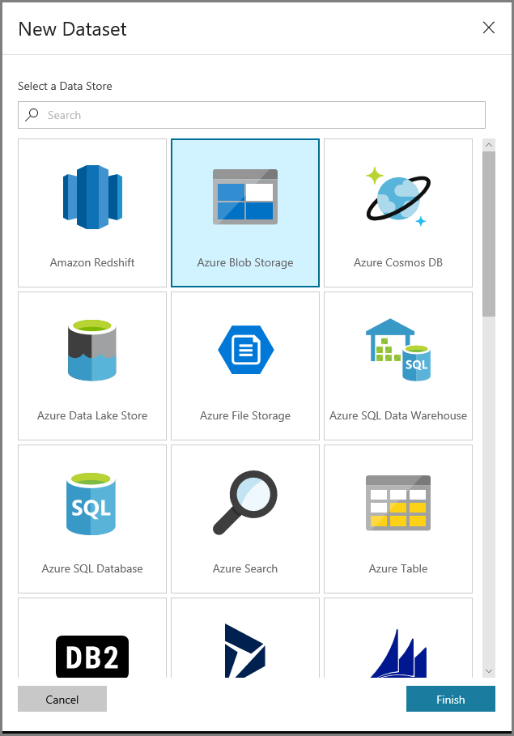

1. In **Name**, enter **AzureBlobDataset**.

    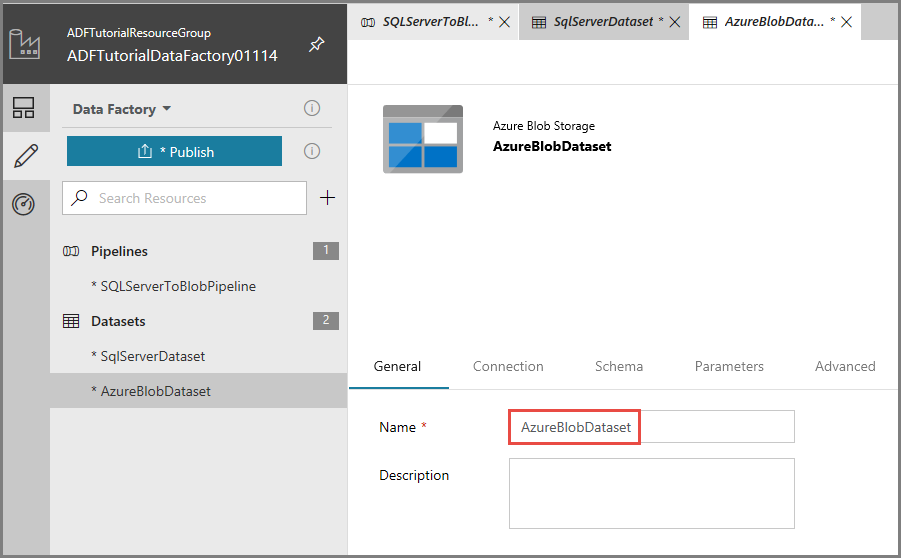

1. Go to the **Connection** tab at the bottom of the **Properties** window. Next to **Linked service**, select **+ New**. 

    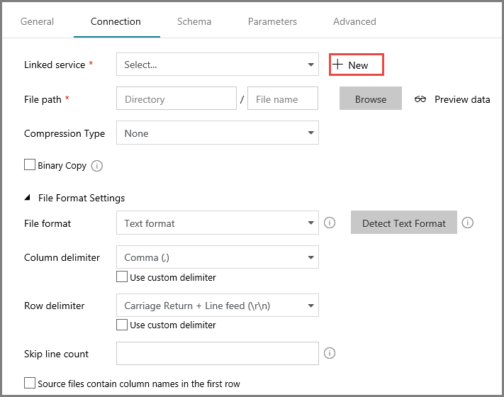

1. In the **New Linked Service** window, take the following steps:

    a. Under **Name**, enter **AzureStorageLinkedService**.

    b. Under **Storage account name**, select your storage account.

    c. To test the connection to your storage account, select **Test connection**.

    d. Select **Save**.

    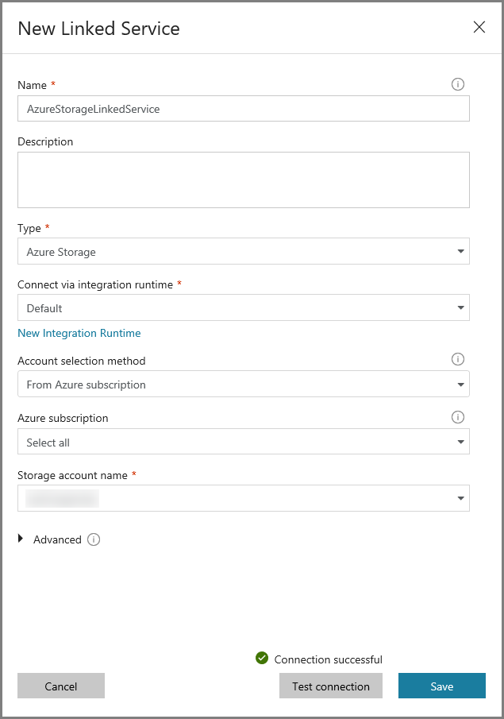 

1. You should be back in the window with the sink dataset open. On the **Connection** tab, take the following steps: 

    a. In **Linked service**, confirm that **AzureStorageLinkedService** is selected.

    b. For the **folder**/ **Directory** part of **File path**, enter **adftutorial/fromonprem**. If the output folder doesn't exist in the adftutorial container, Data Factory automatically creates the output folder.

    c. For the **file name** part of **File path**, select **Add dynamic content**.   

    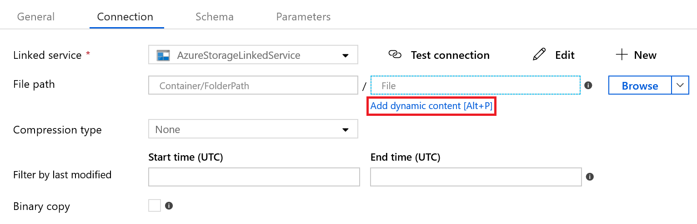

    d. Add `@CONCAT(pipeline().RunId, '.txt')`, select **Finish**. This will rename the file with PipelineRunID.txt. 

    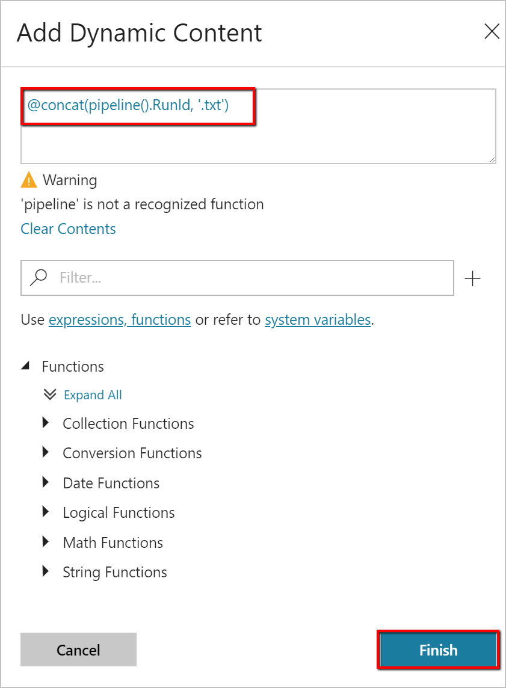

    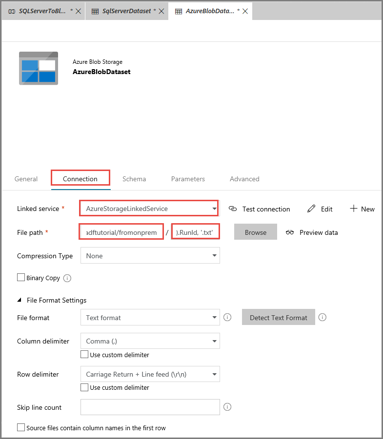

1. Go to the tab with the pipeline opened, or select the pipeline in the tree view. In **Sink Dataset**, confirm that **AzureBlobDataset** is selected. 

    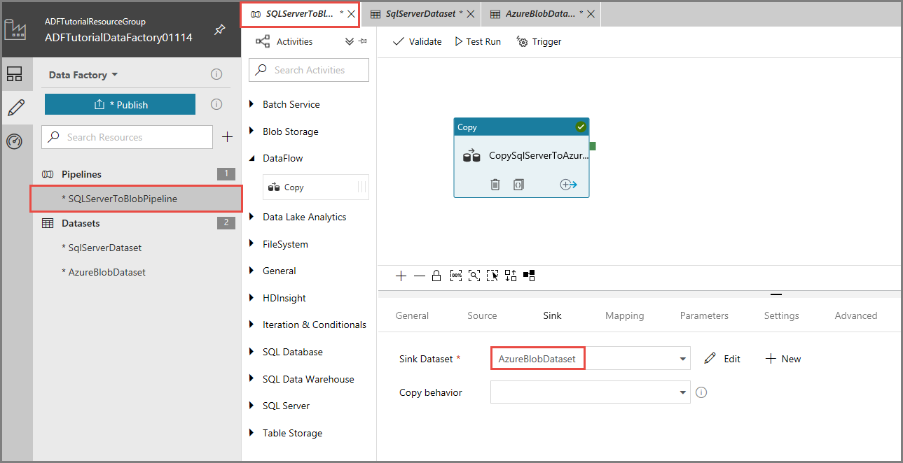

1. To validate the pipeline settings, select **Validate** on the toolbar for the pipeline. To close the **Pipe Validation Report**, select **Close**. 

    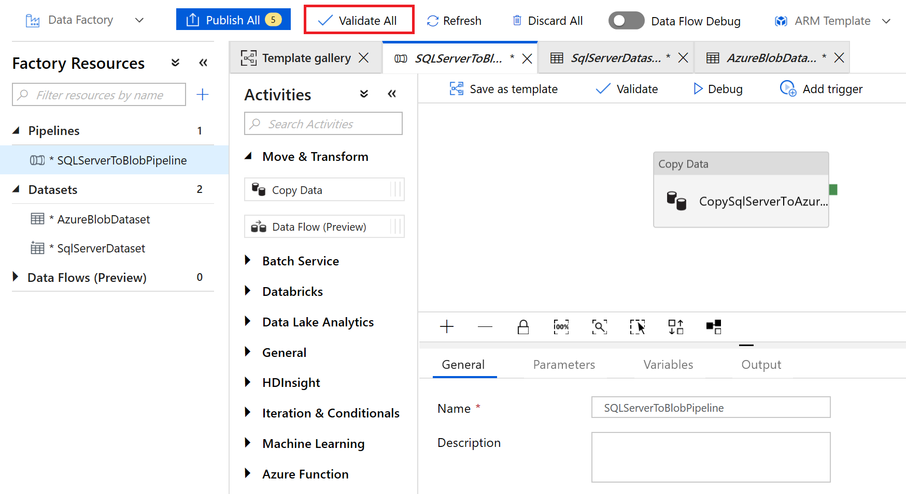

1. To publish entities you created to Data Factory, select **Publish All**.

    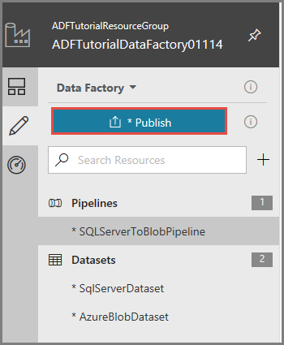

1. Wait until you see the **Publishing succeeded** pop-up. To check the status of publishing, select the **Show Notifications** link on the left. To close the notification window, select **Close**. 

    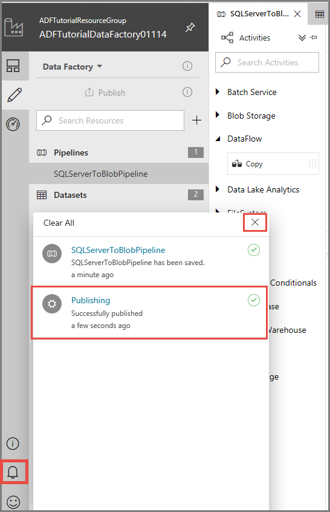


## Trigger a pipeline run
Select **Trigger** on the toolbar for the pipeline, and then select **Trigger Now**.

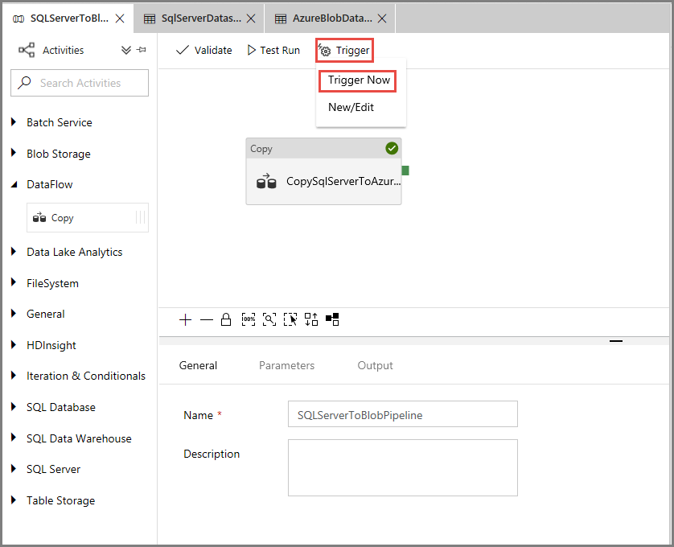

## Monitor the pipeline run

1. Go to the **Monitor** tab. You see the pipeline that you manually triggered in the previous step. 

    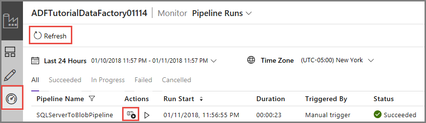
1. To view activity runs associated with the pipeline run, select the **View Activity Runs** link in the **Actions** column. You see only activity runs because there is only one activity in the pipeline. To see details about the copy operation, select the **Details** link (eyeglasses icon) in the **Actions** column. To go back to the **Pipeline Runs** view, select **Pipelines** at the top.

    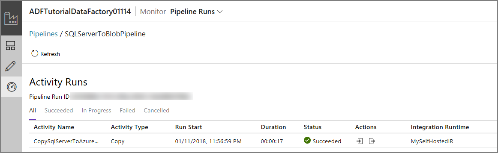

## Verify the output
The pipeline automatically creates the output folder named *fromonprem* in the `adftutorial` blob container. Confirm that you see the *[pipeline().RunId].txt* file in the output folder. 

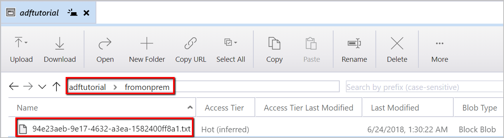


## Next steps
The pipeline in this sample copies data from one location to another in Blob storage. You learned how to:

> [!div class="checklist"]
> * Create a data factory.
> * Create a self-hosted integration runtime.
> * Create SQL Server and Storage linked services. 
> * Create SQL Server and Blob storage datasets.
> * Create a pipeline with a copy activity to move the data.
> * Start a pipeline run.
> * Monitor the pipeline run.

For a list of data stores that are supported by Data Factory, see [Supported data stores](copy-activity-overview.md#supported-data-stores-and-formats).

To learn how to copy data in bulk from a source to a destination, advance to the following tutorial:

> [!div class="nextstepaction"]
>[Copy data in bulk](tutorial-bulk-copy-portal.md)
