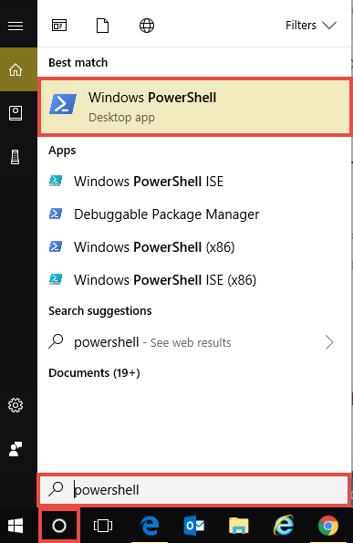
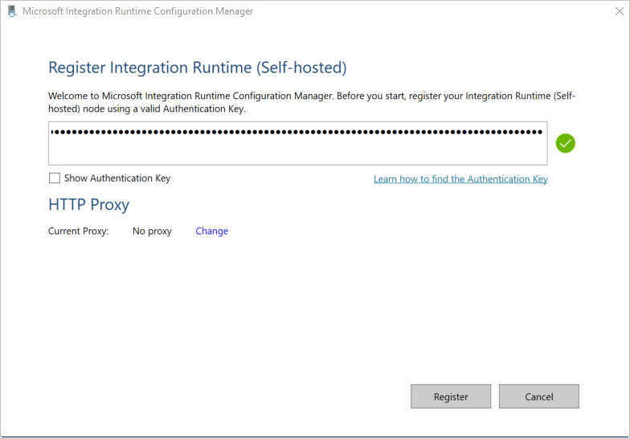
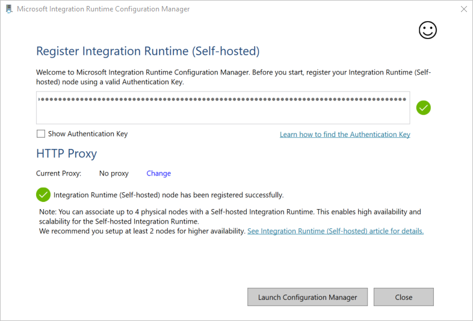
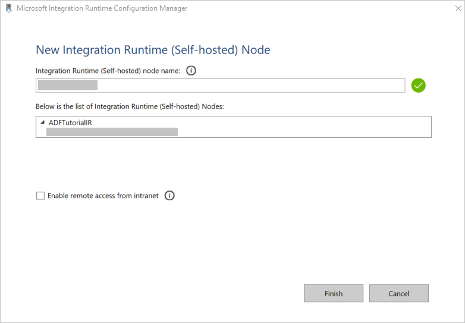
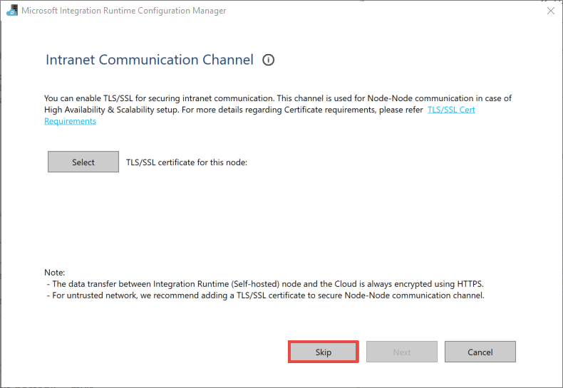
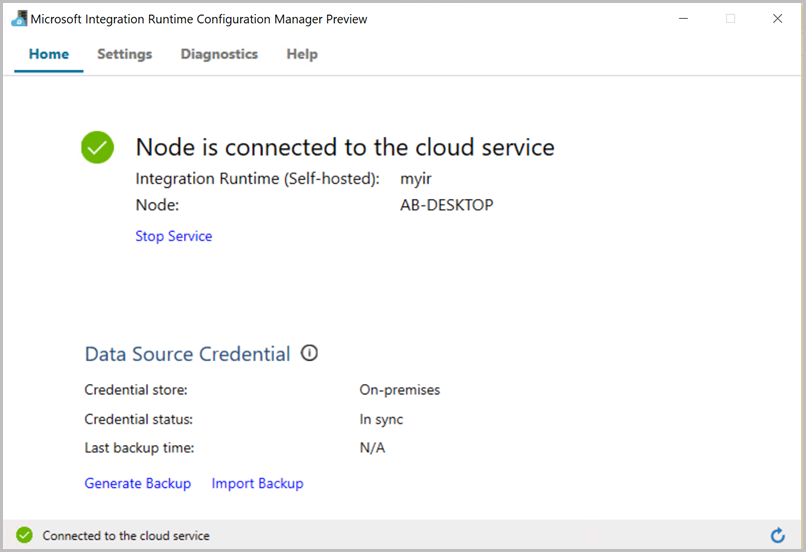
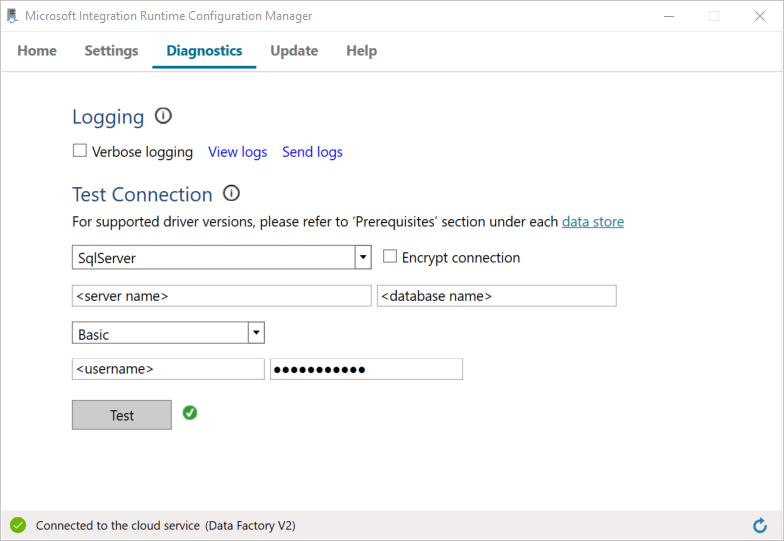
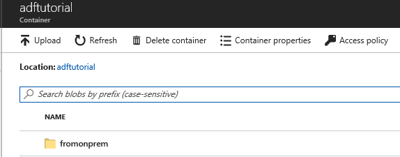
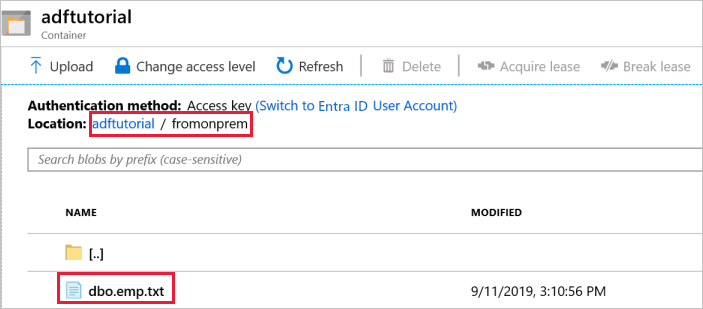

---
title: Copy data from SQL Server to Blob storage by using Azure Data Factory | Microsoft Docs
description: Learn how to copy data from an on-premises data store to the Azure cloud by using a self-hosted integration runtime in Azure Data Factory.
services: data-factory
documentationcenter: ''
author: linda33wj
manager: craigg
ms.reviewer: douglasl

ms.service: data-factory
ms.workload: data-services
ms.tgt_pltfrm: na
ms.devlang: na
ms.topic: tutorial
ms.date: 01/22/2018
ms.author: jingwang
---
# Tutorial: Copy data from an on-premises SQL Server database to Azure Blob storage
In this tutorial, you use Azure PowerShell to create a data-factory pipeline that copies data from an on-premises SQL Server database to Azure Blob storage. You create and use a self-hosted integration runtime, which moves data between on-premises and cloud data stores. 

> [!NOTE]
> This article does not provide a detailed introduction to the Data Factory service. For more information, see [Introduction to Azure Data Factory](introduction.md). 

In this tutorial, you perform the following steps:

> [!div class="checklist"]
> * Create a data factory.
> * Create a self-hosted integration runtime.
> * Create SQL Server and Azure Storage linked services. 
> * Create SQL Server and Azure Blob datasets.
> * Create a pipeline with a copy activity to move the data.
> * Start a pipeline run.
> * Monitor the pipeline run.

## Prerequisites
### Azure subscription
Before you begin, if you don't already have an Azure subscription, [create a free account](https://azure.microsoft.com/free/).

### Azure roles
To create data factory instances, the user account you use to log in to Azure must be assigned a *Contributor* or *Owner* role or must be an *administrator* of the Azure subscription. 

To view the permissions you have in the subscription, go to the Azure portal, select your username at the top-right corner, and then select **Permissions**. If you have access to multiple subscriptions, select the appropriate subscription. For sample instructions on adding a user to a role, see the [Manage access using RBAC and the Azure portal](../role-based-access-control/role-assignments-portal.md) article.

### SQL Server 2014, 2016, and 2017
In this tutorial, you use an on-premises SQL Server database as a *source* data store. The pipeline in the data factory you create in this tutorial copies data from this on-premises SQL Server database (source) to Azure Blob storage (sink). You then create a table named **emp** in your SQL Server database, and insert a couple of sample entries into the table. 

1. Start SQL Server Management Studio. If it is not already installed on your machine, go to [Download SQL Server Management Studio](https://docs.microsoft.com/sql/ssms/download-sql-server-management-studio-ssms). 

1. Connect to your SQL Server instance by using your credentials. 

1. Create a sample database. In the tree view, right-click **Databases**, and then select **New Database**. 
 
1. In the **New Database** window, enter a name for the database, and then select **OK**. 

1. To create the **emp** table and insert some sample data into it, run the following query script against the database:

   ```
       INSERT INTO emp VALUES ('John', 'Doe')
       INSERT INTO emp VALUES ('Jane', 'Doe')
       GO
   ```

1. In the tree view, right-click the database that you created, and then select **New Query**.

### Azure Storage account
In this tutorial, you use a general-purpose Azure storage account (specifically, Azure Blob storage) as a destination/sink data store. If you don't have a general-purpose Azure storage account, see [Create a storage account](../storage/common/storage-quickstart-create-account.md). The pipeline in the data factory you that create in this tutorial copies data from the on-premises SQL Server database (source) to this Azure Blob storage (sink). 

#### Get storage account name and account key
You use the name and key of your Azure storage account in this tutorial. Get the name and key of your storage account by doing the following: 

1. Sign in to the [Azure portal](https://portal.azure.com) with your Azure username and password. 

1. In the left pane, select **More services**, filter by using the **Storage** keyword, and then select **Storage accounts**.

    

1. In the list of storage accounts, filter for your storage account (if needed), and then select your storage account. 

1. In the **Storage account** window, select **Access keys**.

    

1. In the **Storage account name** and **key1** boxes, copy the values, and then paste them into Notepad or another editor for later use in the tutorial. 

#### Create the adftutorial container 
In this section, you create a blob container named **adftutorial** in your Azure Blob storage. 

1. In the **Storage account** window, switch to **Overview**, and then select **Blobs**. 

    

1. In the **Blob service** window, select **Container**. 

    

1. In the **New container** window, in the **Name** box, enter **adftutorial**, and then select **OK**. 

    

1. In the list of containers, select **adftutorial**.  

    

1. Keep the **container** window for **adftutorial** open. You use it verify the output at the end of the tutorial. Data Factory automatically creates the output folder in this container, so you don't need to create one.

    

### Windows PowerShell

#### Install Azure PowerShell
Install the latest version of Azure PowerShell if you don't already have it on your machine. 

1. Go to [Azure SDK Downloads](https://azure.microsoft.com/downloads/). 

1. Under **Command-line tools**, in the **PowerShell** section, select **Windows install**. 

1. To install Azure PowerShell, run the MSI file. 

For detailed instructions, see [How to install and configure Azure PowerShell](/powershell/azure/install-azurerm-ps). 

#### Log in to PowerShell

1. Start PowerShell on your machine, and keep it open through completion of this quickstart tutorial. If you close and reopen it, you'll need to run these commands again.

    

1. Run the following command, and then enter the Azure username and password that you use to sign in to the Azure portal:
       
    ```powershell
    Connect-AzureRmAccount
    ```        

1. If you have multiple Azure subscriptions, run the following command to select the subscription that you want to work with. Replace **SubscriptionId** with the ID of your Azure subscription:

    ```powershell
    Select-AzureRmSubscription -SubscriptionId "<SubscriptionId>"   	
    ```

## Create a data factory

1. Define a variable for the resource group name that you'll use later in PowerShell commands. Copy the following command to PowerShell, specify a name for the [Azure resource group](../azure-resource-manager/resource-group-overview.md) (enclosed in double quotation marks; for example, `"adfrg"`), and then run the command. 
   
     ```powershell
    $resourceGroupName = "ADFTutorialResourceGroup"
    ```

1. To create the Azure resource group, run the following command: 

    ```powershell
    New-AzureRmResourceGroup $resourceGroupName $location
    ``` 

    If the resource group already exists, you may not want to overwrite it. Assign a different value to the `$resourceGroupName` variable and run the command again.

1. Define a variable for the data factory name that you can use in PowerShell commands later. The name must start with a letter or a number, and it can contain only letters, numbers, and the dash (-) character.

    > [!IMPORTANT]
    >  Update the data factory name with a globally unique name. An example is ADFTutorialFactorySP1127. 

    ```powershell
    $dataFactoryName = "ADFTutorialFactory"
    ```

1. Define a variable for the location of the data factory: 

    ```powershell
    $location = "East US"
    ```  

1. To create the data factory, run the following `Set-AzureRmDataFactoryV2` cmdlet: 
    
    ```powershell       
    Set-AzureRmDataFactoryV2 -ResourceGroupName $resourceGroupName -Location $location -Name $dataFactoryName 
    ```

> [!NOTE]
> 
> * The name of the data factory must be globally unique. If you receive the following error, change the name and try again.
>    ```
>    The specified data factory name 'ADFv2TutorialDataFactory' is already in use. Data factory names must be globally unique.
>    ```
> * To create data-factory instances, the user account that you use to sign in to Azure must be assigned a *contributor* or *owner* role or must be an *administrator* of the Azure subscription.
> * For a list of Azure regions in which Data Factory is currently available, select the regions that interest you on the following page, and then expand **Analytics** to locate **Data Factory**: [Products available by region](https://azure.microsoft.com/global-infrastructure/services/). The data stores (Azure Storage, Azure SQL Database, and so on) and computes (Azure HDInsight and so on) used by the data factory can be in other regions.
> 
> 

## Create a self-hosted integration runtime

In this section, you create a self-hosted integration runtime and associate it with an on-premises machine with the SQL Server database. The self-hosted integration runtime is the component that copies data from the SQL Server database on your machine to Azure Blob storage. 

1. Create a variable for the name of integration runtime. Use a unique name, and note the name. You use it later in this tutorial. 

    ```powershell
   $integrationRuntimeName = "ADFTutorialIR"
    ```

1. Create a self-hosted integration runtime. 

    ```powershell
	Set-AzureRmDataFactoryV2IntegrationRuntime -ResourceGroupName $resourceGroupName -DataFactoryName $dataFactoryName -Name $integrationRuntimeName -Type SelfHosted -Description "selfhosted IR description"
    ```	
    Here is the sample output:

    ```json
    Id                : /subscriptions/<subscription ID>/resourceGroups/ADFTutorialResourceGroup/providers/Microsoft.DataFactory/factories/onpremdf0914/integrationruntimes/myonpremirsp0914
    Type              : SelfHosted
    ResourceGroupName : ADFTutorialResourceGroup
    DataFactoryName   : onpremdf0914
    Name              : myonpremirsp0914
    Description       : selfhosted IR description
    ```

1. To retrieve the status of the created integration runtime, run the following command:

    ```powershell
   Get-AzureRmDataFactoryV2IntegrationRuntime -name $integrationRuntimeName -ResourceGroupName $resourceGroupName -DataFactoryName $dataFactoryName -Status
    ```

    Here is the sample output:
    
    ```json
    Nodes                     : {}
    CreateTime                : 9/14/2017 10:01:21 AM
    InternalChannelEncryption :
    Version                   :
    Capabilities              : {}
    ScheduledUpdateDate       :
    UpdateDelayOffset         :
    LocalTimeZoneOffset       :
    AutoUpdate                :
    ServiceUrls               : {eu.frontend.clouddatahub.net, *.servicebus.windows.net}
    ResourceGroupName         : <ResourceGroup name>
    DataFactoryName           : <DataFactory name>
    Name                      : <Integration Runtime name>
    State                     : NeedRegistration
    ```

1. To retrieve the *authentication keys* for registering the self-hosted integration runtime with the Data Factory service in the cloud, run the following command. Copy one of the keys (excluding the quotation marks) for registering the self-hosted integration runtime that you install on your machine in the next step. 

    ```powershell
    Get-AzureRmDataFactoryV2IntegrationRuntimeKey -Name $integrationRuntimeName -DataFactoryName $dataFactoryName -ResourceGroupName $resourceGroupName | ConvertTo-Json
    ```
    
    Here is the sample output:
    
    ```json
    {
        "AuthKey1":  "IR@0000000000-0000-0000-0000-000000000000@xy0@xy@xxxxxxxxxxxxxxxxxxxxxxxxxxxxxxxxxxxxxxxx=",
        "AuthKey2":  "IR@0000000000-0000-0000-0000-000000000000@xy0@xy@yyyyyyyyyyyyyyyyyyyyyyyyyyyyyyyyyyyyyyyy="
    }
    ```

## Install the integration runtime
1. Download [Azure Data Factory Integration Runtime](https://www.microsoft.com/download/details.aspx?id=39717) on a local Windows machine, and then run the installation. 

1. In the **Welcome to Microsoft Integration Runtime Setup** wizard, select **Next**.  

1. In the **End-User License Agreement** window, accept the terms and license agreement, and select **Next**. 

1. In the **Destination Folder** window, select **Next**. 

1. In the **Ready to install Microsoft Integration Runtime** window, select **Install**. 

1. If you see a warning message about the computer being configured to enter sleep or hibernate mode when not in use, select **OK**. 

1. If a **Power Options** window is displayed, close it, and switch to the setup window. 

1. In the **Completed the Microsoft Integration Runtime Setup** wizard, select **Finish**.

1. In the **Register Integration Runtime (Self-hosted)** window, paste the key you saved in the previous section, and then select **Register**. 

    

    When the self-hosted integration runtime is registered successfully, the following message is displayed: 

    

1. In the **New Integration Runtime (Self-hosted) Node** window, select **Next**. 

    

1. In the **Intranet Communication Channel** window, select **Skip**.  
    You can select a TLS/SSL certification for securing intra-node communication in a multi-node integration runtime environment.

    

1. In the **Register Integration Runtime (Self-hosted)** window, select **Launch Configuration Manager**. 

1. When the node is connected to the cloud service, the following message is displayed:

    

1. Test the connectivity to your SQL Server database by doing the following:

       

    a. In the **Configuration Manager** window, switch to the **Diagnostics** tab.

    b. In the **Data source type** box, select **SqlServer**.

    c. Enter the server name.

    d. Enter the database name. 

    e. Select the authentication mode. 

    f. Enter the username. 

    g. Enter the password that's associated with the username.

    h. To confirm that integration runtime can connect to the SQL Server, select **Test**.  
    If the connection is successful, a green checkmark icon is displayed. Otherwise, you'll receive an error message associated with the failure. Fix any issues, and ensure that the integration runtime can connect to your SQL Server instance.

    Note all the preceding values for later use in this tutorial.
    
## Create linked services
To link your data stores and compute services to the data factory, create linked services in the data factory. In this tutorial, you link your Azure storage account and on-premises SQL Server instance to the data store. The linked services have the connection information that the Data Factory service uses at runtime to connect to them. 

### Create an Azure Storage linked service (destination/sink)
In this step, you link your Azure storage account to the data factory.

1. Create a JSON file named *AzureStorageLinkedService.json* in the *C:\ADFv2Tutorial* folder with the following code. If the *ADFv2Tutorial* folder does not already exist, create it.  

    > [!IMPORTANT]
    > Before you save the file, replace \<accountName> and \<accountKey> with the name and key of your Azure storage account. You noted them in the [Prerequisites](#get-storage-account-name-and-account-key) section.

   ```json
	{
		"properties": {
			"type": "AzureStorage",
			"typeProperties": {
				"connectionString": {
					"type": "SecureString",
					"value": "DefaultEndpointsProtocol=https;AccountName=<accountname>;AccountKey=<accountkey>;EndpointSuffix=core.windows.net"
				}
			}
		},
		"name": "AzureStorageLinkedService"
	}
   ```

1. In PowerShell, switch to the *C:\ADFv2Tutorial* folder.

1. To create the linked service, AzureStorageLinkedService, run the following `Set-AzureRmDataFactoryV2LinkedService` cmdlet: 

   ```powershell
   Set-AzureRmDataFactoryV2LinkedService -DataFactoryName $dataFactoryName -ResourceGroupName $ResourceGroupName -Name "AzureStorageLinkedService" -File ".\AzureStorageLinkedService.json"
   ```

   Here is a sample output:

    ```json
    LinkedServiceName : AzureStorageLinkedService
    ResourceGroupName : ADFTutorialResourceGroup
    DataFactoryName   : onpremdf0914
    Properties        : Microsoft.Azure.Management.DataFactory.Models.AzureStorageLinkedService
    ```

    If you receive a "file not found" error, confirm that the file exists by running the `dir` command. If the file name has a *.txt* extension (for example, AzureStorageLinkedService.json.txt), remove it, and then run the PowerShell command again. 

### Create and encrypt a SQL Server linked service (source)
In this step, you link your on-premises SQL Server instance to the data factory.

1. Create a JSON file named *SqlServerLinkedService.json* in the *C:\ADFv2Tutorial* folder by using the following code:

    > [!IMPORTANT]
    > Select the section that's based on the authentication that you use to connect to SQL Server.

    **Using SQL authentication (sa):**

	```json
	{
		"properties": {
			"type": "SqlServer",
			"typeProperties": {
				"connectionString": {
					"type": "SecureString",
					"value": "Server=<servername>;Database=<databasename>;User ID=<username>;Password=<password>;Timeout=60"
				}
			},
			"connectVia": {
				"type": "integrationRuntimeReference",
				"referenceName": "<integration runtime name>"
			}
		},
		"name": "SqlServerLinkedService"
	}
   ```    

    **Using Windows authentication:**

    ```json
    {
        "properties": {
            "type": "SqlServer",
            "typeProperties": {
                "connectionString": {
                    "type": "SecureString",
                    "value": "Server=<server>;Database=<database>;Integrated Security=True"
                },
                "userName": "<user> or <domain>\\<user>",
                "password": {
                    "type": "SecureString",
                    "value": "<password>"
                }
            },
            "connectVia": {
                "type": "integrationRuntimeReference",
                "referenceName": "<integration runtime name>"
            }
        },
        "name": "SqlServerLinkedService"
    }    
    ```

    > [!IMPORTANT]
    > - Select the section that's based on the authentication you use to connect to your SQL Server instance.
    > - Replace  **\<integration runtime name>** with the name of your integration runtime.
    > - Before you save the file, replace **\<servername>**, **\<databasename>**, **\<username>**, and **\<password>** with the values of your SQL Server instance.
    > - If you need to use a backslash (\\) in your user account or server name, precede it with the escape character (\\). For example, use *mydomain\\\\myuser*. 

1. To encrypt the sensitive data (username, password, and so on), run the `New-AzureRmDataFactoryV2LinkedServiceEncryptedCredential` cmdlet.  
    This encryption ensures that the credentials are encrypted using Data Protection Application Programming Interface (DPAPI). The encrypted credentials are stored locally on the self-hosted integration runtime node (local machine). The output payload can be redirected to another JSON file (in this case, *encryptedLinkedService.json*) that contains encrypted credentials.
    
   ```powershell
   New-AzureRmDataFactoryV2LinkedServiceEncryptedCredential -DataFactoryName $dataFactoryName -ResourceGroupName $ResourceGroupName -IntegrationRuntimeName $integrationRuntimeName -File ".\SQLServerLinkedService.json" > encryptedSQLServerLinkedService.json
   ```

1. Run the following command, which creates EncryptedSqlServerLinkedService:

   ```powershell
   Set-AzureRmDataFactoryV2LinkedService -DataFactoryName $dataFactoryName -ResourceGroupName $ResourceGroupName -Name "EncryptedSqlServerLinkedService" -File ".\encryptedSqlServerLinkedService.json"
   ```


## Create datasets
In this step, you create input and output datasets. They represent input and output data for the copy operation, which copies data from the on-premises SQL Server database to Azure Blob storage.

### Create a dataset for the source SQL Server database
In this step, you define a dataset that represents data in the SQL Server database instance. The dataset is of type SqlServerTable. It refers to the SQL Server linked service that you created in the preceding step. The linked service has the connection information that the Data Factory service uses to connect to your SQL Server instance at runtime. This dataset specifies the SQL table in the database that contains the data. In this tutorial, the **emp** table contains the source data. 

1. Create a JSON file named *SqlServerDataset.json* in the *C:\ADFv2Tutorial* folder, with the following code:  

    ```json
    {
       "properties": {
    		"type": "SqlServerTable",
    		"typeProperties": {
    			"tableName": "dbo.emp"
    		},
    		"structure": [
    			 {
                    "name": "ID",
                    "type": "String"
                },
                {
                    "name": "FirstName",
                    "type": "String"
                },
                {
                    "name": "LastName",
                    "type": "String"
                }
    		],
    		"linkedServiceName": {
    			"referenceName": "EncryptedSqlServerLinkedService",
    			"type": "LinkedServiceReference"
    		}
    	},
    	"name": "SqlServerDataset"
    }
    ```

1. To create the dataset SqlServerDataset, run the `Set-AzureRmDataFactoryV2Dataset` cmdlet.

    ```powershell
    Set-AzureRmDataFactoryV2Dataset -DataFactoryName $dataFactoryName -ResourceGroupName $resourceGroupName -Name "SqlServerDataset" -File ".\SqlServerDataset.json"
    ```

    Here is the sample output:

    ```json
    DatasetName       : SqlServerDataset
    ResourceGroupName : ADFTutorialResourceGroup
    DataFactoryName   : onpremdf0914
    Structure         : {"name": "ID" "type": "String", "name": "FirstName" "type": "String", "name": "LastName" "type": "String"}
    Properties        : Microsoft.Azure.Management.DataFactory.Models.SqlServerTableDataset
    ```

### Create a dataset for Azure Blob storage (sink)
In this step, you define a dataset that represents data that will be copied to Azure Blob storage. The dataset is of the type AzureBlob. It refers to the Azure Storage linked service that you created earlier in this tutorial. 

The linked service has the connection information that the data factory uses at runtime to connect to your Azure storage account. This dataset specifies the folder in the Azure storage to which the data is copied from the SQL Server database. In this tutorial, the folder is *adftutorial/fromonprem*, where `adftutorial` is the blob container and `fromonprem` is the folder. 

1. Create a JSON file named *AzureBlobDataset.json* in the *C:\ADFv2Tutorial* folder, with the following code:

    ```json
    {
        "properties": {
    		"type": "AzureBlob",
    		"typeProperties": {
    			"folderPath": "adftutorial/fromonprem",
    			"format": {
    				"type": "TextFormat"
    			}
    		},
    		"linkedServiceName": {
    			"referenceName": "AzureStorageLinkedService",
    			"type": "LinkedServiceReference"
    		}
    	},
    	"name": "AzureBlobDataset"
    }
    ```

1. To create the dataset AzureBlobDataset, run the `Set-AzureRmDataFactoryV2Dataset` cmdlet.

    ```powershell
    Set-AzureRmDataFactoryV2Dataset -DataFactoryName $dataFactoryName -ResourceGroupName $resourceGroupName -Name "AzureBlobDataset" -File ".\AzureBlobDataset.json"
    ```

    Here is the sample output:

    ```json
    DatasetName       : AzureBlobDataset
    ResourceGroupName : ADFTutorialResourceGroup
    DataFactoryName   : onpremdf0914
    Structure         :
    Properties        : Microsoft.Azure.Management.DataFactory.Models.AzureBlobDataset
    ```

## Create a pipeline
In this tutorial, you create a pipeline with a copy activity. The copy activity uses SqlServerDataset as the input dataset and AzureBlobDataset as the output dataset. The source type is set to *SqlSource* and the sink type is set to *BlobSink*.

1. Create a JSON file named *SqlServerToBlobPipeline.json* in the *C:\ADFv2Tutorial* folder, with the following code:

    ```json
    {
       "name": "SQLServerToBlobPipeline",
        "properties": {
            "activities": [       
    			{
    				"type": "Copy",
    				"typeProperties": {
    					"source": {
    						"type": "SqlSource"
    					},
    					"sink": {
    						"type":"BlobSink"
    					}
    				},
    				"name": "CopySqlServerToAzureBlobActivity",
    				"inputs": [
    					{
    						"referenceName": "SqlServerDataset",
    						"type": "DatasetReference"
    					}
    				],
    				"outputs": [
    					{
    						"referenceName": "AzureBlobDataset",
    						"type": "DatasetReference"
    					}
    				]
    			}
    		]
    	}
    }
    ```

1. To create the pipeline SQLServerToBlobPipeline, run the `Set-AzureRmDataFactoryV2Pipeline` cmdlet.

    ```powershell
    Set-AzureRmDataFactoryV2Pipeline -DataFactoryName $dataFactoryName -ResourceGroupName $resourceGroupName -Name "SQLServerToBlobPipeline" -File ".\SQLServerToBlobPipeline.json"
    ```

    Here is the sample output:

    ```json
    PipelineName      : SQLServerToBlobPipeline
    ResourceGroupName : ADFTutorialResourceGroup
    DataFactoryName   : onpremdf0914
    Activities        : {CopySqlServerToAzureBlobActivity}
    Parameters        :  
    ```

## Create a pipeline run
Start a pipeline run for the SQLServerToBlobPipeline pipeline, and capture the pipeline run ID for future monitoring.

```powershell
$runId = Invoke-AzureRmDataFactoryV2Pipeline -DataFactoryName $dataFactoryName -ResourceGroupName $resourceGroupName -PipelineName 'SQLServerToBlobPipeline'
```

## Monitor the pipeline run

1. To continuously check the run status of pipeline SQLServerToBlobPipeline, run the following script in PowerShell, and print the final result:

    ```powershell
    while ($True) {
        $result = Get-AzureRmDataFactoryV2ActivityRun -DataFactoryName $dataFactoryName -ResourceGroupName $resourceGroupName -PipelineRunId $runId -RunStartedAfter (Get-Date).AddMinutes(-30) -RunStartedBefore (Get-Date).AddMinutes(30)

        if (($result | Where-Object { $_.Status -eq "InProgress" } | Measure-Object).count -ne 0) {
            Write-Host "Pipeline run status: In Progress" -foregroundcolor "Yellow"
            Start-Sleep -Seconds 30
        }
        else {
            Write-Host "Pipeline 'SQLServerToBlobPipeline' run finished. Result:" -foregroundcolor "Yellow"
            $result
            break
        }
    }
    ```

    Here is the output of the sample run:

    ```jdon
    ResourceGroupName : <resourceGroupName>
    DataFactoryName   : <dataFactoryName>
    ActivityName      : copy
    PipelineRunId     : 4ec8980c-62f6-466f-92fa-e69b10f33640
    PipelineName      : SQLServerToBlobPipeline
    Input             :  
    Output            :  
    LinkedServiceName :
    ActivityRunStart  : 9/13/2017 1:35:22 PM
    ActivityRunEnd    : 9/13/2017 1:35:42 PM
    DurationInMs      : 20824
    Status            : Succeeded
    Error             : {errorCode, message, failureType, target}
    ```

1. You can get the run ID of pipeline SQLServerToBlobPipeline and check the detailed activity run result by running the following command: 

    ```powershell
    Write-Host "Pipeline 'SQLServerToBlobPipeline' run result:" -foregroundcolor "Yellow"
    ($result | Where-Object {$_.ActivityName -eq "CopySqlServerToAzureBlobActivity"}).Output.ToString()
    ```

    Here is the output of the sample run:

    ```json
    {
      "dataRead": 36,
      "dataWritten": 24,
      "rowsCopied": 2,
      "copyDuration": 3,
      "throughput": 0.01171875,
      "errors": [],
      "effectiveIntegrationRuntime": "MyIntegrationRuntime",
      "billedDuration": 3
    }
    ```

## Verify the output
The pipeline automatically creates the output folder named *fromonprem* in the `adftutorial` blob container. Confirm that you see the *dbo.emp.txt* file in the output folder. 

1. In the Azure portal, in the **adftutorial** container window, select **Refresh** to see the output folder.

    
1. Select `fromonprem` in the list of folders. 
1. Confirm that you see a file named `dbo.emp.txt`.

    


## Next steps
The pipeline in this sample copies data from one location to another in Azure Blob storage. You learned how to:

> [!div class="checklist"]
> * Create a data factory.
> * Create a self-hosted integration runtime.
> * Create SQL Server and Azure Storage linked services. 
> * Create SQL Server and Azure Blob datasets.
> * Create a pipeline with a copy activity to move the data.
> * Start a pipeline run.
> * Monitor the pipeline run.

For a list of data stores that are supported by Data Factory, see [supported data stores](copy-activity-overview.md#supported-data-stores-and-formats).

To learn about copying data in bulk from a source to a destination, advance to the following tutorial:

> [!div class="nextstepaction"]
>[Copy data in bulk](tutorial-bulk-copy.md)
