# Incrementally load data from Azure SQL Managed Instance to Azure Storage using change data capture (CDC)

[!INCLUDE[appliesto-adf-asa-md](includes/appliesto-adf-asa-md.md)]

In this tutorial, you create an Azure data factory with a pipeline that loads delta data based on **change data capture (CDC)** information in the source Azure SQL Managed Instance database to an Azure blob storage.  

You perform the following steps in this tutorial:

> [!div class="checklist"]
> * Prepare the source data store
> * Create a data factory.
> * Create linked services.
> * Create source and sink datasets.
> * Create, debug and run the pipeline to check for changed data
> * Modify data in the source table
> * Complete, run and monitor the full incremental copy pipeline

## Overview
The Change Data Capture technology supported by data stores such as Azure SQL Managed Instances (MI) and SQL Server can be used to identify changed data.  This tutorial describes how to use Azure Data Factory with SQL Change Data Capture technology to incrementally load delta data from Azure SQL Managed Instance into Azure Blob Storage.  For more concrete information about SQL Change Data Capture technology, see [Change data capture in SQL Server](/sql/relational-databases/track-changes/about-change-data-capture-sql-server).

## End-to-end workflow
Here are the typical end-to-end workflow steps to incrementally load data using the Change Data Capture technology.

> [!NOTE]
> Both Azure SQL MI and SQL Server support the Change Data Capture technology. This tutorial uses Azure SQL Managed Instance as the source data store. You can also use an on-premises SQL Server.

## High-level solution
In this tutorial, you create a pipeline that performs the following operations:  

   1. Create a **lookup activity** to count the number of changed records in the SQL Database CDC table and pass it to an IF Condition activity.
   2. Create an **If Condition** to check whether there are changed records and if so, invoke the copy activity.
   3. Create a **copy activity** to copy the inserted/updated/deleted data between the CDC table to Azure Blob Storage.

If you don't have an Azure subscription, create a [free](https://azure.microsoft.com/free/) account before you begin.

## Prerequisites
* **Azure SQL Database Managed Instance**. You use the database as the **source** data store. If you don't have an Azure SQL Database Managed Instance, see the [Create an Azure SQL Database Managed Instance](../azure-sql/managed-instance/instance-create-quickstart.md) article for steps to create one.
* **Azure Storage account**. You use the blob storage as the **sink** data store. If you don't have an Azure storage account, see the [Create a storage account](../storage/common/storage-account-create.md) article for steps to create one. Create a container named **raw**. 

### Create a data source table in Azure SQL Database

1. Launch **SQL Server Management Studio**, and connect to your Azure SQL Managed Instances server.
2. In **Server Explorer**, right-click your **database** and choose the **New Query**.
3. Run the following SQL command against your Azure SQL Managed Instances database to create a table named `customers` as data source store.  

    ```sql
    create table customers 
    (
    customer_id int, 
    first_name varchar(50), 
    last_name varchar(50), 
    email varchar(100), 
    city varchar(50), CONSTRAINT "PK_Customers" PRIMARY KEY CLUSTERED ("customer_id") 
     );
    ```
4. Enable **Change Data Capture** mechanism on your database and the source table (customers) by running the following SQL query:

    > [!NOTE]
    > - Replace &lt;your source schema name&gt; with the schema of your Azure SQL MI that has the customers table.
    > - Change data capture doesn't do anything as part of the transactions that change the table being tracked. Instead, the insert, update, and delete operations are written to the transaction log. Data that is deposited in change tables will grow unmanageably if you do not periodically and systematically prune the data. For more information, see [Enable Change Data Capture for a database](/sql/relational-databases/track-changes/enable-and-disable-change-data-capture-sql-server#enable-change-data-capture-for-a-database)

    ```sql
    EXEC sys.sp_cdc_enable_db 
    
    EXEC sys.sp_cdc_enable_table
    @source_schema = 'dbo',
    @source_name = 'customers', 
    @role_name = 'null',
    @supports_net_changes = 1
    ```
5. Insert data into the customers table by running the following command:

    ```sql
     insert into customers 
         (customer_id, first_name, last_name, email, city) 
     values 
         (1, 'Chevy', 'Leward', 'cleward0@mapy.cz', 'Reading'),
         (2, 'Sayre', 'Ateggart', 'sateggart1@nih.gov', 'Portsmouth'),
        (3, 'Nathalia', 'Seckom', 'nseckom2@blogger.com', 'Portsmouth');
    ```

    > [!NOTE]
    > No historical changes to the table are captured prior to change data capture being enabled.

## Create a data factory

1. Launch **Microsoft Edge** or **Google Chrome** web browser. Currently, Data Factory UI is supported only in Microsoft Edge and Google Chrome web browsers.
1. On the left menu, select **Create a resource** > **Data + Analytics** > **Data Factory**:

   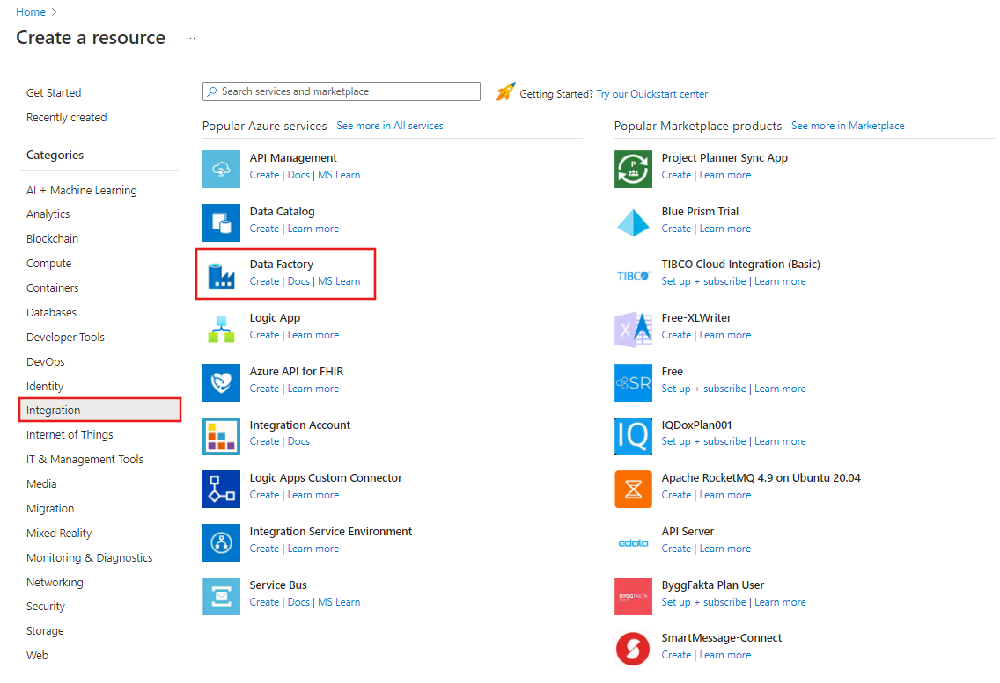

2. In the **New data factory** page, enter **ADFTutorialDataFactory** for the **name**.

     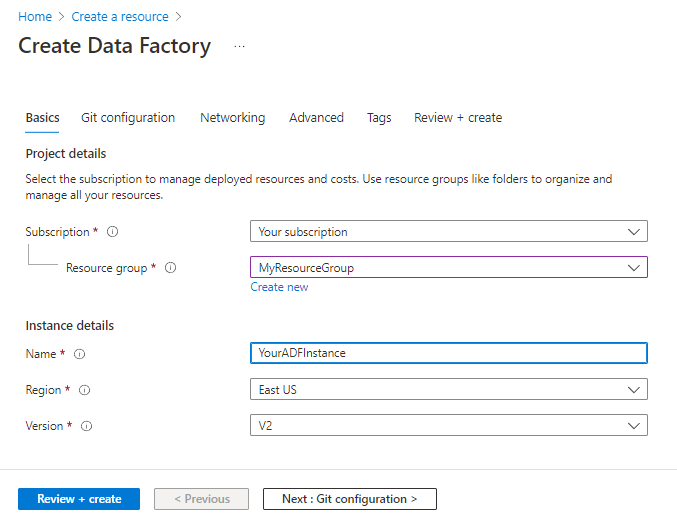

   The name of the Azure data factory must be **globally unique**. If you receive the following error, change the name of the data factory (for example, yournameADFTutorialDataFactory) and try creating again. See [Data Factory - Naming Rules](naming-rules.md) article for naming rules for Data Factory artifacts.

    *Data factory name "ADFTutorialDataFactory" is not available.*
3. Select **V2** for the **version**.
4. Select your Azure **subscription** in which you want to create the data factory.
5. For the **Resource Group**, do one of the following steps:

   1. Select **Use existing**, and select an existing resource group from the drop-down list.
   2. Select **Create new**, and enter the name of a resource group.   
         
    To learn about resource groups, see [Using resource groups to manage your Azure resources](../azure-resource-manager/management/overview.md).  
5. Select the **location** for the data factory. Only locations that are supported are displayed in the drop-down list. The data stores (Azure Storage, Azure SQL Database, etc.) and computes (HDInsight, etc.) used by data factory can be in other regions.
6. De-select **Enable GIT**.     
7. Click **Create**.
8. Once the deployment is complete, click on **Go to resource**

   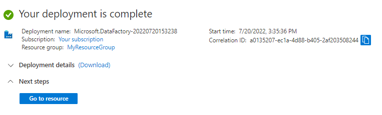
9. After the creation is complete, you see the **Data Factory** page as shown in the image.

   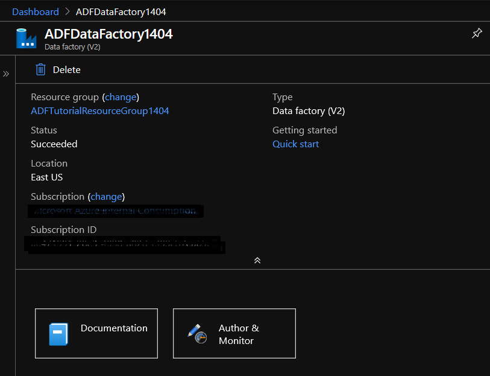
10. Click **Author & Monitor** tile to launch the Azure Data Factory user interface (UI) in a separate tab.
11. In the **get started** page, switch to the **Edit** tab in the left panel as shown in the following image:

    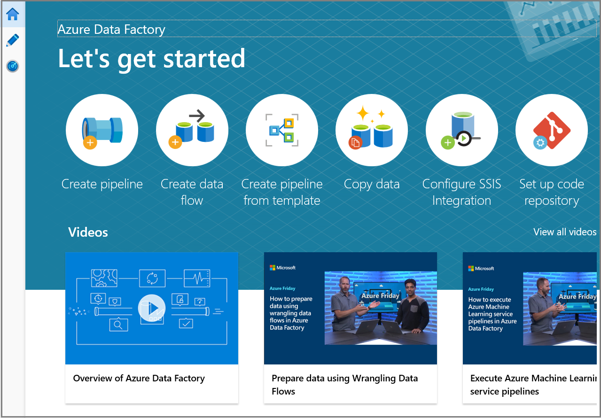

## Create linked services
You create linked services in a data factory to link your data stores and compute services to the data factory. In this section, you create linked services to your Azure Storage account and Azure SQL MI.

### Create Azure Storage linked service.
In this step, you link your Azure Storage Account to the data factory.

1. Click **Connections**, and click **+ New**.

   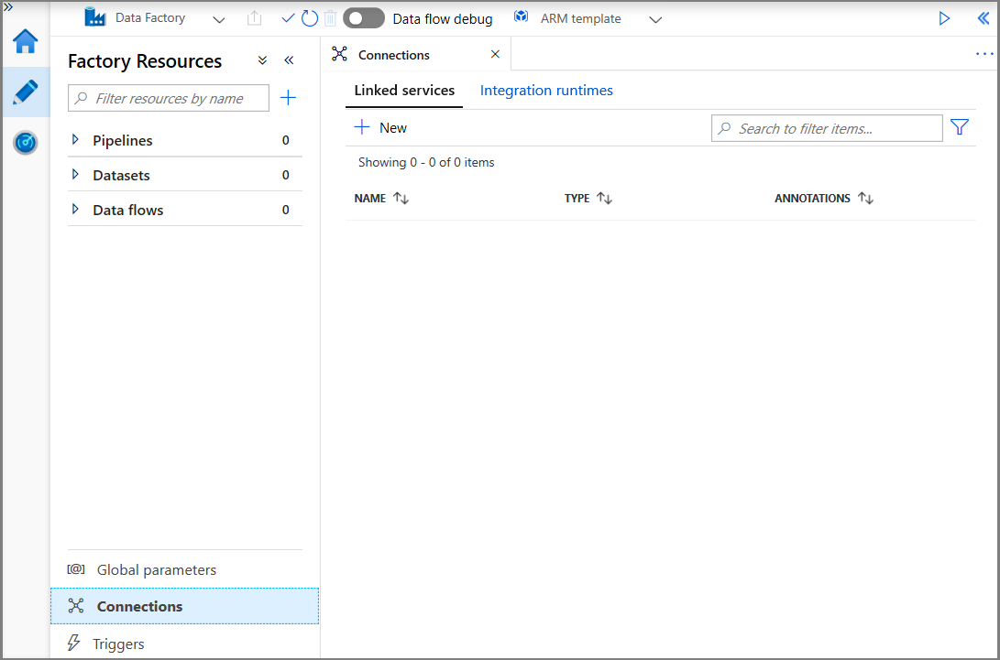
2. In the **New Linked Service** window, select **Azure Blob Storage**, and click **Continue**.

   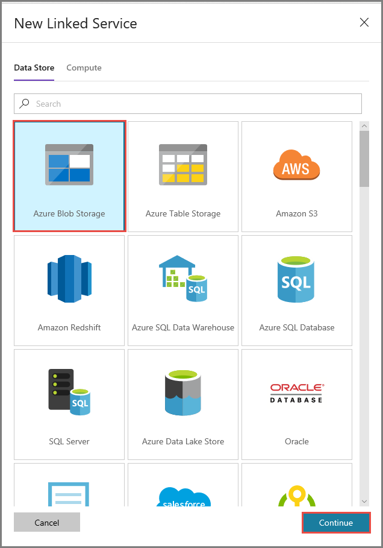
3. In the **New Linked Service** window, do the following steps:

   1. Enter **AzureStorageLinkedService** for **Name**.
   2. Select your Azure Storage account for **Storage account name**.
   3. Click **Save**.

   


### Create Azure SQL MI Database linked service.
In this step, you link your Azure SQL MI database to the data factory.

> [!NOTE]
> For those using SQL MI see [here](./connector-azure-sql-managed-instance.md#prerequisites) for information regarding access via public vs private endpoint. If using private endpoint one would need to run this pipeline using a self-hosted integration runtime. The same would apply to those running SQL Server on-prem, in a VM or VNet scenarios.

1. Click **Connections**, and click **+ New**.
2. In the **New Linked Service** window, select **Azure SQL Database Managed Instance**, and click **Continue**.
3. In the **New Linked Service** window, do the following steps:

   1. Enter **AzureSqlMI1** for the **Name** field.
   2. Select your SQL server for the **Server name** field.
   4. Select your SQL database for the **Database name** field.
   5. Enter name of the user for the **User name** field.
   6. Enter password for the user for the **Password** field.
   7. Click **Test connection** to test the connection.
   8. Click **Save** to save the linked service.

   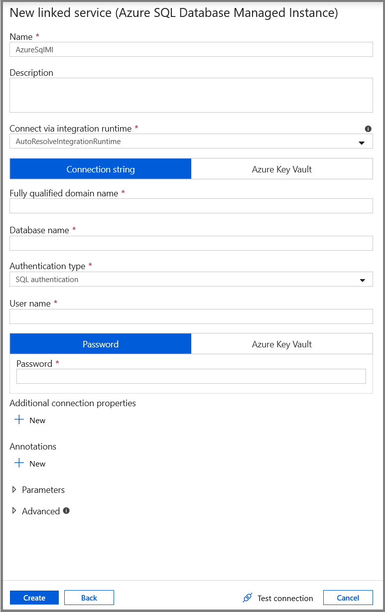

## Create datasets
In this step, you create datasets to represent data source and data destination.

### Create a dataset to represent source data
In this step, you create a dataset to represent the source data.

1. In the treeview, click **+ (plus)**, and click **Dataset**.

   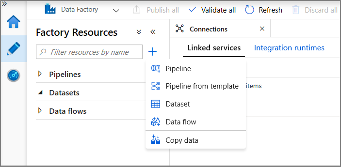
2. Select **Azure SQL Database Managed Instance**, and click **Continue**.

   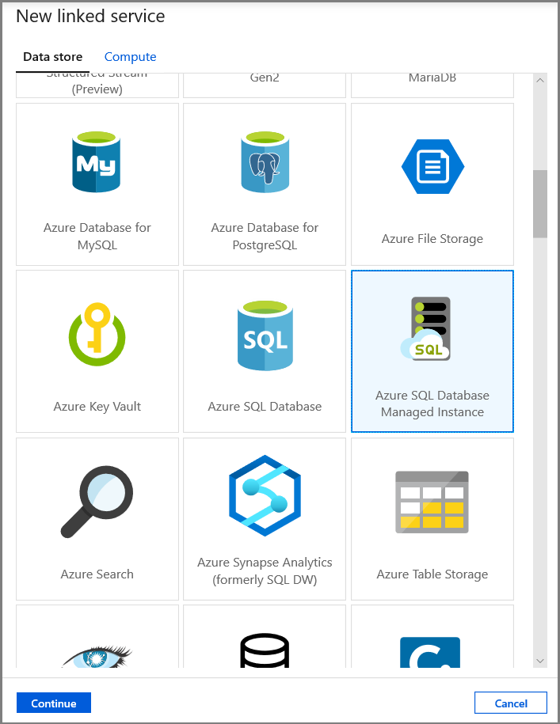
   
3. In the **Set properties** tab, set the dataset name and connection information:
 
   1. Select **AzureSqlMI1** for **Linked service**.
   2. Select **[dbo].[dbo_customers_CT]** for **Table name**.  Note: this table was automatically created when CDC was enabled on the customers table. Changed data is never queried from this table directly but is instead extracted through the [CDC functions](/sql/relational-databases/system-functions/change-data-capture-functions-transact-sql).

   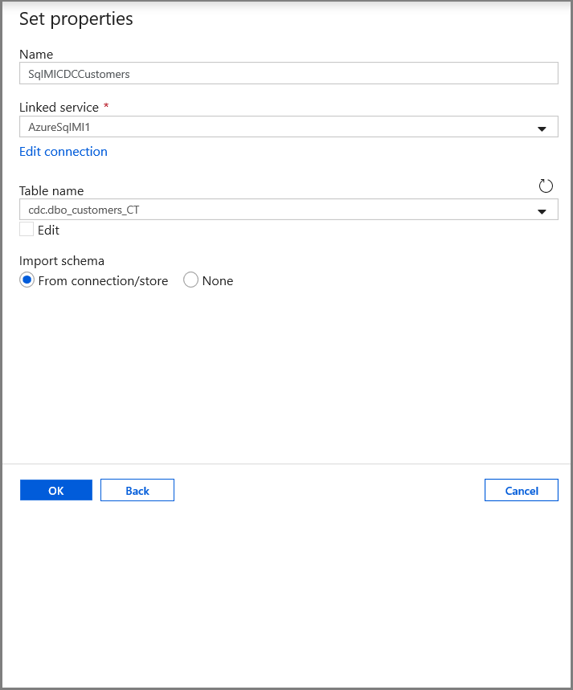

### Create a dataset to represent data copied to sink data store.
In this step, you create a dataset to represent the data that is copied from the source data store. You created the data lake container in your Azure Blob Storage as part of the prerequisites. Create the container if it does not exist (or) set it to the name of an existing one. In this tutorial, the output file name is dynamically generated by using the trigger time, which will be configured later.

1. In the treeview, click **+ (plus)**, and click **Dataset**.

   
2. Select **Azure Blob Storage**, and click **Continue**.

   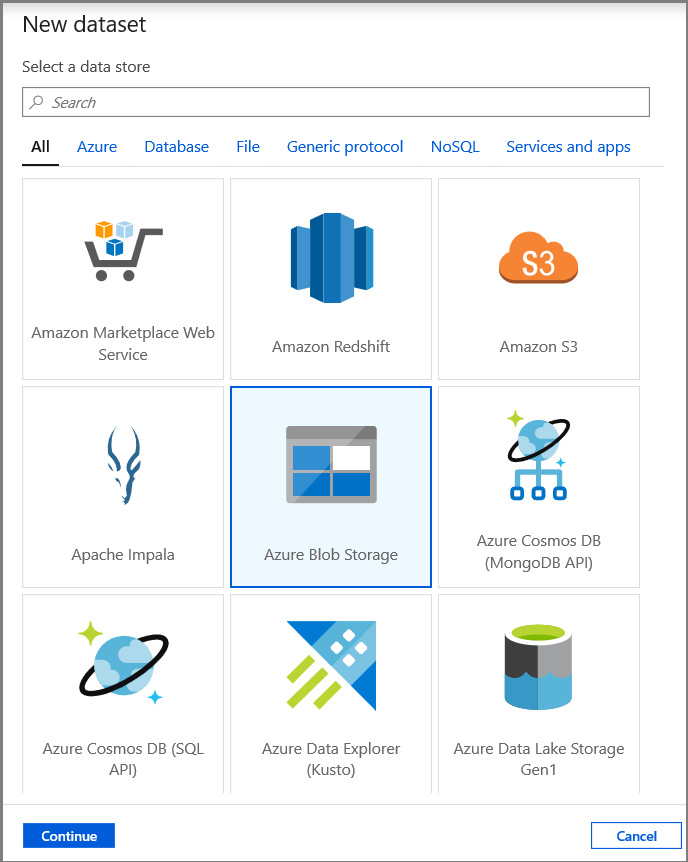
3. Select **DelimitedText**, and click **Continue**.

   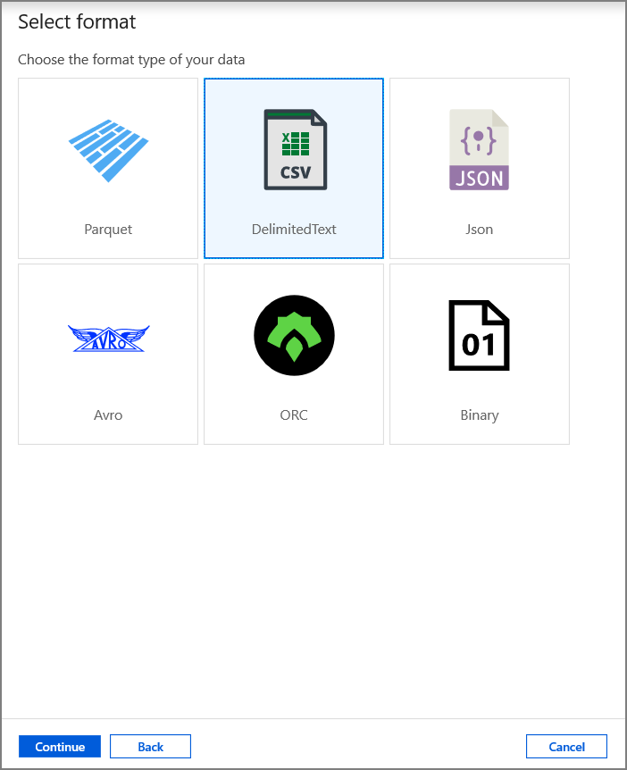
4. In the **Set Properties** tab, set the dataset name and connection information:

   1. Select **AzureStorageLinkedService** for **Linked service**.
   2. Enter **raw** for **container** part of the **filePath**.
   3. Enable **First row as header**
   4. Click **Ok**

   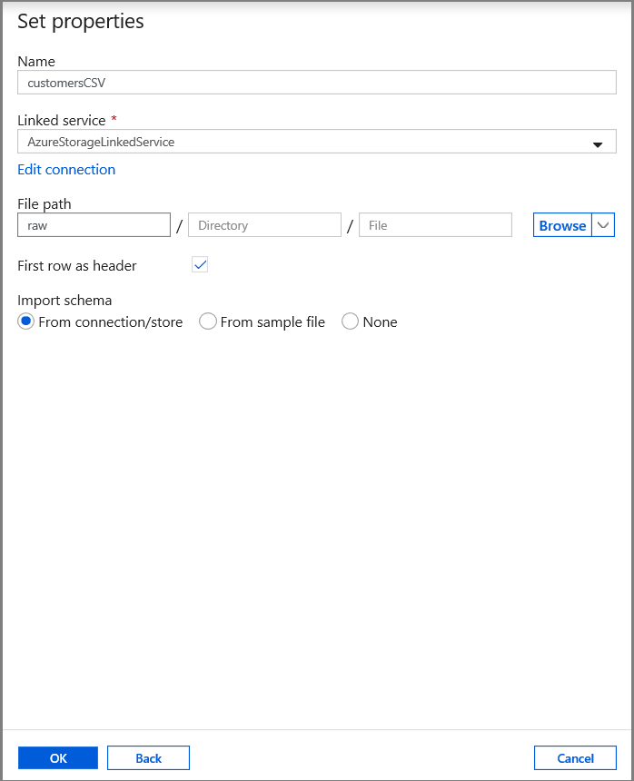

## Create a pipeline to copy the changed data
In this step, you create a pipeline, which first checks the number of changed records present in the change table using a **lookup activity**. An IF condition activity checks whether the number of changed records is greater than zero and runs a **copy activity** to copy the inserted/updated/deleted data from Azure SQL Database to Azure Blob Storage. Lastly, a tumbling window trigger is configured and the start and end times will be passed to the activities as the start and end window parameters. 

1. In the Data Factory UI, switch to the **Edit** tab. Click **+ (plus)** in the left pane, and click **Pipeline**.

    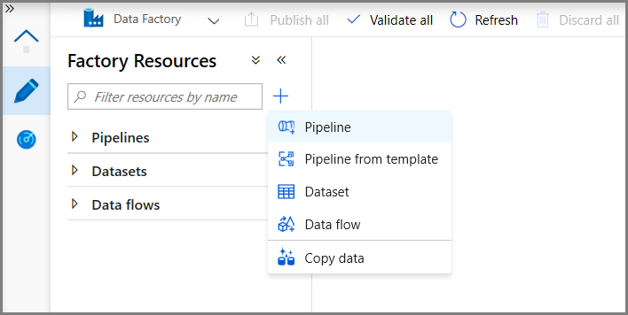
2. You see a new tab for configuring the pipeline. You also see the pipeline in the treeview. In the **Properties** window, change the name of the pipeline to **IncrementalCopyPipeline**.

    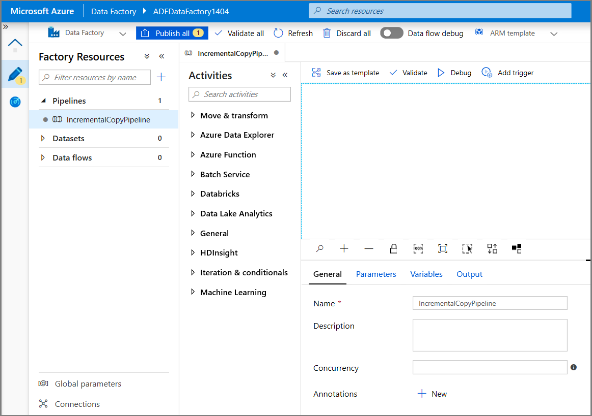
3. Expand **General** in the **Activities** toolbox, and drag-drop the **Lookup** activity to the pipeline designer surface. Set the name of the activity to **GetChangeCount**. This activity gets the number of records in the change table for a given time window.

    
4. Switch to the **Settings** in the **Properties** window:
   1. Specify the SQL MI dataset name for the **Source Dataset** field.
   2. Select the Query option and enter the following into the query box:
    ```sql
    DECLARE  @from_lsn binary(10), @to_lsn binary(10);  
    SET @from_lsn =sys.fn_cdc_get_min_lsn('dbo_customers');  
    SET @to_lsn = sys.fn_cdc_map_time_to_lsn('largest less than or equal',  GETDATE());
    SELECT count(1) changecount FROM cdc.fn_cdc_get_all_changes_dbo_customers(@from_lsn, @to_lsn, 'all')
    ```
   3. Enable **First row only**

    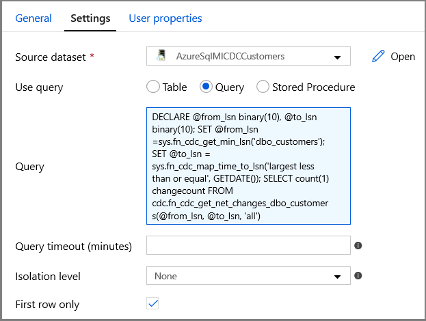
5. Click the **Preview data** button to ensure a valid output is obtained by the lookup activity

    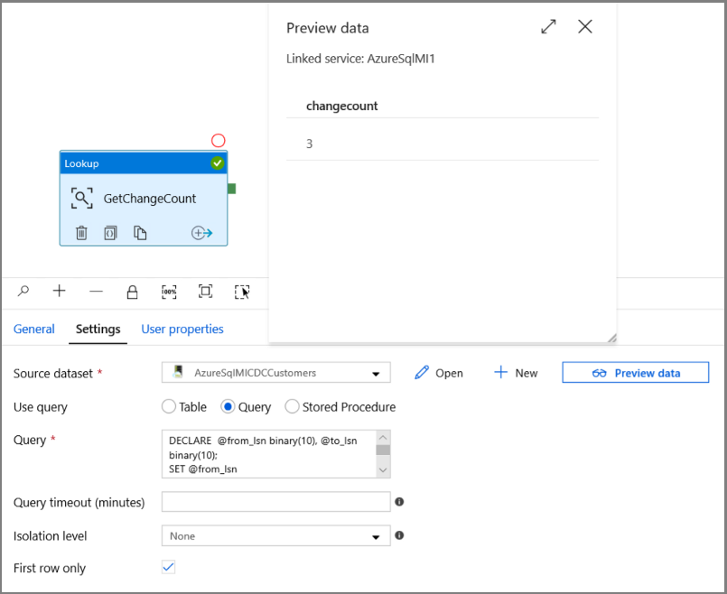
6. Expand **Iteration & conditionals** in the **Activities** toolbox, and drag-drop the **If Condition** activity to the pipeline designer surface. Set the name of the activity to **HasChangedRows**. 

    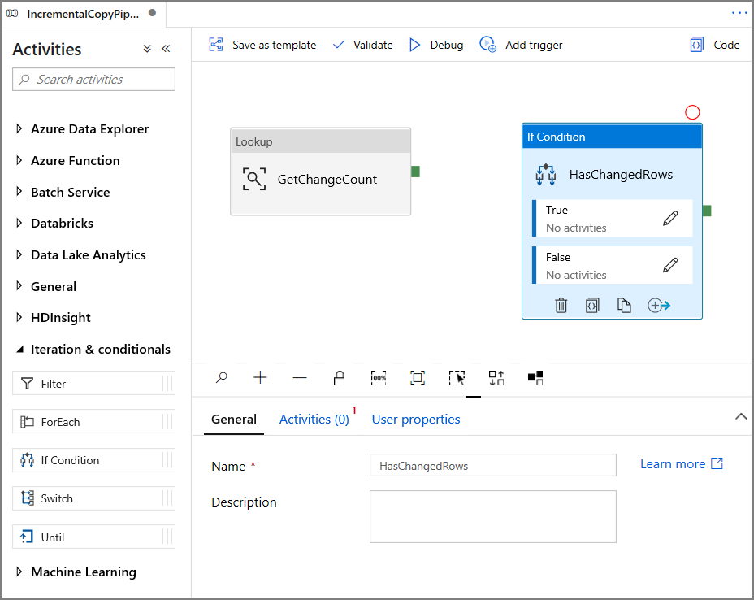
7. Switch to the **Activities** in the **Properties** window:

   1. Enter the following **Expression**
   
    ```adf
    @greater(int(activity('GetChangeCount').output.firstRow.changecount),0)
    ```

   2. Click on the pencil icon to edit the True condition.

   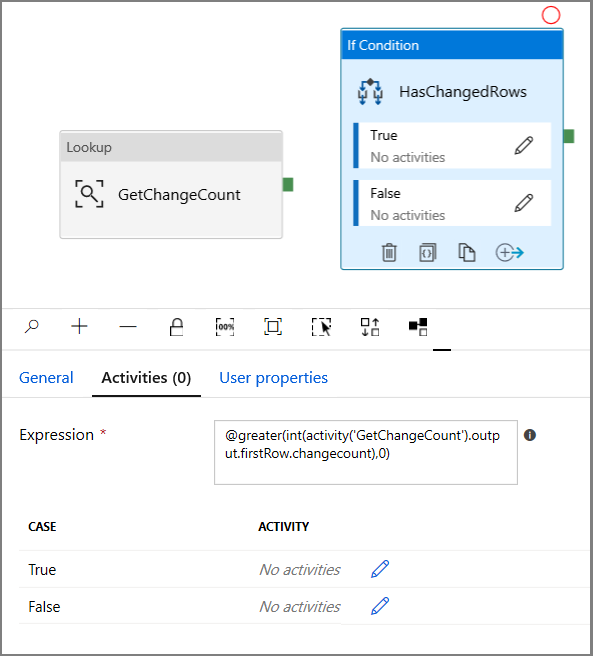

   3. Expand **General** in the **Activities** toolbox and drag-drop a **Wait** activity to the pipeline designer surface. This is a temporary activity in order to debug the If condition and will be changed later in the tutorial. 

   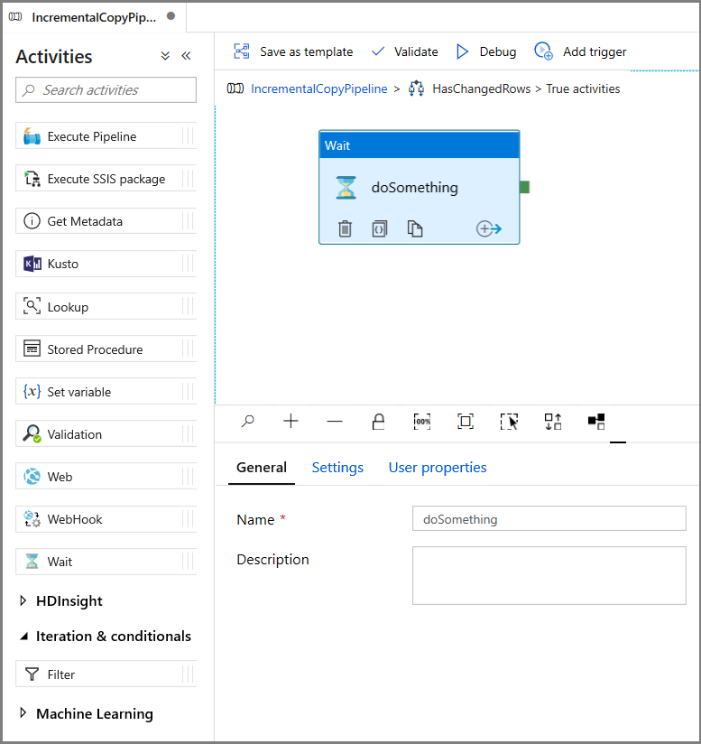

   4. Click on the IncrementalCopyPipeline breadcrumb to return to the main pipeline.

8. Run the pipeline in **Debug** mode to verify the pipeline executes successfully. 

   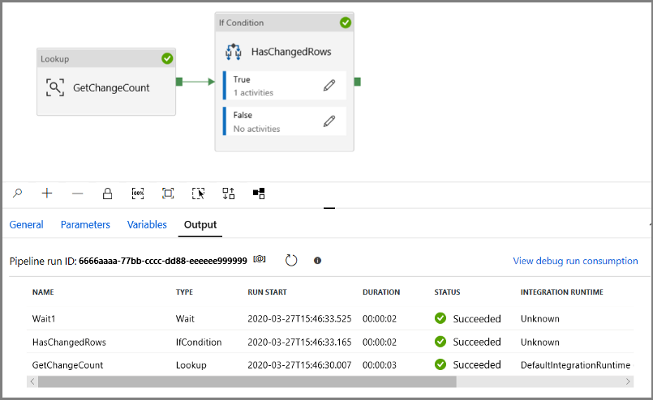
9. Next, return to the True condition step and delete the **Wait** activity. In the **Activities** toolbox, expand **Move & transform**, and drag-drop a **Copy** activity to the pipeline designer surface. Set the name of the activity to **IncrementalCopyActivity**. 

   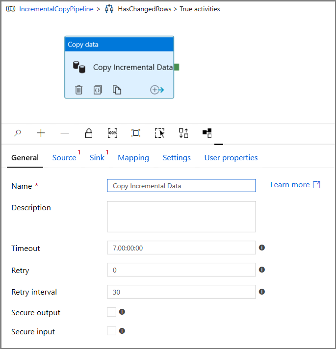
10. Switch to the **Source** tab in the **Properties** window, and do the following steps:

   1. Specify the SQL MI dataset name for the **Source Dataset** field. 
   2. Select **Query** for **Use Query**.
   3. Enter the following for **Query**.

      ```sql
      DECLARE @from_lsn binary(10), @to_lsn binary(10); 
      SET @from_lsn =sys.fn_cdc_get_min_lsn('dbo_customers'); 
      SET @to_lsn = sys.fn_cdc_map_time_to_lsn('largest less than or equal', GETDATE());
      SELECT * FROM cdc.fn_cdc_get_all_changes_dbo_customers(@from_lsn, @to_lsn, 'all')
      ```

   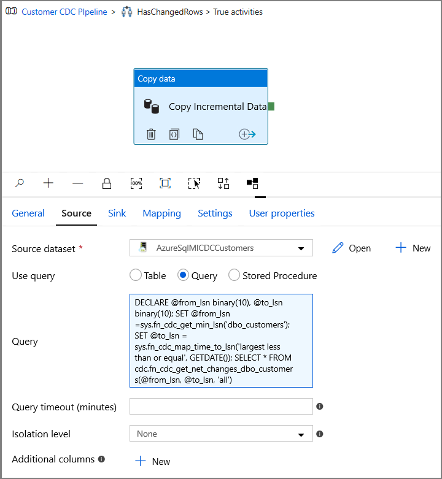

11. Click preview to verify that the query returns the changed rows correctly.

    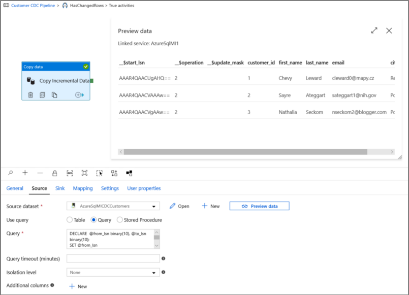
12. Switch to the **Sink** tab, and specify the Azure Storage dataset for the **Sink Dataset** field.

    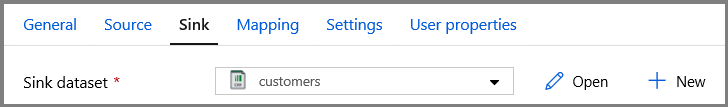
13. Click back to the main pipeline canvas and connect the **Lookup** activity to the **If Condition** activity one by one. Drag the **green** button attached to the **Lookup** activity to the **If Condition** activity.

    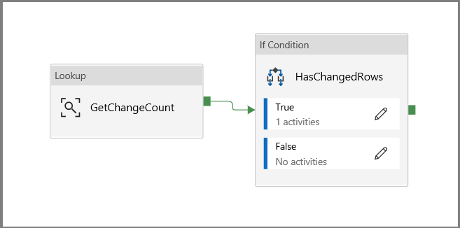
14. Click **Validate** on the toolbar. Confirm that there are no validation errors. Close the **Pipeline Validation Report** window by clicking **>>**.

    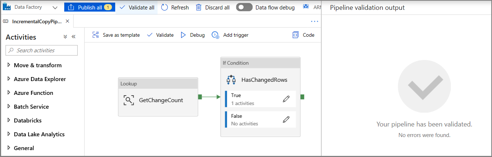
15. Click Debug to test the pipeline and verify that a file is generated in the storage location.

    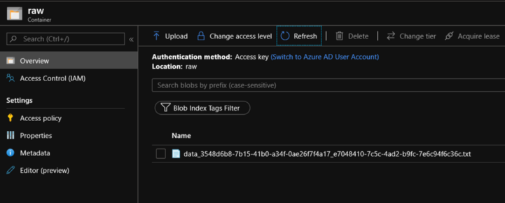
16. Publish entities (linked services, datasets, and pipelines) to the Data Factory service by clicking the **Publish all** button. Wait until you see the **Publishing succeeded** message.

    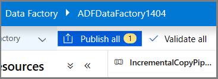    

### Configure the tumbling window trigger and CDC window parameters 
In this step, you create a tumbling window trigger to run the job on a frequent schedule. You will use the WindowStart and WindowEnd system variables of the tumbling window trigger and pass them as parameters to your pipeline to be used in the CDC query.

1. Navigate to the **Parameters** tab of the **IncrementalCopyPipeline** pipeline and using the **+ New** button add two parameters (**triggerStartTime** and **triggerEndTime**) to the pipeline, which will represent the tumbling window start and end time. For debugging purposes add default values in the format **YYYY-MM-DD HH24:MI:SS.FFF** but ensure the triggerStartTime is not prior to CDC being enabled on the table, otherwise this will result in an error.

    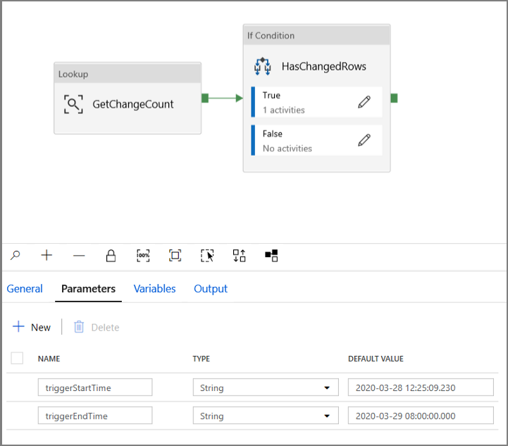
2. Click on the settings tab of the **Lookup** activity and configure the query to use the start and end parameters. Copy the following into the query:
    ```sql
    @concat('DECLARE @begin_time datetime, @end_time datetime, @from_lsn binary(10), @to_lsn binary(10); 
    SET @begin_time = ''',pipeline().parameters.triggerStartTime,''';
    SET @end_time = ''',pipeline().parameters.triggerEndTime,''';
    SET @from_lsn = sys.fn_cdc_map_time_to_lsn(''smallest greater than or equal'', @begin_time);
    SET @to_lsn = sys.fn_cdc_map_time_to_lsn(''largest less than'', @end_time);
    SELECT count(1) changecount FROM cdc.fn_cdc_get_all_changes_dbo_customers(@from_lsn, @to_lsn, ''all'')')
    ```

3. Navigate to the **Copy** activity in the True case of the **If Condition** activity and click on the **Source** tab. Copy the following into the query:
    ```sql
    @concat('DECLARE @begin_time datetime, @end_time datetime, @from_lsn binary(10), @to_lsn binary(10); 
    SET @begin_time = ''',pipeline().parameters.triggerStartTime,''';
    SET @end_time = ''',pipeline().parameters.triggerEndTime,''';
    SET @from_lsn = sys.fn_cdc_map_time_to_lsn(''smallest greater than or equal'', @begin_time);
    SET @to_lsn = sys.fn_cdc_map_time_to_lsn(''largest less than'', @end_time);
    SELECT * FROM cdc.fn_cdc_get_all_changes_dbo_customers(@from_lsn, @to_lsn, ''all'')')
    ```
4. Click on the **Sink** tab of the **Copy** activity and click **Open** to edit the dataset properties. Click on the **Parameters** tab and add a new parameter called **triggerStart**    

    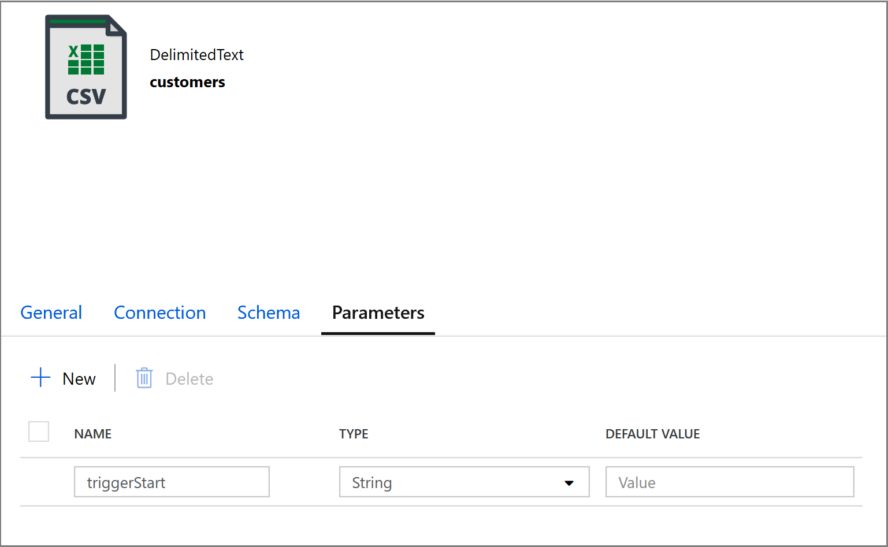
5. Next, configure the dataset properties to store the data in a **customers/incremental** subdirectory with date-based partitions.
   1. Click on the **Connection** tab of the dataset properties and add dynamic content for both the **Directory** and the **File** sections. 
   2. Enter the following expression in the **Directory** section by clicking on the dynamic content link under the textbox:
    
    ```sql
    @concat('customers/incremental/',formatDateTime(dataset().triggerStart,'yyyy/MM/dd'))
    ```
   3. Enter the following expression in the **File** section. This will create file names based on the trigger start date and time, suffixed with the csv extension:
    
    ```sql
    @concat(formatDateTime(dataset().triggerStart,'yyyyMMddHHmmssfff'),'.csv')
    ```
    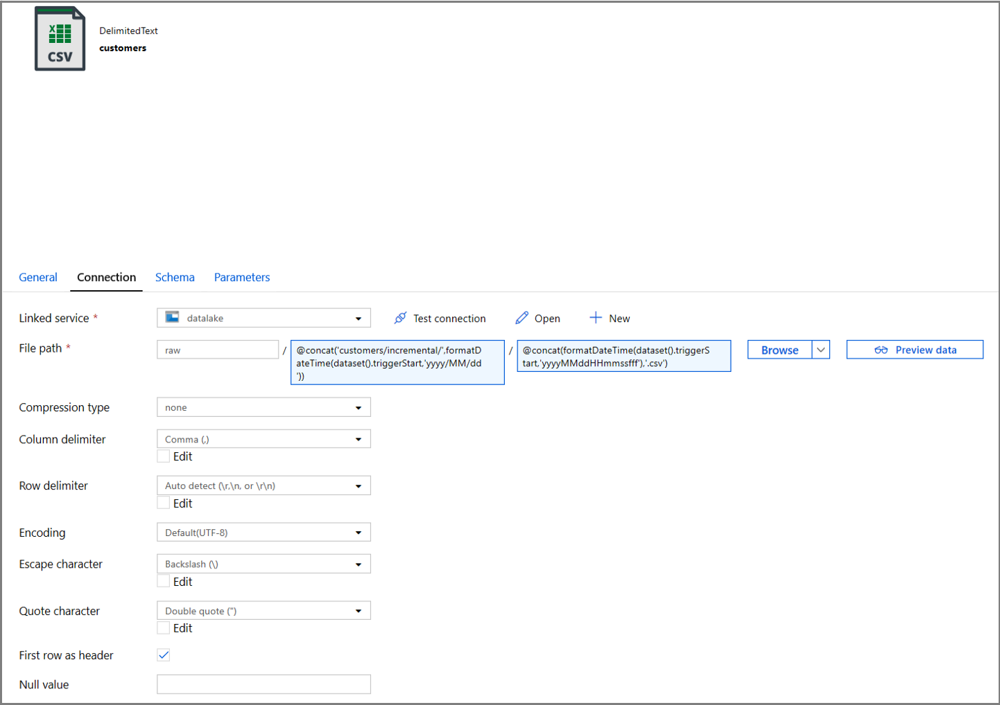

   4. Navigate back to the **Sink** settings in **Copy** activity by clicking on the **IncrementalCopyPipeline** tab. 
   5. Expand the dataset properties and enter dynamic content in the triggerStart parameter value with the following expression:
     ```sql
     @pipeline().parameters.triggerStartTime
     ```
    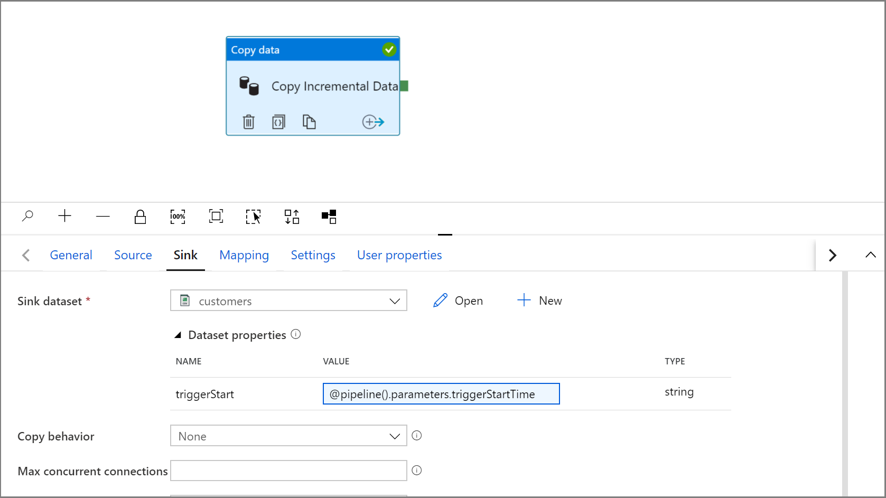

6. Click Debug to test the pipeline and ensure the folder structure and output file is generated as expected. Download and open the file to verify the contents. 

    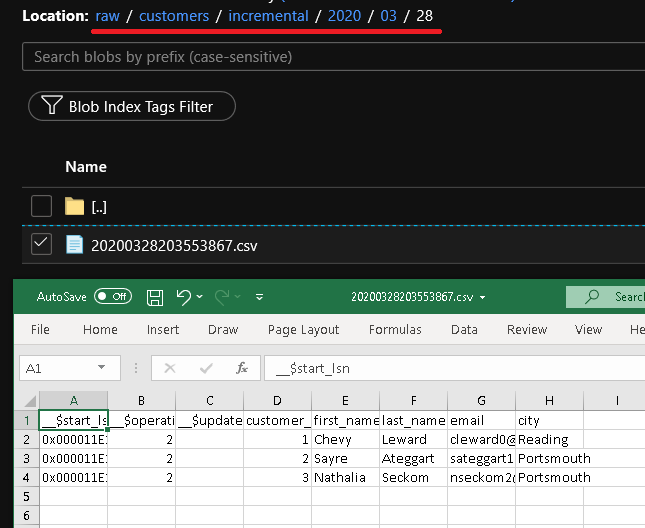
7. Ensure the parameters are being injected into the query by reviewing the Input parameters of the pipeline run.

    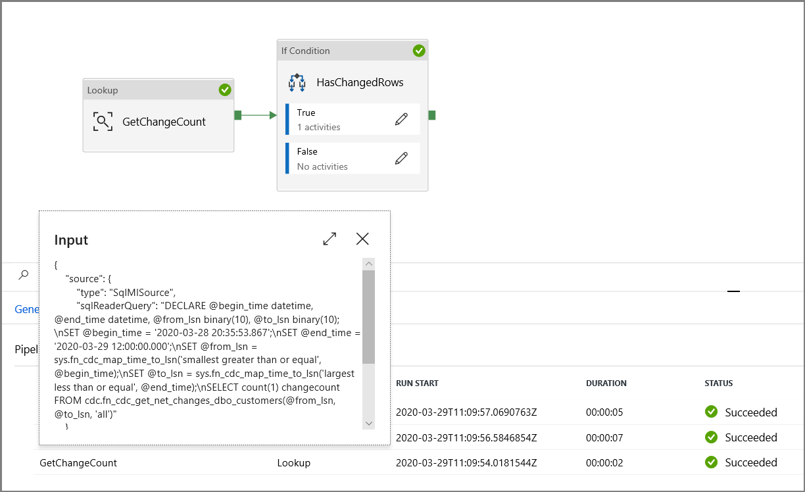
8. Publish entities (linked services, datasets, and pipelines) to the Data Factory service by clicking the **Publish all** button. Wait until you see the **Publishing succeeded** message.
9. Finally, configure a tumbling window trigger to run the pipeline at a regular interval and set start and end time parameters. 
   1. Click the **Add trigger** button, and select **New/Edit**

   

   2. Enter a trigger name and specify a start time, which is equal to the end time of the debug window above.

   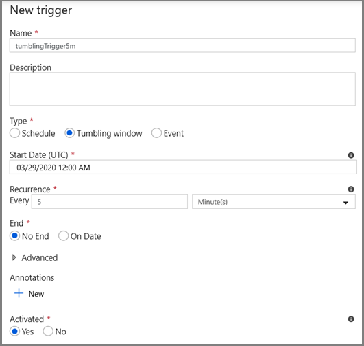

   3. On the next screen, specify the following values for the start and end parameters respectively.
    ```sql
    @formatDateTime(trigger().outputs.windowStartTime,'yyyy-MM-dd HH:mm:ss.fff')
    @formatDateTime(trigger().outputs.windowEndTime,'yyyy-MM-dd HH:mm:ss.fff')
    ```

   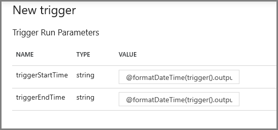

> [!NOTE]
> Note the trigger will only run once it has been published. Additionally the expected behavior of tumbling window is to run all historical intervals from the start date until now. More information regarding tumbling window triggers can be found [here](./how-to-create-tumbling-window-trigger.md). 
  
10. Using **SQL Server Management Studio** make some additional changes to the customer table by running the following SQL:
    ```sql
    insert into customers (customer_id, first_name, last_name, email, city) values (4, 'Farlie', 'Hadigate', 'fhadigate3@zdnet.com', 'Reading');
    insert into customers (customer_id, first_name, last_name, email, city) values (5, 'Anet', 'MacColm', 'amaccolm4@yellowbook.com', 'Portsmouth');
    insert into customers (customer_id, first_name, last_name, email, city) values (6, 'Elonore', 'Bearham', 'ebearham5@ebay.co.uk', 'Portsmouth');
    update customers set first_name='Elon' where customer_id=6;
    delete from customers where customer_id=5;
    ```
11. Click the **Publish all** button. Wait until you see the **Publishing succeeded** message.  
12. After a few minutes the pipeline will have triggered and a new file will have been loaded into Azure Storage


### Monitor the incremental copy pipeline
1. Click the **Monitor** tab on the left. You see the pipeline run in the list and its status. To refresh the list, click **Refresh**. Hover near the name of the pipeline to access the Rerun action and Consumption report.

    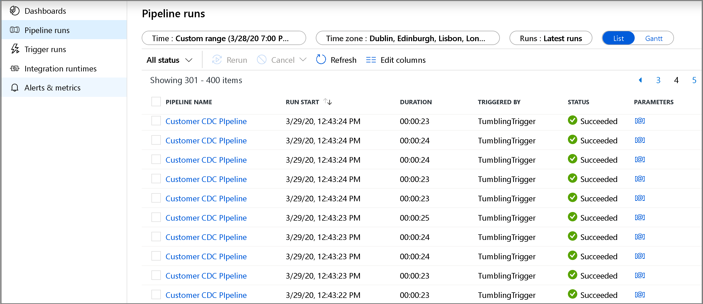
2. To view activity runs associated with the pipeline run, click the Pipeline name. If changed data was detected, there will be three activities including the copy activity otherwise there will only be two entries in the list. To switch back to the pipeline runs view, click the **All Pipelines** link at the top.

    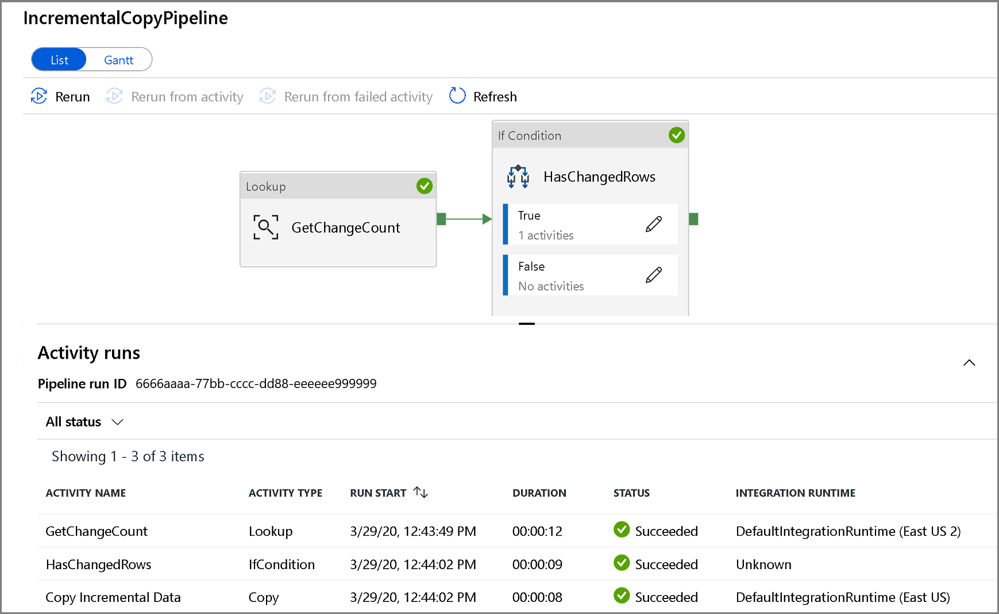


### Review the results
You see the second file in the `customers/incremental/YYYY/MM/DD` folder of the `raw` container.


 

## Next steps
Advance to the following tutorial to learn about copying new and changed files only based on their LastModifiedDate:

> [!div class="nextstepaction"]
>[Copy new files by lastmodifieddate](tutorial-incremental-copy-lastmodified-copy-data-tool.md)
