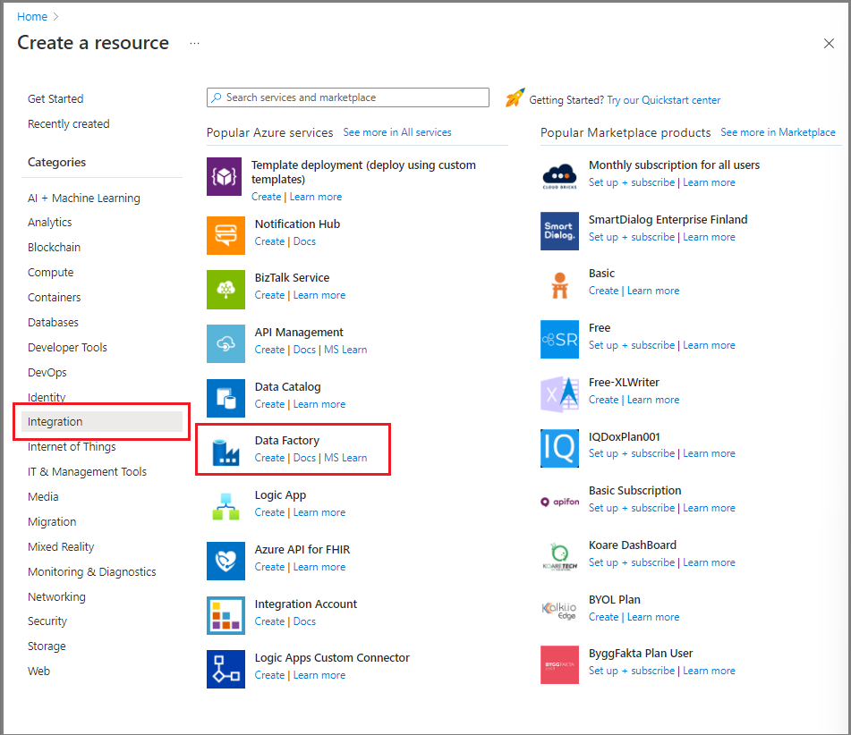
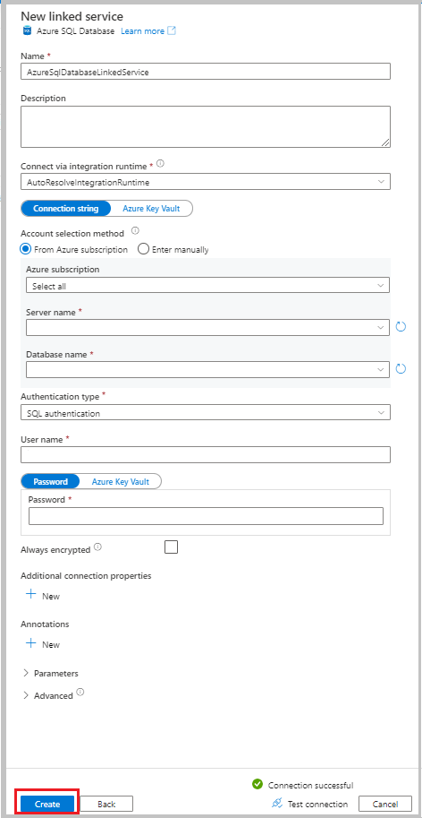
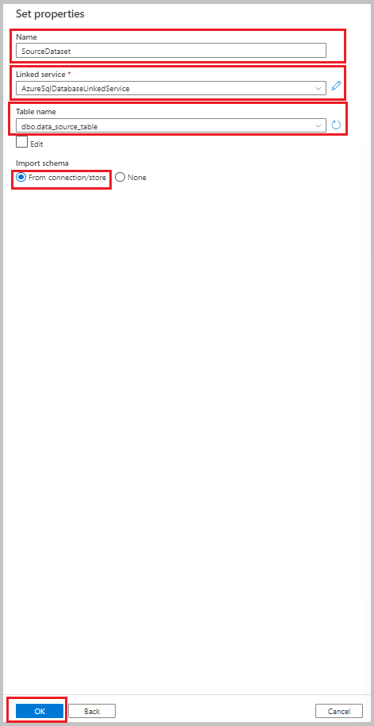
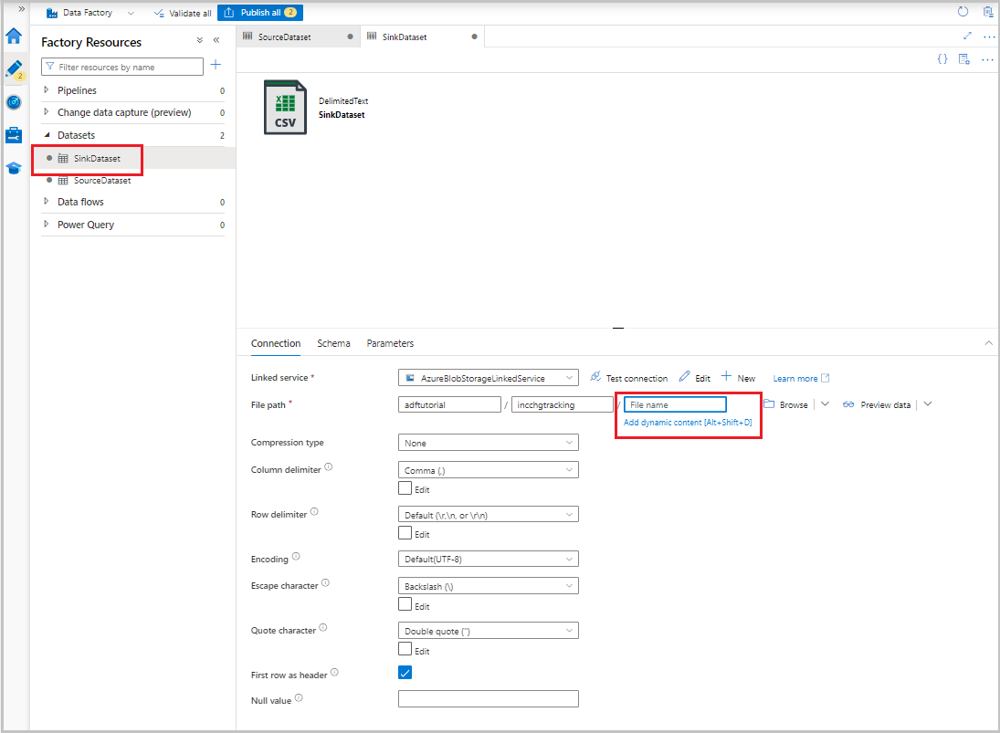
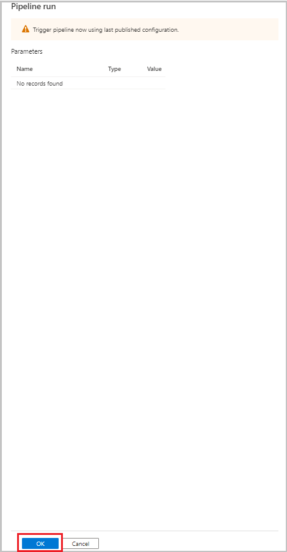

# Incrementally copy data from Azure SQL Database to Blob Storage by using change tracking in the Azure portal

[!INCLUDE[appliesto-adf-asa-md](includes/appliesto-adf-asa-md.md)]

In a data integration solution, incrementally loading data after initial data loads is a widely used scenario. The changed data within a period in your source data store can be easily sliced (for example, `LastModifyTime`, `CreationTime`). But in some cases, there's no explicit way to identify the delta data from the last time that you processed the data. You can use the change tracking technology supported by data stores such as Azure SQL Database and SQL Server to identify the delta data.  

This tutorial describes how to use Azure Data Factory with change tracking to incrementally load delta data from Azure SQL Database into Azure Blob Storage. For more information about change tracking, see [Change tracking in SQL Server](/sql/relational-databases/track-changes/about-change-tracking-sql-server).

You perform the following steps in this tutorial:

> [!div class="checklist"]
> * Prepare the source data store.
> * Create a data factory.
> * Create linked services.
> * Create source, sink, and change tracking datasets.
> * Create, run, and monitor the full copy pipeline.
> * Add or update data in the source table.
> * Create, run, and monitor the incremental copy pipeline.

## High-level solution
In this tutorial, you create two pipelines that perform the following operations.

> [!NOTE]
> This tutorial uses Azure SQL Database as the source data store. You can also use SQL Server.

1. **Initial loading of historical data**: You create a pipeline with a copy activity that copies the entire data from the source data store (Azure SQL Database) to the destination data store (Azure Blob Storage):
    1. Enable change tracking technology in the source database in Azure SQL Database.
    2. Get the initial value of `SYS_CHANGE_VERSION` in the database as the baseline to capture changed data.
    3. Load full data from the source database into Azure Blob Storage.

    :::image type="content" source="media/tutorial-incremental-copy-change-tracking-feature-portal/full-load-flow-diagram.png" alt-text="Diagram that shows full loading of data.":::
1.  **Incremental loading of delta data on a schedule**: You create a pipeline with the following activities and run it periodically:
    1. Create *two lookup activities* to get the old and new `SYS_CHANGE_VERSION` values from Azure SQL Database.
    2. Create *one copy activity* to copy the inserted, updated, or deleted data (the delta data) between the two `SYS_CHANGE_VERSION` values from Azure SQL Database to Azure Blob Storage.

       You load the delta data by joining the primary keys of changed rows (between two `SYS_CHANGE_VERSION` values) from `sys.change_tracking_tables` with data in the source table, and then move the delta data to the destination.
    3. Create *one stored procedure activity* to update the value of `SYS_CHANGE_VERSION` for the next pipeline run. 

    :::image type="content" source="media/tutorial-incremental-copy-change-tracking-feature-portal/incremental-load-flow-diagram.png" alt-text="Diagram that shows incremental loading of data.":::

## Prerequisites

* **Azure subscription**. If you don't have one, create a [free account](https://azure.microsoft.com/free/) before you begin.
* **Azure SQL Database**. You use a database in Azure SQL Database as the *source* data store. If you don't have one, see [Create a database in Azure SQL Database](/azure/azure-sql/database/single-database-create-quickstart) for steps to create it.
* **Azure storage account**. You use Blob Storage as the *sink* data store. If you don't have an Azure storage account, see [Create a storage account](../storage/common/storage-account-create.md) for steps to create one. Create a container named *adftutorial*. 

[!INCLUDE [updated-for-az](../../includes/updated-for-az.md)]

## Create a data source table in Azure SQL Database

1. Open SQL Server Management Studio, and connect to SQL Database.
2. In Server Explorer, right-click your database, and then select **New Query**.
3. Run the following SQL command against your database to create a table named `data_source_table` as the source data store:  

    ```sql
    create table data_source_table
    (
        PersonID int NOT NULL,
        Name varchar(255),
        Age int
        PRIMARY KEY (PersonID)
    );
    INSERT INTO data_source_table
        (PersonID, Name, Age)
    VALUES
        (1, 'aaaa', 21),
        (2, 'bbbb', 24),
        (3, 'cccc', 20),
        (4, 'dddd', 26),
        (5, 'eeee', 22);
    ```

4. Enable change tracking on your database and the source table (`data_source_table`) by running the following SQL query.

    > [!NOTE]
    > - Replace `<your database name>` with the name of the database in Azure SQL Database that has `data_source_table`.
    > - The changed data is kept for two days in the current example. If you load the changed data for every three days or more, some changed data is not included. You need to either change the value of `CHANGE_RETENTION` to a bigger number or ensure that your period to load the changed data is within two days. For more information, see [Enable change tracking for a database](/sql/relational-databases/track-changes/enable-and-disable-change-tracking-sql-server#enable-change-tracking-for-a-database).

    ```sql
    ALTER DATABASE <your database name>
    SET CHANGE_TRACKING = ON  
    (CHANGE_RETENTION = 2 DAYS, AUTO_CLEANUP = ON)  
    ALTER TABLE data_source_table
    ENABLE CHANGE_TRACKING  
    WITH (TRACK_COLUMNS_UPDATED = ON)
    ```
5. Create a new table and store called `ChangeTracking_version` with a default value by running the following query:

    ```sql
    create table table_store_ChangeTracking_version
    (
        TableName varchar(255),
        SYS_CHANGE_VERSION BIGINT,
    );
    DECLARE @ChangeTracking_version BIGINT
    SET @ChangeTracking_version = CHANGE_TRACKING_CURRENT_VERSION();  
    INSERT INTO table_store_ChangeTracking_version
    VALUES ('data_source_table', @ChangeTracking_version)
    ```

    > [!NOTE]
    > If the data is not changed after you enable change tracking for SQL Database, the value of the change tracking version is `0`.
6. Run the following query to create a stored procedure in your database. The pipeline invokes this stored procedure to update the change tracking version in the table that you created in the previous step.
    
    ```sql
    CREATE PROCEDURE Update_ChangeTracking_Version @CurrentTrackingVersion BIGINT, @TableName varchar(50)
    AS
    BEGIN
    UPDATE table_store_ChangeTracking_version
    SET [SYS_CHANGE_VERSION] = @CurrentTrackingVersion
    WHERE [TableName] = @TableName
    END    
    ```

## Create a data factory

1. Open the Microsoft Edge or Google Chrome web browser. Currently, only these browsers support the Data Factory user interface (UI).
1. In the [Azure portal](https://ms.portal.azure.com/), on the left menu, select **Create a resource**.
1. Select **Integration** > **Data Factory**.

    
1. On the **New data factory** page, enter **ADFTutorialDataFactory** for the name.
    
   The name of data factory must be globally unique. If you get an error that says the name that you chose is not available, change the name (for example, to **yournameADFTutorialDataFactory**) and try creating the data factory again. For more information, see [Azure Data Factory naming rules](naming-rules.md).
   
1. Select the Azure subscription in which you want to create the data factory.
1. For **Resource Group**, take one of the following steps:

   - Select **Use existing**, and then select an existing resource group from the dropdown list.
   - Select **Create new**, and then enter the name of a resource group.   
         
   To learn about resource groups, see [Using resource groups to manage your Azure resources](../azure-resource-manager/management/overview.md).  
1. For **Version**, select **V2**.
1. For **Region**, select the region for the data factory. 

   The dropdown list displays only locations that are supported. The data stores (for example, Azure Storage and Azure SQL Database) and computes (for example, Azure HDInsight) that a data factory uses can be in other regions.
1. Select **Next: Git configuration**. Set up the repository by following the instructions in [Configuration method 4: During factory creation](./source-control.md#configuration-method-4-during-factory-creation), or select the **Configure Git later** checkbox.
    
1. Select **Review + create**.     
1. Select **Create**.      

   On the dashboard, the **Deploying Data Factory** tile shows the status.

	:::image type="content" source="media/tutorial-incremental-copy-change-tracking-feature-portal/deploying-data-factory.png" alt-text="Screenshot of the tile that shows the status of deploying a data factory.":::
1. After the creation is complete, the **Data Factory** page appears. Select the **Launch studio** tile to open the Azure Data Factory UI on a separate tab.

## Create linked services

You create linked services in a data factory to link your data stores and compute services to the data factory. In this section, you create linked services to your Azure storage account and your database in Azure SQL Database.

### Create an Azure Storage linked service

To link your storage account to the data factory:

1. In the Data Factory UI, on the **Manage** tab, under **Connections**, select **Linked services**. Then select **+ New** or the **Create linked service** button.
   
1. In the **New Linked Service** window, select **Azure Blob Storage**, and then select **Continue**.
1. Enter the following information:
   1. For **Name**, enter **AzureStorageLinkedService**.
   1. For **Connect via integration runtime**, select the integration runtime.
   1. For **Authentication type**, select an authentication method.
   1. For **Storage account name**, select your Azure storage account.
1. Select **Create**.

### Create an Azure SQL Database linked service

To link your database to the data factory:

1. In the Data Factory UI, on the **Manage** tab, under **Connections**, select **Linked services**. Then select **+ New**.
1. In the **New Linked Service** window, select **Azure SQL Database**, and then select **Continue**.
1. Enter the following information:
   1. For **Name**, enter **AzureSqlDatabaseLinkedService**.
   1. For **Server name**, select your server.
   1. For **Database name**, select your database.
   1. For **Authentication type**, select an authentication method. This tutorial uses SQL authentication for demonstration.
   1. For **User name**, enter the name of the user.
   1. For **Password**, enter a password for the user. Or, provide the information for **Azure Key Vault - AKV linked service**, **Secret name**, and **Secret version**.
1. Select **Test connection** to test the connection.
1. Select **Create** to create the linked service.

   

## Create datasets

In this section, you create datasets to represent the data source and data destination, along with the place to store the `SYS_CHANGE_VERSION` values.

### Create a dataset to represent source data

1. In the Data Factory UI, on the **Author** tab, select the plus sign (**+**). Then select **Dataset**, or select the ellipsis for dataset actions.
   
   
1. Select **Azure SQL Database**, and then select **Continue**.
1. In the **Set Properties** window, take the following steps:
   1. For **Name**, enter **SourceDataset**.
   1. For **Linked service**, select **AzureSqlDatabaseLinkedService**.
   1. For **Table name**, select **dbo.data_source_table**.
   1. For **Import schema**, select the **From connection/store** option.
   1. Select **OK**.

     

### Create a dataset to represent data copied to the sink data store

In the following procedure, you create a dataset to represent the data that's copied from the source data store. You created the *adftutorial* container in Azure Blob Storage as part of the prerequisites. Create the container if it doesn't exist, or set it to the name of an existing one. In this tutorial, the output file name is dynamically generated from the expression `@CONCAT('Incremental-', pipeline().RunId, '.txt')`.

1. In the Data Factory UI, on the **Author** tab, select **+**. Then select **Dataset**, or select the ellipsis for dataset actions.

   
1. Select **Azure Blob Storage**, and then select **Continue**.
1. Select the format of the data type as **DelimitedText**, and then select **Continue**.
1. In the  **Set properties** window, take the following steps:
   1. For **Name**, enter **SinkDataset**.
   1. For **Linked service**, select **AzureBlobStorageLinkedService**.
   1. For **File path**, enter **adftutorial/incchgtracking**.
   1. Select **OK**.   
1. After the dataset appears in the tree view, go to the **Connection** tab and select the **File name** text box. When the **Add dynamic content** option appears, select it.
       
   
1. The **Pipeline expression builder** window appears. Paste `@concat('Incremental-',pipeline().RunId,'.csv')` in the text box.
1. Select **OK**.

### Create a dataset to represent change tracking data

In the following procedure, you create a dataset for storing the change tracking version. You created the `table_store_ChangeTracking_version` table as part of the prerequisites.

1. In the Data Factory UI, on the **Author** tab, select **+**, and then select **Dataset**.
1. Select **Azure SQL Database**, and then select **Continue**.
1. In the **Set Properties** window, take the following steps:
   1. For **Name**, enter **ChangeTrackingDataset**.
   1. For **Linked service**, select **AzureSqlDatabaseLinkedService**.
   1. For **Table name**, select **dbo.table_store_ChangeTracking_version**. 
   1. For **Import schema**, select the **From connection/store** option.
   1. Select **OK**.

## Create a pipeline for the full copy

In the following procedure, you create a pipeline with a copy activity that copies the entire data from the source data store (Azure SQL Database) to the destination data store (Azure Blob Storage):

1. In the Data Factory UI, on the **Author** tab, select **+**, and then select **Pipeline** > **Pipeline**.

   
1. A new tab appears for configuring the pipeline. The pipeline also appears in the tree view. In the **Properties** window, change the name of the pipeline to **FullCopyPipeline**.
1. In the **Activities** toolbox, expand **Move & transform**. Take one of the following steps:
   - Drag the copy activity to the pipeline designer surface.
   - On the search bar under **Activities**, search for the copy data activity, and then set the name to **FullCopyActivity**.
1. Switch to the **Source** tab. For **Source Dataset**, select **SourceDataset**.
1. Switch to the **Sink** tab. For **Sink Dataset**, select **SinkDataset**.
1. To validate the pipeline definition, select **Validate** on the toolbar. Confirm that there is no validation error. Close the pipeline validation output.
1. To publish entities (linked services, datasets, and pipelines), select **Publish all**. Wait until you see the **Successfully published** message.

    :::image type="content" source="./media/tutorial-incremental-copy-change-tracking-feature-portal/publishing-succeeded.png" alt-text="Screenshot of the message that says publishing succeeded.":::
1. To see notifications, select the **Show Notifications** button.

### Run the full copy pipeline

1. In the Data Factory UI, on the toolbar for the pipeline, select **Add trigger**, and then select **Trigger now**.

   
1. In the **Pipeline run** window, select **OK**.
	
   

### Monitor the full copy pipeline

1. In the Data Factory UI, select the **Monitor** tab. The pipeline run and its status appear in the list. To refresh the list, select **Refresh**. Hover over the pipeline run to get the **Rerun** or **Consumption** option.
   
   
1. To view activity runs associated with the pipeline run, select the pipeline name from the **Pipeline name** column. There's only one activity in the pipeline, so there's only one entry in the list. To switch back to the view of pipeline runs, select the **All pipeline runs** link at the top.

### Review the results

The *incchgtracking* folder of the *adftutorial* container includes a file named `incremental-<GUID>.csv`.


The file should have the data from your database:

```

PersonID,Name,Age
1,"aaaa",21
2,"bbbb",24
3,"cccc",20
4,"dddd",26
5,"eeee",22

5,eeee,PersonID,Name,Age
1,"aaaa",21
2,"bbbb",24
3,"cccc",20
4,"dddd",26
5,"eeee",22

```

## Add more data to the source table

Run the following query against your database to add a row and update a row:

```sql
INSERT INTO data_source_table
(PersonID, Name, Age)
VALUES
(6, 'new','50');


UPDATE data_source_table
SET [Age] = '10', [name]='update' where [PersonID] = 1

```

## Create a pipeline for the delta copy

In the following procedure, you create a pipeline with activities and run it periodically. When you run the pipeline:

- The *lookup activities* get the old and new `SYS_CHANGE_VERSION` values from Azure SQL Database and pass them to the copy activity. 
- The *copy activity* copies the inserted, updated, or deleted data between the two `SYS_CHANGE_VERSION` values from Azure SQL Database to Azure Blob Storage. 
- The *stored procedure activity* updates the value of `SYS_CHANGE_VERSION` for the next pipeline run.

1. In the Data Factory UI, switch to the **Author** tab. Select **+**, and then select **Pipeline** > **Pipeline**.
   
   
2. A new tab appears for configuring the pipeline. The pipeline also appears in the tree view. In the **Properties** window, change the name of the pipeline to **IncrementalCopyPipeline**.
3. Expand **General** in the **Activities** toolbox. Drag the lookup activity to the pipeline designer surface, or search in the **Search activities** box. Set the name of the activity to **LookupLastChangeTrackingVersionActivity**. This activity gets the change tracking version used in the last copy operation that's stored in the `table_store_ChangeTracking_version` table.
4. Switch to the **Settings** tab in the **Properties** window. For **Source Dataset**, select **ChangeTrackingDataset**.
5. Drag the lookup activity from the **Activities** toolbox to the pipeline designer surface. Set the name of the activity to **LookupCurrentChangeTrackingVersionActivity**. This activity gets the current change tracking version.
6. Switch to the **Settings** tab in the **Properties** window, and then take the following steps:

   1. For **Source dataset**, select **SourceDataset**.
   2. For **Use query**, select **Query**.
   3. For **Query**, enter the following SQL query:
   
      ```sql
      SELECT CHANGE_TRACKING_CURRENT_VERSION() as CurrentChangeTrackingVersion
      ```

    
7. In the **Activities** toolbox, expand **Move & transform**. Drag the copy data activity to the pipeline designer surface. Set the name of the activity to **IncrementalCopyActivity**. This activity copies the data between the last change tracking version and the current change tracking version to the destination data store.
8. Switch to the **Source** tab in the **Properties** window, and then take the following steps:

   1. For **Source dataset**, select **SourceDataset**.
   2. For **Use query**, select **Query**.
   3. For **Query**, enter the following SQL query:

      ```sql
      SELECT data_source_table.PersonID,data_source_table.Name,data_source_table.Age, CT.SYS_CHANGE_VERSION, SYS_CHANGE_OPERATION from data_source_table RIGHT OUTER JOIN CHANGETABLE(CHANGES data_source_table, @{activity('LookupLastChangeTrackingVersionActivity').output.firstRow.SYS_CHANGE_VERSION}) AS CT ON data_source_table.PersonID = CT.PersonID where CT.SYS_CHANGE_VERSION <= @{activity('LookupCurrentChangeTrackingVersionActivity').output.firstRow.CurrentChangeTrackingVersion}
      ```

   
   
9. Switch to the **Sink** tab. For **Sink Dataset**, select **SinkDataset**.
10. Connect both lookup activities to the copy activity one by one. Drag the green button that's attached to the lookup activity to the copy activity.
11. Drag the stored procedure activity from the **Activities** toolbox to the pipeline designer surface. Set the name of the activity to **StoredProceduretoUpdateChangeTrackingActivity**. This activity updates the change tracking version in the `table_store_ChangeTracking_version` table.
12. Switch to the **Settings** tab, and then take the following steps:
	
	1. For **Linked service**, select **AzureSqlDatabaseLinkedService**.
	2. For **Stored procedure name**, select **Update_ChangeTracking_Version**.  
	3. Select **Import**.
	4. In the **Stored procedure parameters** section, specify the following values for the parameters:

      | Name | Type | Value |
      | ---- | ---- | ----- |
      | `CurrentTrackingVersion` | Int64 | `@{activity('LookupCurrentChangeTrackingVersionActivity').output.firstRow.CurrentChangeTrackingVersion}` |
      | `TableName` | String | `@{activity('LookupLastChangeTrackingVersionActivity').output.firstRow.TableName}` |

      
   
13. Connect the copy activity to the stored procedure activity. Drag the green button that's attached to the copy activity to the stored procedure activity.
14. Select **Validate** on the toolbar. Confirm that there are no validation errors. Close the **Pipeline Validation Report** window.
15. Publish entities (linked services, datasets, and pipelines) to the Data Factory service by selecting the **Publish all** button. Wait until the **Publishing succeeded** message appears.

      

### Run the incremental copy pipeline

1. Select **Add trigger** on the toolbar for the pipeline, and then select **Trigger now**.

    
2. In the **Pipeline Run** window, select **OK**.

### Monitor the incremental copy pipeline

1. Select the **Monitor** tab. The pipeline run and its status appear in the list. To refresh the list, select **Refresh**.

   
1. To view activity runs associated with the pipeline run, select the **IncrementalCopyPipeline** link in the **Pipeline name** column. The activity runs appear in a list.

   

### Review the results

The second file appears in the *incchgtracking* folder of the *adftutorial* container.


The file should have only the delta data from your database. The record with `U` is the updated row in the database, and `I` is the one added row.

```
PersonID,Name,Age,SYS_CHANGE_VERSION,SYS_CHANGE_OPERATION
1,update,10,2,U
6,new,50,1,I
```
The first three columns are changed data from `data_source_table`. The last two columns are the metadata from the table for the change tracking system. The fourth column is the `SYS_CHANGE_VERSION` value for each changed row. The fifth column is the operation: `U` = update, `I` = insert. For details about the change tracking information, see [CHANGETABLE](/sql/relational-databases/system-functions/changetable-transact-sql).

```
==================================================================
PersonID Name    Age    SYS_CHANGE_VERSION    SYS_CHANGE_OPERATION
==================================================================
1        update  10            2                                 U
6        new     50	       1                            	 I
```

## Next steps

Advance to the following tutorial to learn about copying only new and changed files, based on `LastModifiedDate`:

> [!div class="nextstepaction"]
> [Incrementally copy new and changed files based on LastModifiedDate by using the Copy Data tool](tutorial-incremental-copy-lastmodified-copy-data-tool.md)