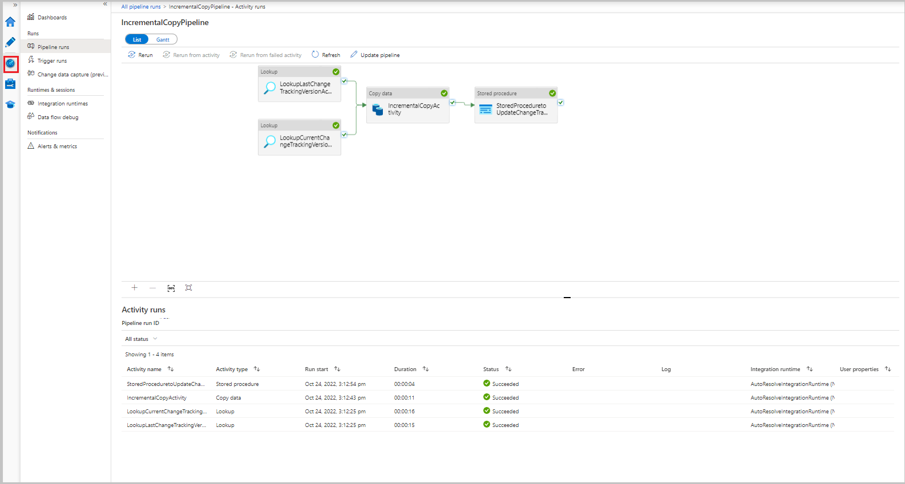

# Incrementally copy data from Azure SQL Database to Blob Storage by using change tracking in the Azure portal

[!INCLUDE[appliesto-adf-asa-md](includes/appliesto-adf-asa-md.md)]

In a data integration solution, incrementally loading data after initial data loads is a widely used scenario. In some cases, the changed data within a period in your source data store can be easily sliced (for example, `LastModifyTime`, `CreationTime`). But then there's no explicit way to identify the delta data from last time that you processed the data. You can use the change tracking technology supported by data stores such as Azure SQL Database and SQL Server to identify the delta data.  

This tutorial describes how to use Azure Data Factory with SQL change tracking technology to incrementally load delta data from Azure SQL Database into Azure Blob Storage. For more concrete information about SQL change tracking technology, see [Change tracking in SQL Server](/sql/relational-databases/track-changes/about-change-tracking-sql-server).

You perform the following steps in this tutorial:

> [!div class="checklist"]
> * Prepare the source data store.
> * Create a data factory.
> * Create linked services.
> * Create source, sink, and change tracking datasets.
> * Create, run, and monitor the full copy pipeline.
> * Add or update data in the source table.
> * Create, run, and monitor the incremental copy pipeline.

## End-to-end workflow
Here are the typical end-to-end workflow steps to incrementally load data by using change tracking.

> [!NOTE]
> Both Azure SQL Database and SQL Server support change tracking. This tutorial uses Azure SQL Database as the source data store. You can also use a SQL Server instance.

1. **Initial loading of historical data** (run once):
    1. Enable change tracking technology in the source database in Azure SQL Database.
    2. Get the initial value of SYS_CHANGE_VERSION in the database as the baseline to capture changed data.
    3. Load full data from the source database into an Azure blob storage.
2. **Incremental loading of delta data on a schedule** (run periodically after the initial loading of data):
    1. Get the old and new SYS_CHANGE_VERSION values.
    3. Load the delta data by joining the primary keys of changed rows (between two SYS_CHANGE_VERSION values) from **sys.change_tracking_tables** with data in the **source table**, and then move the delta data to destination.
    4. Update the SYS_CHANGE_VERSION for the delta loading next time.

## High-level solution
In this tutorial, you create two pipelines that perform the following two operations:  

1. **Initial load:** you create a pipeline with a copy activity that copies the entire data from the source data store (Azure SQL Database) to the destination data store (Azure Blob Storage).

    :::image type="content" source="media/tutorial-incremental-copy-change-tracking-feature-portal/full-load-flow-diagram.png" alt-text="Full loading of data":::
1.  **Incremental load:** you create a pipeline with the following activities, and run it periodically.
    1. Create **two lookup activities** to get the old and new SYS_CHANGE_VERSION from Azure SQL Database and pass it to copy activity.
    2. Create **one copy activity** to copy the inserted/updated/deleted data between the two SYS_CHANGE_VERSION values from Azure SQL Database to Azure Blob Storage.
    3. Create **one stored procedure activity** to update the value of SYS_CHANGE_VERSION for the next pipeline run.

    :::image type="content" source="media/tutorial-incremental-copy-change-tracking-feature-portal/incremental-load-flow-diagram.png" alt-text="Increment load flow diagram":::


If you don't have an Azure subscription, create a [free](https://azure.microsoft.com/free/) account before you begin.

## Prerequisites
* **Azure SQL Database**. You use the database as the **source** data store. If you don't have a database in Azure SQL Database, see the [Create a database in Azure SQL Database](/azure/azure-sql/database/single-database-create-quickstart) article for steps to create one.
* **Azure Storage account**. You use the blob storage as the **sink** data store. If you don't have an Azure storage account, see the [Create a storage account](../storage/common/storage-account-create.md) article for steps to create one. Create a container named **adftutorial**. 

### Create a data source table in Azure SQL Database

1. Launch **SQL Server Management Studio**, and connect to SQL Database.
2. In **Server Explorer**, right-click your **database** and choose the **New Query**.
3. Run the following SQL command against your database to create a table named `data_source_table` as data source store.  

    ```sql
    create table data_source_table
    (
        PersonID int NOT NULL,
        Name varchar(255),
        Age int
        PRIMARY KEY (PersonID)
    );
    INSERT INTO data_source_table
        (PersonID, Name, Age)
    VALUES
        (1, 'aaaa', 21),
        (2, 'bbbb', 24),
        (3, 'cccc', 20),
        (4, 'dddd', 26),
        (5, 'eeee', 22);
    ```

4. Enable change tracking on your database and the source table (data_source_table) by running the following SQL query:

    > [!NOTE]
    > - Replace `<your database name>` with the name of the database in Azure SQL Database that has `data_source_table`.
    > - The changed data is kept for two days in the current example. If you load the changed data for every three days or more, some changed data is not included.  You need to either change the value of CHANGE_RETENTION to a bigger number. Alternatively, ensure that your period to load the changed data is within two days. For more information, see [Enable change tracking for a database](/sql/relational-databases/track-changes/enable-and-disable-change-tracking-sql-server#enable-change-tracking-for-a-database)

    ```sql
    ALTER DATABASE <your database name>
    SET CHANGE_TRACKING = ON  
    (CHANGE_RETENTION = 2 DAYS, AUTO_CLEANUP = ON)  
    ALTER TABLE data_source_table
    ENABLE CHANGE_TRACKING  
    WITH (TRACK_COLUMNS_UPDATED = ON)
    ```
5. Create a new table and store `ChangeTracking_version` with a default value by running the following query:

    ```sql
    create table table_store_ChangeTracking_version
    (
        TableName varchar(255),
        SYS_CHANGE_VERSION BIGINT,
    );
    DECLARE @ChangeTracking_version BIGINT
    SET @ChangeTracking_version = CHANGE_TRACKING_CURRENT_VERSION();  
    INSERT INTO table_store_ChangeTracking_version
    VALUES ('data_source_table', @ChangeTracking_version)
    ```

    > [!NOTE]
    > If the data is not changed after you enabled the change tracking for SQL Database, the value of the change tracking version is `0`.
6. Run the following query to create a stored procedure in your database. The pipeline invokes this stored procedure to update the change tracking version in the table you created in the previous step.
    
    ```sql
    CREATE PROCEDURE Update_ChangeTracking_Version @CurrentTrackingVersion BIGINT, @TableName varchar(50)
    AS
    BEGIN
    UPDATE table_store_ChangeTracking_version
    SET [SYS_CHANGE_VERSION] = @CurrentTrackingVersion
    WHERE [TableName] = @TableName
    END    
    ```

### Azure PowerShell

[!INCLUDE [updated-for-az](../../includes/updated-for-az.md)]

Install the latest Azure PowerShell modules by following  instructions in [How to install and configure Azure PowerShell](/powershell/azure/install-Az-ps).

## Create a data factory

1. Launch **Microsoft Edge** or **Google Chrome** web browser. Currently, Data Factory UI is supported only in Microsoft Edge and Google Chrome web browsers.
1. On the left menu, select **Create a resource** > **Data + Analytics** > **Data Factory**:

    
1. In the **New data factory** page, enter **ADFTutorialDataFactory** for the **name**.

    
1. The name of the Azure Data Factory must be **globally unique**. If you receive the following error, change the name of the data factory (for example, yournameADFTutorialDataFactory) and try creating again. See [Data Factory - Naming Rules](naming-rules.md) article for naming rules for Data Factory artifacts.

   *Data factory name “ADFTutorialDataFactory” is not available*
3. Select your Azure **subscription** in which you want to create the data factory.
4. For the **Resource Group**, do one of the following steps:

   - Select **Use existing**, and select an existing resource group from the drop-down list.
   - Select **Create new**, and enter the name of a resource group.   
         
   To learn about resource groups, see [Using resource groups to manage your Azure resources](../azure-resource-manager/management/overview.md).  
1. Select **V2** for the **version**.
1. Select the **Region** for the data factory. Only locations that are supported are displayed in the drop-down list. The data stores (Azure Storage, Azure SQL Database, etc.) and computes (HDInsight, etc.) used by data factory can be in other regions.
1. Select **Next : Git configuration** and setup the repository following the instructions in [Configuration method 4: During factory creation](/azure/data-factory/source-control) or select **Configure Git later** checkbox.
    
1. Select **Review + create**.     
7. Select **Create**.      
8. On the dashboard, you see the following tile with status: **Deploying data factory**.

	:::image type="content" source="media/tutorial-incremental-copy-change-tracking-feature-portal/deploying-data-factory.png" alt-text="deploying data factory tile":::
1. After the creation is complete, you see the **Data Factory** page as shown in the image.
1. Select **Launch studio** tile to launch the Azure Data Factory user interface (UI) in a separate tab.
11. In the home page, switch to the **Manage** tab in the left panel as shown in the following image:

## Create linked services
You create linked services in a data factory to link your data stores and compute services to the data factory. In this section, you create linked services to your Azure Storage account and your database in Azure SQL Database.

### Create Azure Storage linked service
In this step, you link your Azure Storage Account to the data factory.

1. Go to **Linked services** in **Connections** under **Manage** tab and select **+ New** or select **Create linked service** button.
   
1. In the **New Linked Service** window, select **Azure Blob Storage**, and select **Continue**.

1. In the **New Linked Service** window, do the following steps:
1. Enter **AzureStorageLinkedService** for the **Name** field.
1. Select the integration runtime in **Connect via integrationruntime**.
1. Select the integration runtime in **Connect via integrationruntime**.
1. Select the **Authentication type**.
1. Select your Azure Storage account for **Storage account name**.
1. Select **Create**.
### Create Azure SQL Database linked service.
In this step, you link your database to the data factory.

1. Select **Linked services** under **Connections**, and select **+ New**.
1. In the **New Linked Service** window, select **Azure SQL Database**, and select **Continue**.
1. In the **New Linked Service** window, do the following steps:

    1. Enter **AzureSqlDatabaseLinkedService** for the **Name** field.
    2. Select your server for the **Server name** field.
1. Select your database for the **Database name** field.
1. Select the authentication type for the **Authentication type** field.
1. We are using SQL authentication for this demo, enter name of the user for the **User name** field.
1. Enter password for the user for the **Password** field or provide the **Azure Key Vault - AKV linked service** name, **Secret name** and **secret version**.
1. Select **Test connection** to test connection.
1. Select **Create** to create the linked service.
## Create datasets
In this step, you create datasets to represent data source, data destination. and the place to store the SYS_CHANGE_VERSION.

### Create a dataset to represent source data
In this step, you create a dataset to represent the source data.

1. Select **+ (plus)** and select **Dataset** in the treeview under the **Author** tab or select the ellipsis for Dataset actions.
   
1. Select **Azure SQL Database**, and select **Continue**.
1. In the **Set Properties** window, do the following steps:
   1. Set the name of the dataset to **SourceDataset**.
   1. Select **AzureSqlDatabaseLinkedService** for **Linked service**.
   1. Select **dbo.data_source_table** for **Table name.**
   1. Select the radio button to **Import schema** for **From connection/store**.
1. Select **OK**.

     

### Create a dataset to represent data copied to sink data store.
In this step, you create a dataset to represent the data that is copied from the source data store. You created the adftutorial container in your Azure Blob Storage as part of the prerequisites. Create the container if it does not exist (or) set it to the name of an existing one. In this tutorial, the output file name is dynamically generated by using the expression: `@CONCAT('Incremental-', pipeline().RunId, '.txt')`.

1. Select **+ (plus)** and select **Dataset** in the treeview under the **Author** tab or select the ellipsis for Dataset actions.
   
1. Select **Azure Blob Storage**, and select **Continue**.
1. Select the format of the data type as **DelimitedText** and select **Continue**.
1. In the **Set** **properties** window, change the name of the dataset to **SinkDataset**.
1. In the  **Set properties** window, do the following steps:
1. Change the name of the dataset to **SinkDataset**.
1. Change the name of the dataset to **SinkDataset**.
1. Select **AzureBlobStorageLinkedService** for **Linked service**.
1. Enter **adftutorial/incchgtracking** for **folder** part of the **filePath**.
1. Select **OK**.

   
1. The dataset will be visible in the treeview, do the following steps:
   1. In **Connection** tab, select the text box field for **File name**. **Add dynamic content** option will appear, select it.
       
   1. Select **Add dynamic content[Alt+Shift+D].**
   1. **Pipeline expression builder**  window will appear. Paste the following in the text box filed, @concat('Incremental-',pipeline().RunId,'.csv')
   1. Select **OK**.
### Create a dataset to represent change tracking data
In this step, you create a dataset for storing the change tracking version.  You created the table table_store_ChangeTracking_version as part of the prerequisites.

1. In the treeview, select **+ (plus)**, and select **Dataset**.
1. Select **Azure SQL Database**, and select **Continue**.
1. In the **Set Properties** window, do the following steps:
1. Set the name of the dataset to **ChangeTrackingDataset**.
1. Select **AzureSqlDatabaseLinkedService** for **Linked service**.
1. Select **dbo.table_store_ChangeTracking_version** for **Table name.**
1. Select the radio button to **Import schema** for **From connection/store**.
1. Select **OK**.
## Create a pipeline for the full copy
In this step, you create a pipeline with a copy activity that copies the entire data from the source data store (Azure SQL Database) to the destination data store (Azure Blob Storage).

1. Select **+ (plus)** in the left pane, and select **Pipeline > Pipeline**.
   
1. You see a new tab for configuring the pipeline. You also see the pipeline in the treeview. In the **Properties** window, change the name of the pipeline to **FullCopyPipeline**.
1. In the **Activities** toolbox, expand **Move & transform**, and drag-drop the **Copy** activity to the pipeline designer surface or search the **copy data** activity in search bar under **Activities**, and set the name **FullCopyActivity**.
1. Switch to the **Source** tab, and select **SourceDataset** for the **Source Dataset** field.
1. Switch to the **Sink** tab, and select **SinkDataset** for the **Sink Dataset** field.

1. To validate the pipeline definition, select **Validate** on the toolbar. Confirm that there is no validation error. Close the **Pipeline Validation output** by selecting **Close**.
1. To publish entities (linked services, datasets, and pipelines), select **Publish all**. Wait until the publishing succeeds.
8. Wait until you see the **Successfully published** message.

    :::image type="content" source="./media/tutorial-incremental-copy-change-tracking-feature-portal/publishing-succeeded.png" alt-text="Publishing succeeded":::
1. You can also see notifications by selecting the **Show Notifications** button on the left. To close the notifications window, select **X** or **Close**  button on the bottom of the plane.
### Run the full copy pipeline
1. Select **Add** **trigger** on the toolbar for the pipeline, and select **Trigger Now**.
   
1. Select **OK** on the Pipeline run window.
	
   

### Monitor the full copy pipeline

1. Select the **Monitor** tab on the left. You see the pipeline run in the list and its status. To refresh the list, select **Refresh**. Hover on the pipeline run to get the option to **Rerun** or check **consumption**.
   
1. To view activity runs associated with the pipeline run, select the pipeline name from **Pipeline name** column. There is only one activity in the pipeline, so you see only one entry in the list. To switch back to the pipeline runs view, select **All** **pipeline runs** link at the top.
### Review the results
You see a file named `incremental-<GUID>.csv` in the `incchgtracking` folder of the `adftutorial` container.

The file should have the data from your database:

```

PersonID,Name,Age
1,"aaaa",21
2,"bbbb",24
3,"cccc",20
4,"dddd",26
5,"eeee",22

5,eeee,PersonID,Name,Age
1,"aaaa",21
2,"bbbb",24
3,"cccc",20
4,"dddd",26
5,"eeee",22

```
## Add more data to the source table

Run the following query against your database to add a row and update a row.

```sql
INSERT INTO data_source_table
(PersonID, Name, Age)
VALUES
(6, 'new','50');


UPDATE data_source_table
SET [Age] = '10', [name]='update' where [PersonID] = 1

```

## Create a pipeline for the delta copy
In this step, you create a pipeline with the following activities, and run it periodically. The **lookup activities** get the old and new SYS_CHANGE_VERSION from Azure SQL Database and pass it to copy activity. The **copy activity** copies the inserted/updated/deleted data between the two SYS_CHANGE_VERSION values from Azure SQL Database to Azure Blob Storage. The **stored procedure activity** updates the value of SYS_CHANGE_VERSION for the next pipeline run.

1. In the Data Factory UI, switch to the **Author** tab. Select **+ (plus)** in the left pane treeview, and select **Pipeline > Pipeline**.
   
   
2. You see a new tab for configuring the pipeline. You also see the pipeline in the treeview. In the **Properties** window, change the name of the pipeline to **IncrementalCopyPipeline**.

3. Expand **General** in the **Activities** toolbox, and drag-drop the **Lookup** activity to the pipeline designer surface or search in the **Search activities** search box. Set the name of the activity to **LookupLastChangeTrackingVersionActivity**. This activity gets the change tracking version used in the last copy operation that is stored in the table **table_store_ChangeTracking_version**.
4. Switch to the **Settings** in the **Properties** window, and select **ChangeTrackingDataset** for the **Source Dataset** field.

5. Drag-and-drop the **Lookup** activity from the **Activities** toolbox to the pipeline designer surface. Set the name of the activity to **LookupCurrentChangeTrackingVersionActivity**. This activity gets the current change tracking version.

6. Switch to the **Settings** in the **Properties** window, and do the following steps:

   1. Select **SourceDataset** for the **Source Dataset** field.
   2. Select **Query** for **Use Query**.
   3. Enter the following SQL query for **Query**.
   
      ```sql
      SELECT CHANGE_TRACKING_CURRENT_VERSION() as CurrentChangeTrackingVersion
      ```

      
7. In the **Activities** toolbox, expand **Move & transform**, drag-drop the **Copy** **data** activity to the pipeline designer surface. Set the name of the activity to **IncrementalCopyActivity**. This activity copies the data between last change tracking version and the current change tracking version to the destination data store.
8. Switch to the **Source** tab in the **Properties** window, and do the following steps:

   1. Select **SourceDataset** for **Source Dataset**.
   2. Select **Query** for **Use Query**.
   3. Enter the following SQL query for **Query**.

      ```sql
      SELECT data_source_table.PersonID,data_source_table.Name,data_source_table.Age, CT.SYS_CHANGE_VERSION, SYS_CHANGE_OPERATION from data_source_table RIGHT OUTER JOIN CHANGETABLE(CHANGES data_source_table, @{activity('LookupLastChangeTrackingVersionActivity').output.firstRow.SYS_CHANGE_VERSION}) AS CT ON data_source_table.PersonID = CT.PersonID where CT.SYS_CHANGE_VERSION <= @{activity('LookupCurrentChangeTrackingVersionActivity').output.firstRow.CurrentChangeTrackingVersion}
      ```

      
   
9. Switch to the **Sink** tab, and select **SinkDataset** for the **Sink Dataset** field.

10. **Connect both Lookup activities to the Copy activity** one by one. Drag the **green** button attached to the **Lookup** activity to the **Copy** activity.

11. Drag-and-drop the **Stored Procedure** activity from the **Activities** toolbox to the pipeline designer surface. Set the name of the activity to **StoredProceduretoUpdateChangeTrackingActivity**. This activity updates the change tracking version in the **table_store_ChangeTracking_version** table.

12. Switch to the **Settings** tab, and do the following steps:
	
	1. Select **AzureSqlDatabaseLinkedService** for **Linked service**.
	2. For **Stored procedure name**, select **Update_ChangeTracking_Version**.  
	3. Select **Import**.
	4. In the **Stored procedure parameters** section, specify following values for the parameters:

        | Name | Type | Value |
        | ---- | ---- | ----- |
        | CurrentTrackingVersion | Int64 | @{activity('LookupCurrentChangeTrackingVersionActivity').output.firstRow.CurrentChangeTrackingVersion} |
        | TableName | String | @{activity('LookupLastChangeTrackingVersionActivity').output.firstRow.TableName} |

   
   
13. **Connect the Copy activity to the Stored Procedure Activity**. Drag-and-drop the **green** button attached to the Copy activity to the Stored Procedure activity.

14. Select **Validate** on the toolbar. Confirm that there are no validation errors. Close the **Pipeline Validation Report** window by selecting **Close**.
15. Publish entities (linked services, datasets, and pipelines) to the Data Factory service by selecting the **Publish All** button. Wait until you see the **Publishing succeeded** message.

      

### Run the incremental copy pipeline
1. Select **Trigger** on the toolbar for the pipeline, and select **Trigger Now**.

      
2. In the **Pipeline Run** window, select **OK**.

### Monitor the incremental copy pipeline
1. Select the **Monitor** tab on the left. You see the pipeline run in the list and its status. To refresh the list, select **Refresh**. The links in the **Pipeline name** column let you view activity runs associated with the pipeline run and to rerun the pipeline.
   
1. To view activity runs associated with the pipeline run, select the **IncrementalCopyPipeline** link in the **Pipeline name** column.
   

### Review the results
You see the second file in the `incchgtracking` folder of the `adftutorial` container.

The file should have only the delta data from your database. The record with `U` is the updated row in the database and `I` is the one added row.

```
PersonID,Name,Age,SYS_CHANGE_VERSION,SYS_CHANGE_OPERATION
1,update,10,2,U
6,new,50,1,I
```
The first three columns are changed data from data_source_table. The last two columns are the metadata from change tracking system table. The fourth column is the SYS_CHANGE_VERSION for each changed row. The fifth column is the operation:  U = update, I = insert.  For details about the change tracking information, see [CHANGETABLE](/sql/relational-databases/system-functions/changetable-transact-sql).

```
==================================================================
PersonID Name    Age    SYS_CHANGE_VERSION    SYS_CHANGE_OPERATION
==================================================================
1        update  10            2                                 U
6        new     50	       1                            	 I
```

## Next steps
Advance to the following tutorial to learn about copying new and changed files only based on `LastModifiedDate`:

> [!div class="nextstepaction"]
> [Copy new files by lastmodifieddate](tutorial-incremental-copy-lastmodified-copy-data-tool.md)


