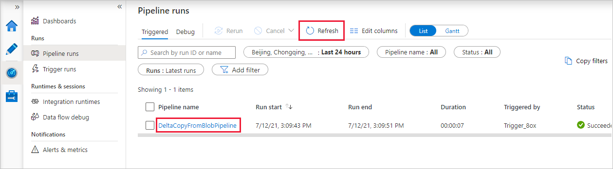

# Incrementally copy new and changed files based on LastModifiedDate by using the Copy Data tool

[!INCLUDE[appliesto-adf-xxx-md](includes/appliesto-adf-xxx-md.md)]

In this tutorial, you'll use the Azure portal to create a data factory. You'll then use the Copy Data tool to create a pipeline that incrementally copies new and changed files only, from Azure Blob storage to Azure Blob storage. It uses `LastModifiedDate` to determine which files to copy.

After you complete the steps here, Azure Data Factory will scan all the files in the source store, apply the file filter by `LastModifiedDate`, and copy to the destination store only files that are new or have been updated since last time. Note that if Data Factory scans large numbers of files, you should still expect long durations. File scanning is time consuming, even when the amount of data copied is reduced.

> [!NOTE]
> If you're new to Data Factory, see [Introduction to Azure Data Factory](introduction.md).

In this tutorial, you'll complete these tasks:

> [!div class="checklist"]
> * Create a data factory.
> * Use the Copy Data tool to create a pipeline.
> * Monitor the pipeline and activity runs.

## Prerequisites

* **Azure subscription**: If you don't have an Azure subscription, create a [free account](https://azure.microsoft.com/free/) before you begin.
* **Azure Storage account**: Use Blob storage for the source and sink data stores. If you don't have an Azure Storage account, follow the instructions in [Create a storage account](../storage/common/storage-account-create.md).

## Create two containers in Blob storage

Prepare your Blob storage for the tutorial by completing these steps:

1. Create a container named **source**. You can use various tools to perform this task, like [Azure Storage Explorer](https://storageexplorer.com/).

2. Create a container named **destination**.

## Create a data factory

1. In the left pane, select **Create a resource**. Select **Analytics** > **Data Factory**:

   

2. On the **New data factory** page, under **Name**, enter **ADFTutorialDataFactory**.

   The name for your data factory must be globally unique. You might receive this error message:

   

   If you receive an error message about the name value, enter a different name for the data factory. For example, use the name _**yourname**_**ADFTutorialDataFactory**. For the naming rules for Data Factory artifacts, see [Data Factory naming rules](naming-rules.md).
3. Under **Subscription**, select the Azure subscription in which you'll create the new data factory.
4. Under **Resource Group**, take one of these steps:

    * Select **Use existing** and then select an existing resource group in the list.

    * Select **Create new** and then enter a name for the resource group.
         
    To learn about resource groups, see [Use resource groups to manage your Azure resources](../azure-resource-manager/management/overview.md).

5. Under **Version**, select **V2**.
6. Under **Location**, select the location for the data factory. Only supported locations appear in the list. The data stores (for example, Azure Storage and Azure SQL Database) and computes (for example, Azure HDInsight) that your data factory uses can be in other locations and regions.
8. Select **Create**.
9. After the data factory is created, the data factory home page appears.
10. To open the Azure Data Factory user interface (UI) on a separate tab, select the **Author & Monitor** tile:

    

## Use the Copy Data tool to create a pipeline

1. On the **Let's get started** page, select the **Copy Data** tile to open the Copy Data tool:

   

2. On the **Properties** page, take the following steps:

    a. Under **Task name**, enter **DeltaCopyFromBlobPipeline**.

    b. Under **Task cadence or Task schedule**, select **Run regularly on schedule**.

    c. Under **Trigger type**, select **Tumbling window**.

    d. Under **Recurrence**, enter **15 Minute(s)**.

    e. Select **Next**.

    Data Factory creates a pipeline with the specified task name.

    

3. On the **Source data store** page, complete these steps:

    a. Select  **Create new connection** to add a connection.

    b. Select **Azure Blob Storage** from the gallery, and then select **Continue**:

    

    c. On the **New Linked Service (Azure Blob Storage)** page, select your storage account from the **Storage account name** list. Test the connection and then select **Create**.

    d. Select the new linked service and then select **Next**:

   

4. On the **Choose the input file or folder** page, complete the following steps:

    a. Browse for and select the **source** folder, and then select **Choose**.

    

    b. Under **File loading behavior**, select **Incremental load: LastModifiedDate**.

    c. Select **Binary copy** and then select **Next**:

     

5. On the **Destination data store** page, select the **AzureBlobStorage** service that you created. This is the same storage account as the source data store. Then select **Next**.

6. On the **Choose the output file or folder** page, complete the following steps:

    a. Browse for and select the **destination** folder, and then select **Choose**:

    

    b. Select **Next**.

7. On the **Settings** page, select **Next**.

8. On the **Summary** page, review the settings and then select **Next**.

    

9. On the **Deployment page**, select **Monitor** to monitor the pipeline (task).

    

10. Notice that the **Monitor** tab on the left is automatically selected. The application switches to the **Monitor** tab. You see the status of the pipeline. Select **Refresh** to refresh the list. Select the link under **PIPELINE NAME** to view activity run details or to run the pipeline again.

    

11. There's only one activity (the copy activity) in the pipeline, so you see only one entry. For details about the copy operation, select the **Details** link (the eyeglasses icon) in the **ACTIVITY NAME** column. For details about the properties, see [Copy activity overview](copy-activity-overview.md).

    

    Because there are no files in the source container in your Blob storage account, you won't see any files copied to the destination container in the account:

    

12. Create an empty text file and name it **file1.txt**. Upload this text file to the source container in your storage account. You can use various tools to perform these tasks, like [Azure Storage Explorer](https://storageexplorer.com/).

    

13. To go back to the **Pipeline runs** view, select **All pipeline runs**, and wait for the same pipeline to be automatically triggered again.  

14. When the second pipeline run completes, follow the same steps mentioned previously to review the activity run details.  

    You'll see that one file (file1.txt) has been copied from the source container to the destination container of your Blob storage account:

    

15. Create another empty text file and name it **file2.txt**. Upload this text file to the source container in your Blob storage account.

16. Repeat steps 13 and 14 for the second text file. You'll see that only the new file (file2.txt) was copied from the source container to the destination container of your storage account during this pipeline run.  

    You can also verify that only one file has been copied by using [Azure Storage Explorer](https://storageexplorer.com/) to scan the files:

    

## Next steps
Go to the following tutorial to learn how to transform data by using an Apache Spark cluster on Azure:

> [!div class="nextstepaction"]
>[Transform data in the cloud by using an Apache Spark cluster](tutorial-transform-data-spark-portal.md)
