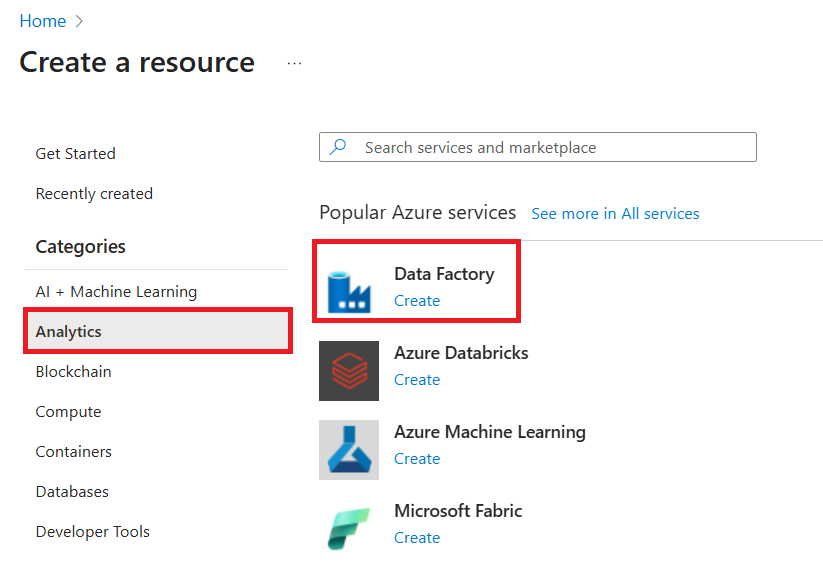
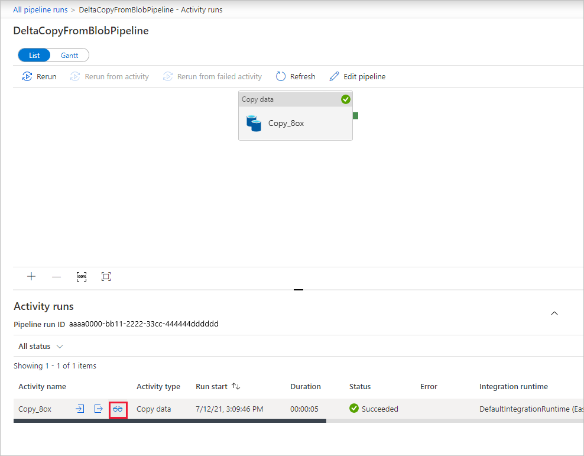

# Incrementally copy new and changed files based on LastModifiedDate by using the Copy Data tool

In this tutorial, you'll use the Azure portal to create a data factory. Then, you'll use the Copy Data tool to create a pipeline that incrementally copies new and changed files only, based on their **LastModifiedDate** from Azure Blob storage to Azure Blob storage.

By doing so, ADF will scan all the files from the source store, apply the file filter by their LastModifiedDate, and copy the new and updated file only since last time to the destination store.  Please note that if you let ADF scan huge amounts of files but only copy a few files to destination, you would still expect the long duration due to file scanning is time consuming as well.   

> [!NOTE]
> If you're new to Azure Data Factory, see [Introduction to Azure Data Factory](introduction.md).

In this tutorial, you will perform the following tasks:

> [!div class="checklist"]
> * Create a data factory.
> * Use the Copy Data tool to create a pipeline.
> * Monitor the pipeline and activity runs.

## Prerequisites

* **Azure subscription**: If you don't have an Azure subscription, create a [free account](https://azure.microsoft.com/free/) before you begin.
* **Azure storage account**: Use Blob storage as the _source_ and _sink_ data store. If you don't have an Azure storage account, see the instructions in [Create a storage account](../storage/common/storage-account-create.md).

### Create two containers in Blob storage

Prepare your Blob storage for the tutorial by performing these steps.

1. Create a container named **source**. You can use various tools to perform this task, such as [Azure Storage Explorer](https://storageexplorer.com/).

2. Create a container named **destination**.

## Create a data factory

1. On the left menu, select **Create a resource** > **Data + Analytics** > **Data Factory**:

   

2. On the **New data factory** page, under **Name**, enter **ADFTutorialDataFactory**.

   The name for your data factory must be _globally unique_. You might receive the following error message:

   

   If you receive an error message about the name value, enter a different name for the data factory. For example, use the name _**yourname**_**ADFTutorialDataFactory**. For the naming rules for Data Factory artifacts, see [Data Factory naming rules](naming-rules.md).
3. Select the Azure **subscription** in which you'll create the new data factory.
4. For **Resource Group**, take one of the following steps:

    * Select **Use existing** and select an existing resource group from the drop-down list.

    * Select **Create new** and enter the name of a resource group. 
         
    To learn about resource groups, see [Use resource groups to manage your Azure resources](../azure-resource-manager/management/overview.md).

5. Under **version**, select **V2**.
6. Under **location**, select the location for the data factory. Only supported locations are displayed in the drop-down list. The data stores (for example, Azure Storage and SQL Database) and computes (for example, Azure HDInsight) that your data factory uses can be in other locations and regions.
7. Select **Pin to dashboard**.
8. Select **Create**.
9. On the dashboard, refer to the **Deploying Data Factory** tile to see the process status.

	
10. After creation is finished, the **Data Factory** home page is displayed.

    
11. To open the Azure Data Factory user interface (UI) on a separate tab, select the **Author & Monitor** tile.

## Use the Copy Data tool to create a pipeline

1. On the **Let's get started** page, select the **Copy Data** title to open the Copy Data tool.

   

2. On the **Properties** page, take the following steps:

	a. Under **Task name**, enter **DeltaCopyFromBlobPipeline**.

	b. Under **Task cadence** or **Task schedule**, select **Run regularly on schedule**.

	c. Under **Trigger Type**, select **Tumbling Window**.

	d. Under **Recurrence**, enter **15 Minute(s)**.

	e. Select **Next**.

	The Data Factory UI creates a pipeline with the specified task name.

    

3. On the **Source data store** page, complete the following steps:

	a. Select  **+ Create new connection**, to add a connection.

	

    b. Select **Azure Blob Storage** from the gallery, and then select **Continue**.

	

	c. On the **New Linked Service** page, select your storage account from the **Storage account name** list and then select **Finish**.

	

    d. Select the newly created linked service and then select **Next**.

   

4. On the **Choose the input file or folder** page, complete the following steps:

    a. Browse and select the **source** folder, and then select **Choose**.

    

	b. Under **File loading behavior**, select **Incremental load: LastModifiedDate**.

    

	c. Check **Binary copy** and select **Next**.

	 

5. On the **Destination data store** page, select **AzureBlobStorage**. This is the same storage account as the source data store. Then select **Next**.

	

6. On the **Choose the output file or folder** page, complete the following steps:

    a. Browse and select the **destination** folder, and then select **Choose**.

    

	b. Select **Next**.

	 

7. On the **Settings** page, select **Next**.

    

8. On the **Summary** page, review the settings and then select **Next**.

    

9. On the **Deployment page**, select **Monitor** to monitor the pipeline (task).

    

10. Notice that the **Monitor** tab on the left is automatically selected. The **Actions** column includes links to view activity run details and to rerun the pipeline. Select **Refresh** to refresh the list, and select the **View Activity Runs** link in the **Actions** column.

	

11. There's only one activity (the copy activity) in the pipeline, so you see only one entry. For details about the copy operation, select the **Details** link (eyeglasses icon) in the **Actions** column.

	

	Because there is no file in the **source** container in your Blob storage account, you will not see any file copied to the **destination** container in your Blob storage account.

	

12. Create an empty text file and name it **file1.txt**. Upload this text file to the **source** container in your storage account. You can use various tools to perform these tasks, such as [Azure Storage Explorer](https://storageexplorer.com/).

	

13. To go back to the **Pipeline Runs** view, select **All Pipeline Runs**, and wait for the same pipeline to be triggered again automatically.  

	

14. Select **View Activity Run** for the second pipeline run when you see it. Then review the details in the same way you did for the first pipeline run.  

	

	You will that see one file (file1.txt) has been copied from the **source** container to the **destination** container of your Blob storage account.

	

15. Create another empty text file and name it **file2.txt**. Upload this text file to the **source** container in your Blob storage account.

16. Repeat steps 13 and 14 for this second text file. You will see that only the new file (file2.txt) has been copied from the **source** container to the **destination** container of your storage account in the next pipeline run.  

	

	You can also verify this by using [Azure Storage Explorer](https://storageexplorer.com/) to scan the files.

	

## Next steps
Advance to the following tutorial to learn about transforming data by using an Apache Spark cluster on Azure:

> [!div class="nextstepaction"]
>[Transform data in the cloud by using an Apache Spark cluster](tutorial-transform-data-spark-portal.md)
