# Incrementally load data from multiple tables in SQL Server to an Azure SQL database
In this tutorial, you create an Azure data factory with a pipeline that loads delta data from multiple tables in on-premises SQL Server to an Azure SQL database.    

You perform the following steps in this tutorial:

> [!div class="checklist"]
> * Prepare source and destination data stores.
> * Create a data factory.
> * Create a self-hosted integration runtime.
> * Install the integration runtime. 
> * Create linked services. 
> * Create source, sink, and watermark datasets.
> * Create, run, and monitor a pipeline.
> * Review the results.
> * Add or update data in source tables.
> * Rerun and monitor the pipeline.
> * Review the final results.

## Overview
Here are the important steps to create this solution: 

1. **Select the watermark column**.
	
    Select one column for each table in the source data store, which can be used to identify the new or updated records for every run. Normally, the data in this selected column (for example, last_modify_time or ID) keeps increasing when rows are created or updated. The maximum value in this column is used as a watermark.

1. **Prepare a data store to store the watermark value**.   
	
    In this tutorial, you store the watermark value in a SQL database.

1. **Create a pipeline with the following activities**: 
	
	a. Create a ForEach activity that iterates through a list of source table names that is passed as a parameter to the pipeline. For each source table, it invokes the following activities to perform delta loading for that table.

    b. Create two lookup activities. Use the first Lookup activity to retrieve the last watermark value. Use the second Lookup activity to retrieve the new watermark value. These watermark values are passed to the Copy activity.

	c. Create a Copy activity that copies rows from the source data store with the value of the watermark column greater than the old watermark value and less than the new watermark value. Then, it copies the delta data from the source data store to Azure Blob storage as a new file.

	d. Create a StoredProcedure activity that updates the watermark value for the pipeline that runs next time. 

    Here is the high-level solution diagram: 

    


If you don't have an Azure subscription, create a [free](https://azure.microsoft.com/free/) account before you begin.

## Prerequisites
* **SQL Server**. You use an on-premises SQL Server database as the source data store in this tutorial. 
* **Azure SQL Database**. You use a SQL database as the sink data store. If you don't have a SQL database, see [Create an Azure SQL database](../sql-database/sql-database-get-started-portal.md) for steps to create one. 

### Create source tables in your SQL Server database

1. Open SQL Server Management Studio, and connect to your on-premises SQL Server database.

1. In **Server Explorer**, right-click the database and choose **New Query**.

1. Run the following SQL command against your database to create tables named `customer_table` and `project_table`:

    ```sql
    create table customer_table
    (
        PersonID int,
        Name varchar(255),
        LastModifytime datetime
    );
    
    create table project_table
    (
        Project varchar(255),
        Creationtime datetime
    );
        
    INSERT INTO customer_table
    (PersonID, Name, LastModifytime)
    VALUES
    (1, 'John','9/1/2017 12:56:00 AM'),
    (2, 'Mike','9/2/2017 5:23:00 AM'),
    (3, 'Alice','9/3/2017 2:36:00 AM'),
    (4, 'Andy','9/4/2017 3:21:00 AM'),
    (5, 'Anny','9/5/2017 8:06:00 AM');
    
    INSERT INTO project_table
    (Project, Creationtime)
    VALUES
    ('project1','1/1/2015 0:00:00 AM'),
    ('project2','2/2/2016 1:23:00 AM'),
    ('project3','3/4/2017 5:16:00 AM');
    
    ```

### Create destination tables in your Azure SQL database
1. Open SQL Server Management Studio, and connect to your Azure SQL database.

1. In **Server Explorer**, right-click the database and choose **New Query**.

1. Run the following SQL command against your SQL database to create tables named `customer_table` and `project_table`:  
    
    ```sql
    create table customer_table
    (
        PersonID int,
        Name varchar(255),
        LastModifytime datetime
    );
    
    create table project_table
    (
        Project varchar(255),
        Creationtime datetime
    );

	```

### Create another table in the Azure SQL database to store the high watermark value
1. Run the following SQL command against your SQL database to create a table named `watermarktable` to store the watermark value: 
    
    ```sql
    create table watermarktable
    (
    
        TableName varchar(255),
        WatermarkValue datetime,
    );
    ```
1. Insert initial watermark values for both source tables into the watermark table.

    ```sql

    INSERT INTO watermarktable
    VALUES 
    ('customer_table','1/1/2010 12:00:00 AM'),
    ('project_table','1/1/2010 12:00:00 AM');
    
    ```

### Create a stored procedure in the Azure SQL database 

Run the following command to create a stored procedure in your SQL database. This stored procedure updates the watermark value after every pipeline run. 

```sql
CREATE PROCEDURE usp_write_watermark @LastModifiedtime datetime, @TableName varchar(50)
AS

BEGIN

    UPDATE watermarktable
    SET [WatermarkValue] = @LastModifiedtime 
WHERE [TableName] = @TableName

END

```

### Create data types and additional stored procedures in Azure SQL database
Run the following query to create two stored procedures and two data types in your SQL database. 
They're used to merge the data from source tables into destination tables.

In order to make the journey easy to start with, we directly use these Stored Procedures passing the delta data in via a table variable and then merge the them into destination store. Be cautious that it is not expecting a "large" number of delta rows (more than 100) to be stored in the table variable.  

If you do need to merge a large number of delta rows into the destination store, we suggest you to use copy activity to copy all the delta data into a temporary "staging" table in the destination store first, and then built your own stored procedure without using table variable to merge  them from the “staging” table to the “final” table. 


```sql
CREATE TYPE DataTypeforCustomerTable AS TABLE(
    PersonID int,
    Name varchar(255),
    LastModifytime datetime
);

GO

CREATE PROCEDURE usp_upsert_customer_table @customer_table DataTypeforCustomerTable READONLY
AS

BEGIN
  MERGE customer_table AS target
  USING @customer_table AS source
  ON (target.PersonID = source.PersonID)
  WHEN MATCHED THEN
      UPDATE SET Name = source.Name,LastModifytime = source.LastModifytime
  WHEN NOT MATCHED THEN
      INSERT (PersonID, Name, LastModifytime)
      VALUES (source.PersonID, source.Name, source.LastModifytime);
END

GO

CREATE TYPE DataTypeforProjectTable AS TABLE(
    Project varchar(255),
    Creationtime datetime
);

GO

CREATE PROCEDURE usp_upsert_project_table @project_table DataTypeforProjectTable READONLY
AS

BEGIN
  MERGE project_table AS target
  USING @project_table AS source
  ON (target.Project = source.Project)
  WHEN MATCHED THEN
      UPDATE SET Creationtime = source.Creationtime
  WHEN NOT MATCHED THEN
      INSERT (Project, Creationtime)
      VALUES (source.Project, source.Creationtime);
END

```

## Create a data factory

1. Launch **Microsoft Edge** or **Google Chrome** web browser. Currently, Data Factory UI is supported only in Microsoft Edge and Google Chrome web browsers.
1. Click **New** on the left menu, click **Data + Analytics**, and click **Data Factory**. 
   
   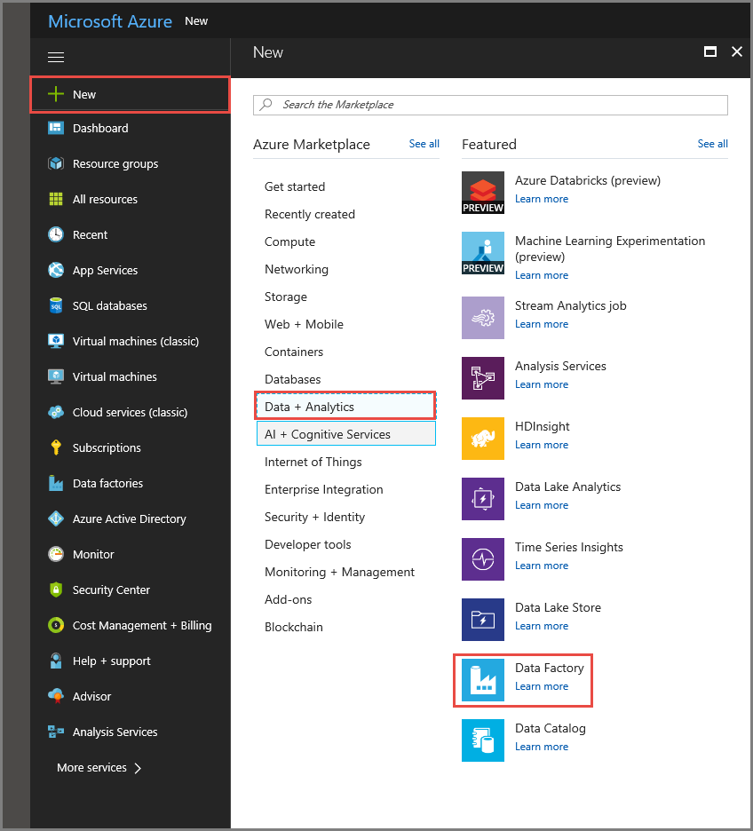
1. In the **New data factory** page, enter **ADFMultiIncCopyTutorialDF** for the **name**. 
      
     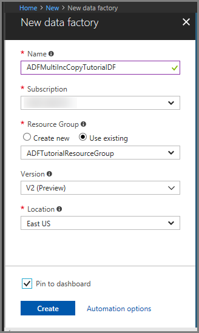
 
   The name of the Azure data factory must be **globally unique**. If you receive the following error, change the name of the data factory (for example, yournameADFMultiIncCopyTutorialDF) and try creating again. See [Data Factory - Naming Rules](naming-rules.md) article for naming rules for Data Factory artifacts.
  
       `Data factory name ADFMultiIncCopyTutorialDF is not available`
1. Select your Azure **subscription** in which you want to create the data factory. 
1. For the **Resource Group**, do one of the following steps:
     
      - Select **Use existing**, and select an existing resource group from the drop-down list. 
      - Select **Create new**, and enter the name of a resource group.   
         
        To learn about resource groups, see [Using resource groups to manage your Azure resources](../azure-resource-manager/resource-group-overview.md).  
1. Select **V2 (Preview)** for the **version**.
1. Select the **location** for the data factory. Only locations that are supported are displayed in the drop-down list. The data stores (Azure Storage, Azure SQL Database, etc.) and computes (HDInsight, etc.) used by data factory can be in other regions.
1. Select **Pin to dashboard**.     
1. Click **Create**.      
1. On the dashboard, you see the following tile with status: **Deploying data factory**. 

	
1. After the creation is complete, you see the **Data Factory** page as shown in the image.
   
   
1. Click **Author & Monitor** tile to launch Azure Data Factory user interface (UI) in a separate tab.
1. In the get started page of Azure Data Factory UI, click **Create pipeline** (or) switch to the **Edit** tab. 

   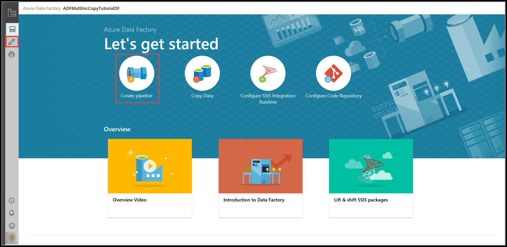

## Create self-hosted integration runtime
As you are moving data from a data store in a private network (on-premises) to an Azure data store, install a self-hosted integration runtime (IR) in your on-premises environment. The self-hosted IR moves data between your private network and Azure. 

1. Click **Connections** at the bottom of the left pane, and switch to the **Integration Runtimes** in the **Connections** window. 

   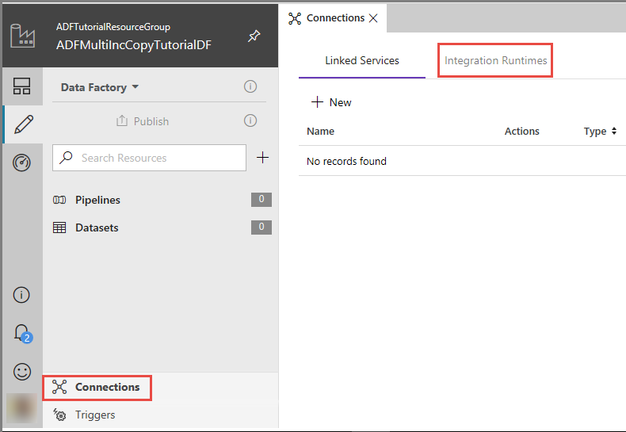
1. In the **Integration Runtimes** tab, click **+ New**. 

   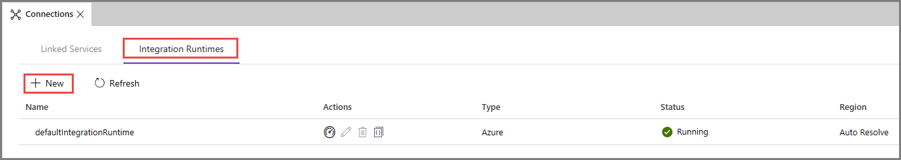
1. In the **Integration Runtime Setup** window, select **Perform data movement and dispatch activities to external computes**, and click **Next**. 

   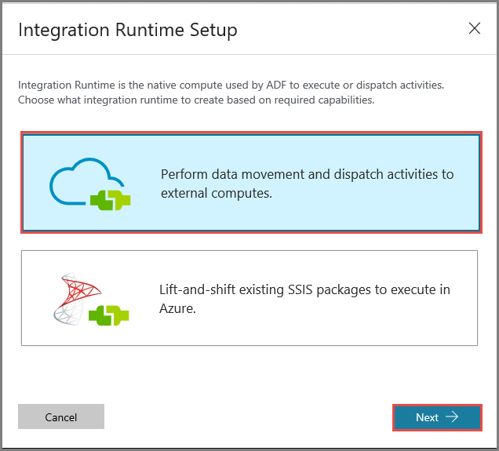
1. Select ** Private Network**, and click **Next**. 

   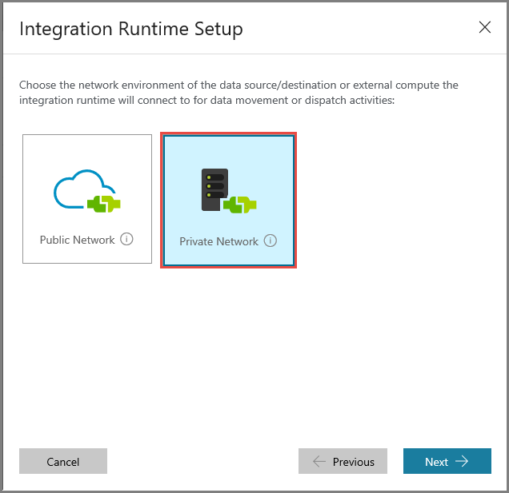
1. Enter **MySelfHostedIR** for **Name**, and click **Next**. 

   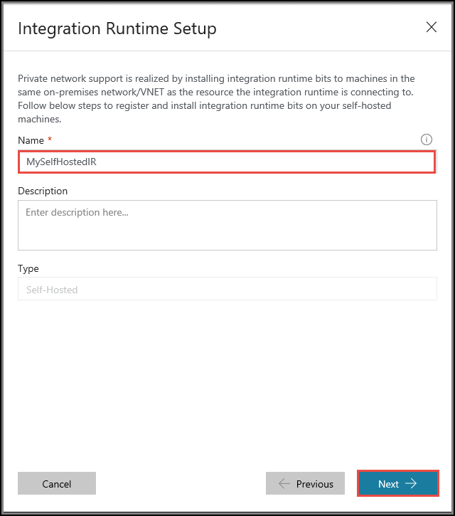
1. Click **Click here to launch the express setup for this computer** in the **Option 1: Express setup** section. 

   
1. In the **Integration Runtime (Self-hosted) Express Setup** window, click **Close**. 

   
1. In the Web browser, in the **Integration Runtime Setup** window, click **Finish**. 

   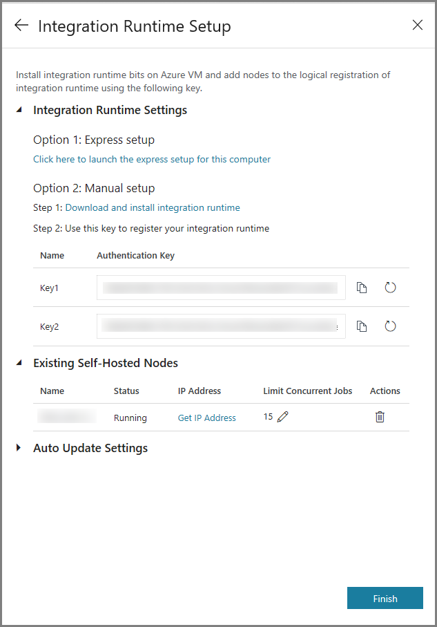
1. Confirm that you see **MySelfHostedIR** in the list of integration runtimes.

    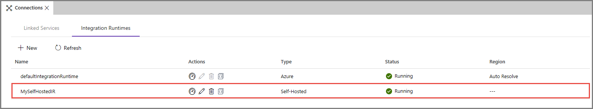

## Create linked services
You create linked services in a data factory to link your data stores and compute services to the data factory. In this section, you create linked services to your on-premises SQL Server database and SQL database. 

### Create the SQL Server linked service
In this step, you link your on-premises SQL Server database to the data factory.

1. In the **Connections** window, switch from **Integration Runtimes** tab to the **Linked Services** tab, and click **+ New**.

    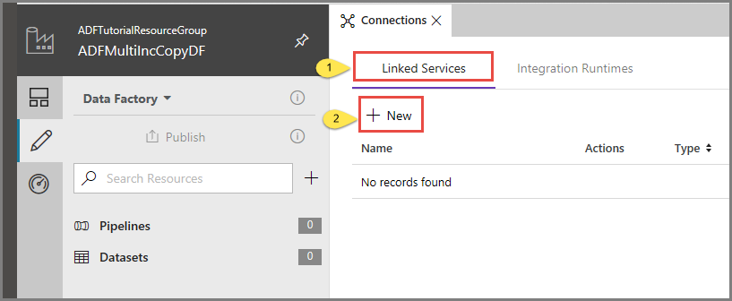
1. In the **New Linked Service** window, select **SQL Server**, and click **Continue**. 

    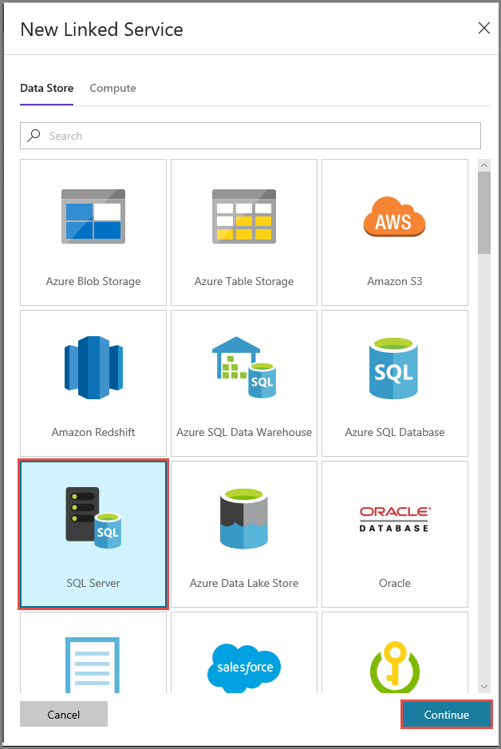
1. In the **New Linked Service** window, do the following steps:

    1. Enter **SqlServerLinkedService** for **Name**. 
    1. Select **MySelfHostedIR** for **Connect via integration runtime**. This is an **important** step. The default integration runtime cannot connect to an on-premises data store. Use the self-hosted integration runtime you created earlier. 
    1. For **Server name**, enter the name of your computer that has the SQL Server database.
    1. For **Database name**, enter the name of the database in your SQL Server that has the source data. You created a table and inserted data into this database as part of the prerequisites. 
    1. For **Authentication type**, select the **type of the authentication** you want to use to connect to the database. 
    1. For **User name**, enter the name of user that has access to the SQL Server database. If you need to use a slash character (`\`) in your user account or server name, use the escape character (`\`). An example is `mydomain\\myuser`.
    1. For **Password**, enter the **password** for the user. 
    1. To test whether Data Factory can connect to your SQL Server database, click **Test connection**. Fix any errors until the connection succeeds. 
    1. To save the linked service, click **Save**.

        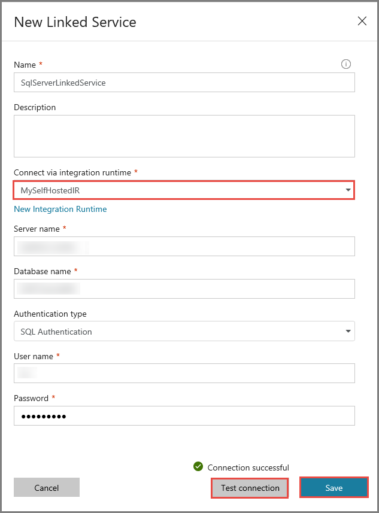

### Create the Azure SQL Database linked service
In the last step, you create a linked service to link your source SQL Server database to the data factory. In this step, you link your destination/sink Azure SQL database to the data factory. 

1. In the **Connections** window, switch from **Integration Runtimes** tab to the **Linked Services** tab, and click **+ New**.

    
1. In the **New Linked Service** window, select **Azure SQL Database**, and click **Continue**. 
1. In the **New Linked Service** window, do the following steps:

    1. Enter **AzureSqlDatabaseLinkedService** for **Name**. 
    1. For **Server name**, select the name of your Azure SQL server from the drop-down list. 
    1. For **Database name**, select the Azure SQL database in which you created customer_table and project_table as part of the prerequisites. 
    1. For **User name**, enter the name of user that has access to the Azure SQL database. 
    1. For **Password**, enter the **password** for the user. 
    1. To test whether Data Factory can connect to your SQL Server database, click **Test connection**. Fix any errors until the connection succeeds. 
    1. To save the linked service, click **Save**.

        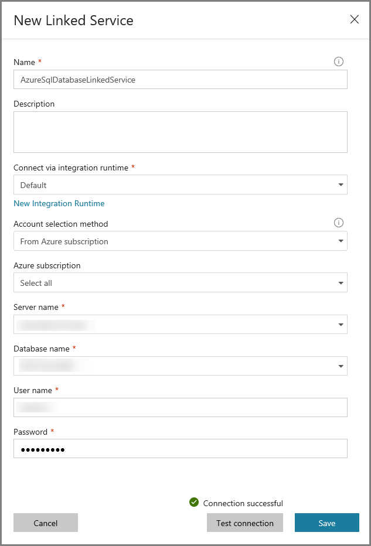
1. Confirm that you see two linked services in the list. 
   
    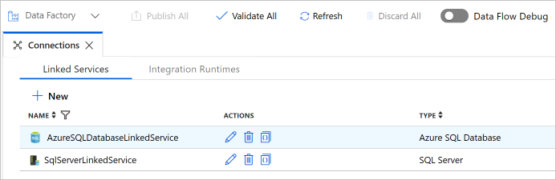 

## Create datasets
In this step, you create datasets to represent the data source, the data destination, and the place to store the watermark.

### Create a source dataset

1. In the left pane, click **+ (plus)**, and click **Dataset**.

   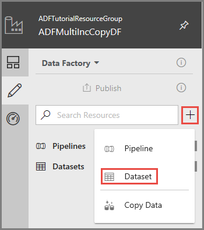
1. In the **New Dataset** window, select **SQL Server**, click **Finish**. 

   
1. You see a new tab opened in the Web browser for configuring the dataset. You also see a dataset in the treeview. In the **General** tab of the Properties window at the bottom, enter **SourceDataset** for **Name**. 

   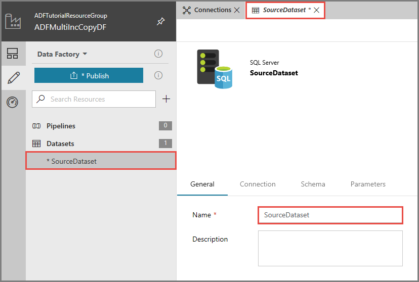
1. Switch to the **Connection** tab in the Properties window, and select **SqlServerLinkedService** for **Linked service**. You do not select a table here. The Copy activity in the pipeline uses a SQL query to load the data rather than load the entire table.

   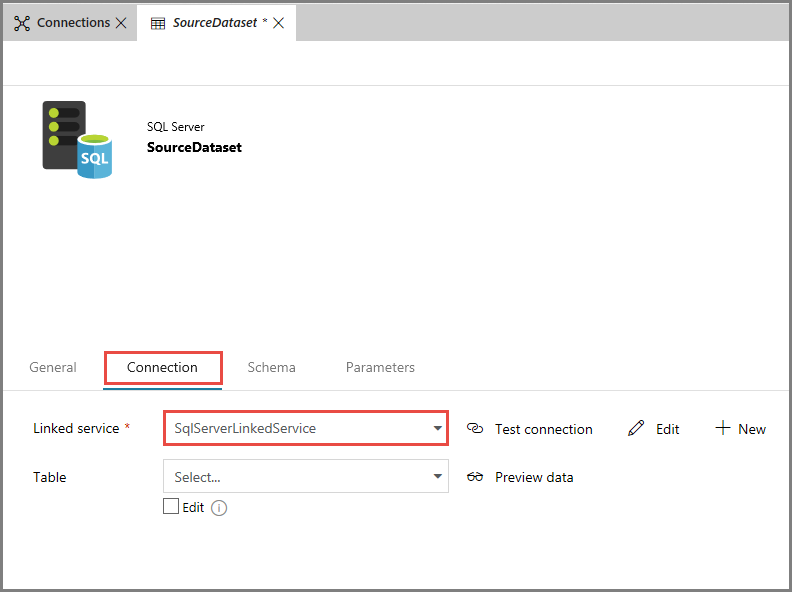


### Create a sink dataset
1. In the left pane, click **+ (plus)**, and click **Dataset**.

   
1. In the **New Dataset** window, select **Azure SQL Database**, and click **Finish**. 

   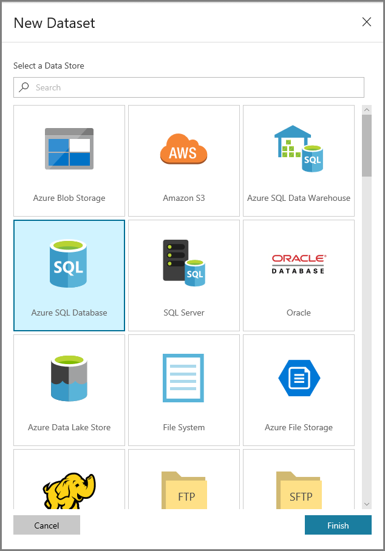
1. You see a new tab opened in the Web browser for configuring the dataset. You also see a dataset in the treeview. In the **General** tab of the Properties window at the bottom, enter **SinkDataset** for **Name**.

   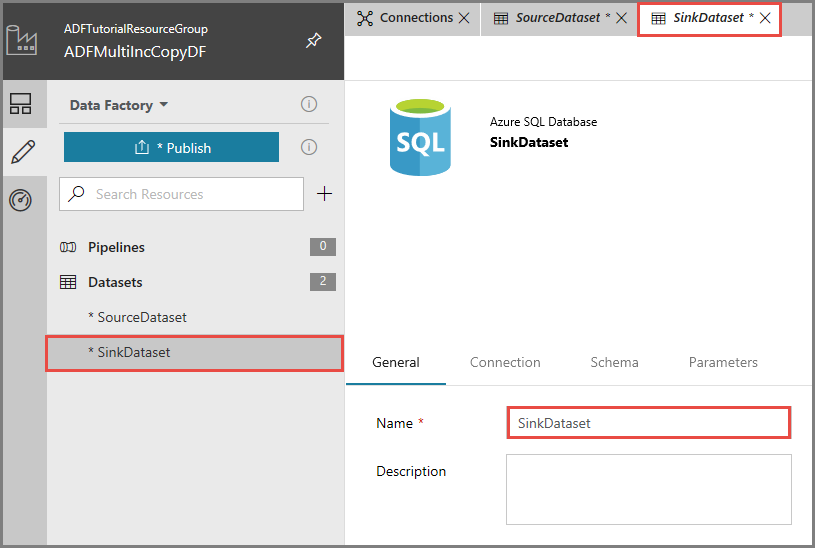
1. Switch to the **Parameters** tab in the Properties window, and do the following steps: 

    1. Click **New** in the **Create/update parameters** section. 
    1. Enter **SinkTableName** for the **name**, and **String** for the **type**. This dataset takes **SinkTableName** as a parameter. The SinkTableName parameter is set by the pipeline dynamically at runtime. The ForEach activity in the pipeline iterates through a list of table names and passes the table name to this dataset in each iteration.
   
       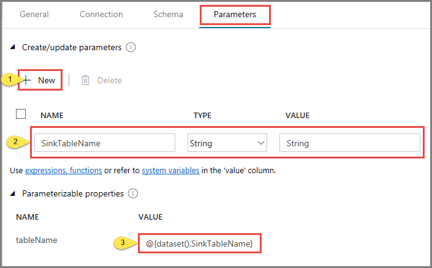
1. Switch to the **Connection** tab in the Properties window, and select **AzureSqlLinkedService** for **Linked service**. For **Table** property, click **Add dynamic content**. 

   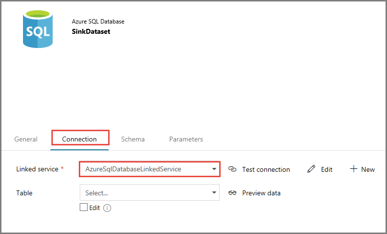
    
	
1. Select **SinkTableName** in the **Parameters** section
   
   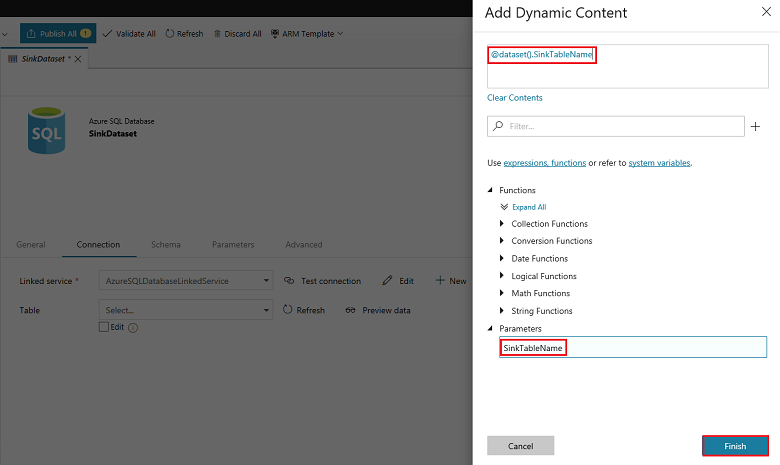

   
 1. After clicking **Finish**, you see **@dataset().SinkTableName** as the table name.
   
   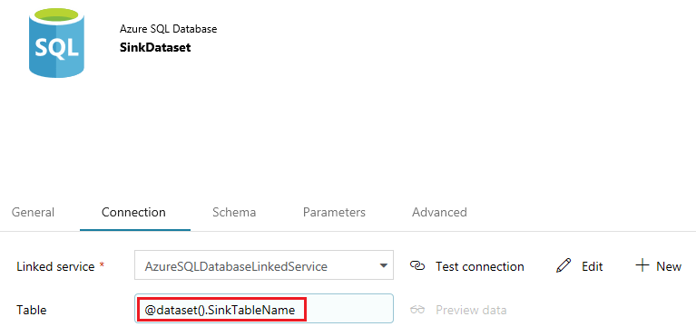

### Create a dataset for a watermark
In this step, you create a dataset for storing a high watermark value. 

1. In the left pane, click **+ (plus)**, and click **Dataset**.

   
1. In the **New Dataset** window, select **Azure SQL Database**, and click **Finish**. 

   
1. In the **General** tab of the Properties window at the bottom, enter **WatermarkDataset** for **Name**.
1. Switch to the **Connection** tab, and do the following steps: 

    1. Select **AzureSqlDatabaseLinkedService** for **Linked service**.
    1. Select **[dbo].[watermarktable]** for **Table**.

       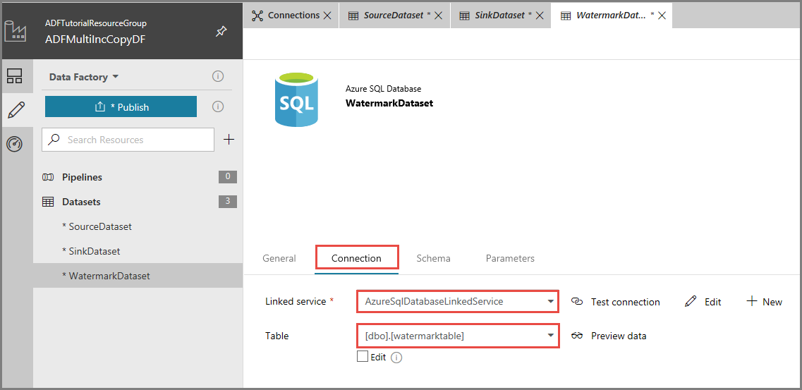

## Create a pipeline
The pipeline takes a list of table names as a parameter. The ForEach activity iterates through the list of table names and performs the following operations: 

1. Use the Lookup activity to retrieve the old watermark value (the initial value or the one that was used in the last iteration).

1. Use the Lookup activity to retrieve the new watermark value (the maximum value of the watermark column in the source table).

1. Use the Copy activity to copy data between these two watermark values from the source database to the destination database.

1. Use the StoredProcedure activity to update the old watermark value to be used in the first step of the next iteration. 

### Create the pipeline

1. In the left pane, click **+ (plus)**, and click **Pipeline**.

    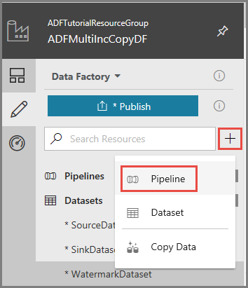
1. In the **General** tab of the **Properties** window, enter **IncrementalCopyPipeline** for **Name**. 

    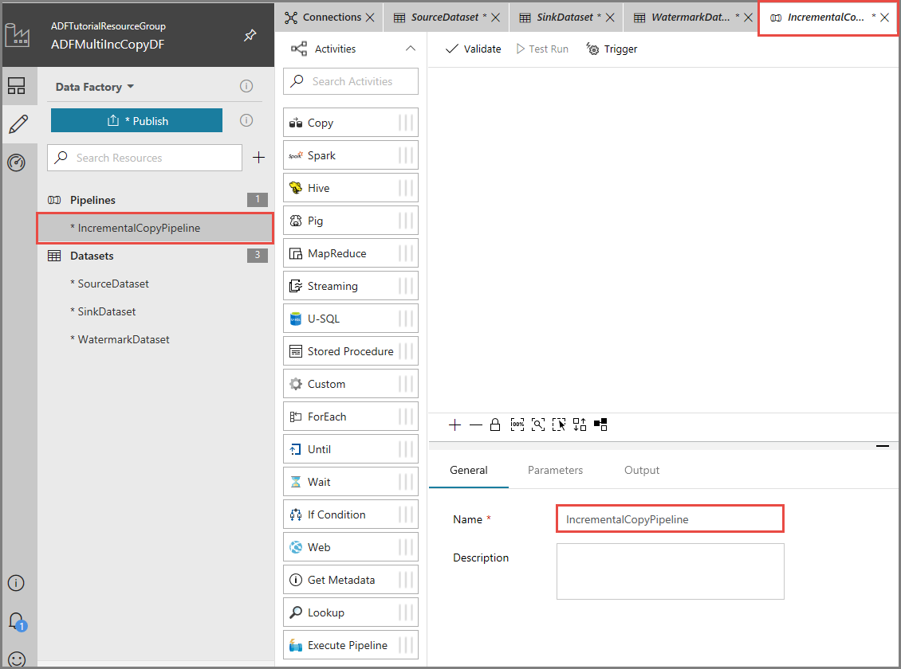
1. In the **Properties** window, do the following steps: 

    1. Click **+ New**. 
    1. Enter **tableList** for the parameter **name**. 
    1. Select **Object** for the parameter **type**.

    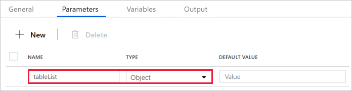 
1. In the **Activities** toolbox, expand **Iteration & Conditionals**, and drag-drop the **ForEach** activity to the pipeline designer surface. In the **General** tab of the **Properties** window, enter **IterateSQLTables**. 

    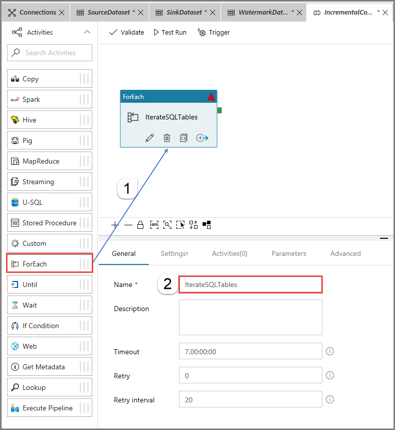
1. Switch to the **Settings** tab in the **Properties** window, and enter `@pipeline().parameters.tableList` for **Items**. The ForEach activity iterates through a list of tables and performs the incremental copy operation. 

    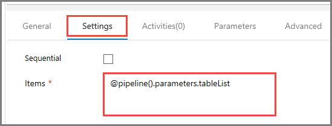
1. Select the **ForEach** activity in the pipeline if it isn't already selected. Click the **Edit (Pencil icon)** button.

    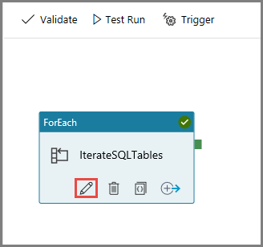
1. In the **Activities** toolbox, expand **General**, drag-drop the **Lookup** activity to the pipeline designer surface, and enter **LookupOldWaterMarkActivity** for **Name**.

    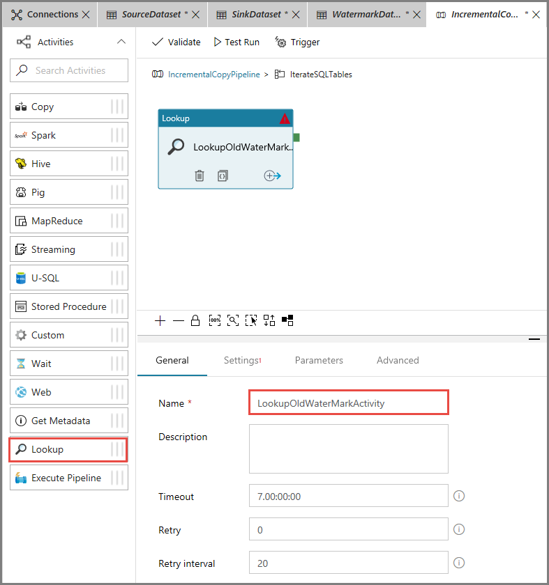
1. Switch to the **Settings** tab of the **Properties** window, and do the following steps: 

    1. Select **WatermarkDataset** for **Source Dataset**.
    1. Select **Query** for **Use Query**. 
    1. Enter the following SQL query for **Query**. 

        ```sql
        select * from watermarktable where TableName  =  '@{item().TABLE_NAME}'
        ```

        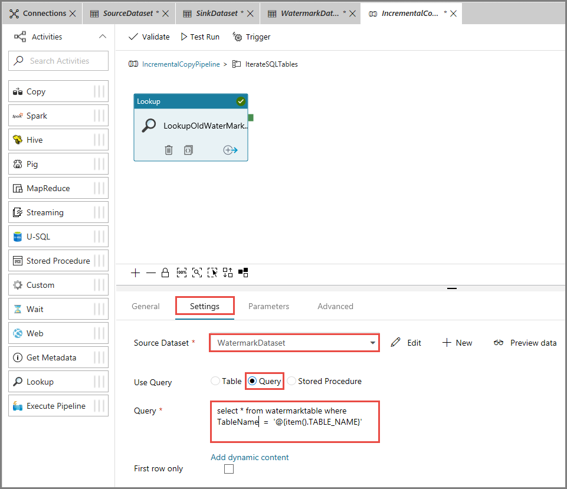
1. Drag-drop the **Lookup** activity from the **Activities** toolbox, and enter **LookupNewWaterMarkActivity** for **Name**.
        
    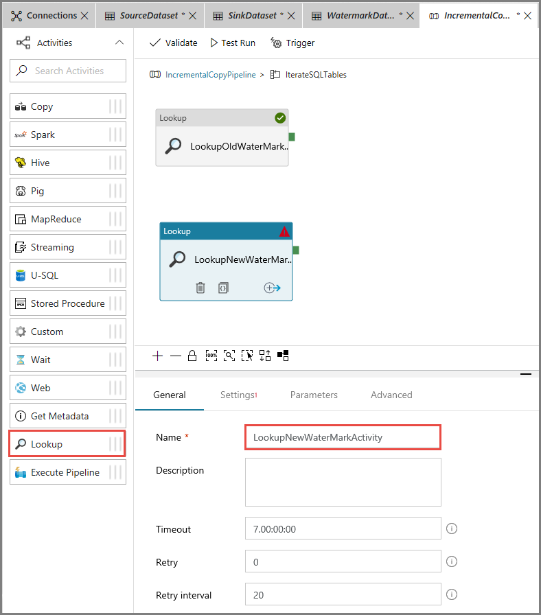
1. Switch to the **Settings** tab.

    1. Select **SourceDataset** for **Source Dataset**. 
    1. Select **Query** for **Use Query**.
    1. Enter the following SQL query for **Query**.

        ```sql    
        select MAX(@{item().WaterMark_Column}) as NewWatermarkvalue from @{item().TABLE_NAME}
        ```
    
        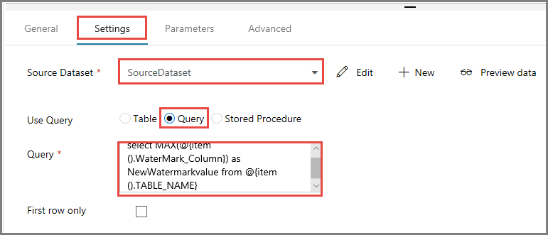
1. Drag-drop the **Copy** activity from the **Activities** toolbox, and enter **IncrementalCopyActivity** for **Name**. 

    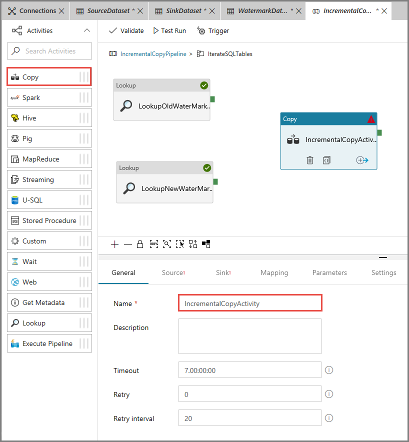
1. Connect **Lookup** activities to the **Copy** activity one by one. To connect, start dragging at the **green** box attached to the **Lookup** activity and drop it on the **Copy** activity. Release the mouse button when the border color of the Copy activity changes to **blue**.

    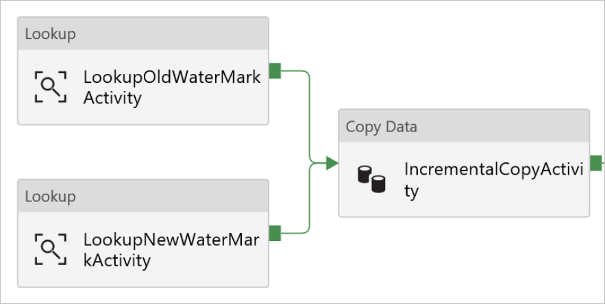
1. Select the **Copy** activity in the pipeline. Switch to the **Source** tab in the **Properties** window. 

    1. Select **SourceDataset** for **Source Dataset**. 
    1. Select **Query** for **Use Query**. 
    1. Enter the following SQL query for **Query**.

        ```sql
        select * from @{item().TABLE_NAME} where @{item().WaterMark_Column} > '@{activity('LookupOldWaterMarkActivity').output.firstRow.WatermarkValue}' and @{item().WaterMark_Column} <= '@{activity('LookupNewWaterMarkActivity').output.firstRow.NewWatermarkvalue}'        
        ```

        
1. Switch to the **Sink** tab, and select **SinkDataset** for **Sink Dataset**. 
        
    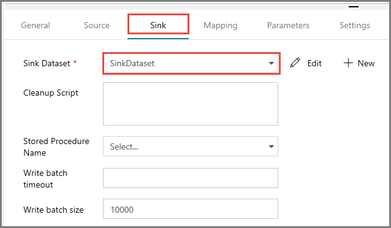
1. Do the following steps:

    1. In the **Dataset** property, for **SinkTableName** parameter, enter `@{item().TABLE_NAME}`.
    1. For **Stored Procedure Name** property, enter `@{item().StoredProcedureNameForMergeOperation}`.
    1. For **Table Type** property, enter `@{item().TableType}`.


        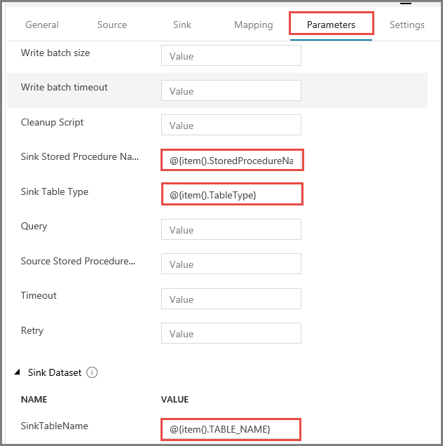
1. Drag-and-drop the **Stored Procedure** activity from the **Activities** toolbox to the pipeline designer surface. Connect the **Copy** activity to the **Stored Procedure** activity. 

    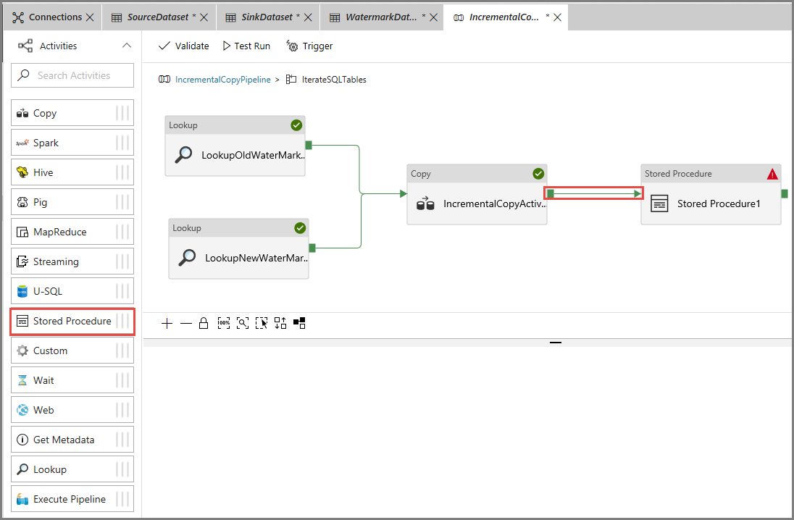
1. Select the **Stored Procedure** activity in the pipeline, and enter **StoredProceduretoWriteWatermarkActivity** for **Name** in the **General** tab of the **Properties** window. 

    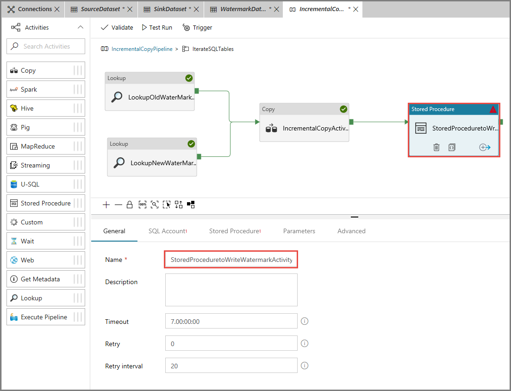
1. Switch to the **SQL Account** tab, and select **AzureSqlDatabaseLinkedService** for **Linked Service**.

    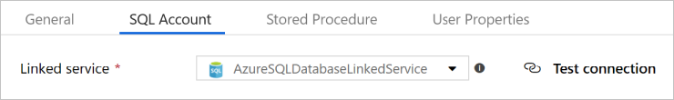
1. Switch to the **Stored Procedure** tab, and do the following steps:

    1. For **Stored procedure name**, select `usp_write_watermark`. 
    1. Select **Import parameter**. 
    1. Specify the following values for the parameters: 

        | Name | Type | Value | 
        | ---- | ---- | ----- |
        | LastModifiedtime | DateTime | `@{activity('LookupNewWaterMarkActivity').output.firstRow.NewWatermarkvalue}` |
        | TableName | String | `@{activity('LookupOldWaterMarkActivity').output.firstRow.TableName}` |
    
        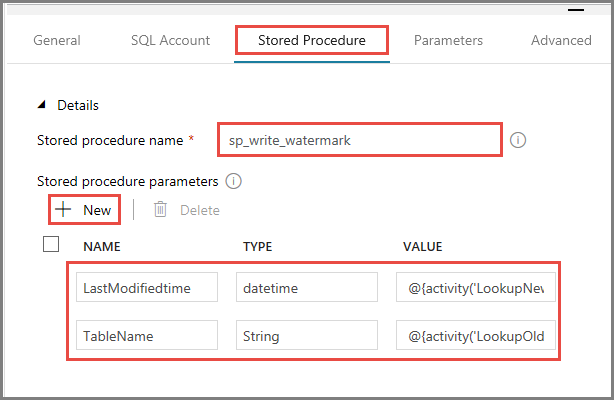
1. In the left pane, click **Publish**. This action publishes the entities you created to the Data Factory service. 

    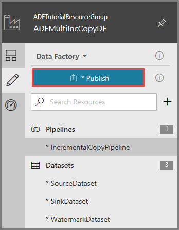
1. Wait until you see the **Successfully published** message. To see the notifications, click the **Show Notifications** link. Close the notifications window by clicking **X**.

    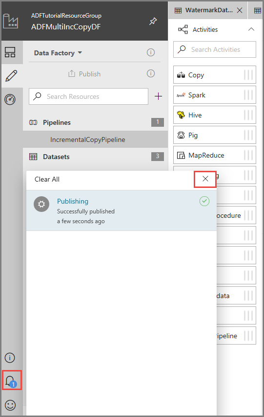

 
## Run the pipeline

1. On the toolbar for the pipeline, click **Trigger**, and click **Trigger Now**.     

    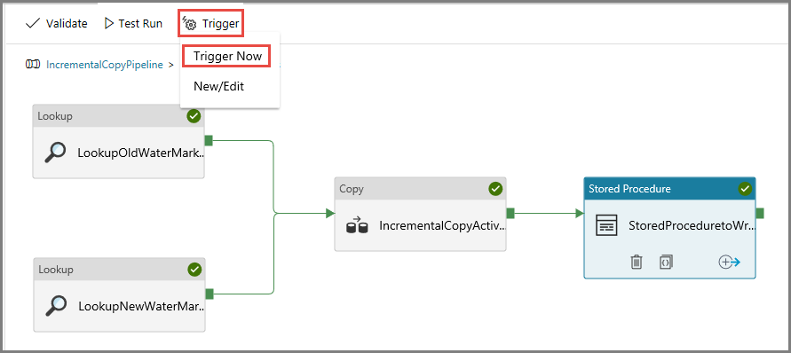
1. In the **Pipeline Run** window, enter the following value for the **tableList** parameter, and click **Finish**. 

    ```
    [
        {
            "TABLE_NAME": "customer_table",
            "WaterMark_Column": "LastModifytime",
            "TableType": "DataTypeforCustomerTable",
            "StoredProcedureNameForMergeOperation": "usp_upsert_customer_table"
        },
        {
            "TABLE_NAME": "project_table",
            "WaterMark_Column": "Creationtime",
            "TableType": "DataTypeforProjectTable",
            "StoredProcedureNameForMergeOperation": "usp_upsert_project_table"
        }
    ]
    ```

    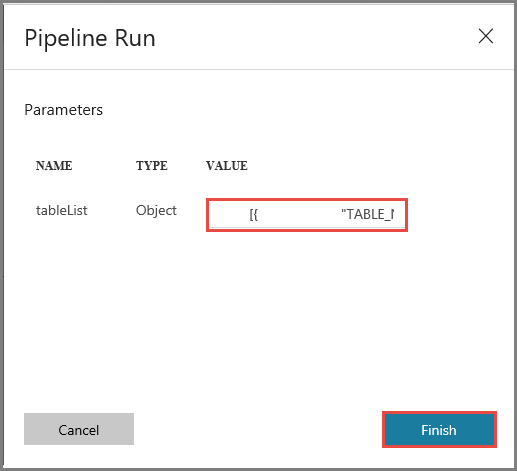

## Monitor the pipeline

1. Switch to the **Monitor** tab on the left. You see the pipeline run triggered by the **manual trigger**. Click **Refresh** button to refresh the list. Links in the **Actions** column allow you to view activity runs associated with the pipeline run, and to rerun the pipeline. 

    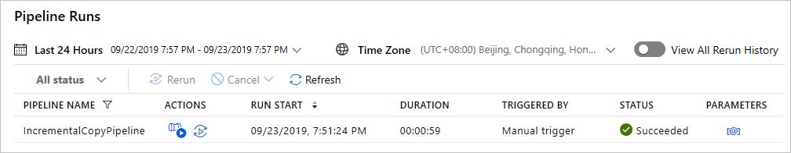
1. Click **View Activity Runs** link in the **Actions** column. You see all the activity runs associated with the selected pipeline run. 

    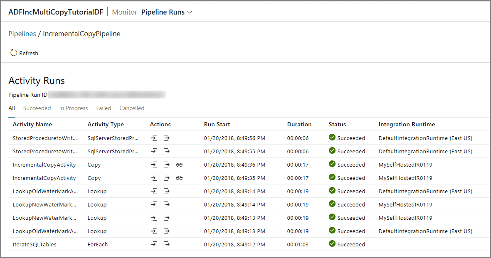

## Review the results
In SQL Server Management Studio, run the following queries against the target SQL database to verify that the data was copied from source tables to destination tables: 

**Query** 
```sql
select * from customer_table
```

**Output**
```
===========================================
PersonID	Name	LastModifytime
===========================================
1	        John	2017-09-01 00:56:00.000
2	        Mike	2017-09-02 05:23:00.000
3	        Alice	2017-09-03 02:36:00.000
4	        Andy	2017-09-04 03:21:00.000
5	        Anny	2017-09-05 08:06:00.000
```

**Query**

```sql
select * from project_table
```

**Output**

```
===================================
Project	    Creationtime
===================================
project1	2015-01-01 00:00:00.000
project2	2016-02-02 01:23:00.000
project3	2017-03-04 05:16:00.000
```

**Query**

```sql
select * from watermarktable
```

**Output**

```
======================================
TableName	    WatermarkValue
======================================
customer_table	2017-09-05 08:06:00.000
project_table	2017-03-04 05:16:00.000
```

Notice that the watermark values for both tables were updated. 

## Add more data to the source tables

Run the following query against the source SQL Server database to update an existing row in customer_table. Insert a new row into project_table. 

```sql
UPDATE customer_table
SET [LastModifytime] = '2017-09-08T00:00:00Z', [name]='NewName' where [PersonID] = 3

INSERT INTO project_table
(Project, Creationtime)
VALUES
('NewProject','10/1/2017 0:00:00 AM');
``` 

## Rerun the pipeline
1. In the web browser window, switch to the **Edit** tab on the left. 
1. On the toolbar for the pipeline, click **Trigger**, and click **Trigger Now**.   

    
1. In the **Pipeline Run** window, enter the following value for the **tableList** parameter, and click **Finish**. 

    ```
    [
        {
            "TABLE_NAME": "customer_table",
            "WaterMark_Column": "LastModifytime",
            "TableType": "DataTypeforCustomerTable",
            "StoredProcedureNameForMergeOperation": "usp_upsert_customer_table"
        },
        {
            "TABLE_NAME": "project_table",
            "WaterMark_Column": "Creationtime",
            "TableType": "DataTypeforProjectTable",
            "StoredProcedureNameForMergeOperation": "usp_upsert_project_table"
        }
    ]
    ```

## Monitor the pipeline again

1. Switch to the **Monitor** tab on the left. You see the pipeline run triggered by the **manual trigger**. Click **Refresh** button to refresh the list. Links in the **Actions** column allow you to view activity runs associated with the pipeline run, and to rerun the pipeline. 

    
1. Click **View Activity Runs** link in the **Actions** column. You see all the activity runs associated with the selected pipeline run. 

     

## Review the final results
In SQL Server Management Studio, run the following queries against the target database to verify that the updated/new data was copied from source tables to destination tables. 

**Query** 
```sql
select * from customer_table
```

**Output**
```
===========================================
PersonID	Name	LastModifytime
===========================================
1	        John	2017-09-01 00:56:00.000
2	        Mike	2017-09-02 05:23:00.000
3	        NewName	2017-09-08 00:00:00.000
4	        Andy	2017-09-04 03:21:00.000
5	        Anny	2017-09-05 08:06:00.000
```

Notice the new values of **Name** and **LastModifytime** for the **PersonID** for number 3. 

**Query**

```sql
select * from project_table
```

**Output**

```
===================================
Project	    Creationtime
===================================
project1	2015-01-01 00:00:00.000
project2	2016-02-02 01:23:00.000
project3	2017-03-04 05:16:00.000
NewProject	2017-10-01 00:00:00.000
```

Notice that the **NewProject** entry was added to project_table. 

**Query**

```sql
select * from watermarktable
```

**Output**

```
======================================
TableName	    WatermarkValue
======================================
customer_table	2017-09-08 00:00:00.000
project_table	2017-10-01 00:00:00.000
```

Notice that the watermark values for both tables were updated.
     
## Next steps
You performed the following steps in this tutorial: 

> [!div class="checklist"]
> * Prepare source and destination data stores.
> * Create a data factory.
> * Create a self-hosted integration runtime (IR).
> * Install the integration runtime.
> * Create linked services. 
> * Create source, sink, and watermark datasets.
> * Create, run, and monitor a pipeline.
> * Review the results.
> * Add or update data in source tables.
> * Rerun and monitor the pipeline.
> * Review the final results.

Advance to the following tutorial to learn about transforming data by using a Spark cluster on Azure:

> [!div class="nextstepaction"]
>[Incrementally load data from Azure SQL Database to Azure Blob storage by using Change Tracking technology](tutorial-incremental-copy-change-tracking-feature-portal.md)


