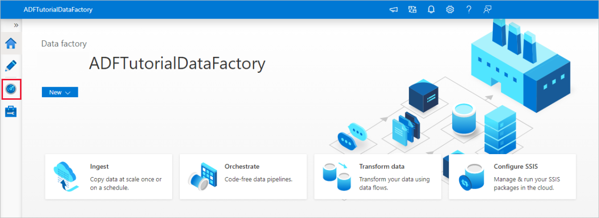

# Incrementally load data from multiple tables in SQL Server to an Azure SQL Database using PowerShell

[!INCLUDE[appliesto-adf-xxx-md](includes/appliesto-adf-xxx-md.md)]

In this tutorial, you create an Azure data factory with a pipeline that loads delta data from multiple tables in a SQL Server database to an Azure SQL Database.    

You perform the following steps in this tutorial:

> [!div class="checklist"]
> * Prepare source and destination data stores.
> * Create a data factory.
> * Create a self-hosted integration runtime.
> * Install the integration runtime. 
> * Create linked services. 
> * Create source, sink, and watermark datasets.
> * Create, run, and monitor a pipeline.
> * Review the results.
> * Add or update data in source tables.
> * Rerun and monitor the pipeline.
> * Review the final results.

## Overview
Here are the important steps to create this solution: 

1. **Select the watermark column**.

	Select one column for each table in the source data store, which you can identify the new or updated records for every run. Normally, the data in this selected column (for example, last_modify_time or ID) keeps increasing when rows are created or updated. The maximum value in this column is used as a watermark.

2. **Prepare a data store to store the watermark value**.

	In this tutorial, you store the watermark value in a SQL database.

3. **Create a pipeline with the following activities**:
	
	a. Create a ForEach activity that iterates through a list of source table names that is passed as a parameter to the pipeline. For each source table, it invokes the following activities to perform delta loading for that table.

    b. Create two lookup activities. Use the first Lookup activity to retrieve the last watermark value. Use the second Lookup activity to retrieve the new watermark value. These watermark values are passed to the Copy activity.

	c. Create a Copy activity that copies rows from the source data store with the value of the watermark column greater than the old watermark value and less than the new watermark value. Then, it copies the delta data from the source data store to Azure Blob storage as a new file.

	d. Create a StoredProcedure activity that updates the watermark value for the pipeline that runs next time. 

    Here is the high-level solution diagram: 

    


If you don't have an Azure subscription, create a [free](https://azure.microsoft.com/free/) account before you begin.

## Prerequisites

* **SQL Server**. You use a SQL Server database as the source data store in this tutorial. 
* **Azure SQL Database**. You use a SQL database as the sink data store. If you don't have a SQL database, see [Create an Azure SQL database](../azure-sql/database/single-database-create-quickstart.md) for steps to create one. 

### Create source tables in your SQL Server database

1. Open [SQL Server Management Studio (SSMS)](https://docs.microsoft.com/sql/ssms/download-sql-server-management-studio-ssms) or [Azure Data Studio](https://docs.microsoft.com/sql/azure-data-studio/download-azure-data-studio), and connect to your SQL Server database.

2. In **Server Explorer (SSMS)** or in the **Connections pane (Azure Data Studio)**, right-click the database and choose **New Query**.

3. Run the following SQL command against your database to create tables named `customer_table` and `project_table`:

    ```sql
    create table customer_table
    (
        PersonID int,
        Name varchar(255),
        LastModifytime datetime
    );
    
    create table project_table
    (
        Project varchar(255),
        Creationtime datetime
    );
        
    INSERT INTO customer_table
    (PersonID, Name, LastModifytime)
    VALUES
    (1, 'John','9/1/2017 12:56:00 AM'),
    (2, 'Mike','9/2/2017 5:23:00 AM'),
    (3, 'Alice','9/3/2017 2:36:00 AM'),
    (4, 'Andy','9/4/2017 3:21:00 AM'),
    (5, 'Anny','9/5/2017 8:06:00 AM');
    
    INSERT INTO project_table
    (Project, Creationtime)
    VALUES
    ('project1','1/1/2015 0:00:00 AM'),
    ('project2','2/2/2016 1:23:00 AM'),
    ('project3','3/4/2017 5:16:00 AM');
    ```

### Create destination tables in your Azure SQL Database

1. Open [SQL Server Management Studio (SSMS)](https://docs.microsoft.com/sql/ssms/download-sql-server-management-studio-ssms) or [Azure Data Studio](https://docs.microsoft.com/sql/azure-data-studio/download-azure-data-studio), and connect to your SQL Server database.

2. In **Server Explorer (SSMS)** or in the **Connections pane (Azure Data Studio)**, right-click the database and choose **New Query**.

3. Run the following SQL command against your SQL database to create tables named `customer_table` and `project_table`:  

    ```sql
    create table customer_table
    (
        PersonID int,
        Name varchar(255),
        LastModifytime datetime
    );
    
    create table project_table
    (
        Project varchar(255),
        Creationtime datetime
    );
	```

### Create another table in the Azure SQL Database to store the high watermark value

1. Run the following SQL command against your SQL database to create a table named `watermarktable` to store the watermark value: 
    
    ```sql
    create table watermarktable
    (
    
        TableName varchar(255),
        WatermarkValue datetime,
    );
    ```
2. Insert initial watermark values for both source tables into the watermark table.

    ```sql

    INSERT INTO watermarktable
    VALUES 
    ('customer_table','1/1/2010 12:00:00 AM'),
    ('project_table','1/1/2010 12:00:00 AM');
    
    ```

### Create a stored procedure in the Azure SQL Database 

Run the following command to create a stored procedure in your SQL database. This stored procedure updates the watermark value after every pipeline run. 

```sql
CREATE PROCEDURE usp_write_watermark @LastModifiedtime datetime, @TableName varchar(50)
AS

BEGIN

    UPDATE watermarktable
    SET [WatermarkValue] = @LastModifiedtime 
WHERE [TableName] = @TableName

END

```

### Create data types and additional stored procedures in the Azure SQL Database

Run the following query to create two stored procedures and two data types in your SQL database. 
They're used to merge the data from source tables into destination tables. 

In order to make the journey easy to start with, we directly use these Stored Procedures passing the delta data in via a table variable and then merge the them into destination store. Be cautious it is not expecting a "large" number of delta rows (more than 100) to be stored in the table variable.  

If you do need to merge a large number of delta rows into the destination store, we suggest you to use copy activity to copy all the delta data into a temporary "staging" table in the destination store first, and then built your own stored procedure without using table variable to merge  them from the “staging” table to the “final” table. 


```sql
CREATE TYPE DataTypeforCustomerTable AS TABLE(
    PersonID int,
    Name varchar(255),
    LastModifytime datetime
);

GO

CREATE PROCEDURE usp_upsert_customer_table @customer_table DataTypeforCustomerTable READONLY
AS

BEGIN
  MERGE customer_table AS target
  USING @customer_table AS source
  ON (target.PersonID = source.PersonID)
  WHEN MATCHED THEN
      UPDATE SET Name = source.Name,LastModifytime = source.LastModifytime
  WHEN NOT MATCHED THEN
      INSERT (PersonID, Name, LastModifytime)
      VALUES (source.PersonID, source.Name, source.LastModifytime);
END

GO

CREATE TYPE DataTypeforProjectTable AS TABLE(
    Project varchar(255),
    Creationtime datetime
);

GO

CREATE PROCEDURE usp_upsert_project_table @project_table DataTypeforProjectTable READONLY
AS

BEGIN
  MERGE project_table AS target
  USING @project_table AS source
  ON (target.Project = source.Project)
  WHEN MATCHED THEN
      UPDATE SET Creationtime = source.Creationtime
  WHEN NOT MATCHED THEN
      INSERT (Project, Creationtime)
      VALUES (source.Project, source.Creationtime);
END
```

### Azure PowerShell

Install the latest Azure PowerShell modules by following the instructions in [Install and configure Azure PowerShell](/powershell/azure/azurerm/install-azurerm-ps).

## Create a data factory

1. Define a variable for the resource group name that you use in PowerShell commands later. Copy the following command text to PowerShell, specify a name for the [Azure resource group](../azure-resource-manager/management/overview.md) in double quotation marks, and then run the command. An example is `"adfrg"`.

    ```powershell
    $resourceGroupName = "ADFTutorialResourceGroup";
    ```

    If the resource group already exists, you might not want to overwrite it. Assign a different value to the `$resourceGroupName` variable, and run the command again.

2. Define a variable for the location of the data factory. 

    ```powershell
    $location = "East US"
    ```
3. To create the Azure resource group, run the following command: 

    ```powershell
    New-AzResourceGroup $resourceGroupName $location
    ``` 
    If the resource group already exists, you might not want to overwrite it. Assign a different value to the `$resourceGroupName` variable, and run the command again.

4. Define a variable for the data factory name. 

    > [!IMPORTANT]
    >  Update the data factory name to make it globally unique. An example is ADFIncMultiCopyTutorialFactorySP1127. 

    ```powershell
    $dataFactoryName = "ADFIncMultiCopyTutorialFactory";
    ```
5. To create the data factory, run the following **Set-AzDataFactoryV2** cmdlet: 
    
    ```powershell
    Set-AzDataFactoryV2 -ResourceGroupName $resourceGroupName -Location $location -Name $dataFactoryName 
    ```

Note the following points:

* The name of the data factory must be globally unique. If you receive the following error, change the name and try again:

    ```powershell
    Set-AzDataFactoryV2 : HTTP Status Code: Conflict
    Error Code: DataFactoryNameInUse
    Error Message: The specified resource name 'ADFIncMultiCopyTutorialFactory' is already in use. Resource names must be globally unique.
    ```

* To create Data Factory instances, the user account you use to sign in to Azure must be a member of contributor or owner roles, or an administrator of the Azure subscription.

* For a list of Azure regions in which Data Factory is currently available, select the regions that interest you on the following page, and then expand **Analytics** to locate **Data Factory**: [Products available by region](https://azure.microsoft.com/global-infrastructure/services/). The data stores (Azure Storage, SQL Database, etc.) and computes (Azure HDInsight, etc.) used by the data factory can be in other regions.

[!INCLUDE [data-factory-create-install-integration-runtime](../../includes/data-factory-create-install-integration-runtime.md)]

## Create linked services

You create linked services in a data factory to link your data stores and compute services to the data factory. In this section, you create linked services to your SQL Server database and Azure SQL Database. 

### Create the SQL Server linked service

In this step, you link your SQL Server database to the data factory.

1. Create a JSON file named **SqlServerLinkedService.json** in the C:\ADFTutorials\IncCopyMultiTableTutorial folder (create the local folders if they don't already exist) with the following content. Select the right section based on the authentication you use to connect to SQL Server.  

    > [!IMPORTANT]
    > Select the right section based on the authentication you use to connect to SQL Server.

    If you use SQL authentication, copy the following JSON definition:

	```json
    {  
        "name":"SqlServerLinkedService",
        "properties":{  
            "annotations":[  
    
            ],
            "type":"SqlServer",
            "typeProperties":{  
                "connectionString":"integrated security=False;data source=<servername>;initial catalog=<database name>;user id=<username>;Password=<password>"
            },
            "connectVia":{  
                "referenceName":"<integration runtime name>",
                "type":"IntegrationRuntimeReference"
            }
        }
    } 
   ```    
    If you use Windows authentication, copy the following JSON definition:

    ```json
    {  
        "name":"SqlServerLinkedService",
        "properties":{  
            "annotations":[  
    
            ],
            "type":"SqlServer",
            "typeProperties":{  
                "connectionString":"integrated security=True;data source=<servername>;initial catalog=<database name>",
                "userName":"<username> or <domain>\\<username>",
                "password":{  
                    "type":"SecureString",
                    "value":"<password>"
                }
            },
            "connectVia":{  
                "referenceName":"<integration runtime name>",
                "type":"IntegrationRuntimeReference"
            }
        }
    }
    ```
    > [!IMPORTANT]
    > - Select the right section based on the authentication you use to connect to SQL Server.
    > - Replace &lt;integration runtime name> with the name of your integration runtime.
    > - Replace &lt;servername>, &lt;databasename>, &lt;username>, and &lt;password> with values of your SQL Server database before you save the file.
    > - If you need to use a slash character (`\`) in your user account or server name, use the escape character (`\`). An example is `mydomain\\myuser`.

2. In PowerShell, run the following cmdlet to switch to the C:\ADFTutorials\IncCopyMultiTableTutorial folder.

    ```powershell
    Set-Location 'C:\ADFTutorials\IncCopyMultiTableTutorial'
    ```

3. Run the **Set-AzDataFactoryV2LinkedService** cmdlet to create the linked service AzureStorageLinkedService. In the following example, you pass values for the *ResourceGroupName* and *DataFactoryName* parameters: 

    ```powershell
    Set-AzDataFactoryV2LinkedService -DataFactoryName $dataFactoryName -ResourceGroupName $resourceGroupName -Name "SqlServerLinkedService" -File ".\SqlServerLinkedService.json"
    ```

    Here is the sample output:

    ```json
    LinkedServiceName : SqlServerLinkedService
    ResourceGroupName : <ResourceGroupName>
    DataFactoryName   : <DataFactoryName>
    Properties        : Microsoft.Azure.Management.DataFactory.Models.SqlServerLinkedService
    ```

### Create the SQL database linked service

1. Create a JSON file named **AzureSQLDatabaseLinkedService.json** in C:\ADFTutorials\IncCopyMultiTableTutorial folder with the following content. (Create the folder ADF if it doesn't already exist.) Replace &lt;servername&gt;, &lt;database name&gt;, &lt;user name&gt;, and &lt;password&gt; with the name of your SQL Server database, name of your database, user name, and password before you save the file. 

    ```json
    {  
        "name":"AzureSQLDatabaseLinkedService",
        "properties":{  
            "annotations":[  
    
            ],
            "type":"AzureSqlDatabase",
            "typeProperties":{  
                "connectionString":"integrated security=False;encrypt=True;connection timeout=30;data source=<servername>.database.windows.net;initial catalog=<database name>;user id=<user name>;Password=<password>;"
            }
        }
    }
    ```
2. In PowerShell, run the **Set-AzDataFactoryV2LinkedService** cmdlet to create the linked service AzureSQLDatabaseLinkedService. 

    ```powershell
    Set-AzDataFactoryV2LinkedService -DataFactoryName $dataFactoryName -ResourceGroupName $resourceGroupName -Name "AzureSQLDatabaseLinkedService" -File ".\AzureSQLDatabaseLinkedService.json"
    ```

    Here is the sample output:

    ```json
    LinkedServiceName : AzureSQLDatabaseLinkedService
    ResourceGroupName : <ResourceGroupName>
    DataFactoryName   : <DataFactoryName>
    Properties        : Microsoft.Azure.Management.DataFactory.Models.AzureSqlDatabaseLinkedService
    ```

## Create datasets

In this step, you create datasets to represent the data source, the data destination, and the place to store the watermark.

### Create a source dataset

1. Create a JSON file named **SourceDataset.json** in the same folder with the following content: 

    ```json
    {  
        "name":"SourceDataset",
        "properties":{  
            "linkedServiceName":{  
                "referenceName":"SqlServerLinkedService",
                "type":"LinkedServiceReference"
            },
            "annotations":[  
    
            ],
            "type":"SqlServerTable",
            "schema":[  
    
            ]
        }
    }
   
    ```

    The Copy activity in the pipeline uses a SQL query to load the data rather than load the entire table.

2. Run the **Set-AzDataFactoryV2Dataset** cmdlet to create the dataset SourceDataset.
    
    ```powershell
    Set-AzDataFactoryV2Dataset -DataFactoryName $dataFactoryName -ResourceGroupName $resourceGroupName -Name "SourceDataset" -File ".\SourceDataset.json"
    ```

    Here is the sample output of the cmdlet:
    
    ```json
    DatasetName       : SourceDataset
    ResourceGroupName : <ResourceGroupName>
    DataFactoryName   : <DataFactoryName>
    Structure         :
    Properties        : Microsoft.Azure.Management.DataFactory.Models.SqlServerTableDataset
    ```

### Create a sink dataset

1. Create a JSON file named **SinkDataset.json** in the same folder with the following content. The tableName element is set by the pipeline dynamically at runtime. The ForEach activity in the pipeline iterates through a list of table names and passes the table name to this dataset in each iteration. 

    ```json
    {  
        "name":"SinkDataset",
        "properties":{  
            "linkedServiceName":{  
                "referenceName":"AzureSQLDatabaseLinkedService",
                "type":"LinkedServiceReference"
            },
            "parameters":{  
                "SinkTableName":{  
                    "type":"String"
                }
            },
            "annotations":[  
    
            ],
            "type":"AzureSqlTable",
            "typeProperties":{  
                "tableName":{  
                    "value":"@dataset().SinkTableName",
                    "type":"Expression"
                }
            }
        }
    }
    ```

2. Run the **Set-AzDataFactoryV2Dataset** cmdlet to create the dataset SinkDataset.
    
    ```powershell
    Set-AzDataFactoryV2Dataset -DataFactoryName $dataFactoryName -ResourceGroupName $resourceGroupName -Name "SinkDataset" -File ".\SinkDataset.json"
    ```

    Here is the sample output of the cmdlet:
    
    ```json
    DatasetName       : SinkDataset
    ResourceGroupName : <ResourceGroupName>
    DataFactoryName   : <DataFactoryName>
    Structure         :
    Properties        : Microsoft.Azure.Management.DataFactory.Models.AzureSqlTableDataset
    ```

### Create a dataset for a watermark

In this step, you create a dataset for storing a high watermark value. 

1. Create a JSON file named **WatermarkDataset.json** in the same folder with the following content: 

    ```json
    {
    	"name": " WatermarkDataset ",
    	"properties": {
    		"type": "AzureSqlTable",
    		"typeProperties": {
    			"tableName": "watermarktable"
    		},
    		"linkedServiceName": {
    			"referenceName": "AzureSQLDatabaseLinkedService",
    			"type": "LinkedServiceReference"
    		}
    	}
    }    
    ```
2. Run the **Set-AzDataFactoryV2Dataset** cmdlet to create the dataset WatermarkDataset.
    
    ```powershell
    Set-AzDataFactoryV2Dataset -DataFactoryName $dataFactoryName -ResourceGroupName $resourceGroupName -Name "WatermarkDataset" -File ".\WatermarkDataset.json"
    ```

    Here is the sample output of the cmdlet:
    
    ```json
    DatasetName       : WatermarkDataset
    ResourceGroupName : <ResourceGroupName>
    DataFactoryName   : <DataFactoryName>
    Structure         :
    Properties        : Microsoft.Azure.Management.DataFactory.Models.AzureSqlTableDataset    
    ```

## Create a pipeline

The pipeline takes a list of table names as a parameter. The **ForEach activity** iterates through the list of table names and performs the following operations: 

1. Use the **Lookup activity** to retrieve the old watermark value (the initial value or the one that was used in the last iteration).

2. Use the **Lookup activity** to retrieve the new watermark value (the maximum value of the watermark column in the source table).

3. Use the **Copy activity** to copy data between these two watermark values from the source database to the destination database.

4. Use the **StoredProcedure activity** to update the old watermark value to be used in the first step of the next iteration. 

### Create the pipeline

1. Create a JSON file named **IncrementalCopyPipeline.json** in the same folder with the following content: 

    ```json
    {  
        "name":"IncrementalCopyPipeline",
        "properties":{  
            "activities":[  
                {  
                    "name":"IterateSQLTables",
                    "type":"ForEach",
                    "dependsOn":[  
    
                    ],
                    "userProperties":[  
    
                    ],
                    "typeProperties":{  
                        "items":{  
                            "value":"@pipeline().parameters.tableList",
                            "type":"Expression"
                        },
                        "isSequential":false,
                        "activities":[  
                            {  
                                "name":"LookupOldWaterMarkActivity",
                                "type":"Lookup",
                                "dependsOn":[  
    
                                ],
                                "policy":{  
                                    "timeout":"7.00:00:00",
                                    "retry":0,
                                    "retryIntervalInSeconds":30,
                                    "secureOutput":false,
                                    "secureInput":false
                                },
                                "userProperties":[  
    
                                ],
                                "typeProperties":{  
                                    "source":{  
                                        "type":"AzureSqlSource",
                                        "sqlReaderQuery":{  
                                            "value":"select * from watermarktable where TableName  =  '@{item().TABLE_NAME}'",
                                            "type":"Expression"
                                        }
                                    },
                                    "dataset":{  
                                        "referenceName":"WatermarkDataset",
                                        "type":"DatasetReference"
                                    }
                                }
                            },
                            {  
                                "name":"LookupNewWaterMarkActivity",
                                "type":"Lookup",
                                "dependsOn":[  
    
                                ],
                                "policy":{  
                                    "timeout":"7.00:00:00",
                                    "retry":0,
                                    "retryIntervalInSeconds":30,
                                    "secureOutput":false,
                                    "secureInput":false
                                },
                                "userProperties":[  
    
                                ],
                                "typeProperties":{  
                                    "source":{  
                                        "type":"SqlServerSource",
                                        "sqlReaderQuery":{  
                                            "value":"select MAX(@{item().WaterMark_Column}) as NewWatermarkvalue from @{item().TABLE_NAME}",
                                            "type":"Expression"
                                        }
                                    },
                                    "dataset":{  
                                        "referenceName":"SourceDataset",
                                        "type":"DatasetReference"
                                    },
                                    "firstRowOnly":true
                                }
                            },
                            {  
                                "name":"IncrementalCopyActivity",
                                "type":"Copy",
                                "dependsOn":[  
                                    {  
                                        "activity":"LookupOldWaterMarkActivity",
                                        "dependencyConditions":[  
                                            "Succeeded"
                                        ]
                                    },
                                    {  
                                        "activity":"LookupNewWaterMarkActivity",
                                        "dependencyConditions":[  
                                            "Succeeded"
                                        ]
                                    }
                                ],
                                "policy":{  
                                    "timeout":"7.00:00:00",
                                    "retry":0,
                                    "retryIntervalInSeconds":30,
                                    "secureOutput":false,
                                    "secureInput":false
                                },
                                "userProperties":[  
    
                                ],
                                "typeProperties":{  
                                    "source":{  
                                        "type":"SqlServerSource",
                                        "sqlReaderQuery":{  
                                            "value":"select * from @{item().TABLE_NAME} where @{item().WaterMark_Column} > '@{activity('LookupOldWaterMarkActivity').output.firstRow.WatermarkValue}' and @{item().WaterMark_Column} <= '@{activity('LookupNewWaterMarkActivity').output.firstRow.NewWatermarkvalue}'",
                                            "type":"Expression"
                                        }
                                    },
                                    "sink":{  
                                        "type":"AzureSqlSink",
                                        "sqlWriterStoredProcedureName":{  
                                            "value":"@{item().StoredProcedureNameForMergeOperation}",
                                            "type":"Expression"
                                        },
                                        "sqlWriterTableType":{  
                                            "value":"@{item().TableType}",
                                            "type":"Expression"
                                        },
                                        "storedProcedureTableTypeParameterName":{  
                                            "value":"@{item().TABLE_NAME}",
                                            "type":"Expression"
                                        },
                                        "disableMetricsCollection":false
                                    },
                                    "enableStaging":false
                                },
                                "inputs":[  
                                    {  
                                        "referenceName":"SourceDataset",
                                        "type":"DatasetReference"
                                    }
                                ],
                                "outputs":[  
                                    {  
                                        "referenceName":"SinkDataset",
                                        "type":"DatasetReference",
                                        "parameters":{  
                                            "SinkTableName":{  
                                                "value":"@{item().TABLE_NAME}",
                                                "type":"Expression"
                                            }
                                        }
                                    }
                                ]
                            },
                            {  
                                "name":"StoredProceduretoWriteWatermarkActivity",
                                "type":"SqlServerStoredProcedure",
                                "dependsOn":[  
                                    {  
                                        "activity":"IncrementalCopyActivity",
                                        "dependencyConditions":[  
                                            "Succeeded"
                                        ]
                                    }
                                ],
                                "policy":{  
                                    "timeout":"7.00:00:00",
                                    "retry":0,
                                    "retryIntervalInSeconds":30,
                                    "secureOutput":false,
                                    "secureInput":false
                                },
                                "userProperties":[  
    
                                ],
                                "typeProperties":{  
                                    "storedProcedureName":"[dbo].[usp_write_watermark]",
                                    "storedProcedureParameters":{  
                                        "LastModifiedtime":{  
                                            "value":{  
                                                "value":"@{activity('LookupNewWaterMarkActivity').output.firstRow.NewWatermarkvalue}",
                                                "type":"Expression"
                                            },
                                            "type":"DateTime"
                                        },
                                        "TableName":{  
                                            "value":{  
                                                "value":"@{activity('LookupOldWaterMarkActivity').output.firstRow.TableName}",
                                                "type":"Expression"
                                            },
                                            "type":"String"
                                        }
                                    }
                                },
                                "linkedServiceName":{  
                                    "referenceName":"AzureSQLDatabaseLinkedService",
                                    "type":"LinkedServiceReference"
                                }
                            }
                        ]
                    }
                }
            ],
            "parameters":{  
                "tableList":{  
                    "type":"array"
                }
            },
            "annotations":[  
    
            ]
        }
    }
    ```
2. Run the **Set-AzDataFactoryV2Pipeline** cmdlet to create the pipeline IncrementalCopyPipeline.
    
   ```powershell
   Set-AzDataFactoryV2Pipeline -DataFactoryName $dataFactoryName -ResourceGroupName $resourceGroupName -Name "IncrementalCopyPipeline" -File ".\IncrementalCopyPipeline.json"
   ``` 

   Here is the sample output: 

   ```json
    PipelineName      : IncrementalCopyPipeline
    ResourceGroupName : <ResourceGroupName>
    DataFactoryName   : <DataFactoryName>
    Activities        : {IterateSQLTables}
    Parameters        : {[tableList, Microsoft.Azure.Management.DataFactory.Models.ParameterSpecification]}
   ```
 
## Run the pipeline

1. Create a parameter file named **Parameters.json** in the same folder with the following content:

    ```json
    {
    	"tableList": 
        [
            {
    			"TABLE_NAME": "customer_table",
    			"WaterMark_Column": "LastModifytime",
    			"TableType": "DataTypeforCustomerTable",
    			"StoredProcedureNameForMergeOperation": "usp_upsert_customer_table"
    		},
    		{
    			"TABLE_NAME": "project_table",
    			"WaterMark_Column": "Creationtime",
    			"TableType": "DataTypeforProjectTable",
    			"StoredProcedureNameForMergeOperation": "usp_upsert_project_table"
    		}
    	]
    }
    ```
2. Run the pipeline IncrementalCopyPipeline by using the **Invoke-AzDataFactoryV2Pipeline** cmdlet. Replace placeholders with your own resource group and data factory name.

	```powershell
    $RunId = Invoke-AzDataFactoryV2Pipeline -PipelineName "IncrementalCopyPipeline" -ResourceGroup $resourceGroupName -dataFactoryName $dataFactoryName -ParameterFile ".\Parameters.json"        
	``` 

## Monitor the pipeline

1. Sign in to the [Azure portal](https://portal.azure.com).

2. Select **All services**, search with the keyword *Data factories*, and select **Data factories**. 

3. Search for your data factory in the list of data factories, and select it to open the **Data factory** page. 

4. On the **Data factory** page, select **Author & Monitor** to launch Azure Data Factory in a separate tab.

5. On the **Let's get started** page, select **Monitor** on the left side. 
    

6. You can see all the pipeline runs and their status. Notice that in the following example, the status of the pipeline run is **Succeeded**. To check parameters passed to the pipeline, select the link in the **Parameters** column. If an error occurred, you see a link in the **Error** column.

        
7. When you select the link in the **Actions** column, you see all the activity runs for the pipeline. 

8. To go back to the **Pipeline Runs** view, select **All Pipeline Runs**. 

## Review the results

In SQL Server Management Studio, run the following queries against the target SQL database to verify that the data was copied from source tables to destination tables: 

**Query** 
```sql
select * from customer_table
```

**Output**
```
===========================================
PersonID	Name	LastModifytime
===========================================
1	        John	2017-09-01 00:56:00.000
2	        Mike	2017-09-02 05:23:00.000
3	        Alice	2017-09-03 02:36:00.000
4	        Andy	2017-09-04 03:21:00.000
5	        Anny	2017-09-05 08:06:00.000
```

**Query**

```sql
select * from project_table
```

**Output**

```
===================================
Project	    Creationtime
===================================
project1	2015-01-01 00:00:00.000
project2	2016-02-02 01:23:00.000
project3	2017-03-04 05:16:00.000
```

**Query**

```sql
select * from watermarktable
```

**Output**

```
======================================
TableName	    WatermarkValue
======================================
customer_table	2017-09-05 08:06:00.000
project_table	2017-03-04 05:16:00.000
```

Notice that the watermark values for both tables were updated. 

## Add more data to the source tables

Run the following query against the source SQL Server database to update an existing row in customer_table. Insert a new row into project_table. 

```sql
UPDATE customer_table
SET [LastModifytime] = '2017-09-08T00:00:00Z', [name]='NewName' where [PersonID] = 3

INSERT INTO project_table
(Project, Creationtime)
VALUES
('NewProject','10/1/2017 0:00:00 AM');
``` 

## Rerun the pipeline

1. Now, rerun the pipeline by executing the following PowerShell command:

    ```powershell
    $RunId = Invoke-AzDataFactoryV2Pipeline -PipelineName "IncrementalCopyPipeline" -ResourceGroup $resourceGroupname -dataFactoryName $dataFactoryName -ParameterFile ".\Parameters.json"
    ```
2. Monitor the pipeline runs by following the instructions in the [Monitor the pipeline](#monitor-the-pipeline) section. When the pipeline status is **In Progress**, you see another action link under **Actions** to cancel the pipeline run. 

3. Select **Refresh** to refresh the list until the pipeline run succeeds. 

4. Optionally, select the **View Activity Runs** link under **Actions** to see all the activity runs associated with this pipeline run. 

## Review the final results

In SQL Server Management Studio, run the following queries against the target database to verify that the updated/new data was copied from source tables to destination tables. 

**Query** 
```sql
select * from customer_table
```

**Output**
```
===========================================
PersonID	Name	LastModifytime
===========================================
1	        John	2017-09-01 00:56:00.000
2	        Mike	2017-09-02 05:23:00.000
3	        NewName	2017-09-08 00:00:00.000
4	        Andy	2017-09-04 03:21:00.000
5	        Anny	2017-09-05 08:06:00.000
```

Notice the new values of **Name** and **LastModifytime** for the **PersonID** for number 3. 

**Query**

```sql
select * from project_table
```

**Output**

```
===================================
Project	    Creationtime
===================================
project1	2015-01-01 00:00:00.000
project2	2016-02-02 01:23:00.000
project3	2017-03-04 05:16:00.000
NewProject	2017-10-01 00:00:00.000
```

Notice that the **NewProject** entry was added to project_table. 

**Query**

```sql
select * from watermarktable
```

**Output**

```
======================================
TableName	    WatermarkValue
======================================
customer_table	2017-09-08 00:00:00.000
project_table	2017-10-01 00:00:00.000
```

Notice that the watermark values for both tables were updated.

## Next steps
You performed the following steps in this tutorial: 

> [!div class="checklist"]
> * Prepare source and destination data stores.
> * Create a data factory.
> * Create a self-hosted integration runtime (IR).
> * Install the integration runtime.
> * Create linked services. 
> * Create source, sink, and watermark datasets.
> * Create, run, and monitor a pipeline.
> * Review the results.
> * Add or update data in source tables.
> * Rerun and monitor the pipeline.
> * Review the final results.

Advance to the following tutorial to learn about transforming data by using a Spark cluster on Azure:

> [!div class="nextstepaction"]
>[Incrementally load data from Azure SQL Database to Azure Blob storage by using Change Tracking technology](tutorial-incremental-copy-change-tracking-feature-powershell.md)


