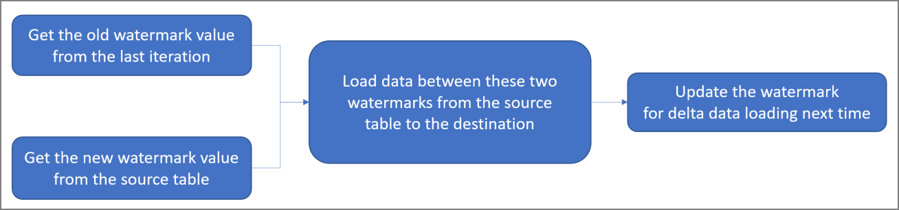
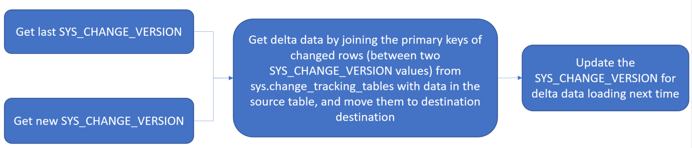

# Incrementally load data from a source data store to a destination data store

[!INCLUDE[appliesto-adf-xxx-md](includes/appliesto-adf-xxx-md.md)]

In a data integration solution, incrementally (or delta) loading data after an initial full data load is a widely used scenario. The tutorials in this section show you different ways of loading data incrementally by using Azure Data Factory.

## Delta data loading from database by using a watermark
In this case, you define a watermark in your source database. A watermark is a column that has the last updated time stamp or an incrementing key. The delta loading solution loads the changed data between an old watermark and a new watermark. The workflow for this approach is depicted in the following diagram: 

For step-by-step instructions, see the following tutorials: 
- [Incrementally copy data from one table in Azure SQL Database to Azure Blob storage](tutorial-incremental-copy-powershell.md)
- [Incrementally copy data from multiple tables in a SQL Server instance to Azure SQL Database](tutorial-incremental-copy-multiple-tables-powershell.md)

For templates, see the following:
- [Delta copy with control table](solution-template-delta-copy-with-control-table.md)

## Delta data loading from SQL DB by using the Change Tracking technology
Change Tracking technology is a lightweight solution in SQL Server and Azure SQL Database that provides an efficient change tracking mechanism for applications. It enables an application to easily identify data that was inserted, updated, or deleted. 

The workflow for this approach is depicted in the following diagram:

For step-by-step instructions, see the following tutorial:  
- [Incrementally copy data from Azure SQL Database to Azure Blob storage by using Change Tracking technology](tutorial-incremental-copy-change-tracking-feature-powershell.md)

## Loading new and changed files only by using LastModifiedDate
You can copy the new and changed files only by using LastModifiedDate to the destination store. ADF will scan all the files from the source store, apply the file filter by their LastModifiedDate, and only copy the new and updated file since last time to the destination store.  Please be aware if you let ADF scan huge amounts of files but only copy a few files to destination, you would still expect the long duration due to file scanning is time consuming as well.   

For step-by-step instructions, see the following tutorial:  
- [Incrementally copy new and changed files based on LastModifiedDate from Azure Blob storage to Azure Blob storage](tutorial-incremental-copy-lastmodified-copy-data-tool.md)

For templates, see the following:
- [Copy new files by LastModifiedDate](solution-template-copy-new-files-lastmodifieddate.md)

## Loading new files only by using time partitioned folder or file name.
You can copy new files only, where files or folders has already been time partitioned with timeslice information as part of the file or folder name (for example, /yyyy/mm/dd/file.csv). It is the most performant approach for incrementally loading new files. 

For step-by-step instructions, see the following tutorial:  
- [Incrementally copy new files based on time partitioned folder or file name from Azure Blob storage to Azure Blob storage](tutorial-incremental-copy-partitioned-file-name-copy-data-tool.md)

## Next steps
Advance to the following tutorial: 

> [!div class="nextstepaction"]
>[Incrementally copy data from one table in Azure SQL Database to Azure Blob storage](tutorial-incremental-copy-powershell.md)
