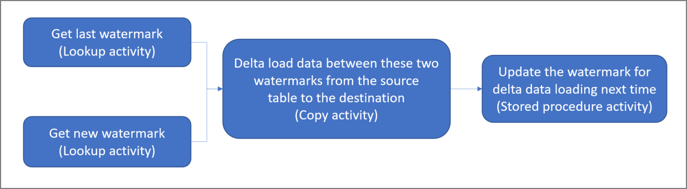

# Incrementally load data from an Azure SQL database to Azure Blob storage
In this tutorial, you create an Azure data factory with a pipeline that loads delta data from a table in an Azure SQL database to Azure Blob storage. 

You perform the following steps in this tutorial:

> [!div class="checklist"]
> * Prepare the data store to store the watermark value.
> * Create a data factory.
> * Create linked services. 
> * Create source, sink, and watermark datasets.
> * Create a pipeline.
> * Run the pipeline.
> * Monitor the pipeline run. 
> * Review results
> * Add more data to the source.
> * Run the pipeline again.
> * Monitor the second pipeline run
> * Review results from the second run


## Overview
Here is the high-level solution diagram: 



Here are the important steps to create this solution: 

1. **Select the watermark column**.
	Select one column in the source data store, which can be used to slice the new or updated records for every run. Normally, the data in this selected column (for example, last_modify_time or ID) keeps increasing when rows are created or updated. The maximum value in this column is used as a watermark.

2. **Prepare a data store to store the watermark value**. In this tutorial, you store the watermark value in a SQL database.
	
3. **Create a pipeline with the following workflow**: 
	
	The pipeline in this solution has the following activities:
  
	* Create two Lookup activities. Use the first Lookup activity to retrieve the last watermark value. Use the second Lookup activity to retrieve the new watermark value. These watermark values are passed to the Copy activity. 
	* Create a Copy activity that copies rows from the source data store with the value of the watermark column greater than the old watermark value and less than the new watermark value. Then, it copies the delta data from the source data store to Blob storage as a new file. 
	* Create a StoredProcedure activity that updates the watermark value for the pipeline that runs next time. 


If you don't have an Azure subscription, create a [free](https://azure.microsoft.com/free/) account before you begin.

## Prerequisites
* **Azure SQL Database**. You use the database as the source data store. If you don't have a SQL database, see [Create an Azure SQL database](../sql-database/sql-database-get-started-portal.md) for steps to create one.
* **Azure Storage**. You use the blob storage as the sink data store. If you don't have a storage account, see [Create a storage account](../storage/common/storage-quickstart-create-account.md) for steps to create one. Create a container named adftutorial. 

### Create a data source table in your SQL database
1. Open SQL Server Management Studio. In **Server Explorer**, right-click the database, and choose **New Query**.

2. Run the following SQL command against your SQL database to create a table named `data_source_table` as the data source store: 
    
    ```sql
	create table data_source_table
	(
		PersonID int,
		Name varchar(255),
		LastModifytime datetime
	);

	INSERT INTO data_source_table
	(PersonID, Name, LastModifytime)
	VALUES
	(1, 'aaaa','9/1/2017 12:56:00 AM'),
	(2, 'bbbb','9/2/2017 5:23:00 AM'),
	(3, 'cccc','9/3/2017 2:36:00 AM'),
	(4, 'dddd','9/4/2017 3:21:00 AM'),
	(5, 'eeee','9/5/2017 8:06:00 AM');
    ```
	In this tutorial, you use LastModifytime as the watermark column. The data in the data source store is shown in the following table:

	```
	PersonID | Name | LastModifytime
	-------- | ---- | --------------
	1 | aaaa | 2017-09-01 00:56:00.000
	2 | bbbb | 2017-09-02 05:23:00.000
	3 | cccc | 2017-09-03 02:36:00.000
	4 | dddd | 2017-09-04 03:21:00.000
	5 | eeee | 2017-09-05 08:06:00.000
	```

### Create another table in your SQL database to store the high watermark value
1. Run the following SQL command against your SQL database to create a table named `watermarktable` to store the watermark value:  
    
    ```sql
    create table watermarktable
    (
    
    TableName varchar(255),
    WatermarkValue datetime,
    );
    ```
2. Set the default value of the high watermark with the table name of source data store. In this tutorial, the table name is data_source_table.

    ```sql
    INSERT INTO watermarktable
    VALUES ('data_source_table','1/1/2010 12:00:00 AM')    
    ```
3. Review the data in the table `watermarktable`.
    
    ```sql
    Select * from watermarktable
    ```
    Output: 

    ```
    TableName  | WatermarkValue
    ----------  | --------------
    data_source_table | 2010-01-01 00:00:00.000
    ```

### Create a stored procedure in your SQL database 

Run the following command to create a stored procedure in your SQL database:

```sql
CREATE PROCEDURE usp_write_watermark @LastModifiedtime datetime, @TableName varchar(50)
AS

BEGIN
    
	UPDATE watermarktable
	SET [WatermarkValue] = @LastModifiedtime 
WHERE [TableName] = @TableName
	
END
```

## Create a data factory

1. Launch **Microsoft Edge** or **Google Chrome** web browser. Currently, Data Factory UI is supported only in Microsoft Edge and Google Chrome web browsers.
1. On the left menu, select **Create a resource** > **Data + Analytics** > **Data Factory**: 
   
   

2. In the **New data factory** page, enter **ADFIncCopyTutorialDF** for the **name**. 
      
     
 
   The name of the Azure data factory must be **globally unique**. If you see a red exclamation mark with the following error, change the name of the data factory (for example, yournameADFIncCopyTutorialDF) and try creating again. See [Data Factory - Naming Rules](naming-rules.md) article for naming rules for Data Factory artifacts.
  
       `Data factory name "ADFIncCopyTutorialDF" is not available`
3. Select your Azure **subscription** in which you want to create the data factory. 
4. For the **Resource Group**, do one of the following steps:
     
      - Select **Use existing**, and select an existing resource group from the drop-down list. 
      - Select **Create new**, and enter the name of a resource group.   
         
        To learn about resource groups, see [Using resource groups to manage your Azure resources](../azure-resource-manager/resource-group-overview.md).  
4. Select **V2** for the **version**.
5. Select the **location** for the data factory. Only locations that are supported are displayed in the drop-down list. The data stores (Azure Storage, Azure SQL Database, etc.) and computes (HDInsight, etc.) used by data factory can be in other regions.
6. Select **Pin to dashboard**.     
7. Click **Create**.      
8. On the dashboard, you see the following tile with status: **Deploying data factory**. 

	
9. After the creation is complete, you see the **Data Factory** page as shown in the image.
   
   
10. Click **Author & Monitor** tile to launch the Azure Data Factory user interface (UI) in a separate tab.

## Create a pipeline
In this tutorial, you create a pipeline with two Lookup activities, one Copy activity, and one StoredProcedure activity chained in one pipeline. 

1. In the **get started** page of Data Factory UI, click the **Create pipeline** tile. 

       
3. In the **General** page of the **Properties** window for the pipeline, enter **IncrementalCopyPipeline** name. 

   
4. Let's add the first lookup activity to get the old watermark value. In the **Activities** toolbox, expand **General**, and drag-drop the **Lookup** activity to the pipeline designer surface. Change the name of the activity to **LookupOldWaterMarkActivity**.

   
5. Switch to the **Settings** tab, and click **+ New** for **Source Dataset**. In this step, you create a dataset to represent data in the **watermarktable**. This table contains the old watermark that was used in the previous copy operation. 

   
6. In the **New Dataset** window, select **Azure SQL Database**, and click **Finish**. You see a new tab opened for the dataset. 

   
7. In the properties window for the dataset, enter **WatermarkDataset** for **Name**.

   
8. Switch to the **Connection** tab, and click **+ New** to make a connection (create a linked service) to your Azure SQL database. 

   
9. In the **New Linked Service** window, do the following steps:

    1. Enter **AzureSqlDatabaseLinkedService** for **Name**. 
    2. Select your Azure SQL server for **Server name**.
    3. Enter the **name of the user** to access for the Azure SQL server. 
    4. Enter the **password** for the user. 
    5. To test connection to the Azure SQL database, click **Test connection**.
    6. Click **Save**.
    7. In the **Connection** tab, confirm that **AzureSqlDatabaseLinkedService** is selected for **Linked service**.
       
        
10. Select **[dbo].[watermarktable]** for **Table**. If you want to preview data in the table, click **Preview data**.

	
11. Switch to the pipeline editor by clicking the pipeline tab at the top or by clicking the name of the pipeline in the tree view on the left. In the properties window for the **Lookup** activity, confirm that **WatermarkDataset** is selected for the **Source Dataset** field. 

	
12. In the **Activities** toolbox, expand **General**, and drag-drop another **Lookup** activity to the pipeline designer surface, and set the name to **LookupNewWaterMarkActivity** in the **General** tab of the properties window. This Lookup activity gets the new watermark value from the table with the source data to be copied to the destination. 

    
13. In the properties window for the second **Lookup** activity, switch to the **Settings** tab, and click **New**. You create a dataset to point to the source table that contains the new watermark value (maximum value of LastModifyTime). 

    
14. In the **New Dataset** window, select **Azure SQL Database**, and click **Finish**. You see a new tab opened for this dataset. You also see the dataset in the tree view. 
15. In the **General** tab of the properties window, enter **SourceDataset** for **Name**. 

    
16. Switch to the **Connection** tab, and do the following steps: 

    1. Select **AzureSqlDatabaseLinkedService** for **Linked service**.
    2. Select **[dbo].[data_source_table]** for Table. You specify a query on this dataset later in the tutorial. The query takes the precedence over the table you specify in this step. 

        
17. Switch to the pipeline editor by clicking the pipeline tab at the top or by clicking the name of the pipeline in the tree view on the left. In the properties window for the **Lookup** activity, confirm that **SourceDataset** is selected for the **Source Dataset** field. 
18. Select **Query** for the **Use Query** field, and enter the following query: you are only selecting the maximum value of **LastModifytime** from the **data_source_table**. Please make sure you have also checked **Fist row only**.

    ```sql
    select MAX(LastModifytime) as NewWatermarkvalue from data_source_table
    ```

    
19. In the **Activities** toolbox, expand **DataFlow**, and drag-drop the **Copy** activity from the Activities toolbox, and set the name to **IncrementalCopyActivity**. 

    
20. **Connect both Lookup activities to the Copy activity** by dragging the **green button** attached to the Lookup activities to the Copy activity. Release the mouse button when you see the border color of the Copy activity changes to blue. 

    
21. Select the **Copy activity** and confirm that you see the properties for the activity in the **Properties** window. 

    
22. Switch to the **Source** tab in the **Properties** window, and do the following steps:

    1. Select **SourceDataset** for the **Source Dataset** field. 
    2. Select **Query** for the **Use Query** field. 
    3. Enter the following SQL query for the **Query** field. 

        ```sql
        select * from data_source_table where LastModifytime > '@{activity('LookupOldWaterMarkActivity').output.firstRow.WatermarkValue}' and LastModifytime <= '@{activity('LookupNewWaterMarkActivity').output.firstRow.NewWatermarkvalue}'
        ```
    
        
23. Switch to the **Sink** tab, and click **+ New** for the **Sink Dataset** field. 

    
24. In this tutorial sink data store is of type Azure Blob Storage. Therefore, select **Azure Blob Storage**, and click **Finish** in the **New Dataset** window. 

    
25. In the **General** tab of the Properties window for the dataset, enter **SinkDataset** for **Name**. 

    
26. Switch to the **Connection** tab, and click **+ New**. In this step, you create a connection (linked service) to your **Azure Blob storage**.

    
26. In the **New Linked Service** window, do the following steps: 

    1. Enter **AzureStorageLinkedService** for **Name**. 
    2. Select your Azure Storage account for **Storage account name**.
    3. Click **Save**. 

        
27. In the **Connection** tab, do the following steps:

    1. Confirm that **AzureStorageLinkedService** is selected for **Linked service**. 
    2. For the **folder** part of the **File path** field, enter **adftutorial/incrementalcopy**. **adftutorial** is the blob container name and **incrementalcopy** is the folder name. This snippet assumes that you have a blob container named adftutorial in your blob storage. Create the container if it doesn't exist, or set it to the name of an existing one. Azure Data Factory automatically creates the output folder **incrementalcopy** if it does not exist. You can also use the **Browse** button for the **File path** to navigate to a folder in a blob container. .RunId, '.txt')`.
    3. Fir the **filename** part of the **File path** field, enter `@CONCAT('Incremental-', pipeline().RunId, '.txt')`. The file name is dynamically generated by using the expression. Each pipeline run has a unique ID. The Copy activity uses the run ID to generate the file name. 

        
28. Switch to the **pipeline** editor by clicking the pipeline tab at the top or by clicking the name of the pipeline in the tree view on the left. 
29. In the **Activities** toolbox, expand **General**, and drag-drop the **Stored Procedure** activity from the **Activities** toolbox to the pipeline designer surface. **Connect** the green (Success) output of the **Copy** activity to the **Stored Procedure** activity. 
    
    
24. Select **Stored Procedure Activity** in the pipeline designer, change its name to **StoredProceduretoWriteWatermarkActivity**. 

    
25. Switch to the **SQL Account** tab, and select *AzureSqlDatabaseLinkedService** for **Linked service**. 

    
26. Switch to the **Stored Procedure** tab, and do the following steps: 

    1. For **Stored procedure name**, select **usp_write_watermark**. 
    2. To specify values for the stored procedure parameters, click **Import parameter**, and enter following values for the parameters: 

        | Name | Type | Value | 
        | ---- | ---- | ----- | 
        | LastModifiedtime | DateTime | @{activity('LookupNewWaterMarkActivity').output.firstRow.NewWatermarkvalue} |
        | TableName | String | @{activity('LookupOldWaterMarkActivity').output.firstRow.TableName} |

    
27. To validate the pipeline settings, click **Validate** on the toolbar. Confirm that there are no validation errors. To close the **Pipeline Validation Report** window, click >>.   

    
28. Publish entities (linked services, datasets, and pipelines) to the Azure Data Factory service by selecting the **Publish All** button. Wait until you see a message that the publishing succeeded. 

    

## Trigger a pipeline run
1. Click **Trigger** on the toolbar, and click **Trigger Now**. 

    
2. In the **Pipeline Run** window, select **Finish**. 

## Monitor the pipeline run

1. Switch to the **Monitor** tab on the left. You can see the status of the pipeline run triggered by the manual trigger. Click **Refresh** button to refresh the list. 
    
    
2. To view activity runs associated with this pipeline run, click the first link (**View Activity Runs**) in the **Actions** column. You can go back to the previous view by clicking **Pipelines** at the top. Click **Refresh** button to refresh the list.

    

## Review the results
1. Connect to your Azure Storage Account by using tools such as [Azure Storage Explorer](https://azure.microsoft.com/features/storage-explorer/). Verify that an output file is created in the **incrementalcopy** folder of the **adftutorial** container.

    
2. Open the output file and notice that all the data is copied from the **data_source_table** to the blob file. 

    ```
    1,aaaa,2017-09-01 00:56:00.0000000
    2,bbbb,2017-09-02 05:23:00.0000000
    3,cccc,2017-09-03 02:36:00.0000000
    4,dddd,2017-09-04 03:21:00.0000000
    5,eeee,2017-09-05 08:06:00.0000000
    ```
3. Check the latest value from `watermarktable`. You see that the watermark value was updated.

	```sql
	Select * from watermarktable
	```
	
	Here is the output:
 
	| TableName | WatermarkValue |
	| --------- | -------------- |
	| data_source_table | 2017-09-05	8:06:00.000 | 

## Add more data to source

Insert new data into the SQL database (data source store).

```sql
INSERT INTO data_source_table
VALUES (6, 'newdata','9/6/2017 2:23:00 AM')

INSERT INTO data_source_table
VALUES (7, 'newdata','9/7/2017 9:01:00 AM')
```	

The updated data in the SQL database is:

```
PersonID | Name | LastModifytime
-------- | ---- | --------------
1 | aaaa | 2017-09-01 00:56:00.000
2 | bbbb | 2017-09-02 05:23:00.000
3 | cccc | 2017-09-03 02:36:00.000
4 | dddd | 2017-09-04 03:21:00.000
5 | eeee | 2017-09-05 08:06:00.000
6 | newdata | 2017-09-06 02:23:00.000
7 | newdata | 2017-09-07 09:01:00.000
```


## Trigger another pipeline run
1. Switch to the **Edit** tab. Click the pipeline in the tree view if it's not opened in the designer. 

    
2. Click **Trigger** on the toolbar, and click **Trigger Now**. 

    

## Monitor the second pipeline run

1. Switch to the **Monitor** tab on the left. You can see the status of the pipeline run triggered by the manual trigger. Click **Refresh** button to refresh the list. 
    
    
2. To view activity runs associated with this pipeline run, click the first link (**View Activity Runs**) in the **Actions** column. You can go back to the previous view by clicking **Pipelines** at the top. Click **Refresh** button to refresh the list.

    

## Verify the second output

1. In the blob storage, you see that another file was created. In this tutorial, the new file name is `Incremental-<GUID>.txt`. Open that file, and you see two rows of records in it.

    ```
    6,newdata,2017-09-06 02:23:00.0000000
    7,newdata,2017-09-07 09:01:00.0000000    
    ```
2. Check the latest value from `watermarktable`. You see that the watermark value was updated again.

	```sql
	Select * from watermarktable
	```
	sample output: 
	
	| TableName | WatermarkValue |
	| --------- | --------------- |
	| data_source_table | 2017-09-07 09:01:00.000 |


     
## Next steps
You performed the following steps in this tutorial: 

> [!div class="checklist"]
> * Prepare the data store to store the watermark value.
> * Create a data factory.
> * Create linked services. 
> * Create source, sink, and watermark datasets.
> * Create a pipeline.
> * Run the pipeline.
> * Monitor the pipeline run. 
> * Review results
> * Add more data to the source.
> * Run the pipeline again.
> * Monitor the second pipeline run
> * Review results from the second run

In this tutorial, the pipeline copied data from a single table in a SQL database to Blob storage. Advance to the following tutorial to learn how to copy data from multiple tables in an on-premises SQL Server database to a SQL database. 

> [!div class="nextstepaction"]
>[Incrementally load data from multiple tables in SQL Server to Azure SQL Database](tutorial-incremental-copy-multiple-tables-portal.md)


