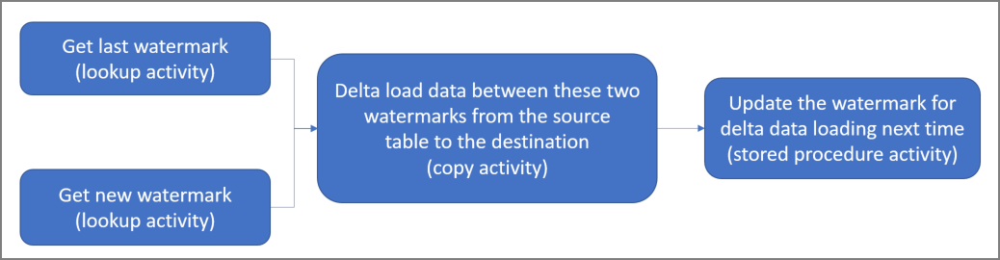

# Incrementally load data from an Azure SQL database to Azure Blob storage
In this tutorial, you create an Azure data factory with a pipeline that loads delta data from a table in an Azure SQL database to Azure Blob storage. 

You perform the following steps in this tutorial:

> [!div class="checklist"]
> * Prepare the data store to store the watermark value.
> * Create a data factory.
> * Create linked services. 
> * Create source, sink, and watermark datasets.
> * Create a pipeline.
> * Run the pipeline.
> * Monitor the pipeline run. 

## Overview
Here is the high-level solution diagram: 



Here are the important steps to create this solution: 

1. **Select the watermark column**.
	Select one column in the source data store, which can be used to slice the new or updated records for every run. Normally, the data in this selected column (for example, last_modify_time or ID) keeps increasing when rows are created or updated. The maximum value in this column is used as a watermark.

2. **Prepare a data store to store the watermark value**.   
	In this tutorial, you store the watermark value in a SQL database.
	
3. **Create a pipeline with the following workflow**: 
	
	The pipeline in this solution has the following activities:
  
	* Create two Lookup activities. Use the first Lookup activity to retrieve the last watermark value. Use the second Lookup activity to retrieve the new watermark value. These watermark values are passed to the Copy activity. 
	* Create a Copy activity that copies rows from the source data store with the value of the watermark column greater than the old watermark value and less than the new watermark value. Then, it copies the delta data from the source data store to Blob storage as a new file. 
	* Create a StoredProcedure activity that updates the watermark value for the pipeline that runs next time. 


If you don't have an Azure subscription, create a [free](https://azure.microsoft.com/free/) account before you begin.

## Prerequisites

[!INCLUDE [updated-for-az](../../includes/updated-for-az.md)]

* **Azure SQL Database**. You use the database as the source data store. If you don't have a SQL database, see [Create an Azure SQL database](../sql-database/sql-database-get-started-portal.md) for steps to create one.
* **Azure Storage**. You use the blob storage as the sink data store. If you don't have a storage account, see [Create a storage account](../storage/common/storage-quickstart-create-account.md) for steps to create one. Create a container named adftutorial. 
* **Azure PowerShell**. Follow the instructions in [Install and configure Azure PowerShell](/powershell/azure/install-Az-ps).

### Create a data source table in your SQL database
1. Open SQL Server Management Studio. In **Server Explorer**, right-click the database, and choose **New Query**.

2. Run the following SQL command against your SQL database to create a table named `data_source_table` as the data source store: 
    
    ```sql
	create table data_source_table
	(
		PersonID int,
		Name varchar(255),
		LastModifytime datetime
	);

	INSERT INTO data_source_table
	(PersonID, Name, LastModifytime)
	VALUES
	(1, 'aaaa','9/1/2017 12:56:00 AM'),
	(2, 'bbbb','9/2/2017 5:23:00 AM'),
	(3, 'cccc','9/3/2017 2:36:00 AM'),
	(4, 'dddd','9/4/2017 3:21:00 AM'),
	(5, 'eeee','9/5/2017 8:06:00 AM');
    ```
	In this tutorial, you use LastModifytime as the watermark column. The data in the data source store is shown in the following table:

	```
	PersonID | Name | LastModifytime
	-------- | ---- | --------------
	1 | aaaa | 2017-09-01 00:56:00.000
	2 | bbbb | 2017-09-02 05:23:00.000
	3 | cccc | 2017-09-03 02:36:00.000
	4 | dddd | 2017-09-04 03:21:00.000
	5 | eeee | 2017-09-05 08:06:00.000
	```

### Create another table in your SQL database to store the high watermark value
1. Run the following SQL command against your SQL database to create a table named `watermarktable` to store the watermark value:  
    
    ```sql
    create table watermarktable
    (
    
    TableName varchar(255),
    WatermarkValue datetime,
    );
    ```
2. Set the default value of the high watermark with the table name of source data store. In this tutorial, the table name is data_source_table.

    ```sql
    INSERT INTO watermarktable
    VALUES ('data_source_table','1/1/2010 12:00:00 AM')    
    ```
3. Review the data in the table `watermarktable`.
    
    ```sql
    Select * from watermarktable
    ```
    Output: 

    ```
    TableName  | WatermarkValue
    ----------  | --------------
    data_source_table | 2010-01-01 00:00:00.000
    ```

### Create a stored procedure in your SQL database 

Run the following command to create a stored procedure in your SQL database:

```sql
CREATE PROCEDURE usp_write_watermark @LastModifiedtime datetime, @TableName varchar(50)
AS

BEGIN
    
	UPDATE watermarktable
	SET [WatermarkValue] = @LastModifiedtime 
WHERE [TableName] = @TableName
	
END
```

## Create a data factory
1. Define a variable for the resource group name that you use in PowerShell commands later. Copy the following command text to PowerShell, specify a name for the [Azure resource group](../azure-resource-manager/resource-group-overview.md) in double quotation marks, and then run the command. An example is `"adfrg"`. 
   
     ```powershell
    $resourceGroupName = "ADFTutorialResourceGroup";
    ```

    If the resource group already exists, you might not want to overwrite it. Assign a different value to the `$resourceGroupName` variable, and run the command again.

2. Define a variable for the location of the data factory. 

    ```powershell
    $location = "East US"
    ```
3. To create the Azure resource group, run the following command: 

    ```powershell
    New-AzResourceGroup $resourceGroupName $location
    ``` 
    If the resource group already exists, you might not want to overwrite it. Assign a different value to the `$resourceGroupName` variable, and run the command again.

4. Define a variable for the data factory name. 

    > [!IMPORTANT]
    >  Update the data factory name to make it globally unique. An example is ADFTutorialFactorySP1127. 

    ```powershell
    $dataFactoryName = "ADFIncCopyTutorialFactory";
    ```
5. To create the data factory, run the following **Set-AzDataFactoryV2** cmdlet: 
    
    ```powershell       
    Set-AzDataFactoryV2 -ResourceGroupName $resourceGroupName -Location "East US" -Name $dataFactoryName 
    ```

Note the following points:

* The name of the data factory must be globally unique. If you receive the following error, change the name and try again:

    ```
    The specified Data Factory name 'ADFv2QuickStartDataFactory' is already in use. Data Factory names must be globally unique.
    ```

* To create Data Factory instances, the user account you use to sign in to Azure must be a member of contributor or owner roles, or an administrator of the Azure subscription.
* For a list of Azure regions in which Data Factory is currently available, select the regions that interest you on the following page, and then expand **Analytics** to locate **Data Factory**: [Products available by region](https://azure.microsoft.com/global-infrastructure/services/). The data stores (Storage, SQL Database, etc.) and computes (Azure HDInsight, etc.) used by the data factory can be in other regions.


## Create linked services
You create linked services in a data factory to link your data stores and compute services to the data factory. In this section, you create linked services to your storage account and SQL database. 

### Create a Storage linked service
1. Create a JSON file named AzureStorageLinkedService.json in the C:\ADF folder with the following content. (Create the folder ADF if it doesn't already exist.) Replace `<accountName>` and `<accountKey>` with the name and key of your storage account before you save the file.

    ```json
    {
        "name": "AzureStorageLinkedService",
        "properties": {
            "type": "AzureStorage",
            "typeProperties": {
                "connectionString": {
                    "value": "DefaultEndpointsProtocol=https;AccountName=<accountName>;AccountKey=<accountKey>",
                    "type": "SecureString"
                }
            }
        }
    }
    ```
2. In PowerShell, switch to the ADF folder.

3. Run the **Set-AzDataFactoryV2LinkedService** cmdlet to create the linked service AzureStorageLinkedService. In the following example, you pass values for the *ResourceGroupName* and *DataFactoryName* parameters: 

    ```powershell
    Set-AzDataFactoryV2LinkedService -DataFactoryName $dataFactoryName -ResourceGroupName $resourceGroupName -Name "AzureStorageLinkedService" -File ".\AzureStorageLinkedService.json"
    ```

    Here is the sample output:

    ```json
    LinkedServiceName : AzureStorageLinkedService
    ResourceGroupName : <resourceGroupName>
    DataFactoryName   : <dataFactoryName>
    Properties        : Microsoft.Azure.Management.DataFactory.Models.AzureStorageLinkedService
    ```

### Create a SQL Database linked service
1. Create a JSON file named AzureSQLDatabaseLinkedService.json in the C:\ADF folder with the following content. (Create the folder ADF if it doesn't already exist.) Replace &lt;server&gt;, &lt;database&gt;, &lt;user id&gt;, and &lt;password&gt; with the name of your server, database, user ID, and password before you save the file. 

    ```json
    {
    	"name": "AzureSQLDatabaseLinkedService",
    	"properties": {
    		"type": "AzureSqlDatabase",
    		"typeProperties": {
    			"connectionString": {
    				"value": "Server = tcp:<server>.database.windows.net,1433;Initial Catalog=<database>; Persist Security Info=False; User ID=<user> ; Password=<password>; MultipleActiveResultSets = False; Encrypt = True; TrustServerCertificate = False; Connection Timeout = 30;",
    				"type": "SecureString"
    			}
    		}
    	}
    }
    ```
2. In PowerShell, switch to the ADF folder.

3. Run the **Set-AzDataFactoryV2LinkedService** cmdlet to create the linked service AzureSQLDatabaseLinkedService. 

    ```powershell
    Set-AzDataFactoryV2LinkedService -DataFactoryName $dataFactoryName -ResourceGroupName $resourceGroupName -Name "AzureSQLDatabaseLinkedService" -File ".\AzureSQLDatabaseLinkedService.json"
    ```

    Here is the sample output:

    ```json
    LinkedServiceName : AzureSQLDatabaseLinkedService
    ResourceGroupName : ADF
    DataFactoryName   : incrementalloadingADF
    Properties        : Microsoft.Azure.Management.DataFactory.Models.AzureSqlDatabaseLinkedService
    ProvisioningState :
    ```

## Create datasets
In this step, you create datasets to represent source and sink data. 

### Create a source dataset

1. Create a JSON file named SourceDataset.json in the same folder with the following content: 

    ```json
    {
    	"name": "SourceDataset",
    	"properties": {
    		"type": "AzureSqlTable",
    		"typeProperties": {
    			"tableName": "data_source_table"
    		},
    		"linkedServiceName": {
    			"referenceName": "AzureSQLDatabaseLinkedService",
    			"type": "LinkedServiceReference"
    		}
    	}
    }
   
    ```
    In this tutorial, you use the table name data_source_table. Replace it if you use a table with a different name.

2. Run the **Set-AzDataFactoryV2Dataset** cmdlet to create the dataset SourceDataset.
    
    ```powershell
    Set-AzDataFactoryV2Dataset -DataFactoryName $dataFactoryName -ResourceGroupName $resourceGroupName -Name "SourceDataset" -File ".\SourceDataset.json"
    ```

    Here is the sample output of the cmdlet:
    
    ```json
    DatasetName       : SourceDataset
    ResourceGroupName : ADF
    DataFactoryName   : incrementalloadingADF
    Structure         :
    Properties        : Microsoft.Azure.Management.DataFactory.Models.AzureSqlTableDataset
    ```

### Create a sink dataset

1. Create a JSON file named SinkDataset.json in the same folder with the following content: 

    ```json
    {
    	"name": "SinkDataset",
    	"properties": {
    		"type": "AzureBlob",
    		"typeProperties": {
    			"folderPath": "adftutorial/incrementalcopy",
    			"fileName": "@CONCAT('Incremental-', pipeline().RunId, '.txt')", 
    			"format": {
    				"type": "TextFormat"
    			}
    		},
    		"linkedServiceName": {
    			"referenceName": "AzureStorageLinkedService",
    			"type": "LinkedServiceReference"
    		}
    	}
    }   
    ```

   	> [!IMPORTANT]
	> This snippet assumes that you have a blob container named adftutorial in your blob storage. Create the container if it doesn't exist, or set it to the name of an existing one. The output folder `incrementalcopy` is automatically created if it doesn't exist in the container. In this tutorial, the file name is dynamically generated by using the expression `@CONCAT('Incremental-', pipeline().RunId, '.txt')`.

2. Run the **Set-AzDataFactoryV2Dataset** cmdlet to create the dataset SinkDataset.
    
    ```powershell
    Set-AzDataFactoryV2Dataset -DataFactoryName $dataFactoryName -ResourceGroupName $resourceGroupName -Name "SinkDataset" -File ".\SinkDataset.json"
    ```

    Here is the sample output of the cmdlet:
    
    ```json
    DatasetName       : SinkDataset
    ResourceGroupName : ADF
    DataFactoryName   : incrementalloadingADF
    Structure         :
    Properties        : Microsoft.Azure.Management.DataFactory.Models.AzureBlobDataset    
    ```

## Create a dataset for a watermark
In this step, you create a dataset for storing a high watermark value. 

1. Create a JSON file named WatermarkDataset.json in the same folder with the following content: 

    ```json
    {
        "name": " WatermarkDataset ",
        "properties": {
            "type": "AzureSqlTable",
            "typeProperties": {
                "tableName": "watermarktable"
            },
            "linkedServiceName": {
                "referenceName": "AzureSQLDatabaseLinkedService",
                "type": "LinkedServiceReference"
            }
        }
    }    
    ```
2.  Run the **Set-AzDataFactoryV2Dataset** cmdlet to create the dataset WatermarkDataset.
    
    ```powershell
    Set-AzDataFactoryV2Dataset -DataFactoryName $dataFactoryName -ResourceGroupName $resourceGroupName -Name "WatermarkDataset" -File ".\WatermarkDataset.json"
    ```

    Here is the sample output of the cmdlet:
    
    ```json
    DatasetName       : WatermarkDataset
    ResourceGroupName : ADF
    DataFactoryName   : incrementalloadingADF
    Structure         :
    Properties        : Microsoft.Azure.Management.DataFactory.Models.AzureSqlTableDataset    
    ```

## Create a pipeline
In this tutorial, you create a pipeline with two Lookup activities, one Copy activity, and one StoredProcedure activity chained in one pipeline. 


1. Create a JSON file IncrementalCopyPipeline.json in the same folder with the following content: 

    ```json
    {
    	"name": "IncrementalCopyPipeline",
        "properties": {
    		"activities": [
    			{
    				"name": "LookupOldWaterMarkActivity",
    				"type": "Lookup",
    				"typeProperties": {
    					"source": {
    					"type": "SqlSource",
    					"sqlReaderQuery": "select * from watermarktable"
    					},
    
    					"dataset": {
    					"referenceName": "WatermarkDataset",
    					"type": "DatasetReference"
    					}
    				}
    			},
    			{
    				"name": "LookupNewWaterMarkActivity",
    				"type": "Lookup",
    				"typeProperties": {
    					"source": {
    						"type": "SqlSource",
    						"sqlReaderQuery": "select MAX(LastModifytime) as NewWatermarkvalue from data_source_table"
    					},
    
    					"dataset": {
    					"referenceName": "SourceDataset",
    					"type": "DatasetReference"
    					}
    				}
    			},
    			
    			{
    				"name": "IncrementalCopyActivity",
    				"type": "Copy",
    				"typeProperties": {
    					"source": {
    						"type": "SqlSource",
    						"sqlReaderQuery": "select * from data_source_table where LastModifytime > '@{activity('LookupOldWaterMarkActivity').output.firstRow.WatermarkValue}' and LastModifytime <= '@{activity('LookupNewWaterMarkActivity').output.firstRow.NewWatermarkvalue}'"
    					},
    					"sink": {
    						"type": "BlobSink"
    					}
    				},
    				"dependsOn": [
    					{
    						"activity": "LookupNewWaterMarkActivity",
    						"dependencyConditions": [
    							"Succeeded"
    						]
    					},
    					{
    						"activity": "LookupOldWaterMarkActivity",
    						"dependencyConditions": [
    							"Succeeded"
    						]
    					}
    				],
    
    				"inputs": [
    					{
    						"referenceName": "SourceDataset",
    						"type": "DatasetReference"
    					}
    				],
    				"outputs": [
    					{
    						"referenceName": "SinkDataset",
    						"type": "DatasetReference"
    					}
    				]
    			},
    
    			{
    				"name": "StoredProceduretoWriteWatermarkActivity",
    				"type": "SqlServerStoredProcedure",
    				"typeProperties": {
    
    					"storedProcedureName": "usp_write_watermark",
    					"storedProcedureParameters": {
    						"LastModifiedtime": {"value": "@{activity('LookupNewWaterMarkActivity').output.firstRow.NewWatermarkvalue}", "type": "datetime" },
    						"TableName":  { "value":"@{activity('LookupOldWaterMarkActivity').output.firstRow.TableName}", "type":"String"}
    					}
    				},
    
    				"linkedServiceName": {
    					"referenceName": "AzureSQLDatabaseLinkedService",
    					"type": "LinkedServiceReference"
    				},
    
    				"dependsOn": [
    					{
    						"activity": "IncrementalCopyActivity",
    						"dependencyConditions": [
    							"Succeeded"
    						]
    					}
    				]
    			}
    		]
    		
    	}
    }
    ```
	

2. Run the **Set-AzDataFactoryV2Pipeline** cmdlet to create the pipeline IncrementalCopyPipeline.
    
   ```powershell
   Set-AzDataFactoryV2Pipeline -DataFactoryName $dataFactoryName -ResourceGroupName $resourceGroupName -Name "IncrementalCopyPipeline" -File ".\IncrementalCopyPipeline.json"
   ``` 

   Here is the sample output: 

   ```json
    PipelineName      : IncrementalCopyPipeline
    ResourceGroupName : ADF
    DataFactoryName   : incrementalloadingADF
    Activities        : {LookupOldWaterMarkActivity, LookupNewWaterMarkActivity, IncrementalCopyActivity, StoredProceduretoWriteWatermarkActivity}
    Parameters        :
   ```
 
## Run the pipeline

1. Run the pipeline IncrementalCopyPipeline by using the **Invoke-AzDataFactoryV2Pipeline** cmdlet. Replace placeholders with your own resource group and data factory name.

	```powershell
	$RunId = Invoke-AzDataFactoryV2Pipeline -PipelineName "IncrementalCopyPipeline" -ResourceGroupName $resourceGroupName -dataFactoryName $dataFactoryName
	``` 
2. Check the status of the pipeline by running the **Get-AzDataFactoryV2ActivityRun** cmdlet until you see all the activities running successfully. Replace placeholders with your own appropriate time for the parameters *RunStartedAfter* and *RunStartedBefore*. In this tutorial, you use *-RunStartedAfter "2017/09/14"* and *-RunStartedBefore "2017/09/15"*.

	```powershell
	Get-AzDataFactoryV2ActivityRun -DataFactoryName $dataFactoryName -ResourceGroupName $resourceGroupName -PipelineRunId $RunId -RunStartedAfter "<start time>" -RunStartedBefore "<end time>"
	```

	Here is the sample output:
 
	```json
	ResourceGroupName : ADF
	DataFactoryName   : incrementalloadingADF
	ActivityName      : LookupNewWaterMarkActivity
	PipelineRunId     : d4bf3ce2-5d60-43f3-9318-923155f61037
	PipelineName      : IncrementalCopyPipeline
	Input             : {source, dataset}
	Output            : {NewWatermarkvalue}
	LinkedServiceName :
	ActivityRunStart  : 9/14/2017 7:42:42 AM
	ActivityRunEnd    : 9/14/2017 7:42:50 AM
	DurationInMs      : 7777
	Status            : Succeeded
	Error             : {errorCode, message, failureType, target}
	
	ResourceGroupName : ADF
	DataFactoryName   : incrementalloadingADF
	ActivityName      : LookupOldWaterMarkActivity
	PipelineRunId     : d4bf3ce2-5d60-43f3-9318-923155f61037
	PipelineName      : IncrementalCopyPipeline
	Input             : {source, dataset}
	Output            : {TableName, WatermarkValue}
	LinkedServiceName :
	ActivityRunStart  : 9/14/2017 7:42:42 AM
	ActivityRunEnd    : 9/14/2017 7:43:07 AM
	DurationInMs      : 25437
	Status            : Succeeded
	Error             : {errorCode, message, failureType, target}
	
	ResourceGroupName : ADF
	DataFactoryName   : incrementalloadingADF
	ActivityName      : IncrementalCopyActivity
	PipelineRunId     : d4bf3ce2-5d60-43f3-9318-923155f61037
	PipelineName      : IncrementalCopyPipeline
	Input             : {source, sink}
	Output            : {dataRead, dataWritten, rowsCopied, copyDuration...}
	LinkedServiceName :
	ActivityRunStart  : 9/14/2017 7:43:10 AM
	ActivityRunEnd    : 9/14/2017 7:43:29 AM
	DurationInMs      : 19769
	Status            : Succeeded
	Error             : {errorCode, message, failureType, target}
	
	ResourceGroupName : ADF
	DataFactoryName   : incrementalloadingADF
	ActivityName      : StoredProceduretoWriteWatermarkActivity
	PipelineRunId     : d4bf3ce2-5d60-43f3-9318-923155f61037
	PipelineName      : IncrementalCopyPipeline
	Input             : {storedProcedureName, storedProcedureParameters}
	Output            : {}
	LinkedServiceName :
	ActivityRunStart  : 9/14/2017 7:43:32 AM
	ActivityRunEnd    : 9/14/2017 7:43:47 AM
	DurationInMs      : 14467
	Status            : Succeeded
	Error             : {errorCode, message, failureType, target}

	```

## Review the results

1. In the blob storage (sink store), you see that the data were copied to the file defined in SinkDataset. In the current tutorial, the file name is `Incremental- d4bf3ce2-5d60-43f3-9318-923155f61037.txt`. Open the file, and you can see records in the file that are the same as the data in the SQL database.

	```
	1,aaaa,2017-09-01 00:56:00.0000000
	2,bbbb,2017-09-02 05:23:00.0000000
	3,cccc,2017-09-03 02:36:00.0000000
	4,dddd,2017-09-04 03:21:00.0000000
	5,eeee,2017-09-05 08:06:00.0000000
	```	
2. Check the latest value from `watermarktable`. You see that the watermark value was updated.

	```sql
	Select * from watermarktable
	```
	
	Here is the sample output:
 
	TableName | WatermarkValue
	--------- | --------------
	data_source_table | 2017-09-05	8:06:00.000

### Insert data into the data source store to verify delta data loading

1. Insert new data into the SQL database (data source store).

	```sql
	INSERT INTO data_source_table
	VALUES (6, 'newdata','9/6/2017 2:23:00 AM')
	
	INSERT INTO data_source_table
	VALUES (7, 'newdata','9/7/2017 9:01:00 AM')
	```	

	The updated data in the SQL database is:

    ```
	PersonID | Name | LastModifytime
	-------- | ---- | --------------
	1 | aaaa | 2017-09-01 00:56:00.000
	2 | bbbb | 2017-09-02 05:23:00.000
	3 | cccc | 2017-09-03 02:36:00.000
	4 | dddd | 2017-09-04 03:21:00.000
	5 | eeee | 2017-09-05 08:06:00.000
	6 | newdata | 2017-09-06 02:23:00.000
	7 | newdata | 2017-09-07 09:01:00.000
    ```
2. Run the pipeline IncrementalCopyPipeline again by using the **Invoke-AzDataFactoryV2Pipeline** cmdlet. Replace placeholders with your own resource group and data factory name.

	```powershell
	$RunId = Invoke-AzDataFactoryV2Pipeline -PipelineName "IncrementalCopyPipeline" -ResourceGroupName $resourceGroupName -dataFactoryName $dataFactoryName
	```
3. Check the status of the pipeline by running the **Get-AzDataFactoryV2ActivityRun** cmdlet until you see all the activities running successfully. Replace placeholders with your own appropriate time for the parameters *RunStartedAfter* and *RunStartedBefore*. In this tutorial, you use *-RunStartedAfter "2017/09/14"* and *-RunStartedBefore "2017/09/15"*.

	```powershell
	Get-AzDataFactoryV2ActivityRun -DataFactoryName $dataFactoryName -ResourceGroupName $resourceGroupName -PipelineRunId $RunId -RunStartedAfter "<start time>" -RunStartedBefore "<end time>"
	```

	Here is the sample output:
 
	```json
	ResourceGroupName : ADF
	DataFactoryName   : incrementalloadingADF
	ActivityName      : LookupNewWaterMarkActivity
	PipelineRunId     : 2fc90ab8-d42c-4583-aa64-755dba9925d7
	PipelineName      : IncrementalCopyPipeline
	Input             : {source, dataset}
	Output            : {NewWatermarkvalue}
	LinkedServiceName :
	ActivityRunStart  : 9/14/2017 8:52:26 AM
	ActivityRunEnd    : 9/14/2017 8:52:58 AM
	DurationInMs      : 31758
	Status            : Succeeded
	Error             : {errorCode, message, failureType, target}
	
	ResourceGroupName : ADF
	DataFactoryName   : incrementalloadingADF
	ActivityName      : LookupOldWaterMarkActivity
	PipelineRunId     : 2fc90ab8-d42c-4583-aa64-755dba9925d7
	PipelineName      : IncrementalCopyPipeline
	Input             : {source, dataset}
	Output            : {TableName, WatermarkValue}
	LinkedServiceName :
	ActivityRunStart  : 9/14/2017 8:52:26 AM
	ActivityRunEnd    : 9/14/2017 8:52:52 AM
	DurationInMs      : 25497
	Status            : Succeeded
	Error             : {errorCode, message, failureType, target}
	
	ResourceGroupName : ADF
	DataFactoryName   : incrementalloadingADF
	ActivityName      : IncrementalCopyActivity
	PipelineRunId     : 2fc90ab8-d42c-4583-aa64-755dba9925d7
	PipelineName      : IncrementalCopyPipeline
	Input             : {source, sink}
	Output            : {dataRead, dataWritten, rowsCopied, copyDuration...}
	LinkedServiceName :
	ActivityRunStart  : 9/14/2017 8:53:00 AM
	ActivityRunEnd    : 9/14/2017 8:53:20 AM
	DurationInMs      : 20194
	Status            : Succeeded
	Error             : {errorCode, message, failureType, target}
	
	ResourceGroupName : ADF
	DataFactoryName   : incrementalloadingADF
	ActivityName      : StoredProceduretoWriteWatermarkActivity
	PipelineRunId     : 2fc90ab8-d42c-4583-aa64-755dba9925d7
	PipelineName      : IncrementalCopyPipeline
	Input             : {storedProcedureName, storedProcedureParameters}
	Output            : {}
	LinkedServiceName :
	ActivityRunStart  : 9/14/2017 8:53:23 AM
	ActivityRunEnd    : 9/14/2017 8:53:41 AM
	DurationInMs      : 18502
	Status            : Succeeded
	Error             : {errorCode, message, failureType, target}

	```
4. In the blob storage, you see that another file was created. In this tutorial, the new file name is `Incremental-2fc90ab8-d42c-4583-aa64-755dba9925d7.txt`. Open that file, and you see two rows of records in it.

5. Check the latest value from `watermarktable`. You see that the watermark value was updated again.

	```sql
	Select * from watermarktable
	```
	sample output: 
	
	TableName | WatermarkValue
	--------- | ---------------
	data_source_table | 2017-09-07 09:01:00.000

     
## Next steps
You performed the following steps in this tutorial: 

> [!div class="checklist"]
> * Prepare the data store to store the watermark value. 
> * Create a data factory.
> * Create linked services. 
> * Create source, sink, and watermark datasets.
> * Create a pipeline.
> * Run the pipeline.
> * Monitor the pipeline run. 

In this tutorial, the pipeline copied data from a single table in a SQL database to Blob storage. Advance to the following tutorial to learn how to copy data from multiple tables in an on-premises SQL Server database to a SQL database. 

> [!div class="nextstepaction"]
>[Incrementally load data from multiple tables in SQL Server to Azure SQL Database](tutorial-incremental-copy-multiple-tables-powershell.md)


