# Transform data in Azure Virtual Network using Hive activity in Azure Data Factory using the Azure portal

[!INCLUDE[appliesto-adf-xxx-md](includes/appliesto-adf-xxx-md.md)]

In this tutorial, you use Azure portal to create a Data Factory pipeline that transforms data using Hive Activity on a HDInsight cluster that is in an Azure Virtual Network (VNet). You perform the following steps in this tutorial:

> [!div class="checklist"]
> * Create a data factory. 
> * Create a self-hosted integration runtime
> * Create Azure Storage and Azure HDInsight linked services
> * Create a pipeline with Hive activity.
> * Trigger a pipeline run.
> * Monitor the pipeline run 
> * Verify the output

If you don't have an Azure subscription, create a [free](https://azure.microsoft.com/free/) account before you begin.

## Prerequisites

[!INCLUDE [updated-for-az](../../includes/updated-for-az.md)]

- **Azure Storage account**. You create a hive script, and upload it to the Azure storage. The output from the Hive script is stored in this storage account. In this sample, HDInsight cluster uses this Azure Storage account as the primary storage. 
- **Azure Virtual Network.** If you don't have an Azure virtual network, create it by following [these instructions](../virtual-network/quick-create-portal.md). In this sample, the HDInsight is in an Azure Virtual Network. Here is a sample configuration of Azure Virtual Network. 

	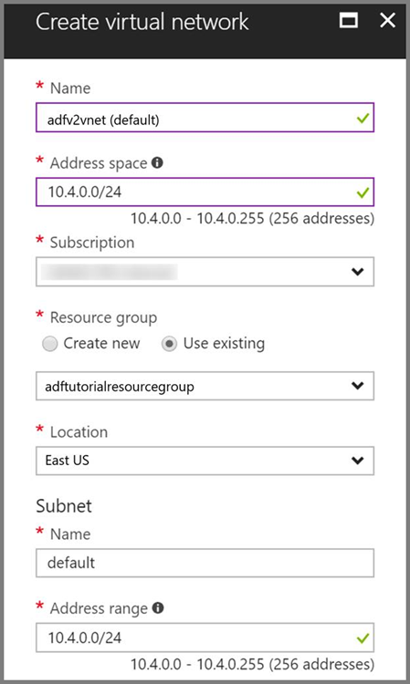
- **HDInsight cluster.** Create a HDInsight cluster and join it to the virtual network you created in the previous step by following this article: [Extend Azure HDInsight using an Azure Virtual Network](../hdinsight/hdinsight-extend-hadoop-virtual-network.md). Here is a sample configuration of HDInsight in a virtual network. 

	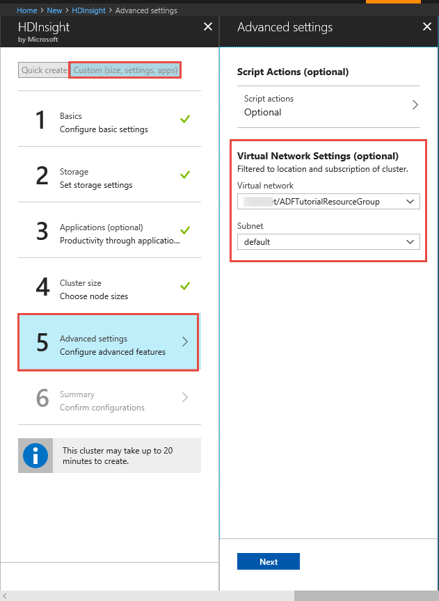
- **Azure PowerShell**. Follow the instructions in [How to install and configure Azure PowerShell](/powershell/azure/install-Az-ps).
- **A virtual machine**. Create an Azure virtual machine VM and join it into the same virtual network that contains your HDInsight cluster. For details, see [How to create virtual machines](../virtual-network/quick-create-portal.md#create-virtual-machines). 

### Upload Hive script to your Blob Storage account

1. Create a Hive SQL file named **hivescript.hql** with the following content:

   ```sql
   DROP TABLE IF EXISTS HiveSampleOut; 
   CREATE EXTERNAL TABLE HiveSampleOut (clientid string, market string, devicemodel string, state string)
   ROW FORMAT DELIMITED FIELDS TERMINATED BY ' ' 
   STORED AS TEXTFILE LOCATION '${hiveconf:Output}';

   INSERT OVERWRITE TABLE HiveSampleOut
   Select 
       clientid,
       market,
       devicemodel,
       state
   FROM hivesampletable
   ```
2. In your Azure Blob Storage, create a container named **adftutorial** if it does not exist.
3. Create a folder named **hivescripts**.
4. Upload the **hivescript.hql** file to the **hivescripts** subfolder.

## Create a data factory

1. Launch **Microsoft Edge** or **Google Chrome** web browser. Currently, Data Factory UI is supported only in Microsoft Edge and Google Chrome web browsers.
1. Log in to the [Azure portal](https://portal.azure.com/).    
2. Click **New** on the left menu, click **Data + Analytics**, and click **Data Factory**. 
   
   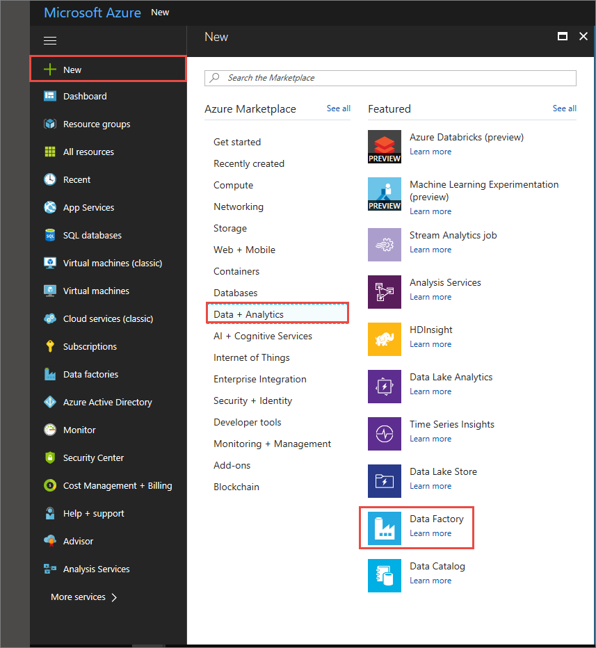
3. In the **New data factory** page, enter **ADFTutorialHiveFactory** for the **name**. 
      
     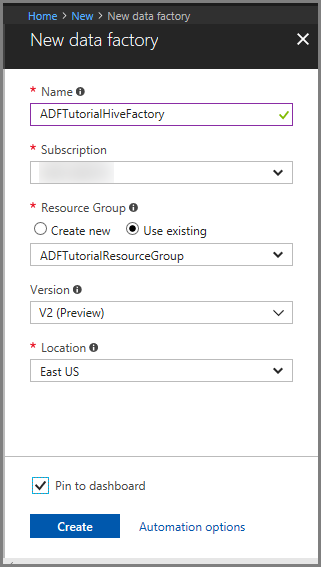
 
   The name of the Azure data factory must be **globally unique**. If you receive the following error, change the name of the data factory (for example, yournameMyAzureSsisDataFactory) and try creating again. See [Data Factory - Naming Rules](naming-rules.md) article for naming rules for Data Factory artifacts.
  
       `Data factory name “MyAzureSsisDataFactory” is not available`
3. Select your Azure **subscription** in which you want to create the data factory. 
4. For the **Resource Group**, do one of the following steps:
     
   - Select **Use existing**, and select an existing resource group from the drop-down list. 
   - Select **Create new**, and enter the name of a resource group.   
         
     To learn about resource groups, see [Using resource groups to manage your Azure resources](../azure-resource-manager/management/overview.md).  
4. Select **V2** for the **version**.
5. Select the **location** for the data factory. Only locations that are supported for creation of data factories are shown in the list.
6. Select **Pin to dashboard**.     
7. Click **Create**.
8. On the dashboard, you see the following tile with status: **Deploying data factory**. 

     
9. After the creation is complete, you see the **Data Factory** page as shown in the image.
   
    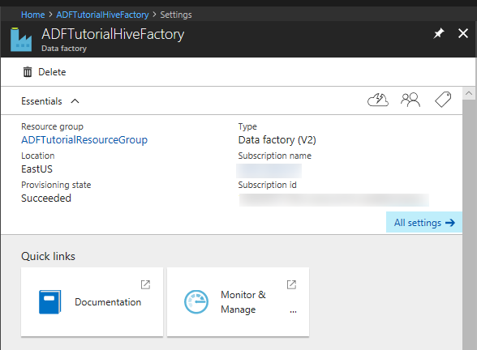
10. Click **Author & Monitor** to launch the Data Factory User Interface (UI) in a separate tab.
11. In the **get started** page, switch to the **Edit** tab in the left panel as shown in the following image: 

    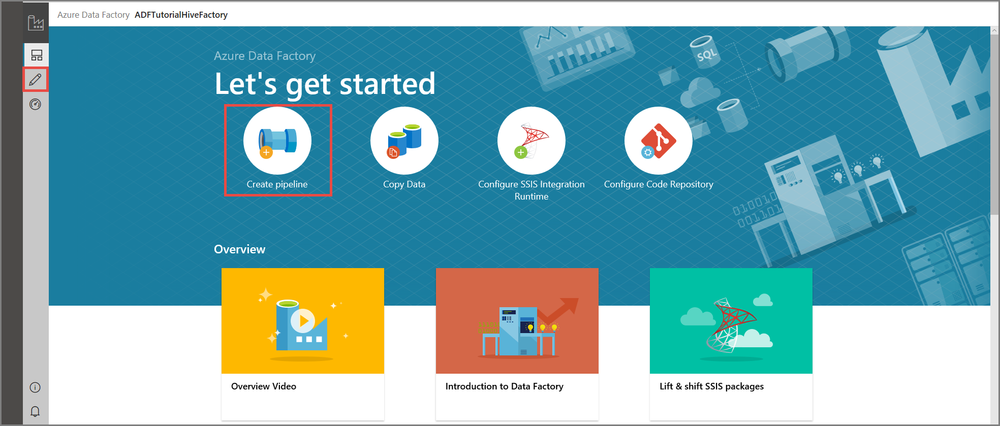

## Create a self-hosted integration runtime
As the Hadoop cluster is inside a virtual network, you need to install a self-hosted integration runtime (IR) in the same virtual network. In this section, you create a new VM, join it to the same virtual network, and install self-hosted IR on it. The self-hosted IR allows Data Factory service to dispatch processing requests to a compute service such as HDInsight inside a virtual network. It also allows you to move data to/from data stores inside a virtual network to Azure. You use a self-hosted IR when the data store or compute is in an on-premises environment as well. 

1. In the Azure Data Factory UI, click **Connections** at the bottom of the window, switch to the **Integration Runtimes** tab, and click **+ New** button on the toolbar. 

   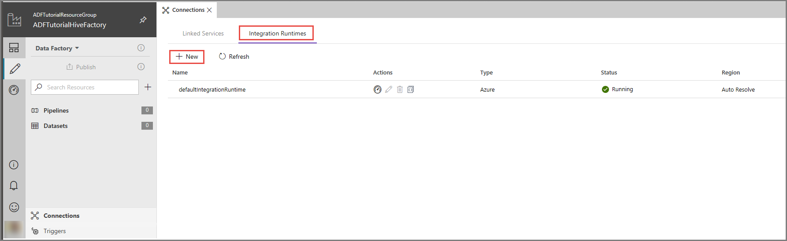
2. In the **Integration Runtime Setup** window, Select **Perform data movement and dispatch activities to external computes** option, and click **Next**. 

   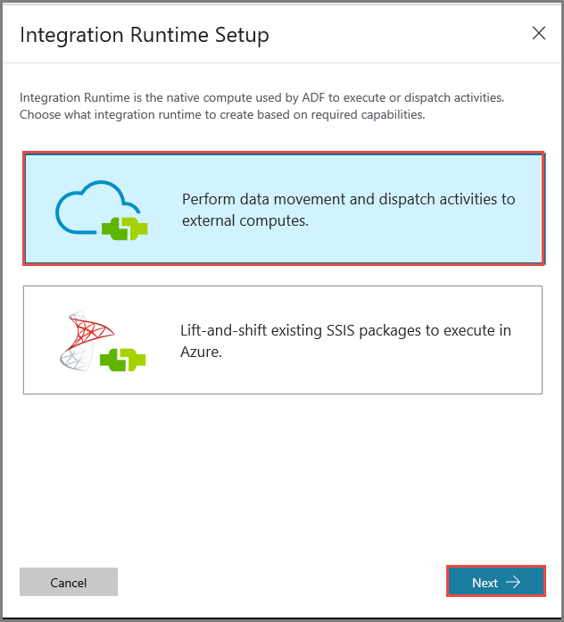
3. Select **Private Network**, and click **Next**.
    
   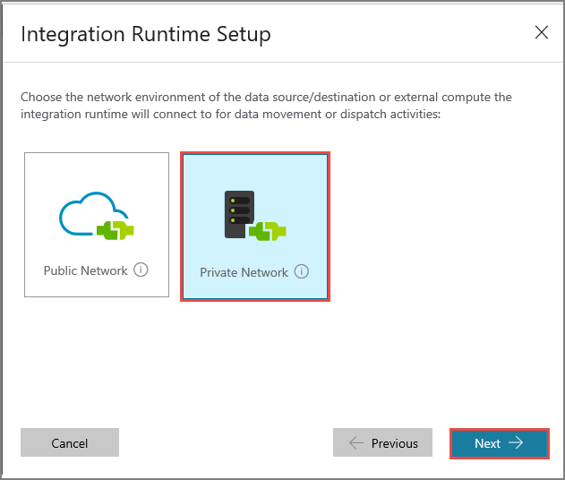
4. Enter **MySelfHostedIR** for **Name**, and click **Next**. 

   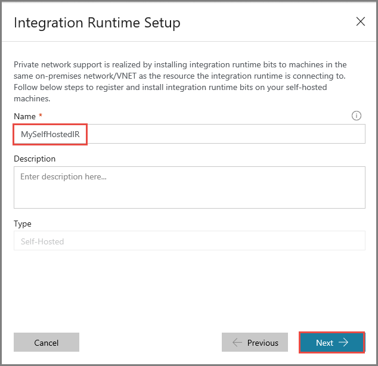 
5. Copy the **authentication key** for the integration runtime by clicking the copy button, and save it. Keep the window open. You use this key to register the IR installed in a virtual machine. 

   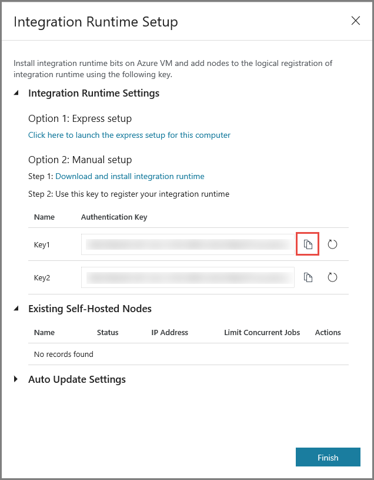

### Install IR on a virtual machine

1. On the Azure VM, download [self-hosted integration runtime](https://www.microsoft.com/download/details.aspx?id=39717). Use the **authentication key** obtained in the previous step to manually register the self-hosted integration runtime. 

    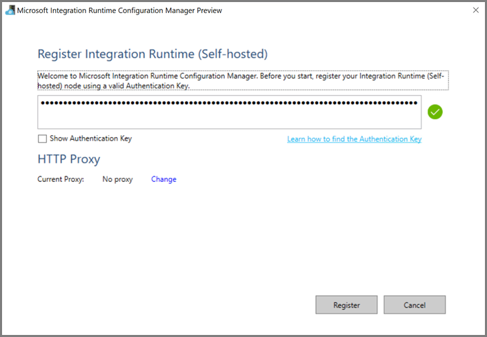

2. You see the following message when the self-hosted integration runtime is registered successfully. 
   
    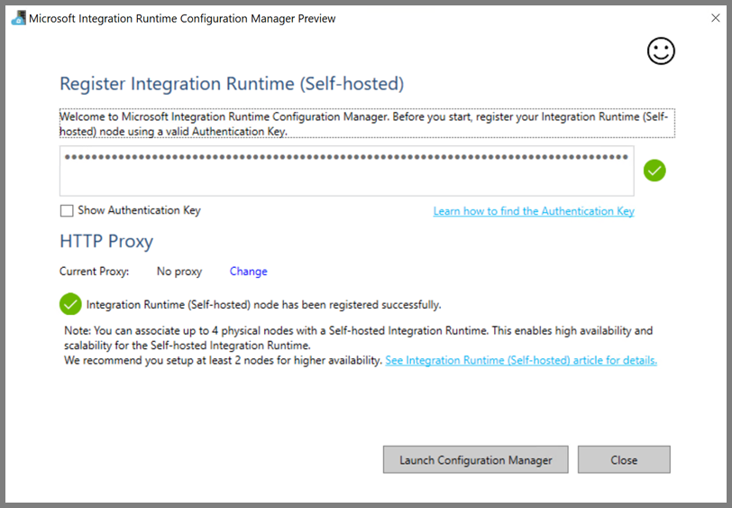
3. Click **Launch Configuration Manager**. You see the following page when the node is connected to the cloud service: 
   
    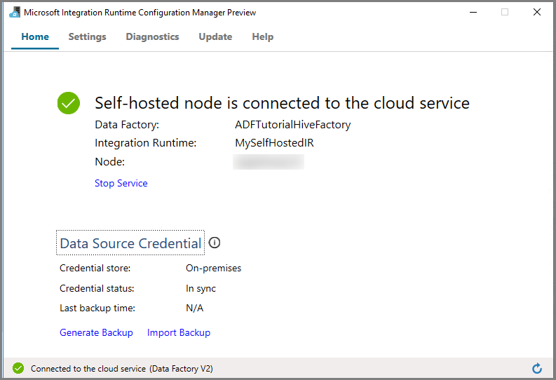

### Self-hosted IR in the Azure Data Factory UI

1. In the **Azure Data Factory UI**, you should see the name of the self-hosted VM name and its status.

   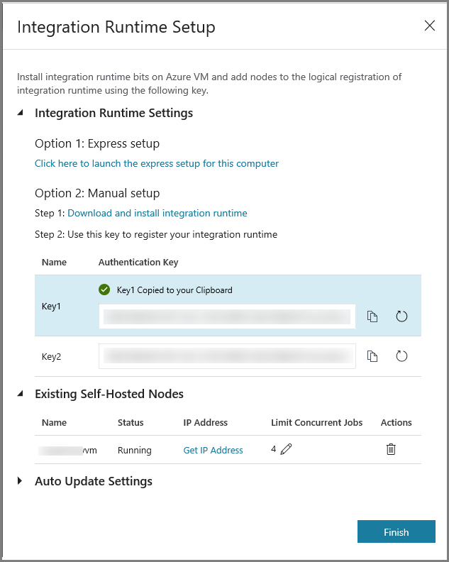
2. Click **Finish** to close the **Integration Runtime Setup** window. You see the self-hosted IR in the list of integration runtimes.

   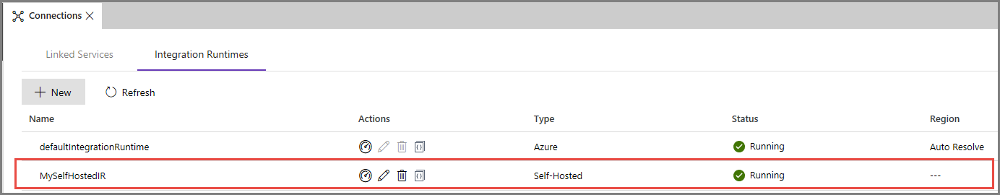


## Create linked services

You author and deploy two Linked Services in this section:
- An **Azure Storage Linked Service** that links an Azure Storage account to the data factory. This storage is the primary storage used by your HDInsight cluster. In this case, you use this Azure Storage account to store the Hive script and output of the script.
- An **HDInsight Linked Service**. Azure Data Factory submits the Hive script to this HDInsight cluster for execution.​

### Create Azure Storage linked service

1. Switch to the **Linked Services** tab, and click **New**.

   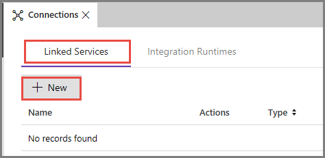    
2. In the **New Linked Service** window, select **Azure Blob Storage**, and click **Continue**. 

   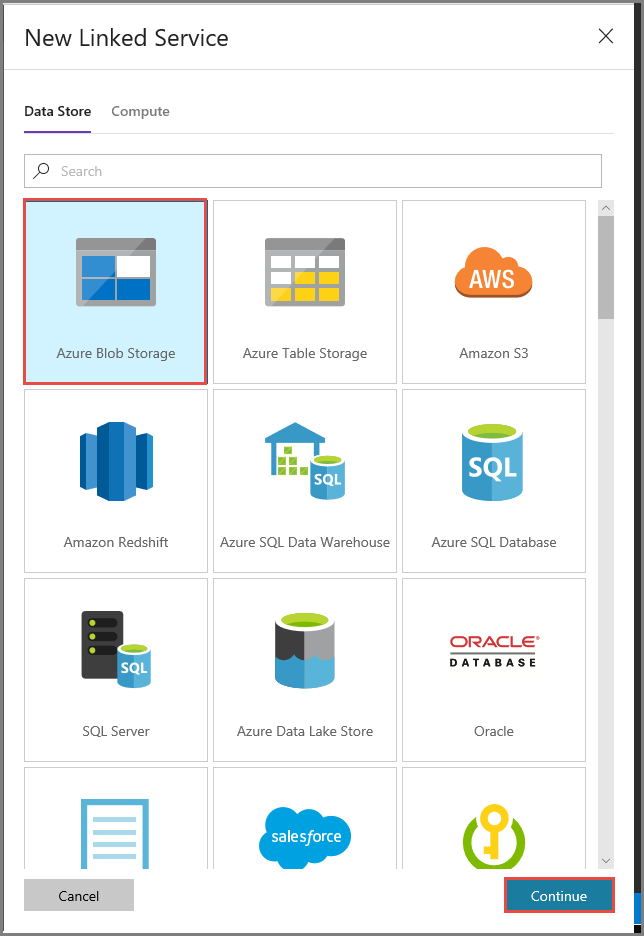
3. In the **New Linked Service** window, do the following steps:

    1. Enter **AzureStorageLinkedService** for **Name**.
    2. Select **MySelfHostedIR** for **Connect via integration runtime**.
    3. Select your Azure storage account for **Storage account name**. 
    4. To test the connection to storage account, click **Test connection**.
    5. Click **Save**.
   
        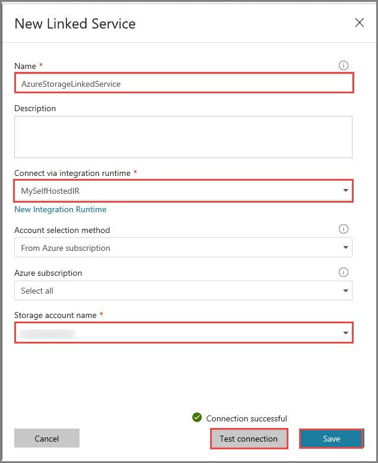

### Create HDInsight linked service

1. Click **New** again to create another linked service. 
    
       
2. Switch to the **Compute** tab, select **Azure HDInsight**, and click **Continue**.

    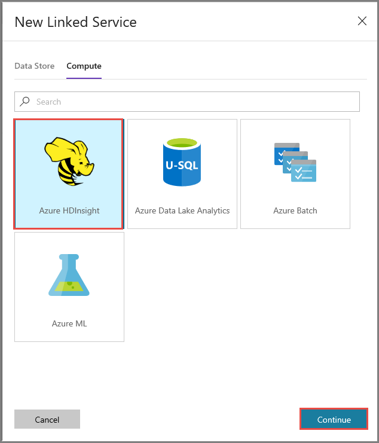
3. In the **New Linked Service** window, do the following steps:

    1. Enter **AzureHDInsightLinkedService** for **Name**.
    2. Select **Bring your own HDInsight**. 
    3. Select your HDInsight cluster for **Hdi cluster**. 
    4. Enter the **user name** for the HDInsight cluster.
    5. Enter the **password** for the user. 
    
        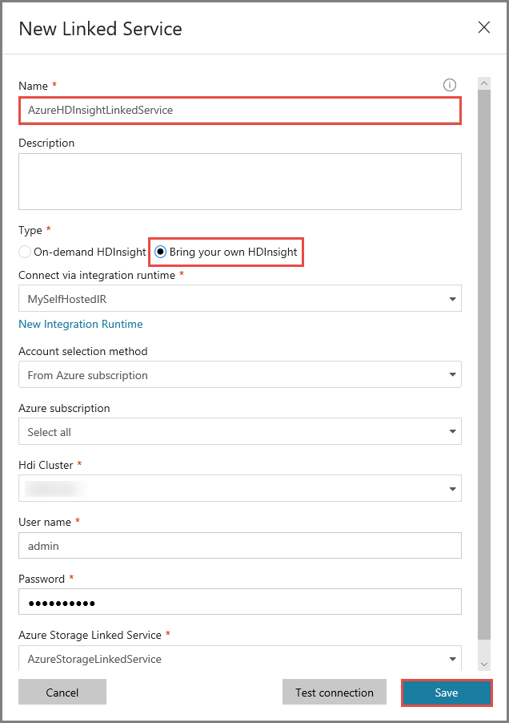

This article assumes that you have access to the cluster over the internet. For example, that you can connect to the cluster at `https://clustername.azurehdinsight.net`. This address uses the public gateway, which is not available if you have used network security groups (NSGs) or user-defined routes (UDRs) to restrict access from the internet. For Data Factory to be able to submit jobs to HDInsight cluster in Azure Virtual Network, you need to configure your Azure Virtual Network such a way that the URL can be resolved to the private IP address of gateway used by HDInsight.

1. From Azure portal, open the Virtual Network the HDInsight is in. Open the network interface with name starting with `nic-gateway-0`. Note down its private IP address. For example, 10.6.0.15. 
2. If your Azure Virtual Network has DNS server, update the DNS record so the HDInsight cluster URL `https://<clustername>.azurehdinsight.net` can be resolved to `10.6.0.15`. If you don’t have a DNS server in your Azure Virtual Network, you can temporarily work around by editing the hosts file (C:\Windows\System32\drivers\etc) of all VMs that registered as self-hosted integration runtime nodes by adding an entry similar to the following one: 

    `10.6.0.15 myHDIClusterName.azurehdinsight.net`

## Create a pipeline 
In this step, you create a new pipeline with a Hive activity. The activity executes Hive script to return data from a sample table and save it to a path you defined.

Note the following points:

- **scriptPath** points to path to Hive script on the Azure Storage Account you used for MyStorageLinkedService. The path is case-sensitive.
- **Output** is an argument used in the Hive script. Use the format of `wasbs://<Container>@<StorageAccount>.blob.core.windows.net/outputfolder/` to point it to an existing folder on your Azure Storage. The path is case-sensitive. 

1. In the Data Factory UI, click **+ (plus)** in the left pane, and click **Pipeline**. 

    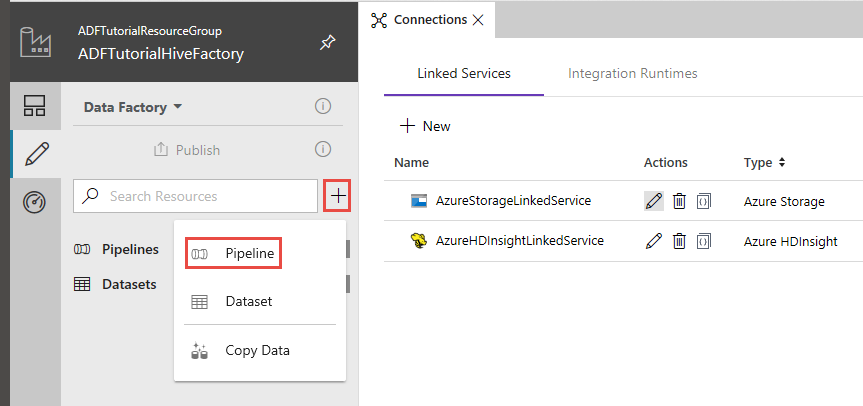
2. In the **Activities** toolbox, expand **HDInsight**, and drag-drop **Hive** activity to the pipeline designer surface. 

    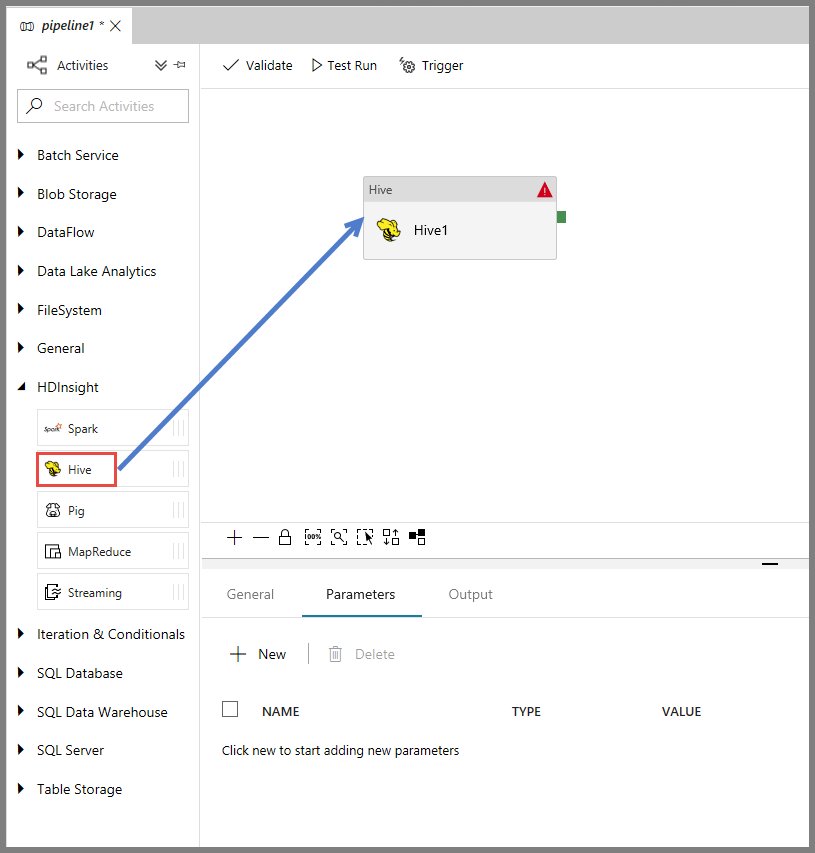
3. In the properties window, switch to the **HDI Cluster** tab, and select **AzureHDInsightLinkedService** for **HDInsight Linked Service**.

    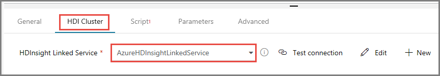
4. Switch to the **Scripts** tab, and do the following steps: 

    1. Select **AzureStorageLinkedService** for **Script Linked Service**. 
    2. For **File Path**, click **Browse Storage**. 
 
        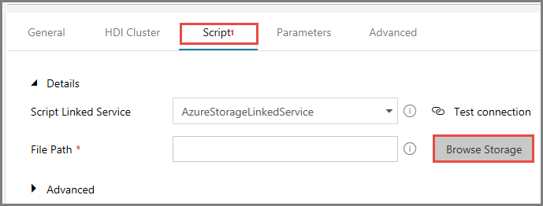
    3. In the **Choose a file or folder** window, navigate to **hivescripts** folder of the **adftutorial** container, select **hivescript.hql**, and click **Finish**.  
        
        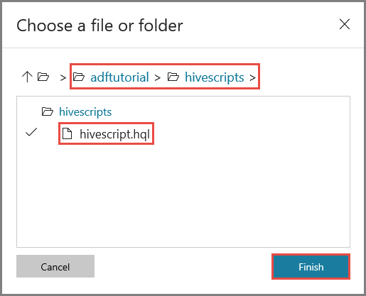 
    4. Confirm that you see **adftutorial/hivescripts/hivescript.hql** for **File Path**.

        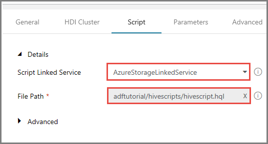
    5. In the **Script tab**, expand **Advanced** section. 
    6. Click **Auto-fill from script** for **Parameters**. 
    7. Enter the value for the **Output** parameter in the following format: `wasbs://<Blob Container>@<StorageAccount>.blob.core.windows.net/outputfolder/`. For example: `wasbs://adftutorial@mystorageaccount.blob.core.windows.net/outputfolder/`.
 
        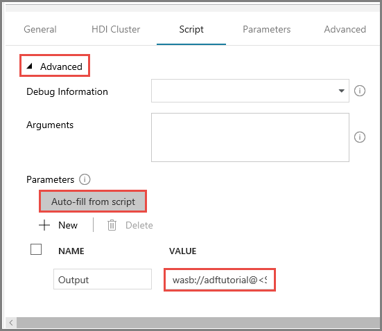
1. To publish artifacts to Data Factory, click **Publish**.

    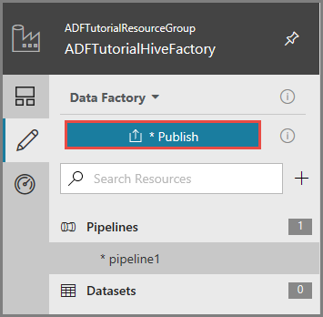

## Trigger a pipeline run

1. First, validate the pipeline by clicking the **Validate** button on the toolbar. Close the **Pipeline Validation Output** window by clicking **right-arrow (>>)**. 

    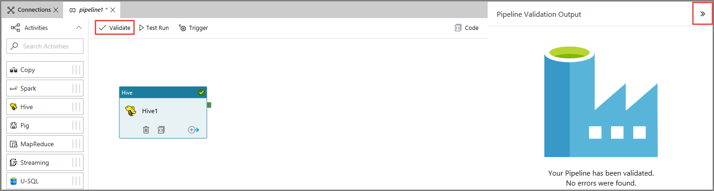 
2. To trigger a pipeline run, click Trigger on the toolbar, and click Trigger Now. 

    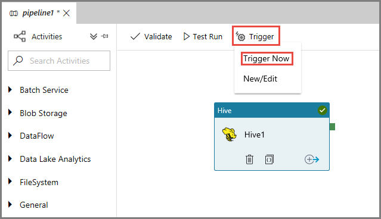

## Monitor the pipeline run

1. Switch to the **Monitor** tab on the left. You see a pipeline run in the **Pipeline Runs** list. 

    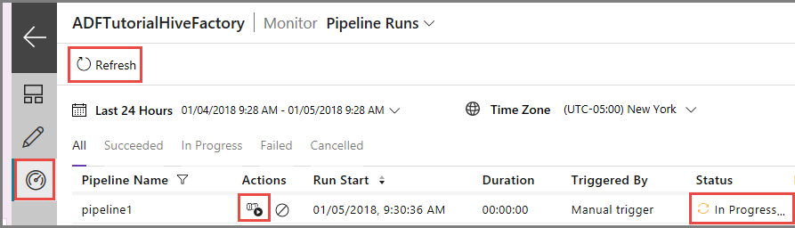
2. To refresh the list, click **Refresh**.
4. To view activity runs associated with the pipeline runs, click **View activity runs** in the **Action** column. Other action links are for stopping/rerunning the pipeline. 

    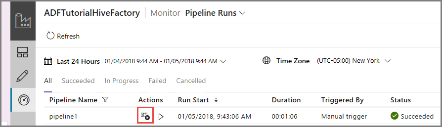
5. You see only one activity run since there is only one activity in the pipeline of type **HDInsightHive**. To switch back to the previous view, click **Pipelines** link at the top.

    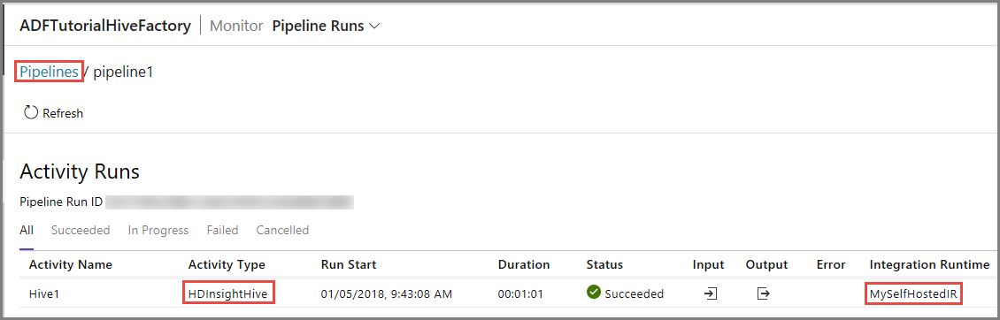
6. Confirm that you see an output file in the **outputfolder** of the **adftutorial** container. 

    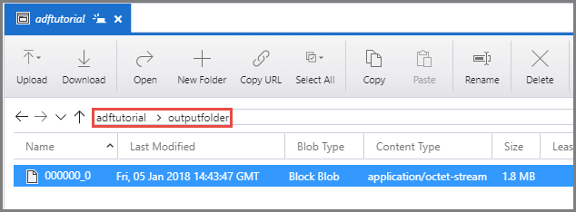

## Next steps
You performed the following steps in this tutorial: 

> [!div class="checklist"]
> * Create a data factory. 
> * Create a self-hosted integration runtime
> * Create Azure Storage and Azure HDInsight linked services
> * Create a pipeline with Hive activity.
> * Trigger a pipeline run.
> * Monitor the pipeline run 
> * Verify the output

Advance to the following tutorial to learn about transforming data by using a Spark cluster on Azure:

> [!div class="nextstepaction"]
>[Branching and chaining Data Factory control flow](tutorial-control-flow-portal.md)


