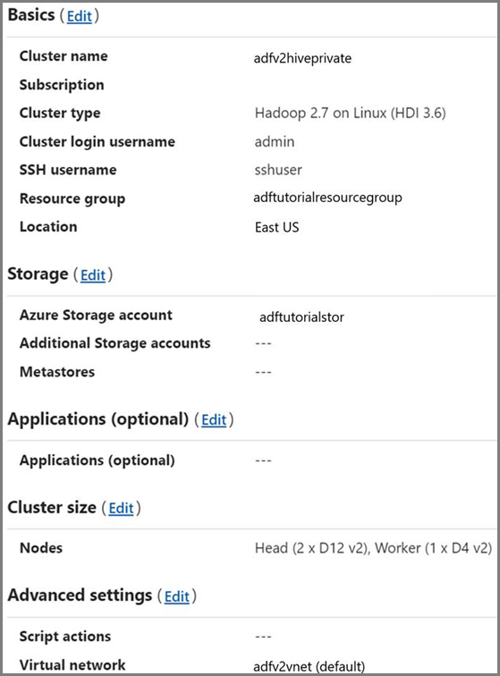

# Transform data in Azure Virtual Network using Hive activity in Azure Data Factory

[!INCLUDE [data-factory-what-is-include-md](../../includes/data-factory-what-is-include.md)]

#### This tutorial

> [!NOTE]
> This article applies to version 2 of Data Factory, which is currently in preview. If you are using version 1 of the Data Factory service, which is generally available (GA), see [documentation for Data Factory version 1](v1/data-factory-copy-data-from-azure-blob-storage-to-sql-database.md).

In this tutorial, you use Azure PowerShell to create a Data Factory pipeline that transforms data using Hive Activity on a HDInsight cluster that is in an Azure Virtual Network. You perform the following steps in this tutorial:

> [!div class="checklist"]
> * Create a data factory. 
> * Author and setup self-hosted integration runtime
> * Author and deploy linked services.
> * Author and deploy a pipeline that contains a Hive activity.
> * Start a pipeline run.
> * Monitor the pipeline run 
> * verify the output. 


If you don't have an Azure subscription, create a [free](https://azure.microsoft.com/free/) account before you begin.

## Prerequisites
- **Azure Storage account**. You create a hive script, and upload it to the Azure storage. The output from the Hive script is stored in this storage account. In this sample, HDInsight cluster uses this Azure Storage account as the primary storage. 
- **Azure Virtual Network.** If you don't have an Azure virtual network, create it by following [these instructions](../virtual-network/virtual-network-get-started-vnet-subnet.md). In this sample, the HDInsight is in an Azure Virtual Network. Here is a sample configuration of Azure Virtual Network. 

	
- **HDInsight cluster.** Create a HDInsight cluster and join it to the virtual network you created in the previous step by following this article: [Extend Azure HDInsight using an Azure Virtual Network](../hdinsight/hdinsight-extend-hadoop-virtual-network.md). Here is a sample configuration of HDInsight in a virtual network. 

	
- **Azure PowerShell**. Follow the instructions in [How to install and configure Azure PowerShell](/powershell/azure/install-azurerm-ps).

### Upload Hive script to your Blob Storage account

1. Create a Hive SQL file named **hivescript.hql** with the following content:

   ```sql
   DROP TABLE IF EXISTS HiveSampleOut; 
   CREATE EXTERNAL TABLE HiveSampleOut (clientid string, market string, devicemodel string, state string)
   ROW FORMAT DELIMITED FIELDS TERMINATED BY ' ' 
   STORED AS TEXTFILE LOCATION '${hiveconf:Output}';

   INSERT OVERWRITE TABLE HiveSampleOut
   Select 
       clientid,
       market,
       devicemodel,
       state
   FROM hivesampletable
   ```
2. In your Azure Blob Storage, create a container named **adftutorial** if it does not exist.
3. Create a folder named `hivescripts`.
4. Upload the `hivescript.hql` file to the `hivescripts` subfolder.

 ​

## Create a data factory


1. Set variables one by one.

    ```powershell
    $subscriptionID = "<subscription ID>" # Your Azure subscription ID
    $resourceGroupName = "ADFTutorialResourceGroup" # Name of the resource group
    $dataFactoryName = "MyDataFactory09142017" # Globally unique name of the data factory
    $pipelineName = "MyHivePipeline" # Name of the pipeline
    $selfHostedIntegrationRuntimeName = "MySelfHostedIR09142017" # make it a unique name. 
    ```
2. Launch **PowerShell**. Keep Azure PowerShell open until the end of this quickstart. If you close and reopen, you need to run the commands again. Currently, Data Factory V2 allows you to create data factories only in the East US, East US2, and West Europe regions. The data stores (Azure Storage, Azure SQL Database, etc.) and computes (HDInsight, etc.) used by data factory can be in other regions.

    Run the following command, and enter the user name and password that you use to sign in to the Azure portal:
        
    ```powershell
    Login-AzureRmAccount
    ```        
    Run the following command to view all the subscriptions for this account:

    ```powershell
    Get-AzureRmSubscription
    ```
    Run the following command to select the subscription that you want to work with. Replace **SubscriptionId** with the ID of your Azure subscription:

    ```powershell
    Select-AzureRmSubscription -SubscriptionId "<SubscriptionId>"    
    ```  
3. Create the resource group: ADFTutorialResourceGroup if it does not exist already in your subscription. 

    ```powershell
    New-AzureRmResourceGroup -Name $resourceGroupName -Location "East Us" 
    ```
4. Create the data factory. 

    ```powershell
     $df = Set-AzureRmDataFactoryV2 -Location EastUS -Name $dataFactoryName -ResourceGroupName $resourceGroupName
    ```

    Execute the following command to see the output: 

    ```powershell
    $df
    ```

## Create self-hosted IR
In this section, you create a self-hosted integration runtime and associate it with an Azure VM in the same Azure Virtual Network where your HDInsight cluster is in.

1. Create Self-hosted integration runtime. Use a unique name in case if another integration runtime with the same name exists.

   ```powershell
   Set-AzureRmDataFactoryV2IntegrationRuntime -ResourceGroupName $resourceGroupName -DataFactoryName $dataFactoryName -Name $selfHostedIntegrationRuntimeName -Type SelfHosted
   ```
    This command creates a logical registration of the self-hosted integration runtime. 
2. Use PowerShell to retrieve authentication keys to register the self-hosted integration runtime. Copy one of the keys for registering the self-hosted integration runtime.

   ```powershell
   Get-AzureRmDataFactoryV2IntegrationRuntimeKey -ResourceGroupName $resourceGroupName -DataFactoryName $dataFactoryName -Name $selfHostedIntegrationRuntimeName | ConvertTo-Json
   ```

   Here is the sample output: 

   ```powershell
   {
       "AuthKey1":  "IR@0000000000000000000000000000000000000=",
       "AuthKey2":  "IR@0000000000000000000000000000000000000="
   }
   ```
    Note down the value of **AuthKey1** without quotation mark. 
3. Create an Azure VM and join it into the same virtual network that contains your HDInsight cluster. For details, see [How to create virtual machines](../virtual-network/virtual-network-get-started-vnet-subnet.md#create-vms). Join them into an Azure Virtual Network. 
4. On the Azure VM, download [self-hosted integration runtime](https://www.microsoft.com/download/details.aspx?id=39717). Use the Authentication Key obtained in the previous step to manually register the self-hosted integration runtime. 

   

   You see the following message when the self-hosted integration runtime is registered successfully: 
   

   You see the following page when the node is connected to the cloud service: 
   

## Author linked services

You author and deploy two Linked Services in this section:
- An Azure Storage Linked Service that links an Azure Storage account to the data factory. This storage is the primary storage used by your HDInsight cluster. In this case, we also use this Azure Storage account to keep the Hive script and output of the script.
- An HDInsight Linked Service. Azure Data Factory submits the Hive script to this HDInsight cluster for execution.​

### Azure Storage linked service

Create a JSON file using your preferred editor, copy the following JSON definition of an Azure Storage linked service, and then save the file as **MyStorageLinkedService.json**.

```json
{
    "name": "MyStorageLinkedService",
    "properties": {
      "type": "AzureStorage",
      "typeProperties": {
        "connectionString": {
          "value": "DefaultEndpointsProtocol=https;AccountName=<storageAccountName>;AccountKey=<storageAccountKey>",
          "type": "SecureString"
        }
      },
      "connectVia": {
        "referenceName": "MySelfhostedIR",
        "type": "IntegrationRuntimeReference"
      }  
    }
}
```

Replace **&lt;accountname&gt; and &lt;accountkey&gt;** with the name and key of your Azure Storage account.

### HDInsight linked service

Create a JSON file using your preferred editor, copy the following JSON definition of an Azure HDInsight linked service, and save the file as **MyHDInsightLinkedService.json**.

```
{
  "name": "MyHDInsightLinkedService",
  "properties": {     
      "type": "HDInsight",
      "typeProperties": {
          "clusterUri": "https://<clustername>.azurehdinsight.net",
          "userName": "<username>",
          "password": {
            "value": "<password>",
            "type": "SecureString"
          },
          "linkedServiceName": {
            "referenceName": "MyStorageLinkedService",
            "type": "LinkedServiceReference"
          }
      },
      "connectVia": {
        "referenceName": "MySelfhostedIR",
        "type": "IntegrationRuntimeReference"
      }
  }
}
```

Update values for the following properties in the linked service definition:

- **userName**. Name of the cluster login user that you specified when creating the cluster. 
- **password**. The password for the user.
- **clusterUri**. Specify the URL of your HDInsight cluster in format of  https://<clustername>.azurehdinsight.net.  This article assumes that you have access to the cluster over the internet. For example, that you can connect to the cluster at `https://clustername.azurehdinsight.net`. This address uses the public gateway, which is not available if you have used network security groups (NSGs) or user-defined routes (UDRs) to restrict access from the internet. For Data Factory to be able to submit jobs to HDInsight cluster in Azure Virtual Network, you need to configure your Azure Virtual Network such a way that the URL can be resolved to the private IP address of gateway used by HDInsight.

  1. From Azure portal, open the Virtual Network the HDInsight is in. Open the network interface with name starting with `nic-gateway-0`. Note down its private IP address. For example, 10.6.0.15. 
  2. If your Azure Virtual Network has DNS server, update the DNS record so the HDInsight cluster URL `https://<clustername>.azurehdinsight.net` can be resolved to `10.6.0.15`. This is the recommended approach. If you don’t have a DNS server in your Azure Virtual Network, you can temporarily workaround this by editing the hosts file (C:\Windows\System32\drivers\etc) of all VMs that registered as self-hosted integration runtime nodes by adding an entry like this: 
  
		`10.6.0.15 myHDIClusterName.azurehdinsight.net`

Switch to the folder where you created JSON files, and run the following command to deploy the linked services: 


```powershell
Set-AzureRmDataFactoryV2LinkedService -DataFactoryName $dataFactoryName -ResourceGroupName $resourceGroupName -Name "MyStorageLinkedService" -File "MyStorageLinkedService.json"

Set-AzureRmDataFactoryV2LinkedService -DataFactoryName $dataFactoryName -ResourceGroupName $resourceGroupName -Name "MyHDILinkedService" -File "MyHDILinkedService.json"
```

## Author a pipeline
In this step, you create a new pipeline with a Hive activity. The activity executes Hive script to return data from a sample table and save it to a path you defined. Create a JSON file in your preferred editor, copy the following JSON definition of a pipeline definition, and save it as **MyHiveOnDemandPipeline.json**.


```json
{
  "name": "MyHivePipeline",
  "properties": {
    "activities": [
      {
        "name": "MyHiveActivity",
        "type": "HDInsightHive",
        "linkedServiceName": {
            "referenceName": "MyHDILinkedService",
            "type": "LinkedServiceReference"
        },
        "typeProperties": {
          "scriptPath": "adftutorial\\hivescripts\\hivescript.hql",
          "getDebugInfo": "Failure",
          "defines": {           
            "Output": "wasb://<Container>@<StorageAccount>.blob.core.windows.net/outputfolder/"
          },
          "scriptLinkedService": {
            "referenceName": "MyStorageLinkedService",
            "type": "LinkedServiceReference"
          }
        }
      }
    ]
  }
}

```

Note the following points:

- **scriptPath** points to path to Hive script on the Azure Storage Account you used for MyStorageLinkedService. The path is case-sensitive.
- **Output** is an argument used in the Hive script. Use the format of `wasb://<Container>@<StorageAccount>.blob.core.windows.net/outputfolder/` to point it to an existing folder on your Azure Storage. The path is case sensitive. 

Switch to the folder where you created JSON files, and run the following command to deploy the pipeline: 


```powershell
Set-AzureRmDataFactoryV2Pipeline -DataFactoryName $dataFactoryName -ResourceGroupName $resourceGroupName -Name $pipelineName -File "MyHivePipeline.json"
```

## Start the pipeline 

1. Start a pipeline run. It also captures the pipeline run ID for future monitoring.

    ```powershell
    $runId = Invoke-AzureRmDataFactoryV2Pipeline -DataFactoryName $dataFactoryName -ResourceGroupName $resourceGroupName -PipelineName $pipelineName
   ```
2. Run the following script to continuously check the pipeline run status until it finishes.

    ```powershell
    while ($True) {
        $result = Get-AzureRmDataFactoryV2ActivityRun -DataFactoryName $dataFactoryName -ResourceGroupName $resourceGroupName -PipelineRunId $runId -RunStartedAfter (Get-Date).AddMinutes(-30) -RunStartedBefore (Get-Date).AddMinutes(30)

        if(!$result) {
            Write-Host "Waiting for pipeline to start..." -foregroundcolor "Yellow"
        }
        elseif (($result | Where-Object { $_.Status -eq "InProgress" } | Measure-Object).count -ne 0) {
            Write-Host "Pipeline run status: In Progress" -foregroundcolor "Yellow"
        }
        else {
            Write-Host "Pipeline '"$pipelineName"' run finished. Result:" -foregroundcolor "Yellow"
            $result
            break
        }
        ($result | Format-List | Out-String)
        Start-Sleep -Seconds 15
    }
    
    Write-Host "Activity `Output` section:" -foregroundcolor "Yellow"
    $result.Output -join "`r`n"

    Write-Host "Activity `Error` section:" -foregroundcolor "Yellow"
    $result.Error -join "`r`n"
    ```

   Here is the output of the sample run:

    ```json
    Pipeline run status: In Progress
    
    ResourceGroupName : ADFV2SampleRG2
    DataFactoryName   : SampleV2DataFactory2
    ActivityName      : MyHiveActivity
    PipelineRunId     : 000000000-0000-0000-000000000000000000
    PipelineName      : MyHivePipeline
    Input             : {getDebugInfo, scriptPath, scriptLinkedService, defines}
    Output            :
    LinkedServiceName :
    ActivityRunStart  : 9/18/2017 6:58:13 AM
    ActivityRunEnd    :
    DurationInMs      :
    Status            : InProgress
    Error             :
    
    Pipeline ' MyHivePipeline' run finished. Result:
    
    ResourceGroupName : ADFV2SampleRG2
    DataFactoryName   : SampleV2DataFactory2
    ActivityName      : MyHiveActivity
    PipelineRunId     : 0000000-0000-0000-0000-000000000000
    PipelineName      : MyHivePipeline
    Input             : {getDebugInfo, scriptPath, scriptLinkedService, defines}
    Output            : {logLocation, clusterInUse, jobId, ExecutionProgress...}
    LinkedServiceName :
    ActivityRunStart  : 9/18/2017 6:58:13 AM
    ActivityRunEnd    : 9/18/2017 6:59:16 AM
    DurationInMs      : 63636
    Status            : Succeeded
    Error             : {errorCode, message, failureType, target}
    
    Activity Output section:
    "logLocation": "wasbs://adfjobs@adfv2samplestor.blob.core.windows.net/HiveQueryJobs/000000000-0000-47c3-9b28-1cdc7f3f2ba2/18_09_2017_06_58_18_023/Status"
    "clusterInUse": "https://adfv2HivePrivate.azurehdinsight.net"
    "jobId": "job_1505387997356_0024"
    "ExecutionProgress": "Succeeded"
    "effectiveIntegrationRuntime": "MySelfhostedIR"
    Activity Error section:
    "errorCode": ""
    "message": ""
    "failureType": ""
    "target": "MyHiveActivity"
    ```
4. Check the `outputfolder` folder for new file created as the Hive query result, it should look like the following sample output: 

   ```
   8 en-US SCH-i500 California
   23 en-US Incredible Pennsylvania
   212 en-US SCH-i500 New York
   212 en-US SCH-i500 New York
   212 en-US SCH-i500 New York
   212 en-US SCH-i500 New York
   212 en-US SCH-i500 New York
   212 en-US SCH-i500 New York
   212 en-US SCH-i500 New York
   212 en-US SCH-i500 New York
   212 en-US SCH-i500 New York
   212 en-US SCH-i500 New York
   212 en-US SCH-i500 New York
   212 en-US SCH-i500 New York
   246 en-US SCH-i500 District Of Columbia
   246 en-US SCH-i500 District Of Columbia
   ```

## Next steps
You performed the following steps in this tutorial: 

> [!div class="checklist"]
> * Create a data factory. 
> * Author and setup self-hosted integration runtime
> * Author and deploy linked services.
> * Author and deploy a pipeline that contains a Hive activity.
> * Start a pipeline run.
> * Monitor the pipeline run 
> * verify the output. 

Advance to the following tutorial to learn about transforming data by using a Spark cluster on Azure:

> [!div class="nextstepaction"]
>[Branching and chaining Data Factory control flow](tutorial-control-flow.md)


