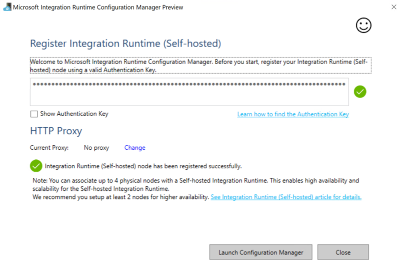
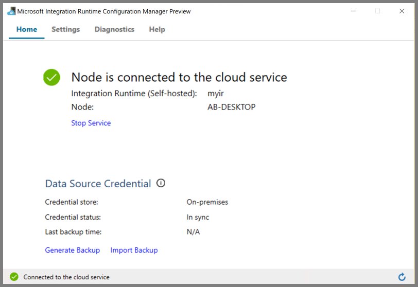

# Transform data in Azure Virtual Network using Hive activity in Azure Data Factory
Using Azure Data Factory, you can create and schedule pipelines that transform data on your own or an on-demand HDInsight cluster. The self-hosted integration runtime in version 2 of Data Factory allows you to run tasks on your HDInsight cluster in an Azure Virtual Network. 

In this tutorial, you use Azure PowerShell to create a Data Factory pipeline that transforms data using Hive Activity on a HDInsight cluster that is in an Azure Virtual Network. You perform the following steps in this tutorial:

> [!div class="checklist"]
> * Create a data factory. 
> * Author and setup self-hosted integration runtime
> * Author and deploy linked services.
> * Author and deploy a pipeline that contains a Hive activity.
> * Start a pipeline run.
> * Monitor the pipeline run 
> * verify the output. 

## Prerequisites
- **Azure subscription**. If you don't have a subscription, you can create a [free trial](http://azure.microsoft.com/pricing/free-trial/) account.
- **Azure Storage account**. You create a hive script, and upload it to the Azure storage. The output from the Hive script is stored in this storage account.
- **Azure Virtual Network.** In this sample, the HDInsight is in an Azure Virtual Network. Follow instructions on [Create your first virtual network](../virtual-network/virtual-network-get-started-vnet-subnet.md) for details.
- **HDInsight cluster.** You need to have an existing HDInsight cluster created in Azure Virtual Network, follow instructions on [Extend Azure HDInsight using an Azure Virtual Network](../hdinsight/hdinsight-extend-hadoop-virtual-network.md) for details.
- **Azure PowerShell**. Follow the instructions in [How to install and configure Azure PowerShell](/powershell/azure/install-azurerm-ps).

### Upload python script to your Blob Storage account

1. Create a Hive SQL file named **hivescript.hsql** with the following content:

   ```sql
   DROP TABLE IF EXISTS HiveSampleOut; 
   CREATE EXTERNAL TABLE HiveSampleOut (clientid string, market string, devicemodel string, state string)
   ROW FORMAT DELIMITED FIELDS TERMINATED BY ' ' 
   STORED AS TEXTFILE LOCATION '${hiveconf:Output}';

   INSERT OVERWRITE TABLE HiveSampleOut
   Select 
       clientid,
       market,
       devicemodel,
       state
   FROM hivesampletable
   ```
2. In your Azure Blob Storage, create a container named **adftutorial** if it does not exist.
3. Create a folder named `hivescripts`.
4. Upload the `hivescript.hsql` file to the `hivescripts` subfolder.

 ​

## Create a data factory


1. Set variables one by one.

    ```powershell
    $subscriptionID = "<subscription ID>" # Your Azure subscription ID
    $resourceGroupName = "ADFTutorialResourceGroup" # Name of the resource group
    $dataFactoryName = "MyDataFactory09142017" # Globally unique name of the data factory
    $pipelineName = "MyHivePipeline" # Name of the pipeline
    $selfHostedIntegrationRuntimeName = "MySelfHostedIR09142017" # make it a unique name. 
    ```
2. Launch **PowerShell**. Keep Azure PowerShell open until the end of this quickstart. If you close and reopen, you need to run the commands again.

    Run the following command, and enter the user name and password that you use to sign in to the Azure portal:
        
    ```powershell
    Login-AzureRmAccount
    ```        
    Run the following command to view all the subscriptions for this account:

    ```powershell
    Get-AzureRmSubscription
    ```
    Run the following command to select the subscription that you want to work with. Replace **SubscriptionId** with the ID of your Azure subscription:

    ```powershell
    Select-AzureRmSubscription -SubscriptionId "<SubscriptionId>"    
    ```  
3. Create the resource group: ADFTutorialResourceGroup if it does not exist already in your subscription. 

    ```powershell
    New-AzureRmResourceGroup -Name $resourceGroupName -Location "East Us" 
    ```
4. Create the data factory. 

    ```powershell
     $df = Set-AzureRmDataFactoryV2 -Location EastUS -Name $dataFactoryName -ResourceGroupName $resourceGroupName
    ```

    Execute the following command to see the output: 

    ```powershell
    $df
    ```

## Create self-hosted IR
In this section, you create a self-hosted integration runtime and associate it with an Azure VM in the same Azure Virtual Network where your HDInsight cluster is in.

1. Create Self-hosted integration runtime. Use a unique name in case if another integration runtime with the same name exists.

   ```powershell
   Set-AzureRmDataFactoryV2IntegrationRuntime -ResourceGroupName $resourceGroupName -DataFactoryName $dataFactoryName -Name $selfHostedIntegrationRuntimeName -Type SelfHosted
   ```

   2. We would use PowerShell to retrieve Authentication Keys to register the self-hosted integration runtime. Copy one of the keys for registering the self-hosted integration runtime.

   ```powershell
   Get-AzureRmDataFactoryV2IntegrationRuntimeKey -ResourceGroupName $resourceGroupName -DataFactoryName $dataFactoryName -Name $selfHostedIntegrationRuntimeName | ConvertTo-Json
   ```

   Here is the sample output: 

   ```powershell
   {
       "AuthKey1":  "IR@8437c862-d6a9-4fb3-87dd-7d4865a9e845@ab1@eu@VDnzgySwUfaj3pfSUxpvfskt6kwRx4GHiyF4wboad0Y=",
       "AuthKey2":  "IR@8437c862-d6a9-4fb3-85dd-7d4865a9e845@ab1@eu@sh+k/QNJGBltXL46vcRDJEp/eOf/M1Gne5aVqPtbweI="
   }
   ```

   3. Create an Azure VM and join it into the same virtual network that contains your HDInsight cluster. For details, see [How to create virtual machines](../virtual-network/virtual-network-get-started-vnet-subnet.md#create-vms). Join them into an Azure Virtual Network. 
   4. On the Azure VM, download [self-hosted integration runtime](https://www.microsoft.com/download/details.aspx?id=39717) (previously called Data Management Gateway). Use the Authentication Key obtained in the previous step to manually register the self-hosted integration runtime. 

   

   You see the following message when the self-hosted integration runtime is registered successfully: 
   

   You see the following page when the node is connected to the cloud service: 
   

## Author linked services

You author and deploy two Linked Services in this section:
- An Azure Storage Linked Service that links an Azure Storage account to the data factory. This storage is the primary storage used by your HDInsight cluster. In this case, we also use this Azure Storage account to keep the Hive script and output of the script.
- An HDInsight Linked Service. Azure Data Factory submits the Hive script to this HDInsight cluster for execution.​

### Azure Storage linked service

Create a JSON file using your preferred editor, copy the following JSON definition of an Azure Storage linked service, and then save the file as **MyStorageLinkedService.json**.

```json
{
    "name": "MyStorageLinkedService",
    "properties": {
      "type": "AzureStorage",
      "typeProperties": {
        "connectionString": {
          "value": "DefaultEndpointsProtocol=https;AccountName=<storageAccountName>;AccountKey=<storageAccountKey>",
          "type": "SecureString"
        }
      }
    }
}
```

> [!IMPORTANT]
> Replace &lt;accountname&gt; and &lt;accountkey&gt; with the name and key of your Azure Storage account.

### HDInsight linked service

Create a JSON file using your preferred editor, copy the following JSON definition of an Azure HDInsight linked service, and save the file as **MyHDInsightLinkedService.json**.

```
{
  "name": "MyHDInsightLinkedService",
  "properties": {     
      "type": "HDInsight",
      "typeProperties": {
          "clusterUri": "https://<clustername>.azurehdinsight.net",
          "userName": "<username>",
          "password": {
            "value": "<password>",
            "type": "SecureString"
          },
          "linkedServiceName": {
            "referenceName": "MyStorageLinkedService",
            "type": "LinkedServiceReference"
          }
      }
  }
}
```

Update values for the following properties in the linked service definition:

- **clusterUri**. Specify the URL of your HDInsight cluster in format of  https://<clustername>.azurehdinsight.net. The URL might not be public accessible for HDInsight in Azure Virtual Network, 

  1. From Azure portal, open the Virtual Network the HDInsight is in. Open the network interface with name starting with `nic-gateway-0`. Note down its private IP address. For example, 10.6.0.15. 

  2. Log on to the Azure VM that has self-hosted integration runtime installed. Open the **hosts** file with Notepad using administrative privileges from the following path: 

        ```
        C:\Windows\System32\drivers\etc 
        ```
  3. Update the **hosts** file by adding the following entry, save, and close the file. 
        ```
        10.6.0.15	myHDIClusterName.azurehdinsight.net
        ```    
- **userName**. Name of the cluster login user that you specified when creating the cluster. 

- **password**. The password for the user.

Switch to the folder where you created JSON files, and run the following command to deploy the linked services: 


```powershell
Set-AzureRmDataFactoryV2LinkedService -DataFactoryName $dataFactoryName -ResourceGroupName $resourceGroupName -Name "MyStorageLinkedService" -File "MyStorageLinkedService.json"

Set-AzureRmDataFactoryV2LinkedService -DataFactoryName $dataFactoryName -ResourceGroupName $resourceGroupName -Name "MyHDILinkedService" -File "MyHDILinkedService.json"
```

## Author a pipeline
In this step, you create a new pipeline with a Hive activity. The activity executes Hive script to return data from a sample table and save it to a path you defined. Create a JSON file in your preferred editor, copy the following JSON definition of a pipeline definition, and save it as **MySparkOnDemandPipeline.json**.


```json
{
  "name": "MyHivePipeline",
  "properties": {
    "activities": [
      {
        "name": "MyHiveActivity",
        "type": "HDInsightHive",
        "linkedServiceName": {
            "referenceName": "MyHDILinkedService",
            "type": "LinkedServiceReference"
        },
        "typeProperties": {
          "scriptPath": "adftutorial\\hivescripts\\hivescript.hql",
          "getDebugInfo": "Failure",
          "defines": {           
            "Output": "wasb://<Container>@<StorageAccount>.blob.core.windows.net/outputfolder/"
          },
          "scriptLinkedService": {
            "referenceName": "MyStorageLinkedService",
            "type": "LinkedServiceReference"
          }
        }
      }
    ]
  }
}

```

Note the following points:

- **scriptPath** points to path to Hive script on the Azure Storage Account you used for MyStorageLinkedService.
- **Output** is an argument used in the Hive script. Use the format of `wasb://<Container>@<StorageAccount>.blob.core.windows.net/outputfolder/` to point it to an existing folder on your Azure Storage. 

Switch to the folder where you created JSON files, and run the following command to deploy the pipeline: 


```powershell
Set-AzureRmDataFactoryV2Pipeline -DataFactoryName $dataFactoryName -ResourceGroupName $resourceGroupName -Name $pipelineName -File "MyHivePipeline.json"
```

## Start the pipeline 

1. Start a pipeline run. It also captures the pipeline run ID for future monitoring.

    ```powershell
    $runId = Invoke-AzureRmDataFactoryV2PipelineRun -DataFactoryName $dataFactoryName -ResourceGroupName $resourceGroupName -PipelineName $pipelineName
   ```
2. Run the following script to continuously check the pipeline run status until it finishes copying the data.

    ```powershell
    while ($True) {
        $result = Get-AzureRmDataFactoryV2ActivityRun -DataFactoryName $dataFactoryName -ResourceGroupName $resourceGroupName -PipelineRunId $runId -PipelineName $pipelineName -RunStartedAfter (Get-Date).AddMinutes(-30) -RunStartedBefore (Get-Date).AddMinutes(30)
    
        if (($result | Where-Object { $_.Status -eq "InProgress" } | Measure-Object).count -ne 0) {
            Write-Host "Pipeline run status: In Progress" -foregroundcolor "Yellow"
            Start-Sleep -Seconds 30
        }
        else {
            Write-Host "Pipeline run finished. Result:" -foregroundcolor "Yellow"
            $result
            break
        }
    }
    ```

   Here is the output of the sample run:

    ```json
    Pipeline run status:  InProgress
    Pipeline run status:  InProgress
    Pipeline run status:  Succeeded
    
    ResourceGroupName : ADFV2SampleRG2
    DataFactoryName   : SampleV2DataFactory2
    ActivityName      : MyHiveActivity
    PipelineRunId     : 3f832bc4-478d-4ba5-a6a2-afb39c074536
    PipelineName      : MyHivePipeline
    Input             : {getDebugInfo, scriptPath, scriptLinkedService, defines}
    Output            : {logLocation, clusterInUse, jobId, ExecutionProgress}
    LinkedServiceName :
    ActivityRunStart  : 9/14/2017 12:49:35 PM
    ActivityRunEnd    : 9/14/2017 12:50:52 PM
    DurationInMs      : 76848
    Status            : Succeeded
    Error             : {errorCode, message, failureType, target}
    ```
3. Run the following command:

   ```powershell
   Get-AzureRmDataFactoryV2ActivityRun -dataFactory $df -PipelineName $pipelineName -PipelineRunId $runId -RunStartedAfter (Get-Date).AddMinutes(-30) -RunStartedBefore (Get-Date).AddMinutes(10)
   ```

   Here is the sample output:

   ```json
   ResourceGroupName : ADFV2SampleRG2
   DataFactoryName   : SampleV2DataFactory2
   ActivityName      : MyHiveActivity
   PipelineRunId     : 3f832bc4-478d-4ba5-a6a2-afb39c074536
   PipelineName      : MyHivePipeline
   Input             : {getDebugInfo, scriptPath, scriptLinkedService, defines}
   Output            : {logLocation, clusterInUse, jobId, ExecutionProgress}
   LinkedServiceName :
   ActivityRunStart  : 9/14/2017 12:49:35 PM
   ActivityRunEnd    : 9/14/2017 12:50:52 PM
   DurationInMs      : 76848
   Status            : Succeeded
   Error             : {errorCode, message, failureType, target}
   ```

4. Check the `outputfolder` folder for new file created as the Hive query result, it should look like the following sample output: 

   ```
   8 en-US SCH-i500 California
   23 en-US Incredible Pennsylvania
   212 en-US SCH-i500 New York
   212 en-US SCH-i500 New York
   212 en-US SCH-i500 New York
   212 en-US SCH-i500 New York
   212 en-US SCH-i500 New York
   212 en-US SCH-i500 New York
   212 en-US SCH-i500 New York
   212 en-US SCH-i500 New York
   212 en-US SCH-i500 New York
   212 en-US SCH-i500 New York
   212 en-US SCH-i500 New York
   212 en-US SCH-i500 New York
   246 en-US SCH-i500 District Of Columbia
   246 en-US SCH-i500 District Of Columbia
   ```

## Next steps
In this tutorial, you learned how to: 

> [!div class="checklist"]
> * Author linked services.
> * Author a pipeline that contains a Hive activity.
> * Create a data factory. 
> * Deploy linked services.
> * Deploy the pipeline. 
> * Start a pipeline run.
> * Monitor the pipeline run.

Go through the following tutorials to learn about using Data Factory in more scenarios: 

Tutorial | Description
-------- | -----------
[Tutorial: copy data from Azure Blob Storage to Azure SQL Database](tutorial-copy-data-dot-net.md) | Shows you how to copy data from a blob storage to a SQL database. For a list of data stores supported as sources and sinks in a copy operation by data factory, see [supported data stores](copy-activity-overview.md#supported-data-stores-and-formats). 
[Tutorial: transform data using Spark](tutorial-transform-data-spark-powershell.md) | Shows you how to transform data in the cloud by using a Spark cluster on Azure
