# Transform data in the cloud by using a Spark activity in Azure Data Factory
In this tutorial, you use the Azure portal to create an Azure Data Factory pipeline. This pipeline transforms data by using a Spark activity and an on-demand Azure HDInsight linked service. 

You perform the following steps in this tutorial:

> [!div class="checklist"]
> * Create a data factory. 
> * Create a pipeline that uses a Spark activity.
> * Trigger a pipeline run.
> * Monitor the pipeline run.

If you don't have an Azure subscription, create a [free account](https://azure.microsoft.com/free/) before you begin.

## Prerequisites
* **Azure storage account**. You create a Python script and an input file, and you upload them to Azure Storage. The output from the Spark program is stored in this storage account. The on-demand Spark cluster uses the same storage account as its primary storage.  

> [!NOTE]
> HdInsight supports only general-purpose storage accounts with standard tier. Make sure that the account is not a premium or blob only storage account.

* **Azure PowerShell**. Follow the instructions in [How to install and configure Azure PowerShell](/powershell/azure/install-azurerm-ps).


### Upload the Python script to your Blob storage account
1. Create a Python file named **WordCount_Spark.py** with the following content: 

    ```python
    import sys
    from operator import add
    
    from pyspark.sql import SparkSession
    
    def main():
        spark = SparkSession\
            .builder\
            .appName("PythonWordCount")\
            .getOrCreate()
    		
        lines = spark.read.text("wasbs://adftutorial@<storageaccountname>.blob.core.windows.net/spark/inputfiles/minecraftstory.txt").rdd.map(lambda r: r[0])
        counts = lines.flatMap(lambda x: x.split(' ')) \
            .map(lambda x: (x, 1)) \
            .reduceByKey(add)
        counts.saveAsTextFile("wasbs://adftutorial@<storageaccountname>.blob.core.windows.net/spark/outputfiles/wordcount")
        
        spark.stop()
    
    if __name__ == "__main__":
    	main()
    ```
1. Replace *&lt;storageAccountName&gt;* with the name of your Azure storage account. Then, save the file. 
1. In Azure Blob storage, create a container named **adftutorial** if it does not exist. 
1. Create a folder named **spark**.
1. Create a subfolder named **script** under the **spark** folder. 
1. Upload the **WordCount_Spark.py** file to the **script** subfolder. 


### Upload the input file
1. Create a file named **minecraftstory.txt** with some text. The Spark program counts the number of words in this text. 
1. Create a subfolder named **inputfiles** in the **spark** folder. 
1. Upload the **minecraftstory.txt** file to the **inputfiles** subfolder. 

## Create a data factory

1. Launch **Microsoft Edge** or **Google Chrome** web browser. Currently, Data Factory UI is supported only in Microsoft Edge and Google Chrome web browsers.
1. Select **New** on the left menu, select **Data + Analytics**, and then select **Data Factory**. 
   
   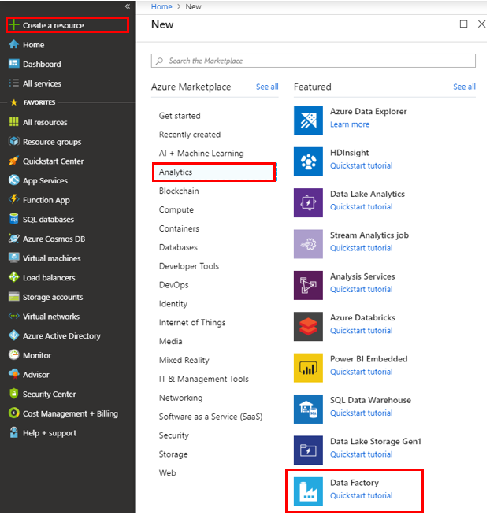
1. In the **New data factory** pane, enter **ADFTutorialDataFactory** under **Name**. 
      
   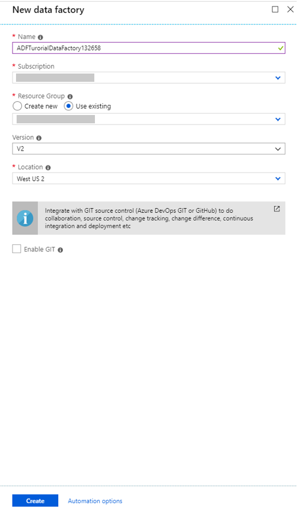
 
   The name of the Azure data factory must be *globally unique*. If you see the following error, change the name of the data factory. (For example, use **&lt;yourname&gt;ADFTutorialDataFactory**). For naming rules for Data Factory artifacts, see the [Data Factory - naming rules](naming-rules.md) article.
  
   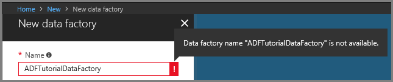
1. For **Subscription**, select your Azure subscription in which you want to create the data factory. 
1. For **Resource Group**, take one of the following steps:
     
   - Select **Use existing**, and select an existing resource group from the drop-down list. 
   - Select **Create new**, and enter the name of a resource group.   
         
   Some of the steps in this quickstart assume that you use the name **ADFTutorialResourceGroup** for the resource group. To learn about resource groups, see [Using resource groups to manage your Azure resources](../azure-resource-manager/resource-group-overview.md).  
1. For **Version**, select **V2**.
1. For **Location**, select the location for the data factory. 

   For a list of Azure regions in which Data Factory is currently available, select the regions that interest you on the following page, and then expand **Analytics** to locate **Data Factory**: [Products available by region](https://azure.microsoft.com/global-infrastructure/services/). The data stores (like Azure Storage and Azure SQL Database) and computes (like HDInsight) that Data Factory uses can be in other regions.

1. Select **Create**.

1. After the creation is complete, you see the **Data factory** page. Select the **Author & Monitor** tile to start the Data Factory UI application on a separate tab.

    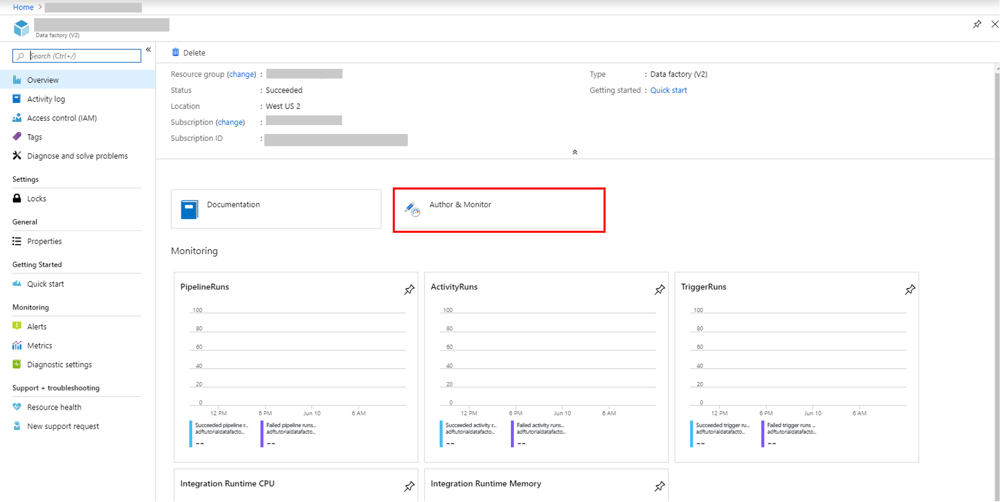

## Create linked services
You author two linked services in this section: 
	
- An **Azure Storage linked service** that links an Azure storage account to the data factory. This storage is used by the on-demand HDInsight cluster. It also contains the Spark script to be run. 
- An **on-demand HDInsight linked service**. Azure Data Factory automatically creates an HDInsight cluster and runs the Spark program. It then deletes the HDInsight cluster after the cluster is idle for a preconfigured time. 

### Create an Azure Storage linked service

1. On the **Let's get started** page, switch to the **Edit** tab in the left panel. 

   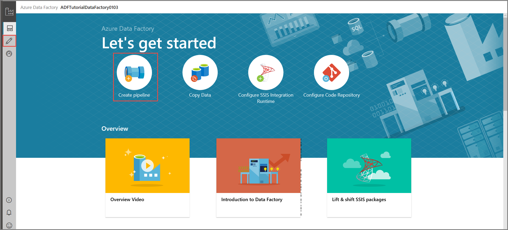

1. Select **Connections** at the bottom of the window, and then select **+ New**. 

   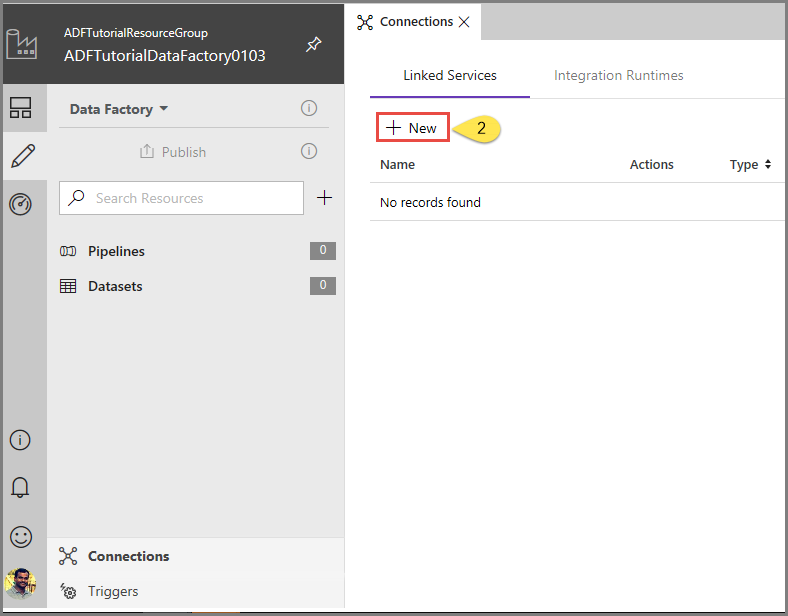
1. In the **New Linked Service** window, select **Data Store** > **Azure Blob Storage**, and then select **Continue**. 

   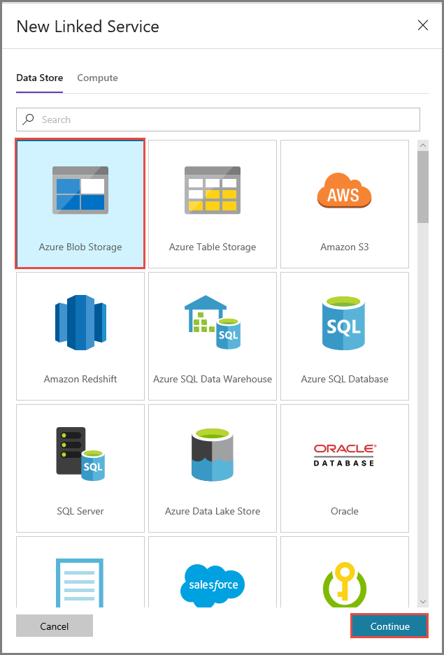
1. For **Storage account name**, select the name from the list, and then select **Save**. 

   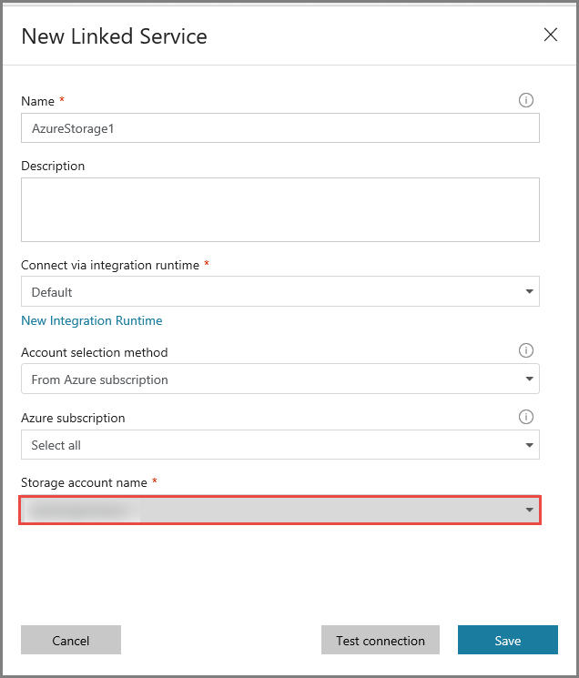


### Create an on-demand HDInsight linked service

1. Select the **+ New** button again to create another linked service. 
1. In the **New Linked Service** window, select **Compute** > **Azure HDInsight**, and then select **Continue**. 

   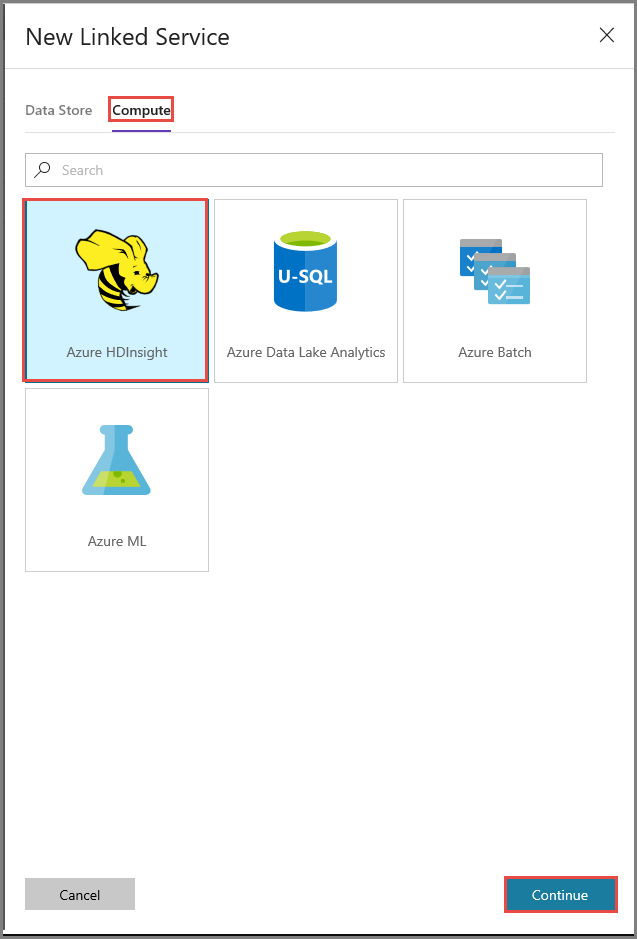
1. In the **New Linked Service** window, complete the following steps: 

   a. For **Name**, enter **AzureHDInsightLinkedService**.
   
   b. For **Type**, confirm that **On-demand HDInsight** is selected.
   
   c. For **Azure Storage Linked Service**, select **AzureStorage1**. You created this linked service earlier. If you used a different name, specify the right name here. 
   
   d. For **Cluster type**, select **spark**.
   
   e. For **Service principal id**, enter the ID of the service principal that has permission to create an HDInsight cluster. 
   
      This service principal needs to be a member of the Contributor role of the subscription or the resource group in which the cluster is created. For more information, see [Create an Azure Active Directory application and service principal](../azure-resource-manager/resource-group-create-service-principal-portal.md).
   
   f. For **Service principal key**, enter the key. 
   
   g. For **Resource group**, select the same resource group that you used when you created the data factory. The Spark cluster is created in this resource group. 
   
   h. Expand **OS type**.
   
   i. Enter a name for **Cluster user name**. 
   
   j. Enter the **Cluster password** for the user. 
   
   k. Select **Finish**. 

   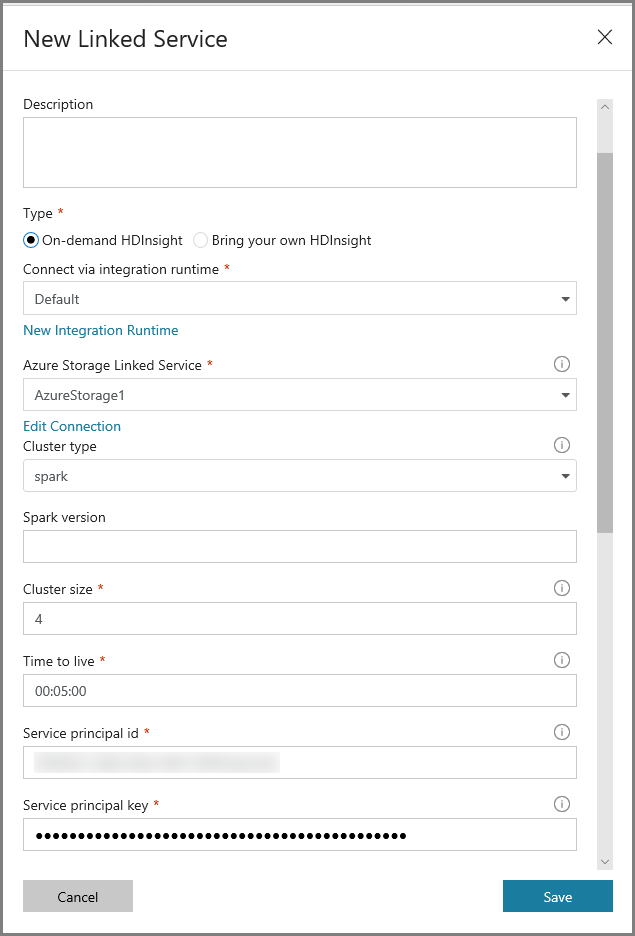

> [!NOTE]
> Azure HDInsight limits the total number of cores that you can use in each Azure region that it supports. For the on-demand HDInsight linked service, the HDInsight cluster is created in the same Azure Storage location that's used as its primary storage. Ensure that you have enough core quotas for the cluster to be created successfully. For more information, see [Set up clusters in HDInsight with Hadoop, Spark, Kafka, and more](../hdinsight/hdinsight-hadoop-provision-linux-clusters.md). 

## Create a pipeline

1. Select the **+** (plus) button, and then select **Pipeline** on the menu.

   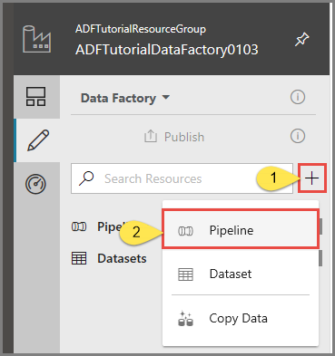
1. In the **Activities** toolbox, expand **HDInsight**. Drag the **Spark** activity from the **Activities** toolbox to the pipeline designer surface. 

   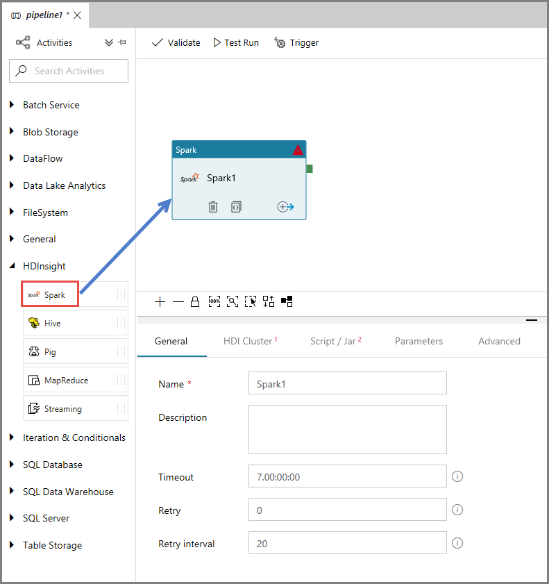
1. In the properties for the **Spark** activity window at the bottom, complete the following steps: 

   a. Switch to the **HDI Cluster** tab.
   
   b. Select **AzureHDInsightLinkedService** (which you created in the previous procedure). 
        
   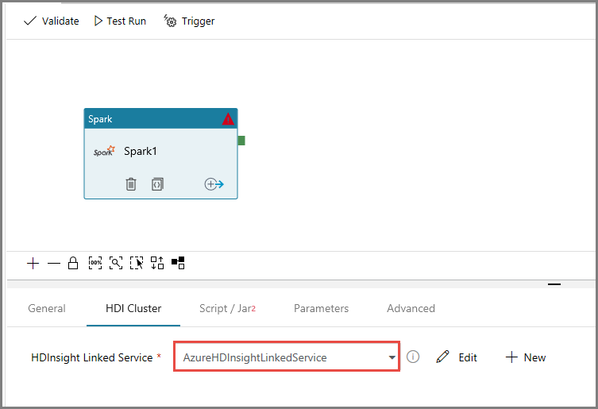
1. Switch to the **Script/Jar** tab, and complete the following steps: 

   a. For **Job Linked Service**, select **AzureStorage1**.
   
   b. Select **Browse Storage**.

   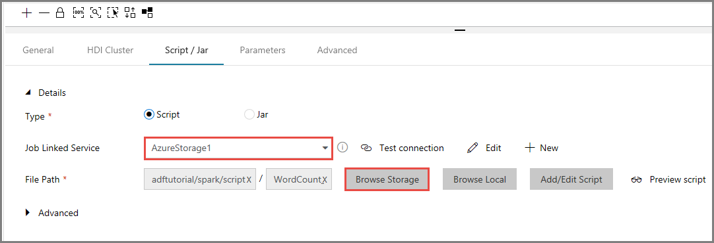
   
   c. Browse to the **adftutorial/spark/script** folder, select **WordCount_Spark.py**, and then select **Finish**.      

1. To validate the pipeline, select the **Validate** button on the toolbar. Select the **>>** (right arrow) button to close the validation window. 
    
   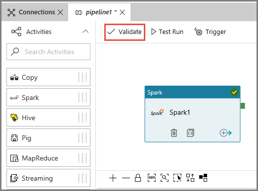
1. Select **Publish All**. The Data Factory UI publishes entities (linked services and pipeline) to the Azure Data Factory service. 
    
   


## Trigger a pipeline run
Select **Trigger** on the toolbar, and then select **Trigger Now**. 

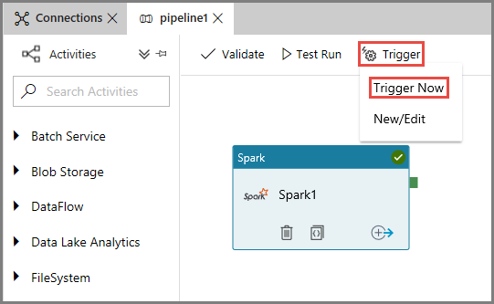

## Monitor the pipeline run

1. Switch to the **Monitor** tab. Confirm that you see a pipeline run. It takes approximately 20 minutes to create a Spark cluster. 
   
1. Select **Refresh** periodically to check the status of the pipeline run. 

   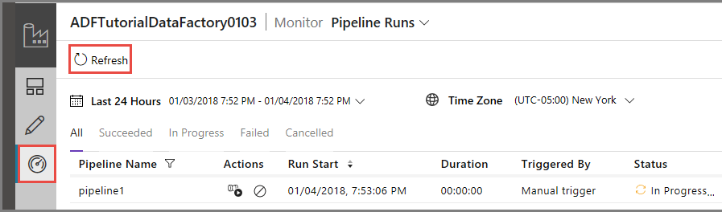

1. To see activity runs associated with the pipeline run, select **View Activity Runs** in the **Actions** column.

   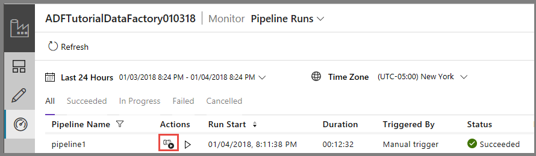 

   You can switch back to the pipeline runs view by selecting the **Pipelines** link at the top.

   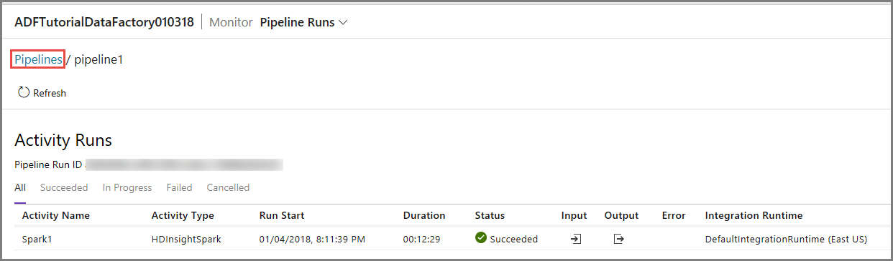

## Verify the output
Verify that the output file is created in the spark/otuputfiles/wordcount folder of the adftutorial container. 

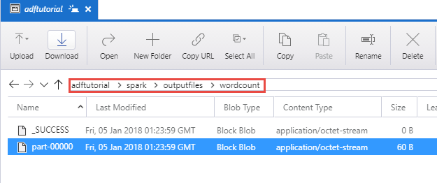

The file should have each word from the input text file and the number of times the word appeared in the file. For example: 

```
(u'This', 1)
(u'a', 1)
(u'is', 1)
(u'test', 1)
(u'file', 1)
```

## Next steps
The pipeline in this sample transforms data by using a Spark activity and an on-demand HDInsight linked service. You learned how to: 

> [!div class="checklist"]
> * Create a data factory. 
> * Create a pipeline that uses a Spark activity.
> * Trigger a pipeline run.
> * Monitor the pipeline run.

To learn how to transform data by running a Hive script on an Azure HDInsight cluster that's in a virtual network, advance to the next tutorial: 

> [!div class="nextstepaction"]
> [Tutorial: Transform data using Hive in Azure Virtual Network](tutorial-transform-data-hive-virtual-network-portal.md).


