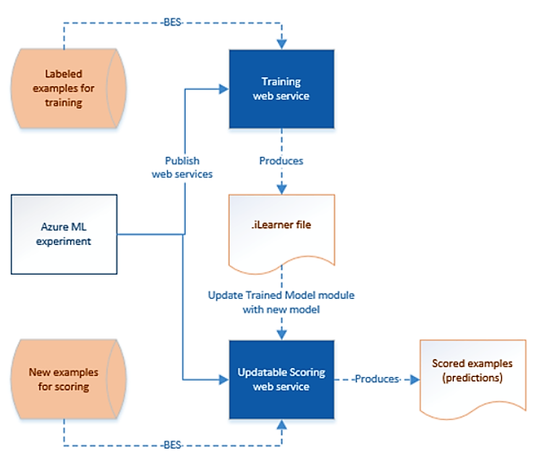

# Update ML Studio (classic)v models by using Update Resource activity

[!INCLUDE[appliesto-adf-asa-md](includes/appliesto-adf-asa-md.md)]

This article complements the main Azure Data Factory - ML Studio (classic)integration article: [Create predictive pipelines using Azure Machine Learning and Azure Data Factory](transform-data-using-machine-learning.md). If you haven't already done so, review the main article before reading through this article.

## Overview
As part of the process of operationalizing ML Studio (classic) models, your model is trained and saved. You then use it to create a predictive Web service. The Web service can then be consumed in web sites, dashboards, and mobile apps.

Models you create using Machine Learning are typically not static. As new data becomes available or when the consumer of the API has their own data the model needs to be retrained. 

Retraining may occur frequently. With Batch Execution activity and Update Resource activity, you can operationalize the Azure Machine Learning model retraining and updating the predictive Web Service using Data Factory.

The following picture depicts the relationship between training and predictive Web Services.



## ML Studio (classic) update resource activity

The following JSON snippet defines an ML Studio (classic) Batch Execution activity.

```json
{
    "name": "amlUpdateResource",
    "type": "AzureMLUpdateResource",
    "description": "description",
    "linkedServiceName": {
        "type": "LinkedServiceReference",
        "referenceName": "updatableScoringEndpoint2"
    },
    "typeProperties": {
        "trainedModelName": "ModelName",
        "trainedModelLinkedServiceName": {
                    "type": "LinkedServiceReference",
                    "referenceName": "StorageLinkedService"
                },
        "trainedModelFilePath": "ilearner file path"
    }
}
```

| Property                      | Description                              | Required |
| :---------------------------- | :--------------------------------------- | :------- |
| name                          | Name of the activity in the pipeline     | Yes      |
| description                   | Text describing what the activity does.  | No       |
| type                          | For Azure Machine Learning Update Resource activity, the activity type is  **AzureMLUpdateResource**. | Yes      |
| linkedServiceName             | Azure Machine Learning linked service that contains updateResourceEndpoint property. | Yes      |
| trainedModelName              | Name of the Trained Model module in the Web Service experiment to be updated | Yes      |
| trainedModelLinkedServiceName | Name of Azure Storage linked service holding the ilearner file that is uploaded by the update operation | Yes      |
| trainedModelFilePath          | The relative file path in trainedModelLinkedService to represent the ilearner file that is uploaded by the update operation | Yes      |

## End-to-end workflow

The entire process of operationalizing retraining a model and update the predictive Web Services involves the following steps:

- Invoke the **training Web Service** by using the **Batch Execution activity**. Invoking a training Web Service is the same as invoking a predictive Web Service described in [Create predictive pipelines using Azure Machine Learning and Data Factory Batch Execution activity](transform-data-using-machine-learning.md). The output of the training Web Service is an iLearner file that you can use to update the predictive Web Service.
- Invoke the **update resource endpoint** of the **predictive Web Service** by using the **Update Resource activity** to update the Web Service with the newly trained model.

## Azure Machine Learning linked service

For the above mentioned end-to-end workflow to work, you need to create two Azure Machine Learning linked services:

1. An Azure Machine Learning linked service to the training web service, this linked service is used by Batch Execution activity in the same way as what's mentioned in [Create predictive pipelines using Azure Machine Learning and Data Factory Batch Execution activity](transform-data-using-machine-learning.md). Difference is the output of the training web service is an iLearner file which is then used by Update Resource activity to update the predictive web service.
2. An Azure Machine Learning linked service to the update resource endpoint of the predictive web service. This linked service is used by Update Resource activity to update the predictive web service using the iLearner file returned from above step.

For the second Azure Machine Learning linked service, the configuration is different when your Azure Machine Learning Web Service is a classic Web Service or a new Web Service. The differences are discussed separately in the following sections.

## Web service is new Azure Resource Manager web service

If the web service is the new type of web service that exposes an Azure Resource Manager endpoint, you do not need to add the second **non-default** endpoint. The **updateResourceEndpoint** in the linked service is of the format:

```
https://management.azure.com/subscriptions/{subscriptionId}/resourceGroups/{resource-group-name}/providers/Microsoft.MachineLearning/webServices/{web-service-name}?api-version=2016-05-01-preview
```

You can get values for place holders in the URL when querying the web service on the [Azure Machine Learning Web Services Portal](https://services.azureml.net/).

The new type of update resource endpoint requires service principal authentication. To use service principal authentication, register an application entity in Azure Active Directory (Azure AD) and grant it the **Contributor** or **Owner** role of the subscription or the resource group where the web service belongs to. The See [how to create service principal and assign permissions to manage Azure resource](../active-directory/develop/howto-create-service-principal-portal.md). Make note of the following values, which you use to define the linked service:

- Application ID
- Application key
- Tenant ID

Here is a sample linked service definition:

```json
{
    "name": "AzureMLLinkedService",
    "properties": {
        "type": "AzureML",
        "description": "The linked service for AML web service.",
        "typeProperties": {
            "mlEndpoint": "https://ussouthcentral.services.azureml.net/workspaces/0000000000000000	000000000000000000000/services/0000000000000000000000000000000000000/jobs?api-version=2.0",
            "apiKey": {
                "type": "SecureString",
                "value": "APIKeyOfEndpoint1"
            },
            "updateResourceEndpoint": "https://management.azure.com/subscriptions/{subscriptionId}/resourceGroups/{resource-group-name}/providers/Microsoft.MachineLearning/webServices/{web-service-name}?api-version=2016-05-01-preview",
            "servicePrincipalId": "000000000-0000-0000-0000-0000000000000",
            "servicePrincipalKey": {
                "type": "SecureString",
                "value": "servicePrincipalKey"
            },
            "tenant": "mycompany.com"
        }
    }
}
```

The following scenario provides more details. It has an example for retraining and updating Azure Machine Learning studio models from an Azure Data Factory pipeline.


## Sample: Retraining and updating an Azure Machine Learning model

This section provides a sample pipeline that uses the **Azure Machine Learning studio Batch Execution activity** to retrain a model. The pipeline also uses the **Azure Machine Learning studio Update Resource activity** to update the model in the scoring web service. The section also provides JSON snippets for all the linked services, datasets, and pipeline in the example.

### Azure Blob storage linked service:
The Azure Storage holds the following data:

* training data. The input data for the Azure Machine Learning studio training web service.
* iLearner file. The output from the Azure Machine Learning studio training web service. This file is also the input to the Update Resource activity.

Here is the sample JSON definition of the linked service:

```JSON
{
    "name": "StorageLinkedService",
    "properties": {
        "type": "AzureStorage",
        "typeProperties": {
            "connectionString": "DefaultEndpointsProtocol=https;AccountName=name;AccountKey=key"
        }
    }
}
```

### Linked service for Azure Machine Learning studio training endpoint
The following JSON snippet defines an Azure Machine Learning linked service that points to the default endpoint of the training web service.

```JSON
{
    "name": "trainingEndpoint",
    "properties": {
        "type": "AzureML",
        "typeProperties": {
            "mlEndpoint": "https://ussouthcentral.services.azureml.net/workspaces/xxx/services/--training experiment--/jobs",
            "apiKey": "myKey"
        }
    }
}
```

In **Azure Machine Learning studio**, do the following to get values for **mlEndpoint** and **apiKey**:

1. Click **WEB SERVICES** on the left menu.
2. Click the **training web service** in the list of web services.
3. Click copy next to **API key** text box. Paste the key in the clipboard into the Data Factory JSON editor.
4. In the **Azure Machine Learning studio**, click **BATCH EXECUTION** link.
5. Copy the **Request URI** from the **Request** section and paste it into the Data Factory JSON editor.

### Linked service for Azure Machine Learning studio updatable scoring endpoint:
The following JSON snippet defines an Azure Machine Learning linked service that points to updatable endpoint of the scoring web service.

```JSON
{
    "name": "updatableScoringEndpoint2",
    "properties": {
        "type": "AzureML",
        "typeProperties": {
            "mlEndpoint": "https://ussouthcentral.services.azureml.net/workspaces/00000000eb0abe4d6bbb1d7886062747d7/services/00000000026734a5889e02fbb1f65cefd/jobs?api-version=2.0",
            "apiKey": "sooooooooooh3WvG1hBfKS2BNNcfwSO7hhY6dY98noLfOdqQydYDIXyf2KoIaN3JpALu/AKtflHWMOCuicm/Q==",
            "updateResourceEndpoint": "https://management.azure.com/subscriptions/00000000-0000-0000-0000-000000000000/resourceGroups/Default-MachineLearning-SouthCentralUS/providers/Microsoft.MachineLearning/webServices/myWebService?api-version=2016-05-01-preview",
            "servicePrincipalId": "fe200044-c008-4008-a005-94000000731",
            "servicePrincipalKey": "zWa0000000000Tp6FjtZOspK/WMA2tQ08c8U+gZRBlw=",
            "tenant": "mycompany.com"
        }
    }
}
```

### Pipeline
The pipeline has two activities: **AzureMLBatchExecution** and **AzureMLUpdateResource**. The Batch Execution activity takes the training data as input and produces an iLearner file as an output. The Update Resource activity then takes this iLearner file and use it to update the predictive web service.

```JSON
{
    "name": "LookupPipelineDemo",
    "properties": {
        "activities": [
            {
                "name": "amlBEGetilearner",
                "description": "Use AML BES to get the ileaner file from training web service",
                "type": "AzureMLBatchExecution",
                "linkedServiceName": {
                    "referenceName": "trainingEndpoint",
                    "type": "LinkedServiceReference"
                },
                "typeProperties": {
                    "webServiceInputs": {
                        "input1": {
                            "LinkedServiceName":{
                                "referenceName": "StorageLinkedService",
                                "type": "LinkedServiceReference"
                            },
                            "FilePath":"azuremltesting/input"
                        },
                        "input2": {
                            "LinkedServiceName":{
                                "referenceName": "StorageLinkedService",
                                "type": "LinkedServiceReference"
                            },
                            "FilePath":"azuremltesting/input"
                        }
                    },
                    "webServiceOutputs": {
                        "output1": {
                            "LinkedServiceName":{
                                "referenceName": "StorageLinkedService",
                                "type": "LinkedServiceReference"
                            },
                            "FilePath":"azuremltesting/output"
                        }
                    }
                }
            },
            {
                "name": "amlUpdateResource",
                "type": "AzureMLUpdateResource",
                "description": "Use AML Update Resource to update the predict web service",
                "linkedServiceName": {
                    "type": "LinkedServiceReference",
                    "referenceName": "updatableScoringEndpoint2"
                },
                "typeProperties": {
                    "trainedModelName": "ADFV2Sample Model [trained model]",
                    "trainedModelLinkedServiceName": {
                        "type": "LinkedServiceReference",
                        "referenceName": "StorageLinkedService"
                    },
                    "trainedModelFilePath": "azuremltesting/output/newModelForArm.ilearner"
                },
                "dependsOn": [
                    {
                        "activity": "amlbeGetilearner",
                        "dependencyConditions": [ "Succeeded" ]
                    }
                ]
            }
        ]
    }
}
```
## Next steps
See the following articles that explain how to transform data in other ways:

* [U-SQL activity](transform-data-using-data-lake-analytics.md)
* [Hive activity](transform-data-using-hadoop-hive.md)
* [Pig activity](transform-data-using-hadoop-pig.md)
* [MapReduce activity](transform-data-using-hadoop-map-reduce.md)
* [Hadoop Streaming activity](transform-data-using-hadoop-streaming.md)
* [Spark activity](transform-data-using-spark.md)
* [.NET custom activity](transform-data-using-dotnet-custom-activity.md)
* [Stored procedure activity](transform-data-using-stored-procedure.md)
