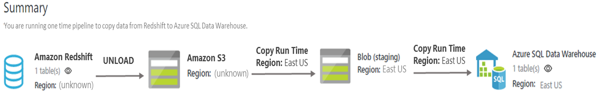

# Move data From Amazon Redshift using Azure Data Factory
> [!div class="op_single_selector" title1="Select the version of Data Factory service you are using:"]
> * [Version 1](data-factory-amazon-redshift-connector.md)
> * [Version 2 (current version)](../connector-amazon-redshift.md)

> [!NOTE]
> This article applies to version 1 of Data Factory. If you are using the current version of the Data Factory service, see [Amazon Redshift connector in V2](../connector-amazon-redshift.md).

This article explains how to use the Copy Activity in Azure Data Factory to move data from Amazon Redshift. The article builds on the [Data Movement Activities](data-factory-data-movement-activities.md) article, which presents a general overview of data movement with the copy activity.

Data Factory currently supports only moving data from Amazon Redshift to a [supported sink data store](data-factory-data-movement-activities.md#supported-data-stores-and-formats). Moving data from other data stores to Amazon Redshift is not supported.

> [!TIP]
> To achieve the best performance when copying large amounts of data from Amazon Redshift, consider using the built-in Redshift **UNLOAD** command through Amazon Simple Storage Service (Amazon S3). For details, see [Use UNLOAD to copy data from Amazon Redshift](#use-unload-to-copy-data-from-amazon-redshift).

## Prerequisites
* If you are moving data to an on-premises data store, install [Data Management Gateway](data-factory-data-management-gateway.md) on an on-premises machine. Grant access for a gateway to the Amazon Redshift cluster by using the on-premises machine IP address. For instructions, see [Authorize access to the cluster](https://docs.aws.amazon.com/redshift/latest/gsg/rs-gsg-authorize-cluster-access.html).
* To move data to an Azure data store, see the [Compute IP address and SQL ranges that are used by the Microsoft Azure Datacenters](https://www.microsoft.com/download/details.aspx?id=41653).

## Getting started
You can create a pipeline with a copy activity to move data from an Amazon Redshift source by using different tools and APIs.

The easiest way to create a pipeline is to use the Azure Data Factory Copy Wizard. For a quick walkthrough on creating a pipeline by using the Copy Wizard, see the [Tutorial: Create a pipeline by using the Copy Wizard](data-factory-copy-data-wizard-tutorial.md).

You can also create a pipeline by using Visual Studio, Azure PowerShell, or other tools. Azure Resource Manager templates, the .NET API, or the REST API can also be used to create the pipeline. For step-by-step instructions to create a pipeline with a copy activity, see the [Copy Activity tutorial](data-factory-copy-data-from-azure-blob-storage-to-sql-database.md).

Whether you use the tools or APIs, you perform the following steps to create a pipeline that moves data from a source data store to a sink data store:

1. Create linked services to link input and output data stores to your data factory.
2. Create datasets to represent input and output data for the copy operation.
3. Create a pipeline with a copy activity that takes a dataset as an input and a dataset as an output.

When you use the Copy Wizard, JSON definitions for these Data Factory entities are automatically created. When you use tools or APIs (except the .NET API), you define the Data Factory entities by using the JSON format. The JSON example: Copy data from Amazon Redshift to Azure Blob storage shows the JSON definitions for the Data Factory entities that are used to copy data from an Amazon Redshift data store.

The following sections describe the JSON properties that are used to define the Data Factory entities for Amazon Redshift.

## Linked service properties

The following table provides descriptions for the JSON elements that are specific to an Amazon Redshift linked service.

| Property | Description | Required |
| --- | --- | --- |
| **type** |This property must be set to **AmazonRedshift**. |Yes |
| **server** |The IP address or host name of the Amazon Redshift server. |Yes |
| **port** |The number of the TCP port that the Amazon Redshift server uses to listen for client connections. |No (default is 5439) |
| **database** |The name of the Amazon Redshift database. |Yes |
| **username** |The name of the user who has access to the database. |Yes |
| **password** |The password for the user account. |Yes |

## Dataset properties

For a list of the sections and properties that are available for defining datasets, see the [Creating datasets](data-factory-create-datasets.md) article. The **structure**, **availability**, and **policy** sections are similar for all dataset types. Examples of dataset types include Azure SQL, Azure Blob storage, and Azure Table storage.

The **typeProperties** section is different for each type of dataset and provides information about the location of the data in the store. **The typeProperties** section for a dataset of type **RelationalTable**, which includes the Amazon Redshift dataset, has the following properties:

| Property | Description | Required |
| --- | --- | --- |
| **tableName** |The name of the table in the Amazon Redshift database that the linked service refers to. |No (if the **query** property of a copy activity of type **RelationalSource** is specified) |

## Copy Activity properties

For a list of sections and properties that are available for defining activities, see the [Creating Pipelines](data-factory-create-pipelines.md) article. The **name**, **description**, **inputs** table, **outputs** table, and **policy** properties are available for all types of activities. The properties that are available in the **typeProperties** section vary for each activity type. For Copy Activity, the properties vary depending on the types of data sources and sinks.

For Copy Activity, when the source is of type **AmazonRedshiftSource**, the following properties are available in **typeProperties** section:

| Property | Description | Required |
| --- | --- | --- |
| **query** | Use the custom query to read the data. |No (if the **tableName** property of a dataset is specified) |
| **redshiftUnloadSettings** | Contains the property group when using the Redshift **UNLOAD** command. | No |
| **s3LinkedServiceName** | The Amazon S3 to use as an interim store. The linked service is specified by using an Azure Data Factory name of type **AwsAccessKey**. | Required when using the **redshiftUnloadSettings** property |
| **bucketName** | Indicates the Amazon S3 bucket to use to store the interim data. If this property is not provided, Copy Activity auto-generates a bucket. | Required when using the **redshiftUnloadSettings** property |

Alternatively, you can use the **RelationalSource** type, which includes Amazon Redshift, with the following property in the **typeProperties** section. Note this source type doesn't support the Redshift **UNLOAD** command.

| Property | Description | Required |
| --- | --- | --- |
| **query** |Use the custom query to read the data. | No (if the **tableName** property of a dataset is specified) |

## Use UNLOAD to copy data from Amazon Redshift

The Amazon Redshift [**UNLOAD**](https://docs.aws.amazon.com/redshift/latest/dg/r_UNLOAD.html) command unloads the results of a query to one or more files on Amazon S3. This command is recommended by Amazon for copying large datasets from Redshift.

**Example: Copy data from Amazon Redshift to Azure SQL Data Warehouse**

This example copies data from Amazon Redshift to Azure SQL Data Warehouse. The example uses the Redshift **UNLOAD** command, staged copy data, and Microsoft PolyBase.

For this sample use case, Copy Activity first unloads the data from Amazon Redshift to Amazon S3 as configured in the  **redshiftUnloadSettings** option. Next, the data is copied from Amazon S3 to Azure Blob storage as specified in the **stagingSettings** option. Finally, PolyBase loads the data into SQL Data Warehouse. All of the interim formats are handled by Copy Activity.



```json
{
    "name": "CopyFromRedshiftToSQLDW",
    "type": "Copy",
    "typeProperties": {
        "source": {
            "type": "AmazonRedshiftSource",
            "query": "select * from MyTable",
            "redshiftUnloadSettings": {
                "s3LinkedServiceName":"MyAmazonS3StorageLinkedService",
                "bucketName": "bucketForUnload"
            }
        },
        "sink": {
            "type": "SqlDWSink",
            "allowPolyBase": true
        },
        "enableStaging": true,
        "stagingSettings": {
            "linkedServiceName": "MyAzureStorageLinkedService",
            "path": "adfstagingcopydata"
        },
        "cloudDataMovementUnits": 32
        .....
    }
}
```

## JSON example: Copy data from Amazon Redshift to Azure Blob storage
This sample shows how to copy data from an Amazon Redshift database to Azure Blob Storage. Data can be copied directly to any [supported sink](data-factory-data-movement-activities.md#supported-data-stores-and-formats) by using Copy Activity.

The sample has the following data factory entities:

* A linked service of type [AmazonRedshift](#linked-service-properties)
* A linked service of type [AzureStorage](data-factory-azure-blob-connector.md#linked-service-properties).
* An input [dataset](data-factory-create-datasets.md) of type [RelationalTable](#dataset-properties)
* An output [dataset](data-factory-create-datasets.md) of type [AzureBlob](data-factory-azure-blob-connector.md#dataset-properties)
* A [pipeline](data-factory-create-pipelines.md) with a copy activity that uses the [RelationalSource](#copy-activity-properties) and [BlobSink](data-factory-azure-blob-connector.md#copy-activity-properties) properties

The sample copies data from a query result in Amazon Redshift to an Azure blob hourly. The JSON properties that are used in the sample are described in the sections that follow the entity definitions.

**Amazon Redshift linked service**

```json
{
    "name": "AmazonRedshiftLinkedService",
    "properties":
    {
        "type": "AmazonRedshift",
        "typeProperties":
        {
            "server": "< The IP address or host name of the Amazon Redshift server >",
            "port": "<The number of the TCP port that the Amazon Redshift server uses to listen for client connections.>",
            "database": "<The database name of the Amazon Redshift database>",
            "username": "<username>",
            "password": "<password>"
        }
    }
}
```

**Azure Blob storage linked service**

```json
{
  "name": "AzureStorageLinkedService",
  "properties": {
    "type": "AzureStorage",
    "typeProperties": {
      "connectionString": "DefaultEndpointsProtocol=https;AccountName=<accountname>;AccountKey=<accountkey>"
    }
  }
}
```
**Amazon Redshift input dataset**

The **external** property is set to "true" to inform the Data Factory service that the dataset is external to the data factory. This property setting indicates that the dataset is not produced by an activity in the data factory. Set the property to true on an input dataset that is not produced by an activity in the pipeline.

```json
{
    "name": "AmazonRedshiftInputDataset",
    "properties": {
        "type": "RelationalTable",
        "linkedServiceName": "AmazonRedshiftLinkedService",
        "typeProperties": {
            "tableName": "<Table name>"
        },
        "availability": {
            "frequency": "Hour",
            "interval": 1
        },
        "external": true
    }
}
```

**Azure Blob output dataset**

Data is written to a new blob every hour by setting the **frequency** property to "Hour" and the **interval** property to 1. The **folderPath** property for the blob is dynamically evaluated. The property value is based on the start time of the slice that is being processed. The folder path uses the year, month, day, and hours parts of the start time.

```json
{
    "name": "AzureBlobOutputDataSet",
    "properties": {
        "type": "AzureBlob",
        "linkedServiceName": "AzureStorageLinkedService",
        "typeProperties": {
            "folderPath": "mycontainer/fromamazonredshift/yearno={Year}/monthno={Month}/dayno={Day}/hourno={Hour}",
            "format": {
                "type": "TextFormat",
                "rowDelimiter": "\n",
                "columnDelimiter": "\t"
            },
            "partitionedBy": [
                {
                    "name": "Year",
                    "value": {
                        "type": "DateTime",
                        "date": "SliceStart",
                        "format": "yyyy"
                    }
                },
                {
                    "name": "Month",
                    "value": {
                        "type": "DateTime",
                        "date": "SliceStart",
                        "format": "MM"
                    }
                },
                {
                    "name": "Day",
                    "value": {
                        "type": "DateTime",
                        "date": "SliceStart",
                        "format": "dd"
                    }
                },
                {
                    "name": "Hour",
                    "value": {
                        "type": "DateTime",
                        "date": "SliceStart",
                        "format": "HH"
                    }
                }
            ]
        },
        "availability": {
            "frequency": "Hour",
            "interval": 1
        }
    }
}
```

**Copy activity in a pipeline with an Azure Redshift source (of type RelationalSource) and an Azure Blob sink**

The pipeline contains a copy activity that is configured to use the input and output datasets. The pipeline is scheduled to run every hour. In the JSON definition for the pipeline, the **source** type is set to **RelationalSource** and the **sink** type is set to **BlobSink**. The SQL query specified for the **query** property selects the data to copy from the past hour.

```json
{
    "name": "CopyAmazonRedshiftToBlob",
    "properties": {
        "description": "pipeline for copy activity",
        "activities": [
            {
                "type": "Copy",
                "typeProperties": {
                    "source": {
                        "type": "AmazonRedshiftSource",
                        "query": "$$Text.Format('select * from MyTable where timestamp >= \\'{0:yyyy-MM-ddTHH:mm:ss}\\' AND timestamp < \\'{1:yyyy-MM-ddTHH:mm:ss}\\'', WindowStart, WindowEnd)",
                        "redshiftUnloadSettings": {
                            "s3LinkedServiceName":"myS3Storage",
                            "bucketName": "bucketForUnload"
                        }
                    },
                    "sink": {
                        "type": "BlobSink",
                        "writeBatchSize": 0,
                        "writeBatchTimeout": "00:00:00"
                    },
                    "cloudDataMovementUnits": 32
                },
                "inputs": [
                    {
                        "name": "AmazonRedshiftInputDataset"
                    }
                ],
                "outputs": [
                    {
                        "name": "AzureBlobOutputDataSet"
                    }
                ],
                "policy": {
                    "timeout": "01:00:00",
                    "concurrency": 1
                },
                "scheduler": {
                    "frequency": "Hour",
                    "interval": 1
                },
                "name": "AmazonRedshiftToBlob"
            }
        ],
        "start": "2014-06-01T18:00:00Z",
        "end": "2014-06-01T19:00:00Z"
    }
}
```
### Type mapping for Amazon Redshift
As mentioned in the [data movement activities](data-factory-data-movement-activities.md) article, Copy Activity performs automatic type conversions from source type to sink type. The types are converted by using a two-step approach:

1. Convert from a native source type to a .NET type
2. Convert from a .NET type to a native sink type

The following mappings are used when Copy Activity converts the data from an Amazon Redshift type to a .NET type:

| Amazon Redshift type | .NET type |
| --- | --- |
| SMALLINT |Int16 |
| INTEGER |Int32 |
| BIGINT |Int64 |
| DECIMAL |Decimal |
| REAL |Single |
| DOUBLE PRECISION |Double |
| BOOLEAN |String |
| CHAR |String |
| VARCHAR |String |
| DATE |DateTime |
| TIMESTAMP |DateTime |
| TEXT |String |

## Map source to sink columns
To learn how to map columns in the source dataset to columns in the sink dataset, see [Mapping dataset columns in Azure Data Factory](data-factory-map-columns.md).

## Repeatable reads from relational sources
When you copy data from a relational data store, keep repeatability in mind to avoid unintended outcomes. In Azure Data Factory, you can rerun a slice manually. You can also configure the retry **policy** for a dataset to rerun a slice when a failure occurs. Make sure that the same data is read, no matter how many times the slice is rerun. Also make sure that the same data is read regardless of how you rerun the slice. For more information, see [Repeatable reads from relational sources](data-factory-repeatable-copy.md#repeatable-read-from-relational-sources).

## Performance and tuning
Learn about key factors that affect the performance of Copy Activity and ways to optimize performance in the [Copy Activity Performance and Tuning Guide](data-factory-copy-activity-performance.md).

## Next steps
For step-by-step instructions for creating a pipeline with Copy Activity, see the [Copy Activity tutorial](data-factory-copy-data-from-azure-blob-storage-to-sql-database.md).
