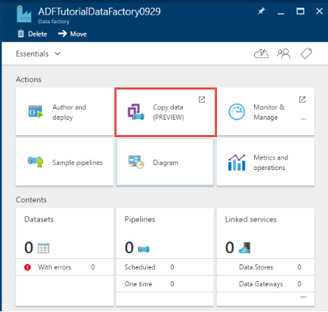
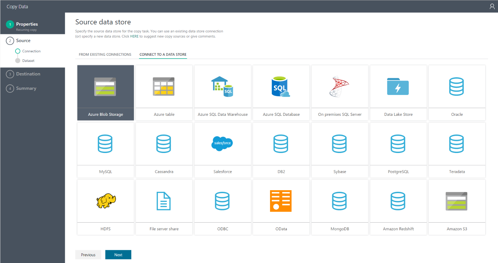
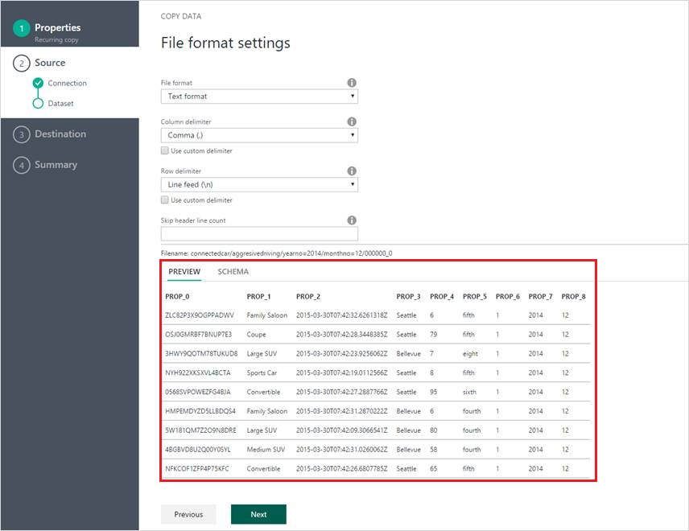
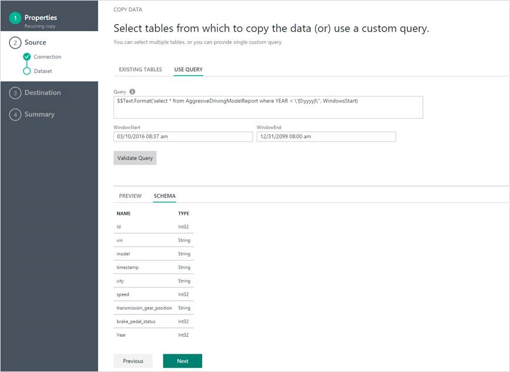
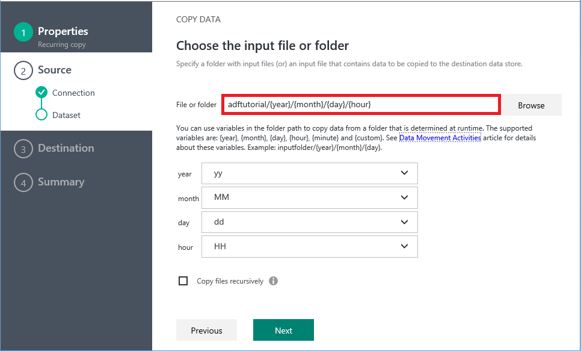
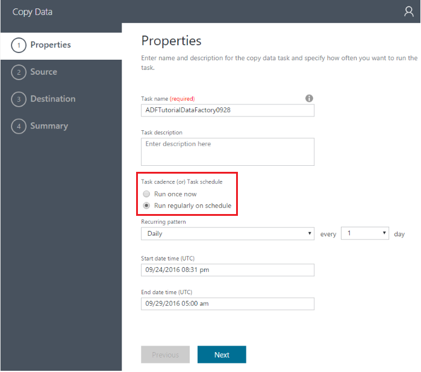

# Azure Data Factory Copy Wizard
> [!NOTE]
> This article applies to version 1 of Data Factory. 

The Azure Data Factory Copy Wizard eases the process of ingesting data, which is usually a first step in an end-to-end data integration scenario. When going through the Azure Data Factory Copy Wizard, you do not need to understand any JSON definitions for linked services, data sets, and pipelines. The wizard automatically creates a pipeline to copy data from the selected data source to the selected destination. In addition, the Copy Wizard helps you to validate the data being ingested at the time of authoring. This saves time, especially when you are ingesting data for the first time from the data source. To start the Copy Wizard, click the **Copy data** tile on the home page of your data factory.

## Designed for big data
This wizard allows you to easily move data from a wide variety of sources to destinations in minutes. After you go through the wizard, a pipeline with a copy activity is automatically created for you, along with dependent Data Factory entities (linked services and data sets). No additional steps are required to create the pipeline.   

> [!NOTE]
> For step-by-step instructions to create a sample pipeline to copy data from an Azure blob to an Azure SQL Database table, see the [Copy Wizard tutorial](data-factory-copy-data-wizard-tutorial.md).
>
>

The wizard is designed with big data in mind from the start, with support for diverse data and object types. You can author Data Factory pipelines that move hundreds of folders, files, or tables. The wizard supports automatic data preview, schema capture and mapping, and data filtering.

## Automatic data preview
You can preview part of the data from the selected data source in order to validate whether the data is what you want to copy. In addition, if the source data is in a text file, the Copy Wizard parses the text file to learn the row and column delimiters and schema automatically.

## Schema capture and mapping
The schema of input data may not match the schema of output data in some cases. In this scenario, you need to map columns from the source schema to columns from the destination schema.

> [!TIP]
> When copying data from SQL Server or Azure SQL Database into Azure SQL Data Warehouse, if the table does not exist in the destination store, Data Factory support auto table creation using source's schema. Learn more from [Move data to and from Azure SQL Data Warehouse using Azure Data Factory](./data-factory-azure-sql-data-warehouse-connector.md).
>

Use a drop-down list to select a column from the source schema to map to a column in the destination schema. The Copy Wizard tries to understand your pattern for column mapping. It applies the same pattern to the rest of the columns, so that you do not need to select each of the columns individually to complete the schema mapping. If you prefer, you can override these mappings by using the drop-down lists to map the columns one by one. The pattern becomes more accurate as you map more columns. The Copy Wizard constantly updates the pattern, and ultimately reaches the right pattern for the column mapping you want to achieve.     

## Filtering data
You can filter source data to select only the data that needs to be copied to the sink data store. Filtering reduces the volume of the data to be copied to the sink data store and therefore enhances the throughput of the copy operation. It provides a flexible way to filter data in a relational database by using the SQL query language, or files in an Azure blob folder by using [Data Factory functions and variables](data-factory-functions-variables.md).   

### Filtering of data in a database
The following screenshot shows a SQL query using the `Text.Format` function and `WindowStart` variable.

### Filtering of data in an Azure blob folder
You can use variables in the folder path to copy data from a folder that is determined at runtime based on [system variables](data-factory-functions-variables.md#data-factory-system-variables). The supported variables are: **{year}**, **{month}**, **{day}**, **{hour}**, **{minute}**, and **{custom}**. For example: inputfolder/{year}/{month}/{day}.

Suppose that you have input folders in the following format:

    2016/03/01/01
    2016/03/01/02
    2016/03/01/03
    ...

Click the **Browse** button for **File or folder**, browse to one of these folders (for example, 2016->03->01->02), and click **Choose**. You should see `2016/03/01/02` in the text box. Now, replace **2016** with **{year}**, **03** with **{month}**, **01** with **{day}**, and **02** with **{hour}**, and press the **Tab** key. You should see drop-down lists to select the format for these four variables:

   

As shown in the following screenshot, you can also use a **custom** variable and any [supported format strings](https://msdn.microsoft.com/library/8kb3ddd4.aspx). To select a folder with that structure, use the **Browse** button first. Then replace a value with **{custom}**, and press the **Tab** key to see the text box where you can type the format string.     

## Scheduling options
You can run the copy operation once or on a schedule (hourly, daily, and so on). Both of these options can be used for the breadth of the connectors across environments, including on-premises, cloud, and local desktop copy.

A one-time copy operation enables data movement from a source to a destination only once. It applies to data of any size and any supported format. The scheduled copy allows you to copy data on a prescribed recurrence. You can use rich settings (like retry, timeout, and alerts) to configure the scheduled copy.

## Next steps
For a quick walkthrough of using the Data Factory Copy Wizard to create a pipeline with Copy Activity, see [Tutorial: Create a pipeline using the Copy Wizard](data-factory-copy-data-wizard-tutorial.md).
