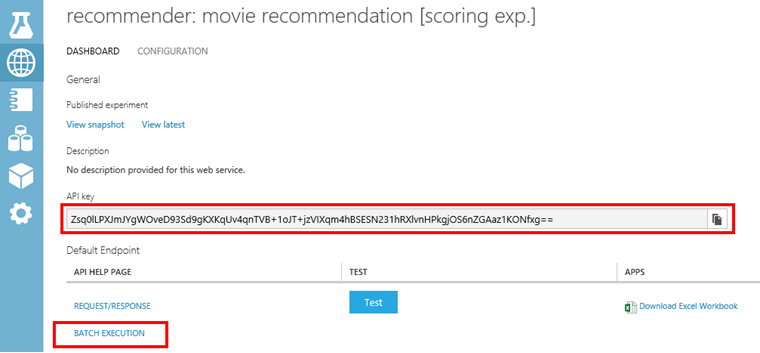
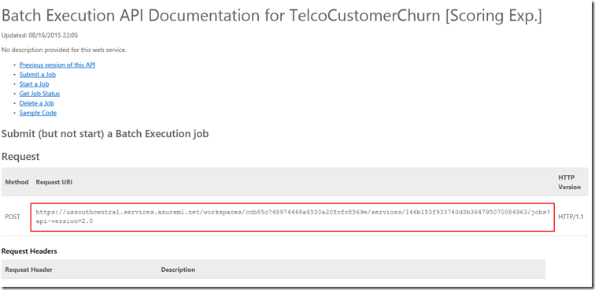
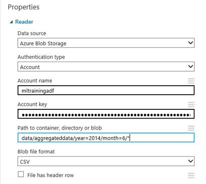

# Create predictive pipelines using Azure Machine Learning and Azure Data Factory

> [!div class="op_single_selector" title1="Transformation Activities"]
> * [Hive Activity](data-factory-hive-activity.md)
> * [Pig Activity](data-factory-pig-activity.md)
> * [MapReduce Activity](data-factory-map-reduce.md)
> * [Hadoop Streaming Activity](data-factory-hadoop-streaming-activity.md)
> * [Spark Activity](data-factory-spark.md)
> * [Machine Learning Batch Execution Activity](data-factory-azure-ml-batch-execution-activity.md)
> * [Machine Learning Update Resource Activity](data-factory-azure-ml-update-resource-activity.md)
> * [Stored Procedure Activity](data-factory-stored-proc-activity.md)
> * [Data Lake Analytics U-SQL Activity](data-factory-usql-activity.md)
> * [.NET Custom Activity](data-factory-use-custom-activities.md)

## Introduction
> [!NOTE]
> This article applies to version 1 of Data Factory. If you are using the current version of the Data Factory service, see [transform data using machine learning in Data Factory](../transform-data-using-machine-learning.md).


### Azure Machine Learning
[Azure Machine Learning](https://azure.microsoft.com/documentation/services/machine-learning/) enables you to build, test, and deploy predictive analytics solutions. From a high-level point of view, it is done in three steps:

1. **Create a training experiment**. You do this step by using the Azure Machine Learning studio. Azure Machine Learning studio is a collaborative visual development environment that you use to train and test a predictive analytics model using training data.
2. **Convert it to a predictive experiment**. Once your model has been trained with existing data and you are ready to use it to score new data, you prepare and streamline your experiment for scoring.
3. **Deploy it as a web service**. You can publish your scoring experiment as an Azure web service. You can send data to your model via this web service end point and receive result predictions fro the model.

### Azure Data Factory
Data Factory is a cloud-based data integration service that orchestrates and automates the **movement** and **transformation** of data. You can create data integration solutions using Azure Data Factory that can ingest data from various data stores, transform/process the data, and publish the result data to the data stores.

Data Factory service allows you to create data pipelines that move and transform data, and then run the pipelines on a specified schedule (hourly, daily, weekly, etc.). It also provides rich visualizations to display the lineage and dependencies between your data pipelines, and monitor all your data pipelines from a single unified view to easily pinpoint issues and setup monitoring alerts.

See [Introduction to Azure Data Factory](data-factory-introduction.md) and [Build your first pipeline](data-factory-build-your-first-pipeline.md) articles to quickly get started with the Azure Data Factory service.

### Data Factory and Machine Learning together
Azure Data Factory enables you to easily create pipelines that use a published [Azure Machine Learning][azure-machine-learning] web service for predictive analytics. Using the **Batch Execution Activity** in an Azure Data Factory pipeline, you can invoke an Azure Machine Learning studio web service to make predictions on the data in batch. See Invoking an Azure Machine Learning studio web service using the Batch Execution Activity section for details.

Over time, the predictive models in the Azure Machine Learning studio scoring experiments need to be retrained using new input datasets. You can retrain an Azure Machine Learning studio model from a Data Factory pipeline by doing the following steps:

1. Publish the training experiment (not predictive experiment) as a web service. You do this step in the Azure Machine Learning studio as you did to expose predictive experiment as a web service in the previous scenario.
2. Use the Azure Machine Learning studio Batch Execution Activity to invoke the web service for the training experiment. Basically, you can use the Azure Machine Learning studio Batch Execution activity to invoke both training web service and scoring web service.

After you are done with retraining, update the scoring web service (predictive experiment exposed as a web service) with the newly trained model by using the **Azure Machine Learning studio Update Resource Activity**. See [Updating models using Update Resource Activity](data-factory-azure-ml-update-resource-activity.md) article for details.

## Invoking a web service using Batch Execution Activity
You use Azure Data Factory to orchestrate data movement and processing, and then perform batch execution using Azure Machine Learning. Here are the top-level steps:

1. Create an Azure Machine Learning linked service. You need the following values:

   1. **Request URI** for the Batch Execution API. You can find the Request URI by clicking the **BATCH EXECUTION** link in the web services page.
   2. **API key** for the published Azure Machine Learning web service. You can find the API key by clicking the web service that you have published.
   3. Use the **AzureMLBatchExecution** activity.

      

      

### Scenario: Experiments using Web service inputs/outputs that refer to data in Azure Blob Storage
In this scenario, the Azure Machine Learning Web service makes predictions using data from a file in an Azure blob storage and stores the prediction results in the blob storage. The following JSON defines a Data Factory pipeline with an AzureMLBatchExecution activity. The activity has the dataset **DecisionTreeInputBlob** as input and **DecisionTreeResultBlob** as the output. The **DecisionTreeInputBlob** is passed as an input to the web service by using the **webServiceInput** JSON property. The **DecisionTreeResultBlob** is passed as an output to the Web service by using the **webServiceOutputs** JSON property.

> [!IMPORTANT]
> If the web service takes multiple inputs, use the **webServiceInputs** property instead of using **webServiceInput**. See the [Web service requires multiple inputs](#web-service-requires-multiple-inputs) section for an example of using the webServiceInputs property.
>
> Datasets that are referenced by the **webServiceInput**/**webServiceInputs** and **webServiceOutputs** properties (in **typeProperties**) must also be included in the Activity **inputs** and **outputs**.
>
> In your Azure Machine Learning studio experiment, web service input and output ports and global parameters have default names ("input1", "input2") that you can customize. The names you use for webServiceInputs, webServiceOutputs, and globalParameters settings must exactly match the names in the experiments. You can view the sample request payload on the Batch Execution Help page for your Azure Machine Learning studio endpoint to verify the expected mapping.
>
>

```JSON
{
  "name": "PredictivePipeline",
  "properties": {
    "description": "use AzureML model",
    "activities": [
      {
        "name": "MLActivity",
        "type": "AzureMLBatchExecution",
        "description": "prediction analysis on batch input",
        "inputs": [
          {
            "name": "DecisionTreeInputBlob"
          }
        ],
        "outputs": [
          {
            "name": "DecisionTreeResultBlob"
          }
        ],
        "linkedServiceName": "MyAzureMLLinkedService",
        "typeProperties":
        {
            "webServiceInput": "DecisionTreeInputBlob",
            "webServiceOutputs": {
                "output1": "DecisionTreeResultBlob"
            }
        },
        "policy": {
          "concurrency": 3,
          "executionPriorityOrder": "NewestFirst",
          "retry": 1,
          "timeout": "02:00:00"
        }
      }
    ],
    "start": "2016-02-13T00:00:00Z",
    "end": "2016-02-14T00:00:00Z"
  }
}
```
> [!NOTE]
> Only inputs and outputs of the AzureMLBatchExecution activity can be passed as parameters to the Web service. For example, in the above JSON snippet, DecisionTreeInputBlob is an input to the AzureMLBatchExecution activity, which is passed as an input to the Web service via webServiceInput parameter.
>
>

### Example
This example uses Azure Storage to hold both the input and output data.

We recommend that you go through the [Build your first pipeline with Data Factory][adf-build-1st-pipeline] tutorial before going through this example. Use the Data Factory Editor to create Data Factory artifacts (linked services, datasets, pipeline) in this example.

1. Create a **linked service** for your **Azure Storage**. If the input and output files are in different storage accounts, you need two linked services. Here is a JSON example:

	```JSON
	{
	  "name": "StorageLinkedService",
	  "properties": {
	    "type": "AzureStorage",
	    "typeProperties": {
	      "connectionString": "DefaultEndpointsProtocol=https;AccountName=[acctName];AccountKey=[acctKey]"
	    }
	  }
	}
    ```
2. Create the **input** Azure Data Factory **dataset**. Unlike some other Data Factory datasets, these datasets must contain both **folderPath** and **fileName** values. You can use partitioning to cause each batch execution (each data slice) to process or produce unique input and output files. You may need to include some upstream activity to transform the input into the CSV file format and place it in the storage account for each slice. In that case, you would not include the **external** and **externalData** settings shown in the following example, and your DecisionTreeInputBlob would be the output dataset of a different Activity.

	```JSON
	{
	  "name": "DecisionTreeInputBlob",
	  "properties": {
	    "type": "AzureBlob",
	    "linkedServiceName": "StorageLinkedService",
	    "typeProperties": {
	      "folderPath": "azuremltesting/input",
	      "fileName": "in.csv",
	      "format": {
	        "type": "TextFormat",
	        "columnDelimiter": ","
	      }
	    },
	    "external": true,
	    "availability": {
	      "frequency": "Day",
	      "interval": 1
	    },
	    "policy": {
	      "externalData": {
	        "retryInterval": "00:01:00",
	        "retryTimeout": "00:10:00",
	        "maximumRetry": 3
	      }
	    }
	  }
	}
    ```

    Your input csv file must have the column header row. If you are using the **Copy Activity** to create/move the csv into the blob storage, you should set the sink property **blobWriterAddHeader** to **true**. For example:

	```JSON
	sink:
    {
    	"type": "BlobSink",
        "blobWriterAddHeader": true
	}
    ```

    If the csv file does not have the header row, you may see the following error: **Error in Activity: Error reading string. Unexpected token: StartObject. Path '', line 1, position 1**.
3. Create the **output** Azure Data Factory **dataset**. This example uses partitioning to create a unique output path for each slice execution. Without the partitioning, the activity would overwrite the file.

	```JSON
	{
	  "name": "DecisionTreeResultBlob",
	  "properties": {
	    "type": "AzureBlob",
	    "linkedServiceName": "StorageLinkedService",
	    "typeProperties": {
	      "folderPath": "azuremltesting/scored/{folderpart}/",
	      "fileName": "{filepart}result.csv",
	      "partitionedBy": [
	        {
	          "name": "folderpart",
	          "value": {
	            "type": "DateTime",
	            "date": "SliceStart",
	            "format": "yyyyMMdd"
	          }
	        },
	        {
	          "name": "filepart",
	          "value": {
	            "type": "DateTime",
	            "date": "SliceStart",
	            "format": "HHmmss"
	          }
	        }
	      ],
	      "format": {
	        "type": "TextFormat",
	        "columnDelimiter": ","
	      }
	    },
	    "availability": {
	      "frequency": "Day",
	      "interval": 15
	    }
	  }
	}
    ```
4. Create a **linked service** of type: **AzureMLLinkedService**, providing the API key and model batch execution URL.

	```JSON
	{
	  "name": "MyAzureMLLinkedService",
	  "properties": {
	    "type": "AzureML",
	    "typeProperties": {
	      "mlEndpoint": "https://[batch execution endpoint]/jobs",
	      "apiKey": "[apikey]"
	    }
	  }
	}
    ```
5. Finally, author a pipeline containing an **AzureMLBatchExecution** Activity. At runtime, pipeline performs the following steps:

   1. Gets the location of the input file from your input datasets.
   2. Invokes the Azure Machine Learning batch execution API
   3. Copies the batch execution output to the blob given in your output dataset.

      > [!NOTE]
      > AzureMLBatchExecution activity can have zero or more inputs and one or more outputs.
      >
      >

      ```JSON
      {
		"name": "PredictivePipeline",
	 	"properties": {
			"description": "use AzureML model",
	   		"activities": [
	     	{
	       		"name": "MLActivity",
	       		"type": "AzureMLBatchExecution",
	       		"description": "prediction analysis on batch input",
	       		"inputs": [
	         	{
	           		"name": "DecisionTreeInputBlob"
	         	}
	       		],
	       		"outputs": [
	         	{
	           		"name": "DecisionTreeResultBlob"
	         	}
	       		],
	       		"linkedServiceName": "MyAzureMLLinkedService",
	       		"typeProperties":
	       		{
	           		"webServiceInput": "DecisionTreeInputBlob",
	           		"webServiceOutputs": {
	               		"output1": "DecisionTreeResultBlob"
	           		}
	       		},
	       		"policy": {
	        		"concurrency": 3,
	         		"executionPriorityOrder": "NewestFirst",
	         		"retry": 1,
	         		"timeout": "02:00:00"
	       		}
     		}
	   		],
	   		"start": "2016-02-13T00:00:00Z",
	   		"end": "2016-02-14T00:00:00Z"
	 	}
      }
      ```

      Both **start** and **end** datetimes must be in [ISO format](https://en.wikipedia.org/wiki/ISO_8601). For example: 2014-10-14T16:32:41Z. The **end** time is optional. If you do not specify value for the **end** property, it is calculated as "**start + 48 hours.**" To run the pipeline indefinitely, specify **9999-09-09** as the value for the **end** property. See [JSON Scripting Reference](https://msdn.microsoft.com/library/dn835050.aspx) for details about JSON properties.

      > [!NOTE]
      > Specifying input for the AzureMLBatchExecution activity is optional.
      >
      >

### Scenario: Experiments using Reader/Writer Modules to refer to data in various storages
Another common scenario when creating Azure Machine Learning studio experiments is to use Reader and Writer modules. The reader module is used to load data into an experiment and the writer module is to save data from your experiments. For details about reader and writer modules, see [Reader](https://msdn.microsoft.com/library/azure/dn905997.aspx) and [Writer](https://msdn.microsoft.com/library/azure/dn905984.aspx) topics on MSDN Library.

When using the reader and writer modules, it is good practice to use a Web service parameter for each property of these reader/writer modules. These web parameters enable you to configure the values during runtime. For example, you could create an experiment with a reader module that uses an Azure SQL Database: XXX.database.windows.net. After the web service has been deployed, you want to enable the consumers of the web service to specify another logical SQL server called YYY.database.windows.net. You can use a Web service parameter to allow this value to be configured.

> [!NOTE]
> Web service input and output are different from Web service parameters. In the first scenario, you have seen how an input and output can be specified for an Azure Machine Learning studio Web service. In this scenario, you pass parameters for a Web service that correspond to properties of reader/writer modules.
>
>

Let's look at a scenario for using Web service parameters. You have a deployed Azure Machine Learning web service that uses a reader module to read data from one of the data sources supported by Azure Machine Learning (for example: Azure SQL Database). After the batch execution is performed, the results are written using a Writer module (Azure SQL Database).  No web service inputs and outputs are defined in the experiments. In this case, we recommend that you configure relevant web service parameters for the reader and writer modules. This configuration allows the reader/writer modules to be configured when using the AzureMLBatchExecution activity. You specify Web service parameters in the **globalParameters** section in the activity JSON as follows.

```JSON
"typeProperties": {
    "globalParameters": {
        "Param 1": "Value 1",
        "Param 2": "Value 2"
    }
}
```

You can also use [Data Factory Functions](data-factory-functions-variables.md) in passing values for the Web service parameters as shown in the following example:

```JSON
"typeProperties": {
	"globalParameters": {
       "Database query": "$$Text.Format('SELECT * FROM myTable WHERE timeColumn = \\'{0:yyyy-MM-dd HH:mm:ss}\\'', Time.AddHours(WindowStart, 0))"
    }
}
```

> [!NOTE]
> The Web service parameters are case-sensitive, so ensure that the names you specify in the activity JSON match the ones exposed by the Web service.
>
>

### Using a Reader module to read data from multiple files in Azure Blob
Big data pipelines with activities such as Pig and Hive can produce one or more output files with no extensions. For example, when you specify an external Hive table, the data for the external Hive table can be stored in Azure blob storage with the following name 000000_0. You can use the reader module in an experiment to read multiple files, and use them for predictions.

When using the reader module in an Azure Machine Learning experiment, you can specify Azure Blob as an input. The files in the Azure blob storage can be the output files (Example: 000000_0) that are produced by a Pig and Hive script running on HDInsight. The reader module allows you to read files (with no extensions) by configuring the **Path to container, directory/blob**. The **Path to container** points to the container and **directory/blob** points to folder that contains the files as shown in the following image. The asterisk that is, \*) **specifies that all the files in the container/folder (that is, data/aggregateddata/year=2014/month-6/\*)** are read as part of the experiment.



### Example
#### Pipeline with AzureMLBatchExecution activity with Web Service Parameters

```JSON
{
  "name": "MLWithSqlReaderSqlWriter",
  "properties": {
    "description": "Azure Machine Learning studio model with sql azure reader/writer",
    "activities": [
      {
        "name": "MLSqlReaderSqlWriterActivity",
        "type": "AzureMLBatchExecution",
        "description": "test",
        "inputs": [
          {
            "name": "MLSqlInput"
          }
        ],
        "outputs": [
          {
            "name": "MLSqlOutput"
          }
        ],
        "linkedServiceName": "MLSqlReaderSqlWriterDecisionTreeModel",
        "typeProperties":
        {
            "webServiceInput": "MLSqlInput",
            "webServiceOutputs": {
                "output1": "MLSqlOutput"
            }
              "globalParameters": {
                "Database server name": "<myserver>.database.windows.net",
                "Database name": "<database>",
                "Server user account name": "<user name>",
                "Server user account password": "<password>"
              }
        },
        "policy": {
          "concurrency": 1,
          "executionPriorityOrder": "NewestFirst",
          "retry": 1,
          "timeout": "02:00:00"
        },
      }
    ],
    "start": "2016-02-13T00:00:00Z",
    "end": "2016-02-14T00:00:00Z"
  }
}
```

In the above JSON example:

* The deployed Azure Machine Learning Web service uses a reader and a writer module to read/write data from/to an Azure SQL Database. This Web service exposes the following four parameters:  Database server name, Database name, Server user account name, and Server user account password.
* Both **start** and **end** datetimes must be in [ISO format](https://en.wikipedia.org/wiki/ISO_8601). For example: 2014-10-14T16:32:41Z. The **end** time is optional. If you do not specify value for the **end** property, it is calculated as "**start + 48 hours.**" To run the pipeline indefinitely, specify **9999-09-09** as the value for the **end** property. See [JSON Scripting Reference](https://msdn.microsoft.com/library/dn835050.aspx) for details about JSON properties.

### Other scenarios
#### Web service requires multiple inputs
If the web service takes multiple inputs, use the **webServiceInputs** property instead of using **webServiceInput**. Datasets that are referenced by the **webServiceInputs** must also be included in the Activity **inputs**.

In your Azure Machine Learning studio experiment, web service input and output ports and global parameters have default names ("input1", "input2") that you can customize. The names you use for webServiceInputs, webServiceOutputs, and globalParameters settings must exactly match the names in the experiments. You can view the sample request payload on the Batch Execution Help page for your Azure Machine Learning studio endpoint to verify the expected mapping.

```JSON
{
    "name": "PredictivePipeline",
    "properties": {
        "description": "use AzureML model",
        "activities": [{
            "name": "MLActivity",
            "type": "AzureMLBatchExecution",
            "description": "prediction analysis on batch input",
            "inputs": [{
                "name": "inputDataset1"
            }, {
                "name": "inputDataset2"
            }],
            "outputs": [{
                "name": "outputDataset"
            }],
            "linkedServiceName": "MyAzureMLLinkedService",
            "typeProperties": {
                "webServiceInputs": {
                    "input1": "inputDataset1",
                    "input2": "inputDataset2"
                },
                "webServiceOutputs": {
                    "output1": "outputDataset"
                }
            },
            "policy": {
                "concurrency": 3,
                "executionPriorityOrder": "NewestFirst",
                "retry": 1,
                "timeout": "02:00:00"
            }
        }],
        "start": "2016-02-13T00:00:00Z",
        "end": "2016-02-14T00:00:00Z"
    }
}
```

#### Web Service does not require an input
Azure Machine Learning studio batch execution web services can be used to run any workflows, for example R or Python scripts, that may not require any inputs. Or, the experiment might be configured with a Reader module that does not expose any GlobalParameters. In that case, the AzureMLBatchExecution Activity would be configured as follows:

```JSON
{
    "name": "scoring service",
    "type": "AzureMLBatchExecution",
    "outputs": [
        {
            "name": "myBlob"
        }
    ],
    "typeProperties": {
        "webServiceOutputs": {
            "output1": "myBlob"
        }
     },
    "linkedServiceName": "mlEndpoint",
    "policy": {
        "concurrency": 1,
        "executionPriorityOrder": "NewestFirst",
        "retry": 1,
        "timeout": "02:00:00"
    }
},
```

#### Web Service does not require an input/output
The Azure Machine Learning studio batch execution web service might not have any Web Service output configured. In this example, there is no Web Service input or output, nor are any GlobalParameters configured. There is still an output configured on the activity itself, but it is not given as a webServiceOutput.

```JSON
{
    "name": "retraining",
    "type": "AzureMLBatchExecution",
    "outputs": [
        {
            "name": "placeholderOutputDataset"
        }
    ],
    "typeProperties": {
     },
    "linkedServiceName": "mlEndpoint",
    "policy": {
        "concurrency": 1,
        "executionPriorityOrder": "NewestFirst",
        "retry": 1,
        "timeout": "02:00:00"
    }
},
```

#### Web Service uses readers and writers, and the activity runs only when other activities have succeeded
The Azure Machine Learning studio web service reader and writer modules might be configured to run with or without any GlobalParameters. However, you may want to embed service calls in a pipeline that uses dataset dependencies to invoke the service only when some upstream processing has completed. You can also trigger some other action after the batch execution has completed using this approach. In that case, you can express the dependencies using activity inputs and outputs, without naming any of them as Web Service inputs or outputs.

```JSON
{
    "name": "retraining",
    "type": "AzureMLBatchExecution",
    "inputs": [
        {
            "name": "upstreamData1"
        },
        {
            "name": "upstreamData2"
        }
    ],
    "outputs": [
        {
            "name": "downstreamData"
        }
    ],
    "typeProperties": {
     },
    "linkedServiceName": "mlEndpoint",
    "policy": {
        "concurrency": 1,
        "executionPriorityOrder": "NewestFirst",
        "retry": 1,
        "timeout": "02:00:00"
    }
},
```

The **takeaways** are:

* If your experiment endpoint uses a webServiceInput: it is represented by a blob dataset and is included in the activity inputs and the webServiceInput property. Otherwise, the webServiceInput property is omitted.
* If your experiment endpoint uses webServiceOutput(s): they are represented by blob datasets and are included in the activity outputs and in the webServiceOutputs property. The activity outputs and webServiceOutputs are mapped by the name of each output in the experiment. Otherwise, the webServiceOutputs property is omitted.
* If your experiment endpoint exposes globalParameter(s), they are given in the activity globalParameters property as key, value pairs. Otherwise, the globalParameters property is omitted. The keys are case-sensitive. [Azure Data Factory functions](data-factory-functions-variables.md) may be used in the values.
* Additional datasets may be included in the Activity inputs and outputs properties, without being referenced in the Activity typeProperties. These datasets govern execution using slice dependencies but are otherwise ignored by the AzureMLBatchExecution Activity.


## Updating models using Update Resource Activity
After you are done with retraining, update the scoring web service (predictive experiment exposed as a web service) with the newly trained model by using the **Azure Machine Learning studio Update Resource Activity**. See [Updating models using Update Resource Activity](data-factory-azure-ml-update-resource-activity.md) article for details.

### Reader and Writer Modules
A common scenario for using Web service parameters is the use of Azure SQL Readers and Writers. The reader module is used to load data into an experiment from data management services outside Azure Machine Learning Studio. The writer module is to save data from your experiments into data management services outside Azure Machine Learning Studio.

For details about Azure Blob/Azure SQL reader/writer, see [Reader](https://msdn.microsoft.com/library/azure/dn905997.aspx) and [Writer](https://msdn.microsoft.com/library/azure/dn905984.aspx) topics on MSDN Library. The example in the previous section used the Azure Blob reader and Azure Blob writer. This section discusses using Azure SQL reader and Azure SQL writer.

## Frequently asked questions
**Q:** I have multiple files that are generated by my big data pipelines. Can I use the AzureMLBatchExecution Activity to work on all the files?

**A:** Yes. See the **Using a Reader module to read data from multiple files in Azure Blob** section for details.

## Azure Machine Learning studio Batch Scoring Activity
If you are using the **AzureMLBatchScoring** activity to integrate with Azure Machine Learning, we recommend that you use the latest **AzureMLBatchExecution** activity.

The AzureMLBatchExecution activity is introduced in the August 2015 release of Azure SDK and Azure PowerShell.

If you want to continue using the AzureMLBatchScoring activity, continue reading through this section.

### Azure Machine Learning studio Batch Scoring activity using Azure Storage for input/output

```JSON
{
  "name": "PredictivePipeline",
  "properties": {
    "description": "use AzureML model",
    "activities": [
      {
        "name": "MLActivity",
        "type": "AzureMLBatchScoring",
        "description": "prediction analysis on batch input",
        "inputs": [
          {
            "name": "ScoringInputBlob"
          }
        ],
        "outputs": [
          {
            "name": "ScoringResultBlob"
          }
        ],
        "linkedServiceName": "MyAzureMLLinkedService",
        "policy": {
          "concurrency": 3,
          "executionPriorityOrder": "NewestFirst",
          "retry": 1,
          "timeout": "02:00:00"
        }
      }
    ],
    "start": "2016-02-13T00:00:00Z",
    "end": "2016-02-14T00:00:00Z"
  }
}
```

### Web Service Parameters
To specify values for Web service parameters, add a **typeProperties** section to the **AzureMLBatchScoringActivity** section in the pipeline JSON as shown in the following example:

```JSON
"typeProperties": {
    "webServiceParameters": {
        "Param 1": "Value 1",
        "Param 2": "Value 2"
    }
}
```
You can also use [Data Factory Functions](data-factory-functions-variables.md) in passing values for the Web service parameters as shown in the following example:

```JSON
"typeProperties": {
    "webServiceParameters": {
       "Database query": "$$Text.Format('SELECT * FROM myTable WHERE timeColumn = \\'{0:yyyy-MM-dd HH:mm:ss}\\'', Time.AddHours(WindowStart, 0))"
    }
}
```

> [!NOTE]
> The Web service parameters are case-sensitive, so ensure that the names you specify in the activity JSON match the ones exposed by the Web service.
>
>

## See Also
* [Azure blog post: Getting started with Azure Data Factory and Azure Machine Learning](https://azure.microsoft.com/blog/getting-started-with-azure-data-factory-and-azure-machine-learning-4/)

[adf-build-1st-pipeline]: data-factory-build-your-first-pipeline.md

[azure-machine-learning]: https://azure.microsoft.com/services/machine-learning/
