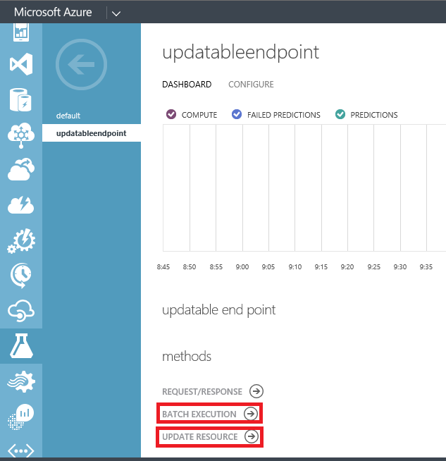
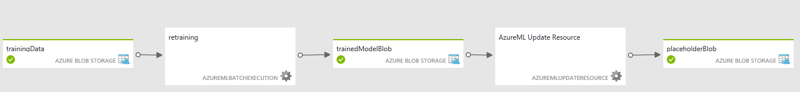

# Updating Azure Machine Learning models using Update Resource Activity

> [!div class="op_single_selector" title1="Transformation Activities"]
> * [Hive Activity](data-factory-hive-activity.md) 
> * [Pig Activity](data-factory-pig-activity.md)
> * [MapReduce Activity](data-factory-map-reduce.md)
> * [Hadoop Streaming Activity](data-factory-hadoop-streaming-activity.md)
> * [Spark Activity](data-factory-spark.md)
> * [Machine Learning Batch Execution Activity](data-factory-azure-ml-batch-execution-activity.md)
> * [Machine Learning Update Resource Activity](data-factory-azure-ml-update-resource-activity.md)
> * [Stored Procedure Activity](data-factory-stored-proc-activity.md)
> * [Data Lake Analytics U-SQL Activity](data-factory-usql-activity.md)
> * [.NET Custom Activity](data-factory-use-custom-activities.md)


> [!NOTE]
> This article applies to version 1 of Data Factory. If you are using the current version of the Data Factory service, see [update machine learning models in Data Factory](../update-machine-learning-models.md).

This article complements the main Azure Data Factory - Azure Machine Learning integration article: [Create predictive pipelines using Azure Machine Learning and Azure Data Factory](data-factory-azure-ml-batch-execution-activity.md). If you haven't already done so, review the main article before reading through this article. 

## Overview
Over time, the predictive models in the Azure ML scoring experiments need to be retrained using new input datasets. After you are done with retraining, you want to update the scoring web service with the retrained ML model. The typical steps to enable retraining and updating Azure ML models via web services are:

1. Create an experiment in [Azure Machine Learning Studio (classic)](https://studio.azureml.net).
2. When you are satisfied with the model, use Azure Machine Learning Studio (classic) to publish web services for both the **training experiment** and scoring/**predictive experiment**.

The following table describes the web services used in this example.  See [Retrain Machine Learning Studio (classic) models programmatically](../../machine-learning/studio/retrain-machine-learning-model.md) for details.

- **Training web service** - Receives training data and produces trained models. The output of the retraining is an .ilearner file in an Azure Blob storage. The **default endpoint** is automatically created for you when you publish the training experiment as a web service. You can create more endpoints but the example uses only the default endpoint.
- **Scoring web service** - Receives unlabeled data examples and makes predictions. The output of prediction could have various forms, such as a .csv file or rows in an Azure SQL database, depending on the configuration of the experiment. The default endpoint is automatically created for you when you publish the predictive experiment as a web service. 

The following picture depicts the relationship between training and scoring endpoints in Azure ML.


You can invoke the **training web service** by using the **Azure ML Batch Execution Activity**. Invoking a training web service is same as invoking an Azure ML web service (scoring web service) for scoring data. The preceding sections cover how to invoke an Azure ML web service from an Azure Data Factory pipeline in detail. 

You can invoke the **scoring web service** by using the **Azure ML Update Resource Activity** to update the web service with the newly trained model. The following examples provide linked service definitions: 

## Scoring web service is a classic web service
If the scoring web service is a **classic web service**, create the second **non-default and updatable endpoint** by using the Azure portal. See [Create Endpoints](../../machine-learning/machine-learning-create-endpoint.md) article for steps. After you create the non-default updatable endpoint, do the following steps:

* Click **BATCH EXECUTION** to get the URI value for the **mlEndpoint** JSON property.
* Click **UPDATE RESOURCE** link to get the URI value for the **updateResourceEndpoint** JSON property. The API key is on the endpoint page itself (in the bottom-right corner).



The following example provides a sample JSON definition for the AzureML linked service. The linked service uses the apiKey for authentication.  

```json
{
    "name": "updatableScoringEndpoint2",
    "properties": {
        "type": "AzureML",
        "typeProperties": {
            "mlEndpoint": "https://ussouthcentral.services.azureml.net/workspaces/xxx/services/--scoring experiment--/jobs",
            "apiKey": "endpoint2Key",
            "updateResourceEndpoint": "https://management.azureml.net/workspaces/xxx/webservices/--scoring experiment--/endpoints/endpoint2"
        }
    }
}
```

## Scoring web service is Azure Resource Manager web service 
If the web service is the new type of web service that exposes an Azure Resource Manager endpoint, you do not need to add the second **non-default** endpoint. The **updateResourceEndpoint** in the linked service is of the format: 

```
https://management.azure.com/subscriptions/{subscriptionId}/resourceGroups/{resource-group-name}/providers/Microsoft.MachineLearning/webServices/{web-service-name}?api-version=2016-05-01-preview. 
```

You can get values for place holders in the URL when querying the web service on the [Azure Machine Learning Web Services Portal](https://services.azureml.net/). The new type of update resource endpoint requires an AAD (Azure Active Directory) token. Specify **servicePrincipalId** and **servicePrincipalKey** in the Azure Machine Learning linked service. See [how to create service principal and assign permissions to manage Azure resource](../../active-directory/develop/howto-create-service-principal-portal.md). Here is a sample AzureML linked service definition: 

```json
{
    "name": "AzureMLLinkedService",
    "properties": {
        "type": "AzureML",
        "description": "The linked service for AML web service.",
        "typeProperties": {
            "mlEndpoint": "https://ussouthcentral.services.azureml.net/workspaces/0000000000000000000000000000000000000/services/0000000000000000000000000000000000000/jobs?api-version=2.0",
            "apiKey": "xxxxxxxxxxxx",
            "updateResourceEndpoint": "https://management.azure.com/subscriptions/00000000-0000-0000-0000-000000000000/resourceGroups/myRG/providers/Microsoft.MachineLearning/webServices/myWebService?api-version=2016-05-01-preview",
            "servicePrincipalId": "000000000-0000-0000-0000-0000000000000",
            "servicePrincipalKey": "xxxxx",
            "tenant": "mycompany.com"
        }
    }
}
```

The following scenario provides more details. It has an example for retraining and updating Azure ML models from an Azure Data Factory pipeline.

## Scenario: retraining and updating an Azure ML model
This section provides a sample pipeline that uses the **Azure ML Batch Execution activity** to retrain a model. The pipeline also uses the **Azure ML Update Resource activity** to update the model in the scoring web service. The section also provides JSON snippets for all the linked services, datasets, and pipeline in the example.

Here is the diagram view of the sample pipeline. As you can see, the Azure ML Batch Execution Activity takes the training input and produces a training output (iLearner file). The Azure ML Update Resource Activity takes this training output and updates the model in the scoring web service endpoint. The Update Resource Activity does not produce any output. The placeholderBlob is just a dummy output dataset that is required by the Azure Data Factory service to run the pipeline.



### Azure Blob storage linked service:
The Azure Storage holds the following data:

* training data. The input data for the Azure ML training web service.  
* iLearner file. The output from the Azure ML training web service. This file is also the input to the Update Resource activity.  

Here is the sample JSON definition of the linked service:

```JSON
{
    "name": "StorageLinkedService",
      "properties": {
        "type": "AzureStorage",
        "typeProperties": {
            "connectionString": "DefaultEndpointsProtocol=https;AccountName=name;AccountKey=key"
        }
    }
}
```

### Training input dataset:
The following dataset represents the input training data for the Azure Machine Learning training web service. The Azure Machine Learning Batch Execution activity takes this dataset as an input.

```JSON
{
    "name": "trainingData",
    "properties": {
        "type": "AzureBlob",
        "linkedServiceName": "StorageLinkedService",
        "typeProperties": {
            "folderPath": "labeledexamples",
            "fileName": "labeledexamples.arff",
            "format": {
                "type": "TextFormat"
            }
        },
        "availability": {
            "frequency": "Week",
            "interval": 1
        },
        "policy": {          
            "externalData": {
                "retryInterval": "00:01:00",
                "retryTimeout": "00:10:00",
                "maximumRetry": 3
            }
        }
    }
}
```

### Training output dataset:
The following dataset represents the output iLearner file from the Azure ML training web service. The Azure ML Batch Execution Activity produces this dataset. This dataset is also the input to the Azure ML Update Resource activity.

```JSON
{
    "name": "trainedModelBlob",
    "properties": {
        "type": "AzureBlob",
        "linkedServiceName": "StorageLinkedService",
        "typeProperties": {
            "folderPath": "trainingoutput",
            "fileName": "model.ilearner",
            "format": {
                "type": "TextFormat"
            }
        },
        "availability": {
            "frequency": "Week",
            "interval": 1
        }
    }
}
```

### Linked service for Azure Machine Learning training endpoint
The following JSON snippet defines an Azure Machine Learning linked service that points to the default endpoint of the training web service.

```JSON
{    
    "name": "trainingEndpoint",
      "properties": {
        "type": "AzureML",
        "typeProperties": {
            "mlEndpoint": "https://ussouthcentral.services.azureml.net/workspaces/xxx/services/--training experiment--/jobs",
              "apiKey": "myKey"
        }
      }
}
```

In **Azure Machine Learning Studio (classic)**, do the following to get values for **mlEndpoint** and **apiKey**:

1. Click **WEB SERVICES** on the left menu.
2. Click the **training web service** in the list of web services.
3. Click copy next to **API key** text box. Paste the key in the clipboard into the Data Factory JSON editor.
4. In the **Azure Machine Learning Studio (classic)**, click **BATCH EXECUTION** link.
5. Copy the **Request URI** from the **Request** section and paste it into the Data Factory JSON editor.   

### Linked Service for Azure ML updatable scoring endpoint:
The following JSON snippet defines an Azure Machine Learning linked service that points to the non-default updatable endpoint of the scoring web service.  

```JSON
{
    "name": "updatableScoringEndpoint2",
    "properties": {
        "type": "AzureML",
        "typeProperties": {
            "mlEndpoint": "https://ussouthcentral.services.azureml.net/workspaces/00000000eb0abe4d6bbb1d7886062747d7/services/00000000026734a5889e02fbb1f65cefd/jobs?api-version=2.0",
            "apiKey": "sooooooooooh3WvG1hBfKS2BNNcfwSO7hhY6dY98noLfOdqQydYDIXyf2KoIaN3JpALu/AKtflHWMOCuicm/Q==",
            "updateResourceEndpoint": "https://management.azure.com/subscriptions/00000000-0000-0000-0000-000000000000/resourceGroups/Default-MachineLearning-SouthCentralUS/providers/Microsoft.MachineLearning/webServices/myWebService?api-version=2016-05-01-preview",
            "servicePrincipalId": "fe200044-c008-4008-a005-94000000731",
            "servicePrincipalKey": "zWa0000000000Tp6FjtZOspK/WMA2tQ08c8U+gZRBlw=",
            "tenant": "mycompany.com"
        }
    }
}
```

### Placeholder output dataset:
The Azure ML Update Resource activity does not generate any output. However, Azure Data Factory requires an output dataset to drive the schedule of a pipeline. Therefore, we use a dummy/placeholder dataset in this example.  

```JSON
{
    "name": "placeholderBlob",
    "properties": {
        "availability": {
            "frequency": "Week",
            "interval": 1
        },
        "type": "AzureBlob",
        "linkedServiceName": "StorageLinkedService",
        "typeProperties": {
            "folderPath": "any",
            "format": {
                "type": "TextFormat"
            }
        }
    }
}
```

### Pipeline
The pipeline has two activities: **AzureMLBatchExecution** and **AzureMLUpdateResource**. The Azure ML Batch Execution activity takes the training data as input and produces an iLearner file as an output. The activity invokes the training web service (training experiment exposed as a web service) with the input training data and receives the ilearner file from the webservice. The placeholderBlob is just a dummy output dataset that is required by the Azure Data Factory service to run the pipeline.


```JSON
{
    "name": "pipeline",
    "properties": {
        "activities": [
            {
                "name": "retraining",
                "type": "AzureMLBatchExecution",
                "inputs": [
                    {
                        "name": "trainingData"
                    }
                ],
                "outputs": [
                    {
                        "name": "trainedModelBlob"
                    }
                ],
                "typeProperties": {
                    "webServiceInput": "trainingData",
                    "webServiceOutputs": {
                        "output1": "trainedModelBlob"
                    }              
                 },
                "linkedServiceName": "trainingEndpoint",
                "policy": {
                    "concurrency": 1,
                    "executionPriorityOrder": "NewestFirst",
                    "retry": 1,
                    "timeout": "02:00:00"
                }
            },
            {
                "type": "AzureMLUpdateResource",
                "typeProperties": {
                    "trainedModelName": "Training Exp for ADF ML [trained model]",
                    "trainedModelDatasetName" :  "trainedModelBlob"
                },
                "inputs": [
                    {
                        "name": "trainedModelBlob"
                    }
                ],
                "outputs": [
                    {
                        "name": "placeholderBlob"
                    }
                ],
                "policy": {
                    "timeout": "01:00:00",
                    "concurrency": 1,
                    "retry": 3
                },
                "name": "AzureML Update Resource",
                "linkedServiceName": "updatableScoringEndpoint2"
            }
        ],
        "start": "2016-02-13T00:00:00Z",
           "end": "2016-02-14T00:00:00Z"
    }
}
```
